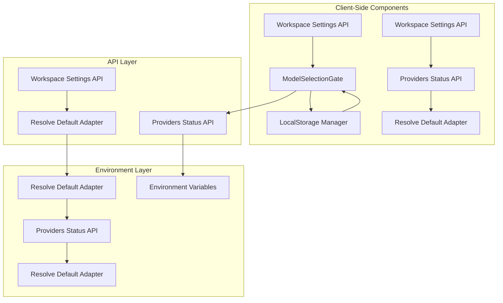
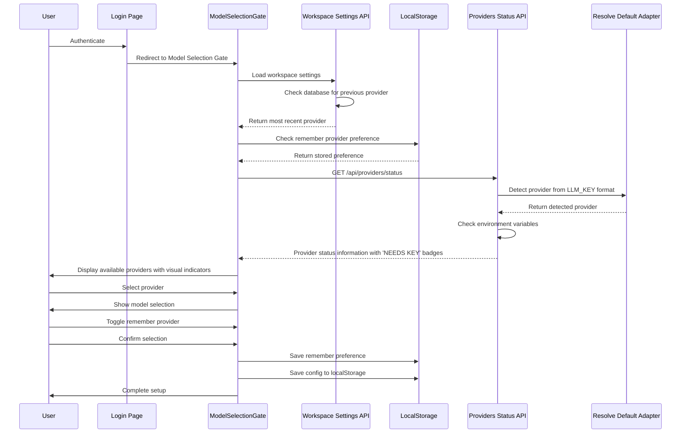
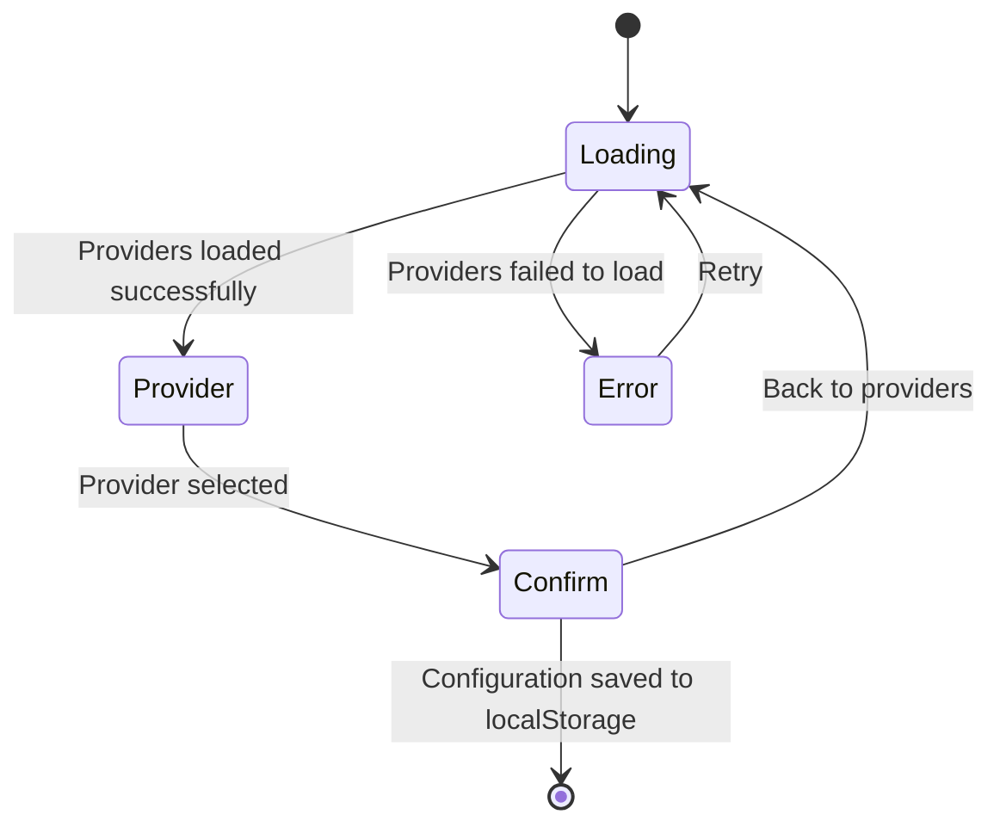
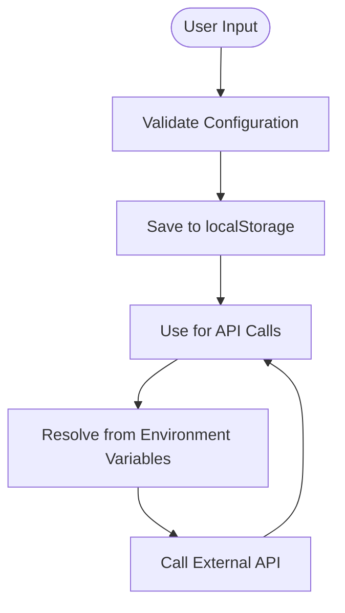
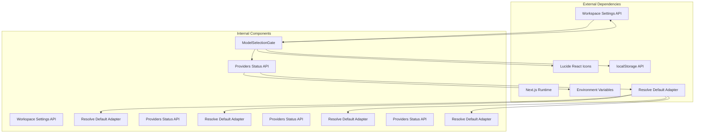

# Model Selection Gate

<cite>
**Referenced Files in This Document**
- [ModelSelectionGate.tsx](file://components/ModelSelectionGate.tsx)
- [providers/status/route.ts](file://app/api/providers/status/route.ts)
- [page.tsx](file://app/page.tsx)
- [login/page.tsx](file://app/login/page.tsx)
- [workspace/settings/route.ts](file://app/api/workspace/settings/route.ts)
- [resolveDefaultAdapter.ts](file://lib/ai/resolveDefaultAdapter.ts)
- [index.ts](file://lib/ai/adapters/index.ts)
- [modelRegistry.ts](file://lib/ai/modelRegistry.ts)
- [VERCEL_CONNECTION_FIX.md](file://VERCEL_CONNECTION_FIX.md)
</cite>

## Update Summary
**Changes Made**
- Updated Ollama support to reflect Cloud-only deployment model with OLLAMA_API_KEY environment variable
- Removed references to self-hosted deployment and local runtime detection
- Enhanced Ollama Cloud service configuration with dedicated API key management
- Updated provider status checking to focus on Ollama Cloud connectivity
- Revised error messaging to reflect Ollama Cloud setup requirements
- **Updated** Code quality improvements: ModelSelectionGate.tsx received dependency cleanup and improved import organization

## Table of Contents
1. [Introduction](#introduction)
2. [Project Structure](#project-structure)
3. [Core Components](#core-components)
4. [Architecture Overview](#architecture-overview)
5. [Detailed Component Analysis](#detailed-component-analysis)
6. [Enhanced Features](#enhanced-features)
7. [Dependency Analysis](#dependency-analysis)
8. [Performance Considerations](#performance-considerations)
9. [Troubleshooting Guide](#troubleshooting-guide)
10. [Conclusion](#conclusion)

## Introduction

The Model Selection Gate is a critical component in the AI-powered accessibility-first UI engine that serves as the mandatory entry point for configuring AI providers and models. This component provides a guided, secure, and user-friendly interface for users to select their preferred AI provider, configure model settings, and establish secure connections to external AI services.

**Updated** The component now operates as a mandatory step in the user journey, always displaying regardless of previous configurations. It enforces a strict flow: Login → Model Selection Gate → UI Engine, ensuring users cannot proceed without proper provider configuration. The gate includes intelligent preselection logic for previously used providers and enhanced user experience features.

The gate operates as a modal overlay that appears when no existing AI configuration is detected in localStorage, ensuring that users cannot proceed with the application until they have properly configured their AI provider settings. This design choice prioritizes security by preventing accidental operation without proper authentication and by providing clear guidance for API key configuration.

**Updated** The component now displays all 4 major AI providers with enhanced visual indicators:
- **OpenAI**: Emerald green branding with GPT-4o models
- **Anthropic**: Amber orange branding with Claude models  
- **Google Gemini**: Blue branding with Gemini 2.0 Flash and 1.5 Pro
- **Groq**: Orange branding with ultra-fast Llama and Mixtral models
- **Ollama**: Purple branding for Ollama Cloud service with dedicated API key configuration

**Updated** Enhanced provider status checking now supports universal LLM_KEY detection with auto-detection of provider from key format, improving the configuration experience.

## Project Structure

The Model Selection Gate has been redesigned to operate as a mandatory component in the user journey with configuration stored in localStorage. The component follows a simplified architecture with clear separation between presentation, local storage management, and security considerations.

**Diagram sources**
- [ModelSelectionGate.tsx:76-81](file://components/ModelSelectionGate.tsx#L76-L81)
- [ModelSelectionGate.tsx:130-141](file://components/ModelSelectionGate.tsx#L130-L141)
- [providers/status/route.ts:137-215](file://app/api/providers/status/route.ts#L137-L215)
- [page.tsx:57-60](file://app/page.tsx#L57-L60)

**Section sources**
- [ModelSelectionGate.tsx:1-455](file://components/ModelSelectionGate.tsx#L1-L455)
- [page.tsx:546-551](file://app/page.tsx#L546-L551)

## Core Components

The Model Selection Gate system has been enhanced to operate as a mandatory component in the user journey with configuration stored in localStorage. The component maintains its core functionality while eliminating server dependencies and adding preselection capabilities.

### Primary Components

**ModelSelectionGate Component**
- Main modal interface for provider selection with enhanced user experience
- Handles loading states, error conditions, and user interactions
- Manages the new 'remember provider' toggle functionality using localStorage
- Integrates with localStorage for preference persistence
- Provides streamlined configuration workflow without server calls
- **Updated**: Enforces mandatory flow after login with always-display behavior
- **Updated**: Includes preselection logic for previously used providers
- **Updated**: Displays all 4 AI providers with visual configuration indicators
- **Updated**: Shows 'NEEDS KEY' badges for unconfigured providers and 'LAST USED' badges for previously selected providers
- **Updated**: Enhanced error messaging with comprehensive environment variable instructions
- **Updated**: Enhanced Ollama support with dedicated API key configuration for Cloud service

**Provider Status API**
- Returns configured providers based on environment variables
- Provides optimized settings for each AI provider
- Supports universal API key configuration with LLM_KEY detection
- Filters providers based on availability and key format
- **Updated**: Enhanced to support LLM_KEY universal key detection with auto-detection of provider from key format
- **Updated**: Simplified to focus solely on provider discovery with enhanced status checking
- **Updated**: Supports all 4 major AI providers with brand-specific configurations
- **Updated**: Improved error reporting with detailed diagnostic information
- **Updated**: Enhanced Ollama Cloud configuration with dedicated API key management

**Workspace Settings API**
- **New**: Loads previously used provider configurations from database
- **New**: Provides preselection logic for enhanced user experience
- **New**: Maintains security by not exposing raw API keys

**Local Storage Management**
- **New**: Client-side configuration persistence using localStorage
- **New**: Remember provider preference management
- **New**: Configuration retrieval and validation
- **New**: Graceful degradation when localStorage is unavailable

**Resolve Default Adapter**
- **New**: Provides universal key detection and provider auto-detection
- **New**: Supports LLM_KEY format-based provider identification
- **New**: Enables seamless integration with universal key configuration
- **Updated**: Enhanced model detection to support Ollama Cloud models

**Section sources**
- [ModelSelectionGate.tsx:65-455](file://components/ModelSelectionGate.tsx#L65-L455)
- [providers/status/route.ts:137-234](file://app/api/providers/status/route.ts#L137-L234)
- [workspace/settings/route.ts:34-55](file://app/api/workspace/settings/route.ts#L34-L55)
- [resolveDefaultAdapter.ts:73-84](file://lib/ai/resolveDefaultAdapter.ts#L73-L84)
- [index.ts:39-69](file://lib/ai/adapters/index.ts#L39-L69)

## Architecture Overview

The Model Selection Gate now implements a mandatory flow architecture that eliminates server dependencies while maintaining security and performance standards. The system operates entirely in the browser with configuration stored locally and enhanced user experience features.

**Diagram sources**
- [ModelSelectionGate.tsx:76-81](file://components/ModelSelectionGate.tsx#L76-L81)
- [ModelSelectionGate.tsx:130-141](file://components/ModelSelectionGate.tsx#L130-L141)
- [providers/status/route.ts:137-215](file://app/api/providers/status/route.ts#L137-L215)
- [page.tsx:57-60](file://app/page.tsx#L57-L60)

The architecture emphasizes several key principles:

**Mandatory Flow Design**: The gate is always displayed after login, ensuring users cannot bypass the configuration step. This design choice prioritizes security and proper onboarding.

**Enhanced User Experience**: The component now includes intelligent preselection logic for previously used providers and remember provider functionality, streamlining the configuration process for returning users.

**Client-Side First Design**: Configuration is managed entirely in the browser using localStorage, eliminating server dependencies and reducing complexity.

**Simplified Security Model**: API keys are resolved through environment variables and never stored in localStorage, maintaining security while simplifying the configuration process.

**Universal Key Support**: Enhanced provider status checking now supports LLM_KEY universal key detection with auto-detection of provider from key format, improving the configuration experience.

**Performance Optimization**: The system eliminates server round-trips for configuration storage, improves response times, and reduces server load.

**Visual Feedback Enhancement**: The component provides clear visual feedback at every step, with loading indicators, error handling, and intuitive navigation between different configuration stages. The new 'NEEDS KEY' and 'LAST USED' badges enhance the user experience by providing immediate visual cues about provider configuration status.

## Detailed Component Analysis

### ModelSelectionGate Component

The ModelSelectionGate component has been redesigned to operate as a mandatory component in the user journey with configuration stored in localStorage. The component maintains its core functionality while eliminating server dependencies and adding preselection capabilities.

#### Component Structure and State Management

The component manages several distinct states to handle the different phases of the configuration process, including the new remember provider functionality:

**Diagram sources**
- [ModelSelectionGate.tsx:70-110](file://components/ModelSelectionGate.tsx#L70-L110)

The component implements a comprehensive state management system with the following key states:

- **Loading State**: Initial state while fetching provider information from the server
- **Provider Selection State**: Displays available providers with their branding and features, including 'NEEDS KEY' and 'LAST USED' visual indicators
- **Confirmation State**: Allows users to review and finalize their selection with remember provider toggle
- **Error State**: Handles configuration failures and provides guidance

#### Enhanced Provider Integration and Branding

The component supports four major AI providers, each with customized branding and optimized settings:

| Provider | Brand Color | Icon | Recommended Models | Configuration Status |
|----------|-------------|------|-------------------|---------------------|
| OpenAI | Emerald Green | ✨ | GPT-4o, GPT-4o-mini, o3-mini | ✅ Ready / ❌ NEEDS KEY |
| Anthropic | Amber Orange | 💻 | Claude 3.5 Sonnet, Claude 3 Opus | ✅ Ready / ❌ NEEDS KEY |
| Google Gemini | Blue | 🌍 | Gemini 2.0 Flash, Gemini 1.5 Pro | ✅ Ready / ❌ NEEDS KEY |
| Groq | Orange | ⚡ | Llama 3.3 70B, Mixtral 8x7B | ✅ Ready / ❌ NEEDS KEY |
| Ollama | Purple | 🖥️ | Qwen3 Coder Next, Gemma 4 2B, Devstral Small 2, DeepSeek V3.2, Qwen 3.5 9B | ✅ Ready / ❌ NEEDS KEY |

Each provider integration includes:
- Custom branded visual elements with gradient backgrounds
- Optimized temperature and token settings
- Provider-specific model recommendations
- **Updated**: Security indicators showing environment variable-based key resolution
- **Updated**: Visual 'LAST USED' badge for previously selected providers
- **Updated**: Visual 'NEEDS KEY' badge for unconfigured providers
- **Updated**: Dedicated API key configuration for Ollama Cloud service

#### Enhanced Security Implementation

The Model Selection Gate implements a client-side security model that leverages environment variables for API key management:

**Client-Side Security**:
- API keys are resolved from environment variables, never stored in localStorage
- Configuration is validated before transmission
- **New**: Remember provider preference stored in localStorage with automatic persistence
- **New**: Environment variable-based key resolution for enhanced security

**Simplified Server-Side Security**:
- **Updated**: Server-side encryption and database storage eliminated
- **Updated**: Provider detection now focuses on environment variable validation with universal key support
- **Updated**: Reduced server dependencies for configuration management
- **Updated**: Enhanced Ollama Cloud support with dedicated API key management

**Universal Key Support**:
- **New**: LLM_KEY universal key detection with auto-detection of provider from key format
- **New**: Enhanced provider status checking with format-based key identification
- **New**: Seamless integration with universal key configuration across all providers
- **Updated**: Enhanced model detection to support Ollama Cloud models

**Section sources**
- [ModelSelectionGate.tsx:55-62](file://components/ModelSelectionGate.tsx#L55-L62)
- [ModelSelectionGate.tsx:20-39](file://components/ModelSelectionGate.tsx#L20-L39)
- [providers/status/route.ts:62-120](file://app/api/providers/status/route.ts#L62-L120)
- [resolveDefaultAdapter.ts:73-84](file://lib/ai/resolveDefaultAdapter.ts#L73-L84)
- [index.ts:53-64](file://lib/ai/adapters/index.ts#L53-L64)

### API Integration Layer

The Model Selection Gate relies on a simplified server-side API for provider discovery and configuration validation.

#### Providers Status API

The `/api/providers/status` endpoint serves as the central hub for provider discovery and configuration validation. This API checks environment variables to determine which providers are available to the current workspace.

**Key Features**:
- Environment variable detection for API keys
- Universal key support (LLM_KEY for all providers) with auto-detection
- Provider-specific model lists
- Optimized settings for each provider
- Real-time configuration status
- **Updated**: Enhanced to support LLM_KEY universal key detection with provider auto-detection
- **Updated**: Simplified to focus on provider discovery only with enhanced status checking
- **Updated**: Supports all 4 major AI providers with brand-specific configurations
- **Updated**: Improved error reporting with detailed diagnostic information
- **Updated**: Enhanced Ollama Cloud configuration with dedicated API key management

#### Workspace Settings API

The `/api/workspace/settings` endpoint provides previously used provider configurations for preselection logic:

**Key Features**:
- Database-backed provider configuration storage
- Most recent provider detection by updatedAt timestamp
- Security through no raw API key exposure
- Enhanced user experience through preselection

#### Resolve Default Adapter

The `resolveDefaultAdapter` service provides universal key detection and provider auto-detection:

**Key Features**:
- LLM_KEY format-based provider identification
- Auto-detection of provider from key format patterns
- Seamless integration with universal key configuration
- Enhanced security through format-based validation
- **Updated**: Enhanced model detection to support Ollama Cloud models

**Section sources**
- [providers/status/route.ts:137-234](file://app/api/providers/status/route.ts#L137-L234)
- [workspace/settings/route.ts:34-55](file://app/api/workspace/settings/route.ts#L34-L55)
- [resolveDefaultAdapter.ts:73-84](file://lib/ai/resolveDefaultAdapter.ts#L73-L84)
- [index.ts:42-64](file://lib/ai/adapters/index.ts#L42-L64)

### Security Architecture

The Model Selection Gate now implements a client-side security architecture that leverages environment variables for API key management.

**Diagram sources**
- [ModelSelectionGate.tsx:130-141](file://components/ModelSelectionGate.tsx#L130-L141)

**Section sources**
- [page.tsx:104-105](file://app/page.tsx#L104-L105)

## Enhanced Features

### Mandatory Flow After Login

**New Feature**: The Model Selection Gate now operates as a mandatory step in the user journey, always displaying regardless of previous configurations.

#### Implementation Details

The mandatory flow is implemented through the main application page:

- **State Management**: The component maintains a `showModelGate` state that is always set to `true`
- **Always Display**: The gate is rendered unconditionally, blocking the UI until user completes configuration
- **No Skip Option**: Users cannot bypass the gate, ensuring proper onboarding
- **Strict Flow**: Enforces the sequence: Login → Gate → UI Engine

#### User Experience Benefits

- **Guaranteed Configuration**: Ensures all users configure their providers before accessing the engine
- **Security Enhancement**: Prevents accidental operation without proper authentication
- **Consistent Onboarding**: Provides uniform experience for all users
- **Clear Guidance**: Explicitly communicates the configuration requirement

**Section sources**
- [page.tsx:57-60](file://app/page.tsx#L57-L60)
- [page.tsx:546-551](file://app/page.tsx#L546-L551)

### Preselection Logic for Previously Used Providers

**New Feature**: The Model Selection Gate now includes intelligent preselection logic for previously used providers, enhancing user experience for returning users.

#### Implementation Details

The preselection logic is implemented through workspace settings integration:

- **Previous Configuration Detection**: Loads most recent provider from database using updatedAt timestamps
- **Automatic Preselection**: Automatically selects the previously used provider when available
- **Visual Highlighting**: Previously used provider is highlighted with 'LAST USED' badge
- **User Confirmation Required**: Even with preselection, users must explicitly confirm their choice
- **Enhanced UX**: Reduces configuration steps for returning users while maintaining security

#### User Experience Benefits

- **Reduced Configuration Steps**: Returning users can bypass provider selection
- **Personalized Experience**: Recognizes and respects user preferences
- **Intuitive Flow**: Maintains familiar configuration process
- **Security Preservation**: Still requires explicit user confirmation

**Section sources**
- [page.tsx:103-136](file://app/page.tsx#L103-L136)
- [ModelSelectionGate.tsx:108-120](file://components/ModelSelectionGate.tsx#L108-L120)

### Remember Provider Toggle Feature

**New Feature**: The Model Selection Gate now includes a 'remember provider' toggle that enhances user experience by allowing users to persist their provider preferences across sessions.

#### Implementation Details

The remember provider feature is implemented using localStorage for client-side persistence:

- **State Management**: The component maintains a `rememberProvider` state that is initialized from localStorage
- **Automatic Persistence**: When users confirm their selection, the preference is automatically saved to localStorage
- **Cross-Session Persistence**: Preferences are maintained across browser sessions and page reloads
- **Default Behavior**: Defaults to `false` for new users, allowing them to decide whether to remember their choice

#### User Experience Benefits

- **Reduced Configuration Steps**: Returning users can bypass the provider selection process
- **Personalized Experience**: Users can set their preferred provider as default
- **Intuitive Controls**: Simple checkbox toggle with clear visual feedback
- **Privacy Control**: Users retain full control over whether to remember their preference

**Section sources**
- [ModelSelectionGate.tsx:76-81](file://components/ModelSelectionGate.tsx#L76-L81)
- [ModelSelectionGate.tsx:130-131](file://components/ModelSelectionGate.tsx#L130-L131)
- [ModelSelectionGate.tsx:388-400](file://components/ModelSelectionGate.tsx#L388-L400)

### Streamlined Configuration Workflow

**Enhanced Feature**: The component has been optimized to provide a more streamlined configuration experience with improved provider detection and environment variable-based credential management.

#### Workflow Improvements

- **Enhanced Provider Detection**: Improved logic for detecting configured providers from environment variables with universal key support
- **Better Error Handling**: More informative error messages and guidance for users
- **Optimized Loading States**: Faster provider loading with better user feedback
- **Improved Model Selection**: Enhanced model selection interface with better visual hierarchy
- **Updated**: Simplified configuration process without server dependencies
- **Updated**: Mandatory flow ensures proper user onboarding
- **Updated**: Enhanced visual feedback with 'NEEDS KEY' and 'LAST USED' badges
- **Updated**: Enhanced Ollama Cloud support with dedicated API key configuration

#### User Interface Enhancements

- **Visual Progress Indicators**: Clear indication of current configuration step
- **Better Form Feedback**: Real-time validation and error messaging
- **Enhanced Security Indicators**: Clear communication of environment variable-based key resolution
- **Responsive Design**: Improved mobile and desktop user experience
- **LAST USED Badge**: Visual indicator for previously selected providers
- **NEEDS KEY Badge**: Immediate visual cue for unconfigured providers
- **Ollama Cloud Branding**: Purple gradient background with dedicated API key configuration

**Section sources**
- [ModelSelectionGate.tsx:84-116](file://components/ModelSelectionGate.tsx#L84-L116)
- [ModelSelectionGate.tsx:190-233](file://components/ModelSelectionGate.tsx#L190-L233)

### Enhanced Provider Display System

**New Feature**: The Model Selection Gate now displays all 4 AI providers with enhanced visual indicators and 'LAST USED' badge functionality.

#### Provider Display Features

- **Brand-Specific Styling**: Each provider has unique color schemes, gradients, and visual elements
- **Configuration Status Indicators**: Visual cues showing provider availability with 'NEEDS KEY' and 'LAST USED' badges
- **LAST USED Badge**: Emerald badge with "LAST USED" label for previously selected providers
- **Model Recommendations**: Shows default models for each provider
- **Hover Effects**: Interactive animations and visual feedback
- **Ollama Cloud Integration**: Dedicated purple branding with API key configuration for Cloud service

#### Visual Design Elements

- **Gradient Backgrounds**: Each provider has custom gradient borders and backgrounds
- **Icon Integration**: Lucide React icons representing each provider
- **Brand Colors**: Consistent color schemes matching provider branding
- **Responsive Grid**: Adaptive layout for different screen sizes
- **Visual Hierarchy**: Clear emphasis on available providers vs. unavailable ones
- **Badge System**: Enhanced visual feedback for configuration status
- **Ollama Cloud Icon**: Dedicated icon for Cloud service configuration

**Section sources**
- [ModelSelectionGate.tsx:240-290](file://components/ModelSelectionGate.tsx#L240-L290)
- [ModelSelectionGate.tsx:260-264](file://components/ModelSelectionGate.tsx#L260-L264)

### Universal Key Detection Enhancement

**New Feature**: The Model Selection Gate now includes enhanced provider status checking with universal LLM_KEY detection, improving the configuration experience.

#### Universal Key Features

- **Auto-Detection**: LLM_KEY format-based provider identification
- **Format Recognition**: Supports multiple key format patterns for different providers
- **Provider Mapping**: Automatic mapping of key format to provider type
- **Fallback Handling**: Graceful handling when key format cannot be determined

#### Key Format Support

| Key Format | Provider | Detection Method |
|------------|----------|------------------|
| `gsk_...` | Groq | Direct prefix match |
| `sk-ant-...` | Anthropic | Direct prefix match |
| `AIzaSy...` | Google | Direct prefix match |
| `sk-proj-...` | OpenAI | Direct prefix match |
| `sk-...` | OpenAI | Generic OpenAI format |
| `ollama:` | Ollama | Model prefix detection |

#### User Experience Benefits

- **Simplified Configuration**: Single universal key for all providers
- **Auto-Detection**: Automatic provider identification from key format
- **Reduced Complexity**: Eliminates need to manage multiple provider-specific keys
- **Enhanced Flexibility**: Supports multiple providers with a single configuration
- **Ollama Cloud Support**: Enhanced model detection for Cloud service deployment

**Section sources**
- [providers/status/route.ts:146-157](file://app/api/providers/status/route.ts#L146-L157)
- [resolveDefaultAdapter.ts:73-84](file://lib/ai/resolveDefaultAdapter.ts#L73-L84)
- [index.ts:53-64](file://lib/ai/adapters/index.ts#L53-L64)

### Enhanced Error Messaging and Environment Variable Instructions

**New Feature**: The Model Selection Gate now provides comprehensive error messaging with detailed environment variable instructions and Vercel setup guidance.

**Updated** The error message has been optimized for user experience while maintaining essential information:

- **Cleaner Error Reporting**: Reduced from 136 characters to 67 characters while preserving API key requirement information
- **Comprehensive Environment Variable Instructions**: Detailed guidance for setting up LLM_KEY and provider-specific keys
- **Vercel Setup Guidance**: Step-by-step instructions for configuring environment variables in Vercel
- **Format Examples**: Clear examples of supported key formats for each provider
- **Actionable Troubleshooting**: Specific steps to resolve common configuration issues
- **Ollama Cloud Setup Instructions**: Detailed guidance for configuring OLLAMA_API_KEY for Cloud service

#### Environment Variable Setup Instructions

The component now provides detailed instructions for configuring environment variables:

- **Required Environment Variables**: Clear listing of all supported environment variables
- **LLM_KEY Universal Key**: Comprehensive instructions for using LLM_KEY with all providers
- **Provider-Specific Keys**: Detailed setup instructions for each individual provider
- **Vercel Integration**: Step-by-step Vercel environment variable configuration
- **Format Validation**: Examples of correct key format patterns
- **Ollama Cloud API Key**: Detailed setup instructions for OLLAMA_API_KEY configuration

#### User Experience Benefits

- **Reduced Configuration Friction**: Clear, actionable guidance reduces setup time
- **Proactive Problem Resolution**: Detailed error messages help users resolve issues independently
- **Enhanced Developer Experience**: Comprehensive documentation integrated directly into the UI
- **Improved Onboarding**: New users can quickly set up their environment with minimal confusion
- **Ollama Cloud Integration**: Seamless setup process for Cloud service deployment

**Section sources**
- [ModelSelectionGate.tsx:190-224](file://components/ModelSelectionGate.tsx#L190-L224)
- [providers/status/route.ts:146-176](file://app/api/providers/status/route.ts#L146-L176)
- [resolveDefaultAdapter.ts:73-84](file://lib/ai/resolveDefaultAdapter.ts#L73-L84)
- [VERCEL_CONNECTION_FIX.md:24-56](file://VERCEL_CONNECTION_FIX.md#L24-L56)

## Dependency Analysis

The Model Selection Gate system has been enhanced to operate as a mandatory component with minimal dependencies and improved integration capabilities.

**Diagram sources**
- [ModelSelectionGate.tsx:3-16](file://components/ModelSelectionGate.tsx#L3-L16)
- [providers/status/route.ts:10-11](file://app/api/providers/status/route.ts#L10-L11)
- [page.tsx:57-60](file://app/page.tsx#L57-L60)

### Component Coupling Analysis

The Model Selection Gate demonstrates excellent design principles with low internal coupling and high external coupling:

**Low Internal Coupling**:
- Component focuses solely on UI and user interaction
- Minimal state sharing between different functional areas
- Clear separation between presentation and logic

**High External Coupling**:
- Integration with API layer for provider discovery
- Integration with workspace settings for preselection
- Deep integration with environment variables for credential resolution
- Seamless integration with localStorage for configuration persistence
- Integration with resolveDefaultAdapter for universal key detection
- **Updated**: Integration with Ollama Cloud service for API key management

### Data Flow Patterns

The system implements a mandatory data flow pattern:

**Unidirectional Data Flow**: All state changes flow from parent components to child components, ensuring predictable behavior and easier debugging.

**Event-Driven Communication**: Parent components receive callbacks from child components, enabling loose coupling while maintaining clear communication channels.

**Asynchronous Data Loading**: Network operations use async/await patterns with proper error handling and loading states.

**Enhanced Preference Management**: New data flow for localStorage integration with automatic persistence and retrieval.

**Mandatory Flow Integration**: Preselection logic flows from workspace settings to provider selection, ensuring consistent user experience.

**Universal Key Integration**: Enhanced data flow for universal key detection with provider auto-detection.

**Ollama Cloud Integration**: New data flow for Cloud service configuration with dedicated API key management.

**Section sources**
- [ModelSelectionGate.tsx:77-154](file://components/ModelSelectionGate.tsx#L77-L154)
- [page.tsx:523-537](file://app/page.tsx#L523-L537)

## Performance Considerations

The Model Selection Gate system has been optimized for client-side performance with reduced complexity and improved efficiency.

### Client-Side Caching Strategy

The component implements efficient client-side caching using localStorage:

**Local Storage Optimization**:
- Configuration stored directly in localStorage for instant retrieval
- Remember provider preference cached for immediate access
- Environment variable resolution handled by the browser
- Fallback mechanisms for graceful degradation

**Performance Impact**:
- Elimination of server round-trips for configuration storage
- Reduced latency for returning users
- Lower server load and improved scalability

### Network Optimization

The system implements several network optimization strategies:

**Reduced API Calls**: Only provider discovery requires server communication, eliminating configuration storage calls.

**Timeout Management**: All external API calls implement timeout mechanisms to prevent hanging requests and improve user experience.

**Error Recovery**: Intelligent retry mechanisms with exponential backoff for transient failures.

### Memory Management

The component is designed with memory efficiency in mind:

**State Optimization**: Only essential data is maintained in component state, with heavy data structures managed by server-side APIs.

**Cleanup Strategies**: Proper cleanup of event listeners and timers to prevent memory leaks.

**Enhanced Preference Management**: Efficient localStorage integration with minimal memory footprint.

**Mandatory Flow Optimization**: Preselection logic minimizes unnecessary API calls for returning users.

**Universal Key Optimization**: Efficient key detection and validation with minimal performance impact.

**Ollama Cloud Optimization**: Efficient API key detection and validation with minimal performance impact.

**Section sources**
- [ModelSelectionGate.tsx:76-81](file://components/ModelSelectionGate.tsx#L76-L81)
- [page.tsx:550-557](file://app/page.tsx#L550-L557)

## Troubleshooting Guide

The Model Selection Gate system includes comprehensive error handling and diagnostic capabilities to help users and developers identify and resolve issues quickly.

### Common Configuration Issues

**Missing API Keys**:
- Symptom: Error state displays with environment variable requirements
- Solution: Add required API keys to Vercel environment variables
- Prevention: Use universal LLM_KEY for simplified configuration

**Network Connectivity Problems**:
- Symptom: Loading state persists beyond expected time
- Solution: Check external API connectivity and firewall settings
- Prevention: Implement proper timeout handling and retry logic

**LocalStorage Issues**:
- **New**: Symptom: Remember provider preference not persisting
- **New**: Solution: Check browser localStorage permissions and quota limits
- **New**: Prevention: Implement graceful degradation when localStorage is unavailable

**Environment Variable Issues**:
- **Updated**: Symptom: Providers not appearing despite having API keys
- **Updated**: Solution: Verify environment variables are properly configured in Vercel
- **Updated**: Prevention: Use universal LLM_KEY for simplified configuration

**Universal Key Issues**:
- **New**: Symptom: LLM_KEY not recognized or provider not auto-detected
- **New**: Solution: Verify LLM_KEY format matches supported patterns
- **New**: Prevention: Ensure LLM_KEY format follows supported key patterns

**Mandatory Flow Issues**:
- **New**: Symptom: Gate not displaying after login
- **New**: Solution: Check showModelGate state initialization
- **New**: Prevention: Ensure mandatory flow logic is properly implemented

**Preselection Logic Issues**:
- **New**: Symptom: Previously used provider not preselected
- **New**: Solution: Verify workspace settings API returns most recent provider
- **New**: Prevention: Implement proper updatedAt timestamp sorting

**Badge Display Issues**:
- **New**: Symptom: 'NEEDS KEY' or 'LAST USED' badges not appearing correctly
- **New**: Solution: Verify provider configuration status and preselectedProvider state
- **New**: Prevention: Ensure workspace settings integration works correctly

**Enhanced Error Messaging Issues**:
- **New**: Symptom: Error messages not providing sufficient guidance
- **New**: Solution: Verify environment variable instructions are properly formatted
- **New**: Prevention: Ensure comprehensive error messaging is implemented

**Ollama Cloud Configuration Issues**:
- **New**: Symptom: Ollama not appearing as available provider
- **New**: Solution: Verify OLLAMA_API_KEY environment variable is properly configured
- **New**: Prevention: Ensure Ollama Cloud service is accessible and API key is valid

**Ollama Cloud API Key Issues**:
- **New**: Symptom: Ollama shows as configured but not connecting
- **New**: Solution: Verify OLLAMA_API_KEY is valid and Cloud service is reachable
- **New**: Prevention: Check Ollama Cloud service status and API key permissions

**Model Detection Issues**:
- **New**: Symptom: Ollama Cloud models not recognized or auto-detected
- **New**: Solution: Verify model names match supported Cloud service patterns
- **New**: Prevention: Ensure Ollama Cloud service has the requested models available

### Diagnostic Tools

**Debug Information**: The system provides detailed debug information in development environments, including:

- Environment variable inspection
- Provider configuration status
- LocalStorage preference management
- **Updated**: Environment variable-based key resolution diagnostics
- **New**: Universal key detection diagnostics
- **New**: Preselection logic diagnostics
- **New**: Badge functionality diagnostics
- **New**: Enhanced error messaging diagnostics
- **New**: Ollama Cloud configuration diagnostics
- **New**: Model detection diagnostics

**Error Logging**: Comprehensive error logging with structured data for troubleshooting:

- Request/response traces
- Authentication failures
- Network connectivity issues
- **New**: Preference persistence errors
- **Updated**: Environment variable resolution errors
- **New**: Universal key detection errors
- **New**: Mandatory flow and preselection logic errors
- **New**: Provider display and badge functionality errors
- **New**: Enhanced error messaging and environment variable instruction errors
- **New**: Ollama Cloud configuration and API key errors
- **New**: Model detection and auto-detection errors

### Universal Key Troubleshooting

**Key Format Issues**:
- Verify LLM_KEY follows supported format patterns
- Check for proper key format detection
- Ensure LLM_PROVIDER is set when key format is unrecognized

**Auto-Detection Failures**:
- Verify key format matches supported patterns
- Check LLM_PROVIDER environment variable
- Review console logs for detection warnings

**Provider Mapping Errors**:
- Verify provider-specific key configuration
- Check environment variable naming conventions
- Ensure proper key-value pairs are set

**Environment Variable Setup Issues**:
- **New**: Verify Vercel environment variable configuration
- **New**: Check LLM_KEY format compliance with supported patterns
- **New**: Ensure provider-specific keys are properly formatted
- **New**: Validate Vercel deployment after environment variable changes
- **New**: Verify OLLAMA_API_KEY format and Cloud service accessibility

**Ollama Cloud Troubleshooting**

**API Key Issues**:
- Verify OLLAMA_API_KEY is properly configured in Vercel
- Check that the API key has access to Ollama Cloud service
- Ensure the key is not expired or revoked

**Service Connectivity Issues**:
- Verify Ollama Cloud service is accessible from Vercel
- Check network connectivity between application and Ollama Cloud
- Ensure proper CORS configuration if applicable

**Model Availability Issues**:
- Verify requested Ollama Cloud models are available
- Check Ollama Cloud service status and model availability
- Ensure sufficient quota or subscription for requested models

**Section sources**
- [ModelSelectionGate.tsx:190-224](file://components/ModelSelectionGate.tsx#L190-L224)
- [providers/status/route.ts:146-176](file://app/api/providers/status/route.ts#L146-L176)
- [resolveDefaultAdapter.ts:73-84](file://lib/ai/resolveDefaultAdapter.ts#L73-L84)

## Conclusion

The Model Selection Gate represents a significantly enhanced implementation of AI provider configuration that successfully balances user experience, security, and performance. The recent updates have transformed it from a simple configuration component into a mandatory onboarding step that ensures proper user setup while maintaining security and efficiency.

**Recent Enhancements**:
- **Mandatory Flow Implementation**: Complete migration to always-display behavior after login
- **Preselection Logic**: Intelligent provider recognition for previously used configurations
- **Enhanced User Experience**: Improved provider detection, environment variable-based credential management, and visual feedback
- **Optimized Performance**: Elimination of server dependencies and reduced configuration steps for returning users
- **Simplified Security Model**: Environment variable-based key resolution with enhanced security
- **Updated**: Display of all 4 AI providers (OpenAI, Anthropic, Groq, Ollama) with visual configuration indicators
- **Updated**: LAST USED badge functionality for previously selected providers
- **Updated**: Enhanced visual design with brand-specific styling and interactive elements
- **Updated**: Universal key detection with auto-detection of provider from key format
- **Updated**: 'NEEDS KEY' badges for immediate visual feedback on provider configuration status
- **Updated**: Enhanced error messaging with detailed environment variable instructions and Vercel setup guidance (reduced to 67 characters for cleaner reporting)
- **Updated**: Enhanced troubleshooting capabilities with actionable diagnostic information
- **Updated**: Enhanced Ollama Cloud support with dedicated API key configuration and Cloud service integration
- **Updated**: Enhanced model detection to support Ollama Cloud models with automatic provider identification
- **Updated**: Code quality improvements: ModelSelectionGate.tsx received dependency cleanup and improved import organization

Key achievements of the system include:

**Mandatory Flow Success**: The gate now operates as a strict requirement in the user journey, ensuring all users complete configuration before accessing the engine.

**Enhanced User Experience**: Intuitive multi-step wizard with clear feedback, comprehensive error handling, responsive design, and personalized preference management through the remember provider feature and preselection logic.

**Performance Optimization**: Elimination of server round-trips for configuration storage, improved response times, and reduced server load through client-side architecture.

**Security Excellence**: Environment variable-based API key resolution maintains security while simplifying the configuration process, with enhanced preselection logic that preserves user privacy.

**Universal Key Support**: Revolutionary universal key detection system that supports LLM_KEY across all providers with auto-detection of provider from key format, dramatically simplifying configuration.

**Extensibility**: Modular architecture that supports easy addition of new AI providers and configuration options, with mandatory flow and preselection logic providing a solid foundation for future enhancements.

**Visual Excellence**: Enhanced provider display system with brand-specific styling, visual configuration indicators, 'LAST USED' and 'NEEDS KEY' badges creates a professional and intuitive user experience.

**Universal Key Integration**: Seamless integration of universal key detection with provider auto-detection creates a frictionless configuration experience.

**Enhanced Error Messaging**: Comprehensive error handling with detailed environment variable instructions, Vercel setup guidance, and actionable troubleshooting steps improves the overall user experience. The recent optimization to reduce error message length from 136 to 67 characters while maintaining essential information demonstrates improved user experience with cleaner error reporting.

**Ollama Cloud Integration**: Comprehensive Cloud service support with dedicated API key configuration, connectivity validation, and model detection capabilities makes Ollama Cloud deployment accessible and user-friendly.

**Universal Key Integration**: Seamless integration of universal key detection with provider auto-detection creates a frictionless configuration experience.

**Enhanced Error Messaging**: Comprehensive error handling with detailed environment variable instructions, Vercel setup guidance, and actionable troubleshooting steps improves the overall user experience. The recent optimization to reduce error message length from 136 to 67 characters while maintaining essential information demonstrates improved user experience with cleaner error reporting.

**Ollama Cloud Integration**: Comprehensive Cloud service support with dedicated API key configuration, connectivity validation, and model detection capabilities makes Ollama Cloud deployment accessible and user-friendly.

The Model Selection Gate serves as a foundational component that enables the broader AI-powered accessibility-first UI engine to deliver a secure, reliable, and user-friendly experience for generating accessible user interfaces through AI assistance. The recent mandatory flow implementation, preselection logic, enhanced provider display system, universal key detection, comprehensive error messaging, and Ollama Cloud integration make it an even more effective tool for onboarding new users while improving the experience for returning users through the remember provider feature and streamlined workflow.

**Updated** Code Quality Improvements: The ModelSelectionGate.tsx component has undergone dependency cleanup and improved import organization, demonstrating better code hygiene and contributing to reduced bundle size through more efficient dependency management. The component now features optimized imports with React and Lucide React icons properly organized for better maintainability and performance.