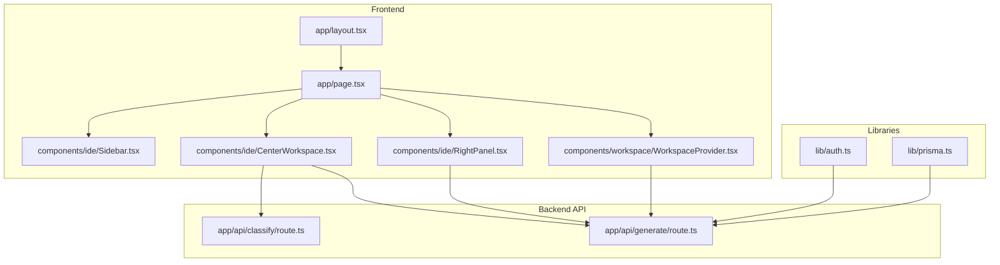
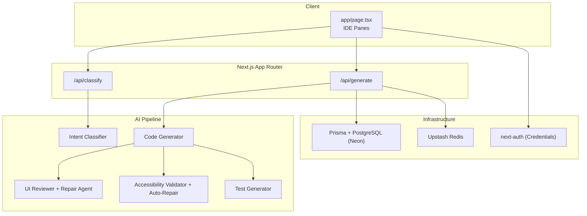
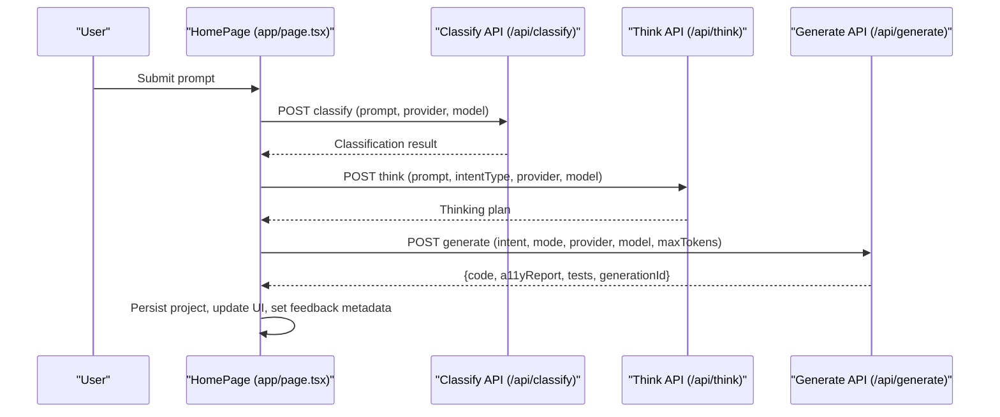
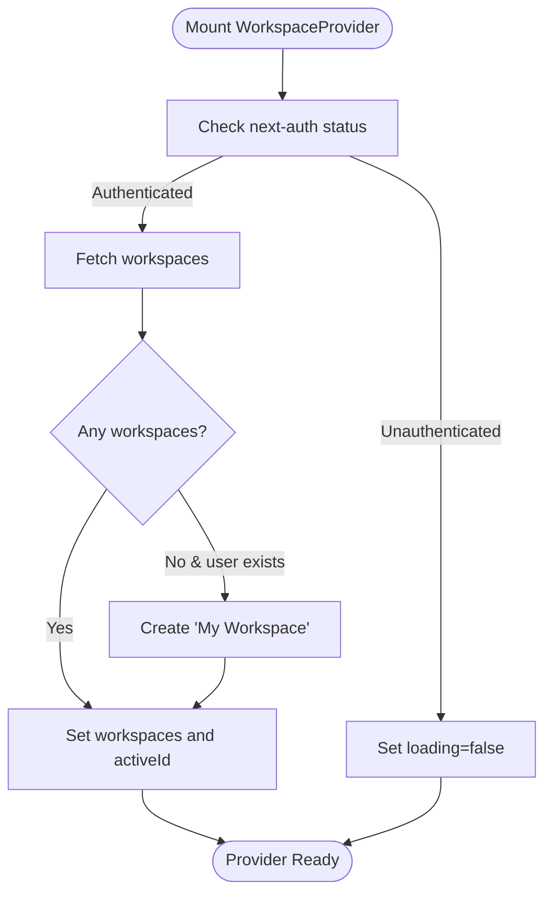
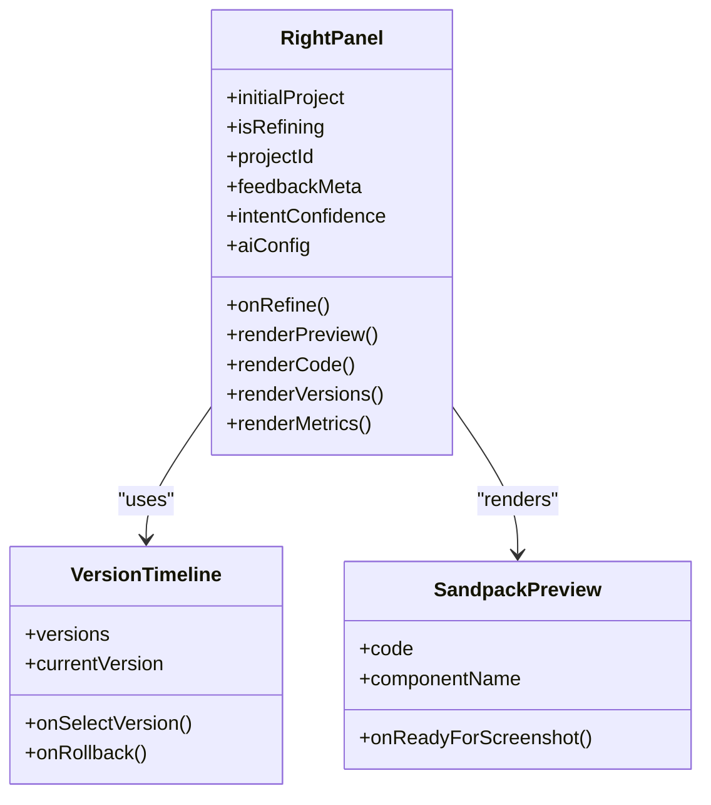
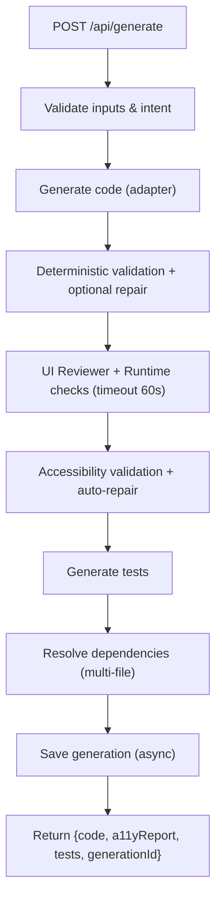
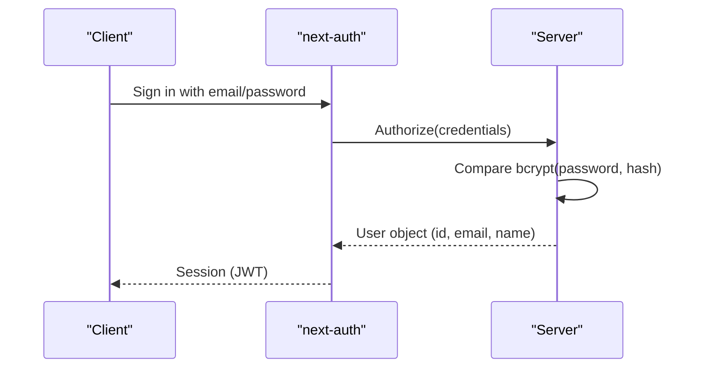
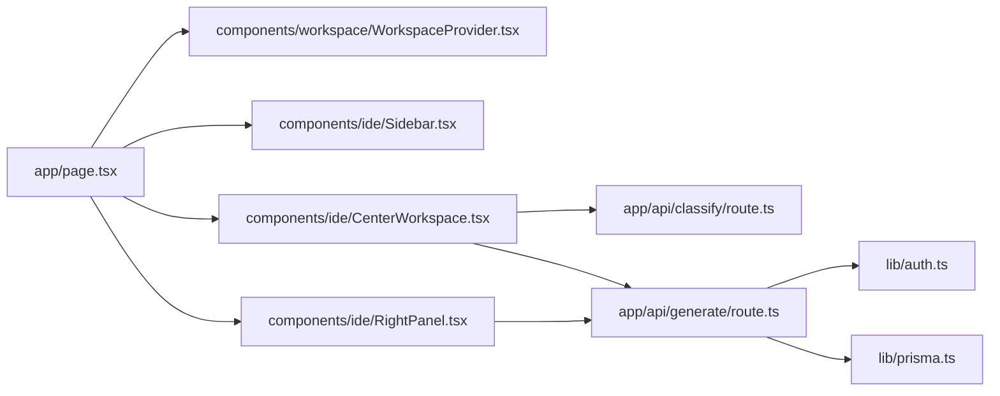

# Project Manager

<cite>
**Referenced Files in This Document**
- [README.md](file://README.md)
- [package.json](file://package.json)
- [docs/ARCHITECTURE.md](file://docs/ARCHITECTURE.md)
- [docs/ENV_SETUP.md](file://docs/ENV_SETUP.md)
- [app/layout.tsx](file://app/layout.tsx)
- [app/page.tsx](file://app/page.tsx)
- [lib/auth.ts](file://lib/auth.ts)
- [lib/prisma.ts](file://lib/prisma.ts)
- [components/workspace/WorkspaceProvider.tsx](file://components/workspace/WorkspaceProvider.tsx)
- [components/ide/Sidebar.tsx](file://components/ide/Sidebar.tsx)
- [components/ide/CenterWorkspace.tsx](file://components/ide/CenterWorkspace.tsx)
- [components/ide/RightPanel.tsx](file://components/ide/RightPanel.tsx)
- [app/api/generate/route.ts](file://app/api/generate/route.ts)
- [app/api/classify/route.ts](file://app/api/classify/route.ts)
</cite>

## Table of Contents
1. [Introduction](#introduction)
2. [Project Structure](#project-structure)
3. [Core Components](#core-components)
4. [Architecture Overview](#architecture-overview)
5. [Detailed Component Analysis](#detailed-component-analysis)
6. [Dependency Analysis](#dependency-analysis)
7. [Performance Considerations](#performance-considerations)
8. [Troubleshooting Guide](#troubleshooting-guide)
9. [Conclusion](#conclusion)

## Introduction
This document describes the Project Manager for an AI-powered accessibility-first UI engine built with Next.js. The system converts natural language UI requests into production-ready React components with integrated accessibility validation, automated testing, and a multi-stage AI pipeline. The Project Manager orchestrates the frontend UI, workspace and project lifecycle, and integrates with backend APIs to execute the generation pipeline.

## Project Structure
The project follows a Next.js App Router structure with a clear separation between UI components, API routes, libraries, and documentation. Key areas:
- UI and Pages: app/ directory with pages and API routes
- Components: reusable UI building blocks in components/
- Libraries: business logic, authentication, persistence, and AI integration in lib/
- Documentation: architecture and environment setup in docs/

**Diagram sources**
- [app/layout.tsx:34-56](file://app/layout.tsx#L34-L56)
- [app/page.tsx:49-619](file://app/page.tsx#L49-L619)
- [components/ide/Sidebar.tsx:27-209](file://components/ide/Sidebar.tsx#L27-L209)
- [components/ide/CenterWorkspace.tsx:34-245](file://components/ide/CenterWorkspace.tsx#L34-L245)
- [components/ide/RightPanel.tsx:175-830](file://components/ide/RightPanel.tsx#L175-L830)
- [components/workspace/WorkspaceProvider.tsx:27-155](file://components/workspace/WorkspaceProvider.tsx#L27-L155)
- [app/api/classify/route.ts:8-76](file://app/api/classify/route.ts#L8-L76)
- [app/api/generate/route.ts:25-438](file://app/api/generate/route.ts#L25-L438)
- [lib/auth.ts:11-87](file://lib/auth.ts#L11-L87)
- [lib/prisma.ts:20-70](file://lib/prisma.ts#L20-L70)

**Section sources**
- [README.md:1-37](file://README.md#L1-L37)
- [package.json:1-68](file://package.json#L1-L68)

## Core Components
- Root layout and providers: sets up session and workspace contexts for the entire app.
- Home page: orchestrates the AI generation pipeline, manages stages, and coordinates UI updates.
- Workspace provider: manages workspaces, active workspace, and persistence of workspace state.
- IDE panes: sidebar for project navigation, center workspace for prompting and pipeline visualization, right panel for preview, code, version history, metrics, and feedback.
- Backend API routes: classification, generation, and related services that implement the multi-stage AI pipeline.

**Section sources**
- [app/layout.tsx:34-56](file://app/layout.tsx#L34-L56)
- [app/page.tsx:49-619](file://app/page.tsx#L49-L619)
- [components/workspace/WorkspaceProvider.tsx:27-155](file://components/workspace/WorkspaceProvider.tsx#L27-L155)
- [components/ide/Sidebar.tsx:27-209](file://components/ide/Sidebar.tsx#L27-L209)
- [components/ide/CenterWorkspace.tsx:34-245](file://components/ide/CenterWorkspace.tsx#L34-L245)
- [components/ide/RightPanel.tsx:175-830](file://components/ide/RightPanel.tsx#L175-L830)
- [app/api/classify/route.ts:8-76](file://app/api/classify/route.ts#L8-L76)
- [app/api/generate/route.ts:25-438](file://app/api/generate/route.ts#L25-L438)

## Architecture Overview
The system is a Next.js full-stack application with:
- Frontend pages and components in the app/ directory
- Serverless API routes under app/api/ implementing the AI pipeline
- Authentication via next-auth with credentials provider
- Persistence via Prisma and PostgreSQL (Neon)
- Caching via Upstash Redis
- Multi-provider AI adapters with resilience and fallbacks

**Diagram sources**
- [docs/ARCHITECTURE.md:1-82](file://docs/ARCHITECTURE.md#L1-L82)
- [app/api/classify/route.ts:8-76](file://app/api/classify/route.ts#L8-L76)
- [app/api/generate/route.ts:25-438](file://app/api/generate/route.ts#L25-L438)
- [lib/auth.ts:11-87](file://lib/auth.ts#L11-L87)
- [lib/prisma.ts:20-70](file://lib/prisma.ts#L20-L70)

## Detailed Component Analysis

### Home Page Pipeline Orchestration
The home page coordinates the entire generation workflow:
- Loads AI engine configuration and determines whether to show the model selection gate
- Executes intent classification and thinking steps
- Runs the generation pipeline (optionally full app mode with manifest and chunking)
- Persists projects and updates UI state
- Manages feedback metadata and generation timestamps

**Diagram sources**
- [app/page.tsx:216-424](file://app/page.tsx#L216-L424)
- [app/api/classify/route.ts:8-76](file://app/api/classify/route.ts#L8-L76)
- [app/api/generate/route.ts:25-438](file://app/api/generate/route.ts#L25-L438)

**Section sources**
- [app/page.tsx:49-619](file://app/page.tsx#L49-L619)

### Workspace Provider
Manages workspace lifecycle:
- Creates, deletes, and lists workspaces
- Auto-provisions a default workspace for new users
- Maintains active workspace selection and loading states
- Integrates with API endpoints for persistence

**Diagram sources**
- [components/workspace/WorkspaceProvider.tsx:89-127](file://components/workspace/WorkspaceProvider.tsx#L89-L127)

**Section sources**
- [components/workspace/WorkspaceProvider.tsx:27-155](file://components/workspace/WorkspaceProvider.tsx#L27-L155)

### Right Panel: Preview, Code, Versions, Metrics
The right panel offers:
- Live preview with Sandpack integration
- Code tab for viewing generated code
- Version timeline for non-destructive rollback
- Metrics tab for accessibility reports, tests, and feedback statistics
- Final Round integration for AI-driven elevation of designs

**Diagram sources**
- [components/ide/RightPanel.tsx:175-830](file://components/ide/RightPanel.tsx#L175-L830)

**Section sources**
- [components/ide/RightPanel.tsx:175-830](file://components/ide/RightPanel.tsx#L175-L830)

### Generation Pipeline API
The generation endpoint implements a robust multi-stage pipeline:
- Validates inputs and intent schema
- Generates code using the selected AI adapter
- Applies deterministic validation and optional repair
- Runs UI reviewer and runtime validation with timeouts
- Performs accessibility validation and auto-repair
- Generates tests and resolves dependencies for multi-file outputs
- Saves generation metadata asynchronously

**Diagram sources**
- [app/api/generate/route.ts:25-438](file://app/api/generate/route.ts#L25-L438)

**Section sources**
- [app/api/generate/route.ts:25-438](file://app/api/generate/route.ts#L25-L438)

### Authentication and Authorization
Authentication uses next-auth with a credentials provider:
- Validates a bcrypt-hashed password against environment configuration
- Provides JWT-based sessions with configurable expiry
- Integrates with API routes for workspace-aware operations

**Diagram sources**
- [lib/auth.ts:11-87](file://lib/auth.ts#L11-L87)

**Section sources**
- [lib/auth.ts:11-87](file://lib/auth.ts#L11-L87)

## Dependency Analysis
High-level dependencies:
- UI depends on workspace and session providers
- API routes depend on authentication, Prisma, and AI adapters
- Prisma client is shared globally to avoid connection exhaustion
- Environment variables drive provider keys, caching, and database connectivity

**Diagram sources**
- [app/page.tsx:49-619](file://app/page.tsx#L49-L619)
- [components/workspace/WorkspaceProvider.tsx:27-155](file://components/workspace/WorkspaceProvider.tsx#L27-L155)
- [components/ide/Sidebar.tsx:27-209](file://components/ide/Sidebar.tsx#L27-L209)
- [components/ide/CenterWorkspace.tsx:34-245](file://components/ide/CenterWorkspace.tsx#L34-L245)
- [components/ide/RightPanel.tsx:175-830](file://components/ide/RightPanel.tsx#L175-L830)
- [app/api/classify/route.ts:8-76](file://app/api/classify/route.ts#L8-L76)
- [app/api/generate/route.ts:25-438](file://app/api/generate/route.ts#L25-L438)
- [lib/auth.ts:11-87](file://lib/auth.ts#L11-L87)
- [lib/prisma.ts:20-70](file://lib/prisma.ts#L20-L70)

**Section sources**
- [package.json:13-44](file://package.json#L13-L44)
- [docs/ENV_SETUP.md:1-89](file://docs/ENV_SETUP.md#L1-L89)

## Performance Considerations
- Streaming support for generation reduces perceived latency
- Caching via Upstash Redis avoids recomputation for identical prompts
- Global Prisma client prevents connection exhaustion in serverless environments
- Timeout controls in the reviewer phase prevent pipeline stalls
- Environment-driven model overrides enable tuning for performance and cost

[No sources needed since this section provides general guidance]

## Troubleshooting Guide
Common issues and resolutions:
- Authentication failures: verify environment variables for owner credentials and bcrypt hash
- Database connectivity: confirm Neon connection strings and Prisma client reconnection logic
- Missing environment variables: ensure all required keys are present per environment setup guide
- Workspace provisioning: on first login with no workspaces, the provider auto-creates a default workspace

**Section sources**
- [lib/auth.ts:25-58](file://lib/auth.ts#L25-L58)
- [lib/prisma.ts:58-69](file://lib/prisma.ts#L58-L69)
- [docs/ENV_SETUP.md:75-89](file://docs/ENV_SETUP.md#L75-L89)

## Conclusion
The Project Manager integrates a sophisticated AI generation pipeline with a modern UI, robust authentication, and scalable infrastructure. It supports iterative refinement, accessibility-first validation, and comprehensive metrics to improve outcomes over time. The modular architecture and clear separation of concerns enable maintainability and extensibility.