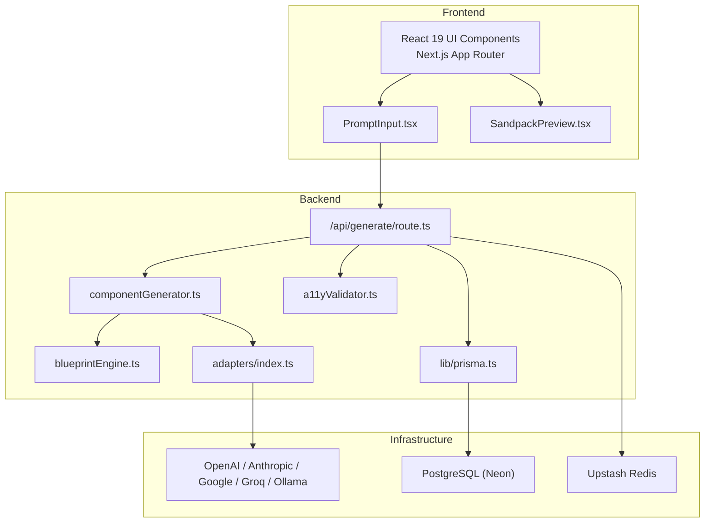
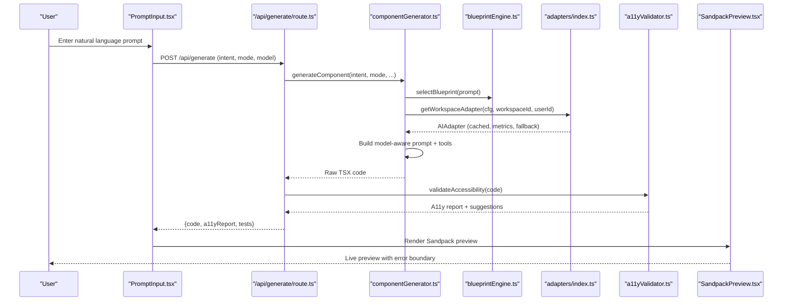
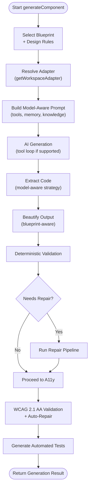
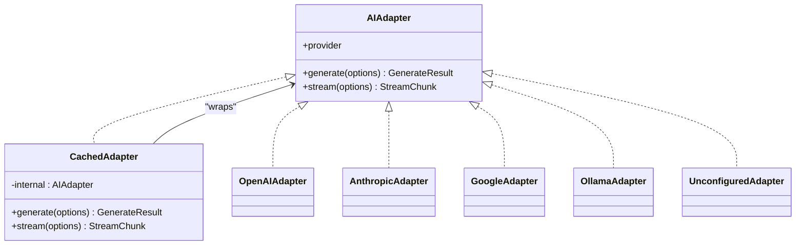
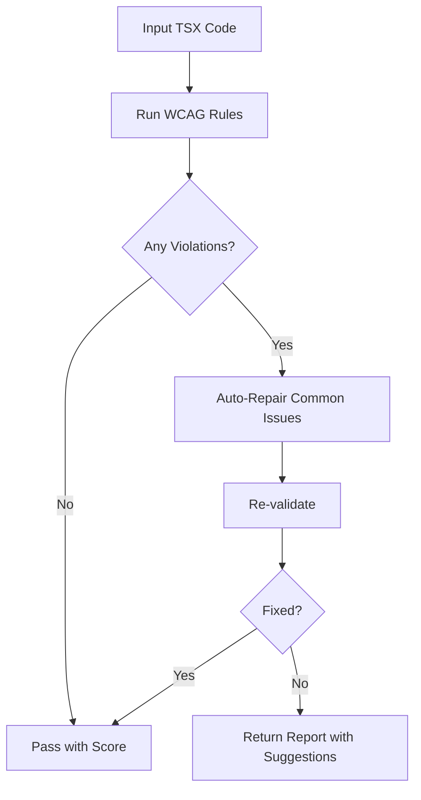
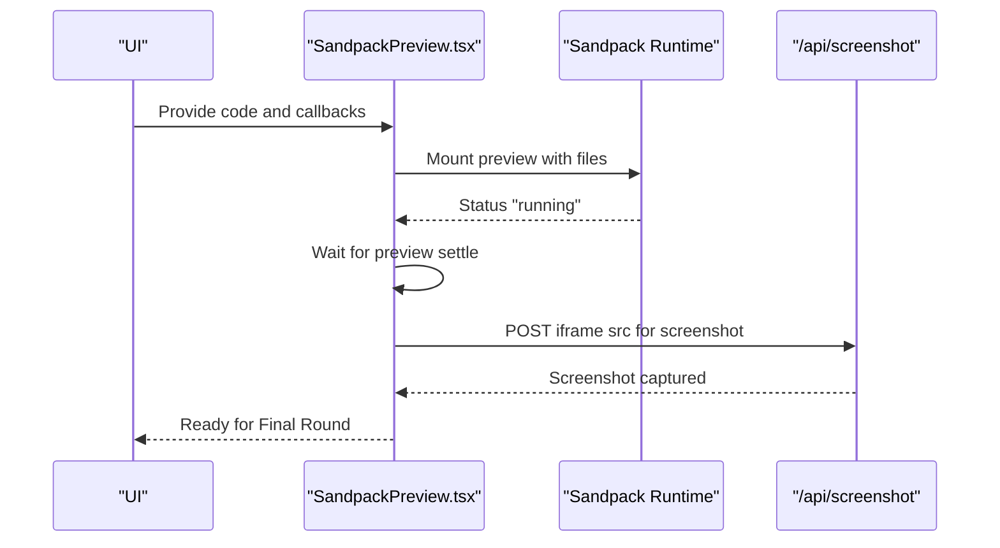
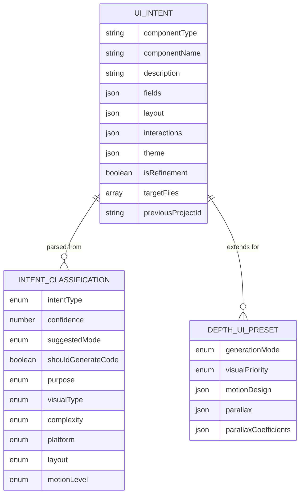
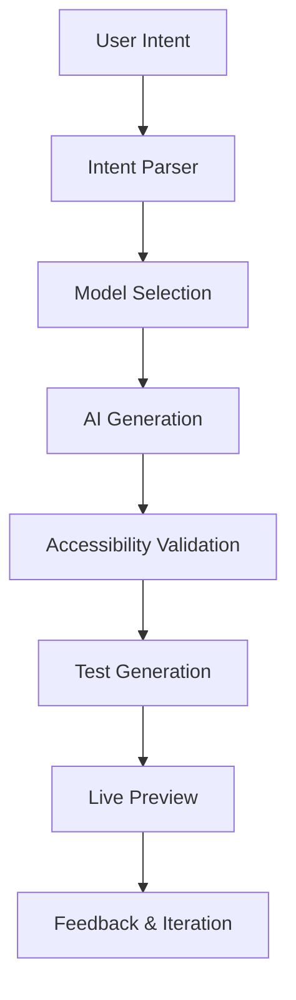
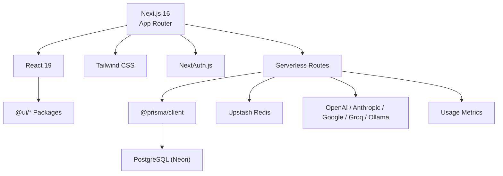

# Project Overview

<cite>
**Referenced Files in This Document**
- [README.md](file://README.md)
- [package.json](file://package.json)
- [docs/ARCHITECTURE.md](file://docs/ARCHITECTURE.md)
- [app/layout.tsx](file://app/layout.tsx)
- [lib/prisma.ts](file://lib/prisma.ts)
- [app/api/generate/route.ts](file://app/api/generate/route.ts)
- [lib/validation/a11yValidator.ts](file://lib/validation/a11yValidator.ts)
- [components/SandpackPreview.tsx](file://components/SandpackPreview.tsx)
- [lib/intelligence/blueprintEngine.ts](file://lib/intelligence/blueprintEngine.ts)
- [lib/ai/adapters/index.ts](file://lib/ai/adapters/index.ts)
- [lib/ai/componentGenerator.ts](file://lib/ai/componentGenerator.ts)
- [components/PromptInput.tsx](file://components/PromptInput.tsx)
- [lib/validation/schemas.ts](file://lib/validation/schemas.ts)
- [next.config.ts](file://next.config.ts)
</cite>

## Table of Contents
1. [Introduction](#introduction)
2. [Project Structure](#project-structure)
3. [Core Components](#core-components)
4. [Architecture Overview](#architecture-overview)
5. [Detailed Component Analysis](#detailed-component-analysis)
6. [Dependency Analysis](#dependency-analysis)
7. [Performance Considerations](#performance-considerations)
8. [Troubleshooting Guide](#troubleshooting-guide)
9. [Conclusion](#conclusion)

## Introduction
This project is an AI-powered, accessibility-first UI engine built as a Next.js application. Its core purpose is to transform natural language descriptions into production-ready, highly accessible React/Tailwind components with live preview and automated WCAG 2.1 AA validation. The system emphasizes resilience, multi-provider AI integration, and a universal adapter pattern that supports cloud providers (OpenAI, Anthropic, Google, Groq/Together) and local models (Ollama/LM Studio), while maintaining strict design system blueprints and a multi-stage quality pipeline.

Key value propositions:
- WCAG 2.1 AA compliance: Built-in rule-based validator and auto-repair for accessibility issues
- Multi-provider AI integration: Unified adapter layer supporting multiple providers and fallbacks
- Universal adapter system: Single interface across providers with caching, metrics, and resilience
- Live preview and testing: Integrated Sandpack-based preview with automated test generation
- Security-first: Encrypted workspace keys, prompt sanitization, and workspace-aware telemetry

Target audience and primary use cases:
- Product teams building accessible UI components quickly
- Developers prototyping interfaces from ideas or designs
- Teams needing standardized, accessible React/Tailwind outputs with automated validation
- Organizations requiring multi-cloud AI flexibility and local/offline options

## Project Structure
The project follows a Next.js App Router structure with a clear separation of concerns:
- app/: Next.js pages and serverless API routes
- components/: Reusable UI components (IDE panels, preview, inputs)
- lib/: Core libraries for AI orchestration, validation, intelligence, sandbox, and persistence
- packages/: Internal UI component library (@ui/* ecosystem)
- prisma/: Database schema and migrations
- docs/: Architectural and environment documentation

**Diagram sources**
- [app/api/generate/route.ts:24-451](file://app/api/generate/route.ts#L24-L451)
- [lib/ai/componentGenerator.ts:61-408](file://lib/ai/componentGenerator.ts#L61-L408)
- [lib/intelligence/blueprintEngine.ts:122-176](file://lib/intelligence/blueprintEngine.ts#L122-L176)
- [lib/validation/a11yValidator.ts:264-297](file://lib/validation/a11yValidator.ts#L264-L297)
- [lib/ai/adapters/index.ts:146-215](file://lib/ai/adapters/index.ts#L146-L215)
- [lib/prisma.ts:20-70](file://lib/prisma.ts#L20-L70)

**Section sources**
- [README.md:1-37](file://README.md#L1-L37)
- [package.json:1-68](file://package.json#L1-L68)
- [next.config.ts:1-38](file://next.config.ts#L1-L38)

## Core Components
- AI Generation Pipeline: Orchestrates blueprint selection, design rules, model-aware prompting, tool loops, code extraction, beautification, and deterministic validation
- Universal Adapter Layer: Provides a single interface across providers with credential resolution, caching, metrics, and fallbacks
- Accessibility Validator: Rule-based WCAG 2.1 AA checker with auto-repair capabilities
- Live Preview: Sandpack-based React preview with error boundary and screenshot capture
- Intent Classification and Schemas: Structured intent parsing, classification, and typing for UI intents, apps, and depth UI modes
- Persistence and Telemetry: Prisma ORM with reconnect logic and usage metrics

**Section sources**
- [lib/ai/componentGenerator.ts:61-408](file://lib/ai/componentGenerator.ts#L61-L408)
- [lib/ai/adapters/index.ts:146-215](file://lib/ai/adapters/index.ts#L146-L215)
- [lib/validation/a11yValidator.ts:264-297](file://lib/validation/a11yValidator.ts#L264-L297)
- [components/SandpackPreview.tsx:144-287](file://components/SandpackPreview.tsx#L144-L287)
- [lib/validation/schemas.ts:150-288](file://lib/validation/schemas.ts#L150-L288)
- [lib/prisma.ts:20-70](file://lib/prisma.ts#L20-L70)

## Architecture Overview
The system implements a multi-stage pipeline that transforms user intent into accessible React components:
1. Intent Classification and Blueprint Selection: Determines intent type, visual style, and layout constraints
2. Model-Aware Prompting: Builds structured prompts with design rules, memory, and semantic context
3. AI Generation: Uses the universal adapter to generate TSX code with tool loops where supported
4. Deterministic Validation and Repair: Pre-repair validation and optional AI-driven repair
5. Accessibility Validation and Auto-Repair: WCAG 2.1 AA scoring and automated fixes
6. Test Generation and Dependency Resolution: Produces automated tests and patches multi-file outputs
7. Live Preview and Feedback: Renders components in Sandpack with screenshot capture for quality assurance

**Diagram sources**
- [app/api/generate/route.ts:24-451](file://app/api/generate/route.ts#L24-L451)
- [lib/ai/componentGenerator.ts:61-408](file://lib/ai/componentGenerator.ts#L61-L408)
- [lib/intelligence/blueprintEngine.ts:122-176](file://lib/intelligence/blueprintEngine.ts#L122-L176)
- [lib/ai/adapters/index.ts:236-278](file://lib/ai/adapters/index.ts#L236-L278)
- [lib/validation/a11yValidator.ts:264-297](file://lib/validation/a11yValidator.ts#L264-L297)
- [components/SandpackPreview.tsx:144-287](file://components/SandpackPreview.tsx#L144-L287)

**Section sources**
- [docs/ARCHITECTURE.md:7-82](file://docs/ARCHITECTURE.md#L7-L82)

## Detailed Component Analysis

### AI Generation Pipeline
The generation pipeline coordinates blueprint selection, model-aware prompting, tool loops, and deterministic validation. It supports component, app, and depth UI modes, with optional refinement from previous projects and memory-assisted knowledge injection.

**Diagram sources**
- [lib/ai/componentGenerator.ts:61-408](file://lib/ai/componentGenerator.ts#L61-L408)
- [lib/intelligence/blueprintEngine.ts:122-176](file://lib/intelligence/blueprintEngine.ts#L122-L176)
- [lib/validation/a11yValidator.ts:264-297](file://lib/validation/a11yValidator.ts#L264-L297)

**Section sources**
- [lib/ai/componentGenerator.ts:61-408](file://lib/ai/componentGenerator.ts#L61-L408)

### Universal Adapter and Resilience Layer
The adapter layer provides a single interface across providers, with credential resolution, caching, metrics dispatch, and fallback behavior. It supports explicit provider selection, OpenAI-compatible endpoints, and graceful degradation for local environments.

**Diagram sources**
- [lib/ai/adapters/index.ts:146-215](file://lib/ai/adapters/index.ts#L146-L215)

**Section sources**
- [lib/ai/adapters/index.ts:146-215](file://lib/ai/adapters/index.ts#L146-L215)

### Accessibility Validation and Auto-Repair
The validator enforces WCAG 2.1 AA rules and provides auto-repair for common issues. It computes a score based on errors and warnings, and suggests remediations.

**Diagram sources**
- [lib/validation/a11yValidator.ts:264-297](file://lib/validation/a11yValidator.ts#L264-L297)

**Section sources**
- [lib/validation/a11yValidator.ts:264-297](file://lib/validation/a11yValidator.ts#L264-L297)

### Live Preview and Feedback Capture
The preview component renders generated code in Sandpack, captures screenshots after the preview settles, and exposes an error boundary for runtime crashes.

**Diagram sources**
- [components/SandpackPreview.tsx:144-287](file://components/SandpackPreview.tsx#L144-L287)

**Section sources**
- [components/SandpackPreview.tsx:144-287](file://components/SandpackPreview.tsx#L144-L287)

### Intent Classification and Schemas
Structured schemas define intent types, classifications, and depth UI presets, enabling consistent interpretation and generation across modes.

**Diagram sources**
- [lib/validation/schemas.ts:150-288](file://lib/validation/schemas.ts#L150-L288)

**Section sources**
- [lib/validation/schemas.ts:150-288](file://lib/validation/schemas.ts#L150-L288)

### Conceptual Overview
The system’s high-level workflow integrates user intent, AI generation, validation, and preview into a cohesive developer experience.

[No sources needed since this diagram shows conceptual workflow, not actual code structure]

## Dependency Analysis
The system relies on a modern stack optimized for serverless scalability and developer productivity.

**Diagram sources**
- [package.json:13-44](file://package.json#L13-L44)
- [lib/prisma.ts:20-70](file://lib/prisma.ts#L20-L70)
- [docs/ARCHITECTURE.md:15-20](file://docs/ARCHITECTURE.md#L15-L20)

**Section sources**
- [package.json:13-44](file://package.json#L13-L44)
- [lib/prisma.ts:20-70](file://lib/prisma.ts#L20-L70)
- [docs/ARCHITECTURE.md:15-20](file://docs/ARCHITECTURE.md#L15-L20)

## Performance Considerations
- Serverless optimization: Next.js standalone output, externalized Prisma packages, and React compiler enable faster cold starts and efficient server actions
- Caching: TTL cache for identical prompts/models/temperatures reduces API costs and latency
- Resilience: Automatic reconnect for transient database errors and exponential backoff for provider failures
- Token budgeting: Prompt construction respects model context windows and trims optional content when needed
- Preview performance: Sandpack preview with error boundaries and screenshot capture minimizes runtime overhead

[No sources needed since this section provides general guidance]

## Troubleshooting Guide
Common issues and resolutions:
- Missing API keys: The adapter layer throws a configuration error when no key is found for a provider; configure workspace keys or environment variables
- Transient database errors: The Prisma client reconnects automatically on connection-drop errors
- Provider timeouts/failures: The adapter layer caches responses and surfaces helpful configuration prompts
- Accessibility failures: Use the validator’s suggestions to address WCAG violations; auto-repair applies common fixes
- Preview crashes: The error boundary displays a friendly message and allows retrying the preview

**Section sources**
- [lib/ai/adapters/index.ts:28-40](file://lib/ai/adapters/index.ts#L28-L40)
- [lib/prisma.ts:36-70](file://lib/prisma.ts#L36-L70)
- [lib/validation/a11yValidator.ts:264-297](file://lib/validation/a11yValidator.ts#L264-L297)
- [components/SandpackPreview.tsx:109-140](file://components/SandpackPreview.tsx#L109-L140)

## Conclusion
This AI-powered accessibility-first UI engine delivers a production-grade solution for converting natural language into accessible React/Tailwind components. Its multi-stage pipeline, universal adapter system, and built-in validation ensure high-quality outputs while maintaining flexibility across providers and environments. The live preview and automated testing streamline iteration, making it suitable for rapid prototyping and team collaboration.