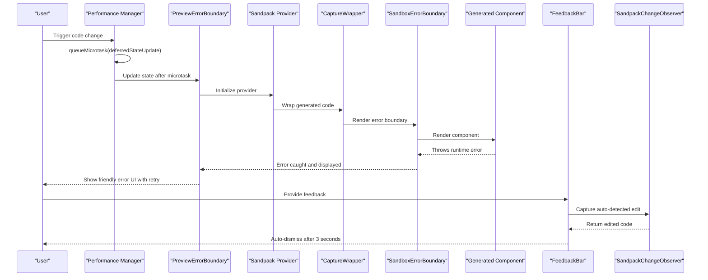
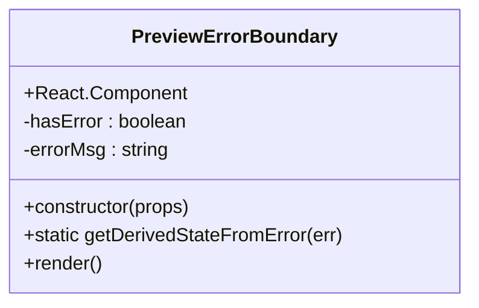
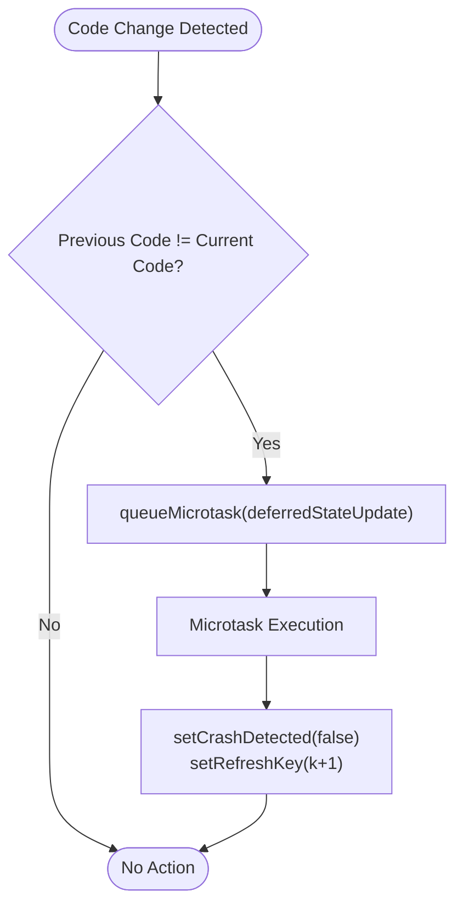
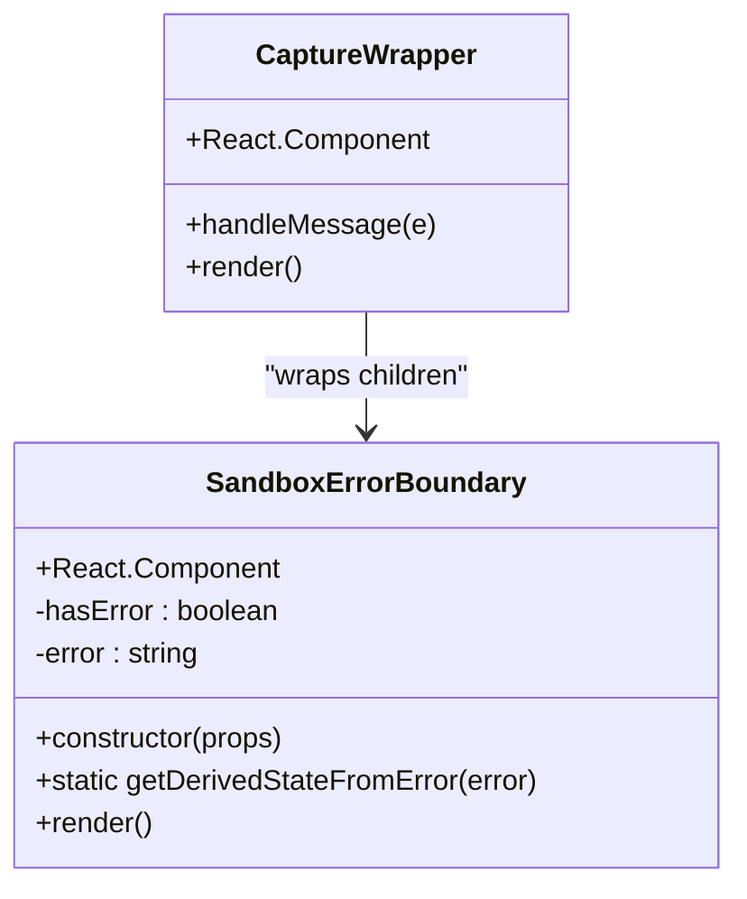
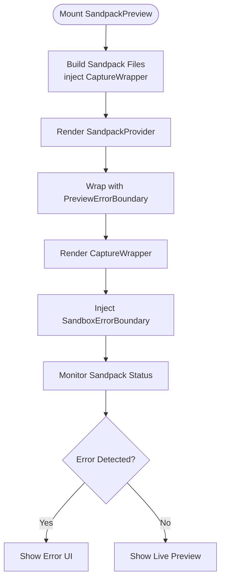
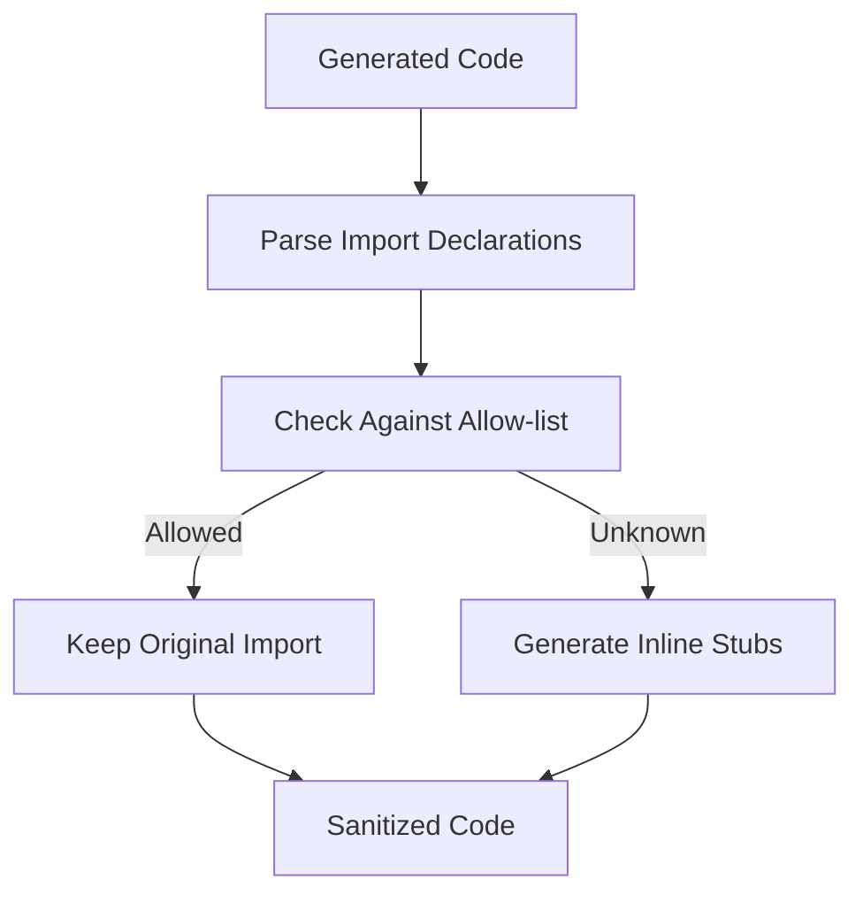
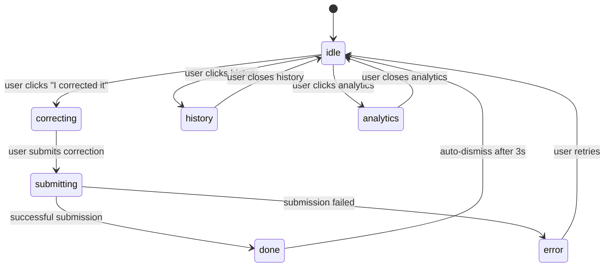
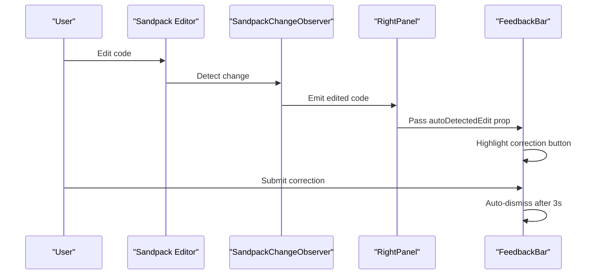
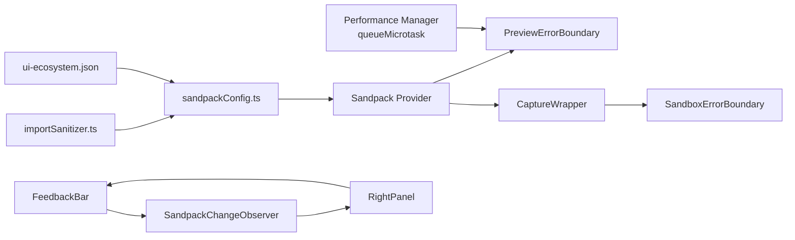

# Sandbox Error Boundary

<cite>
**Referenced Files in This Document**
- [SandpackPreview.tsx](file://components/SandpackPreview.tsx)
- [FeedbackBar.tsx](file://components/FeedbackBar.tsx)
- [RightPanel.tsx](file://components/ide/RightPanel.tsx)
- [sandpackConfig.ts](file://lib/sandbox/sandpackConfig.ts)
- [importSanitizer.ts](file://lib/sandbox/importSanitizer.ts)
- [ui-ecosystem.json](file://lib/sandbox/ui-ecosystem.json)
</cite>

## Update Summary
**Changes Made**
- Updated Performance Considerations section to document React performance optimization using queueMicrotask-based deferral mechanism
- Enhanced troubleshooting guide with queueMicrotask-related debugging information
- Added new section covering React performance best practices for state mutations in useEffect
- Updated architecture diagrams to reflect improved state management patterns

## Table of Contents
1. [Introduction](#introduction)
2. [Project Structure](#project-structure)
3. [Core Components](#core-components)
4. [Architecture Overview](#architecture-overview)
5. [Detailed Component Analysis](#detailed-component-analysis)
6. [Feedback System Integration](#feedback-system-integration)
7. [Dependency Analysis](#dependency-analysis)
8. [Performance Considerations](#performance-considerations)
9. [Troubleshooting Guide](#troubleshooting-guide)
10. [Conclusion](#conclusion)

## Introduction
This document explains the Sandbox Error Boundary implementation used to gracefully handle runtime crashes in the AI-generated UI preview system. The system consists of two complementary error boundaries: a preview-level boundary that handles React component mounting failures, and a sandbox-level boundary that intercepts runtime errors from generated code within the Sandpack environment. Together, they provide robust error handling for AI-generated React components during live preview.

**Updated** Enhanced with React performance optimization using queueMicrotask-based deferral mechanism to prevent state mutations during useEffect execution, eliminating ESLint warnings and improving overall React performance.

## Project Structure
The Sandbox Error Boundary spans three key areas:
- Preview-level error boundary: wraps the Sandpack preview to handle React mounting errors
- Sandpack-level error boundary: wraps generated code to catch runtime exceptions
- Code sanitization pipeline: ensures generated code can safely run in the sandbox
- Feedback system integration: captures user interactions and auto-detected edits
- **Performance optimization layer: Implements queueMicrotask-based deferral for state mutations**

```mermaid
graph TB
subgraph "Preview Layer"
PEB["PreviewErrorBoundary<br/>React Error Boundary"]
FB["FeedbackBar<br/>Auto-dismissal & Edit Capture"]
PM["Performance Manager<br/>queueMicrotask Deferral"]
END
subgraph "Sandpack Layer"
SEB["SandboxErrorBoundary<br/>React Error Boundary"]
SP["Sandpack Provider"]
WRAP["CaptureWrapper"]
SCOB["SandpackChangeObserver<br/>Auto-edit Detection"]
END
subgraph "Safety Pipeline"
IS["importSanitizer.ts<br/>Allow-list & Stubs"]
CFG["sandpackConfig.ts<br/>File Builder & Aliases"]
ECOSYS["ui-ecosystem.json<br/>Virtual Package Graph"]
END
PEB --> SP
FB --> SCOB
PM --> PEB
SP --> WRAP
WRAP --> SEB
CFG --> SP
IS --> CFG
ECOSYS --> CFG
SCOB --> FB
```

**Diagram sources**
- [SandpackPreview.tsx:156-187](file://components/SandpackPreview.tsx#L156-L187)
- [SandpackPreview.tsx:213-218](file://components/SandpackPreview.tsx#L213-L218)
- [FeedbackBar.tsx:109-115](file://components/FeedbackBar.tsx#L109-L115)
- [RightPanel.tsx:453-459](file://components/ide/RightPanel.tsx#L453-L459)
- [sandpackConfig.ts:257-309](file://lib/sandbox/sandpackConfig.ts#L257-L309)
- [importSanitizer.ts:16-47](file://lib/sandbox/importSanitizer.ts#L16-L47)
- [ui-ecosystem.json:1-42](file://lib/sandbox/ui-ecosystem.json#L1-L42)

**Section sources**
- [SandpackPreview.tsx:156-187](file://components/SandpackPreview.tsx#L156-L187)
- [SandpackPreview.tsx:213-218](file://components/SandpackPreview.tsx#L213-L218)
- [FeedbackBar.tsx:109-115](file://components/FeedbackBar.tsx#L109-L115)
- [RightPanel.tsx:453-459](file://components/ide/RightPanel.tsx#L453-L459)
- [sandpackConfig.ts:257-309](file://lib/sandbox/sandpackConfig.ts#L257-L309)
- [importSanitizer.ts:16-47](file://lib/sandbox/importSanitizer.ts#L16-L47)
- [ui-ecosystem.json:1-42](file://lib/sandbox/ui-ecosystem.json#L1-L42)

## Core Components
- PreviewErrorBoundary: React class component that catches React mounting errors in the live preview
- SandboxErrorBoundary: React class component that wraps generated code to catch runtime exceptions
- SandpackProvider: Sandpack runtime that hosts the preview and manages status/error signals
- CaptureWrapper: Higher-order wrapper that injects the sandbox error boundary around generated code
- Import sanitizer: Validates and sanitizes imports to prevent unresolved dependencies in the sandbox
- Sandpack file builder: Constructs the virtual filesystem, injects error boundaries, and resolves aliases
- **Performance Manager**: Enhanced component with queueMicrotask-based deferral mechanism for state mutations
- **FeedbackBar**: Enhanced component with automatic dismissal and auto-detected edit capture for improved user experience

**Updated** Added Performance Manager component with queueMicrotask-based deferral mechanism and enhanced FeedbackBar component with automatic dismissal functionality.

**Section sources**
- [SandpackPreview.tsx:156-187](file://components/SandpackPreview.tsx#L156-L187)
- [SandpackPreview.tsx:213-218](file://components/SandpackPreview.tsx#L213-L218)
- [FeedbackBar.tsx:109-115](file://components/FeedbackBar.tsx#L109-L115)
- [RightPanel.tsx:453-459](file://components/ide/RightPanel.tsx#L453-L459)
- [sandpackConfig.ts:257-309](file://lib/sandbox/sandpackConfig.ts#L257-L309)
- [sandpackConfig.ts:112-453](file://lib/sandbox/sandpackConfig.ts#L112-L453)
- [importSanitizer.ts:169-224](file://lib/sandbox/importSanitizer.ts#L169-L224)

## Architecture Overview
The error boundary architecture operates in two layers with enhanced performance optimization:
1. Preview-level boundary: Catches React errors thrown by the generated component during mount/update
2. Sandpack-level boundary: Catches runtime exceptions from the generated code executed inside Sandpack
3. **Performance optimization: Implements queueMicrotask-based deferral to prevent state mutations during useEffect execution**
4. **Feedback integration: Captures user interactions and auto-detected edits for continuous improvement**



**Updated** Added Performance Manager layer with queueMicrotask-based deferral mechanism and enhanced feedback system integration showing auto-detected edit capture and automatic dismissal flow.

**Diagram sources**
- [SandpackPreview.tsx:213-218](file://components/SandpackPreview.tsx#L213-L218)
- [SandpackPreview.tsx:276-360](file://components/SandpackPreview.tsx#L276-L360)
- [FeedbackBar.tsx:109-115](file://components/FeedbackBar.tsx#L109-L115)
- [RightPanel.tsx:453-459](file://components/ide/RightPanel.tsx#L453-L459)
- [sandpackConfig.ts:257-309](file://lib/sandbox/sandpackConfig.ts#L257-L309)

## Detailed Component Analysis

### PreviewErrorBoundary
The preview-level error boundary is a React class component that:
- Uses getDerivedStateFromError to capture React errors
- Renders a friendly error UI with a retry action
- Resets the error state when the user retries



**Diagram sources**
- [SandpackPreview.tsx:156-187](file://components/SandpackPreview.tsx#L156-L187)

**Section sources**
- [SandpackPreview.tsx:156-187](file://components/SandpackPreview.tsx#L156-L187)

### Performance Manager Enhancement
The Performance Manager implements a queueMicrotask-based deferral mechanism to prevent state mutations during useEffect execution:
- **Defer state updates using queueMicrotask to avoid cascading renders**
- **Eliminates ESLint react-hooks/set-state-in-effect warnings**
- **Prevents state mutations during effect cleanup phases**
- **Ensures predictable component lifecycle management**



**Updated** Added Performance Manager component with queueMicrotask-based deferral mechanism for state mutations.

**Diagram sources**
- [SandpackPreview.tsx:213-218](file://components/SandpackPreview.tsx#L213-L218)

**Section sources**
- [SandpackPreview.tsx:213-218](file://components/SandpackPreview.tsx#L213-L218)

### SandboxErrorBoundary
The sandbox-level error boundary is injected into the generated code via CaptureWrapper:
- Wraps the generated component to catch runtime exceptions
- Displays a detailed error message with the original error text
- Prevents cascading failures by isolating the generated code



**Diagram sources**
- [sandpackConfig.ts:257-309](file://lib/sandbox/sandpackConfig.ts#L257-L309)

**Section sources**
- [sandpackConfig.ts:257-309](file://lib/sandbox/sandpackConfig.ts#L257-L309)

### Sandpack Provider Integration
The preview integrates both error boundaries through the Sandpack provider:
- PreviewErrorBoundary wraps the entire Sandpack setup
- SandpackErrorBoundary is injected via CaptureWrapper into the generated code
- Crash detection monitors Sandpack status and error signals
- **Performance optimization ensures smooth state transitions without blocking effects**



**Diagram sources**
- [SandpackPreview.tsx:276-360](file://components/SandpackPreview.tsx#L276-L360)
- [sandpackConfig.ts:300-307](file://lib/sandbox/sandpackConfig.ts#L300-L307)

**Section sources**
- [SandpackPreview.tsx:276-360](file://components/SandpackPreview.tsx#L276-L360)
- [sandpackConfig.ts:300-307](file://lib/sandbox/sandpackConfig.ts#L300-L307)

### Import Sanitization Pipeline
The import sanitizer ensures generated code can run safely in the sandbox:
- Maintains an allow-list of supported packages
- Replaces unknown imports with inline stubs
- Handles side-effect imports and named/default exports



**Diagram sources**
- [importSanitizer.ts:169-224](file://lib/sandbox/importSanitizer.ts#L169-L224)

**Section sources**
- [importSanitizer.ts:16-47](file://lib/sandbox/importSanitizer.ts#L16-L47)
- [importSanitizer.ts:169-224](file://lib/sandbox/importSanitizer.ts#L169-L224)

## Feedback System Integration

### FeedbackBar Component
The FeedbackBar component provides enhanced user interaction with automatic dismissal functionality:
- **Auto-dismissal**: Automatically transitions from 'done' state to 'idle' after 3 seconds
- **Auto-detected edits**: Captures and submits user code corrections from Sandpack
- **Multi-state support**: Handles idle, correcting, submitting, done, error, history, and analytics states
- **Real-time integration**: Seamlessly integrates with SandpackChangeObserver for edit capture
- **Performance optimization**: Uses efficient setTimeout cleanup to prevent memory leaks



**Updated** Added comprehensive state management for FeedbackBar component with auto-dismissal functionality and performance optimization.

**Diagram sources**
- [FeedbackBar.tsx:109-115](file://components/FeedbackBar.tsx#L109-L115)
- [FeedbackBar.tsx:32-32](file://components/FeedbackBar.tsx#L32-L32)

### SandpackChangeObserver Integration
The SandpackChangeObserver captures real-time code changes for feedback collection:
- Monitors active file changes in Sandpack
- Filters meaningful changes (minimum 50 characters)
- Bubbles up detected edits to FeedbackBar
- Enables automatic correction submission



**Updated** Added SandpackChangeObserver integration for auto-detected edit capture with performance optimizations.

**Diagram sources**
- [RightPanel.tsx:204-205](file://components/ide/RightPanel.tsx#L204-L205)
- [RightPanel.tsx:453-459](file://components/ide/RightPanel.tsx#L453-L459)
- [FeedbackBar.tsx:264-271](file://components/FeedbackBar.tsx#L264-L271)

**Section sources**
- [FeedbackBar.tsx:109-115](file://components/FeedbackBar.tsx#L109-L115)
- [FeedbackBar.tsx:264-271](file://components/FeedbackBar.tsx#L264-L271)
- [RightPanel.tsx:204-205](file://components/ide/RightPanel.tsx#L204-L205)
- [RightPanel.tsx:453-459](file://components/ide/RightPanel.tsx#L453-L459)

## Dependency Analysis
The error boundary system relies on several key dependencies:
- Sandpack React components for preview hosting
- Virtual filesystem construction for generated code
- Package alias resolution for @ui ecosystem
- Import sanitization for sandbox compatibility
- **Feedback system integration for user interaction tracking**
- **Performance optimization layer for React state management**



**Updated** Added Performance Manager dependency and enhanced feedback system dependencies with SandpackChangeObserver integration.

**Diagram sources**
- [sandpackConfig.ts:112-453](file://lib/sandbox/sandpackConfig.ts#L112-L453)
- [importSanitizer.ts:16-47](file://lib/sandbox/importSanitizer.ts#L16-L47)
- [ui-ecosystem.json:1-42](file://lib/sandbox/ui-ecosystem.json#L1-L42)
- [RightPanel.tsx:453-459](file://components/ide/RightPanel.tsx#L453-L459)

**Section sources**
- [sandpackConfig.ts:112-453](file://lib/sandbox/sandpackConfig.ts#L112-L453)
- [importSanitizer.ts:16-47](file://lib/sandbox/importSanitizer.ts#L16-L47)
- [ui-ecosystem.json:1-42](file://lib/sandbox/ui-ecosystem.json#L1-L42)
- [RightPanel.tsx:453-459](file://components/ide/RightPanel.tsx#L453-L459)

## Performance Considerations
- Error boundaries add minimal overhead during normal operation
- Sandpack virtual filesystem size impacts startup time; the system optimizes by injecting only needed @ui packages
- Import sanitization runs once per code generation to prevent repeated sandbox failures
- Crash detection avoids unnecessary retries by monitoring Sandpack status and error signals
- **Performance optimization: queueMicrotask-based deferral mechanism prevents state mutations during useEffect execution, eliminating ESLint warnings and improving React performance**
- **FeedbackBar auto-dismissal uses efficient setTimeout cleanup to prevent memory leaks**
- **SandpackChangeObserver filters frequent changes to reduce unnecessary re-renders**
- **Performance Manager ensures smooth state transitions without blocking the main thread**

**Updated** Added comprehensive performance considerations for React performance optimization using queueMicrotask-based deferral mechanism and enhanced feedback system components.

## Troubleshooting Guide
Common issues and resolutions:
- Preview crashes immediately: Check for unresolved imports in generated code; the import sanitizer replaces unknown packages with stubs
- Sandpack timeout errors: Reduce dependency count or simplify the generated component
- Error boundary not catching errors: Verify both PreviewErrorBoundary and SandboxErrorBoundary are properly wrapped around the generated code
- Memory limit exceeded: The crash detection logic triggers a retry mechanism to recover from runtime exits
- **Performance issues with state updates**: Check useEffect implementations for proper queueMicrotask usage to prevent state mutations during effect execution
- **ESLint warnings about state mutations in effects**: Ensure queueMicrotask-based deferral is used for state updates triggered by effects
- **FeedbackBar not auto-dismissing**: Check useEffect cleanup in FeedbackBar component for proper timeout management
- **Auto-detected edits not captured**: Verify SandpackChangeObserver is properly configured and emitting changes
- **Feedback submission failing**: Check network connectivity and API endpoint availability

**Updated** Added troubleshooting guidance for new performance optimization features and enhanced feedback system components.

**Section sources**
- [SandpackPreview.tsx:113-150](file://components/SandpackPreview.tsx#L113-L150)
- [SandpackPreview.tsx:213-218](file://components/SandpackPreview.tsx#L213-L218)
- [FeedbackBar.tsx:109-115](file://components/FeedbackBar.tsx#L109-L115)
- [RightPanel.tsx:204-205](file://components/ide/RightPanel.tsx#L204-L205)
- [sandpackConfig.ts:257-309](file://lib/sandbox/sandpackConfig.ts#L257-L309)

## Conclusion
The Sandbox Error Boundary system provides comprehensive error handling for AI-generated React components in the live preview environment. By combining preview-level and sandbox-level error boundaries with a robust import sanitization pipeline, the system ensures reliable operation even when dealing with potentially problematic generated code.

**Updated** The enhanced system now includes sophisticated feedback integration with automatic dismissal functionality and advanced React performance optimization using queueMicrotask-based deferral mechanisms. These optimizations eliminate ESLint warnings, prevent state mutations during useEffect execution, and improve overall React performance while maintaining excellent error handling capabilities.

The combination of auto-detected edit capture, real-time feedback collection, clean notification flow, and performance-optimized state management significantly improves the overall user experience while maintaining excellent error handling capabilities. The modular architecture allows for easy maintenance and extension while providing graceful error recovery, informative error messages, and streamlined feedback collection processes.

The introduction of queueMicrotask-based deferral mechanisms ensures that state updates are properly deferred until after the current effect execution cycle completes, preventing cascading renders and maintaining predictable component behavior. This approach aligns with React's best practices for managing state updates in response to effect-driven events.