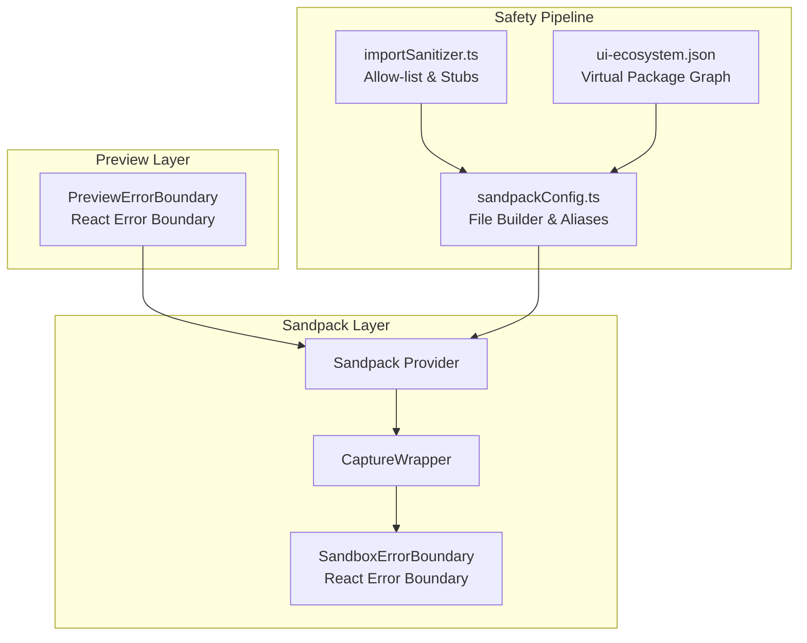
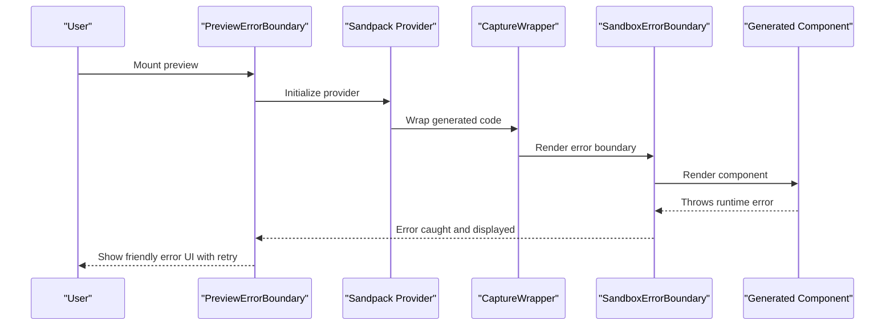
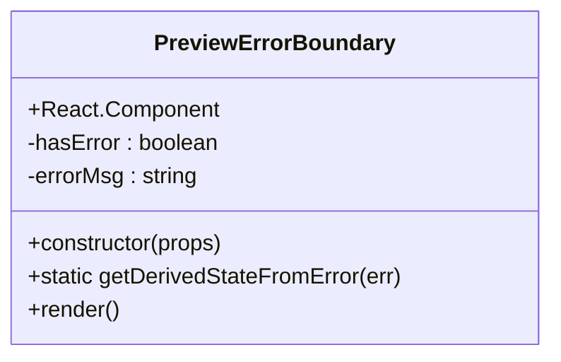
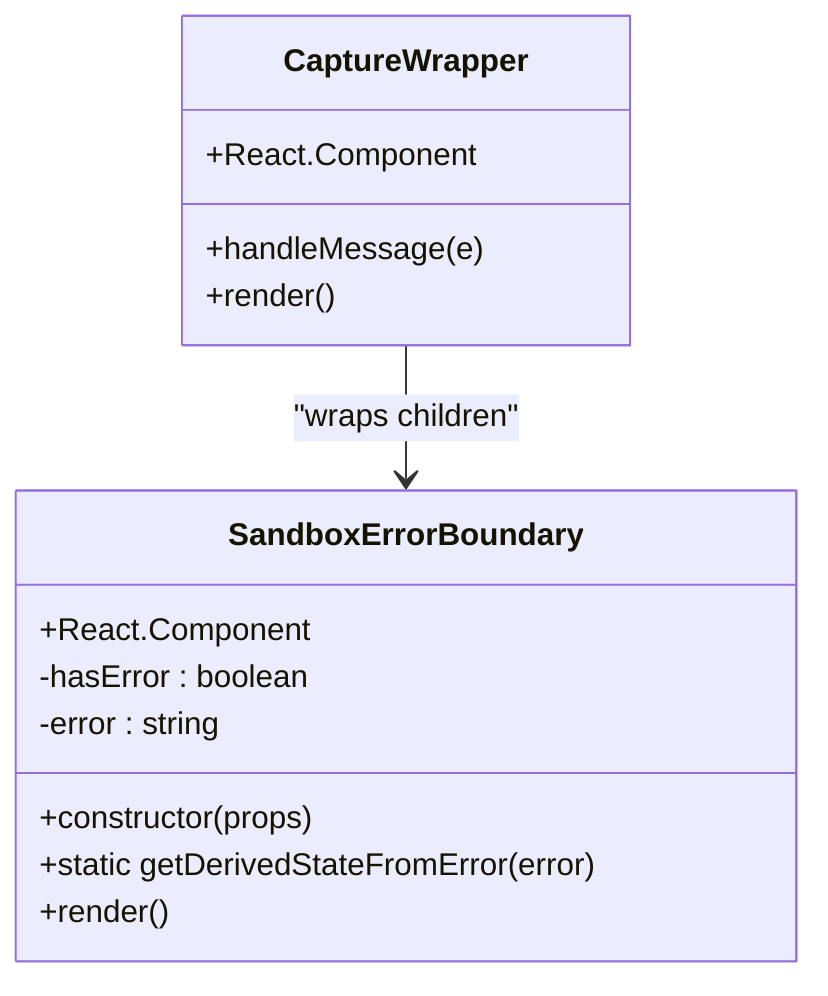
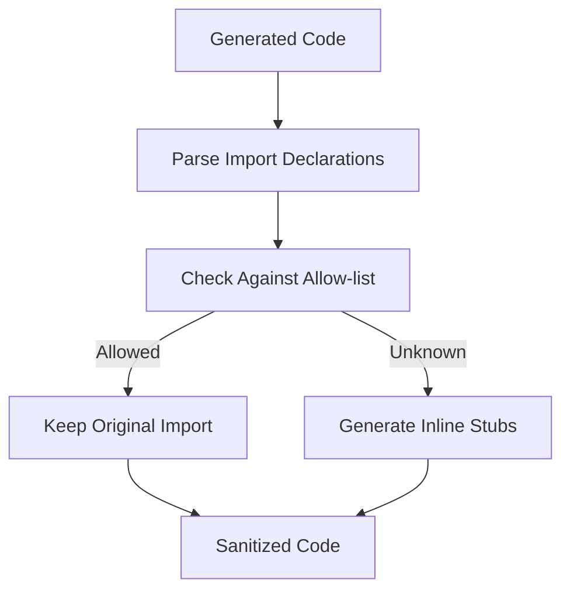
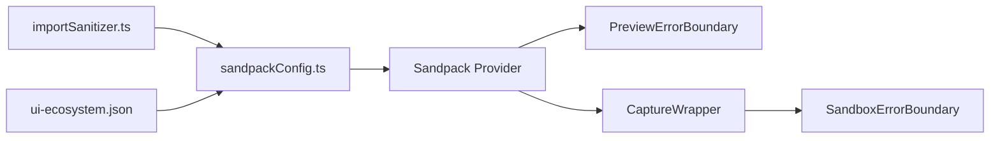

# Sandbox Error Boundary

<cite>
**Referenced Files in This Document**
- [SandpackPreview.tsx](file://components/SandpackPreview.tsx)
- [sandpackConfig.ts](file://lib/sandbox/sandpackConfig.ts)
- [importSanitizer.ts](file://lib/sandbox/importSanitizer.ts)
- [ui-ecosystem.json](file://lib/sandbox/ui-ecosystem.json)
</cite>

## Table of Contents
1. [Introduction](#introduction)
2. [Project Structure](#project-structure)
3. [Core Components](#core-components)
4. [Architecture Overview](#architecture-overview)
5. [Detailed Component Analysis](#detailed-component-analysis)
6. [Dependency Analysis](#dependency-analysis)
7. [Performance Considerations](#performance-considerations)
8. [Troubleshooting Guide](#troubleshooting-guide)
9. [Conclusion](#conclusion)

## Introduction
This document explains the Sandbox Error Boundary implementation used to gracefully handle runtime crashes in the AI-generated UI preview system. The system consists of two complementary error boundaries: a preview-level boundary that handles React component mounting failures, and a sandbox-level boundary that intercepts runtime errors from generated code within the Sandpack environment. Together, they provide robust error handling for AI-generated React components during live preview.

## Project Structure
The Sandbox Error Boundary spans three key areas:
- Preview-level error boundary: wraps the Sandpack preview to handle React mounting errors
- Sandpack-level error boundary: wraps generated code to catch runtime exceptions
- Code sanitization pipeline: ensures generated code can safely run in the sandbox

**Diagram sources**
- [SandpackPreview.tsx:156-187](file://components/SandpackPreview.tsx#L156-L187)
- [sandpackConfig.ts:257-309](file://lib/sandbox/sandpackConfig.ts#L257-L309)
- [importSanitizer.ts:16-47](file://lib/sandbox/importSanitizer.ts#L16-L47)
- [ui-ecosystem.json:1-42](file://lib/sandbox/ui-ecosystem.json#L1-L42)

**Section sources**
- [SandpackPreview.tsx:156-187](file://components/SandpackPreview.tsx#L156-L187)
- [sandpackConfig.ts:257-309](file://lib/sandbox/sandpackConfig.ts#L257-L309)
- [importSanitizer.ts:16-47](file://lib/sandbox/importSanitizer.ts#L16-L47)
- [ui-ecosystem.json:1-42](file://lib/sandbox/ui-ecosystem.json#L1-L42)

## Core Components
- PreviewErrorBoundary: React class component that catches React mounting errors in the live preview
- SandboxErrorBoundary: React class component that wraps generated code to catch runtime exceptions
- SandpackProvider: Sandpack runtime that hosts the preview and manages status/error signals
- CaptureWrapper: Higher-order wrapper that injects the sandbox error boundary around generated code
- Import sanitizer: Validates and sanitizes imports to prevent unresolved dependencies in the sandbox
- Sandpack file builder: Constructs the virtual filesystem, injects error boundaries, and resolves aliases

**Section sources**
- [SandpackPreview.tsx:156-187](file://components/SandpackPreview.tsx#L156-L187)
- [sandpackConfig.ts:257-309](file://lib/sandbox/sandpackConfig.ts#L257-L309)
- [sandpackConfig.ts:112-453](file://lib/sandbox/sandpackConfig.ts#L112-L453)
- [importSanitizer.ts:169-224](file://lib/sandbox/importSanitizer.ts#L169-L224)

## Architecture Overview
The error boundary architecture operates in two layers:
1. Preview-level boundary: Catches React errors thrown by the generated component during mount/update
2. Sandpack-level boundary: Catches runtime exceptions from the generated code executed inside Sandpack

**Diagram sources**
- [SandpackPreview.tsx:276-360](file://components/SandpackPreview.tsx#L276-L360)
- [sandpackConfig.ts:257-309](file://lib/sandbox/sandpackConfig.ts#L257-L309)

## Detailed Component Analysis

### PreviewErrorBoundary
The preview-level error boundary is a React class component that:
- Uses getDerivedStateFromError to capture React errors
- Renders a friendly error UI with a retry action
- Resets the error state when the user retries

**Diagram sources**
- [SandpackPreview.tsx:156-187](file://components/SandpackPreview.tsx#L156-L187)

**Section sources**
- [SandpackPreview.tsx:156-187](file://components/SandpackPreview.tsx#L156-L187)

### SandboxErrorBoundary
The sandbox-level error boundary is injected into the generated code via CaptureWrapper:
- Wraps the generated component to catch runtime exceptions
- Displays a detailed error message with the original error text
- Prevents cascading failures by isolating the generated code

**Diagram sources**
- [sandpackConfig.ts:257-309](file://lib/sandbox/sandpackConfig.ts#L257-L309)

**Section sources**
- [sandpackConfig.ts:257-309](file://lib/sandbox/sandpackConfig.ts#L257-L309)

### Sandpack Provider Integration
The preview integrates both error boundaries through the Sandpack provider:
- PreviewErrorBoundary wraps the entire Sandpack setup
- SandpackErrorBoundary is injected via CaptureWrapper into the generated code
- Crash detection monitors Sandpack status and error signals

**Diagram sources**
- [SandpackPreview.tsx:276-360](file://components/SandpackPreview.tsx#L276-L360)
- [sandpackConfig.ts:300-307](file://lib/sandbox/sandpackConfig.ts#L300-L307)

**Section sources**
- [SandpackPreview.tsx:276-360](file://components/SandpackPreview.tsx#L276-L360)
- [sandpackConfig.ts:300-307](file://lib/sandbox/sandpackConfig.ts#L300-L307)

### Import Sanitization Pipeline
The import sanitizer ensures generated code can run safely in the sandbox:
- Maintains an allow-list of supported packages
- Replaces unknown imports with inline stubs
- Handles side-effect imports and named/default exports

**Diagram sources**
- [importSanitizer.ts:169-224](file://lib/sandbox/importSanitizer.ts#L169-L224)

**Section sources**
- [importSanitizer.ts:16-47](file://lib/sandbox/importSanitizer.ts#L16-L47)
- [importSanitizer.ts:169-224](file://lib/sandbox/importSanitizer.ts#L169-L224)

## Dependency Analysis
The error boundary system relies on several key dependencies:
- Sandpack React components for preview hosting
- Virtual filesystem construction for generated code
- Package alias resolution for @ui ecosystem
- Import sanitization for sandbox compatibility

**Diagram sources**
- [sandpackConfig.ts:112-453](file://lib/sandbox/sandpackConfig.ts#L112-L453)
- [importSanitizer.ts:16-47](file://lib/sandbox/importSanitizer.ts#L16-L47)
- [ui-ecosystem.json:1-42](file://lib/sandbox/ui-ecosystem.json#L1-L42)

**Section sources**
- [sandpackConfig.ts:112-453](file://lib/sandbox/sandpackConfig.ts#L112-L453)
- [importSanitizer.ts:16-47](file://lib/sandbox/importSanitizer.ts#L16-L47)
- [ui-ecosystem.json:1-42](file://lib/sandbox/ui-ecosystem.json#L1-L42)

## Performance Considerations
- Error boundaries add minimal overhead during normal operation
- Sandpack virtual filesystem size impacts startup time; the system optimizes by injecting only needed @ui packages
- Import sanitization runs once per code generation to prevent repeated sandbox failures
- Crash detection avoids unnecessary retries by monitoring Sandpack status and error signals

## Troubleshooting Guide
Common issues and resolutions:
- Preview crashes immediately: Check for unresolved imports in generated code; the import sanitizer replaces unknown packages with stubs
- Sandpack timeout errors: Reduce dependency count or simplify the generated component
- Error boundary not catching errors: Verify both PreviewErrorBoundary and SandboxErrorBoundary are properly wrapped around the generated code
- Memory limit exceeded: The crash detection logic triggers a retry mechanism to recover from runtime exits

**Section sources**
- [SandpackPreview.tsx:113-150](file://components/SandpackPreview.tsx#L113-L150)
- [sandpackConfig.ts:257-309](file://lib/sandbox/sandpackConfig.ts#L257-L309)

## Conclusion
The Sandbox Error Boundary system provides comprehensive error handling for AI-generated React components in the live preview environment. By combining preview-level and sandbox-level error boundaries with a robust import sanitization pipeline, the system ensures reliable operation even when dealing with potentially problematic generated code. The modular architecture allows for easy maintenance and extension while maintaining excellent user experience through graceful error recovery and informative error messages.