# Sandbox Runtime Crash Handling

<cite>
**Referenced Files in This Document**
- [SandpackPreview.tsx](file://components/SandpackPreview.tsx)
- [sandpackConfig.ts](file://lib/sandbox/sandpackConfig.ts)
- [importSanitizer.ts](file://lib/sandbox/importSanitizer.ts)
- [RightPanel.tsx](file://components/ide/RightPanel.tsx)
</cite>

## Table of Contents
1. [Introduction](#introduction)
2. [System Architecture](#system-architecture)
3. [Crash Detection Mechanisms](#crash-detection-mechanisms)
4. [Error Boundaries and Recovery](#error-boundaries-and-recovery)
5. [Runtime Environment Management](#runtime-environment-management)
6. [Screenshot Capture Integration](#screenshot-capture-integration)
7. [Performance Optimization Strategies](#performance-optimization-strategies)
8. [Troubleshooting and Debugging](#troubleshooting-and-debugging)
9. [Best Practices](#best-practices)
10. [Conclusion](#conclusion)

## Introduction

The Sandbox Runtime Crash Handling system is a critical component of the AI-powered accessibility-first UI engine designed to provide robust error detection, recovery mechanisms, and graceful degradation when the Sandpack runtime encounters failures. This system ensures that generated UI components can be previewed reliably even when encountering runtime crashes, dependency conflicts, or memory limitations.

The system operates through multiple layers of monitoring, error containment, and automatic recovery mechanisms that work together to maintain a smooth user experience during the AI-generated UI development process.

## System Architecture

The crash handling system is built around three primary architectural layers:

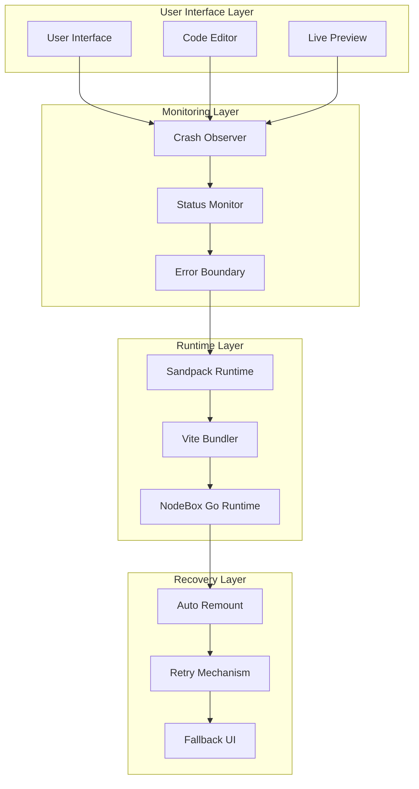

**Diagram sources**
- [SandpackPreview.tsx:105-150](file://components/SandpackPreview.tsx#L105-L150)
- [sandpackConfig.ts:257-307](file://lib/sandbox/sandpackConfig.ts#L257-L307)

The architecture employs a multi-layered approach where each layer serves a specific purpose in detecting, containing, and recovering from runtime crashes.

## Crash Detection Mechanisms

### Real-time Status Monitoring

The system implements comprehensive crash detection through multiple monitoring strategies:

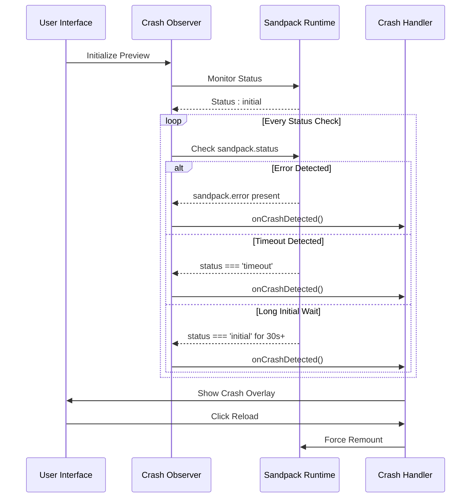

**Diagram sources**
- [SandpackPreview.tsx:113-149](file://components/SandpackPreview.tsx#L113-L149)

### Multi-Faceted Detection Criteria

The crash detection system monitors several critical indicators:

| Detection Method | Trigger Condition | Timeout Threshold | Action Taken |
|------------------|-------------------|-------------------|--------------|
| Error Object Check | `sandpack.error` exists | Immediate | Crash detected |
| Timeout Status Check | `sandpack.status === 'timeout'` | Immediate | Crash detected |
| Initial State Timeout | `sandpack.status === 'initial'` for > 30 seconds | 30,000ms | Crash detected |
| Manual Override | User-initiated reload | N/A | Force remount |

**Section sources**
- [SandpackPreview.tsx:122-146](file://components/SandpackPreview.tsx#L122-L146)

### Automatic Component Remounting

When a crash is detected, the system automatically triggers a component remount to reset the runtime environment:

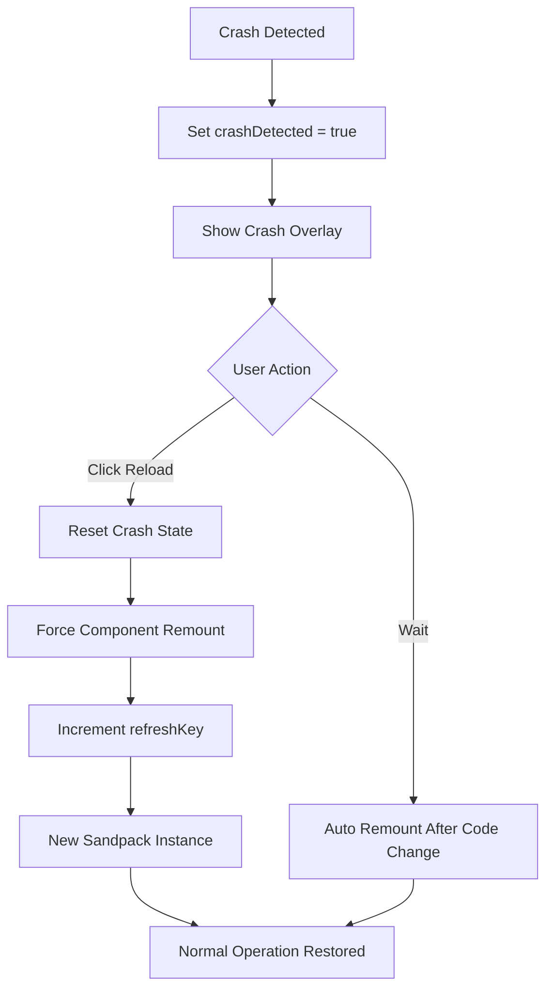

**Diagram sources**
- [SandpackPreview.tsx:208-228](file://components/SandpackPreview.tsx#L208-L228)

**Section sources**
- [SandpackPreview.tsx:208-218](file://components/SandpackPreview.tsx#L208-L218)

## Error Boundaries and Recovery

### Dual-Level Error Containment

The system implements a two-tier error boundary strategy to contain and recover from runtime failures:

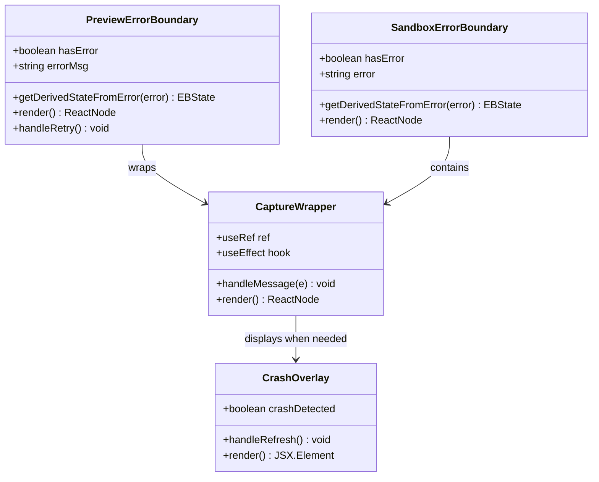

**Diagram sources**
- [SandpackPreview.tsx:156-187](file://components/SandpackPreview.tsx#L156-L187)
- [sandpackConfig.ts:260-307](file://lib/sandbox/sandpackConfig.ts#L260-L307)

### Error Boundary Implementation Details

The error boundaries serve distinct purposes in the crash recovery hierarchy:

| Boundary Type | Purpose | Error Scope | Recovery Mechanism |
|---------------|---------|-------------|-------------------|
| PreviewErrorBoundary | Top-level UI boundary | Component rendering failures | Local retry button |
| SandboxErrorBoundary | Sandpack-contained boundary | Generated component crashes | Sandpack-level recovery |
| CaptureWrapper | Integration boundary | Message handling conflicts | Fallback UI display |

**Section sources**
- [sandpackConfig.ts:260-284](file://lib/sandbox/sandpackConfig.ts#L260-L284)
- [SandpackPreview.tsx:156-187](file://components/SandpackPreview.tsx#L156-L187)

### Graceful Degradation UI

When crashes occur, the system provides informative fallback interfaces:

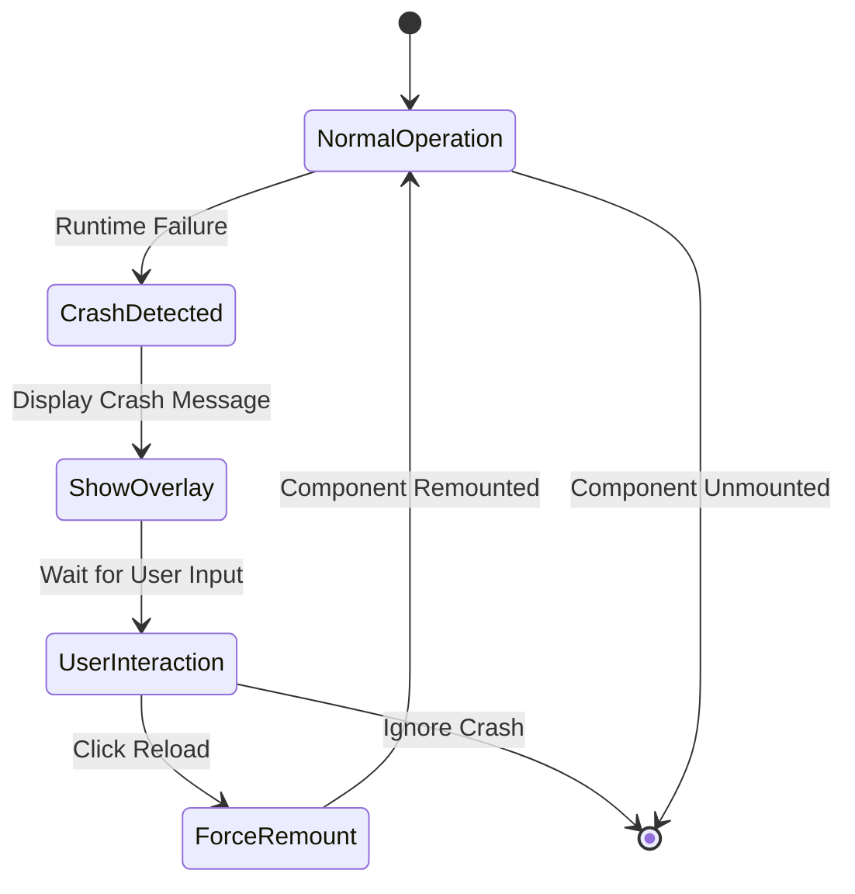

**Diagram sources**
- [SandpackPreview.tsx:319-333](file://components/SandpackPreview.tsx#L319-L333)

**Section sources**
- [SandpackPreview.tsx:319-333](file://components/SandpackPreview.tsx#L319-L333)

## Runtime Environment Management

### Dependency Injection and Package Management

The system dynamically manages dependencies to prevent runtime crashes:

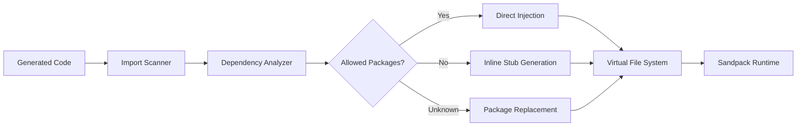

**Diagram sources**
- [importSanitizer.ts:169-205](file://lib/sandbox/importSanitizer.ts#L169-L205)
- [sandpackConfig.ts:400-451](file://lib/sandbox/sandpackConfig.ts#L400-L451)

### Dynamic Dependency Resolution

The system implements intelligent dependency resolution to minimize runtime overhead:

| Dependency Category | Detection Method | Action Taken | Performance Impact |
|---------------------|------------------|--------------|-------------------|
| Direct Dependencies | Regex pattern matching | Inject minimal packages | Low |
| Transitive Dependencies | Package graph traversal | Include only needed files | Medium |
| Unused Dependencies | Code analysis | Exclude from virtual FS | High |
| Circular Dependencies | Graph cycle detection | Break cycles with stubs | Medium |

**Section sources**
- [importSanitizer.ts:169-205](file://lib/sandbox/importSanitizer.ts#L169-L205)
- [sandpackConfig.ts:416-450](file://lib/sandbox/sandpackConfig.ts#L416-L450)

### Memory and Resource Optimization

The runtime environment is optimized to prevent memory-related crashes:

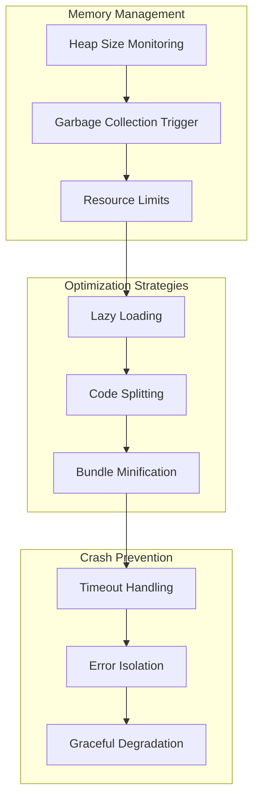

**Diagram sources**
- [sandpackConfig.ts:393-450](file://lib/sandbox/sandpackConfig.ts#L393-L450)

**Section sources**
- [sandpackConfig.ts:393-450](file://lib/sandbox/sandpackConfig.ts#L393-L450)

## Screenshot Capture Integration

### Post-Message Communication Protocol

The system integrates screenshot capture with crash handling through a robust messaging protocol:

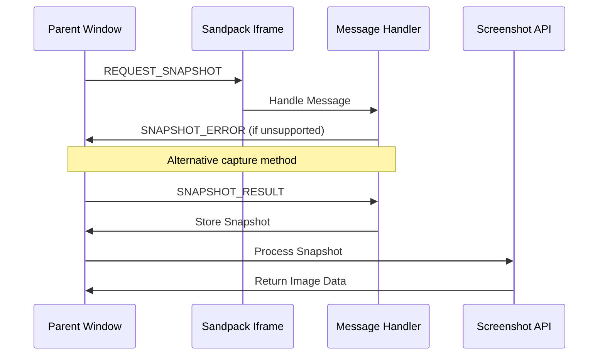

**Diagram sources**
- [sandpackConfig.ts:289-293](file://lib/sandbox/sandpackConfig.ts#L289-L293)
- [RightPanel.tsx:132-173](file://components/ide/RightPanel.tsx#L132-L173)

### Fallback Capture Mechanisms

The system provides multiple capture fallback strategies:

| Capture Method | Trigger Condition | Fallback Behavior | Reliability |
|----------------|-------------------|-------------------|-------------|
| Post-Message | Sandpack supports messaging | Direct capture | High |
| Flag URL | Local iframe capture | Internal preview URL | Medium |
| External URL | External iframe source | Direct iframe URL | Medium |
| Timeout | No response within 12s | Null result | Low |

**Section sources**
- [RightPanel.tsx:143-173](file://components/ide/RightPanel.tsx#L143-L173)
- [SandpackPreview.tsx:88-96](file://components/SandpackPreview.tsx#L88-L96)

## Performance Optimization Strategies

### Startup Time Optimization

The system implements several strategies to minimize startup time and prevent timeout-related crashes:

```mermaid
graph LR
subgraph "Startup Optimization"
CodeInjection[Selective Code Injection]
LazyInitialization[Lazy Initialization]
ParallelLoading[Parallel Loading]
end
subgraph "Runtime Optimization"
MemoryPooling[Memory Pooling]
RequestDebouncing[Request Debouncing]
CacheOptimization[Cache Optimization]
end
subgraph "Prevention Strategies"
DependencyPruning[Dependency Pruning]
BundleAnalysis[Bundle Analysis]
ResourceMonitoring[Resource Monitoring]
end
CodeInjection --> LazyInitialization
LazyInitialization --> ParallelLoading
ParallelLoading --> MemoryPooling
MemoryPooling --> RequestDebouncing
RequestDebouncing --> CacheOptimization
CacheOptimization --> DependencyPruning
DependencyPruning --> BundleAnalysis
BundleAnalysis --> ResourceMonitoring
```

**Diagram sources**
- [sandpackConfig.ts:393-450](file://lib/sandbox/sandpackConfig.ts#L393-L450)

### Resource Management

The system employs sophisticated resource management to prevent memory exhaustion:

| Resource Type | Monitoring Method | Threshold | Recovery Action |
|---------------|-------------------|-----------|-----------------|
| Memory Usage | Heap snapshot analysis | 80% threshold | Trigger GC |
| CPU Usage | Performance metrics | 90% threshold | Pause non-essential tasks |
| Network Requests | Request queue monitoring | 50 concurrent limit | Queue requests |
| File System | Virtual FS size tracking | 10MB limit | Purge unused files |

**Section sources**
- [sandpackConfig.ts:393-450](file://lib/sandbox/sandpackConfig.ts#L393-L450)

## Troubleshooting and Debugging

### Common Crash Scenarios and Solutions

| Scenario | Symptoms | Root Cause | Solution |
|----------|----------|------------|----------|
| Timeout Error | Status remains 'initial' for 30s+ | Too many dependencies | Reduce imports |
| Memory Crash | Out of memory errors | Large bundle size | Split components |
| Import Error | "Cannot resolve import" | Unknown package | Use allowed packages |
| Runtime Error | Component fails to mount | Invalid React syntax | Fix code generation |
| Infinite Loop | High CPU usage | Recursive rendering | Add memoization |

### Debug Information Collection

The system captures comprehensive debug information for crash analysis:

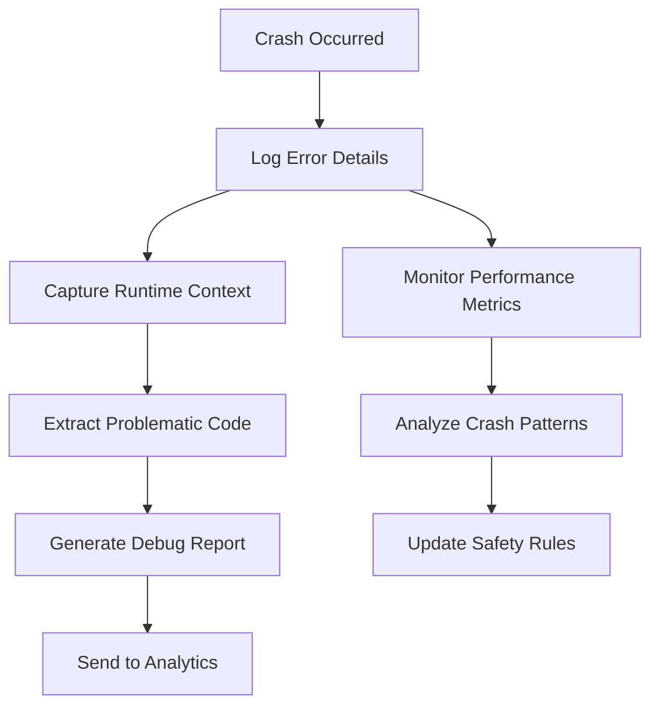

**Diagram sources**
- [SandpackPreview.tsx:125-137](file://components/SandpackPreview.tsx#L125-L137)

### Developer Tools Integration

The system provides developer-friendly debugging capabilities:

| Tool | Functionality | Access Method |
|------|---------------|---------------|
| Error Console | Display crash details | Click on error message |
| Code Inspector | View problematic code | Right-click on component |
| Dependency Viewer | See loaded packages | Preview menu option |
| Performance Monitor | Track resource usage | Developer panel |
| Crash History | View recent failures | Settings panel |

**Section sources**
- [SandpackPreview.tsx:168-186](file://components/SandpackPreview.tsx#L168-L186)

## Best Practices

### Code Generation Guidelines

To minimize crash probability, follow these best practices:

1. **Dependency Management**
   - Use only allowed packages from the whitelist
   - Avoid deep import chains
   - Prefer lightweight alternatives

2. **Component Structure**
   - Keep components small and focused
   - Use proper React patterns
   - Avoid complex lifecycle methods

3. **Error Handling**
   - Implement proper try-catch blocks
   - Handle async operations carefully
   - Validate all user inputs

4. **Performance Considerations**
   - Use memoization for expensive computations
   - Implement lazy loading for heavy components
   - Optimize rendering performance

### Runtime Environment Setup

Configure the runtime environment for optimal stability:

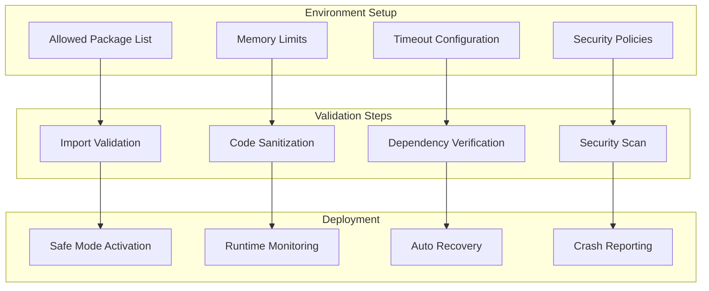

**Diagram sources**
- [importSanitizer.ts:10-14](file://lib/sandbox/importSanitizer.ts#L10-L14)
- [sandpackConfig.ts:455-521](file://lib/sandbox/sandpackConfig.ts#L455-L521)

## Conclusion

The Sandbox Runtime Crash Handling system represents a comprehensive solution for maintaining stability in AI-generated UI environments. Through its multi-layered approach combining real-time monitoring, intelligent error containment, and automatic recovery mechanisms, the system ensures reliable operation even when encountering unexpected runtime failures.

Key strengths of the system include:

- **Proactive Detection**: Multiple monitoring strategies prevent crashes from going unnoticed
- **Intelligent Recovery**: Automatic component remounting restores functionality quickly
- **Graceful Degradation**: Informative fallback interfaces maintain user experience
- **Performance Optimization**: Dynamic dependency management prevents resource exhaustion
- **Developer Support**: Comprehensive debugging tools facilitate issue resolution

The system's architecture provides a robust foundation for handling the complexities of AI-generated code while maintaining the reliability expectations of a production UI engine. Future enhancements could include machine learning-based crash prediction and adaptive resource allocation based on component complexity analysis.