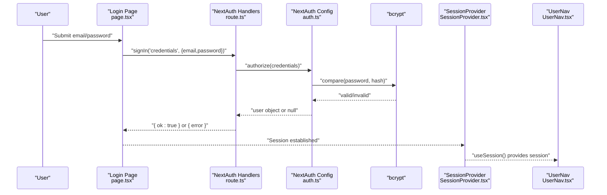
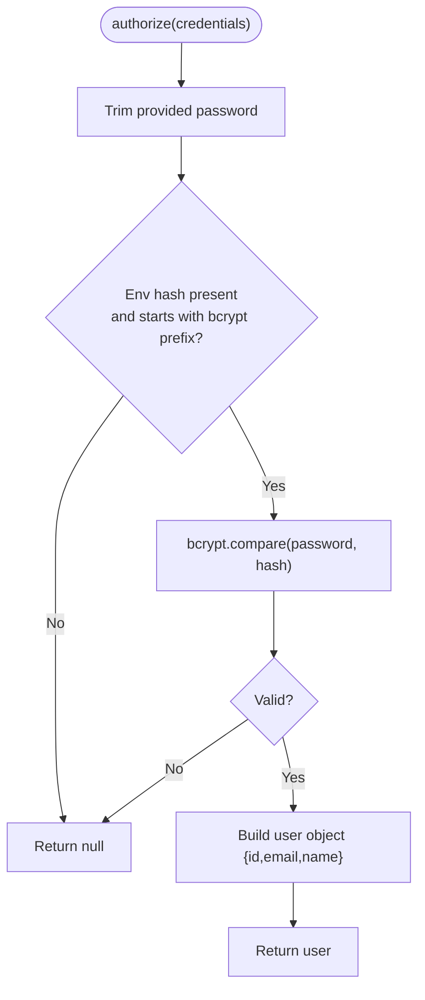
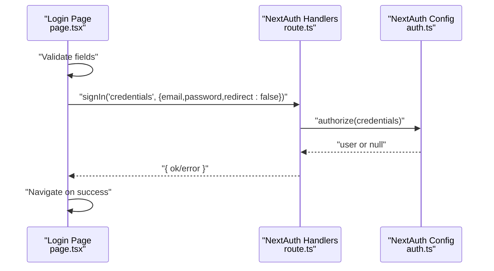
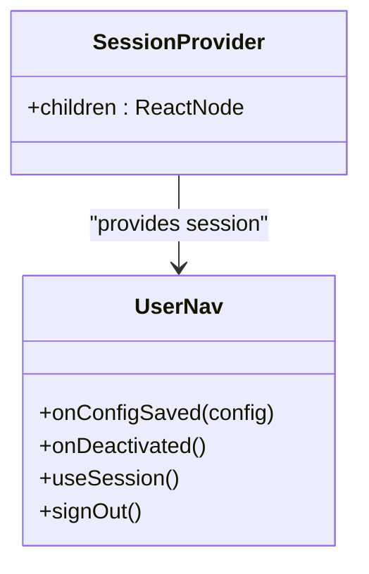
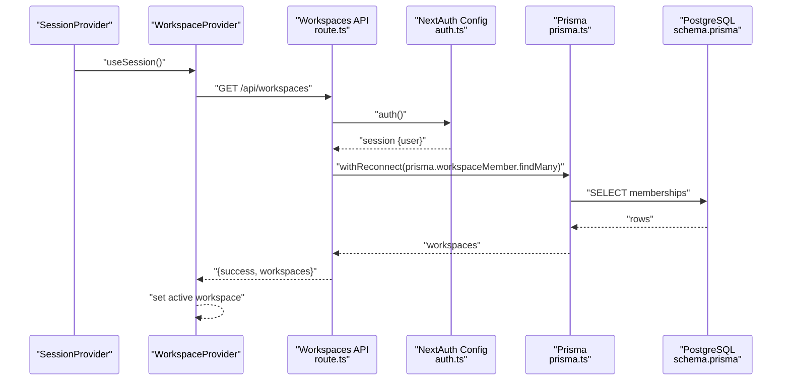
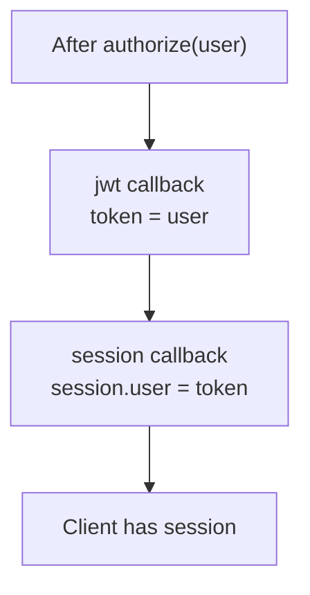
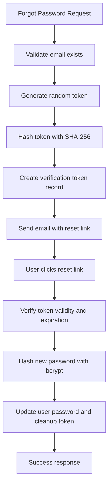
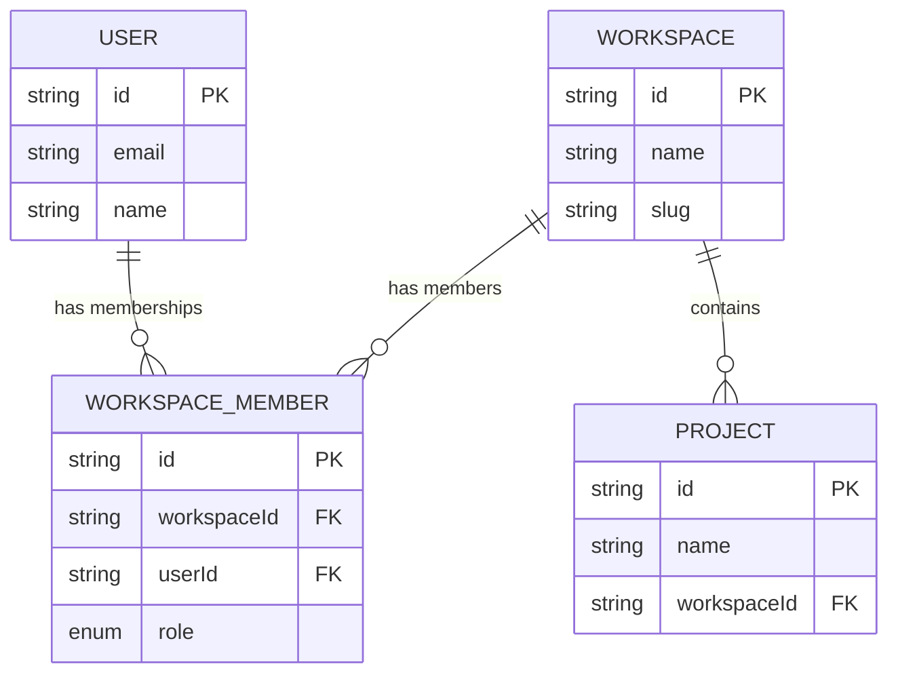
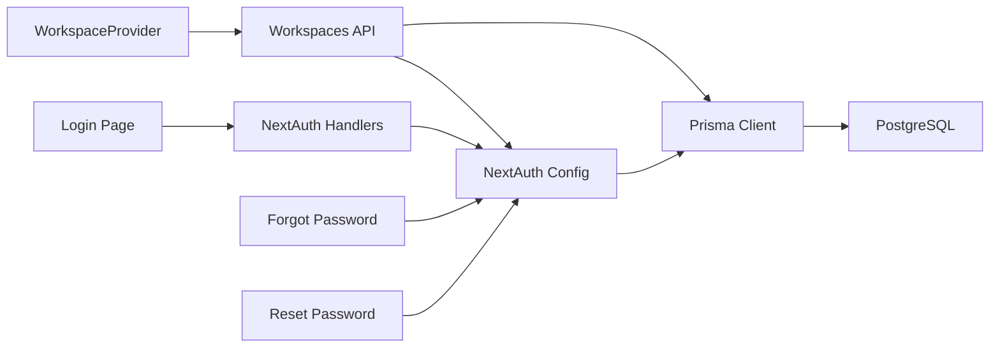

# Authentication & Authorization

<cite>
**Referenced Files in This Document**
- [route.ts](file://app/api/auth/[...nextauth]/route.ts)
- [auth.ts](file://lib/auth.ts)
- [SessionProvider.tsx](file://components/auth/SessionProvider.tsx)
- [UserNav.tsx](file://components/auth/UserNav.tsx)
- [page.tsx](file://app/login/page.tsx)
- [WorkspaceProvider.tsx](file://components/workspace/WorkspaceProvider.tsx)
- [WorkspaceSwitcher.tsx](file://components/workspace/WorkspaceSwitcher.tsx)
- [route.ts](file://app/api/workspaces/route.ts)
- [route.ts](file://app/api/projects/route.ts)
- [prisma.ts](file://lib/prisma.ts)
- [schema.prisma](file://prisma/schema.prisma)
- [ENV_SETUP.md](file://docs/ENV_SETUP.md)
- [generate-hash.js](file://scripts/generate-hash.js)
- [reset-password.js](file://scripts/reset-password.js)
- [route.ts](file://app/api/auth/forgot-password/route.ts)
- [route.ts](file://app/api/auth/reset-password/route.ts)
</cite>

## Update Summary
**Changes Made**
- Updated authentication flow documentation to reflect the current implementation without backward compatibility shims
- Removed references to the eliminated authentication hook (lib/hooks/useAuth.ts)
- Updated workspace-based access control documentation to reflect current multi-tenant patterns
- Enhanced security considerations for password reset functionality
- Updated troubleshooting guide to address current authentication state management

## Table of Contents
1. [Introduction](#introduction)
2. [Project Structure](#project-structure)
3. [Core Components](#core-components)
4. [Architecture Overview](#architecture-overview)
5. [Detailed Component Analysis](#detailed-component-analysis)
6. [Dependency Analysis](#dependency-analysis)
7. [Performance Considerations](#performance-considerations)
8. [Troubleshooting Guide](#troubleshooting-guide)
9. [Conclusion](#conclusion)
10. [Appendices](#appendices)

## Introduction
This document explains the authentication and authorization system for the AI-powered UI engine. It covers the NextAuth.js integration with a custom credentials provider, JWT session strategy, bcrypt-based password verification, single-access password configuration, user roles and permissions, and session management with 7-day expiration. It also documents the authentication flow from the login page through session creation, security considerations for credential handling and password hashing, authorization callbacks, session token management, and integration with workspace-based access control. Setup instructions for environment variables, security best practices for password storage, troubleshooting common authentication issues, multi-tenant authorization patterns, and user navigation components are included.

**Updated** The system now operates with a streamlined authentication architecture that eliminates backward compatibility shims and focuses on direct NextAuth integration for improved reliability and security.

## Project Structure
Authentication and authorization are implemented across a focused set of modules:
- NextAuth entrypoint routes
- NextAuth configuration with credentials provider and JWT callbacks
- Client-side session provider and user navigation
- Workspace provider and switcher for multi-tenant access control
- API routes enforcing authorization via NextAuth session
- Password reset functionality with secure token management
- Prisma schema modeling users, workspaces, and memberships
- Environment setup and password hash generation utilities

```mermaid
graph TB
subgraph "Client"
LP["Login Page<br/>app/login/page.tsx"]
SP["SessionProvider<br/>components/auth/SessionProvider.tsx"]
UN["UserNav<br/>components/auth/UserNav.tsx"]
WP["WorkspaceProvider<br/>components/workspace/WorkspaceProvider.tsx"]
WS["WorkspaceSwitcher<br/>components/workspace/WorkspaceSwitcher.tsx"]
end
subgraph "Server"
NA["NextAuth Handlers<br/>app/api/auth/[...nextauth]/route.ts"]
CFG["NextAuth Config<br/>lib/auth.ts"]
FP["Forgot Password<br/>app/api/auth/forgot-password/route.ts"]
RP["Reset Password<br/>app/api/auth/reset-password/route.ts"]
WSR["Workspaces API<br/>app/api/workspaces/route.ts"]
PR["Prisma Client<br/>lib/prisma.ts"]
DB["PostgreSQL Schema<br/>prisma/schema.prisma"]
end
LP --> SP
SP --> UN
SP --> WP
WP --> WS
LP --> |signIn('credentials')| NA
NA --> CFG
CFG --> PR
PR --> DB
WSR --> CFG
WSR --> PR
FP --> CFG
RP --> CFG
```

**Diagram sources**
- [route.ts:1-4](file://app/api/auth/[...nextauth]/route.ts#L1-L4)
- [auth.ts:11-87](file://lib/auth.ts#L11-L87)
- [SessionProvider.tsx:1-8](file://components/auth/SessionProvider.tsx#L1-L8)
- [UserNav.tsx:1-265](file://components/auth/UserNav.tsx#L1-L265)
- [WorkspaceProvider.tsx:1-155](file://components/workspace/WorkspaceProvider.tsx#L1-L155)
- [WorkspaceSwitcher.tsx:1-196](file://components/workspace/WorkspaceSwitcher.tsx#L1-L196)
- [route.ts:1-145](file://app/api/workspaces/route.ts#L1-L145)
- [route.ts:1-94](file://app/api/auth/forgot-password/route.ts#L1-L94)
- [route.ts:1-65](file://app/api/auth/reset-password/route.ts#L1-L65)
- [prisma.ts:1-70](file://lib/prisma.ts#L1-L70)
- [schema.prisma:1-222](file://prisma/schema.prisma#L1-L222)

**Section sources**
- [route.ts:1-4](file://app/api/auth/[...nextauth]/route.ts#L1-L4)
- [auth.ts:11-87](file://lib/auth.ts#L11-L87)
- [SessionProvider.tsx:1-8](file://components/auth/SessionProvider.tsx#L1-L8)
- [UserNav.tsx:1-265](file://components/auth/UserNav.tsx#L1-L265)
- [WorkspaceProvider.tsx:1-155](file://components/workspace/WorkspaceProvider.tsx#L1-L155)
- [WorkspaceSwitcher.tsx:1-196](file://components/workspace/WorkspaceSwitcher.tsx#L1-L196)
- [route.ts:1-145](file://app/api/workspaces/route.ts#L1-L145)
- [route.ts:1-94](file://app/api/auth/forgot-password/route.ts#L1-L94)
- [route.ts:1-65](file://app/api/auth/reset-password/route.ts#L1-L65)
- [prisma.ts:1-70](file://lib/prisma.ts#L1-L70)
- [schema.prisma:1-222](file://prisma/schema.prisma#L1-L222)

## Core Components
- NextAuth configuration with a custom credentials provider and JWT strategy
- Login page that triggers credential-based authentication
- Client-side session provider and user navigation component
- Workspace provider and switcher for multi-tenant access control
- API routes enforcing authorization via NextAuth session
- Password reset functionality with secure token management and email notifications

Key implementation highlights:
- Single-access password: bcrypt hash configured via environment variable
- JWT session strategy with 7-day max age
- Authorization callbacks populate session token and session from the user object
- Workspace membership determines access to workspaces and related resources
- Secure password reset workflow with 15-minute token expiration
- Comprehensive error handling and security logging throughout the authentication flow

**Section sources**
- [auth.ts:5-15](file://lib/auth.ts#L5-L15)
- [auth.ts:17-61](file://lib/auth.ts#L17-L61)
- [auth.ts:63-87](file://lib/auth.ts#L63-L87)
- [page.tsx:71-103](file://app/login/page.tsx#L71-L103)
- [SessionProvider.tsx:1-8](file://components/auth/SessionProvider.tsx#L1-L8)
- [UserNav.tsx:17-59](file://components/auth/UserNav.tsx#L17-L59)
- [WorkspaceProvider.tsx:27-127](file://components/workspace/WorkspaceProvider.tsx#L27-L127)
- [route.ts:31-45](file://app/api/workspaces/route.ts#L31-L45)
- [route.ts:10-94](file://app/api/auth/forgot-password/route.ts#L10-L94)
- [route.ts:6-65](file://app/api/auth/reset-password/route.ts#L6-L65)

## Architecture Overview
The authentication flow uses NextAuth.js with a custom credentials provider. The login page submits credentials to NextAuth, which validates against the configured bcrypt hash. On success, a JWT session is created and stored. Client components consume the session via NextAuth's React provider and expose user navigation. Workspace access is enforced server-side via NextAuth session checks in API routes. The system includes comprehensive password reset functionality with secure token management and email notifications.



**Diagram sources**
- [page.tsx:71-103](file://app/login/page.tsx#L71-L103)
- [route.ts:1-4](file://app/api/auth/[...nextauth]/route.ts#L1-L4)
- [auth.ts:25-59](file://lib/auth.ts#L25-L59)
- [SessionProvider.tsx:1-8](file://components/auth/SessionProvider.tsx#L1-L8)
- [UserNav.tsx:17-18](file://components/auth/UserNav.tsx#L17-L18)

**Section sources**
- [auth.ts:11-15](file://lib/auth.ts#L11-L15)
- [auth.ts:17-61](file://lib/auth.ts#L17-L61)
- [auth.ts:63-87](file://lib/auth.ts#L63-L87)
- [page.tsx:71-103](file://app/login/page.tsx#L71-L103)
- [SessionProvider.tsx:1-8](file://components/auth/SessionProvider.tsx#L1-L8)
- [UserNav.tsx:17-18](file://components/auth/UserNav.tsx#L17-L18)

## Detailed Component Analysis

### NextAuth Configuration and Credentials Provider
- Strategy: JWT with 7-day max age
- Provider: Custom credentials with email and password fields
- Authorization: Validates password against bcrypt hash from environment variable
- Callbacks: Populate JWT token and session with user identity
- Security: Comprehensive logging and error handling for authentication attempts



**Diagram sources**
- [auth.ts:25-59](file://lib/auth.ts#L25-L59)

**Section sources**
- [auth.ts:11-15](file://lib/auth.ts#L11-L15)
- [auth.ts:17-61](file://lib/auth.ts#L17-L61)
- [auth.ts:63-87](file://lib/auth.ts#L63-L87)

### Login Page and Credential Submission
- Collects email and password, trims and normalizes email
- Calls NextAuth signIn with credentials provider
- Handles errors and redirects on success
- Includes password visibility toggle and form validation



**Diagram sources**
- [page.tsx:71-103](file://app/login/page.tsx#L71-L103)
- [route.ts:1-4](file://app/api/auth/[...nextauth]/route.ts#L1-L4)
- [auth.ts:25-59](file://lib/auth.ts#L25-L59)

**Section sources**
- [page.tsx:71-103](file://app/login/page.tsx#L71-L103)

### Client Session Provider and User Navigation
- SessionProvider wraps the app to enable NextAuth React hooks
- UserNav displays unauthenticated prompt or authenticated menu with owner badge
- Uses NextAuth signOut to terminate session
- Provides profile management and account actions



**Diagram sources**
- [SessionProvider.tsx:1-8](file://components/auth/SessionProvider.tsx#L1-L8)
- [UserNav.tsx:17-59](file://components/auth/UserNav.tsx#L17-L59)

**Section sources**
- [SessionProvider.tsx:1-8](file://components/auth/SessionProvider.tsx#L1-L8)
- [UserNav.tsx:17-59](file://components/auth/UserNav.tsx#L17-L59)

### Workspace-Based Access Control
- WorkspaceProvider loads workspaces for the authenticated user and manages active workspace
- WorkspaceSwitcher renders the active workspace and allows switching or creating/deleting workspaces
- API routes enforce authorization via NextAuth session and membership roles
- Automatic workspace provisioning for new users



**Diagram sources**
- [WorkspaceProvider.tsx:27-127](file://components/workspace/WorkspaceProvider.tsx#L27-L127)
- [route.ts:31-45](file://app/api/workspaces/route.ts#L31-L45)
- [auth.ts:11-15](file://lib/auth.ts#L11-L15)
- [prisma.ts:58-69](file://lib/prisma.ts#L58-L69)
- [schema.prisma:84-95](file://prisma/schema.prisma#L84-L95)

**Section sources**
- [WorkspaceProvider.tsx:27-127](file://components/workspace/WorkspaceProvider.tsx#L27-L127)
- [WorkspaceSwitcher.tsx:7-60](file://components/workspace/WorkspaceSwitcher.tsx#L7-L60)
- [route.ts:31-45](file://app/api/workspaces/route.ts#L31-L45)
- [schema.prisma:84-95](file://prisma/schema.prisma#L84-L95)

### Authorization Callbacks and Session Token Management
- jwt callback: attach user identity to the JWT token
- session callback: populate session.user from token
- Pages: redirect to login on sign-in or error



**Diagram sources**
- [auth.ts:63-87](file://lib/auth.ts#L63-L87)

**Section sources**
- [auth.ts:63-87](file://lib/auth.ts#L63-L87)

### Password Reset System
- Secure token generation with SHA-256 hashing
- 15-minute expiration with database cleanup
- Email notification via Resend with security-focused messaging
- Transactional password update with bcrypt hashing
- Protection against user enumeration attacks



**Diagram sources**
- [route.ts:10-94](file://app/api/auth/forgot-password/route.ts#L10-L94)
- [route.ts:6-65](file://app/api/auth/reset-password/route.ts#L6-L65)

**Section sources**
- [route.ts:10-94](file://app/api/auth/forgot-password/route.ts#L10-L94)
- [route.ts:6-65](file://app/api/auth/reset-password/route.ts#L6-L65)

### Multi-Tenant Authorization Patterns
- WorkspaceRole enum defines OWNER, ADMIN, MEMBER
- WorkspaceMember links users to workspaces with a role
- API routes check session and membership for operations like deletion
- Projects API accepts workspaceId for scoping
- Automatic workspace provisioning for new authenticated users



**Diagram sources**
- [schema.prisma:40-52](file://prisma/schema.prisma#L40-L52)
- [schema.prisma:64-76](file://prisma/schema.prisma#L64-L76)
- [schema.prisma:84-95](file://prisma/schema.prisma#L84-L95)
- [schema.prisma:158-169](file://prisma/schema.prisma#L158-L169)

**Section sources**
- [schema.prisma:78-82](file://prisma/schema.prisma#L78-L82)
- [schema.prisma:84-95](file://prisma/schema.prisma#L84-L95)
- [route.ts:10-13](file://app/api/projects/route.ts#L10-L13)

## Dependency Analysis
- NextAuth handlers depend on NextAuth configuration
- Login page depends on NextAuth client hooks
- Workspace provider depends on NextAuth session and API routes
- API routes depend on NextAuth session and Prisma client
- Password reset functionality depends on email service and token management
- Prisma client depends on environment variables and database connectivity



**Diagram sources**
- [page.tsx:71-103](file://app/login/page.tsx#L71-L103)
- [route.ts:1-4](file://app/api/auth/[...nextauth]/route.ts#L1-L4)
- [auth.ts:11-15](file://lib/auth.ts#L11-L15)
- [prisma.ts:1-70](file://lib/prisma.ts#L1-L70)
- [route.ts:1-145](file://app/api/workspaces/route.ts#L1-L145)
- [route.ts:1-94](file://app/api/auth/forgot-password/route.ts#L1-L94)
- [route.ts:1-65](file://app/api/auth/reset-password/route.ts#L1-L65)

**Section sources**
- [page.tsx:71-103](file://app/login/page.tsx#L71-L103)
- [route.ts:1-4](file://app/api/auth/[...nextauth]/route.ts#L1-L4)
- [auth.ts:11-15](file://lib/auth.ts#L11-L15)
- [prisma.ts:1-70](file://lib/prisma.ts#L1-L70)
- [route.ts:1-145](file://app/api/workspaces/route.ts#L1-L145)
- [route.ts:1-94](file://app/api/auth/forgot-password/route.ts#L1-L94)
- [route.ts:1-65](file://app/api/auth/reset-password/route.ts#L1-L65)

## Performance Considerations
- JWT session strategy reduces database lookups for session validation
- Prisma withReconnect helper mitigates transient Neon connection issues
- Workspace loading is deferred until authenticated; initial render remains responsive
- Keep bcrypt cost balanced for security vs. latency; current configuration uses a standard cost
- Password reset tokens are automatically cleaned up after expiration
- Email service integration is optional and doesn't block authentication flow

## Troubleshooting Guide
Common issues and resolutions:
- Missing or invalid environment variables
  - Ensure AUTH_SECRET or NEXTAUTH_SECRET is set for NextAuth
  - Ensure OWNER_PASSWORD_HASH is set and begins with bcrypt prefix
  - Ensure database connection variables are configured
- Login failures
  - Verify password matches the stored bcrypt hash
  - Check for whitespace or quotes around the hash in environment configuration
  - Review authentication logs for detailed error messages
- Session not persisting
  - Confirm trustHost is enabled for deployment environments
  - Ensure cookies are not blocked by browser privacy settings
- Workspace access denied
  - Confirm user has a membership record with appropriate role
  - Verify API route checks are passing and returning 401/403 as expected
- Password reset issues
  - Verify RESEND_API_KEY is configured for email notifications
  - Check token expiration and database cleanup processes
  - Ensure email addresses match exactly (case-insensitive but trimmed)
- Database connectivity
  - Use withReconnect wrapper for transient connection errors
  - Validate DATABASE_URL/DIRECT_URL and network access

Environment setup references:
- Local and Vercel environment variables
- Generating ENCRYPTION_SECRET and database setup steps

**Section sources**
- [auth.ts:12-13](file://lib/auth.ts#L12-L13)
- [auth.ts:40-43](file://lib/auth.ts#L40-L43)
- [ENV_SETUP.md:1-89](file://docs/ENV_SETUP.md#L1-L89)
- [prisma.ts:58-69](file://lib/prisma.ts#L58-L69)

## Conclusion
The system employs a secure, single-owner authentication model using bcrypt-secured credentials and JWT sessions with a 7-day expiration. Client components integrate seamlessly with NextAuth for session management, while server-side API routes enforce authorization via NextAuth sessions and workspace memberships. The workspace provider and switcher deliver intuitive multi-tenant navigation and control. The system includes comprehensive password reset functionality with secure token management and email notifications. Proper environment configuration and adherence to security best practices ensure robust protection of the AI UI engine.

**Updated** The authentication architecture has been streamlined to eliminate backward compatibility shims while maintaining full functionality and security.

## Appendices

### Setup Instructions for Environment Variables
- Database: DATABASE_URL, DIRECT_URL
- Cache: UPSTASH_REDIS_REST_URL, UPSTASH_REDIS_REST_TOKEN
- Security: ENCRYPTION_SECRET
- AI Providers: OPENAI_API_KEY, ANTHROPIC_API_KEY, DEEPSEEK_API_KEY, GOOGLE_API_KEY
- NextAuth: AUTH_SECRET or NEXTAUTH_SECRET
- Owner credentials: OWNER_EMAIL, OWNER_PASSWORD_HASH
- Email services: RESEND_API_KEY (for password reset emails)
- Application URL: NEXT_PUBLIC_APP_URL (for password reset links)

Generate a bcrypt hash for OWNER_PASSWORD_HASH using the provided script.

**Section sources**
- [ENV_SETUP.md:1-89](file://docs/ENV_SETUP.md#L1-L89)
- [generate-hash.js:1-108](file://scripts/generate-hash.js#L1-L108)

### Security Best Practices for Password Storage
- Store only bcrypt hashes of passwords
- Use strong, random AUTH_SECRET/NEXTAUTH_SECRET
- Rotate secrets periodically and revoke existing sessions
- Limit exposure of environment variables in logs and CI
- Enforce HTTPS and secure cookie policies in production
- Implement rate limiting for authentication attempts
- Monitor authentication logs for suspicious activity

**Section sources**
- [auth.ts:5-9](file://lib/auth.ts#L5-L9)
- [auth.ts:12-13](file://lib/auth.ts#L12-L13)

### Password Hash Generation and Reset Utilities
- Use the generator script to produce a bcrypt hash with a configurable cost
- Use the reset script to quickly restore a known default password hash for testing
- Password reset tokens are automatically cleaned up after 15 minutes
- Email notifications are sent securely via Resend with HTML formatting

**Section sources**
- [generate-hash.js:69-102](file://scripts/generate-hash.js#L69-L102)
- [reset-password.js:4-23](file://scripts/reset-password.js#L4-L23)
- [route.ts:10-94](file://app/api/auth/forgot-password/route.ts#L10-L94)
- [route.ts:6-65](file://app/api/auth/reset-password/route.ts#L6-L65)