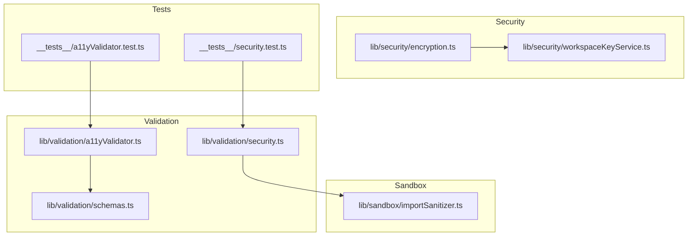
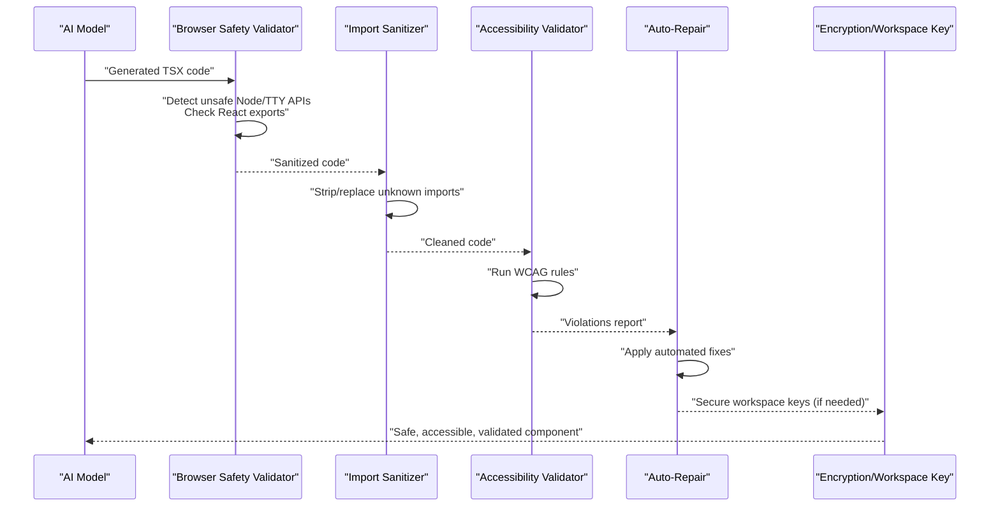
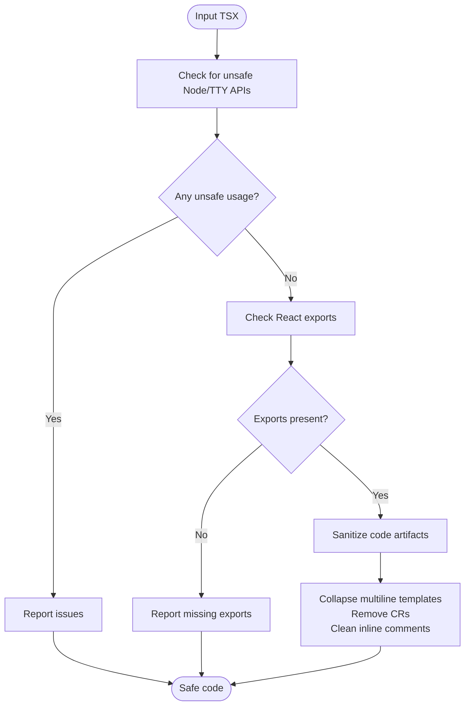
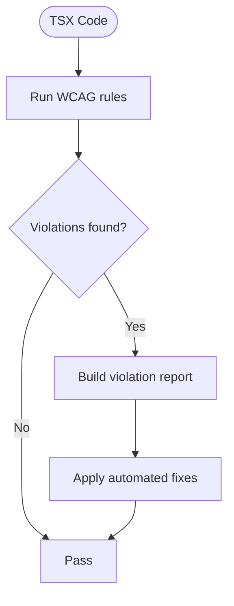
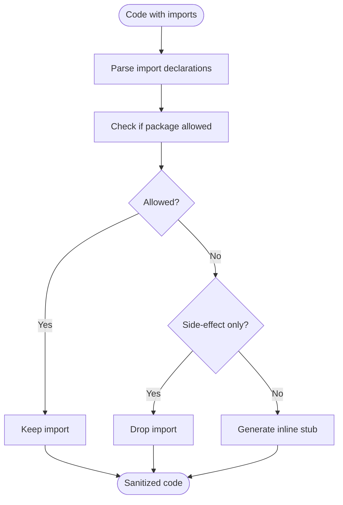
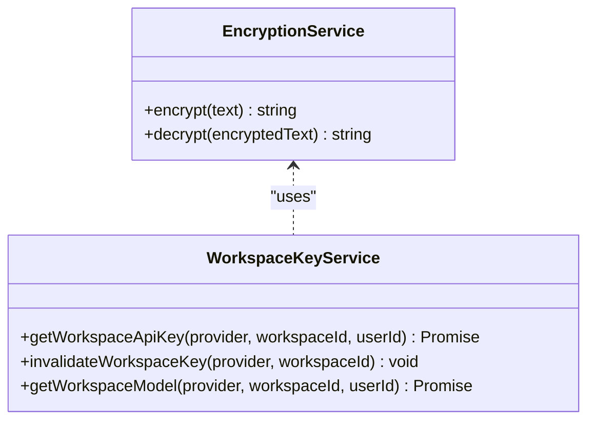
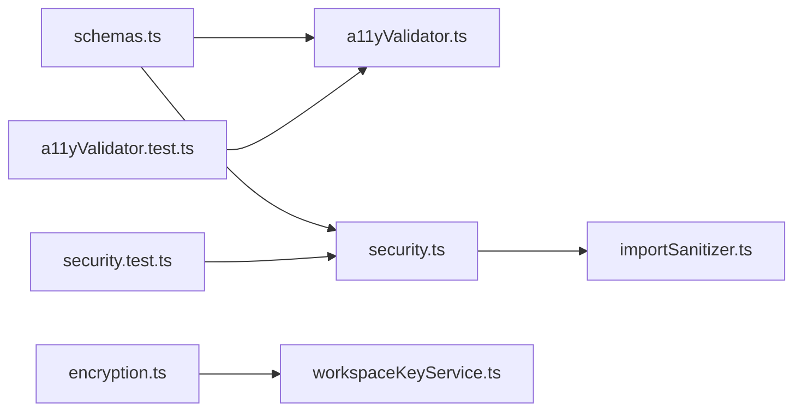

# Browser Safety Validation

<cite>
**Referenced Files in This Document**
- [security.ts](file://lib/validation/security.ts)
- [a11yValidator.ts](file://lib/validation/a11yValidator.ts)
- [schemas.ts](file://lib/validation/schemas.ts)
- [importSanitizer.ts](file://lib/sandbox/importSanitizer.ts)
- [encryption.ts](file://lib/security/encryption.ts)
- [workspaceKeyService.ts](file://lib/security/workspaceKeyService.ts)
- [security.test.ts](file://__tests__/security.test.ts)
- [a11yValidator.test.ts](file://__tests__/a11yValidator.test.ts)
</cite>

## Table of Contents
1. [Introduction](#introduction)
2. [Project Structure](#project-structure)
3. [Core Components](#core-components)
4. [Architecture Overview](#architecture-overview)
5. [Detailed Component Analysis](#detailed-component-analysis)
6. [Dependency Analysis](#dependency-analysis)
7. [Performance Considerations](#performance-considerations)
8. [Troubleshooting Guide](#troubleshooting-guide)
9. [Conclusion](#conclusion)

## Introduction
This document describes the browser safety validation system for the AI-powered UI engine. It explains how the system prevents cross-site scripting (XSS), code injection, and other browser vulnerabilities in generated components. The system combines input validation and sanitization, import allowlisting, accessibility validation, and secure workspace key management. It also documents syntax validation, semantic analysis, automatic repair capabilities, and integration with accessibility compliance.

## Project Structure
The safety validation system spans several modules:
- Validation: browser safety checks and sanitization, accessibility validation and repair
- Security: encryption and workspace key management
- Sandbox: import sanitization for generated code
- Tests: unit tests validating security and accessibility rules

**Diagram sources**
- [security.ts](file://lib/validation/security.ts)
- [a11yValidator.ts](file://lib/validation/a11yValidator.ts)
- [schemas.ts](file://lib/validation/schemas.ts)
- [importSanitizer.ts](file://lib/sandbox/importSanitizer.ts)
- [encryption.ts](file://lib/security/encryption.ts)
- [workspaceKeyService.ts](file://lib/security/workspaceKeyService.ts)
- [security.test.ts](file://__tests__/security.test.ts)
- [a11yValidator.test.ts](file://__tests__/a11yValidator.test.ts)

**Section sources**
- [security.ts](file://lib/validation/security.ts)
- [a11yValidator.ts](file://lib/validation/a11yValidator.ts)
- [schemas.ts](file://lib/validation/schemas.ts)
- [importSanitizer.ts](file://lib/sandbox/importSanitizer.ts)
- [encryption.ts](file://lib/security/encryption.ts)
- [workspaceKeyService.ts](file://lib/security/workspaceKeyService.ts)
- [security.test.ts](file://__tests__/security.test.ts)
- [a11yValidator.test.ts](file://__tests__/a11yValidator.test.ts)

## Core Components
- Browser safety validator: detects unsafe Node.js APIs, terminal/TTY methods, and missing React exports; sanitizes generated code artifacts
- Accessibility validator and auto-repair: enforces WCAG rules and repairs common issues
- Import sanitizer: strips or replaces unknown imports in sandboxed environments
- Encryption service and workspace key service: secure storage and retrieval of workspace keys
- Validation schemas: structured intent and UI component schemas supporting validation

**Section sources**
- [security.ts](file://lib/validation/security.ts)
- [a11yValidator.ts](file://lib/validation/a11yValidator.ts)
- [importSanitizer.ts](file://lib/sandbox/importSanitizer.ts)
- [encryption.ts](file://lib/security/encryption.ts)
- [workspaceKeyService.ts](file://lib/security/workspaceKeyService.ts)
- [schemas.ts](file://lib/validation/schemas.ts)

## Architecture Overview
The safety validation pipeline integrates validation, sanitization, and security services to produce safe, accessible, and compliant UI components.

**Diagram sources**
- [security.ts](file://lib/validation/security.ts)
- [a11yValidator.ts](file://lib/validation/a11yValidator.ts)
- [importSanitizer.ts](file://lib/sandbox/importSanitizer.ts)
- [encryption.ts](file://lib/security/encryption.ts)
- [workspaceKeyService.ts](file://lib/security/workspaceKeyService.ts)

## Detailed Component Analysis

### Browser Safety Validator
The browser safety validator performs two tasks:
- Static validation: ensures generated code does not use Node.js APIs, terminal/TTY methods, or lacks proper React exports
- Code sanitization: flattens multi-line template literals, removes carriage returns, and cleans AI-generated artifacts that break parsers

Key behaviors:
- Detects unsafe imports/require statements for Node.js modules
- Flags process.exit and terminal/TTY manipulation
- Ensures presence of React exports
- Sanitizes template literals and inline comments to avoid parser errors

**Diagram sources**
- [security.ts](file://lib/validation/security.ts)

**Section sources**
- [security.ts](file://lib/validation/security.ts)
- [security.test.ts](file://__tests__/security.test.ts)

### Accessibility Validator and Auto-Repair
The accessibility validator statically analyzes generated TSX against WCAG rules and produces a report with severity and suggestions. The auto-repair component applies safe, automated fixes to common issues.

Rules covered:
- Inputs must have labels or accessible names
- Buttons must have accessible names
- Images must have alt text
- Forms should have labels or legends
- Headings must follow logical hierarchy
- Interactive elements must be keyboard accessible
- Error messages should be announced to assistive technologies
- Color contrast and focus visibility

Auto-repair actions:
- Adds focus ring replacements for outline-none
- Adds role="alert" and aria-live="polite" to error text
- Adds aria-label to unlabeled inputs
- Adds aria-label to icon-only buttons

**Diagram sources**
- [a11yValidator.ts](file://lib/validation/a11yValidator.ts)

**Section sources**
- [a11yValidator.ts](file://lib/validation/a11yValidator.ts)
- [a11yValidator.test.ts](file://__tests__/a11yValidator.test.ts)

### Import Sanitizer (Sandbox Safety)
The import sanitizer ensures generated code can run in the sandbox by:
- Removing side-effect imports for unknown packages
- Replacing unknown package imports with inline stubs
- Maintaining allowed prefixes and common hallucinations

**Diagram sources**
- [importSanitizer.ts](file://lib/sandbox/importSanitizer.ts)

**Section sources**
- [importSanitizer.ts](file://lib/sandbox/importSanitizer.ts)

### Encryption and Workspace Key Management
The encryption service provides AES-256-GCM encryption/decryption with environment-driven key derivation and startup validation. The workspace key service retrieves and caches decrypted API keys per workspace/provider with TTL and fallback logic.

**Diagram sources**
- [encryption.ts](file://lib/security/encryption.ts)
- [workspaceKeyService.ts](file://lib/security/workspaceKeyService.ts)

**Section sources**
- [encryption.ts](file://lib/security/encryption.ts)
- [workspaceKeyService.ts](file://lib/security/workspaceKeyService.ts)

### Validation Schemas
Validation schemas define structured intents and UI components, enabling downstream validation and safer code generation. They include:
- Intent classification and expert UI classification
- Requirement breakdown and thinking plan schemas
- UI field, layout, interaction, and theme schemas
- App and Depth UI-specific schemas
- Generated component schema
- Accessibility report schema

These schemas support robust parsing and validation of prompts and outputs, reducing risk of malformed or unsafe code.

**Section sources**
- [schemas.ts](file://lib/validation/schemas.ts)

## Dependency Analysis
The safety validation system exhibits clear separation of concerns:
- Validation depends on schemas for structured intent and component definitions
- Import sanitization depends on allowlists and regex parsing
- Security services are independent but can be invoked by higher-level flows
- Tests validate both security and accessibility behaviors

**Diagram sources**
- [schemas.ts](file://lib/validation/schemas.ts)
- [a11yValidator.ts](file://lib/validation/a11yValidator.ts)
- [security.ts](file://lib/validation/security.ts)
- [importSanitizer.ts](file://lib/sandbox/importSanitizer.ts)
- [encryption.ts](file://lib/security/encryption.ts)
- [workspaceKeyService.ts](file://lib/security/workspaceKeyService.ts)
- [security.test.ts](file://__tests__/security.test.ts)
- [a11yValidator.test.ts](file://__tests__/a11yValidator.test.ts)

**Section sources**
- [schemas.ts](file://lib/validation/schemas.ts)
- [a11yValidator.ts](file://lib/validation/a11yValidator.ts)
- [security.ts](file://lib/validation/security.ts)
- [importSanitizer.ts](file://lib/sandbox/importSanitizer.ts)
- [encryption.ts](file://lib/security/encryption.ts)
- [workspaceKeyService.ts](file://lib/security/workspaceKeyService.ts)
- [security.test.ts](file://__tests__/security.test.ts)
- [a11yValidator.test.ts](file://__tests__/a11yValidator.test.ts)

## Performance Considerations
- Regex-based validations are linear in code length; keep patterns minimal and targeted
- Sanitization passes are single-pass scans; complexity remains O(n)
- Import sanitization parses imports once and replaces per occurrence; complexity O(n + m) where n is code length and m is number of imports
- Accessibility validation runs fixed rule sets; complexity proportional to code size and number of rules
- Encryption operations are bounded by input size; avoid unnecessary re-initialization of encryption keys

## Troubleshooting Guide
Common issues and resolutions:
- Unsafe Node.js APIs detected: Remove or replace with browser-compatible alternatives
- Missing React exports: Ensure a valid default or named export is present
- Terminal/TTY methods: Avoid console.clear and readline usage in browser contexts
- AI-generated parser artifacts: Rely on built-in sanitization or manually adjust template literals and comments
- Accessibility violations:
  - Add labels or aria-labels to inputs and buttons
  - Provide alt text for images
  - Ensure logical heading hierarchy
  - Improve color contrast and focus indicators
- Workspace key retrieval failures: Verify environment variables and cache TTL; use fallback logic

**Section sources**
- [security.ts](file://lib/validation/security.ts)
- [a11yValidator.ts](file://lib/validation/a11yValidator.ts)
- [workspaceKeyService.ts](file://lib/security/workspaceKeyService.ts)

## Conclusion
The browser safety validation system provides layered protection against XSS and code injection by combining static validation, code sanitization, import allowlisting, and accessibility enforcement. Together with secure workspace key management, it ensures generated components are safe, accessible, and compliant across diverse deployment environments.