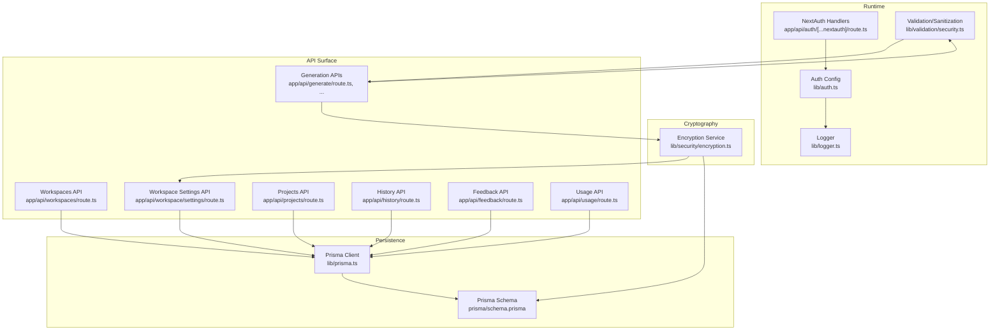
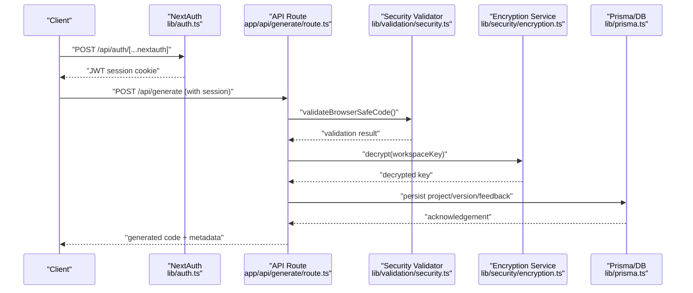
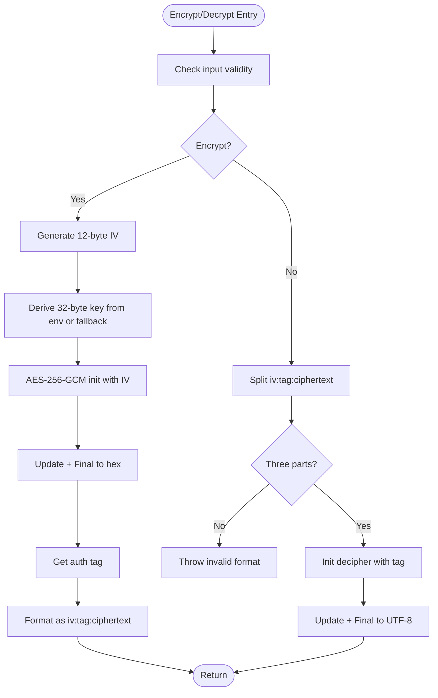
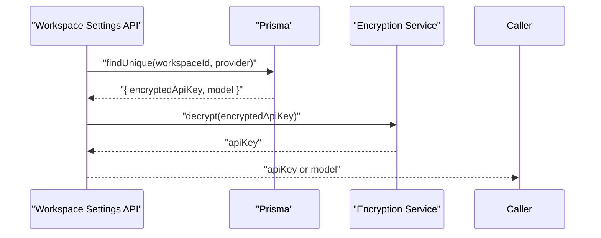
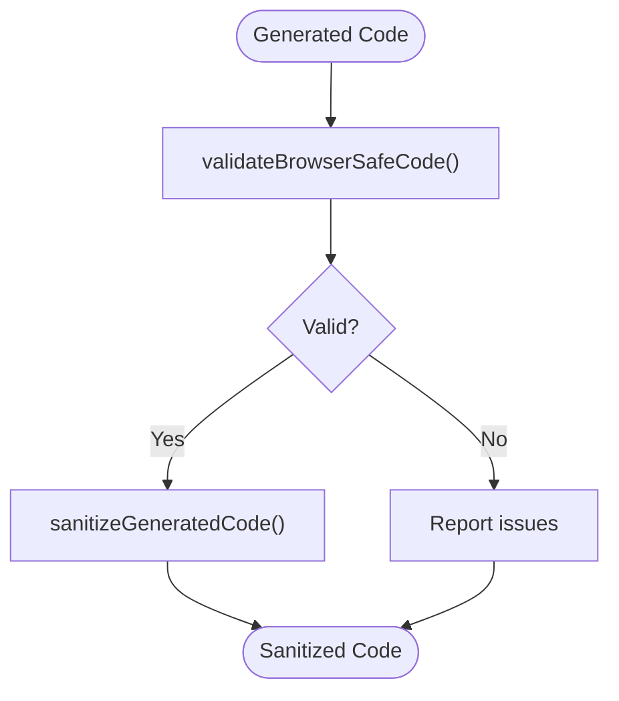
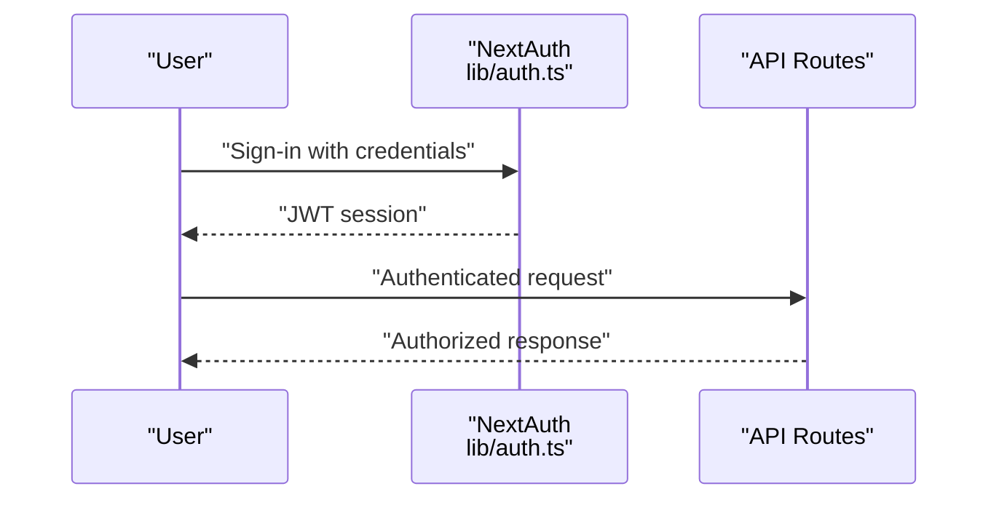
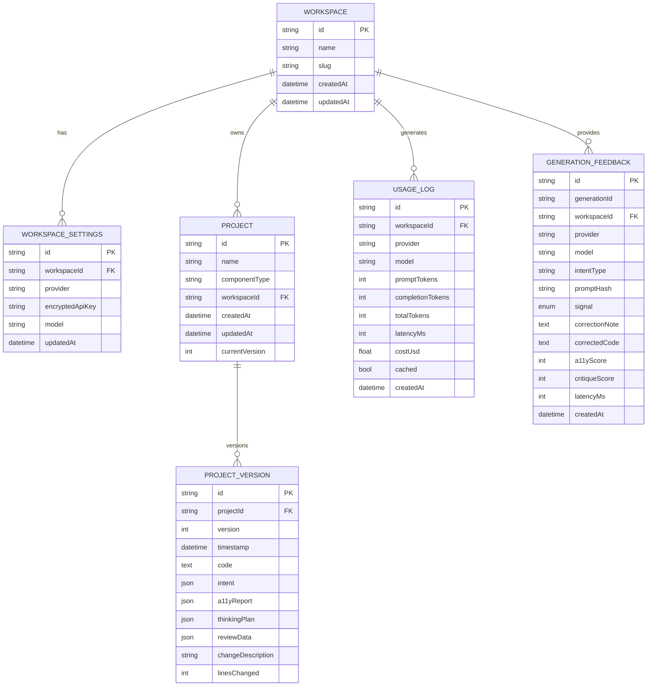
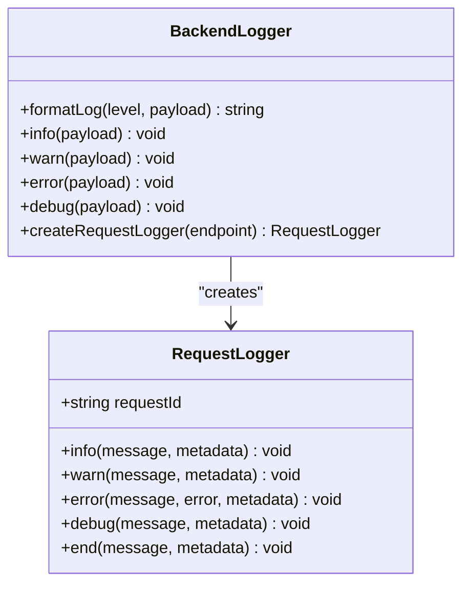
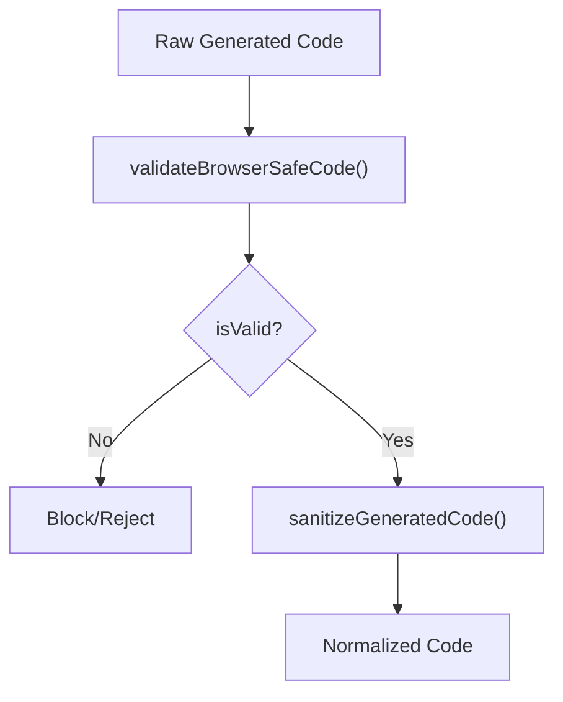
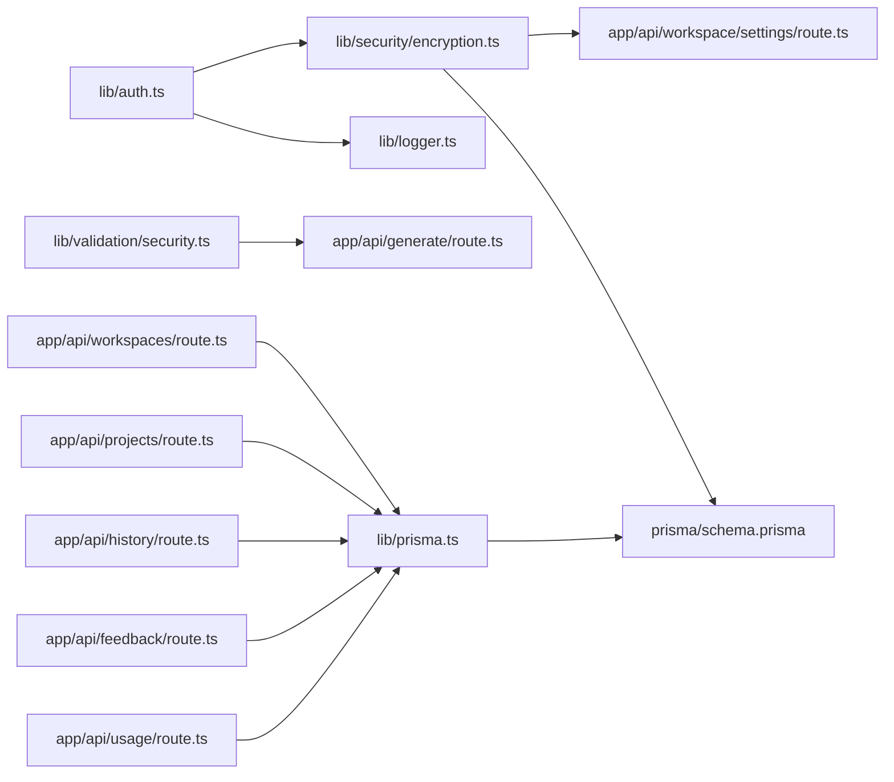

# Data Protection & Privacy

<cite>
**Referenced Files in This Document**
- [encryption.ts](file://lib/security/encryption.ts)
- [encryption.test.ts](file://__tests__/encryption.test.ts)
- [security.test.ts](file://__tests__/security.test.ts)
- [workspaceKeyService.test.ts](file://__tests__/workspaceKeyService.test.ts)
- [auth.ts](file://lib/auth.ts)
- [route.ts](file://app/api/auth/[...nextauth]/route.ts)
- [prisma.ts](file://lib/prisma.ts)
- [schema.prisma](file://prisma/schema.prisma)
- [logger.ts](file://lib/logger.ts)
- [security.ts](file://lib/validation/security.ts)
- [index.ts](file://lib/intelligence/index.ts)
- [index.ts](file://lib/ai/adapters/index.ts)
- [route.ts](file://app/api/workspaces/route.ts)
- [route.ts](file://app/api/workspace/settings/route.ts)
- [route.ts](file://app/api/projects/route.ts)
- [route.ts](file://app/api/history/route.ts)
- [route.ts](file://app/api/generate/route.ts)
- [route.ts](file://app/api/suggestions/route.ts)
- [route.ts](file://app/api/parse/route.ts)
- [route.ts](file://app/api/classify/route.ts)
- [route.ts](file://app/api/chunk/route.ts)
- [route.ts](file://app/api/vision/route.ts)
- [route.ts](file://app/api/image-to-text/route.ts)
- [route.ts](file://app/api/final-round/route.ts)
- [route.ts](file://app/api/think/route.ts)
- [route.ts](file://app/api/usage/route.ts)
- [route.ts](file://app/api/models/route.ts)
- [route.ts](file://app/api/local-models/route.ts)
- [route.ts](file://app/api/manifest/route.ts)
- [route.ts](file://app/api/screenshot/route.ts)
- [route.ts](file://app/api/feedback/route.ts)
- [route.ts](file://app/api/engine-config/route.ts)
- [route.ts](file://app/api/ollama/models/route.ts)
</cite>

## Table of Contents
1. [Introduction](#introduction)
2. [Project Structure](#project-structure)
3. [Core Components](#core-components)
4. [Architecture Overview](#architecture-overview)
5. [Detailed Component Analysis](#detailed-component-analysis)
6. [Dependency Analysis](#dependency-analysis)
7. [Performance Considerations](#performance-considerations)
8. [Troubleshooting Guide](#troubleshooting-guide)
9. [Conclusion](#conclusion)
10. [Appendices](#appendices)

## Introduction
This document provides comprehensive data protection and privacy guidance for the AI-powered UI engine. It focuses on secure data storage, API key management, privacy controls for user-generated content, data retention and consent, compliance considerations, security scanning and sanitization of generated code, data lifecycle management, access control, audit logging, and developer best practices. The content is grounded in the repository’s implementation and testing artifacts.

## Project Structure
The system comprises:
- Authentication and session management via NextAuth
- Encryption service for sensitive configuration
- Prisma ORM with PostgreSQL for persistence
- Validation and sanitization utilities for generated code
- Centralized logging with request-scoped tracking
- API routes for workspace, project, generation, and analytics

**Diagram sources**
- [route.ts:1-4](file://app/api/auth/[...nextauth]/route.ts#L1-L4)
- [auth.ts:1-87](file://lib/auth.ts#L1-L87)
- [logger.ts:1-89](file://lib/logger.ts#L1-L89)
- [security.ts](file://lib/validation/security.ts)
- [prisma.ts:1-70](file://lib/prisma.ts#L1-L70)
- [schema.prisma:1-222](file://prisma/schema.prisma#L1-L222)
- [encryption.ts:1-95](file://lib/security/encryption.ts#L1-L95)
- [route.ts](file://app/api/workspaces/route.ts)
- [route.ts](file://app/api/workspace/settings/route.ts)
- [route.ts](file://app/api/projects/route.ts)
- [route.ts](file://app/api/history/route.ts)
- [route.ts](file://app/api/feedback/route.ts)
- [route.ts](file://app/api/usage/route.ts)
- [route.ts](file://app/api/generate/route.ts)

**Section sources**
- [route.ts:1-4](file://app/api/auth/[...nextauth]/route.ts#L1-L4)
- [auth.ts:1-87](file://lib/auth.ts#L1-L87)
- [logger.ts:1-89](file://lib/logger.ts#L1-L89)
- [security.ts](file://lib/validation/security.ts)
- [prisma.ts:1-70](file://lib/prisma.ts#L1-L70)
- [schema.prisma:1-222](file://prisma/schema.prisma#L1-L222)
- [encryption.ts:1-95](file://lib/security/encryption.ts#L1-L95)

## Core Components
- Authentication and session management: JWT-based strategy with enforced secret and session lifetime.
- Encryption service: AES-256-GCM with environment-driven key derivation and safe fallback behavior.
- Persistence: Prisma-managed PostgreSQL schema with multi-tenant workspaces, usage logs, feedback, and project versions.
- Security validation and sanitization: Browser-safe code checks and generated code sanitization.
- Logging: Structured, request-scoped logging with timing and metadata support.
- API routes: Endpoints for workspace, project, generation, history, feedback, and usage.

**Section sources**
- [auth.ts:11-87](file://lib/auth.ts#L11-L87)
- [encryption.ts:25-69](file://lib/security/encryption.ts#L25-L69)
- [prisma.ts:20-70](file://lib/prisma.ts#L20-L70)
- [schema.prisma:112-187](file://prisma/schema.prisma#L112-L187)
- [security.ts](file://lib/validation/security.ts)
- [logger.ts:23-85](file://lib/logger.ts#L23-L85)
- [route.ts](file://app/api/workspaces/route.ts)
- [route.ts](file://app/api/projects/route.ts)
- [route.ts](file://app/api/generate/route.ts)

## Architecture Overview
The system integrates authentication, encryption, persistence, and validation across API routes. Generated code passes through security checks and sanitization before being persisted or returned to clients. Sensitive configuration (API keys) is stored encrypted in the database and decrypted at runtime per workspace/provider.

**Diagram sources**
- [auth.ts:11-87](file://lib/auth.ts#L11-L87)
- [route.ts](file://app/api/generate/route.ts)
- [security.ts](file://lib/validation/security.ts)
- [encryption.ts:46-68](file://lib/security/encryption.ts#L46-L68)
- [prisma.ts:20-70](file://lib/prisma.ts#L20-L70)

## Detailed Component Analysis

### Encryption Service
- Algorithm: AES-256-GCM with random 12-byte IV and authentication tag.
- Key sourcing: Environment variable with base64 or raw 32-byte string; fallback to SHA-256 of a secret source; startup validation warns if missing but does not crash builds.
- Operations: Encrypt returns iv:authTag:hex; Decrypt validates and authenticates before returning plaintext.
- Tests confirm deterministic round-trip, IV salting for different ciphertexts, and empty-string handling.

**Diagram sources**
- [encryption.ts:27-69](file://lib/security/encryption.ts#L27-L69)
- [encryption.test.ts:15-47](file://__tests__/encryption.test.ts#L15-L47)

**Section sources**
- [encryption.ts:1-95](file://lib/security/encryption.ts#L1-L95)
- [encryption.test.ts:1-49](file://__tests__/encryption.test.ts#L1-L49)

### API Key Management
- Storage: Workspace settings include encrypted API keys per provider.
- Retrieval: Workspace key service fetches encrypted key from DB and decrypts at runtime; caching reduces repeated DB and decryption calls.
- Provider-specific model configuration is also stored per workspace/provider.

**Diagram sources**
- [schema.prisma:99-110](file://prisma/schema.prisma#L99-L110)
- [workspaceKeyService.test.ts:36-56](file://__tests__/workspaceKeyService.test.ts#L36-L56)
- [encryption.ts:46-68](file://lib/security/encryption.ts#L46-L68)

**Section sources**
- [schema.prisma:99-110](file://prisma/schema.prisma#L99-L110)
- [workspaceKeyService.test.ts:1-69](file://__tests__/workspaceKeyService.test.ts#L1-L69)
- [encryption.ts:1-95](file://lib/security/encryption.ts#L1-L95)

### Privacy Controls for User-Generated Content
- Generated code validation: Detects unsupported Node.js imports, process.exit(), terminal manipulation, and missing React exports.
- Generated code sanitization: Normalizes whitespace and removes carriage returns while preserving escaped template literals.
- Tests assert detection and normalization behavior.

**Diagram sources**
- [security.test.ts:4-58](file://__tests__/security.test.ts#L4-L58)
- [security.ts](file://lib/validation/security.ts)

**Section sources**
- [security.test.ts:1-60](file://__tests__/security.test.ts#L1-L60)
- [security.ts](file://lib/validation/security.ts)

### Access Control and Consent
- Authentication: JWT-based session strategy with configurable max age and enforced secrets.
- Consent surfaces: Login page triggers authentication flow; explicit consent is required for credential-based access.
- Authorization: Multi-tenant roles (OWNER, ADMIN, MEMBER) are defined at the workspace level; enforcement occurs at API boundaries.

**Diagram sources**
- [auth.ts:11-87](file://lib/auth.ts#L11-L87)
- [route.ts:1-4](file://app/api/auth/[...nextauth]/route.ts#L1-L4)

**Section sources**
- [auth.ts:1-87](file://lib/auth.ts#L1-L87)
- [schema.prisma:78-95](file://prisma/schema.prisma#L78-L95)

### Data Lifecycle Management
- Projects and versions: Persisted with timestamps and JSON payloads; versioning supports rollbacks and timelines.
- Usage logs: Token usage, latency, cost, and cached flags recorded per workspace/provider/model.
- Feedback: Captures intent, signals, corrections, and scores; linked to generation identifiers.
- Embeddings: Vector embeddings stored via raw SQL; retrieval constrained by knowledge domains.

**Diagram sources**
- [schema.prisma:64-187](file://prisma/schema.prisma#L64-L187)

**Section sources**
- [schema.prisma:158-187](file://prisma/schema.prisma#L158-L187)
- [schema.prisma:112-126](file://prisma/schema.prisma#L112-L126)
- [schema.prisma:137-154](file://prisma/schema.prisma#L137-L154)

### Audit Logging and Observability
- Structured logging: Endpoint, request ID, duration, optional error and metadata.
- Request-scoped logger: Stable request ID, duration tracking, and end marker.
- Environment toggles: Debug logs gated by development mode or explicit flag.

**Diagram sources**
- [logger.ts:23-85](file://lib/logger.ts#L23-L85)

**Section sources**
- [logger.ts:1-89](file://lib/logger.ts#L1-L89)

### Security Scanning and Sanitization Processes
- Input validation: Enforces browser-safe constraints for generated code; rejects Node.js standard library imports, process.exit(), terminal manipulation, and missing React exports.
- Output filtering: Normalizes template literal whitespace and removes carriage returns; preserves escaped backticks.
- Tests demonstrate detection and normalization outcomes.

**Diagram sources**
- [security.test.ts:4-58](file://__tests__/security.test.ts#L4-L58)
- [security.ts](file://lib/validation/security.ts)

**Section sources**
- [security.test.ts:1-60](file://__tests__/security.test.ts#L1-L60)
- [security.ts](file://lib/validation/security.ts)

### Data Retention Policies and Consent Mechanisms
- Retention: Projects and versions persist indefinitely; usage logs and feedback include timestamps enabling external retention policies; consider implementing soft-delete and scheduled purges at the application layer.
- Consent: Credential-based sign-in requires explicit consent; ensure UI surfaces consent prompts and terms prior to enabling access.
- Compliance: Align retention and deletion with applicable regulations; maintain records of consent and data processing activities.

[No sources needed since this section provides general guidance]

### Compliance with Privacy Regulations
- Data minimization: Store only necessary fields; avoid retaining sensitive data beyond operational needs.
- Anonymization: Remove or pseudonymize personal identifiers in logs and analytics.
- Secure deletion: Implement secure overwrite and index removal for deleted records; ensure backups are handled consistently.
- Privacy notices: Publish clear privacy policy detailing data collection, use, retention, and user rights.

[No sources needed since this section provides general guidance]

### Guidelines for Handling Sensitive Workspace Data, Projects, and Preferences
- Workspace settings: Encrypt API keys and store per provider; restrict access via workspace roles; cache decrypted keys per request to minimize repeated decryption.
- Projects: Limit visibility to workspace members; enforce RBAC at API boundaries; retain only essential metadata.
- Preferences: Store defaults and user choices encrypted where appropriate; apply least privilege access.

**Section sources**
- [schema.prisma:99-110](file://prisma/schema.prisma#L99-L110)
- [schema.prisma:64-95](file://prisma/schema.prisma#L64-L95)

### Privacy Impact Assessment Considerations
- Data categories: Identify personal data, API keys, prompts, generated code, usage metrics, and feedback.
- Purpose limitation: Define explicit purposes for storing and processing data.
- Transparency: Provide granular privacy notices and opt-out mechanisms where applicable.
- Data subject rights: Enable access, rectification, erasure, and portability requests.

[No sources needed since this section provides general guidance]

## Dependency Analysis
- Authentication depends on environment secrets and bcrypt for password comparison.
- Encryption depends on environment variables and crypto primitives; warns on missing keys at startup.
- Persistence relies on Prisma client and PostgreSQL; includes transient error handling for Neon connections.
- Validation and sanitization are standalone utilities invoked by generation APIs.
- API routes depend on authentication middleware and workspace roles for access control.

**Diagram sources**
- [auth.ts:1-87](file://lib/auth.ts#L1-L87)
- [encryption.ts:1-95](file://lib/security/encryption.ts#L1-L95)
- [logger.ts:1-89](file://lib/logger.ts#L1-L89)
- [security.ts](file://lib/validation/security.ts)
- [prisma.ts:1-70](file://lib/prisma.ts#L1-L70)
- [schema.prisma:1-222](file://prisma/schema.prisma#L1-L222)
- [route.ts](file://app/api/workspaces/route.ts)
- [route.ts](file://app/api/workspace/settings/route.ts)
- [route.ts](file://app/api/projects/route.ts)
- [route.ts](file://app/api/history/route.ts)
- [route.ts](file://app/api/feedback/route.ts)
- [route.ts](file://app/api/usage/route.ts)
- [route.ts](file://app/api/generate/route.ts)

**Section sources**
- [auth.ts:1-87](file://lib/auth.ts#L1-L87)
- [encryption.ts:1-95](file://lib/security/encryption.ts#L1-L95)
- [prisma.ts:1-70](file://lib/prisma.ts#L1-L70)
- [schema.prisma:1-222](file://prisma/schema.prisma#L1-L222)
- [security.ts](file://lib/validation/security.ts)
- [logger.ts:1-89](file://lib/logger.ts#L1-L89)

## Performance Considerations
- Encryption overhead: AES-256-GCM adds CPU cost; cache decrypted keys per request where feasible.
- Database connectivity: Use reconnect wrapper for transient Neon errors; limit concurrent connections.
- Logging: Keep structured logs concise; avoid logging sensitive fields; enable debug only in development.

[No sources needed since this section provides general guidance]

## Troubleshooting Guide
- Missing encryption secret: Startup warning indicates missing ENCRYPTION_SECRET; encrypt/decrypt calls will fail safely at runtime.
- Authentication failures: Verify AUTH_SECRET/NEXTAUTH_SECRET presence and correctness; check bcrypt hash format.
- Database connectivity: Transient Neon errors are retried; ensure connection limits and timeouts are configured.
- Validation failures: Review security tests to understand detected violations and adjust generated code accordingly.

**Section sources**
- [encryption.ts:71-94](file://lib/security/encryption.ts#L71-L94)
- [auth.ts:12-15](file://lib/auth.ts#L12-L15)
- [prisma.ts:36-69](file://lib/prisma.ts#L36-L69)
- [security.test.ts:4-38](file://__tests__/security.test.ts#L4-L38)

## Conclusion
The AI-powered UI engine implements a layered approach to data protection and privacy: secure authentication, cryptographic storage of API keys, validation and sanitization of generated code, robust logging, and a clear persistence model. To strengthen privacy posture, complement these technical controls with explicit consent mechanisms, data retention policies aligned to regulatory requirements, anonymization and secure deletion procedures, and comprehensive privacy impact assessments.

[No sources needed since this section summarizes without analyzing specific files]

## Appendices

### Developer Best Practices
- Always store secrets via environment variables and never commit them to source control.
- Use AES-256-GCM with authenticated encryption for any sensitive data-at-rest.
- Apply least privilege access control at the workspace and project levels.
- Regularly review and update validation rules to keep pace with evolving threat landscape.
- Instrument audit trails for sensitive operations and monitor for anomalies.

[No sources needed since this section provides general guidance]