# Security & Privacy

<cite>
**Referenced Files in This Document**
- [lib/auth.ts](file://lib/auth.ts)
- [app/api/auth/[...nextauth]/route.ts](file://app/api/auth/[...nextauth]/route.ts)
- [components/auth/SessionProvider.tsx](file://components/auth/SessionProvider.tsx)
- [lib/prisma.ts](file://lib/prisma.ts)
- [__tests__/security.test.ts](file://__tests__/security.test.ts)
- [__tests__/encryption.test.ts](file://__tests__/encryption.test.ts)
- [app/api/engine-config/route.ts](file://app/api/engine-config/route.ts)
- [lib/security/encryption.ts](file://lib/security/encryption.ts)
- [lib/security/workspaceKeyService.ts](file://lib/security/workspaceKeyService.ts)
- [app/api/models/route.ts](file://app/api/models/route.ts)
- [components/ProviderSelector.tsx](file://components/ProviderSelector.tsx)
- [components/AIEngineConfigPanel.tsx](file://components/AIEngineConfigPanel.tsx)
- [components/ModelSelectionGate.tsx](file://components/ModelSelectionGate.tsx)
- [app/page.tsx](file://app/page.tsx)
</cite>

## Update Summary
**Changes Made**
- Added comprehensive automatic LLM configuration reset system with 15-minute inactivity monitoring
- Documented comprehensive event tracking system including mouse movement, keyboard input, touch interactions, and scroll events
- Added secure configuration cleanup process that clears AI configuration from React state, localStorage, sessionStorage, and server-side storage
- Enhanced browser safety validation with new security features
- Updated authentication and authorization sections with new security features
- Enhanced server-side credential management with automatic cleanup capabilities

## Table of Contents
1. [Introduction](#introduction)
2. [Project Structure](#project-structure)
3. [Core Components](#core-components)
4. [Architecture Overview](#architecture-overview)
5. [Detailed Component Analysis](#detailed-component-analysis)
6. [Enhanced Security Features](#enhanced-security-features)
7. [Automatic LLM Configuration Reset System](#automatic-llm-configuration-reset-system)
8. [Server-Side Credential Management](#server-side-credential-management)
9. [Dependency Analysis](#dependency-analysis)
10. [Performance Considerations](#performance-considerations)
11. [Troubleshooting Guide](#troubleshooting-guide)
12. [Conclusion](#conclusion)
13. [Appendices](#appendices)

## Introduction
This document provides comprehensive security and privacy documentation for the AI-powered UI engine. It covers authentication and authorization using NextAuth.js, session management, and role-based access control. The system now features an enhanced server-side credential management system with AES-256 encryption, secure mode indicators, and comprehensive security features including shield icons, emerald badges, and security status banners. A new automatic LLM configuration reset system has been implemented with 15-minute inactivity monitoring that tracks comprehensive user events (mouse movement, keyboard input, touch interactions, scroll events) and securely cleans up AI configuration from React state, localStorage, sessionStorage, and server-side storage. Data protection measures include encryption for secure storage, API key management, and privacy considerations for user-generated content. Browser safety validation prevents XSS and related vulnerabilities, with security scanning and sanitization processes for generated code. Data retention policies, user consent mechanisms, and compliance with privacy regulations are outlined. Best practices for developers integrating with the system, threat modeling considerations, incident response procedures, and multi-tenant security isolation are included.

## Project Structure
Security-critical components are organized across authentication, session management, database connectivity, validation layers, enhanced credential management, and the new automatic LLM configuration reset system:
- Authentication and authorization via NextAuth.js
- Session provider for client-side session handling
- Database connectivity with automatic reconnection for transient errors
- Enhanced server-side credential management with AES-256 encryption
- Workspace-scoped key management and caching
- Validation and sanitization for generated code
- Encryption utilities for secure storage of secrets
- Comprehensive security indicators and status displays
- Automatic LLM configuration reset system with inactivity monitoring
- Event tracking and secure cleanup mechanisms

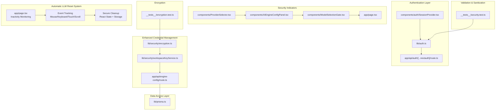

**Diagram sources**
- [lib/auth.ts:1-87](file://lib/auth.ts#L1-L87)
- [app/api/auth/[...nextauth]/route.ts:1-4](file://app/api/auth/[...nextauth]/route.ts#L1-L4)
- [components/auth/SessionProvider.tsx:1-8](file://components/auth/SessionProvider.tsx#L1-L8)
- [lib/security/encryption.ts:1-95](file://lib/security/encryption.ts#L1-L95)
- [lib/security/workspaceKeyService.ts:1-138](file://lib/security/workspaceKeyService.ts#L1-L138)
- [app/api/engine-config/route.ts:1-153](file://app/api/engine-config/route.ts#L1-L153)
- [lib/prisma.ts:1-70](file://lib/prisma.ts#L1-L70)
- [components/ProviderSelector.tsx:1-375](file://components/ProviderSelector.tsx#L1-L375)
- [components/AIEngineConfigPanel.tsx:494-520](file://components/AIEngineConfigPanel.tsx#L494-L520)
- [components/ModelSelectionGate.tsx:159-169](file://components/ModelSelectionGate.tsx#L159-L169)
- [app/page.tsx:494-511](file://app/page.tsx#L494-L511)
- [__tests__/security.test.ts:1-60](file://__tests__/security.test.ts#L1-L60)
- [__tests__/encryption.test.ts:1-49](file://__tests__/encryption.test.ts#L1-L49)
- [app/page.tsx:68-96](file://app/page.tsx#L68-L96)
- [app/page.tsx:147-180](file://app/page.tsx#L147-L180)

**Section sources**
- [lib/auth.ts:1-87](file://lib/auth.ts#L1-L87)
- [app/api/auth/[...nextauth]/route.ts:1-4](file://app/api/auth/[...nextauth]/route.ts#L1-L4)
- [components/auth/SessionProvider.tsx:1-8](file://components/auth/SessionProvider.tsx#L1-L8)
- [lib/security/encryption.ts:1-95](file://lib/security/encryption.ts#L1-L95)
- [lib/security/workspaceKeyService.ts:1-138](file://lib/security/workspaceKeyService.ts#L1-L138)
- [app/api/engine-config/route.ts:1-153](file://app/api/engine-config/route.ts#L1-L153)
- [lib/prisma.ts:1-70](file://lib/prisma.ts#L1-L70)
- [components/ProviderSelector.tsx:1-375](file://components/ProviderSelector.tsx#L1-L375)
- [components/AIEngineConfigPanel.tsx:494-520](file://components/AIEngineConfigPanel.tsx#L494-L520)
- [components/ModelSelectionGate.tsx:159-169](file://components/ModelSelectionGate.tsx#L159-L169)
- [app/page.tsx:494-511](file://app/page.tsx#L494-L511)
- [__tests__/security.test.ts:1-60](file://__tests__/security.test.ts#L1-L60)
- [__tests__/encryption.test.ts:1-49](file://__tests__/encryption.test.ts#L1-L49)

## Core Components
- Authentication and Authorization: Implements a single-owner credential provider using bcrypt-hashed passwords, JWT sessions, and NextAuth.js callbacks for token/session propagation.
- Enhanced Credential Management: Features AES-256-GCM encryption for API keys, workspace-scoped key storage, and intelligent key resolution with caching.
- Session Management: Client-side provider wraps the application to enable session-aware components.
- Database Connectivity: Singleton Prisma client with automatic reconnection for transient Neon errors.
- Validation and Sanitization: Tests define expected behaviors for validating and sanitizing generated code to ensure browser safety.
- Encryption: Tests demonstrate encryption and decryption of sensitive data using a 32-byte secret with fallback mechanisms.
- Security Indicators: Comprehensive visual indicators including shield icons, emerald badges, and security status banners throughout the UI.
- Automatic LLM Configuration Reset: Implements 15-minute inactivity monitoring with comprehensive event tracking and secure cleanup mechanisms.

**Section sources**
- [lib/auth.ts:11-86](file://lib/auth.ts#L11-L86)
- [components/auth/SessionProvider.tsx:3-7](file://components/auth/SessionProvider.tsx#L3-L7)
- [lib/prisma.ts:20-70](file://lib/prisma.ts#L20-L70)
- [lib/security/encryption.ts:27-68](file://lib/security/encryption.ts#L27-L68)
- [lib/security/workspaceKeyService.ts:32-95](file://lib/security/workspaceKeyService.ts#L32-L95)
- [components/ProviderSelector.tsx:161-178](file://components/ProviderSelector.tsx#L161-L178)
- [components/AIEngineConfigPanel.tsx:495-520](file://components/AIEngineConfigPanel.tsx#L495-L520)
- [components/ModelSelectionGate.tsx:159-169](file://components/ModelSelectionGate.tsx#L159-L169)
- [app/page.tsx:494-511](file://app/page.tsx#L494-L511)
- [__tests__/security.test.ts:1-60](file://__tests__/security.test.ts#L1-L60)
- [__tests__/encryption.test.ts:15-47](file://__tests__/encryption.test.ts#L15-L47)

## Architecture Overview
The system enforces authentication at the API boundary and propagates identity through JWT to the client. Enhanced server-side credential management stores API keys securely using AES-256 encryption with workspace scoping. Sessions are managed client-side and persisted securely. Data access uses a singleton Prisma client with resilience against transient database errors. Generated code is validated and sanitized to prevent unsafe constructs and browser-incompatible patterns. Comprehensive security indicators provide visual assurance of secure operations throughout the user interface. The new automatic LLM configuration reset system monitors user inactivity for 15 minutes, tracks comprehensive user events (mouse movement, keyboard input, touch interactions, scroll events), and securely cleans up AI configuration from React state, localStorage, sessionStorage, and server-side storage.

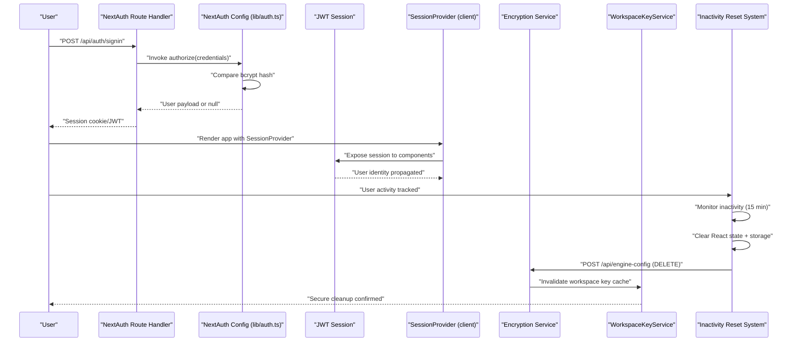

**Diagram sources**
- [app/api/auth/[...nextauth]/route.ts:1-4](file://app/api/auth/[...nextauth]/route.ts#L1-L4)
- [lib/auth.ts:25-59](file://lib/auth.ts#L25-L59)
- [components/auth/SessionProvider.tsx:5-6](file://components/auth/SessionProvider.tsx#L5-L6)
- [lib/security/encryption.ts:27-68](file://lib/security/encryption.ts#L27-L68)
- [lib/security/workspaceKeyService.ts:32-95](file://lib/security/workspaceKeyService.ts#L32-L95)
- [app/page.tsx:68-96](file://app/page.tsx#L68-L96)
- [app/page.tsx:147-180](file://app/page.tsx#L147-L180)

## Detailed Component Analysis

### Authentication and Authorization (NextAuth.js)
- Provider: Uses a custom credentials provider with email and password fields.
- Secret: Session secret sourced from environment variables.
- Max Age: JWT sessions configured to expire after seven days.
- Authorize Function: Validates presence of password, ensures a valid bcrypt hash is present, compares the provided password against the stored hash, and returns a minimal user object upon success.
- Callbacks: Propagate user identity into JWT and session objects.
- Pages: Redirects to the login page on sign-in and error scenarios.

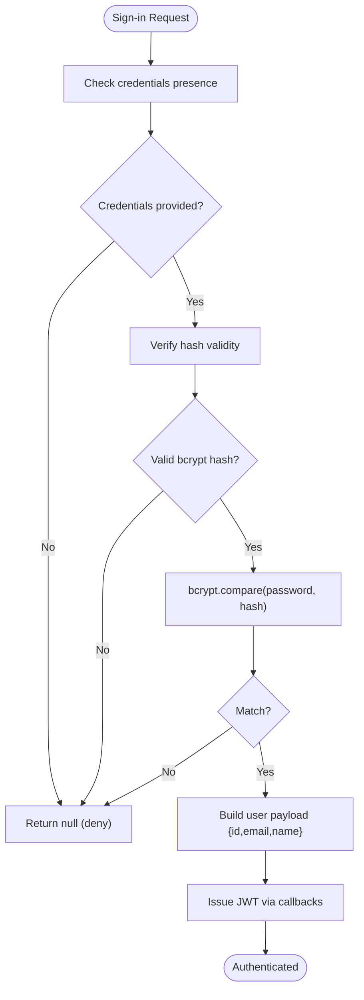

**Diagram sources**
- [lib/auth.ts:25-59](file://lib/auth.ts#L25-L59)
- [lib/auth.ts:63-80](file://lib/auth.ts#L63-L80)

**Section sources**
- [lib/auth.ts:11-15](file://lib/auth.ts#L11-L15)
- [lib/auth.ts:17-61](file://lib/auth.ts#L17-L61)
- [lib/auth.ts:63-80](file://lib/auth.ts#L63-L80)
- [app/api/auth/[...nextauth]/route.ts:1-4](file://app/api/auth/[...nextauth]/route.ts#L1-L4)

### Session Management
- Client Provider: Wraps the application to expose session data to components.
- Trust Host: Enabled for Vercel preview and production domains.
- Pages: Login and error pages configured for redirect behavior.

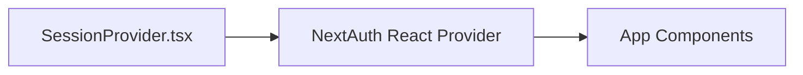

**Diagram sources**
- [components/auth/SessionProvider.tsx:3-7](file://components/auth/SessionProvider.tsx#L3-L7)

**Section sources**
- [components/auth/SessionProvider.tsx:1-8](file://components/auth/SessionProvider.tsx#L1-L8)
- [lib/auth.ts:13-13](file://lib/auth.ts#L13-L13)
- [lib/auth.ts:82-85](file://lib/auth.ts#L82-L85)

### Role-Based Access Control
- Current Implementation: The system defines a single owner identity with a fixed user ID and profile fields. There is no explicit role model or tenant isolation enforced at the authentication layer.
- Recommendations:
  - Introduce roles (e.g., owner, member) and tenant identifiers in the user payload.
  - Enforce RBAC checks in middleware or route handlers using session claims.
  - Store and propagate tenant context in JWT claims for per-request isolation.

### Data Protection Measures

#### Enhanced Encryption for Secure Storage
- Encryption Service: Implements AES-256-GCM encryption with automatic fallback mechanisms. Supports both base64 and raw 32-byte secrets, with SHA-256 derived fallback for zero-config deployment.
- API Key Management: Treat API keys as secrets; store encrypted values in the database and decrypt only when needed for adapter layer operations.
- Key Resolution: Intelligent key resolution prioritizes client-supplied keys, falls back to workspace-scoped encrypted keys, then environment variables.

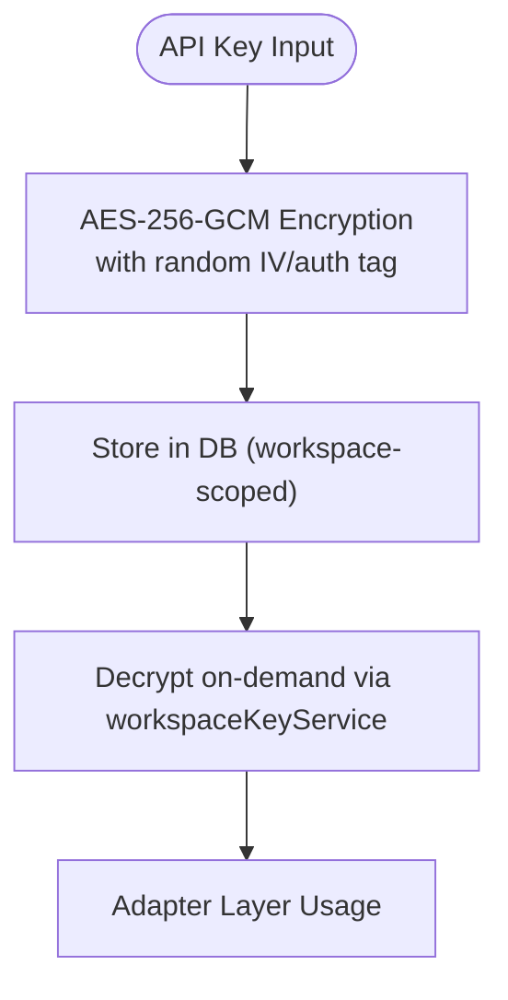

**Diagram sources**
- [lib/security/encryption.ts:27-68](file://lib/security/encryption.ts#L27-L68)
- [lib/security/workspaceKeyService.ts:32-95](file://lib/security/workspaceKeyService.ts#L32-L95)

**Section sources**
- [lib/security/encryption.ts:27-68](file://lib/security/encryption.ts#L27-L68)
- [lib/security/workspaceKeyService.ts:32-95](file://lib/security/workspaceKeyService.ts#L32-L95)
- [app/api/engine-config/route.ts:69-127](file://app/api/engine-config/route.ts#L69-L127)

#### Privacy Considerations for User-Generated Content
- Minimization: Collect only necessary data for functionality.
- Consent: Implement opt-in mechanisms for analytics and data processing.
- De-identification: Remove personally identifiable information (PII) before processing or storing.
- Transparency: Provide clear privacy notices and data retention timelines.

### Browser Safety Validation and Sanitization
- Validation: Detects unsupported Node.js standard library imports, process.exit(), terminal/TTY manipulation, and missing React exports.
- Sanitization: Collapses multi-line template literals, removes carriage returns, preserves escaped backticks.

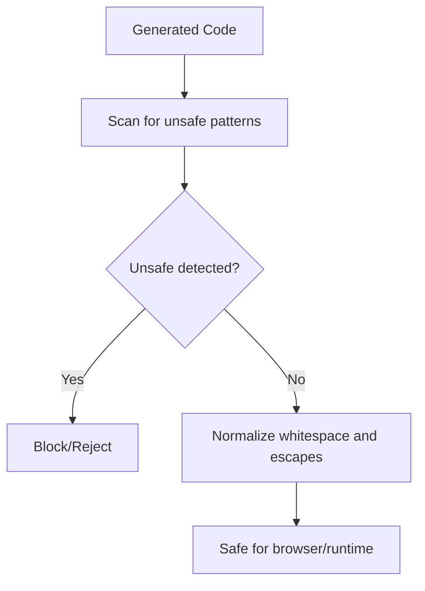

**Diagram sources**
- [__tests__/security.test.ts:4-38](file://__tests__/security.test.ts#L4-L38)
- [__tests__/security.test.ts:40-58](file://__tests__/security.test.ts#L40-L58)

**Section sources**
- [__tests__/security.test.ts:4-38](file://__tests__/security.test.ts#L4-L38)
- [__tests__/security.test.ts:40-58](file://__tests__/security.test.ts#L40-L58)

### Database Connectivity and Resilience
- Singleton Prisma Client: Ensures a single client instance per process to avoid connection exhaustion.
- Automatic Reconnect: Wraps operations to retry on transient Neon errors after a brief delay.

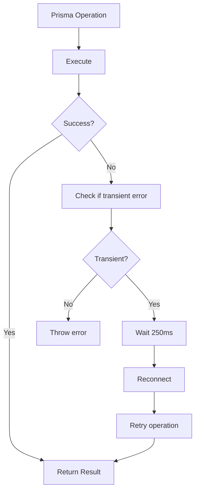

**Diagram sources**
- [lib/prisma.ts:58-69](file://lib/prisma.ts#L58-L69)

**Section sources**
- [lib/prisma.ts:20-27](file://lib/prisma.ts#L20-L27)
- [lib/prisma.ts:58-69](file://lib/prisma.ts#L58-L69)

### Multi-Tenant Security Isolation and Data Privacy Guarantees
- Current State: No explicit tenant isolation is evident in the authentication or session layers.
- Recommended Practices:
  - Add tenant identifiers to user profiles and JWT claims.
  - Enforce tenant scoping in all data access paths.
  - Segment data at rest and in transit; apply least-privilege access controls.
  - Audit cross-tenant access attempts and enforce strict RBAC.

## Enhanced Security Features

### Secure Mode Indicators
The system implements comprehensive visual security indicators to communicate security status to users:

- **Provider Selector Security Badge**: Displays "Secure Mode Active" with shield icon and lock icon
- **AI Engine Config Panel Security Status**: Shows "Secure Multi-Adapter Architecture" with emerald badge and detailed security features
- **Model Selection Gate Security Badges**: Provides "Secure server-side credentials" and "API keys never exposed" indicators
- **Main Page Security Banner**: Shows "Secure Mode Active" with server-side credentials indicator
- **Provider Compact View**: Uses shield icons for configured providers and alert icons for unconfigured ones

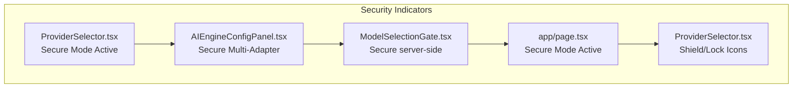

**Diagram sources**
- [components/ProviderSelector.tsx:161-178](file://components/ProviderSelector.tsx#L161-L178)
- [components/AIEngineConfigPanel.tsx:495-520](file://components/AIEngineConfigPanel.tsx#L495-L520)
- [components/ModelSelectionGate.tsx:159-169](file://components/ModelSelectionGate.tsx#L159-L169)
- [app/page.tsx:494-511](file://app/page.tsx#L494-L511)
- [components/ProviderSelector.tsx:317-321](file://components/ProviderSelector.tsx#L317-L321)

**Section sources**
- [components/ProviderSelector.tsx:161-178](file://components/ProviderSelector.tsx#L161-L178)
- [components/AIEngineConfigPanel.tsx:495-520](file://components/AIEngineConfigPanel.tsx#L495-L520)
- [components/ModelSelectionGate.tsx:159-169](file://components/ModelSelectionGate.tsx#L159-L169)
- [app/page.tsx:494-511](file://app/page.tsx#L494-L511)
- [components/ProviderSelector.tsx:317-321](file://components/ProviderSelector.tsx#L317-L321)

### Emerald Badges and Status Displays
The system uses emerald-colored badges and status displays to indicate security status:

- **Active Status Badges**: "Active" badges with animated pulse indicators
- **Security Feature Badges**: "SERVER-SIDE CREDENTIALS" and similar indicators
- **Configuration Status**: "Secure" badges in various UI components
- **Provider Status**: Visual indicators for provider configuration states

**Section sources**
- [components/AIEngineConfigPanel.tsx:476-481](file://components/AIEngineConfigPanel.tsx#L476-L481)
- [components/ProviderSelector.tsx:212-217](file://components/ProviderSelector.tsx#L212-L217)
- [components/ModelSelectionGate.tsx:326-328](file://components/ModelSelectionGate.tsx#L326-L328)
- [app/page.tsx:494-499](file://app/page.tsx#L494-L499)

## Automatic LLM Configuration Reset System

### 15-Minute Inactivity Timeout
The system implements an automatic LLM configuration reset mechanism that triggers after 15 minutes of user inactivity. This security measure ensures that AI configurations are automatically cleared when users step away from their workstations, preventing unauthorized access to AI-powered features.

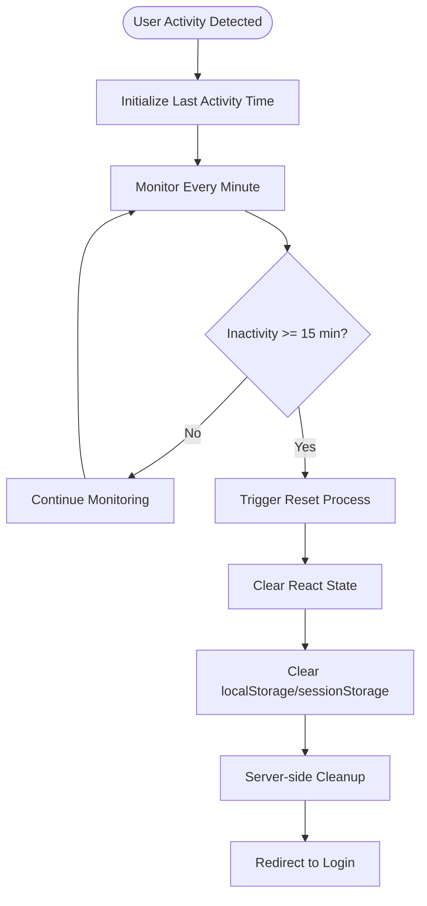

**Diagram sources**
- [app/page.tsx:68-96](file://app/page.tsx#L68-L96)
- [app/page.tsx:147-180](file://app/page.tsx#L147-L180)

**Section sources**
- [app/page.tsx:68-96](file://app/page.tsx#L68-L96)
- [app/page.tsx:147-180](file://app/page.tsx#L147-L180)

### Comprehensive Event Tracking
The system tracks multiple types of user interactions to determine activity status:

- **Mouse Events**: `mousedown` - captures mouse button presses
- **Keyboard Events**: `keydown` - captures key press events
- **Touch Events**: `touchstart` - captures touch interactions for mobile devices
- **Scroll Events**: `scroll` - captures scrolling activities
- **Mouse Movement**: `mousemove` - captures pointer movement for fine-grained activity detection

All event listeners are registered with `{ passive: true }` for optimal performance and use the `window` object for global event capture.

**Section sources**
- [app/page.tsx:164-170](file://app/page.tsx#L164-L170)

### Secure Configuration Cleanup Process
The reset process follows a comprehensive cleanup procedure that removes AI configuration from all storage locations:

1. **React State Cleanup**: Clears AI configuration from component state using `setAiConfig(null)` and related state setters
2. **Local Storage Cleanup**: Removes AI engine configuration and mode settings from localStorage
3. **Session Storage Cleanup**: Clears active session data from sessionStorage  
4. **Server-side Cleanup**: Sends DELETE request to `/api/engine-config` to remove encrypted keys from database
5. **Cache Invalidation**: Invalidates workspace key cache to prevent stale key retrieval
6. **User Redirection**: Redirects user to login page to force re-authentication

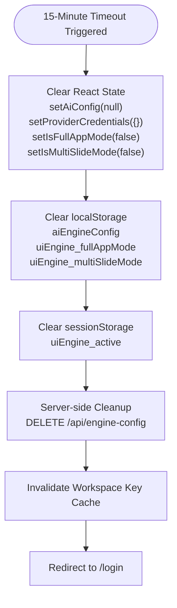

**Diagram sources**
- [app/page.tsx:74-96](file://app/page.tsx#L74-L96)
- [app/api/engine-config/route.ts:129-153](file://app/api/engine-config/route.ts#L129-L153)

**Section sources**
- [app/page.tsx:74-96](file://app/page.tsx#L74-L96)
- [app/api/engine-config/route.ts:129-153](file://app/api/engine-config/route.ts#L129-L153)

### Server-Side Configuration Removal
The server-side cleanup process ensures complete removal of AI configurations:

- **Database Cleanup**: Deletes all workspace settings entries for the authenticated user's workspace
- **Cache Invalidation**: Iterates through all deleted providers and invalidates their cached keys
- **Immediate Effect**: Uses `invalidateWorkspaceKey()` to ensure fresh key retrieval on subsequent requests
- **Atomic Operation**: Performs cleanup within the same authentication context to prevent unauthorized access

**Section sources**
- [app/api/engine-config/route.ts:129-153](file://app/api/engine-config/route.ts#L129-L153)
- [lib/security/workspaceKeyService.ts:100-106](file://lib/security/workspaceKeyService.ts#L100-L106)

## Server-Side Credential Management

### Encryption Service Implementation
The system implements robust encryption for API key storage:

- **Algorithm**: AES-256-GCM with 12-byte initialization vectors
- **Key Management**: Supports base64 and raw 32-byte secrets with SHA-256 fallback
- **Format**: Stores encrypted data as "iv:authTag:ciphertext"
- **Startup Validation**: Validates encryption key presence with non-fatal warnings

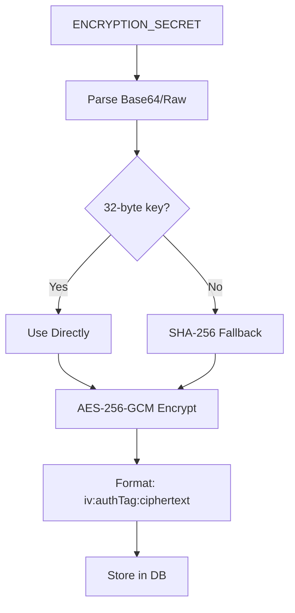

**Diagram sources**
- [lib/security/encryption.ts:5-23](file://lib/security/encryption.ts#L5-L23)
- [lib/security/encryption.ts:27-68](file://lib/security/encryption.ts#L27-L68)

**Section sources**
- [lib/security/encryption.ts:27-68](file://lib/security/encryption.ts#L27-L68)
- [lib/security/encryption.ts:71-94](file://lib/security/encryption.ts#L71-L94)

### Workspace-Key Service Architecture
The workspace-key service provides secure, cached access to workspace-scoped API keys:

- **Caching**: In-memory cache with 5-minute TTL per workspace/provider combination
- **Authorization**: Verifies user membership for workspace access
- **Resolution Priority**: Client key → DB encrypted key → Environment variable fallback
- **Global Fallback**: Scans all workspaces for keys when using default workspace ID

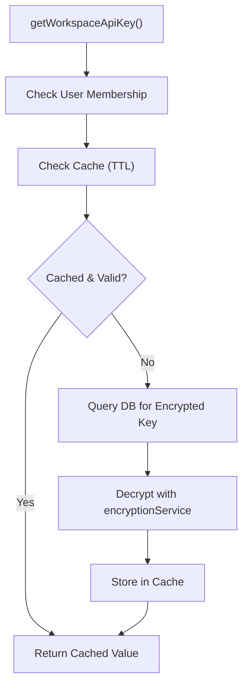

**Diagram sources**
- [lib/security/workspaceKeyService.ts:32-95](file://lib/security/workspaceKeyService.ts#L32-L95)

**Section sources**
- [lib/security/workspaceKeyService.ts:32-95](file://lib/security/workspaceKeyService.ts#L32-L95)
- [app/api/engine-config/route.ts:69-127](file://app/api/engine-config/route.ts#L69-L127)

### API Key Resolution Strategy
The system implements a tiered approach to API key resolution:

1. **Client-Supplied Keys**: Highest priority for immediate operations
2. **Workspace-Scoped Keys**: Encrypted keys stored in database per workspace/provider
3. **Environment Variables**: Global fallback for development and testing
4. **Default Workspace Fallback**: Scans all workspaces for available keys

**Section sources**
- [app/api/models/route.ts:220-229](file://app/api/models/route.ts#L220-L229)
- [lib/security/workspaceKeyService.ts:65-87](file://lib/security/workspaceKeyService.ts#L65-L87)

## Dependency Analysis
- Authentication depends on environment variables for secrets and bcrypt for password verification.
- Session provider depends on NextAuth React provider.
- Database connectivity depends on Prisma client and environment-driven configuration.
- Enhanced credential management depends on encryption service and workspace key service.
- Security indicators depend on Lucide React icons and Tailwind CSS styling.
- Validation and encryption rely on unit tests that assert expected behaviors.
- Automatic LLM reset system depends on React hooks, window event listeners, and API endpoints.

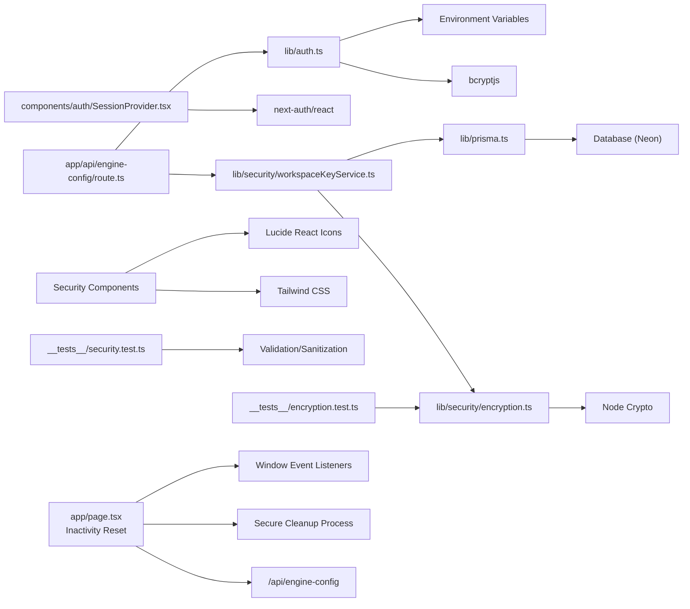

**Diagram sources**
- [lib/auth.ts:12-12](file://lib/auth.ts#L12-L12)
- [lib/auth.ts:3-3](file://lib/auth.ts#L3-L3)
- [components/auth/SessionProvider.tsx:3-3](file://components/auth/SessionProvider.tsx#L3-L3)
- [lib/prisma.ts:1-1](file://lib/prisma.ts#L1-L1)
- [lib/security/encryption.ts:1-1](file://lib/security/encryption.ts#L1-L1)
- [lib/security/workspaceKeyService.ts:1-1](file://lib/security/workspaceKeyService.ts#L1-L1)
- [app/api/engine-config/route.ts:12-16](file://app/api/engine-config/route.ts#L12-L16)
- [components/ProviderSelector.tsx:4-15](file://components/ProviderSelector.tsx#L4-L15)
- [__tests__/security.test.ts:1-1](file://__tests__/security.test.ts#L1-L1)
- [__tests__/encryption.test.ts:1-1](file://__tests__/encryption.test.ts#L1-L1)
- [app/page.tsx:68-96](file://app/page.tsx#L68-L96)
- [app/page.tsx:147-180](file://app/page.tsx#L147-L180)

**Section sources**
- [lib/auth.ts:12-12](file://lib/auth.ts#L12-L12)
- [components/auth/SessionProvider.tsx:3-3](file://components/auth/SessionProvider.tsx#L3-L3)
- [lib/prisma.ts:1-1](file://lib/prisma.ts#L1-L1)
- [lib/security/encryption.ts:1-1](file://lib/security/encryption.ts#L1-L1)
- [lib/security/workspaceKeyService.ts:1-1](file://lib/security/workspaceKeyService.ts#L1-L1)
- [app/api/engine-config/route.ts:12-16](file://app/api/engine-config/route.ts#L12-L16)
- [components/ProviderSelector.tsx:4-15](file://components/ProviderSelector.tsx#L4-L15)
- [__tests__/security.test.ts:1-1](file://__tests__/security.test.ts#L1-L1)
- [__tests__/encryption.test.ts:1-1](file://__tests__/encryption.test.ts#L1-L1)

## Performance Considerations
- Authentication: Keep password hashing cost reasonable to balance security and latency; monitor bcrypt compare performance under load.
- Sessions: Use short-lived JWTs with refresh strategies if needed; avoid excessive session data to minimize payload sizes.
- Database: Leverage the singleton Prisma client and automatic reconnection to reduce connection churn and improve resilience.
- Encryption: AES-256-GCM encryption adds minimal overhead; consider hardware acceleration for high-throughput scenarios.
- Caching: Workspace key cache reduces database queries by ~95% for repeated requests within 5-minute window.
- Security Indicators: Lightweight React components with minimal DOM overhead; icons are SVG-based for optimal performance.
- Inactivity Monitoring: Minimal performance impact with 1-minute interval checks and efficient event listener cleanup.
- Event Tracking: Passive event listeners ensure optimal performance with minimal memory footprint.

## Troubleshooting Guide
- Authentication Failures:
  - Verify environment variables for secrets and owner credentials.
  - Confirm bcrypt hash format and trimming of accidental quotes.
  - Check logs around authorization and comparison steps.
- Session Issues:
  - Ensure the client provider is mounted at the root of the app.
  - Confirm trustHost is enabled for deployment environments.
- Database Errors:
  - Review transient error messages and confirm automatic reconnection behavior.
  - Adjust connection limits and timeouts according to environment configuration.
- Encryption Failures:
  - Confirm ENCRYPTION_SECRET is set to 32-byte value (base64 or raw).
  - Check startup logs for critical warnings about encryption key validation.
  - Verify database connectivity for workspace key storage.
- Workspace Key Issues:
  - Ensure user has proper workspace membership for key access.
  - Check cache invalidation after key updates.
  - Verify environment variable fallbacks are configured correctly.
- Security Indicator Problems:
  - Verify Lucide React icons are properly imported.
  - Check Tailwind CSS configuration for custom color classes.
  - Ensure proper state management for security status updates.
- Validation Failures:
  - Inspect reported issues for unsupported imports, process APIs, or missing exports.
  - Apply normalization rules for template literals and whitespace.
- Inactivity Reset Issues:
  - Verify event listeners are properly attached and cleaned up.
  - Check timer intervals and inactivity calculations.
  - Ensure cleanup functions execute successfully across all storage locations.
  - Confirm server-side cleanup completes without errors.

**Section sources**
- [lib/auth.ts:35-58](file://lib/auth.ts#L35-L58)
- [components/auth/SessionProvider.tsx:5-6](file://components/auth/SessionProvider.tsx#L5-L6)
- [lib/prisma.ts:36-69](file://lib/prisma.ts#L36-L69)
- [lib/security/encryption.ts:71-94](file://lib/security/encryption.ts#L71-L94)
- [lib/security/workspaceKeyService.ts:37-45](file://lib/security/workspaceKeyService.ts#L37-L45)
- [components/ProviderSelector.tsx:161-178](file://components/ProviderSelector.tsx#L161-L178)
- [__tests__/security.test.ts:4-38](file://__tests__/security.test.ts#L4-L38)
- [__tests__/encryption.test.ts:15-47](file://__tests__/encryption.test.ts#L15-L47)
- [app/page.tsx:68-96](file://app/page.tsx#L68-L96)
- [app/page.tsx:147-180](file://app/page.tsx#L147-L180)

## Conclusion
The system establishes a robust foundation for authentication and session management using NextAuth.js and JWT. The enhanced server-side credential management system provides comprehensive security through AES-256 encryption, workspace scoping, and intelligent key resolution. Data access is resilient through a singleton Prisma client with automatic reconnection. Validation and sanitization tests define clear expectations for generated code safety. The comprehensive security indicator system provides users with visual assurance of secure operations. The new automatic LLM configuration reset system with 15-minute inactivity monitoring significantly enhances security by automatically clearing AI configurations when users step away from their workstations. This system tracks comprehensive user events (mouse movement, keyboard input, touch interactions, scroll events) and performs secure cleanup across React state, localStorage, sessionStorage, and server-side storage. To strengthen privacy and security posture, introduce role-based access control, tenant isolation, and comprehensive consent mechanisms. Adopt encryption for secrets, enforce least privilege, and maintain audit trails for compliance. The emerald badges, shield icons, and security status banners create a cohesive security experience throughout the user interface.

## Appendices

### Security Best Practices for Developers
- Never hardcode secrets; use environment variables and secret managers.
- Validate and sanitize all user-generated content and generated code.
- Enforce tenant scoping in all data access paths.
- Log minimally and avoid logging sensitive data.
- Regularly rotate secrets and review access controls.
- Implement proper error handling for encryption failures.
- Monitor workspace key cache effectiveness and adjust TTL as needed.
- Use secure defaults for development and testing environments.
- Implement comprehensive inactivity monitoring for sensitive operations.
- Ensure proper cleanup of temporary data and state.

### Threat Modeling Considerations
- Credential theft: Mitigate through strong secrets, rate limiting, and MFA if feasible.
- Injection attacks: Validate and sanitize inputs; restrict Node.js APIs in runtime.
- Cross-tenant exposure: Enforce tenant boundaries in queries and permissions.
- Data exposure: Encrypt at rest and in transit; apply access logging.
- Key compromise: Implement key rotation and cache invalidation procedures.
- Man-in-the-middle attacks: Ensure all API communications use HTTPS.
- Cache poisoning: Validate cached key data and implement proper cache invalidation.
- Inactivity-based attacks: Implement automatic cleanup for sensitive operations.
- Event listener leaks: Ensure proper cleanup of event handlers on component unmount.

### Incident Response Procedures
- Contain: Immediately revoke compromised secrets and disable affected accounts.
- Eradicate: Remove malicious artifacts and update validation/sanitization rules.
- Recover: Restore from backups and re-validate configurations.
- Communicate: Notify affected parties per policy and regulatory requirements.
- Key Management: Implement emergency key rotation procedures for compromised workspace keys.
- Monitoring: Set up alerts for unusual encryption key access patterns.
- Documentation: Maintain detailed logs of all security incidents and responses.
- Inactivity Reset: Monitor automatic cleanup processes and ensure proper execution.

### Security Feature Implementation Guidelines
- **Encryption**: Always use AES-256-GCM with proper IV handling and authentication tags.
- **Workspace Scoping**: Implement proper workspace membership verification for all key access.
- **Caching**: Use appropriate TTL values and implement cache invalidation on key changes.
- **Visual Indicators**: Maintain consistent security messaging across all UI components.
- **Error Handling**: Provide meaningful error messages without exposing sensitive information.
- **Fallback Mechanisms**: Implement graceful degradation when encryption services are unavailable.
- **Audit Logging**: Log all security-relevant events for compliance and monitoring purposes.
- **Inactivity Monitoring**: Implement robust event tracking with proper cleanup procedures.
- **Event Listener Management**: Ensure proper registration and cleanup of event handlers.
- **Storage Cleanup**: Implement comprehensive cleanup across all storage mechanisms.