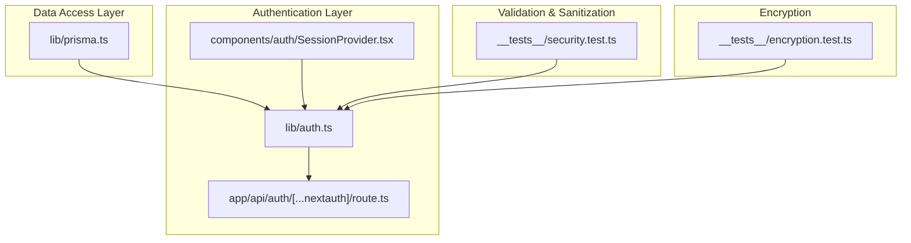
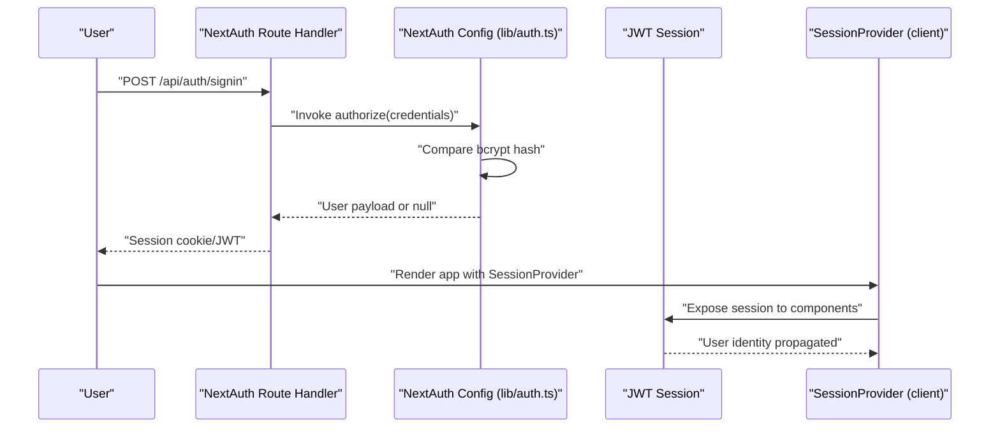
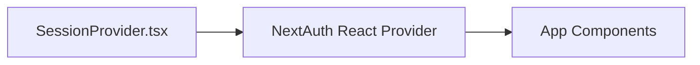
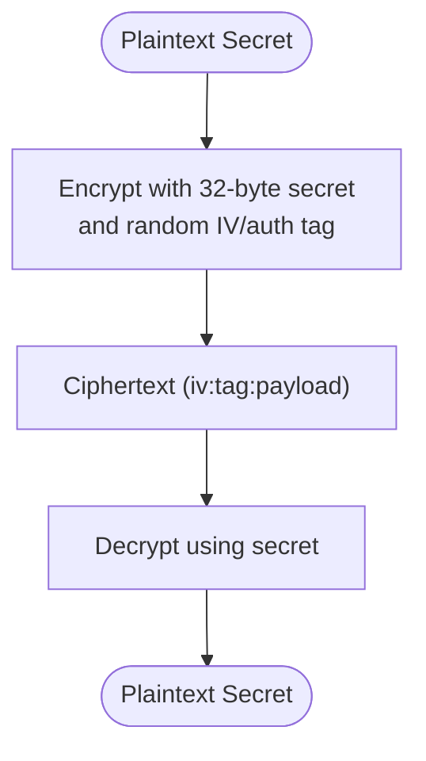
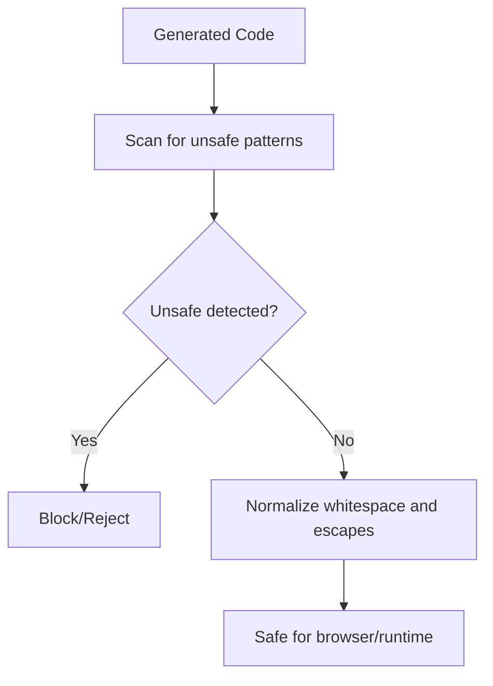
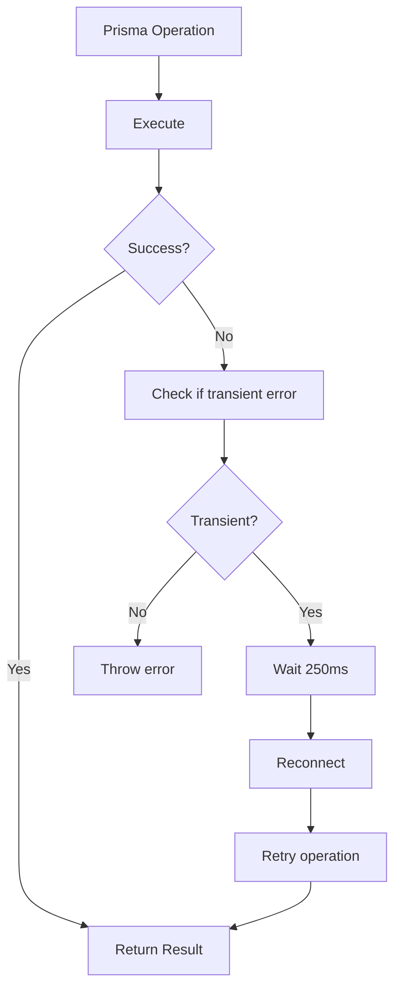
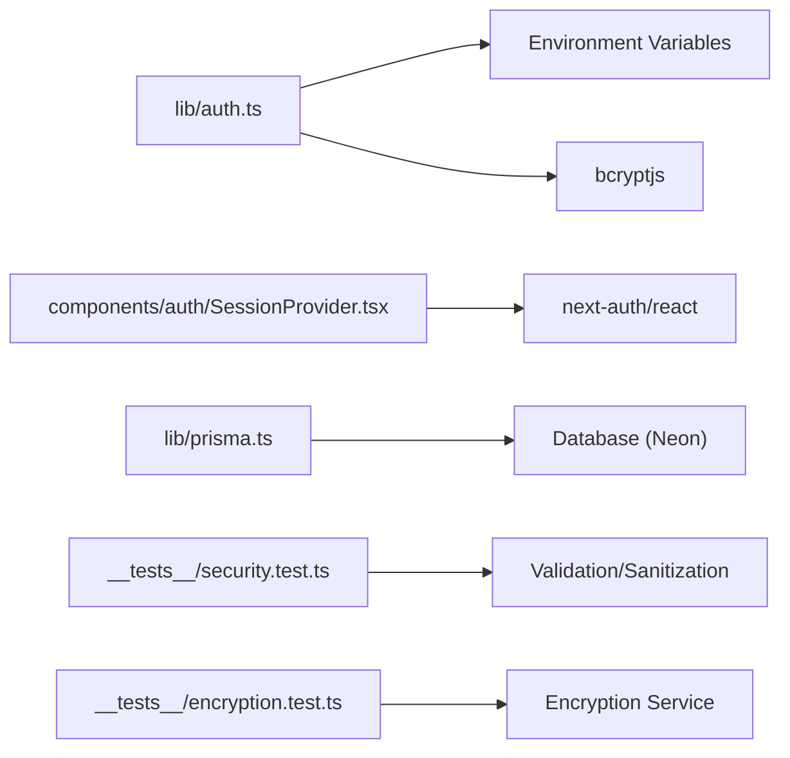

# Security & Privacy

<cite>
**Referenced Files in This Document**
- [lib/auth.ts](file://lib/auth.ts)
- [app/api/auth/[...nextauth]/route.ts](file://app/api/auth/[...nextauth]/route.ts)
- [components/auth/SessionProvider.tsx](file://components/auth/SessionProvider.tsx)
- [lib/prisma.ts](file://lib/prisma.ts)
- [__tests__/security.test.ts](file://__tests__/security.test.ts)
- [__tests__/encryption.test.ts](file://__tests__/encryption.test.ts)
</cite>

## Table of Contents
1. [Introduction](#introduction)
2. [Project Structure](#project-structure)
3. [Core Components](#core-components)
4. [Architecture Overview](#architecture-overview)
5. [Detailed Component Analysis](#detailed-component-analysis)
6. [Dependency Analysis](#dependency-analysis)
7. [Performance Considerations](#performance-considerations)
8. [Troubleshooting Guide](#troubleshooting-guide)
9. [Conclusion](#conclusion)
10. [Appendices](#appendices)

## Introduction
This document provides comprehensive security and privacy documentation for the AI-powered UI engine. It covers authentication and authorization using NextAuth.js, session management, and role-based access control. It also documents data protection measures including encryption for secure storage, API key management, and privacy considerations for user-generated content. Browser safety validation is explained to prevent XSS and related vulnerabilities, along with security scanning and sanitization processes for generated code. Data retention policies, user consent mechanisms, and compliance with privacy regulations are outlined. Best practices for developers integrating with the system, threat modeling considerations, incident response procedures, and multi-tenant security isolation are included.

## Project Structure
Security-critical components are organized across authentication, session management, database connectivity, and validation layers:
- Authentication and authorization via NextAuth.js
- Session provider for client-side session handling
- Database connectivity with automatic reconnection for transient errors
- Validation and sanitization for generated code
- Encryption utilities for secure storage of secrets

**Diagram sources**
- [lib/auth.ts:1-87](file://lib/auth.ts#L1-L87)
- [app/api/auth/[...nextauth]/route.ts:1-4](file://app/api/auth/[...nextauth]/route.ts#L1-L4)
- [components/auth/SessionProvider.tsx:1-8](file://components/auth/SessionProvider.tsx#L1-L8)
- [lib/prisma.ts:1-70](file://lib/prisma.ts#L1-L70)
- [__tests__/security.test.ts:1-60](file://__tests__/security.test.ts#L1-L60)
- [__tests__/encryption.test.ts:1-49](file://__tests__/encryption.test.ts#L1-L49)

**Section sources**
- [lib/auth.ts:1-87](file://lib/auth.ts#L1-L87)
- [app/api/auth/[...nextauth]/route.ts:1-4](file://app/api/auth/[...nextauth]/route.ts#L1-L4)
- [components/auth/SessionProvider.tsx:1-8](file://components/auth/SessionProvider.tsx#L1-L8)
- [lib/prisma.ts:1-70](file://lib/prisma.ts#L1-L70)
- [__tests__/security.test.ts:1-60](file://__tests__/security.test.ts#L1-L60)
- [__tests__/encryption.test.ts:1-49](file://__tests__/encryption.test.ts#L1-L49)

## Core Components
- Authentication and Authorization: Implements a single-owner credential provider using bcrypt-hashed passwords, JWT sessions, and NextAuth.js callbacks for token/session propagation.
- Session Management: Client-side provider wraps the application to enable session-aware components.
- Database Connectivity: Singleton Prisma client with automatic reconnection for transient Neon errors.
- Validation and Sanitization: Tests define expected behaviors for validating and sanitizing generated code to ensure browser safety.
- Encryption: Tests demonstrate encryption and decryption of sensitive data using a 32-byte secret.

**Section sources**
- [lib/auth.ts:11-86](file://lib/auth.ts#L11-L86)
- [components/auth/SessionProvider.tsx:3-7](file://components/auth/SessionProvider.tsx#L3-L7)
- [lib/prisma.ts:20-70](file://lib/prisma.ts#L20-L70)
- [__tests__/security.test.ts:1-60](file://__tests__/security.test.ts#L1-L60)
- [__tests__/encryption.test.ts:15-47](file://__tests__/encryption.test.ts#L15-L47)

## Architecture Overview
The system enforces authentication at the API boundary and propagates identity through JWT to the client. Sessions are managed client-side and persisted securely. Data access uses a singleton Prisma client with resilience against transient database errors. Generated code is validated and sanitized to prevent unsafe constructs and browser-incompatible patterns.

**Diagram sources**
- [app/api/auth/[...nextauth]/route.ts:1-4](file://app/api/auth/[...nextauth]/route.ts#L1-L4)
- [lib/auth.ts:25-59](file://lib/auth.ts#L25-L59)
- [components/auth/SessionProvider.tsx:5-6](file://components/auth/SessionProvider.tsx#L5-L6)

## Detailed Component Analysis

### Authentication and Authorization (NextAuth.js)
- Provider: Uses a custom credentials provider with email and password fields.
- Secret: Session secret sourced from environment variables.
- Max Age: JWT sessions configured to expire after seven days.
- Authorize Function: Validates presence of password, ensures a valid bcrypt hash is present, compares the provided password against the stored hash, and returns a minimal user object upon success.
- Callbacks: Propagate user identity into JWT and session objects.
- Pages: Redirects to the login page on sign-in and error scenarios.

**Diagram sources**
- [lib/auth.ts:25-59](file://lib/auth.ts#L25-L59)
- [lib/auth.ts:63-80](file://lib/auth.ts#L63-L80)

**Section sources**
- [lib/auth.ts:11-15](file://lib/auth.ts#L11-L15)
- [lib/auth.ts:17-61](file://lib/auth.ts#L17-L61)
- [lib/auth.ts:63-80](file://lib/auth.ts#L63-L80)
- [app/api/auth/[...nextauth]/route.ts:1-4](file://app/api/auth/[...nextauth]/route.ts#L1-L4)

### Session Management
- Client Provider: Wraps the application to expose session data to components.
- Trust Host: Enabled for Vercel preview and production domains.
- Pages: Login and error pages configured for redirect behavior.

**Diagram sources**
- [components/auth/SessionProvider.tsx:3-7](file://components/auth/SessionProvider.tsx#L3-L7)

**Section sources**
- [components/auth/SessionProvider.tsx:1-8](file://components/auth/SessionProvider.tsx#L1-L8)
- [lib/auth.ts:13-13](file://lib/auth.ts#L13-L13)
- [lib/auth.ts:82-85](file://lib/auth.ts#L82-L85)

### Role-Based Access Control
- Current Implementation: The system defines a single owner identity with a fixed user ID and profile fields. There is no explicit role model or tenant isolation enforced at the authentication layer.
- Recommendations:
  - Introduce roles (e.g., owner, member) and tenant identifiers in the user payload.
  - Enforce RBAC checks in middleware or route handlers using session claims.
  - Store and propagate tenant context in JWT claims for per-request isolation.

[No sources needed since this section provides recommendations without analyzing specific files]

### Data Protection Measures

#### Encryption for Secure Storage
- Encryption Service: Demonstrated in tests to encrypt and decrypt arbitrary plaintext using a 32-byte secret. The service produces distinct ciphertexts per encryption due to IV usage and handles empty strings gracefully.
- API Key Management: Treat API keys as secrets; store encrypted values and decrypt only when needed. Avoid logging sensitive data.

**Diagram sources**
- [__tests__/encryption.test.ts:15-29](file://__tests__/encryption.test.ts#L15-L29)

**Section sources**
- [__tests__/encryption.test.ts:15-47](file://__tests__/encryption.test.ts#L15-L47)

#### Privacy Considerations for User-Generated Content
- Minimization: Collect only necessary data for functionality.
- Consent: Implement opt-in mechanisms for analytics and data processing.
- De-identification: Remove personally identifiable information (PII) before processing or storing.
- Transparency: Provide clear privacy notices and data retention timelines.

[No sources needed since this section provides general guidance]

### Browser Safety Validation and Sanitization
- Validation: Detects unsupported Node.js standard library imports, process.exit(), terminal/TTY manipulation, and missing React exports.
- Sanitization: Collapses multi-line template literals, removes carriage returns, preserves escaped backticks.

**Diagram sources**
- [__tests__/security.test.ts:4-38](file://__tests__/security.test.ts#L4-L38)
- [__tests__/security.test.ts:40-58](file://__tests__/security.test.ts#L40-L58)

**Section sources**
- [__tests__/security.test.ts:4-38](file://__tests__/security.test.ts#L4-L38)
- [__tests__/security.test.ts:40-58](file://__tests__/security.test.ts#L40-L58)

### Database Connectivity and Resilience
- Singleton Prisma Client: Ensures a single client instance per process to avoid connection exhaustion.
- Automatic Reconnect: Wraps operations to retry on transient Neon errors after a brief delay.

**Diagram sources**
- [lib/prisma.ts:58-69](file://lib/prisma.ts#L58-L69)

**Section sources**
- [lib/prisma.ts:20-27](file://lib/prisma.ts#L20-L27)
- [lib/prisma.ts:58-69](file://lib/prisma.ts#L58-L69)

### Multi-Tenant Security Isolation and Data Privacy Guarantees
- Current State: No explicit tenant isolation is evident in the authentication or session layers.
- Recommended Practices:
  - Add tenant identifiers to user profiles and JWT claims.
  - Enforce tenant scoping in all data access paths.
  - Segment data at rest and in transit; apply least-privilege access controls.
  - Audit cross-tenant access attempts and enforce strict RBAC.

[No sources needed since this section provides recommendations without analyzing specific files]

## Dependency Analysis
- Authentication depends on environment variables for secrets and bcrypt for password verification.
- Session provider depends on NextAuth React provider.
- Database connectivity depends on Prisma client and environment-driven configuration.
- Validation and encryption rely on unit tests that assert expected behaviors.

**Diagram sources**
- [lib/auth.ts:12-12](file://lib/auth.ts#L12-L12)
- [lib/auth.ts:3-3](file://lib/auth.ts#L3-L3)
- [components/auth/SessionProvider.tsx:3-3](file://components/auth/SessionProvider.tsx#L3-L3)
- [lib/prisma.ts:1-1](file://lib/prisma.ts#L1-L1)
- [__tests__/security.test.ts:1-1](file://__tests__/security.test.ts#L1-L1)
- [__tests__/encryption.test.ts:1-1](file://__tests__/encryption.test.ts#L1-L1)

**Section sources**
- [lib/auth.ts:12-12](file://lib/auth.ts#L12-L12)
- [components/auth/SessionProvider.tsx:3-3](file://components/auth/SessionProvider.tsx#L3-L3)
- [lib/prisma.ts:1-1](file://lib/prisma.ts#L1-L1)
- [__tests__/security.test.ts:1-1](file://__tests__/security.test.ts#L1-L1)
- [__tests__/encryption.test.ts:1-1](file://__tests__/encryption.test.ts#L1-L1)

## Performance Considerations
- Authentication: Keep password hashing cost reasonable to balance security and latency; monitor bcrypt compare performance under load.
- Sessions: Use short-lived JWTs with refresh strategies if needed; avoid excessive session data to minimize payload sizes.
- Database: Leverage the singleton Prisma client and automatic reconnection to reduce connection churn and improve resilience.

[No sources needed since this section provides general guidance]

## Troubleshooting Guide
- Authentication Failures:
  - Verify environment variables for secrets and owner credentials.
  - Confirm bcrypt hash format and trimming of accidental quotes.
  - Check logs around authorization and comparison steps.
- Session Issues:
  - Ensure the client provider is mounted at the root of the app.
  - Confirm trustHost is enabled for deployment environments.
- Database Errors:
  - Review transient error messages and confirm automatic reconnection behavior.
  - Adjust connection limits and timeouts according to environment configuration.
- Validation Failures:
  - Inspect reported issues for unsupported imports, process APIs, or missing exports.
  - Apply normalization rules for template literals and whitespace.
- Encryption Failures:
  - Confirm 32-byte secret length and proper base encoding.
  - Validate that empty strings are handled as expected.

**Section sources**
- [lib/auth.ts:35-58](file://lib/auth.ts#L35-L58)
- [components/auth/SessionProvider.tsx:5-6](file://components/auth/SessionProvider.tsx#L5-L6)
- [lib/prisma.ts:36-69](file://lib/prisma.ts#L36-L69)
- [__tests__/security.test.ts:4-38](file://__tests__/security.test.ts#L4-L38)
- [__tests__/encryption.test.ts:15-47](file://__tests__/encryption.test.ts#L15-L47)

## Conclusion
The system establishes a robust foundation for authentication and session management using NextAuth.js and JWT. Data access is resilient through a singleton Prisma client with automatic reconnection. Validation and sanitization tests define clear expectations for generated code safety. To strengthen privacy and security posture, introduce role-based access control, tenant isolation, and comprehensive consent mechanisms. Adopt encryption for secrets, enforce least privilege, and maintain audit trails for compliance.

[No sources needed since this section summarizes without analyzing specific files]

## Appendices

### Security Best Practices for Developers
- Never hardcode secrets; use environment variables and secret managers.
- Validate and sanitize all user-generated content and generated code.
- Enforce tenant scoping in all data access paths.
- Log minimally and avoid logging sensitive data.
- Regularly rotate secrets and review access controls.

[No sources needed since this section provides general guidance]

### Threat Modeling Considerations
- Credential theft: Mitigate through strong secrets, rate limiting, and MFA if feasible.
- Injection attacks: Validate and sanitize inputs; restrict Node.js APIs in runtime.
- Cross-tenant exposure: Enforce tenant boundaries in queries and permissions.
- Data exposure: Encrypt at rest and in transit; apply access logging.

[No sources needed since this section provides general guidance]

### Incident Response Procedures
- Contain: Immediately revoke compromised secrets and disable affected accounts.
- Eradicate: Remove malicious artifacts and update validation/sanitization rules.
- Recover: Restore from backups and re-validate configurations.
- Communicate: Notify affected parties per policy and regulatory requirements.

[No sources needed since this section provides general guidance]