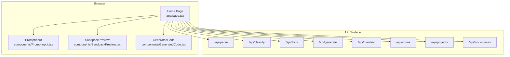
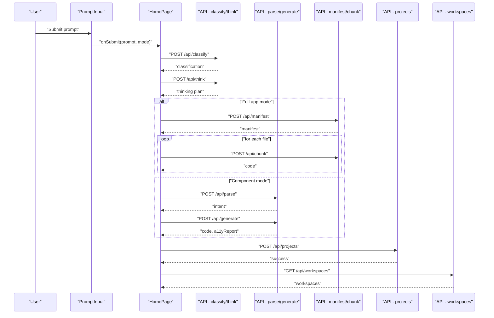
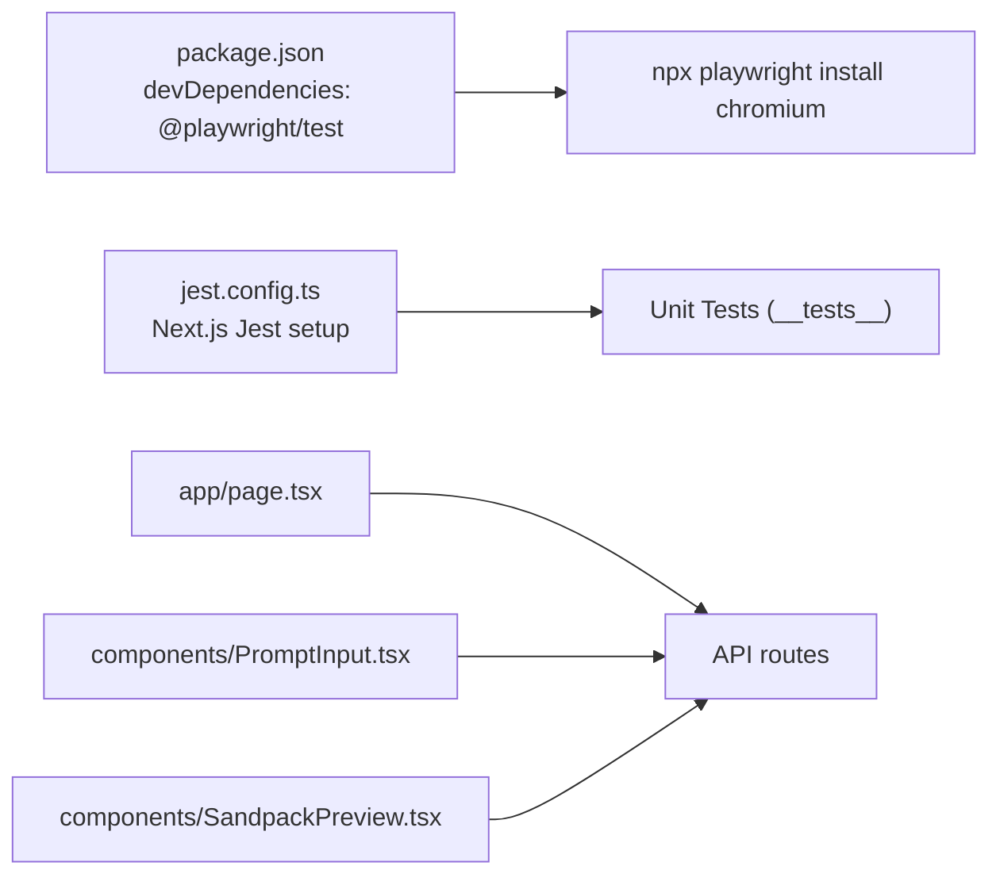

# End-to-End Testing

<cite>
**Referenced Files in This Document**
- [package.json](file://package.json)
- [jest.config.ts](file://jest.config.ts)
- [app/page.tsx](file://app/page.tsx)
- [components/PromptInput.tsx](file://components/PromptInput.tsx)
- [components/SandpackPreview.tsx](file://components/SandpackPreview.tsx)
- [components/GeneratedCode.tsx](file://components/GeneratedCode.tsx)
- [components/workspace/WorkspaceProvider.tsx](file://components/workspace/WorkspaceProvider.tsx)
- [__tests__/a11yValidator.test.ts](file://__tests__/a11yValidator.test.ts)
- [__tests__/base.test.ts](file://__tests__/base.test.ts)
</cite>

## Table of Contents
1. [Introduction](#introduction)
2. [Project Structure](#project-structure)
3. [Core Components](#core-components)
4. [Architecture Overview](#architecture-overview)
5. [Detailed Component Analysis](#detailed-component-analysis)
6. [Dependency Analysis](#dependency-analysis)
7. [Performance Considerations](#performance-considerations)
8. [Troubleshooting Guide](#troubleshooting-guide)
9. [Conclusion](#conclusion)
10. [Appendices](#appendices)

## Introduction
This document describes end-to-end testing for the AI-powered UI engine using Playwright. It covers browser automation setup, cross-browser strategies, and user workflow validation across the full generation pipeline from intent submission to component preview. It also documents accessibility validation and auto-repair workflows, workspace/project management, collaborative features, real-time preview, responsive design, test data management, environment setup, CI/CD integration, performance testing, accessibility compliance verification, and regression strategies.

## Project Structure
The repository is a Next.js application with a React UI and a backend API surface used by the frontend. Playwright is included as a dev dependency, and the project’s build script installs Chromium for Playwright. The UI engine exposes several key pages and APIs used by E2E tests:
- Home page orchestrating the generation pipeline
- Prompt input and generation controls
- Live preview via Sandpack
- Workspace and project persistence APIs

**Diagram sources**
- [app/page.tsx:48-522](file://app/page.tsx#L48-L522)
- [components/PromptInput.tsx:42-563](file://components/PromptInput.tsx#L42-L563)
- [components/SandpackPreview.tsx:144-287](file://components/SandpackPreview.tsx#L144-L287)
- [components/GeneratedCode.tsx:14-149](file://components/GeneratedCode.tsx#L14-L149)

**Section sources**
- [package.json:5-11](file://package.json#L5-L11)
- [app/page.tsx:48-522](file://app/page.tsx#L48-L522)

## Core Components
- Home page orchestrates the generation pipeline, manages stages, and persists projects.
- Prompt input handles intent classification, voice/image attachments, and submits prompts.
- Sandpack preview renders generated code in a live iframe and supports screenshots for E2E capture.
- Workspace provider manages workspaces and integrates with backend APIs.

Key responsibilities for E2E:
- Validate intent parsing, classification, thinking, generation, validation, and testing steps.
- Verify live preview stability and screenshot readiness.
- Exercise workspace/project persistence and switching.
- Cross-browser compatibility and responsive behavior.

**Section sources**
- [app/page.tsx:166-310](file://app/page.tsx#L166-L310)
- [components/PromptInput.tsx:190-230](file://components/PromptInput.tsx#L190-L230)
- [components/SandpackPreview.tsx:65-103](file://components/SandpackPreview.tsx#L65-L103)
- [components/workspace/WorkspaceProvider.tsx:27-127](file://components/workspace/WorkspaceProvider.tsx#L27-L127)

## Architecture Overview
The E2E flow spans the UI and backend APIs. The home page coordinates:
- Intent classification and thinking
- Manifest and chunk generation for full apps
- Component generation and validation/testing
- Persistence to projects and workspaces

**Diagram sources**
- [app/page.tsx:313-397](file://app/page.tsx#L313-L397)
- [app/page.tsx:166-310](file://app/page.tsx#L166-L310)

## Detailed Component Analysis

### Prompt Input and Intent Classification
- Validates prompt length and content, debounces classification requests, and surfaces live intent confidence.
- Supports voice input and image-to-text attachment for richer prompts.

Recommended E2E checks:
- Short prompts trigger validation errors.
- Live classification updates confidence and intent badges.
- Voice input toggles and interim transcripts appear.
- Image attachment appends caption context to the prompt.

**Section sources**
- [components/PromptInput.tsx:58-65](file://components/PromptInput.tsx#L58-L65)
- [components/PromptInput.tsx:190-213](file://components/PromptInput.tsx#L190-L213)
- [components/PromptInput.tsx:130-148](file://components/PromptInput.tsx#L130-L148)
- [components/PromptInput.tsx:150-187](file://components/PromptInput.tsx#L150-L187)

### Generation Pipeline Orchestration
- Coordinates classification, thinking, parsing, generation, validation, and testing.
- Persists projects and stamps a stable output timestamp for versioning.
- Handles full app mode with manifest/chunk orchestration.

E2E validation:
- Stage transitions occur in order: parsing → generating → validating → testing → complete.
- Error states propagate from API failures.
- Output timestamp remains stable across re-renders.

**Section sources**
- [app/page.tsx:166-310](file://app/page.tsx#L166-L310)
- [app/page.tsx:111-134](file://app/page.tsx#L111-L134)

### Live Preview and Screenshot Capture
- Sandpack preview renders code in a live iframe.
- Observers detect preview readiness and expose iframe src for server-side screenshot capture.
- Provides edit mode and reload controls.

E2E validation:
- Preview loads and stabilizes after a delay.
- Screenshot observer emits ready signal with external or internal iframe src.
- Error boundary displays crash messages and allows retry.

**Section sources**
- [components/SandpackPreview.tsx:65-103](file://components/SandpackPreview.tsx#L65-L103)
- [components/SandpackPreview.tsx:109-140](file://components/SandpackPreview.tsx#L109-L140)

### Generated Code Display and Actions
- Renders generated code with copy/download actions.
- Integrates with a code editor for readability.

E2E validation:
- Copy action updates UI feedback.
- Download creates a .tsx file with the component name.

**Section sources**
- [components/GeneratedCode.tsx:30-63](file://components/GeneratedCode.tsx#L30-L63)

### Workspace Management and Persistence
- Creates, deletes, and switches workspaces.
- Auto-provisions a default workspace on first login.
- Loads and persists projects under the active workspace.

E2E validation:
- New workspace creation and selection.
- Project creation and loading.
- Deleting a workspace updates lists and active selection.

**Section sources**
- [components/workspace/WorkspaceProvider.tsx:34-58](file://components/workspace/WorkspaceProvider.tsx#L34-L58)
- [components/workspace/WorkspaceProvider.tsx:60-86](file://components/workspace/WorkspaceProvider.tsx#L60-L86)
- [components/workspace/WorkspaceProvider.tsx:88-127](file://components/workspace/WorkspaceProvider.tsx#L88-L127)

### Accessibility Validation and Auto-Repair
- Unit tests validate detection of common accessibility issues and auto-repair suggestions.
- E2E can leverage these rules to assert generated code meets baseline accessibility.

Validation examples:
- Missing alt attributes on images.
- Buttons without accessible names.
- Inputs without labels.
- Heading hierarchy issues.
- Low color contrast and focus visibility.

**Section sources**
- [__tests__/a11yValidator.test.ts:1-110](file://__tests__/a11yValidator.test.ts#L1-L110)

### Pricing and Cost Estimation
- Unit tests validate cost estimation for various models.
- Useful for smoke checks around AI engine configuration.

**Section sources**
- [__tests__/base.test.ts:1-31](file://__tests__/base.test.ts#L1-L31)

## Dependency Analysis
Playwright is declared as a dev dependency and installed during the build step. Jest is configured for unit tests with Next.js support.

**Diagram sources**
- [package.json:46-66](file://package.json#L46-L66)
- [package.json:7](file://package.json#L7)
- [jest.config.ts:1-23](file://jest.config.ts#L1-L23)

**Section sources**
- [package.json:46-66](file://package.json#L46-L66)
- [package.json:7](file://package.json#L7)
- [jest.config.ts:1-23](file://jest.config.ts#L1-L23)

## Performance Considerations
- Generation latency and stage timing can be measured by instrumenting the pipeline in the home page.
- Preview stabilization delays should be accounted for in E2E waits.
- Full app generation involves multiple chunks; ensure robust retries and timeouts.
- Use browser tracing and metrics collection in CI for performance regression detection.

## Troubleshooting Guide
Common E2E issues and remedies:
- Preview not ready: wait for the screenshot observer to emit a ready signal before asserting screenshots.
- Workspace provisioning: on first login, a default workspace is created automatically; tests should account for this.
- Classification errors: the pipeline continues with defaults and logs warnings; assert fallback behavior.
- Network flakiness: wrap API calls with retries and explicit error assertions.

**Section sources**
- [components/SandpackPreview.tsx:65-103](file://components/SandpackPreview.tsx#L65-L103)
- [components/workspace/WorkspaceProvider.tsx:103-107](file://components/workspace/WorkspaceProvider.tsx#L103-L107)
- [app/page.tsx:336-347](file://app/page.tsx#L336-L347)

## Conclusion
This guide outlines a comprehensive Playwright-based E2E strategy for the AI-powered UI engine. By validating the entire generation pipeline, live preview, workspace/project persistence, and accessibility, teams can ensure reliable cross-browser experiences and maintain quality over time.

## Appendices

### Environment Setup for E2E Tests
- Install Playwright browsers via the project’s build script.
- Configure test environment variables for API endpoints and authentication.
- Use a headless browser for CI and headed mode locally for debugging.

**Section sources**
- [package.json:7](file://package.json#L7)

### Cross-Browser Testing Strategies
- Run tests on Chromium, Firefox, and Safari to validate rendering parity.
- Use device emulation for mobile and tablet previews.
- Validate responsive breakpoints and layout shifts.

### Real-Time Preview and Screenshot Capture
- Use the Sandpack preview observer to capture iframe src URLs for server-side screenshots.
- Assert preview stability and error boundaries.

**Section sources**
- [components/SandpackPreview.tsx:65-103](file://components/SandpackPreview.tsx#L65-L103)

### Accessibility Compliance Verification
- Integrate accessibility checks against generated code.
- Apply auto-repair suggestions and re-validate improvements.

**Section sources**
- [__tests__/a11yValidator.test.ts:90-108](file://__tests__/a11yValidator.test.ts#L90-L108)

### Regression Testing Strategies
- Snapshot-style assertions for generated code and preview snapshots.
- Stability checks for stage transitions and error flows.
- Smoke tests for workspace/project CRUD operations.

### CI/CD Integration
- Install browsers in CI using the project’s build script.
- Parallelize tests across browsers and feature areas.
- Archive screenshots and traces for failed runs.