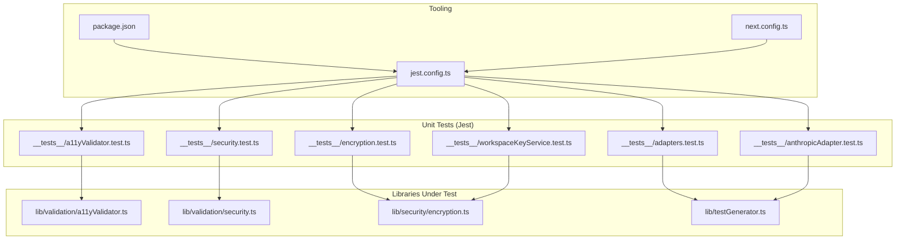
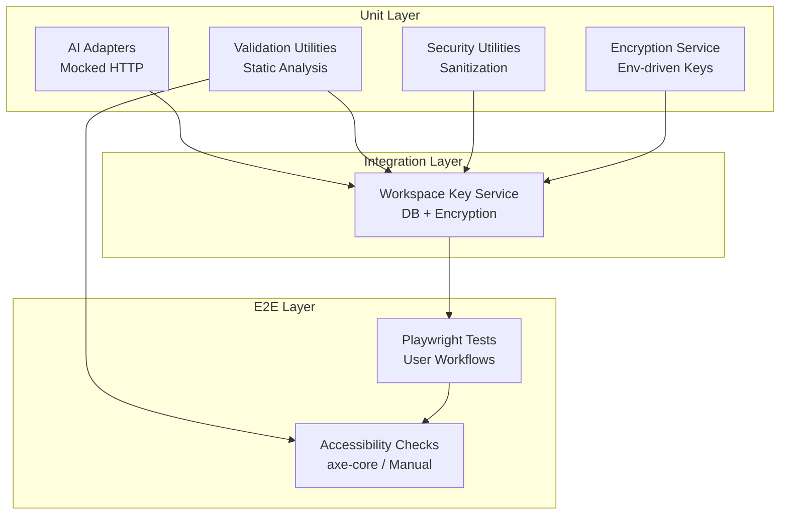
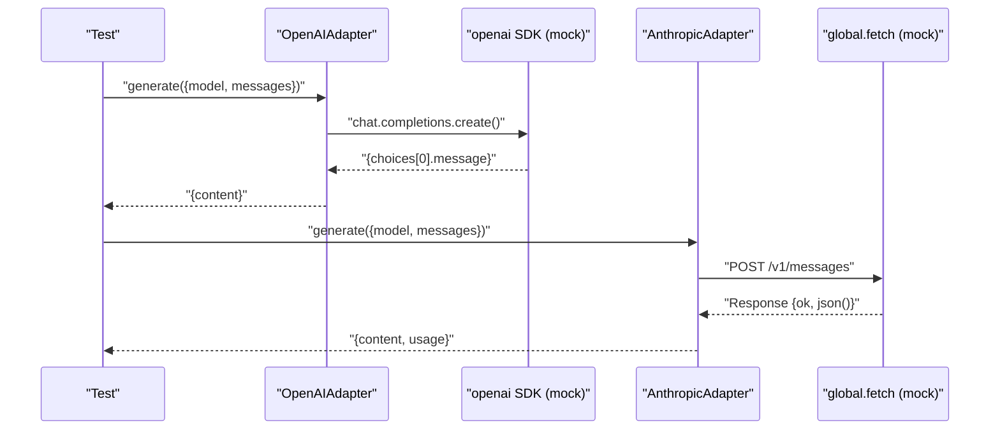
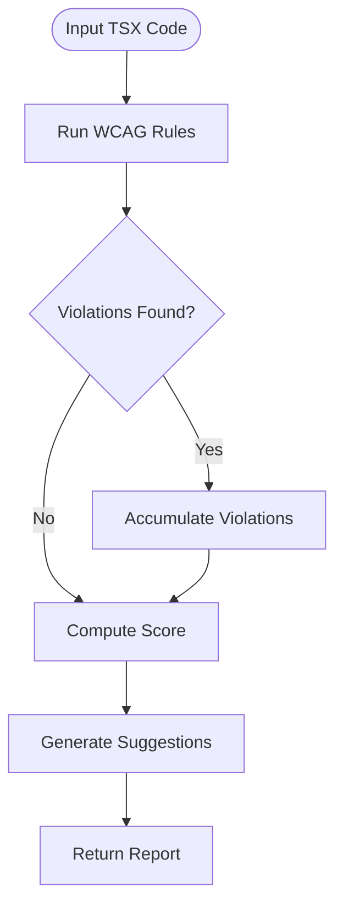
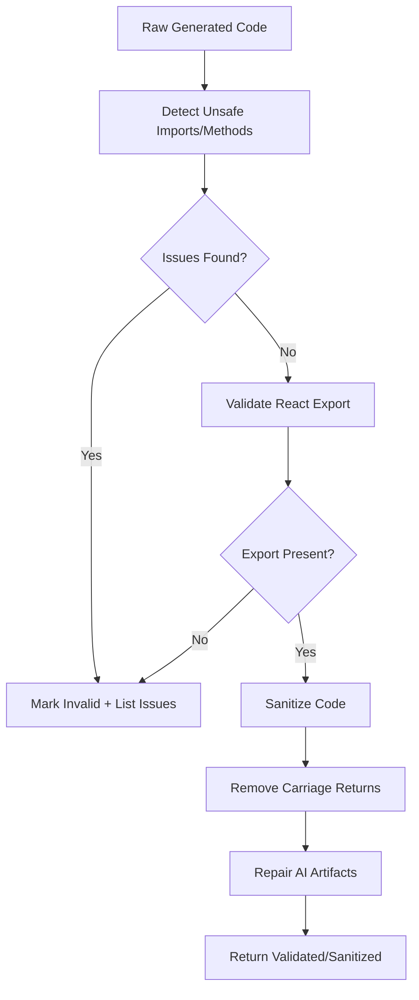
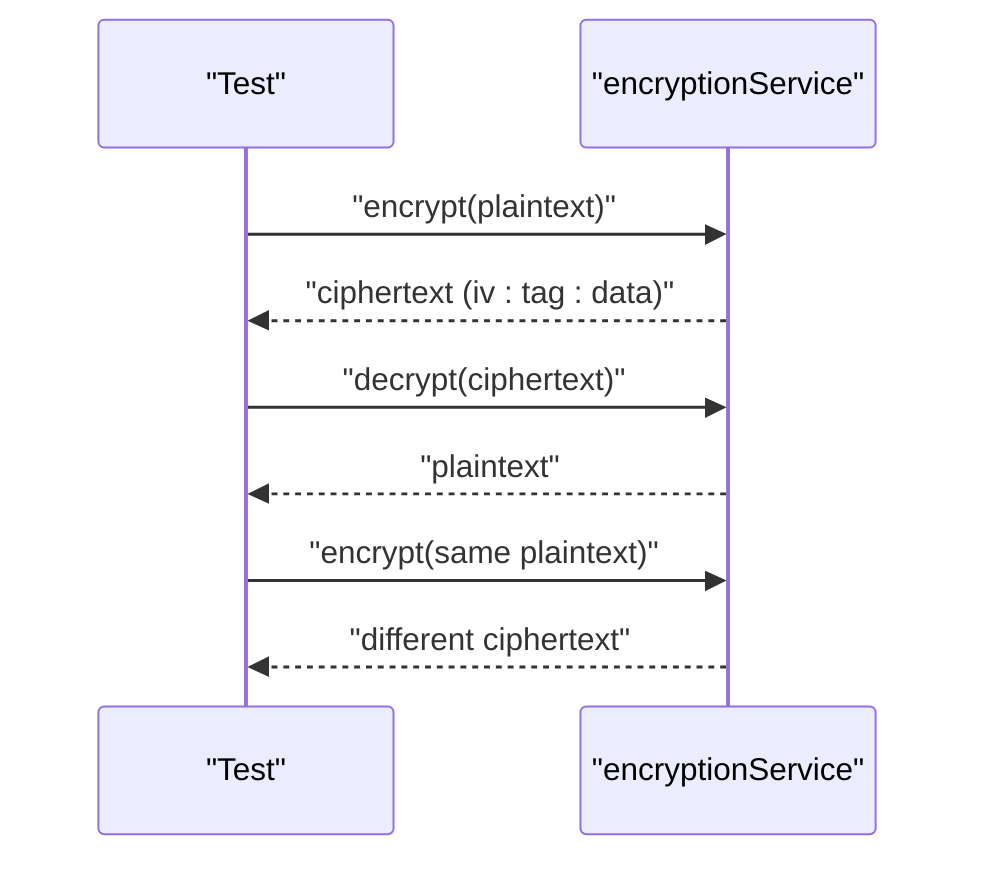
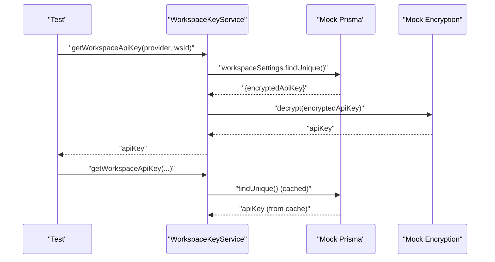
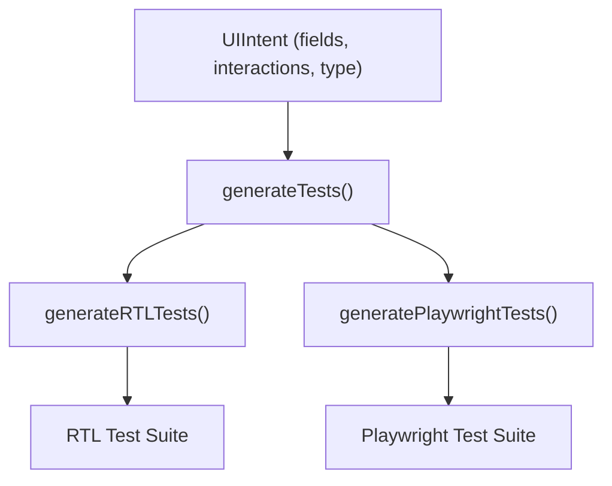
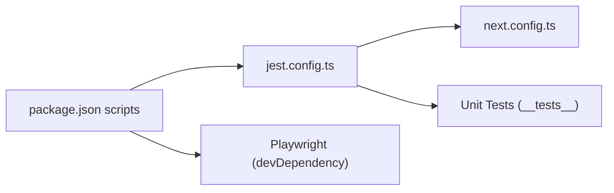

# Testing Strategy

<cite>
**Referenced Files in This Document**
- [jest.config.ts](file://jest.config.ts)
- [package.json](file://package.json)
- [next.config.ts](file://next.config.ts)
- [lib/testGenerator.ts](file://lib/testGenerator.ts)
- [lib/validation/a11yValidator.ts](file://lib/validation/a11yValidator.ts)
- [lib/validation/security.ts](file://lib/validation/security.ts)
- [lib/security/encryption.ts](file://lib/security/encryption.ts)
- [__tests__/adapters.test.ts](file://__tests__/adapters.test.ts)
- [__tests__/anthropicAdapter.test.ts](file://__tests__/anthropicAdapter.test.ts)
- [__tests__/a11yValidator.test.ts](file://__tests__/a11yValidator.test.ts)
- [__tests__/security.test.ts](file://__tests__/security.test.ts)
- [__tests__/encryption.test.ts](file://__tests__/encryption.test.ts)
- [__tests__/workspaceKeyService.test.ts](file://__tests__/workspaceKeyService.test.ts)
</cite>

## Table of Contents
1. [Introduction](#introduction)
2. [Project Structure](#project-structure)
3. [Core Components](#core-components)
4. [Architecture Overview](#architecture-overview)
5. [Detailed Component Analysis](#detailed-component-analysis)
6. [Dependency Analysis](#dependency-analysis)
7. [Performance Considerations](#performance-considerations)
8. [Troubleshooting Guide](#troubleshooting-guide)
9. [Conclusion](#conclusion)
10. [Appendices](#appendices)

## Introduction
This document defines a comprehensive testing strategy for the AI-powered accessibility-first UI engine. It covers unit testing with Jest, integration testing patterns, end-to-end testing with Playwright, automated test generation, and quality assurance workflows. It also provides best practices for testing AI-integrated applications, mocking strategies for LLM providers, database interactions, coverage requirements, CI testing, quality gates, performance and accessibility automation, and security testing procedures.

## Project Structure
The repository organizes tests under a dedicated test folder and integrates testing tooling via Jest and Playwright. Unit tests target core libraries such as AI adapters, validation utilities, encryption, and security helpers. An automated test generator produces React Testing Library and Playwright test scaffolding based on UI intents.

**Diagram sources**
- [jest.config.ts:1-23](file://jest.config.ts#L1-L23)
- [package.json:1-68](file://package.json#L1-L68)
- [next.config.ts:1-38](file://next.config.ts#L1-L38)
- [lib/testGenerator.ts:1-265](file://lib/testGenerator.ts#L1-L265)
- [lib/validation/a11yValidator.ts:1-376](file://lib/validation/a11yValidator.ts#L1-L376)
- [lib/validation/security.ts:1-129](file://lib/validation/security.ts#L1-L129)
- [lib/security/encryption.ts:1-95](file://lib/security/encryption.ts#L1-L95)
- [__tests__/adapters.test.ts:1-109](file://__tests__/adapters.test.ts#L1-L109)
- [__tests__/anthropicAdapter.test.ts:1-163](file://__tests__/anthropicAdapter.test.ts#L1-L163)
- [__tests__/a11yValidator.test.ts:1-110](file://__tests__/a11yValidator.test.ts#L1-L110)
- [__tests__/security.test.ts:1-60](file://__tests__/security.test.ts#L1-L60)
- [__tests__/encryption.test.ts:1-49](file://__tests__/encryption.test.ts#L1-L49)
- [__tests__/workspaceKeyService.test.ts:1-69](file://__tests__/workspaceKeyService.test.ts#L1-L69)

**Section sources**
- [jest.config.ts:1-23](file://jest.config.ts#L1-L23)
- [package.json:1-68](file://package.json#L1-L68)
- [next.config.ts:1-38](file://next.config.ts#L1-L38)

## Core Components
- AI Adapter Testing: Validates provider-specific adapters (OpenAI, Anthropic, Google, Ollama) with mocked HTTP clients and streaming support.
- Accessibility Validator: Static analysis of generated TSX code for WCAG compliance and auto-repair suggestions.
- Security Validator: Ensures generated code is browser-safe and sanitizes common AI artifacts.
- Encryption Service: AES-256-GCM encryption/decryption with environment-driven key derivation.
- Automated Test Generator: Produces RTL and Playwright tests from UI intents.

**Section sources**
- [__tests__/adapters.test.ts:1-109](file://__tests__/adapters.test.ts#L1-L109)
- [__tests__/anthropicAdapter.test.ts:1-163](file://__tests__/anthropicAdapter.test.ts#L1-L163)
- [lib/validation/a11yValidator.ts:1-376](file://lib/validation/a11yValidator.ts#L1-L376)
- [lib/validation/security.ts:1-129](file://lib/validation/security.ts#L1-L129)
- [lib/security/encryption.ts:1-95](file://lib/security/encryption.ts#L1-L95)
- [lib/testGenerator.ts:1-265](file://lib/testGenerator.ts#L1-L265)

## Architecture Overview
The testing architecture separates concerns across unit, integration, and end-to-end layers. Unit tests use Jest with isolated mocks for external services. Integration tests validate database and encryption flows. End-to-end tests use Playwright to simulate user workflows and validate accessibility.

**Diagram sources**
- [__tests__/adapters.test.ts:1-109](file://__tests__/adapters.test.ts#L1-L109)
- [__tests__/anthropicAdapter.test.ts:1-163](file://__tests__/anthropicAdapter.test.ts#L1-L163)
- [__tests__/a11yValidator.test.ts:1-110](file://__tests__/a11yValidator.test.ts#L1-L110)
- [__tests__/security.test.ts:1-60](file://__tests__/security.test.ts#L1-L60)
- [__tests__/encryption.test.ts:1-49](file://__tests__/encryption.test.ts#L1-L49)
- [__tests__/workspaceKeyService.test.ts:1-69](file://__tests__/workspaceKeyService.test.ts#L1-L69)
- [lib/testGenerator.ts:1-265](file://lib/testGenerator.ts#L1-L265)

## Detailed Component Analysis

### AI Adapter Testing Strategy
- Mock external providers uniformly:
  - OpenAI SDK: Mocked client with streaming and non-streaming responses.
  - Anthropic: Native fetch mocked to return a Response-like object with JSON payload.
- Validate:
  - Non-stream and streaming generation.
  - Provider-specific behavior (e.g., JSON directive injection).
  - Error propagation for HTTP failures and malformed streams.
- Best practices:
  - Reset mocks per test and restore spies after each test.
  - Use environment variables to supply API keys for providers.

**Diagram sources**
- [__tests__/adapters.test.ts:8-27](file://__tests__/adapters.test.ts#L8-L27)
- [__tests__/adapters.test.ts:57-79](file://__tests__/adapters.test.ts#L57-L79)
- [__tests__/anthropicAdapter.test.ts:40-67](file://__tests__/anthropicAdapter.test.ts#L40-L67)
- [__tests__/anthropicAdapter.test.ts:109-112](file://__tests__/anthropicAdapter.test.ts#L109-L112)

**Section sources**
- [__tests__/adapters.test.ts:1-109](file://__tests__/adapters.test.ts#L1-L109)
- [__tests__/anthropicAdapter.test.ts:1-163](file://__tests__/anthropicAdapter.test.ts#L1-L163)

### Accessibility Validator Testing
- Validates WCAG rules via static analysis of TSX code strings.
- Tests include missing alt attributes, accessible button names, labels for inputs, heading hierarchy, interactive elements, color contrast, and focus visibility.
- Includes auto-repair tests that add focus rings, aria-labels, and alert roles.

**Diagram sources**
- [lib/validation/a11yValidator.ts:264-297](file://lib/validation/a11yValidator.ts#L264-L297)
- [__tests__/a11yValidator.test.ts:1-110](file://__tests__/a11yValidator.test.ts#L1-L110)

**Section sources**
- [lib/validation/a11yValidator.ts:1-376](file://lib/validation/a11yValidator.ts#L1-L376)
- [__tests__/a11yValidator.test.ts:1-110](file://__tests__/a11yValidator.test.ts#L1-L110)

### Security Validator and Sanitization
- Browser safety checks detect unsupported Node.js APIs, process.exit, terminal manipulation, and missing React exports.
- Sanitization collapses multi-line template literals, removes carriage returns, and repairs common AI artifacts that break parsing.

**Diagram sources**
- [lib/validation/security.ts:6-34](file://lib/validation/security.ts#L6-L34)
- [lib/validation/security.ts:44-128](file://lib/validation/security.ts#L44-L128)
- [__tests__/security.test.ts:1-60](file://__tests__/security.test.ts#L1-L60)

**Section sources**
- [lib/validation/security.ts:1-129](file://lib/validation/security.ts#L1-L129)
- [__tests__/security.test.ts:1-60](file://__tests__/security.test.ts#L1-L60)

### Encryption Service Testing
- Validates encryption and decryption with a 32-byte key (base64 or raw).
- Confirms random IV behavior and identical plaintext yields different ciphertexts.
- Handles empty strings gracefully.

**Diagram sources**
- [lib/security/encryption.ts:27-68](file://lib/security/encryption.ts#L27-L68)
- [__tests__/encryption.test.ts:15-47](file://__tests__/encryption.test.ts#L15-L47)

**Section sources**
- [lib/security/encryption.ts:1-95](file://lib/security/encryption.ts#L1-L95)
- [__tests__/encryption.test.ts:1-49](file://__tests__/encryption.test.ts#L1-L49)

### Workspace Key Service Integration Testing
- Uses dynamic mocks for Prisma and encryption to isolate dependencies.
- Verifies decryption and caching behavior for workspace API keys and model names.

**Diagram sources**
- [__tests__/workspaceKeyService.test.ts:35-56](file://__tests__/workspaceKeyService.test.ts#L35-L56)
- [__tests__/workspaceKeyService.test.ts:27-33](file://__tests__/workspaceKeyService.test.ts#L27-L33)

**Section sources**
- [__tests__/workspaceKeyService.test.ts:1-69](file://__tests__/workspaceKeyService.test.ts#L1-L69)

### Automated Test Generation
- Generates React Testing Library tests for rendering, interactions, validation, and accessibility checks.
- Generates Playwright E2E tests for visual checks, keyboard navigation, accessibility assertions, focus indicators, and responsive viewport tests.

**Diagram sources**
- [lib/testGenerator.ts:8-15](file://lib/testGenerator.ts#L8-L15)
- [lib/testGenerator.ts:17-161](file://lib/testGenerator.ts#L17-L161)
- [lib/testGenerator.ts:163-264](file://lib/testGenerator.ts#L163-L264)

**Section sources**
- [lib/testGenerator.ts:1-265](file://lib/testGenerator.ts#L1-L265)

## Dependency Analysis
- Jest configuration sets up module name mapping, coverage provider, and environment for unit tests.
- Package scripts define test commands and install Playwright browsers during build.
- Next.js configuration supports standalone output and security headers, indirectly affecting test runtime behavior.

**Diagram sources**
- [package.json:5-11](file://package.json#L5-L11)
- [jest.config.ts:8-20](file://jest.config.ts#L8-L20)
- [next.config.ts:3-35](file://next.config.ts#L3-L35)

**Section sources**
- [package.json:1-68](file://package.json#L1-L68)
- [jest.config.ts:1-23](file://jest.config.ts#L1-L23)
- [next.config.ts:1-38](file://next.config.ts#L1-L38)

## Performance Considerations
- Prefer deterministic mocks for AI providers to avoid flaky timing and network variability.
- Use Jest’s fake timers for time-dependent logic in adapters and validators.
- Limit heavy computations in unit tests; move heavy validations to integration tests.
- For E2E tests, run in headless mode and reuse browser contexts to reduce startup overhead.

## Troubleshooting Guide
- Flaky AI adapter tests:
  - Ensure mocks are reset between tests and global.fetch is restored.
  - Validate that streaming tests properly consume the entire iterator.
- Accessibility validator failures:
  - Confirm generated code adheres to WCAG rules; use auto-repair to fix common issues.
- Security sanitizer issues:
  - Review multi-line template literals and AI artifacts; ensure sanitization runs before rendering.
- Encryption tests:
  - Set a 32-byte ENCRYPTION_SECRET; confirm base64 or raw length.
- Workspace key service:
  - Clear module cache and re-import to apply new environment variables in tests.

**Section sources**
- [__tests__/adapters.test.ts:47-55](file://__tests__/adapters.test.ts#L47-L55)
- [__tests__/anthropicAdapter.test.ts:13-16](file://__tests__/anthropicAdapter.test.ts#L13-L16)
- [__tests__/a11yValidator.test.ts:1-110](file://__tests__/a11yValidator.test.ts#L1-L110)
- [__tests__/security.test.ts:1-60](file://__tests__/security.test.ts#L1-L60)
- [__tests__/encryption.test.ts:15-47](file://__tests__/encryption.test.ts#L15-L47)
- [__tests__/workspaceKeyService.test.ts:27-33](file://__tests__/workspaceKeyService.test.ts#L27-L33)

## Conclusion
This testing strategy ensures robust validation of AI-integrated UI components, accessibility, security, and encryption. By combining targeted unit tests, integration validations, and automated E2E suites, the project maintains high reliability and accessibility-first standards. Continuous integration should enforce coverage thresholds, quality gates, and security checks to sustain long-term quality.

## Appendices

### Testing Best Practices for AI-Integrated Applications
- Mock provider SDKs and HTTP endpoints to eliminate flakiness.
- Normalize provider responses and usage metrics for consistent assertions.
- Validate streaming adapters by consuming the entire stream and asserting chunk shapes.
- Sanitize generated code before rendering to prevent parser errors.

### Mock Strategies for LLM Providers
- OpenAI: Mock chat.completions.create with both streaming and non-streaming responses.
- Anthropic: Mock global.fetch to return a Response-like object with JSON payload.
- Google: Use similar fetch-based mocking as Anthropic.
- Ollama: Mock HTTP calls to the local inference endpoint.

### Testing Database Interactions
- Use isolated mocks for Prisma client in unit tests.
- For integration tests, spin up a lightweight test database and seed minimal data.
- Validate caching behavior and transaction boundaries.

### Test Coverage Requirements
- Enforce coverage thresholds for security, validation, and encryption modules.
- Aim for high coverage in adapters and validators; acceptable lower coverage in UI scaffolding.

### Continuous Integration Testing and Quality Gates
- Run Jest tests on pull requests with coverage reporting.
- Install Playwright browsers in CI and execute E2E tests in headless mode.
- Gate merges on passing unit, integration, and selected E2E suites.

### Accessibility Testing Automation
- Integrate axe-core with Playwright for automated accessibility checks.
- Include keyboard navigation and focus indicator tests in E2E suites.
- Validate responsive behavior across device viewports.

### Security Testing Procedures
- Validate browser-safe code before rendering.
- Sanitize generated code to remove AI artifacts.
- Audit encryption key handling and environment configuration.