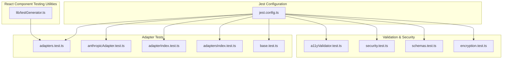
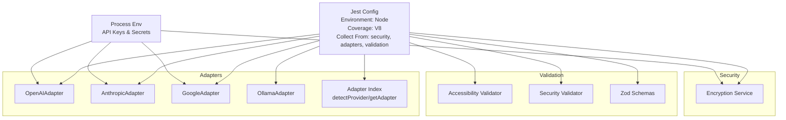
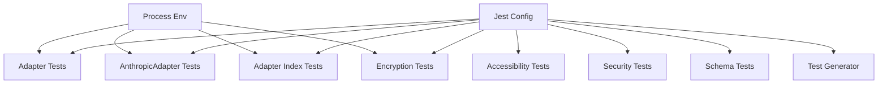

# Unit Testing

<cite>
**Referenced Files in This Document**
- [jest.config.ts](file://jest.config.ts)
- [adapters.test.ts](file://__tests__/adapters.test.ts)
- [anthropicAdapter.test.ts](file://__tests__/anthropicAdapter.test.ts)
- [adapterIndex.test.ts](file://__tests__/adapterIndex.test.ts)
- [adaptersIndex.test.ts](file://__tests__/adaptersIndex.test.ts)
- [base.test.ts](file://__tests__/base.test.ts)
- [a11yValidator.test.ts](file://__tests__/a11yValidator.test.ts)
- [security.test.ts](file://__tests__/security.test.ts)
- [schemas.test.ts](file://__tests__/schemas.test.ts)
- [encryption.test.ts](file://__tests__/encryption.test.ts)
- [testGenerator.ts](file://lib/testGenerator.ts)
</cite>

## Table of Contents
1. [Introduction](#introduction)
2. [Project Structure](#project-structure)
3. [Core Components](#core-components)
4. [Architecture Overview](#architecture-overview)
5. [Detailed Component Analysis](#detailed-component-analysis)
6. [Dependency Analysis](#dependency-analysis)
7. [Performance Considerations](#performance-considerations)
8. [Troubleshooting Guide](#troubleshooting-guide)
9. [Conclusion](#conclusion)

## Introduction
This document describes the unit testing implementation for the AI-powered accessibility-first UI engine. It covers Jest configuration, test environment setup, coverage collection strategies, and testing patterns for React components, AI adapters, validation modules, and security utilities. It also documents mocking strategies for external services, factory-style adapter resolution, and best practices for asynchronous operations, error handling, and edge cases. Guidance is provided for test isolation, dependency injection for testing, and maintaining reliability across environments.

## Project Structure
The repository organizes tests under a dedicated test folder and focuses on validating core libraries related to AI adapters, accessibility validation, security checks, and schema parsing. The Jest configuration centralizes environment and coverage settings, while individual test suites target specific modules and factories.

**Diagram sources**
- [jest.config.ts](file://jest.config.ts)
- [adapters.test.ts](file://__tests__/adapters.test.ts)
- [anthropicAdapter.test.ts](file://__tests__/anthropicAdapter.test.ts)
- [adapterIndex.test.ts](file://__tests__/adapterIndex.test.ts)
- [adaptersIndex.test.ts](file://__tests__/adaptersIndex.test.ts)
- [base.test.ts](file://__tests__/base.test.ts)
- [a11yValidator.test.ts](file://__tests__/a11yValidator.test.ts)
- [security.test.ts](file://__tests__/security.test.ts)
- [schemas.test.ts](file://__tests__/schemas.test.ts)
- [encryption.test.ts](file://__tests__/encryption.test.ts)
- [testGenerator.ts](file://lib/testGenerator.ts)

**Section sources**
- [jest.config.ts](file://jest.config.ts)
- [adapters.test.ts](file://__tests__/adapters.test.ts)
- [anthropicAdapter.test.ts](file://__tests__/anthropicAdapter.test.ts)
- [adapterIndex.test.ts](file://__tests__/adapterIndex.test.ts)
- [adaptersIndex.test.ts](file://__tests__/adaptersIndex.test.ts)
- [base.test.ts](file://__tests__/base.test.ts)
- [a11yValidator.test.ts](file://__tests__/a11yValidator.test.ts)
- [security.test.ts](file://__tests__/security.test.ts)
- [schemas.test.ts](file://__tests__/schemas.test.ts)
- [encryption.test.ts](file://__tests__/encryption.test.ts)
- [testGenerator.ts](file://lib/testGenerator.ts)

## Core Components
- Jest configuration defines the Node test environment, V8 coverage provider, module name mapping for absolute imports, and coverage collection targets scoped to security, AI adapters, and validation modules.
- Adapter tests validate multiple AI providers (OpenAI, Anthropic, Google, Ollama) and verify streaming behavior, URL normalization, and provider detection.
- Accessibility validator tests assert detection and automatic repair of common accessibility issues.
- Security validator tests ensure generated code is safe for the browser sandbox and sanitize problematic constructs.
- Schema tests validate Zod schemas for intent classification and UI/app intents, including defaults and extensions.
- Encryption service tests validate deterministic behavior, IV salting, and environment-driven initialization.
- Test generator produces React Testing Library and Playwright tests from component intents.

**Section sources**
- [jest.config.ts](file://jest.config.ts)
- [adapters.test.ts](file://__tests__/adapters.test.ts)
- [a11yValidator.test.ts](file://__tests__/a11yValidator.test.ts)
- [security.test.ts](file://__tests__/security.test.ts)
- [schemas.test.ts](file://__tests__/schemas.test.ts)
- [encryption.test.ts](file://__tests__/encryption.test.ts)
- [testGenerator.ts](file://lib/testGenerator.ts)

## Architecture Overview
The testing architecture centers on Jest with a Node environment and V8 coverage. Tests isolate concerns by targeting specific modules and factories, using mocks for external services and environment variables for credentials. The adapter index tests validate provider selection and factory behavior, while validation and security tests ensure correctness and safety of generated artifacts.

**Diagram sources**
- [jest.config.ts](file://jest.config.ts)
- [adapters.test.ts](file://__tests__/adapters.test.ts)
- [adaptersIndex.test.ts](file://__tests__/adaptersIndex.test.ts)
- [a11yValidator.test.ts](file://__tests__/a11yValidator.test.ts)
- [security.test.ts](file://__tests__/security.test.ts)
- [schemas.test.ts](file://__tests__/schemas.test.ts)
- [encryption.test.ts](file://__tests__/encryption.test.ts)

## Detailed Component Analysis

### Jest Configuration and Coverage
- Environment: Node test environment ensures compatibility with server-side modules and dynamic imports.
- Coverage provider: V8 for fast and accurate coverage measurement.
- Module name mapping: Absolute alias resolution for clean imports.
- Coverage scope: Targets security, AI adapters, and validation modules; excludes declaration files.

Best practices:
- Keep coverage narrow to core logic to maintain speed and relevance.
- Use environment variables to simulate runtime conditions without touching production secrets.

**Section sources**
- [jest.config.ts](file://jest.config.ts)

### AI Adapter Testing Patterns
- Provider coverage: Tests validate multiple providers (OpenAI, Anthropic, Google, Ollama) and streaming behavior.
- Mocking external services:
  - OpenAI SDK is mocked to return synchronous and streaming responses.
  - Native fetch is mocked to emulate Anthropic API responses.
- Edge cases:
  - Deprecated URL detection and migration.
  - Streaming error handling and null body checks.
  - Constructor-time URL normalization and aggregator detection.

Asynchronous patterns:
- Stream iteration using for-await loops to validate delta chunks.
- Promise-based fetch mocks with resolved values and error paths.

**Section sources**
- [adapters.test.ts](file://__tests__/adapters.test.ts)
- [anthropicAdapter.test.ts](file://__tests__/anthropicAdapter.test.ts)

### Adapter Index and Factory Resolution
- Provider detection: Validates model slug-to-provider mapping for multiple vendors and defaults to Ollama for unknown/local models.
- Factory behavior: Ensures adapters are returned with correct providers and keys, and appropriate errors are thrown when keys are missing.
- Workspace adapter resolution: Validates credential resolution and fallback to an unconfigured adapter when no credentials are present.

Testing strategies:
- Reset modules between tests to avoid cross-test interference.
- Spy on global fetch to assert request shapes and headers.
- Use environment variable overrides to simulate workspace credentials.

**Section sources**
- [adapterIndex.test.ts](file://__tests__/adapterIndex.test.ts)
- [adaptersIndex.test.ts](file://__tests__/adaptersIndex.test.ts)

### Pricing and Cost Estimation
- Validates token-cost calculations for cloud models and zero-cost for local models.
- Handles unknown models by defaulting to zero cost.

**Section sources**
- [base.test.ts](file://__tests__/base.test.ts)

### Accessibility Validator Tests
- Detects common issues: missing alt attributes, buttons without accessible names, inputs without labels, heading hierarchy violations, interactive elements without roles, low contrast tokens, and outline-none without focus rings.
- Auto-repair scenarios: adds focus rings, aria-labels, and alert roles to improve accessibility.

**Section sources**
- [a11yValidator.test.ts](file://__tests__/a11yValidator.test.ts)

### Security Validator Tests
- Browser-safe code validation detects unsupported Node.js imports, process.exit(), terminal manipulation, and missing exports.
- Sanitization tests ensure template literal collapsing, carriage return removal, and escaping preservation.

**Section sources**
- [security.test.ts](file://__tests__/security.test.ts)

### Schema Validation Tests
- Zod schemas validated for intent classification, UI intent, A11y report, app intent, and depth UI intent.
- Defaults and extended fields are verified to ensure backward compatibility and robust parsing.

**Section sources**
- [schemas.test.ts](file://__tests__/schemas.test.ts)

### Encryption Service Tests
- Validates encryption and decryption with a 32-byte secret key.
- Demonstrates IV salting leading to different ciphertexts for identical plaintexts.
- Handles empty strings gracefully.

Dynamic import technique:
- Resets modules and re-imports the encryption service after setting environment variables to ensure proper initialization.

**Section sources**
- [encryption.test.ts](file://__tests__/encryption.test.ts)

### React Component Testing Utilities
- Generates React Testing Library tests covering rendering, interactions, validation, and accessibility checks.
- Generates Playwright E2E tests covering keyboard navigation, form submission, axe-core checks, focus indicators, and responsiveness.

Integration points:
- Uses generated tests alongside adapter and validation tests to ensure UI components meet accessibility and interaction standards.

**Section sources**
- [testGenerator.ts](file://lib/testGenerator.ts)

## Dependency Analysis
The test suite exhibits clear separation of concerns:
- Adapter tests depend on environment variables and external SDKs/fetch mocks.
- Adapter index tests depend on environment variables and module factory behavior.
- Validation and security tests operate independently of external systems.
- Encryption tests rely on environment-driven initialization via dynamic imports.

Potential coupling:
- Global fetch mock in adapter tests must be reset between runs to prevent leakage.
- Environment variable mutations in tests require careful restoration to avoid cross-test contamination.

**Diagram sources**
- [jest.config.ts](file://jest.config.ts)
- [adapters.test.ts](file://__tests__/adapters.test.ts)
- [anthropicAdapter.test.ts](file://__tests__/anthropicAdapter.test.ts)
- [adapterIndex.test.ts](file://__tests__/adapterIndex.test.ts)
- [adaptersIndex.test.ts](file://__tests__/adaptersIndex.test.ts)
- [a11yValidator.test.ts](file://__tests__/a11yValidator.test.ts)
- [security.test.ts](file://__tests__/security.test.ts)
- [schemas.test.ts](file://__tests__/schemas.test.ts)
- [encryption.test.ts](file://__tests__/encryption.test.ts)
- [testGenerator.ts](file://lib/testGenerator.ts)

**Section sources**
- [jest.config.ts](file://jest.config.ts)
- [adapters.test.ts](file://__tests__/adapters.test.ts)
- [anthropicAdapter.test.ts](file://__tests__/anthropicAdapter.test.ts)
- [adapterIndex.test.ts](file://__tests__/adapterIndex.test.ts)
- [adaptersIndex.test.ts](file://__tests__/adaptersIndex.test.ts)
- [a11yValidator.test.ts](file://__tests__/a11yValidator.test.ts)
- [security.test.ts](file://__tests__/security.test.ts)
- [schemas.test.ts](file://__tests__/schemas.test.ts)
- [encryption.test.ts](file://__tests__/encryption.test.ts)
- [testGenerator.ts](file://lib/testGenerator.ts)

## Performance Considerations
- Keep tests focused and fast by mocking external dependencies and avoiding real network calls.
- Use minimal test fixtures and avoid heavy initialization in before hooks.
- Prefer targeted coverage collection to reduce CI overhead.
- Leverage streaming tests judiciously; ensure async iteration is bounded and cancellable when needed.

## Troubleshooting Guide
Common issues and resolutions:
- Fetch mock resets: Ensure global fetch is re-applied after clearing mocks to avoid failing requests.
- Environment variable leakage: Restore process.env after each test to prevent cross-test failures.
- Dynamic import timing: When testing environment-dependent modules, reset modules and re-import to reflect new environment variables.
- Streaming errors: Validate both successful and failure paths for streams, including null body and HTTP error scenarios.
- Provider detection: Confirm model slug mappings and default provider behavior for unknown models.

**Section sources**
- [adapters.test.ts](file://__tests__/adapters.test.ts)
- [anthropicAdapter.test.ts](file://__tests__/anthropicAdapter.test.ts)
- [adapterIndex.test.ts](file://__tests__/adapterIndex.test.ts)
- [adaptersIndex.test.ts](file://__tests__/adaptersIndex.test.ts)
- [encryption.test.ts](file://__tests__/encryption.test.ts)

## Conclusion
The unit testing implementation emphasizes isolation, reproducibility, and coverage of critical logic paths. By leveraging Jest’s Node environment, V8 coverage, and targeted mocks, the suite validates AI adapters, accessibility and security validators, schema parsing, and encryption behavior. The adapter index tests ensure robust provider resolution and error handling, while the test generator supports automated component testing. Following the outlined best practices will help maintain reliable and efficient tests across environments.