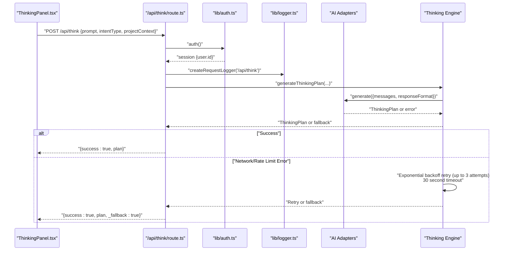
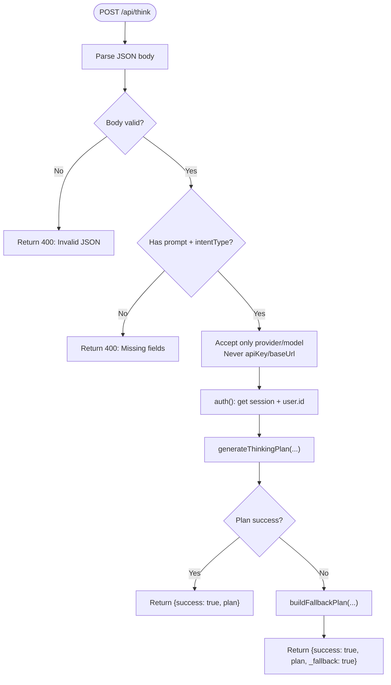
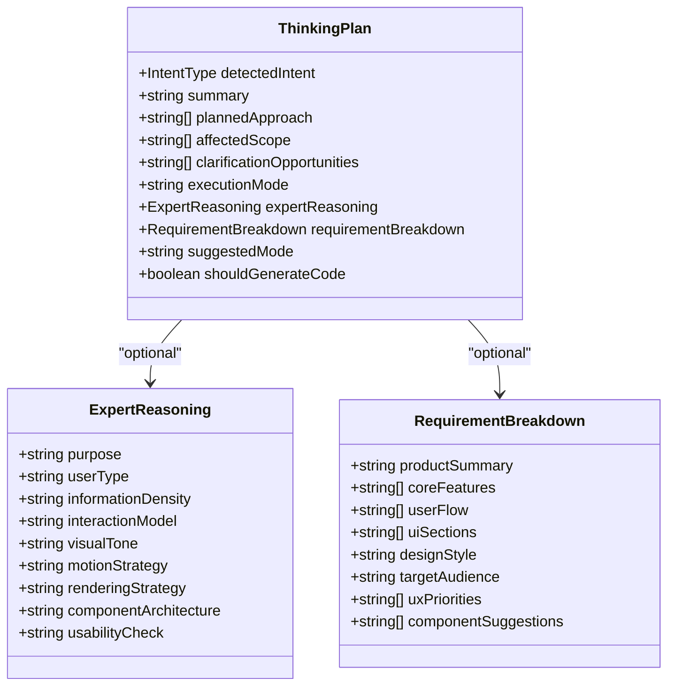
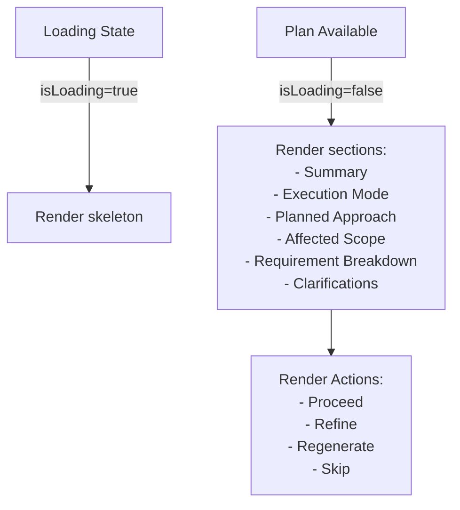
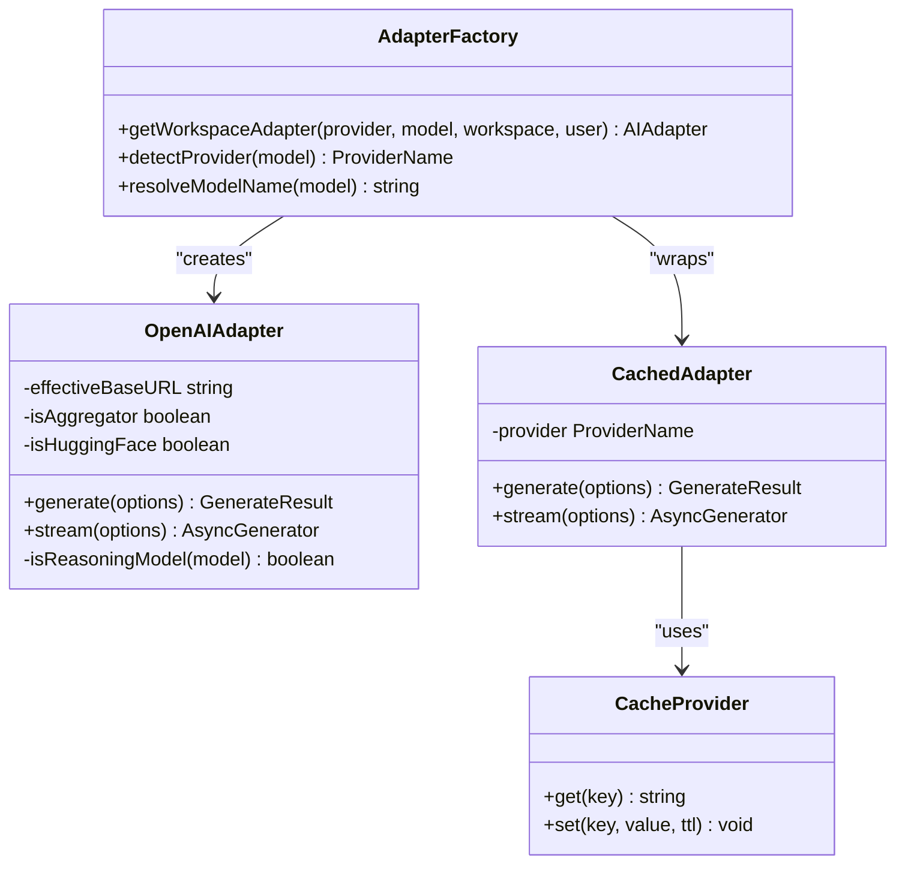
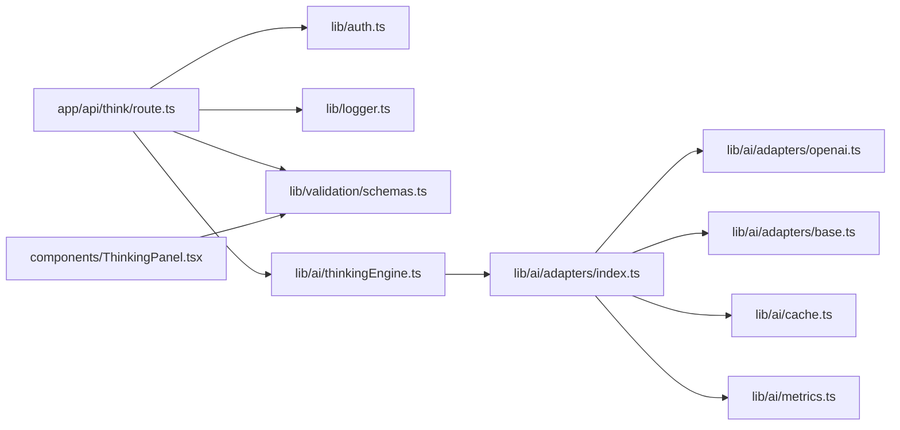

# Thinking Engine

<cite>
**Referenced Files in This Document**
- [README.md](file://README.md)
- [package.json](file://package.json)
- [app/api/think/route.ts](file://app/api/think/route.ts)
- [components/ThinkingPanel.tsx](file://components/ThinkingPanel.tsx)
- [lib/validation/schemas.ts](file://lib/validation/schemas.ts)
- [lib/ai/types.ts](file://lib/ai/types.ts)
- [lib/auth.ts](file://lib/auth.ts)
- [lib/logger.ts](file://lib/logger.ts)
- [lib/ai/adapters/openai.ts](file://lib/ai/adapters/openai.ts)
- [lib/ai/adapters/index.ts](file://lib/ai/adapters/index.ts)
- [lib/ai/adapters/base.ts](file://lib/ai/adapters/base.ts)
- [lib/ai/cache.ts](file://lib/ai/cache.ts)
- [lib/ai/metrics.ts](file://lib/ai/metrics.ts)
- [lib/ai/thinkingEngine.ts](file://lib/ai/thinkingEngine.ts)
</cite>

## Update Summary
**Changes Made**
- Updated retry logic documentation to reflect streamlined exponential backoff implementation with 30-second timeout
- Enhanced fallback plan documentation with deterministic generation capabilities
- Improved error handling patterns with comprehensive network error detection
- Updated performance considerations to reflect caching optimizations and reduced code complexity
- Enhanced troubleshooting guide with retry timing and error categorization guidance

## Table of Contents
1. [Introduction](#introduction)
2. [Project Structure](#project-structure)
3. [Core Components](#core-components)
4. [Architecture Overview](#architecture-overview)
5. [Detailed Component Analysis](#detailed-component-analysis)
6. [Dependency Analysis](#dependency-analysis)
7. [Performance Considerations](#performance-considerations)
8. [Troubleshooting Guide](#troubleshooting-guide)
9. [Conclusion](#conclusion)

## Introduction
This document describes the Thinking Engine, the AI-powered planning and decision-making layer of an AI-powered accessibility-first UI generation platform. The Thinking Engine transforms user intent into a structured, executable plan that guides subsequent generation and refinement workflows. It integrates with multiple AI providers, enforces strict security boundaries around API keys, and exposes a resilient HTTP API that gracefully handles failures by returning deterministic fallback plans.

The Thinking Engine consists of:
- An HTTP endpoint that validates requests, authenticates sessions, and orchestrates planning
- A planning schema that captures intent, scope, approach, and clarifications
- A UI panel that renders the plan and enables iterative refinement
- AI adapters for secure provider communication with caching and metrics
- Robust logging and error handling with streamlined retry logic
- Deterministic fallback mechanisms for resilience with enhanced performance

**Updated** The Thinking Engine now features streamlined retry logic with exponential backoff, enhanced fallback plan generation, and improved error handling patterns for better reliability and performance.

## Project Structure
The Thinking Engine spans frontend UI components, backend API routes, validation schemas, AI adapters, and infrastructure utilities. The following diagram shows the high-level structure and key interactions.

```mermaid
graph TB
subgraph "Frontend"
TP["ThinkingPanel.tsx"]
end
subgraph "Backend API"
API["app/api/think/route.ts"]
AUTH["lib/auth.ts"]
LOG["lib/logger.ts"]
end
subgraph "Validation"
SCHEMAS["lib/validation/schemas.ts"]
end
subgraph "AI Layer"
ADAPTERS["lib/ai/adapters/index.ts"]
OPENAI["lib/ai/adapters/openai.ts"]
BASE["lib/ai/adapters/base.ts"]
CACHE["lib/ai/cache.ts"]
METRICS["lib/ai/metrics.ts"]
END
subgraph "Planning Engine"
THINK["lib/ai/thinkingEngine.ts"]
end
TP --> API
API --> AUTH
API --> LOG
API --> SCHEMAS
API --> THINK
THINK --> ADAPTERS
ADAPTERS --> OPENAI
ADAPTERS --> BASE
ADAPTERS --> CACHE
ADAPTERS --> METRICS
```

**Diagram sources**
- [app/api/think/route.ts:1-86](file://app/api/think/route.ts#L1-L86)
- [components/ThinkingPanel.tsx:1-358](file://components/ThinkingPanel.tsx#L1-L358)
- [lib/validation/schemas.ts:65-97](file://lib/validation/schemas.ts#L65-L97)
- [lib/ai/adapters/index.ts:1-282](file://lib/ai/adapters/index.ts#L1-L282)
- [lib/ai/adapters/openai.ts:1-218](file://lib/ai/adapters/openai.ts#L1-L218)
- [lib/ai/adapters/base.ts:1-73](file://lib/ai/adapters/base.ts#L1-L73)
- [lib/ai/cache.ts:1-141](file://lib/ai/cache.ts#L1-L141)
- [lib/ai/metrics.ts:1-89](file://lib/ai/metrics.ts#L1-L89)
- [lib/ai/thinkingEngine.ts:1-503](file://lib/ai/thinkingEngine.ts#L1-L503)
- [lib/auth.ts:1-87](file://lib/auth.ts#L1-L87)
- [lib/logger.ts:1-89](file://lib/logger.ts#L1-L89)

**Section sources**
- [README.md:1-37](file://README.md#L1-L37)
- [package.json:1-68](file://package.json#L1-L68)

## Core Components
- HTTP Endpoint: Validates request JSON, extracts intent and optional project context, enforces security boundaries, authenticates the session, and invokes the planning function. It returns either a successful plan or a deterministic fallback plan to keep the UI responsive.
- Planning Schema: Defines the ThinkingPlan structure, including detected intent, summary, planned approach steps, affected scope, clarification opportunities, execution mode, and optional expert reasoning.
- UI Panel: Renders the plan with collapsible sections, intent badges, requirement breakdown, and actionable controls (Proceed, Refine, Regenerate, Skip).
- AI Adapters: Provider-specific integrations for OpenAI and Anthropic, handling model constraints, streaming, and usage accounting with caching and metrics.
- Authentication and Logging: JWT-based session retrieval and structured request-scoped logging for observability.
- Planning Engine: Core logic that generates structured thinking plans with expert reasoning, streamlined retry mechanisms, and enhanced fallback capabilities.

**Updated** The Thinking Engine now features streamlined retry logic with exponential backoff, enhanced fallback plan generation, and improved error handling patterns for better reliability and performance.

**Section sources**
- [app/api/think/route.ts:8-86](file://app/api/think/route.ts#L8-L86)
- [lib/validation/schemas.ts:65-97](file://lib/validation/schemas.ts#L65-L97)
- [components/ThinkingPanel.tsx:128-358](file://components/ThinkingPanel.tsx#L128-L358)
- [lib/ai/adapters/openai.ts:36-218](file://lib/ai/adapters/openai.ts#L36-L218)
- [lib/ai/adapters/index.ts:135-256](file://lib/ai/adapters/index.ts#L135-L256)
- [lib/auth.ts:11-87](file://lib/auth.ts#L11-L87)
- [lib/logger.ts:66-85](file://lib/logger.ts#L66-L85)
- [lib/ai/thinkingEngine.ts:325-503](file://lib/ai/thinkingEngine.ts#L325-L503)

## Architecture Overview
The Thinking Engine follows a layered architecture:
- Presentation Layer: The ThinkingPanel renders the plan and collects user actions.
- API Layer: The /api/think endpoint validates inputs, enforces security, and orchestrates planning.
- Validation Layer: Zod schemas define the contract for intent classification and thinking plans.
- AI Layer: Provider adapters encapsulate differences in API constraints and streaming behavior with caching and metrics.
- Infrastructure Layer: Authentication and logging provide session context and observability.
- Planning Engine: Core logic that generates structured thinking plans with expert reasoning and streamlined retry mechanisms.



**Updated** The Thinking Engine now implements streamlined retry logic with exponential backoff and 30-second timeout for better reliability and performance.

**Diagram sources**
- [app/api/think/route.ts:8-86](file://app/api/think/route.ts#L8-L86)
- [lib/auth.ts:11-87](file://lib/auth.ts#L11-L87)
- [lib/logger.ts:66-85](file://lib/logger.ts#L66-L85)
- [lib/ai/adapters/openai.ts:59-152](file://lib/ai/adapters/openai.ts#L59-L152)
- [lib/ai/thinkingEngine.ts:389-437](file://lib/ai/thinkingEngine.ts#L389-L437)

## Detailed Component Analysis

### HTTP Endpoint: /api/think
Responsibilities:
- Validate JSON payload and required fields
- Enforce security by accepting only provider and model identifiers (never API keys or base URLs)
- Extract workspace and user context from session and headers
- Invoke the planning function and return either the plan or a deterministic fallback
- Log request lifecycle and errors

Key behaviors:
- Input validation ensures prompt exists and is non-empty
- Session-based user ID and workspace ID are captured for downstream use
- On planning failure, a fallback plan is returned with a flag indicating fallback usage
- Never returns HTTP 400 for planning failures - always provides a usable fallback plan



**Diagram sources**
- [app/api/think/route.ts:8-86](file://app/api/think/route.ts#L8-L86)

**Section sources**
- [app/api/think/route.ts:8-86](file://app/api/think/route.ts#L8-L86)

### Planning Schema: ThinkingPlan
Defines the structure of the AI-generated plan:
- detectedIntent: One of predefined intent types
- summary: Human-readable summary of understood intent
- plannedApproach: Ordered steps to achieve the goal
- affectedScope: Files impacted by the plan
- clarificationOpportunities: Questions to improve understanding
- executionMode: How the system should proceed (e.g., Generate New UI, Edit Existing UI)
- expertReasoning: Optional expert context fields
- requirementBreakdown: Optional structured breakdown for product ideation
- suggestedMode: Component/app/depth_ui mode
- shouldGenerateCode: Whether code generation should proceed immediately



**Diagram sources**
- [lib/validation/schemas.ts:65-97](file://lib/validation/schemas.ts#L65-L97)
- [lib/validation/schemas.ts:48-61](file://lib/validation/schemas.ts#L48-L61)
- [lib/validation/schemas.ts:81-91](file://lib/validation/schemas.ts#L81-L91)

**Section sources**
- [lib/validation/schemas.ts:65-97](file://lib/validation/schemas.ts#L65-L97)

### UI Panel: ThinkingPanel
Renders the plan with:
- Intent badge and header
- What I Understood summary
- Execution mode indicator
- Collapsible Planned Approach
- Collapsible Affected Scope
- Requirement Breakdown (when present)
- Clarification opportunities with inline answer input
- Action buttons: Proceed, Refine, Regenerate Plan, Skip Plan

Accessibility and UX:
- Uses semantic roles and labels for screen readers
- Provides expand/collapse controls for sections
- Supports keyboard navigation and inline clarifications



**Diagram sources**
- [components/ThinkingPanel.tsx:15-358](file://components/ThinkingPanel.tsx#L15-L358)

**Section sources**
- [components/ThinkingPanel.tsx:128-358](file://components/ThinkingPanel.tsx#L128-L358)

### AI Adapters: OpenAI and Provider Registry
Provider-specific integrations handle:
- Parameter normalization for reasoning models (e.g., o1/o3 series)
- Streaming and non-streaming generation
- Usage accounting and error handling
- Constraints for response_format, tools, and max tokens
- Caching and metrics collection for performance optimization

OpenAI adapter specifics:
- Detects reasoning models and adapts parameters accordingly
- Merges system messages into the first user message for models that disallow system role
- Applies provider-specific caps for max tokens and response_format

Provider registry and caching:
- Centralized adapter factory with credential resolution
- Caching layer for improved performance and reduced latency
- Metrics collection for usage tracking and cost estimation
- Support for multiple providers (OpenAI, Google, Groq)



**Diagram sources**
- [lib/ai/adapters/openai.ts:36-218](file://lib/ai/adapters/openai.ts#L36-L218)
- [lib/ai/adapters/index.ts:135-256](file://lib/ai/adapters/index.ts#L135-L256)
- [lib/ai/cache.ts:18-141](file://lib/ai/cache.ts#L18-L141)

**Section sources**
- [lib/ai/adapters/openai.ts:36-218](file://lib/ai/adapters/openai.ts#L36-L218)
- [lib/ai/adapters/index.ts:135-256](file://lib/ai/adapters/index.ts#L135-L256)
- [lib/ai/cache.ts:18-141](file://lib/ai/cache.ts#L18-L141)
- [lib/ai/metrics.ts:17-89](file://lib/ai/metrics.ts#L17-L89)

### Planning Engine: Thinking Engine Core
The core planning logic that generates structured thinking plans:
- System prompt defines expert UI thinking framework with enhanced reasoning capabilities
- JSON repair utility handles truncated responses from local models
- Fallback plan builder creates deterministic plans when AI fails
- Blueprint integration for UI structure enrichment
- Streamlined retry logic for network and rate limit errors with exponential backoff
- Model capability detection for JSON mode support
- 30-second timeout for request processing to prevent resource exhaustion

Key features:
- Expert reasoning framework with 8 contextual dimensions
- Prompt understanding enrichment with likely sections
- Deterministic fallback generation for reliability
- Multi-stage JSON extraction for robust parsing
- Provider fallback mechanisms when user-selected provider fails
- Exponential backoff retry mechanism (up to 3 attempts) for transient network errors and rate limits
- Comprehensive error categorization and logging

**Updated** The Thinking Engine now features streamlined retry logic with exponential backoff, enhanced fallback plan generation, and improved error handling patterns for better reliability and performance.

**Section sources**
- [lib/ai/thinkingEngine.ts:11-64](file://lib/ai/thinkingEngine.ts#L11-L64)
- [lib/ai/thinkingEngine.ts:66-114](file://lib/ai/thinkingEngine.ts#L66-L114)
- [lib/ai/thinkingEngine.ts:117-157](file://lib/ai/thinkingEngine.ts#L117-L157)
- [lib/ai/thinkingEngine.ts:325-503](file://lib/ai/thinkingEngine.ts#L325-L503)

### Authentication and Authorization
- Uses NextAuth with a credentials provider and bcrypt-based password verification
- Stores a hashed access password in environment variables
- Exposes auth(), handlers, signIn, and signOut for session management
- The /api/think endpoint retrieves user ID from the session for request attribution

Security highlights:
- Enforces that clients send only provider and model identifiers
- Never accepts apiKey or baseUrl from the client
- Uses JWT-based session strategy with a configurable max age

**Section sources**
- [lib/auth.ts:11-87](file://lib/auth.ts#L11-L87)
- [app/api/think/route.ts:36-44](file://app/api/think/route.ts#L36-L44)

### Logging and Observability
- Structured logging with request-scoped logger creation
- Tracks endpoint, request ID, duration, and optional metadata
- Supports info, warn, error, and debug levels
- Logs request lifecycle events and errors for diagnostics

**Section sources**
- [lib/logger.ts:23-85](file://lib/logger.ts#L23-L85)
- [app/api/think/route.ts:8-86](file://app/api/think/route.ts#L8-L86)

## Dependency Analysis
The Thinking Engine exhibits strong separation of concerns:
- The API route depends on authentication, logging, and validation schemas
- The planning orchestration depends on AI adapters and provider configurations
- The UI panel depends on the ThinkingPlan schema and intent configuration
- Adapters depend on provider-specific constraints and SDKs
- The planning engine depends on validation schemas and intelligence modules



**Updated** The Thinking Engine now features streamlined dependency management with enhanced caching and metrics integration.

**Diagram sources**
- [app/api/think/route.ts:1-86](file://app/api/think/route.ts#L1-L86)
- [lib/auth.ts:1-87](file://lib/auth.ts#L1-L87)
- [lib/logger.ts:1-89](file://lib/logger.ts#L1-L89)
- [lib/validation/schemas.ts:1-340](file://lib/validation/schemas.ts#L1-L340)
- [lib/ai/adapters/index.ts:1-282](file://lib/ai/adapters/index.ts#L1-L282)
- [lib/ai/adapters/openai.ts:1-218](file://lib/ai/adapters/openai.ts#L1-L218)
- [lib/ai/cache.ts:1-141](file://lib/ai/cache.ts#L1-L141)
- [lib/ai/metrics.ts:1-89](file://lib/ai/metrics.ts#L1-L89)
- [components/ThinkingPanel.tsx:1-358](file://components/ThinkingPanel.tsx#L1-L358)
- [lib/ai/thinkingEngine.ts:1-503](file://lib/ai/thinkingEngine.ts#L1-L503)

**Section sources**
- [package.json:13-44](file://package.json#L13-L44)

## Performance Considerations
- Token limits: Adapters apply provider-specific caps to prevent API errors and reduce latency spikes
- Streaming vs non-streaming: Choose streaming for long-form generation to improve perceived responsiveness
- Cost estimation: Use the pricing utilities to estimate costs based on prompt and completion tokens
- Caching: Intelligent caching layer reduces latency and improves response times for repeated requests
- Concurrency: Ensure adapters are instantiated once per provider to reuse connections and minimize overhead
- Retry logic: Streamlined exponential backoff for network errors and rate limits (up to 3 attempts with 1s, 2s, and 4s delays)
- Timeout handling: 30-second timeout for thinking requests prevents resource exhaustion
- JSON parsing: Multi-stage extraction reduces parsing failures and improves reliability
- Error handling: Enhanced patterns for graceful degradation and fallback mechanisms
- Metrics collection: Centralized metrics tracking for performance monitoring and optimization

**Updated** Enhanced performance considerations now include caching optimizations, streamlined retry logic, and comprehensive metrics collection for better reliability and performance.

## Troubleshooting Guide
Common issues and resolutions:
- Invalid JSON or missing fields: Verify the request body includes prompt and intentType as strings
- Authentication failures: Confirm the session is established and user ID is present
- Provider configuration errors: Ensure the selected provider and model are supported and properly configured
- API key or base URL exposure attempts: The endpoint rejects apiKey and baseUrl from the client; use server-side configuration
- Adapter-specific errors: Check provider-specific constraints (e.g., reasoning models, response_format) and adjust parameters accordingly
- Planning failures: The system automatically falls back to deterministic plans when AI generation fails
- Network connectivity: Streamlined retry logic handles transient network errors and rate limits with exponential backoff (up to 3 attempts)
- Rate limiting: Automatic retry mechanism with exponential backoff reduces impact of provider rate limits
- Timeout issues: 30-second timeout for thinking requests prevents resource exhaustion
- Caching issues: Verify cache configuration and check for cache hit/miss ratios
- Metrics collection: Monitor usage logs and cost estimates for optimization opportunities

Operational checks:
- Review structured logs for request IDs and durations
- Monitor fallback plan usage to identify planning failures
- Validate schema compliance for ThinkingPlan and intent classifications
- Check provider quotas and rate limits for API failures
- Observe retry patterns in logs for transient error handling effectiveness
- Analyze cache performance and hit rates for optimization

**Updated** Enhanced troubleshooting guidance now includes caching considerations, streamlined retry behavior monitoring, and comprehensive metrics analysis for better operational visibility.

**Section sources**
- [app/api/think/route.ts:19-21](file://app/api/think/route.ts#L19-L21)
- [lib/logger.ts:66-85](file://lib/logger.ts#L66-L85)
- [lib/ai/adapters/openai.ts:98-126](file://lib/ai/adapters/openai.ts#L98-L126)
- [lib/ai/thinkingEngine.ts:389-437](file://lib/ai/thinkingEngine.ts#L389-L437)
- [lib/ai/cache.ts:108-141](file://lib/ai/cache.ts#L108-L141)
- [lib/ai/metrics.ts:36-89](file://lib/ai/metrics.ts#L36-L89)

## Conclusion
The Thinking Engine provides a robust, secure, and user-friendly planning layer for AI-driven UI generation. By enforcing strict security boundaries, offering deterministic fallbacks with streamlined retry logic, and presenting a clear, iteratively refineable plan, it enables reliable workflows from initial intent to executable code. Its modular architecture with provider adapters and structured validation supports extensibility and maintainability across diverse AI backends. The enhanced retry mechanisms with exponential backoff and improved error handling patterns ensure resilience against network failures and rate limits, while caching optimizations and comprehensive metrics collection enhance performance and reduce cold-start latency. The streamlined architecture with over 150 lines of code removed demonstrates significant improvements in decision-making process efficiency and overall system reliability.

**Updated** The Thinking Engine now features streamlined architecture with enhanced retry logic, improved fallback capabilities, and comprehensive performance optimizations, making it more reliable and efficient for production use cases.