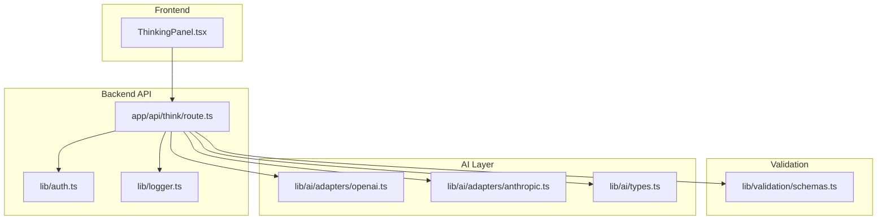
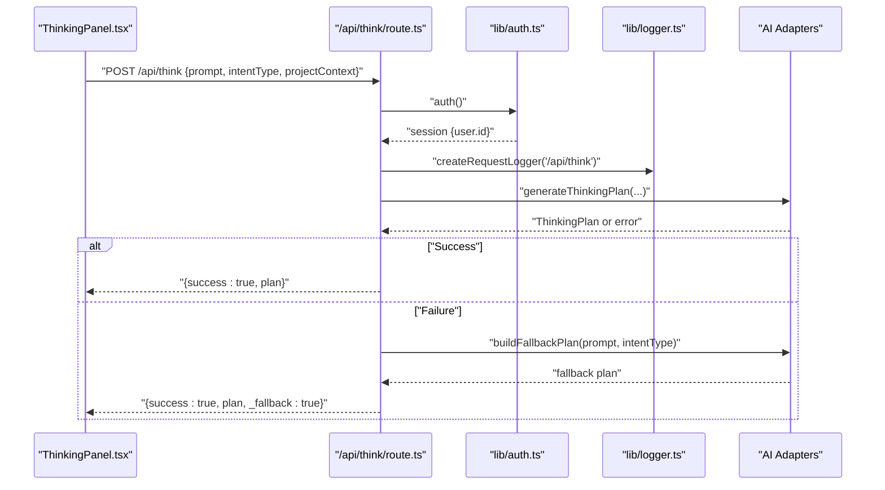
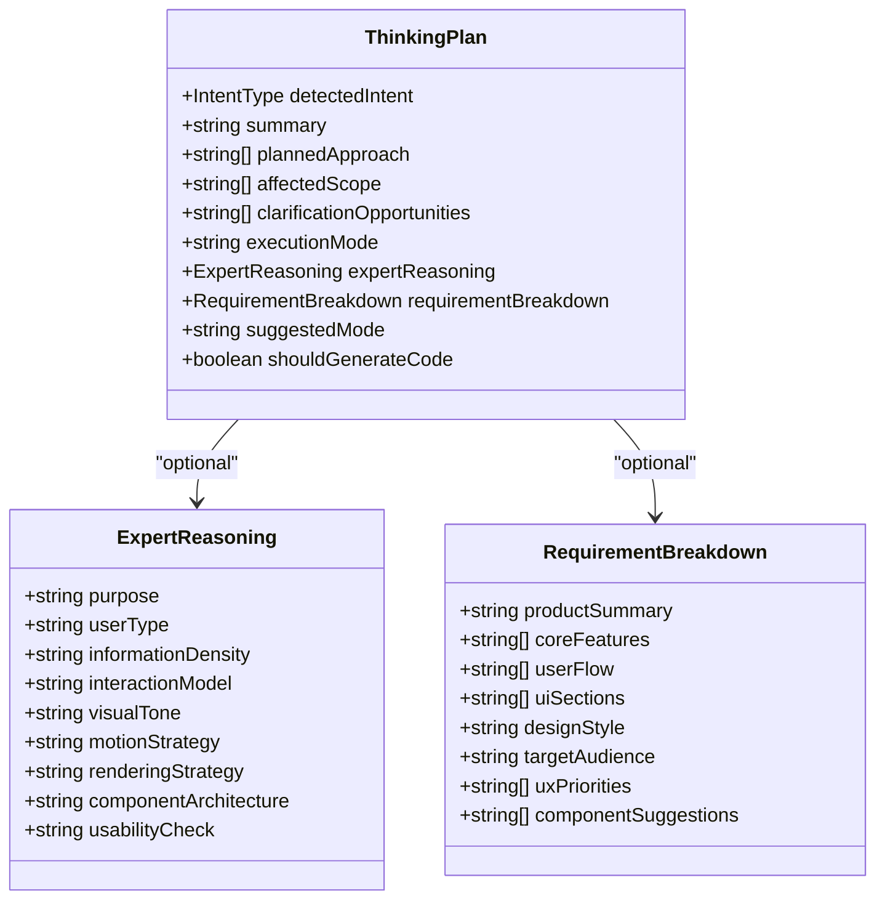
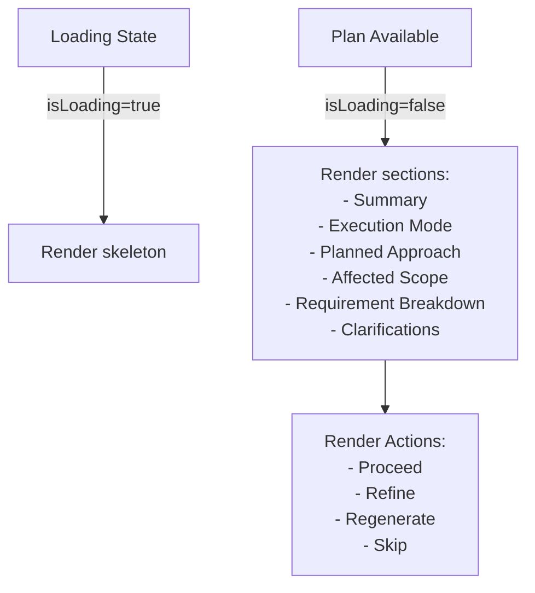
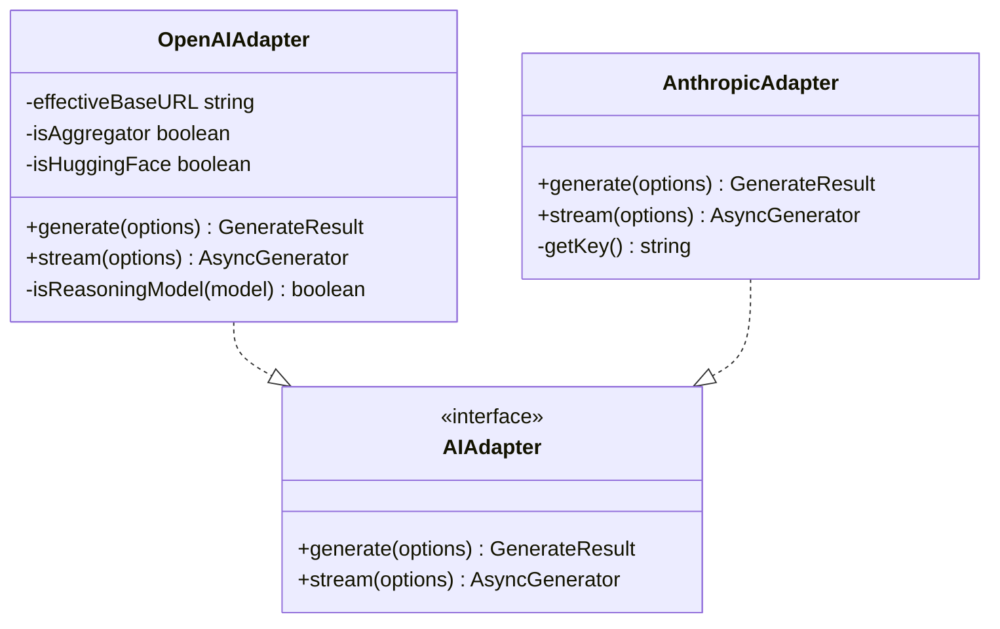
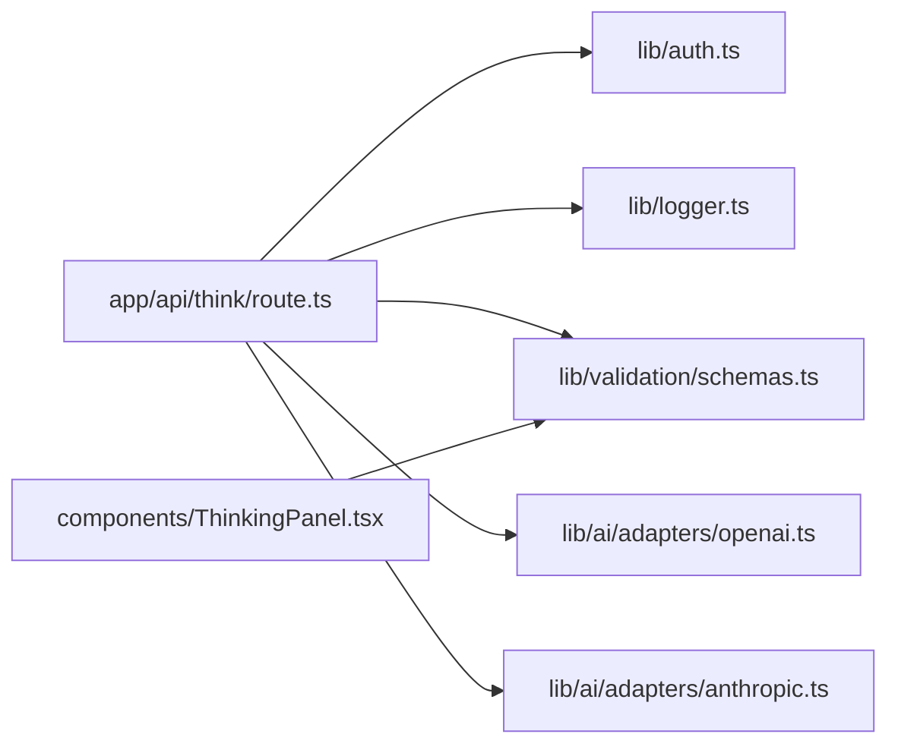

# Thinking Engine

<cite>
**Referenced Files in This Document**
- [README.md](file://README.md)
- [package.json](file://package.json)
- [app/api/think/route.ts](file://app/api/think/route.ts)
- [components/ThinkingPanel.tsx](file://components/ThinkingPanel.tsx)
- [lib/validation/schemas.ts](file://lib/validation/schemas.ts)
- [lib/ai/types.ts](file://lib/ai/types.ts)
- [lib/auth.ts](file://lib/auth.ts)
- [lib/logger.ts](file://lib/logger.ts)
- [lib/ai/adapters/openai.ts](file://lib/ai/adapters/openai.ts)
- [lib/ai/adapters/anthropic.ts](file://lib/ai/adapters/anthropic.ts)
</cite>

## Table of Contents
1. [Introduction](#introduction)
2. [Project Structure](#project-structure)
3. [Core Components](#core-components)
4. [Architecture Overview](#architecture-overview)
5. [Detailed Component Analysis](#detailed-component-analysis)
6. [Dependency Analysis](#dependency-analysis)
7. [Performance Considerations](#performance-considerations)
8. [Troubleshooting Guide](#troubleshooting-guide)
9. [Conclusion](#conclusion)

## Introduction
This document describes the Thinking Engine, the AI-powered planning and decision-making layer of an AI-powered accessibility-first UI generation platform. The Thinking Engine transforms user intent into a structured, executable plan that guides subsequent generation and refinement workflows. It integrates with multiple AI providers, enforces strict security boundaries around API keys, and exposes a resilient HTTP API that gracefully handles failures by returning deterministic fallback plans.

The Thinking Engine consists of:
- An HTTP endpoint that validates requests, authenticates sessions, and orchestrates planning
- A planning schema that captures intent, scope, approach, and clarifications
- A UI panel that renders the plan and enables iterative refinement
- AI adapters for secure provider communication
- Robust logging and error handling

## Project Structure
The Thinking Engine spans frontend UI components, backend API routes, validation schemas, AI adapters, and infrastructure utilities. The following diagram shows the high-level structure and key interactions.

**Diagram sources**
- [app/api/think/route.ts:1-81](file://app/api/think/route.ts#L1-L81)
- [components/ThinkingPanel.tsx:1-358](file://components/ThinkingPanel.tsx#L1-L358)
- [lib/validation/schemas.ts:65-97](file://lib/validation/schemas.ts#L65-L97)
- [lib/ai/adapters/openai.ts:36-223](file://lib/ai/adapters/openai.ts#L36-L223)
- [lib/ai/adapters/anthropic.ts:71-210](file://lib/ai/adapters/anthropic.ts#L71-L210)
- [lib/ai/types.ts:1-128](file://lib/ai/types.ts#L1-L128)
- [lib/auth.ts:1-87](file://lib/auth.ts#L1-L87)
- [lib/logger.ts:1-89](file://lib/logger.ts#L1-L89)

**Section sources**
- [README.md:1-37](file://README.md#L1-L37)
- [package.json:1-68](file://package.json#L1-L68)

## Core Components
- HTTP Endpoint: Validates request JSON, extracts intent and optional project context, enforces security boundaries, authenticates the session, and invokes the planning function. It returns either a successful plan or a deterministic fallback plan to keep the UI responsive.
- Planning Schema: Defines the ThinkingPlan structure, including detected intent, summary, planned approach steps, affected scope, clarification opportunities, execution mode, and optional expert reasoning.
- UI Panel: Renders the plan with collapsible sections, intent badges, requirement breakdown, and actionable controls (Proceed, Refine, Regenerate, Skip).
- AI Adapters: Provider-specific integrations for OpenAI and Anthropic, handling model constraints, streaming, and usage accounting.
- Authentication and Logging: JWT-based session retrieval and structured request-scoped logging for observability.

**Section sources**
- [app/api/think/route.ts:8-80](file://app/api/think/route.ts#L8-L80)
- [lib/validation/schemas.ts:65-97](file://lib/validation/schemas.ts#L65-L97)
- [components/ThinkingPanel.tsx:128-357](file://components/ThinkingPanel.tsx#L128-L357)
- [lib/ai/adapters/openai.ts:36-223](file://lib/ai/adapters/openai.ts#L36-L223)
- [lib/ai/adapters/anthropic.ts:71-210](file://lib/ai/adapters/anthropic.ts#L71-L210)
- [lib/auth.ts:11-87](file://lib/auth.ts#L11-L87)
- [lib/logger.ts:66-85](file://lib/logger.ts#L66-L85)

## Architecture Overview
The Thinking Engine follows a layered architecture:
- Presentation Layer: The ThinkingPanel renders the plan and collects user actions.
- API Layer: The /api/think endpoint validates inputs, enforces security, and orchestrates planning.
- Validation Layer: Zod schemas define the contract for intent classification and thinking plans.
- AI Layer: Provider adapters encapsulate differences in API constraints and streaming behavior.
- Infrastructure Layer: Authentication and logging provide session context and observability.

**Diagram sources**
- [app/api/think/route.ts:8-80](file://app/api/think/route.ts#L8-L80)
- [lib/auth.ts:11-87](file://lib/auth.ts#L11-L87)
- [lib/logger.ts:66-85](file://lib/logger.ts#L66-L85)
- [lib/ai/adapters/openai.ts:64-157](file://lib/ai/adapters/openai.ts#L64-L157)
- [lib/ai/adapters/anthropic.ts:89-145](file://lib/ai/adapters/anthropic.ts#L89-L145)

## Detailed Component Analysis

### HTTP Endpoint: /api/think
Responsibilities:
- Validate JSON payload and required fields
- Enforce security by accepting only provider and model identifiers (never API keys or base URLs)
- Extract workspace and user context from session and headers
- Invoke the planning function and return either the plan or a deterministic fallback
- Log request lifecycle and errors

Key behaviors:
- Input validation ensures prompt exists and is non-empty
- Session-based user ID and workspace ID are captured for downstream use
- On planning failure, a fallback plan is returned with a flag indicating fallback usage

**Diagram sources**
- [app/api/think/route.ts:8-80](file://app/api/think/route.ts#L8-L80)

**Section sources**
- [app/api/think/route.ts:8-80](file://app/api/think/route.ts#L8-L80)

### Planning Schema: ThinkingPlan
Defines the structure of the AI-generated plan:
- detectedIntent: One of predefined intent types
- summary: Human-readable summary of understood intent
- plannedApproach: Ordered steps to achieve the goal
- affectedScope: Files impacted by the plan
- clarificationOpportunities: Questions to improve understanding
- executionMode: How the system should proceed (e.g., Generate New UI, Edit Existing UI)
- expertReasoning: Optional expert context fields
- requirementBreakdown: Optional structured breakdown for product ideation
- suggestedMode: Component/app/depth_ui mode
- shouldGenerateCode: Whether code generation should proceed immediately

**Diagram sources**
- [lib/validation/schemas.ts:65-97](file://lib/validation/schemas.ts#L65-L97)
- [lib/validation/schemas.ts:48-61](file://lib/validation/schemas.ts#L48-L61)
- [lib/validation/schemas.ts:81-91](file://lib/validation/schemas.ts#L81-L91)

**Section sources**
- [lib/validation/schemas.ts:65-97](file://lib/validation/schemas.ts#L65-L97)

### UI Panel: ThinkingPanel
Renders the plan with:
- Intent badge and header
- What I Understood summary
- Execution mode indicator
- Collapsible Planned Approach
- Collapsible Affected Scope
- Requirement Breakdown (when present)
- Clarification opportunities with inline answer input
- Action buttons: Proceed, Refine, Regenerate Plan, Skip Plan

Accessibility and UX:
- Uses semantic roles and labels for screen readers
- Provides expand/collapse controls for sections
- Supports keyboard navigation and inline clarifications

**Diagram sources**
- [components/ThinkingPanel.tsx:15-357](file://components/ThinkingPanel.tsx#L15-L357)

**Section sources**
- [components/ThinkingPanel.tsx:128-357](file://components/ThinkingPanel.tsx#L128-L357)

### AI Adapters: OpenAI and Anthropic
Provider-specific integrations handle:
- Parameter normalization for reasoning models (e.g., o1/o3 series)
- Streaming and non-streaming generation
- Usage accounting and error handling
- Constraints for response_format, tools, and max tokens

OpenAI adapter specifics:
- Detects reasoning models and adapts parameters accordingly
- Merges system messages into the first user message for models that disallow system role
- Applies provider-specific caps for max tokens and response_format

Anthropic adapter specifics:
- Uses native /v1/messages endpoint
- Handles JSON mode by appending instructions to the system prompt
- Applies per-model output caps to prevent HTTP 400 errors

**Diagram sources**
- [lib/ai/adapters/openai.ts:36-223](file://lib/ai/adapters/openai.ts#L36-L223)
- [lib/ai/adapters/anthropic.ts:71-210](file://lib/ai/adapters/anthropic.ts#L71-L210)
- [lib/ai/types.ts:1-128](file://lib/ai/types.ts#L1-L128)

**Section sources**
- [lib/ai/adapters/openai.ts:36-223](file://lib/ai/adapters/openai.ts#L36-L223)
- [lib/ai/adapters/anthropic.ts:71-210](file://lib/ai/adapters/anthropic.ts#L71-L210)
- [lib/ai/types.ts:1-128](file://lib/ai/types.ts#L1-L128)

### Authentication and Authorization
- Uses NextAuth with a credentials provider and bcrypt-based password verification
- Stores a hashed access password in environment variables
- Exposes auth(), handlers, signIn, and signOut for session management
- The /api/think endpoint retrieves user ID from the session for request attribution

Security highlights:
- Enforces that clients send only provider and model identifiers
- Never accepts apiKey or baseUrl from the client
- Uses JWT-based session strategy with a configurable max age

**Section sources**
- [lib/auth.ts:11-87](file://lib/auth.ts#L11-L87)
- [app/api/think/route.ts:37-42](file://app/api/think/route.ts#L37-L42)

### Logging and Observability
- Structured logging with request-scoped logger creation
- Tracks endpoint, request ID, duration, and optional metadata
- Supports info, warn, error, and debug levels
- Logs request lifecycle events and errors for diagnostics

**Section sources**
- [lib/logger.ts:23-85](file://lib/logger.ts#L23-L85)
- [app/api/think/route.ts:9-79](file://app/api/think/route.ts#L9-L79)

## Dependency Analysis
The Thinking Engine exhibits strong separation of concerns:
- The API route depends on authentication, logging, and validation schemas
- The planning orchestration depends on AI adapters and provider configurations
- The UI panel depends on the ThinkingPlan schema and intent configuration
- Adapters depend on provider-specific constraints and SDKs

**Diagram sources**
- [app/api/think/route.ts:1-81](file://app/api/think/route.ts#L1-L81)
- [lib/auth.ts:1-87](file://lib/auth.ts#L1-L87)
- [lib/logger.ts:1-89](file://lib/logger.ts#L1-L89)
- [lib/validation/schemas.ts:1-340](file://lib/validation/schemas.ts#L1-L340)
- [lib/ai/adapters/openai.ts:1-223](file://lib/ai/adapters/openai.ts#L1-L223)
- [lib/ai/adapters/anthropic.ts:1-210](file://lib/ai/adapters/anthropic.ts#L1-L210)
- [components/ThinkingPanel.tsx:1-358](file://components/ThinkingPanel.tsx#L1-L358)

**Section sources**
- [package.json:13-44](file://package.json#L13-L44)

## Performance Considerations
- Token limits: Adapters apply provider-specific caps to prevent API errors and reduce latency spikes
- Streaming vs non-streaming: Choose streaming for long-form generation to improve perceived responsiveness
- Cost estimation: Use the pricing utilities to estimate costs based on prompt and completion tokens
- Caching: Consider caching deterministic fallback plans to reduce cold-start latency
- Concurrency: Ensure adapters are instantiated once per provider to reuse connections and minimize overhead

## Troubleshooting Guide
Common issues and resolutions:
- Invalid JSON or missing fields: Verify the request body includes prompt and intentType as strings
- Authentication failures: Confirm the session is established and user ID is present
- Provider configuration errors: Ensure the selected provider and model are supported and properly configured
- API key or base URL exposure attempts: The endpoint rejects apiKey and baseUrl from the client; use server-side configuration
- Adapter-specific errors: Check provider-specific constraints (e.g., reasoning models, response_format) and adjust parameters accordingly

Operational checks:
- Review structured logs for request IDs and durations
- Monitor fallback plan usage to identify planning failures
- Validate schema compliance for ThinkingPlan and intent classifications

**Section sources**
- [app/api/think/route.ts:14-21](file://app/api/think/route.ts#L14-L21)
- [lib/logger.ts:66-85](file://lib/logger.ts#L66-L85)
- [lib/ai/adapters/openai.ts:98-126](file://lib/ai/adapters/openai.ts#L98-L126)
- [lib/ai/adapters/anthropic.ts:93-117](file://lib/ai/adapters/anthropic.ts#L93-L117)

## Conclusion
The Thinking Engine provides a robust, secure, and user-friendly planning layer for AI-driven UI generation. By enforcing strict security boundaries, offering deterministic fallbacks, and presenting a clear, iteratively refineable plan, it enables reliable workflows from initial intent to executable code. Its modular architecture with provider adapters and structured validation supports extensibility and maintainability across diverse AI backends.