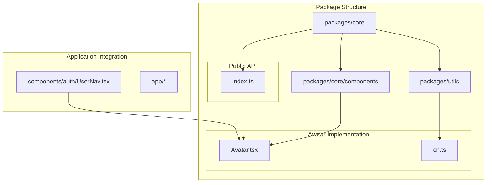
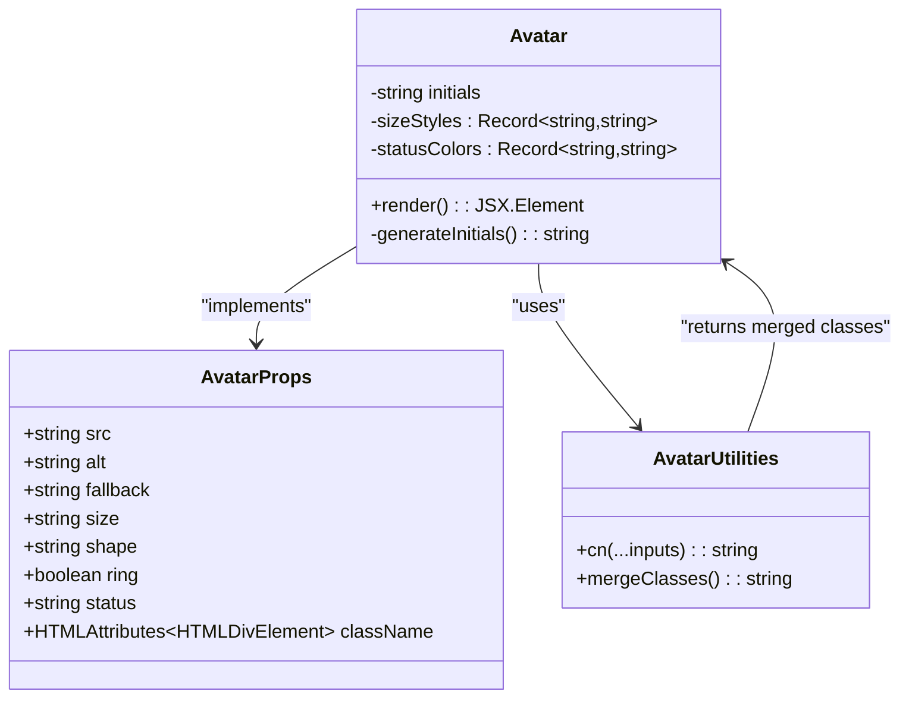
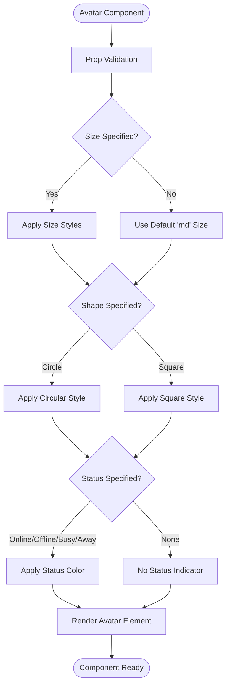
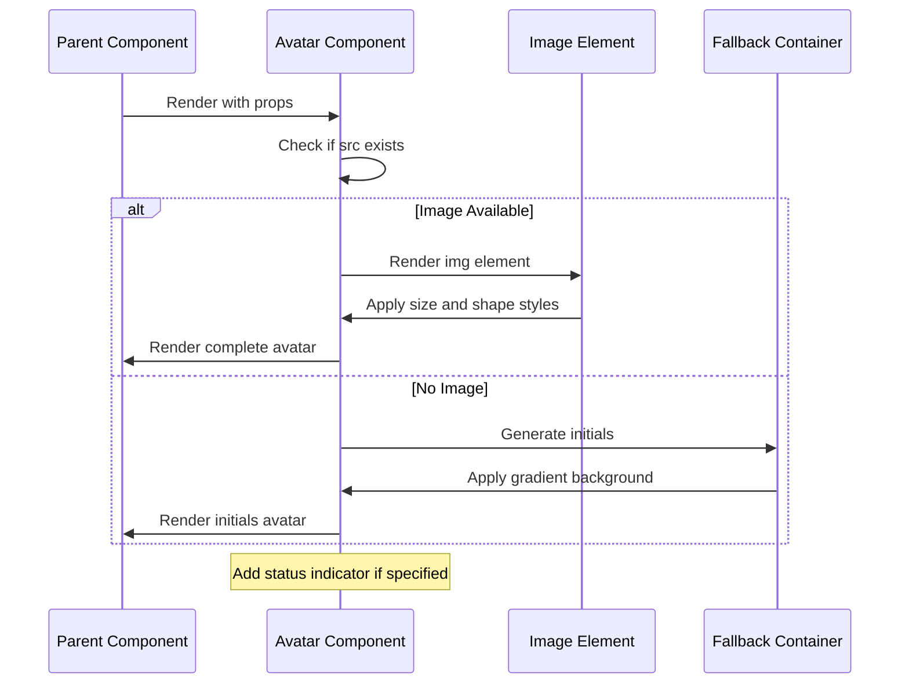
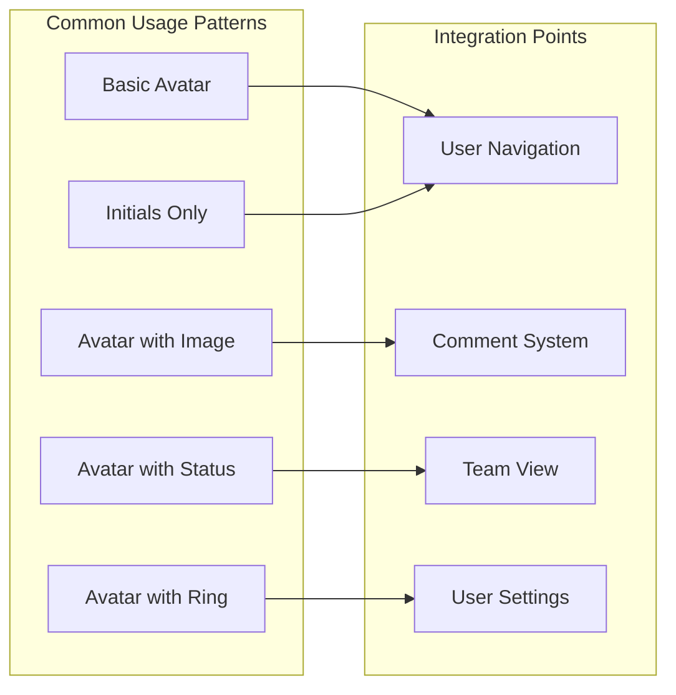
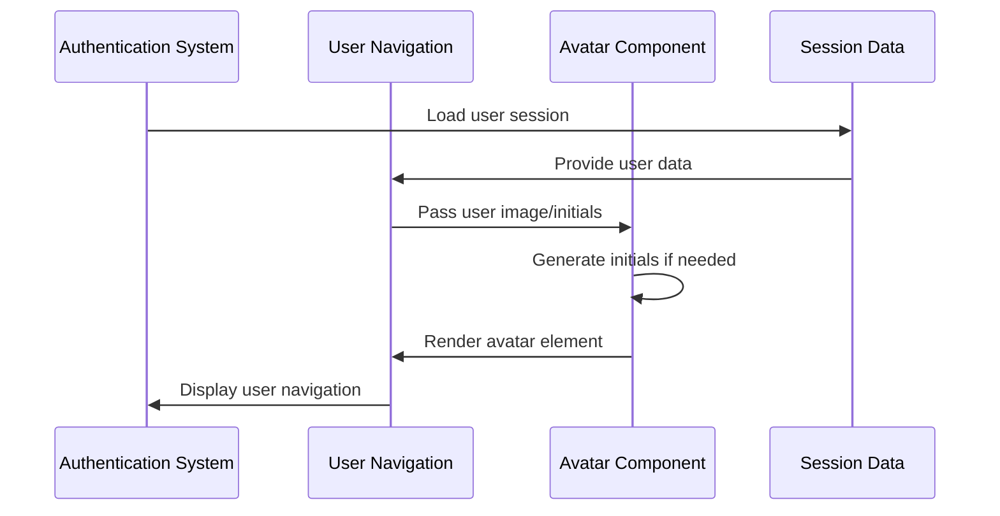
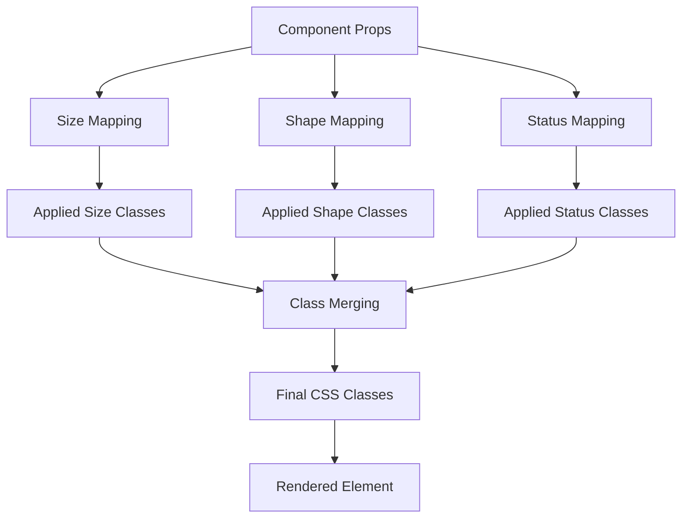
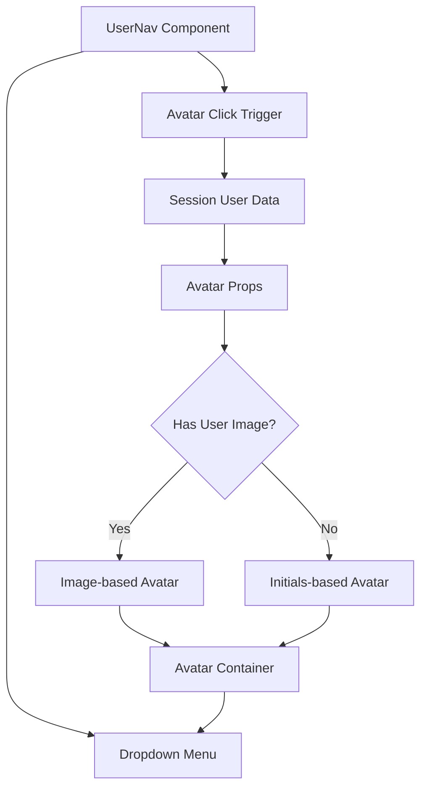
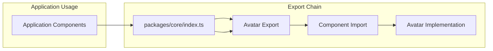

# Avatar Component

<cite>
**Referenced Files in This Document**
- [Avatar.tsx](file://packages/core/components/Avatar.tsx)
- [UserNav.tsx](file://components/auth/UserNav.tsx)
- [cn.ts](file://packages/utils/cn.ts)
- [index.ts](file://packages/core/index.ts)
- [package.json](file://package.json)
</cite>

## Table of Contents
1. [Introduction](#introduction)
2. [Project Structure](#project-structure)
3. [Core Components](#core-components)
4. [Architecture Overview](#architecture-overview)
5. [Detailed Component Analysis](#detailed-component-analysis)
6. [Usage Patterns](#usage-patterns)
7. [Accessibility Features](#accessibility-features)
8. [Styling and Theming](#styling-and-theming)
9. [Integration Examples](#integration-examples)
10. [Best Practices](#best-practices)
11. [Troubleshooting Guide](#troubleshooting-guide)
12. [Conclusion](#conclusion)

## Introduction

The Avatar Component is a reusable UI element designed to display user identities in the AI-powered accessibility-first UI engine. This component serves as a central piece of the application's identity system, providing consistent visual representation of users across different contexts while maintaining accessibility standards and responsive design principles.

The Avatar component is part of a comprehensive design system that emphasizes inclusivity, performance, and user experience. It supports multiple display modes, customizable sizing, and integrates seamlessly with the application's authentication system to provide dynamic user representation.

## Project Structure

The Avatar component is organized within a modular package structure that promotes reusability and maintainability:

**Diagram sources**
- [Avatar.tsx:1-72](file://packages/core/components/Avatar.tsx#L1-L72)
- [cn.ts:1-11](file://packages/utils/cn.ts#L1-L11)
- [index.ts:1-8](file://packages/core/index.ts#L1-L8)

**Section sources**
- [Avatar.tsx:1-72](file://packages/core/components/Avatar.tsx#L1-L72)
- [index.ts:1-8](file://packages/core/index.ts#L1-L8)

## Core Components

The Avatar component consists of several key elements that work together to provide comprehensive user identity representation:

### Primary Avatar Component
The main Avatar component handles image-based avatars with fallback initials when no image is available. It supports multiple sizing options, shapes, and status indicators.

### Utility Functions
The component leverages the `cn` utility function for intelligent class merging, ensuring proper Tailwind CSS class resolution and conflict handling.

### Public API Export
The component is exported through the core package's index file, making it accessible throughout the application.

**Section sources**
- [Avatar.tsx:1-72](file://packages/core/components/Avatar.tsx#L1-L72)
- [cn.ts:1-11](file://packages/utils/cn.ts#L1-L11)
- [index.ts:1-8](file://packages/core/index.ts#L1-L8)

## Architecture Overview

The Avatar component follows a component-based architecture that emphasizes separation of concerns and reusability:

**Diagram sources**
- [Avatar.tsx:4-12](file://packages/core/components/Avatar.tsx#L4-L12)
- [Avatar.tsx:29-71](file://packages/core/components/Avatar.tsx#L29-L71)
- [cn.ts:8-10](file://packages/utils/cn.ts#L8-L10)

The architecture ensures that the Avatar component remains focused on its primary responsibility while delegating class management to specialized utilities.

**Section sources**
- [Avatar.tsx:1-72](file://packages/core/components/Avatar.tsx#L1-L72)
- [cn.ts:1-11](file://packages/utils/cn.ts#L1-L11)

## Detailed Component Analysis

### Component Interface and Props

The Avatar component defines a comprehensive interface that supports various customization options:

**Diagram sources**
- [Avatar.tsx:4-12](file://packages/core/components/Avatar.tsx#L4-L12)
- [Avatar.tsx:14-27](file://packages/core/components/Avatar.tsx#L14-L27)

### Rendering Logic

The component implements conditional rendering based on the presence of user images:

**Diagram sources**
- [Avatar.tsx:32-69](file://packages/core/components/Avatar.tsx#L32-L69)

**Section sources**
- [Avatar.tsx:1-72](file://packages/core/components/Avatar.tsx#L1-L72)

### Styling System

The Avatar component utilizes a sophisticated styling system that combines Tailwind CSS utilities with custom logic:

| Size Variant | Dimensions | Typography |
|--------------|------------|------------|
| `xs` | 24px × 24px | 12px text |
| `sm` | 32px × 32px | 14px text |
| `md` | 40px × 40px | 14px text |
| `lg` | 48px × 48px | 16px text |
| `xl` | 64px × 64px | 18px text |

Status indicators use semantic color coding:
- Online: Emerald green (`bg-emerald-500`)
- Offline: Gray (`bg-gray-500`)
- Busy: Red (`bg-red-500`)
- Away: Amber (`bg-amber-500`)

**Section sources**
- [Avatar.tsx:14-27](file://packages/core/components/Avatar.tsx#L14-L27)

## Usage Patterns

### Basic Usage

The Avatar component can be used in various contexts throughout the application:

**Diagram sources**
- [UserNav.tsx:86-103](file://components/auth/UserNav.tsx#L86-L103)
- [Avatar.tsx:29-71](file://packages/core/components/Avatar.tsx#L29-L71)

### Authentication Integration

The Avatar component integrates seamlessly with the application's authentication system:

**Diagram sources**
- [UserNav.tsx:16-67](file://components/auth/UserNav.tsx#L16-L67)
- [Avatar.tsx:29-30](file://packages/core/components/Avatar.tsx#L29-L30)

**Section sources**
- [UserNav.tsx:1-265](file://components/auth/UserNav.tsx#L1-L265)

## Accessibility Features

The Avatar component incorporates several accessibility best practices:

### Semantic HTML Structure
- Proper `alt` attributes for screen readers
- ARIA labels for status indicators
- Semantic role assignment for image elements

### Color Contrast Compliance
- High contrast color schemes for initials
- Sufficient color contrast ratios for status indicators
- Accessible color choices following WCAG guidelines

### Responsive Design
- Fluid sizing that adapts to different screen sizes
- Flexible container layouts
- Mobile-first responsive approach

**Section sources**
- [Avatar.tsx:35-56](file://packages/core/components/Avatar.tsx#L35-L56)

## Styling and Theming

### Tailwind CSS Integration

The component leverages Tailwind CSS for consistent styling:

**Diagram sources**
- [Avatar.tsx:14-27](file://packages/core/components/Avatar.tsx#L14-L27)
- [Avatar.tsx:38-51](file://packages/core/components/Avatar.tsx#L38-L51)

### Theme Support

The component supports theming through:
- Gradient backgrounds for fallback avatars
- Consistent spacing and typography scales
- Adaptive color schemes for different contexts

**Section sources**
- [Avatar.tsx:47-51](file://packages/core/components/Avatar.tsx#L47-L51)

## Integration Examples

### User Navigation Integration

The Avatar component is prominently featured in the user navigation system:

**Diagram sources**
- [UserNav.tsx:69-126](file://components/auth/UserNav.tsx#L69-L126)
- [Avatar.tsx:29-71](file://packages/core/components/Avatar.tsx#L29-L71)

### Package Export System

The component is exposed through the core package's export system:

**Diagram sources**
- [index.ts:1-8](file://packages/core/index.ts#L1-L8)
- [Avatar.tsx:1-3](file://packages/core/components/Avatar.tsx#L1-L3)

**Section sources**
- [UserNav.tsx:1-265](file://components/auth/UserNav.tsx#L1-L265)
- [index.ts:1-8](file://packages/core/index.ts#L1-L8)

## Best Practices

### Performance Considerations

1. **Image Optimization**: When using image-based avatars, ensure proper image optimization and lazy loading
2. **Fallback Efficiency**: Initials generation is computationally lightweight
3. **CSS Class Merging**: Utilize the `cn` utility for efficient class merging

### Design Guidelines

1. **Consistent Sizing**: Maintain consistent avatar sizes across the application
2. **Color Accessibility**: Ensure sufficient color contrast for status indicators
3. **Responsive Behavior**: Test avatar behavior across different screen sizes

### Integration Patterns

1. **Centralized Usage**: Use the Avatar component consistently throughout the application
2. **Type Safety**: Leverage TypeScript interfaces for prop validation
3. **Accessibility First**: Always provide appropriate alt text and ARIA labels

## Troubleshooting Guide

### Common Issues and Solutions

| Issue | Symptoms | Solution |
|-------|----------|----------|
| Missing Image Fallback | Blank avatar area | Ensure `fallback` prop is provided or `alt` text contains valid name |
| Incorrect Sizing | Avatar appears too large/small | Verify `size` prop matches intended scale (`xs` to `xl`) |
| Status Indicator Not Visible | Status dot not showing | Check `status` prop value matches supported variants |
| Color Contrast Issues | Poor accessibility compliance | Use built-in color schemes or customize with accessible colors |

### Debugging Steps

1. **Verify Props**: Check that all required props are properly passed
2. **Inspect DOM**: Use browser developer tools to inspect rendered classes
3. **Test Responsiveness**: Verify behavior across different screen sizes
4. **Accessibility Audit**: Run accessibility tests to ensure compliance

**Section sources**
- [Avatar.tsx:29-71](file://packages/core/components/Avatar.tsx#L29-L71)

## Conclusion

The Avatar Component represents a well-designed, accessible, and flexible solution for user identity representation in the AI-powered accessibility-first UI engine. Its modular architecture, comprehensive feature set, and seamless integration capabilities make it an essential component of the application's design system.

The component successfully balances functionality with accessibility, performance with flexibility, and simplicity with extensibility. Its integration with the authentication system and broader application architecture demonstrates thoughtful design that prioritizes user experience and inclusive design principles.

Through careful consideration of styling, accessibility, and performance requirements, the Avatar Component serves as a foundation for consistent user identity representation across the entire application ecosystem.