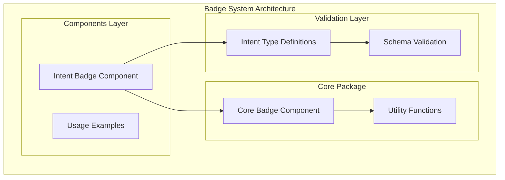
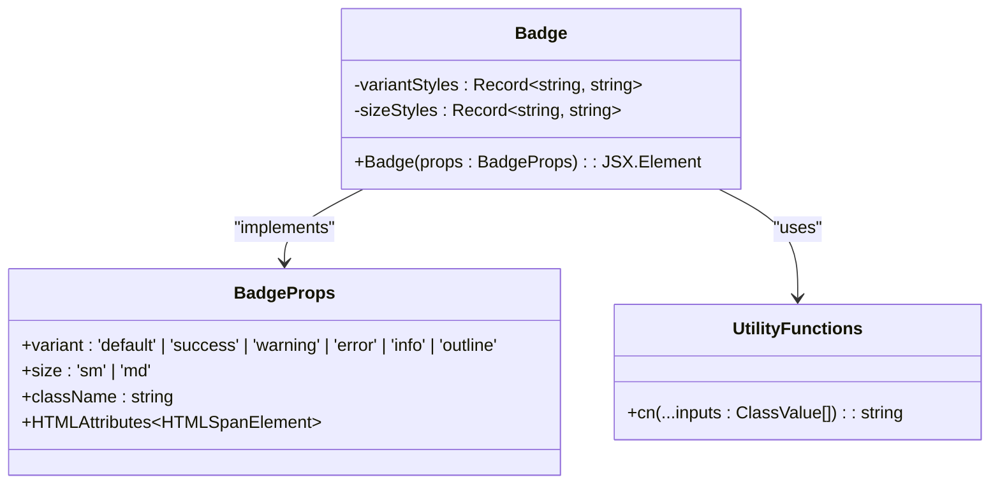
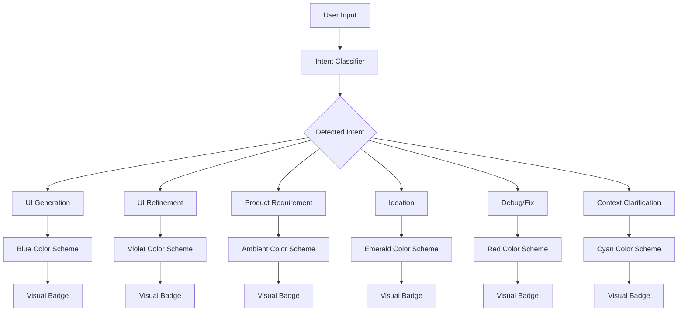
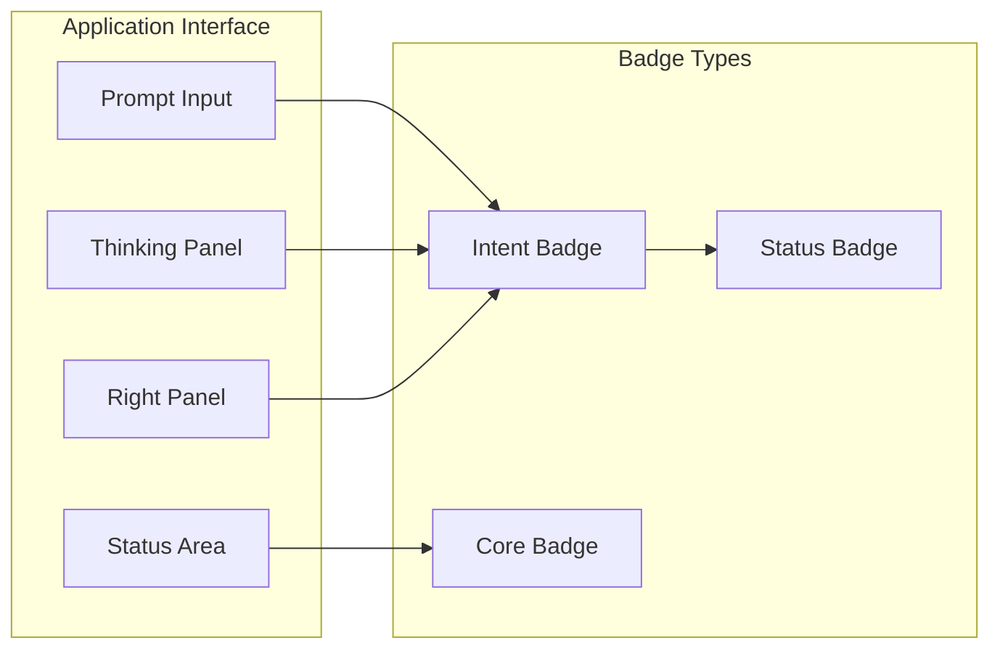
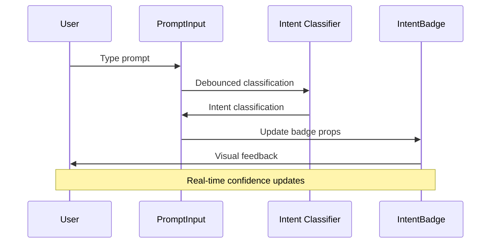
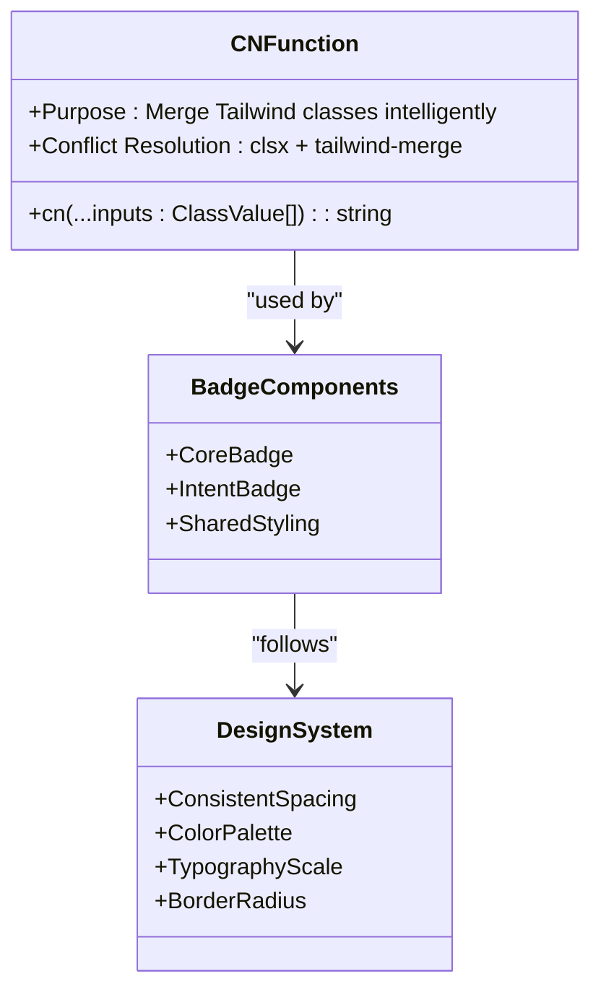
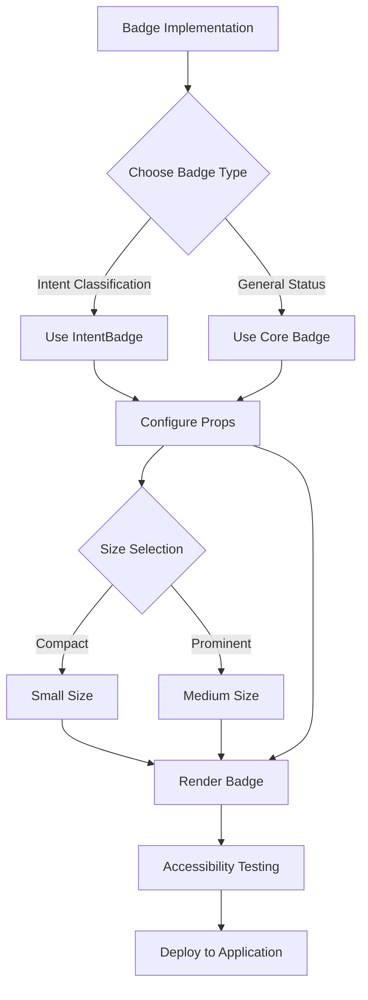

# Badge Component

<cite>
**Referenced Files in This Document**
- [IntentBadge.tsx](file://components/IntentBadge.tsx)
- [Badge.tsx](file://packages/core/components/Badge.tsx)
- [cn.ts](file://packages/utils/cn.ts)
- [schemas.ts](file://lib/validation/schemas.ts)
- [ThinkingPanel.tsx](file://components/ThinkingPanel.tsx)
- [RightPanel.tsx](file://components/ide/RightPanel.tsx)
- [PromptInput.tsx](file://components/prompt-input/PromptInput.tsx)
</cite>

## Table of Contents
1. [Introduction](#introduction)
2. [Badge Component Architecture](#badge-component-architecture)
3. [Core Badge Implementation](#core-badge-implementation)
4. [Intent Badge Implementation](#intent-badge-implementation)
5. [Usage Patterns](#usage-patterns)
6. [Design System Integration](#design-system-integration)
7. [Accessibility Features](#accessibility-features)
8. [Performance Considerations](#performance-considerations)
9. [Best Practices](#best-practices)
10. [Troubleshooting Guide](#troubleshooting-guide)

## Introduction

The Badge Component system in this AI-powered accessibility-first UI engine consists of two specialized badge implementations designed to communicate intent, status, and contextual information throughout the user interface. The system provides both a generic Badge component for general status indicators and a specialized IntentBadge component for AI-driven intent classification.

Badges serve as visual micro-interactions that enhance user understanding by providing immediate feedback about system states, user actions, and AI-generated insights. They are strategically placed throughout the interface to guide users through complex workflows while maintaining accessibility standards.

## Badge Component Architecture

The badge system follows a modular architecture with clear separation of concerns between generic and specialized implementations:

**Diagram sources**
- [Badge.tsx:1-31](file://packages/core/components/Badge.tsx#L1-L31)
- [IntentBadge.tsx:1-103](file://components/IntentBadge.tsx#L1-L103)
- [schemas.ts:1-46](file://lib/validation/schemas.ts#L1-L46)

**Section sources**
- [Badge.tsx:1-31](file://packages/core/components/Badge.tsx#L1-L31)
- [IntentBadge.tsx:1-103](file://components/IntentBadge.tsx#L1-L103)
- [schemas.ts:1-46](file://lib/validation/schemas.ts#L1-L46)

## Core Badge Implementation

The core Badge component provides a foundation for creating status indicators with consistent styling and behavior patterns.

### Component Structure

**Diagram sources**
- [Badge.tsx:4-7](file://packages/core/components/Badge.tsx#L4-L7)
- [Badge.tsx:9-21](file://packages/core/components/Badge.tsx#L9-L21)
- [cn.ts:8-10](file://packages/utils/cn.ts#L8-L10)

### Variant System

The core badge supports six distinct visual variants, each optimized for specific use cases:

| Variant | Purpose | Color Scheme |
|---------|---------|--------------|
| `default` | Neutral/default states | Gray 700 background, gray 200 text |
| `success` | Positive outcomes | Emerald 500/20 background, emerald 400 text |
| `warning` | Cautionary information | Amber 500/20 background, amber 400 text |
| `error` | Error conditions | Red 500/20 background, red 400 text |
| `info` | Informative messages | Blue 500/20 background, blue 400 text |
| `outline` | Subtle emphasis | Transparent background, gray 600 border |

### Size Variations

The component provides two size options optimized for different contexts:

- **Small (`sm`)**: px-2 py-0.5, text-xs, designed for compact spaces
- **Medium (`md`)**: px-2.5 py-1, text-sm, suitable for prominent displays

**Section sources**
- [Badge.tsx:9-21](file://packages/core/components/Badge.tsx#L9-L21)
- [Badge.tsx:23-30](file://packages/core/components/Badge.tsx#L23-L30)
- [cn.ts:1-11](file://packages/utils/cn.ts#L1-L11)

## Intent Badge Implementation

The Intent Badge component specializes in displaying AI-generated intent classifications with rich visual semantics and contextual information.

### Intent Classification System

**Diagram sources**
- [IntentBadge.tsx:11-63](file://components/IntentBadge.tsx#L11-L63)
- [schemas.ts:5-12](file://lib/validation/schemas.ts#L5-L12)

### Visual Configuration

Each intent type receives a customized visual treatment:

| Intent Type | Primary Color | Background | Border | Icon |
|-------------|---------------|------------|--------|------|
| `ui_generation` | Blue 300 | Blue 500/15 | Blue 500/30 | Wand2 |
| `ui_refinement` | Violet 300 | Violet 500/15 | Violet 500/30 | Edit3 |
| `product_requirement` | Amber 300 | Amber 500/15 | Amber 500/30 | FileText |
| `ideation` | Emerald 300 | Emerald 500/15 | Emerald 500/30 | Lightbulb |
| `debug_fix` | Red 300 | Red 500/15 | Red 500/30 | Bug |
| `context_clarification` | Cyan 300 | Cyan 500/15 | Cyan 500/30 | MessageSquare |

### Dynamic Behavior

The Intent Badge supports several dynamic features:

- **Confidence Display**: Optional percentage indicator showing AI certainty
- **Size Adaptation**: Responsive sizing for different contexts
- **Icon Integration**: Lucide React icons for visual enhancement
- **Accessibility Titles**: Comprehensive tooltip information

**Section sources**
- [IntentBadge.tsx:11-63](file://components/IntentBadge.tsx#L11-L63)
- [IntentBadge.tsx:74-102](file://components/IntentBadge.tsx#L74-L102)
- [schemas.ts:5-12](file://lib/validation/schemas.ts#L5-L12)

## Usage Patterns

Badges are strategically integrated throughout the application to provide meaningful user feedback and system transparency.

### Primary Usage Locations

**Diagram sources**
- [PromptInput.tsx:329-335](file://components/prompt-input/PromptInput.tsx#L329-L335)
- [ThinkingPanel.tsx:187](file://components/ThinkingPanel.tsx#L187)
- [RightPanel.tsx:401](file://components/ide/RightPanel.tsx#L401)

### Live Intent Detection

The system demonstrates real-time badge updates during user interaction:

**Diagram sources**
- [PromptInput.tsx:171-214](file://components/prompt-input/PromptInput.tsx#L171-L214)
- [PromptInput.tsx:329-335](file://components/prompt-input/PromptInput.tsx#L329-L335)

### Contextual Applications

| Component | Badge Usage | Purpose |
|-----------|-------------|---------|
| **PromptInput** | Live intent detection | Show real-time AI interpretation |
| **ThinkingPanel** | Plan overview | Display detected intent and confidence |
| **RightPanel** | Generation status | Indicate UI generation/refinement state |
| **VersionTimeline** | Change tracking | Visualize version differences |

**Section sources**
- [PromptInput.tsx:329-335](file://components/prompt-input/PromptInput.tsx#L329-L335)
- [ThinkingPanel.tsx:187](file://components/ThinkingPanel.tsx#L187)
- [RightPanel.tsx:401](file://components/ide/RightPanel.tsx#L401)

## Design System Integration

The badge system integrates seamlessly with the broader design system through shared utility functions and consistent styling patterns.

### Utility Function Integration

**Diagram sources**
- [cn.ts:8-10](file://packages/utils/cn.ts#L8-L10)
- [Badge.tsx:2](file://packages/core/components/Badge.tsx#L2)

### Consistency Patterns

The badge system maintains design consistency through:

- **Shared Utility Functions**: Centralized class merging via `cn()`
- **Standardized Spacing**: Consistent padding and margin patterns
- **Unified Color System**: Accessible color combinations
- **Responsive Typography**: Adaptive text sizing

**Section sources**
- [cn.ts:1-11](file://packages/utils/cn.ts#L1-L11)
- [Badge.tsx:23-29](file://packages/core/components/Badge.tsx#L23-L29)

## Accessibility Features

The badge components prioritize accessibility through comprehensive semantic markup and inclusive design patterns.

### Semantic Enhancements

| Feature | Implementation | Benefit |
|---------|----------------|---------|
| **ARIA Labels** | Descriptive `aria-label` attributes | Screen reader support |
| **Keyboard Navigation** | Focus management | Keyboard-only operation |
| **Color Contrast** | WCAG-compliant color ratios | Visual accessibility |
| **Tooltip Information** | Comprehensive `title` attributes | Additional context support |

### Interactive States

The badges provide clear visual feedback for different interaction states:

- **Hover States**: Subtle color transitions and scaling effects
- **Focus States**: Visible focus indicators for keyboard navigation
- **Active States**: Pressed-down appearance for tactile feedback
- **Disabled States**: Reduced opacity and neutral styling

**Section sources**
- [IntentBadge.tsx:91](file://components/IntentBadge.tsx#L91)
- [RightPanel.tsx:401](file://components/ide/RightPanel.tsx#L401)

## Performance Considerations

The badge system is optimized for performance through efficient rendering and minimal re-renders.

### Rendering Optimization

- **Pure Components**: Stateless functional components with minimal dependencies
- **Efficient Props**: Lightweight prop structures with default values
- **CSS-in-JS**: Dynamic class generation without external style overhead
- **Conditional Rendering**: Lazy loading for optional elements (confidence display)

### Memory Management

- **No Internal State**: Minimal internal state reduces memory footprint
- **Reusable Configurations**: Shared configuration objects prevent duplication
- **Efficient Updates**: Targeted updates based on prop changes

## Best Practices

### Implementation Guidelines

1. **Choose the Right Badge Type**
   - Use `IntentBadge` for AI-generated intent classification
   - Use `Badge` for general status indicators and metadata

2. **Consider Context and Size**
   - Use small badges for compact spaces and dense layouts
   - Use medium badges for prominent displays and important information

3. **Provide Adequate Context**
   - Include confidence information when available
   - Use descriptive tooltips for complex states
   - Ensure sufficient color contrast for accessibility

4. **Follow Accessibility Standards**
   - Include proper ARIA attributes
   - Support keyboard navigation
   - Maintain sufficient color contrast ratios

### Common Patterns

**Section sources**
- [IntentBadge.tsx:74-102](file://components/IntentBadge.tsx#L74-L102)
- [Badge.tsx:23-30](file://packages/core/components/Badge.tsx#L23-L30)

## Troubleshooting Guide

Common issues and solutions when working with badge components:

### Styling Issues

**Problem**: Badges appear misaligned or incorrectly sized
**Solution**: Verify Tailwind CSS is properly configured and utility classes are applied correctly

**Problem**: Colors appear washed out or low contrast
**Solution**: Check color palette configuration and ensure proper contrast ratios for accessibility

### Performance Issues

**Problem**: Frequent re-renders causing performance degradation
**Solution**: Use React.memo for static badge props and implement proper key management

**Problem**: Large bundle size due to badge dependencies
**Solution**: Import only required badge variants and avoid unnecessary icon libraries

### Accessibility Problems

**Problem**: Screen readers don't announce badge content properly
**Solution**: Ensure proper ARIA attributes and test with assistive technologies

**Problem**: Keyboard navigation issues with interactive badges
**Solution**: Implement proper focus management and keyboard event handlers

### Integration Challenges

**Problem**: Badge styling conflicts with existing design system
**Solution**: Use the utility function approach for consistent styling integration

**Problem**: Dynamic content not updating badge state
**Solution**: Implement proper prop passing and state management for live updates

**Section sources**
- [cn.ts:1-11](file://packages/utils/cn.ts#L1-L11)
- [IntentBadge.tsx:91](file://components/IntentBadge.tsx#L91)
- [Badge.tsx:23-30](file://packages/core/components/Badge.tsx#L23-L30)