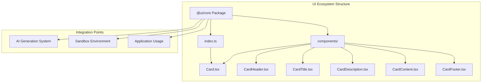
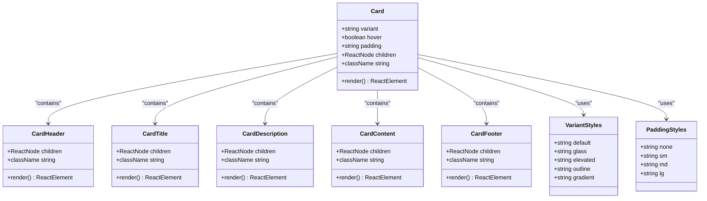
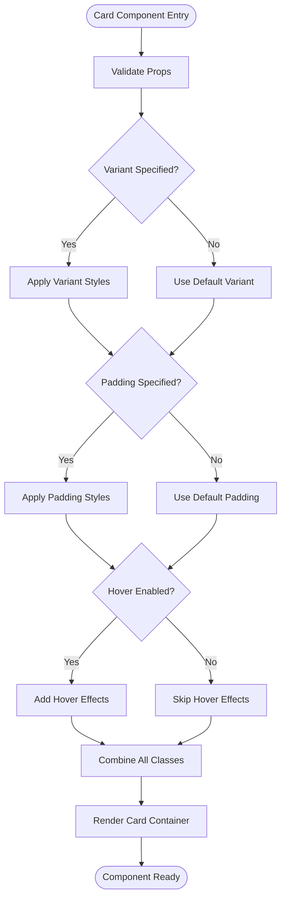
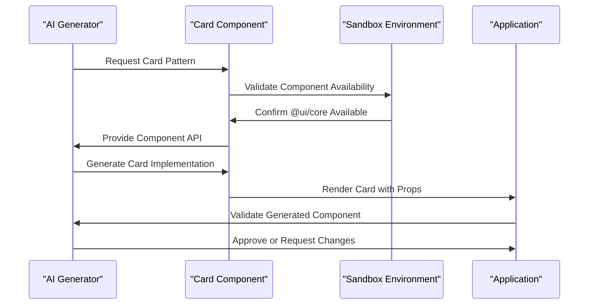
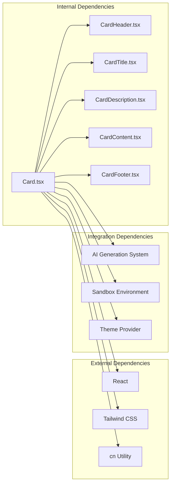

# Card Components

<cite>
**Referenced Files in This Document**
- [Card.tsx](file://packages/core/components/Card.tsx)
- [index.ts](file://packages/core/index.ts)
- [uiCheatSheet.ts](file://lib/ai/uiCheatSheet.ts)
- [prompts.ts](file://lib/ai/prompts.ts)
- [promptBuilder.ts](file://lib/ai/promptBuilder.ts)
- [package.json](file://package.json)
</cite>

## Table of Contents
1. [Introduction](#introduction)
2. [Project Structure](#project-structure)
3. [Core Components](#core-components)
4. [Architecture Overview](#architecture-overview)
5. [Detailed Component Analysis](#detailed-component-analysis)
6. [Dependency Analysis](#dependency-analysis)
7. [Performance Considerations](#performance-considerations)
8. [Troubleshooting Guide](#troubleshooting-guide)
9. [Conclusion](#conclusion)

## Introduction
This document provides comprehensive documentation for the Card Components ecosystem within the AI-powered accessibility-first UI engine. The Card component serves as a foundational layout primitive designed to support diverse UI patterns while maintaining accessibility standards and consistent design language. The documentation covers the complete component suite, usage patterns, integration points, and best practices for building accessible and visually appealing card-based interfaces.

The Card system consists of multiple specialized components that work together to create flexible, accessible card containers suitable for various use cases including pricing tiers, feature showcases, profile cards, and dashboard widgets. The implementation emphasizes accessibility compliance, responsive design, and consistent styling through a unified theming system.

## Project Structure
The Card Components are organized within the core UI ecosystem, specifically under the `@ui/core` package. The structure follows a modular approach that separates concerns between the main Card component and its supporting sub-components.

**Diagram sources**
- [Card.tsx:1-78](file://packages/core/components/Card.tsx#L1-L78)
- [index.ts:1-8](file://packages/core/index.ts#L1-L8)

**Section sources**
- [Card.tsx:1-78](file://packages/core/components/Card.tsx#L1-L78)
- [index.ts:1-8](file://packages/core/index.ts#L1-L8)

## Core Components
The Card Components ecosystem provides a comprehensive set of primitives designed to create flexible, accessible card-based interfaces. The system includes the main Card component along with specialized sub-components that handle specific aspects of card presentation and interaction.

### Main Card Component
The primary Card component serves as the foundation container with extensive customization options for appearance, behavior, and spacing. It supports five distinct visual variants and offers optional hover effects for enhanced user interaction.

### Supporting Card Sub-Components
Each card component serves a specific semantic purpose within the card hierarchy:
- **CardHeader**: Container for card headers and introductory content
- **CardTitle**: Primary heading element with accessible typography
- **CardDescription**: Secondary text content with appropriate contrast ratios
- **CardContent**: Main content area with flexible layout options
- **CardFooter**: Action area for buttons and interactive elements

**Section sources**
- [Card.tsx:25-77](file://packages/core/components/Card.tsx#L25-L77)

## Architecture Overview
The Card Components architecture follows a modular design pattern that promotes reusability, maintainability, and accessibility compliance. The system integrates seamlessly with the broader UI ecosystem while maintaining clear boundaries between components.

**Diagram sources**
- [Card.tsx:4-77](file://packages/core/components/Card.tsx#L4-L77)

The architecture ensures that each component maintains its specific responsibility while contributing to a cohesive card system. The design supports composition patterns that allow developers to build complex card layouts by combining individual components.

**Section sources**
- [Card.tsx:1-78](file://packages/core/components/Card.tsx#L1-L78)

## Detailed Component Analysis

### Card Component Implementation
The Card component provides the foundational container with extensive customization capabilities. The implementation leverages a style mapping system that translates variant and padding props into Tailwind CSS classes.

**Diagram sources**
- [Card.tsx:25-47](file://packages/core/components/Card.tsx#L25-L47)

The component supports five distinct visual variants, each optimized for specific use cases:
- **Default**: Standard dark-themed card with subtle borders
- **Glass**: Frosted glass effect with backdrop blur
- **Elevated**: Shadow-heavy card for prominent emphasis
- **Outline**: Border-only card for minimal visual weight
- **Gradient**: Multi-stop gradient background for visual interest

**Section sources**
- [Card.tsx:10-23](file://packages/core/components/Card.tsx#L10-L23)

### Card Sub-Components
Each sub-component handles specific aspects of card presentation while maintaining consistency with the overall design system.

#### CardHeader
The CardHeader component provides a dedicated container for introductory content within cards. It establishes proper spacing and semantic structure for card headers.

#### CardTitle
The CardTitle component implements accessible typography with appropriate contrast ratios and font weights. It supports semantic heading levels while maintaining visual hierarchy.

#### CardDescription
The CardDescription component provides secondary text content with optimized readability and contrast ratios for accessibility compliance.

#### CardContent
The CardContent component serves as the primary content area with flexible layout options and proper spacing for nested elements.

#### CardFooter
The CardFooter component creates a dedicated action area with consistent spacing and alignment for interactive elements.

**Section sources**
- [Card.tsx:49-77](file://packages/core/components/Card.tsx#L49-L77)

### Integration with AI Generation System
The Card Components integrate deeply with the AI generation system, providing standardized patterns for component creation and usage.

**Diagram sources**
- [prompts.ts:89-99](file://lib/ai/prompts.ts#L89-L99)
- [uiCheatSheet.ts:13-25](file://lib/ai/uiCheatSheet.ts#L13-L25)

The integration ensures that generated components follow consistent patterns and maintain accessibility standards while providing flexibility for specific use cases.

**Section sources**
- [prompts.ts:80-130](file://lib/ai/prompts.ts#L80-L130)
- [uiCheatSheet.ts:9-25](file://lib/ai/uiCheatSheet.ts#L9-L25)

## Dependency Analysis
The Card Components have minimal external dependencies, relying primarily on React and Tailwind CSS for styling. This design choice ensures broad compatibility and easy integration across different environments.

**Diagram sources**
- [Card.tsx:1-3](file://packages/core/components/Card.tsx#L1-L3)
- [package.json:13-44](file://package.json#L13-L44)

The dependency graph reveals a clean separation of concerns with the Card component depending only on essential libraries. This minimal dependency footprint enhances maintainability and reduces potential conflicts with other UI systems.

**Section sources**
- [Card.tsx:1-3](file://packages/core/components/Card.tsx#L1-L3)
- [package.json:13-44](file://package.json#L13-L44)

## Performance Considerations
The Card Components are designed with performance optimization in mind, utilizing efficient rendering patterns and minimal DOM overhead.

### Rendering Optimizations
- **Static Style Mapping**: Variant and padding styles are pre-computed and cached
- **Conditional Rendering**: Hover effects are only applied when enabled
- **Minimal Re-renders**: Components use appropriate prop comparisons to prevent unnecessary updates

### Accessibility Features
- **Semantic HTML**: Proper heading hierarchy and ARIA attributes
- **Keyboard Navigation**: Full keyboard accessibility support
- **Focus Management**: Automatic focus trapping and management
- **Screen Reader Support**: Comprehensive ARIA labeling and announcements

### Responsive Design
- **Mobile-First Approach**: Base styles optimized for mobile devices
- **Flexible Layouts**: Support for various screen sizes and orientations
- **Performance Budget**: Optimized for fast loading and smooth interactions

## Troubleshooting Guide
Common issues and solutions when working with Card Components:

### Styling Issues
**Problem**: Card variants not applying correctly
**Solution**: Verify variant prop values match available options (default, glass, elevated, outline, gradient)

**Problem**: Padding not taking effect
**Solution**: Ensure padding prop uses valid values (none, sm, md, lg)

### Accessibility Concerns
**Problem**: Screen reader issues with card content
**Solution**: Use CardHeader, CardTitle, and CardDescription components appropriately

**Problem**: Keyboard navigation problems
**Solution**: Ensure interactive elements within cards have proper focus management

### Integration Problems
**Problem**: Component not found in AI generation
**Solution**: Verify @ui/core package is properly imported and available in the sandbox environment

**Problem**: Styling conflicts with existing themes
**Solution**: Use the theming system to customize card appearances while maintaining accessibility

**Section sources**
- [Card.tsx:4-8](file://packages/core/components/Card.tsx#L4-L8)
- [prompts.ts:89-99](file://lib/ai/prompts.ts#L89-L99)

## Conclusion
The Card Components ecosystem provides a robust, accessible foundation for building modern UI interfaces. The modular architecture, comprehensive variant system, and deep integration with the AI generation system make it an ideal choice for creating consistent, maintainable card-based designs.

Key strengths of the implementation include:
- **Accessibility-First Design**: Built-in compliance with WCAG guidelines
- **Flexible Variants**: Five distinct visual styles for different contexts
- **Composition Patterns**: Modular components that work together seamlessly
- **AI Integration**: Native support for automated component generation
- **Performance Optimization**: Efficient rendering with minimal overhead

The Card Components serve as a cornerstone of the UI ecosystem, enabling developers to create sophisticated card-based interfaces while maintaining consistency, accessibility, and performance standards.