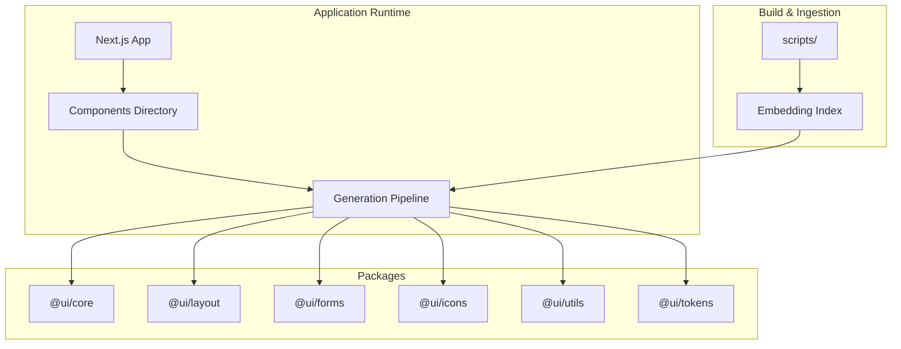
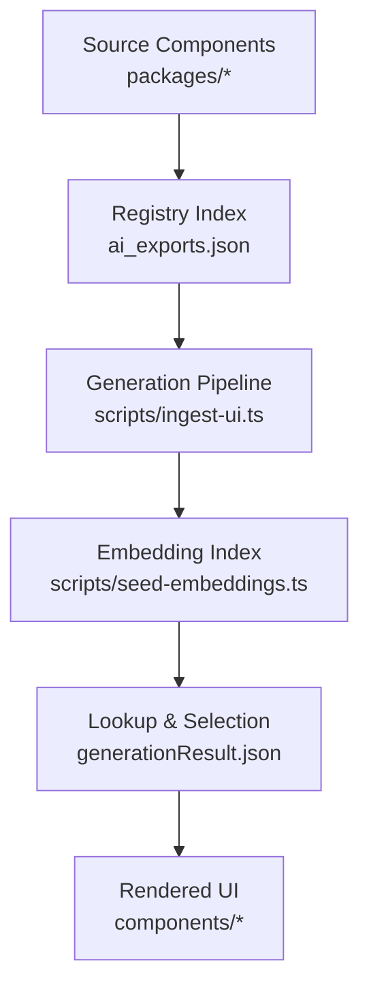
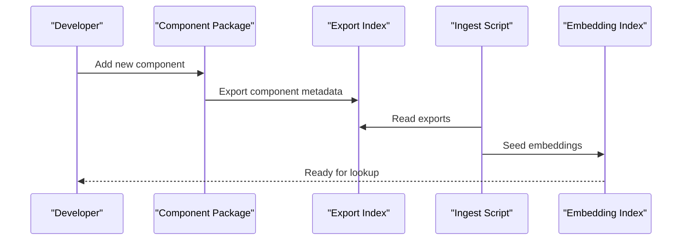
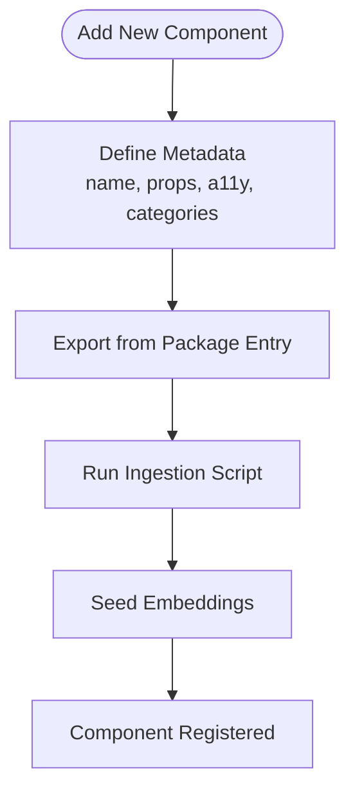
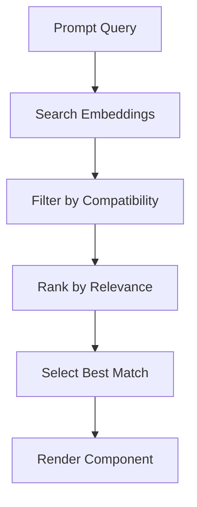
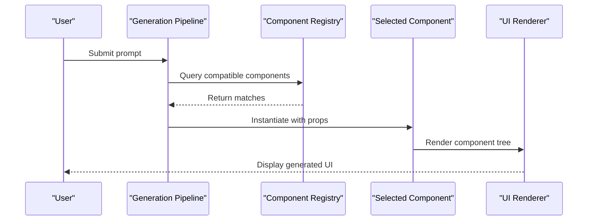
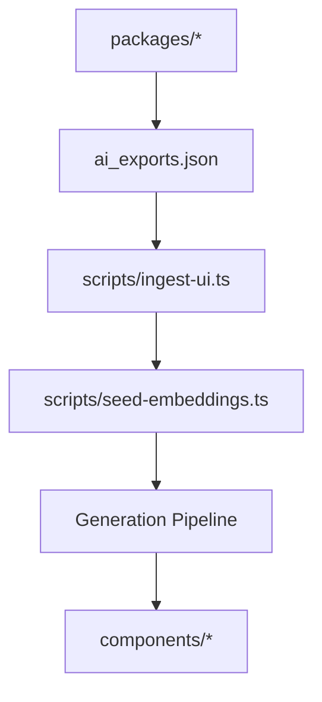

# Component Registry & Catalog

<cite>
**Referenced Files in This Document**
- [package.json](file://package.json)
- [README.md](file://README.md)
- [ARCHITECTURE.md](file://docs/ARCHITECTURE.md)
- [ENV_SETUP.md](file://docs/ENV_SETUP.md)
- [ingest-ui.ts](file://scripts/ingest-ui.ts)
- [seed-embeddings.ts](file://scripts/seed-embeddings.ts)
- [ai_exports.json](file://ai_exports.json)
- [generationResult.json](file://generationResult.json)
- [GeneratedCode.tsx](file://components/GeneratedCode.tsx)
- [PromptInput.tsx](file://components/PromptInput.tsx)
- [ProjectWorkspace.tsx](file://components/ProjectWorkspace.tsx)
- [WorkspaceSettingsPanel.tsx](file://components/WorkspaceSettingsPanel.tsx)
- [PipelineStatus.tsx](file://components/PipelineStatus.tsx)
- [RequirementBuilder.tsx](file://components/RequirementBuilder.tsx)
- [FinalRoundPanel.tsx](file://components/FinalRoundPanel.tsx)
- [FeedbackBar.tsx](file://components/FeedbackBar.tsx)
- [A11yReport.tsx](file://components/A11yReport.tsx)
- [ModelSwitcher.tsx](file://components/ModelSwitcher.tsx)
- [SandpackPreview.tsx](file://components/SandpackPreview.tsx)
- [TestOutput.tsx](file://components/TestOutput.tsx)
- [ThinkingPanel.tsx](file://components/ThinkingPanel.tsx)
- [VersionTimeline.tsx](file://components/VersionTimeline.tsx)
- [ProjectManager.tsx](file://components/ProjectManager.tsx)
- [WorkspaceProvider.tsx](file://components/workspace/WorkspaceProvider.tsx)
- [WorkspaceSwitcher.tsx](file://components/workspace/WorkspaceSwitcher.tsx)
- [SessionProvider.tsx](file://components/auth/SessionProvider.tsx)
- [UserNav.tsx](file://components/auth/UserNav.tsx)
- [CenterWorkspace.tsx](file://components/ide/CenterWorkspace.tsx)
- [RightPanel.tsx](file://components/ide/RightPanel.tsx)
- [Sidebar.tsx](file://components/ide/Sidebar.tsx)
</cite>

## Table of Contents
1. [Introduction](#introduction)
2. [Project Structure](#project-structure)
3. [Core Components](#core-components)
4. [Architecture Overview](#architecture-overview)
5. [Detailed Component Analysis](#detailed-component-analysis)
6. [Dependency Analysis](#dependency-analysis)
7. [Performance Considerations](#performance-considerations)
8. [Troubleshooting Guide](#troubleshooting-guide)
9. [Conclusion](#conclusion)
10. [Appendices](#appendices)

## Introduction
This document describes the component registry and catalog system that powers the AI-powered accessibility-first UI engine. It explains how built-in components are organized, discovered, registered, and looked up during generation workflows. It also documents the metadata model, compatibility considerations, and integration patterns with the generation pipeline. The system emphasizes accessibility, maintainability, and composability across component families such as core UI primitives, layout helpers, form controls, iconography, utilities, and design tokens.

## Project Structure
The project is a Next.js application with a monorepo-style packages directory containing reusable component libraries. The registry and catalog functionality is integrated into the application runtime and build-time scripts. Key areas:
- Application pages and UI components under the app and components directories
- Reusable component packages under packages
- Scripts for ingestion and embedding under scripts
- Documentation under docs

**Section sources**
- [package.json:1-68](file://package.json#L1-L68)
- [README.md](file://README.md)
- [ARCHITECTURE.md](file://docs/ARCHITECTURE.md)
- [ENV_SETUP.md](file://docs/ENV_SETUP.md)

## Core Components
The core component set is organized into cohesive packages that expose standardized APIs for use in generation workflows. Each package encapsulates related functionality and adheres to consistent naming and interface conventions.

- @ui/core: Fundamental UI primitives and base components
- @ui/layout: Layout primitives and composition helpers
- @ui/forms: Form controls and validation helpers
- @ui/icons: Iconography library and icon components
- @ui/utils: Utility components and cross-cutting helpers
- @ui/tokens: Design tokens and theme definitions

These packages integrate with the generation pipeline to produce accessible, consistent UI outputs.

**Section sources**
- [package.json:13-44](file://package.json#L13-L44)

## Architecture Overview
The component registry and catalog system operates through a combination of:
- Component discovery via the packages directory and component exports
- Metadata capture and indexing for compatibility and search
- Lookup mechanisms that resolve components during generation
- Integration with the generation pipeline to render UI from prompts

**Diagram sources**
- [ai_exports.json](file://ai_exports.json)
- [ingest-ui.ts](file://scripts/ingest-ui.ts)
- [seed-embeddings.ts](file://scripts/seed-embeddings.ts)
- [generationResult.json](file://generationResult.json)

**Section sources**
- [ai_exports.json](file://ai_exports.json)
- [ingest-ui.ts](file://scripts/ingest-ui.ts)
- [seed-embeddings.ts](file://scripts/seed-embeddings.ts)
- [generationResult.json](file://generationResult.json)

## Detailed Component Analysis

### Component Discovery Mechanism
Discovery is driven by:
- Package exports defined in each component package’s entry points
- Centralized export index that aggregates component metadata
- Build-time ingestion script that reads the export index and seeds embeddings

**Diagram sources**
- [ai_exports.json](file://ai_exports.json)
- [ingest-ui.ts](file://scripts/ingest-ui.ts)
- [seed-embeddings.ts](file://scripts/seed-embeddings.ts)

**Section sources**
- [ai_exports.json](file://ai_exports.json)
- [ingest-ui.ts](file://scripts/ingest-ui.ts)
- [seed-embeddings.ts](file://scripts/seed-embeddings.ts)

### Registration Process
Registration involves:
- Defining component metadata (name, props, accessibility attributes, categories)
- Exporting components from the package entry
- Running the ingestion pipeline to update the registry and embeddings

**Diagram sources**
- [ai_exports.json](file://ai_exports.json)
- [ingest-ui.ts](file://scripts/ingest-ui.ts)
- [seed-embeddings.ts](file://scripts/seed-embeddings.ts)

**Section sources**
- [ai_exports.json](file://ai_exports.json)
- [ingest-ui.ts](file://scripts/ingest-ui.ts)
- [seed-embeddings.ts](file://scripts/seed-embeddings.ts)

### Lookup Algorithms
During generation, the system:
- Searches the embedding index for semantically similar components
- Filters by compatibility (framework version, accessibility flags)
- Selects the best-matching component for rendering

**Diagram sources**
- [seed-embeddings.ts](file://scripts/seed-embeddings.ts)
- [generationResult.json](file://generationResult.json)

**Section sources**
- [seed-embeddings.ts](file://scripts/seed-embeddings.ts)
- [generationResult.json](file://generationResult.json)

### Component Packages Overview
Each package follows consistent patterns for discoverability and integration:

- @ui/core: Base UI primitives and foundational components
- @ui/layout: Layout primitives enabling responsive and accessible layouts
- @ui/forms: Form controls with built-in validation and accessibility support
- @ui/icons: Iconography library with semantic labeling and sizing
- @ui/utils: Cross-cutting utilities and helpers for common tasks
- @ui/tokens: Design tokens and theme definitions for consistent styling

**Section sources**
- [package.json:13-44](file://package.json#L13-L44)

### Component Metadata Structure
Metadata captures essential information for discovery and compatibility:
- Component identity (name, package)
- Accessibility attributes (labels, roles, keyboard navigation)
- Props schema (names, types, defaults, required flags)
- Categories and tags for filtering
- Compatibility matrix (framework versions, feature flags)

This metadata is exported and indexed to enable semantic search and selection.

**Section sources**
- [ai_exports.json](file://ai_exports.json)

### Dependency Relationships
Components depend on shared utilities and design systems:
- Shared design tokens and themes
- Utility components for layout and spacing
- Accessibility utilities for ARIA attributes and keyboard handling

**Section sources**
- [package.json:13-44](file://package.json#L13-L44)

### Version Compatibility
Compatibility is enforced through:
- Semantic versioning of packages
- Compatibility matrices in metadata
- Build-time checks ensuring framework alignment

**Section sources**
- [package.json:13-44](file://package.json#L13-L44)

### Guidelines for Adding New Components
- Follow package naming conventions (@ui/<category>)
- Define clear metadata with accessibility and props schema
- Export components from the package entry
- Run the ingestion pipeline to register and embed the component
- Verify compatibility and test integration with the generation pipeline

**Section sources**
- [ingest-ui.ts](file://scripts/ingest-ui.ts)
- [ai_exports.json](file://ai_exports.json)

### Component Naming Conventions
- Use kebab-case for component names
- Prefix with @ui/<category>/ for package-scoped components
- Keep names descriptive and concise

**Section sources**
- [package.json:13-44](file://package.json#L13-L44)

### Prop Interface Standards
- Define explicit prop interfaces with TypeScript
- Mark required props clearly
- Provide sensible defaults where applicable
- Include accessibility-related props (aria-label, role, tabIndex)

**Section sources**
- [package.json:13-44](file://package.json#L13-L44)

### Usage Patterns and Generation Pipeline Integration
Components integrate with the generation pipeline through:
- Prompt-driven selection from the registry
- Rendering into the UI via the generation result
- Applying design tokens and layout primitives consistently

**Diagram sources**
- [ingest-ui.ts](file://scripts/ingest-ui.ts)
- [generationResult.json](file://generationResult.json)
- [GeneratedCode.tsx](file://components/GeneratedCode.tsx)

**Section sources**
- [ingest-ui.ts](file://scripts/ingest-ui.ts)
- [generationResult.json](file://generationResult.json)
- [GeneratedCode.tsx](file://components/GeneratedCode.tsx)

## Dependency Analysis
The registry depends on:
- Component packages for exports and metadata
- Ingestion scripts for building the registry and embeddings
- Embedding index for semantic search
- Generation pipeline for runtime selection and rendering

**Diagram sources**
- [ai_exports.json](file://ai_exports.json)
- [ingest-ui.ts](file://scripts/ingest-ui.ts)
- [seed-embeddings.ts](file://scripts/seed-embeddings.ts)

**Section sources**
- [ai_exports.json](file://ai_exports.json)
- [ingest-ui.ts](file://scripts/ingest-ui.ts)
- [seed-embeddings.ts](file://scripts/seed-embeddings.ts)

## Performance Considerations
- Keep component metadata minimal and focused to reduce indexing overhead
- Optimize embedding queries with category filters and compatibility checks
- Cache frequently accessed components to minimize rebuild times
- Monitor embedding quality to improve selection accuracy

## Troubleshooting Guide
Common issues and resolutions:
- Component not found: Verify package exports and ensure the ingestion script runs after changes
- Incorrect metadata: Review component metadata schema and re-run ingestion
- Compatibility errors: Align component versions with the framework and tokens
- Embedding mismatches: Re-seed embeddings after significant metadata changes

**Section sources**
- [ingest-ui.ts](file://scripts/ingest-ui.ts)
- [seed-embeddings.ts](file://scripts/seed-embeddings.ts)

## Conclusion
The component registry and catalog system provides a scalable foundation for discovering, registering, and selecting components during generation. By enforcing metadata standards, compatibility matrices, and consistent naming conventions, the system ensures reliable, accessible, and maintainable UI generation across the platform.

## Appendices
- Additional documentation: [ARCHITECTURE.md](file://docs/ARCHITECTURE.md), [ENV_SETUP.md](file://docs/ENV_SETUP.md)
- Example components: [GeneratedCode.tsx](file://components/GeneratedCode.tsx), [PromptInput.tsx](file://components/PromptInput.tsx), [ProjectWorkspace.tsx](file://components/ProjectWorkspace.tsx), [WorkspaceSettingsPanel.tsx](file://components/WorkspaceSettingsPanel.tsx), [PipelineStatus.tsx](file://components/PipelineStatus.tsx), [RequirementBuilder.tsx](file://components/RequirementBuilder.tsx), [FinalRoundPanel.tsx](file://components/FinalRoundPanel.tsx), [FeedbackBar.tsx](file://components/FeedbackBar.tsx), [A11yReport.tsx](file://components/A11yReport.tsx), [ModelSwitcher.tsx](file://components/ModelSwitcher.tsx), [SandpackPreview.tsx](file://components/SandpackPreview.tsx), [TestOutput.tsx](file://components/TestOutput.tsx), [ThinkingPanel.tsx](file://components/ThinkingPanel.tsx), [VersionTimeline.tsx](file://components/VersionTimeline.tsx), [ProjectManager.tsx](file://components/ProjectManager.tsx), [WorkspaceProvider.tsx](file://components/workspace/WorkspaceProvider.tsx), [WorkspaceSwitcher.tsx](file://components/workspace/WorkspaceSwitcher.tsx), [SessionProvider.tsx](file://components/auth/SessionProvider.tsx), [UserNav.tsx](file://components/auth/UserNav.tsx), [CenterWorkspace.tsx](file://components/ide/CenterWorkspace.tsx), [RightPanel.tsx](file://components/ide/RightPanel.tsx), [Sidebar.tsx](file://components/ide/Sidebar.tsx)