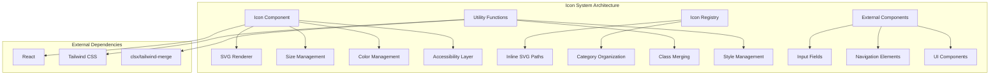
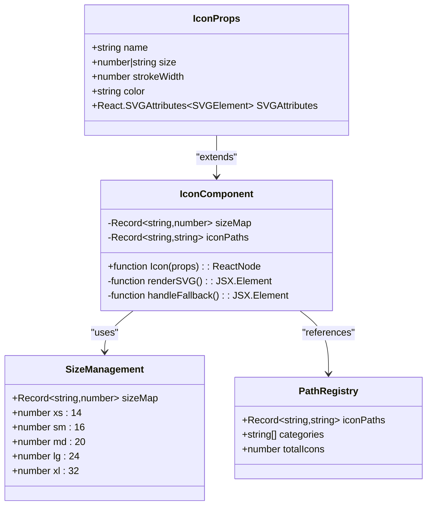
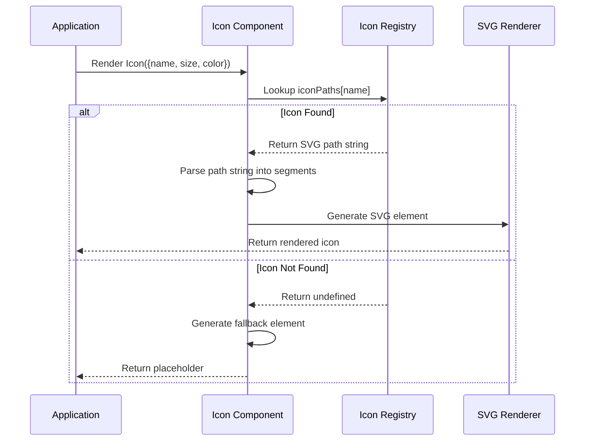
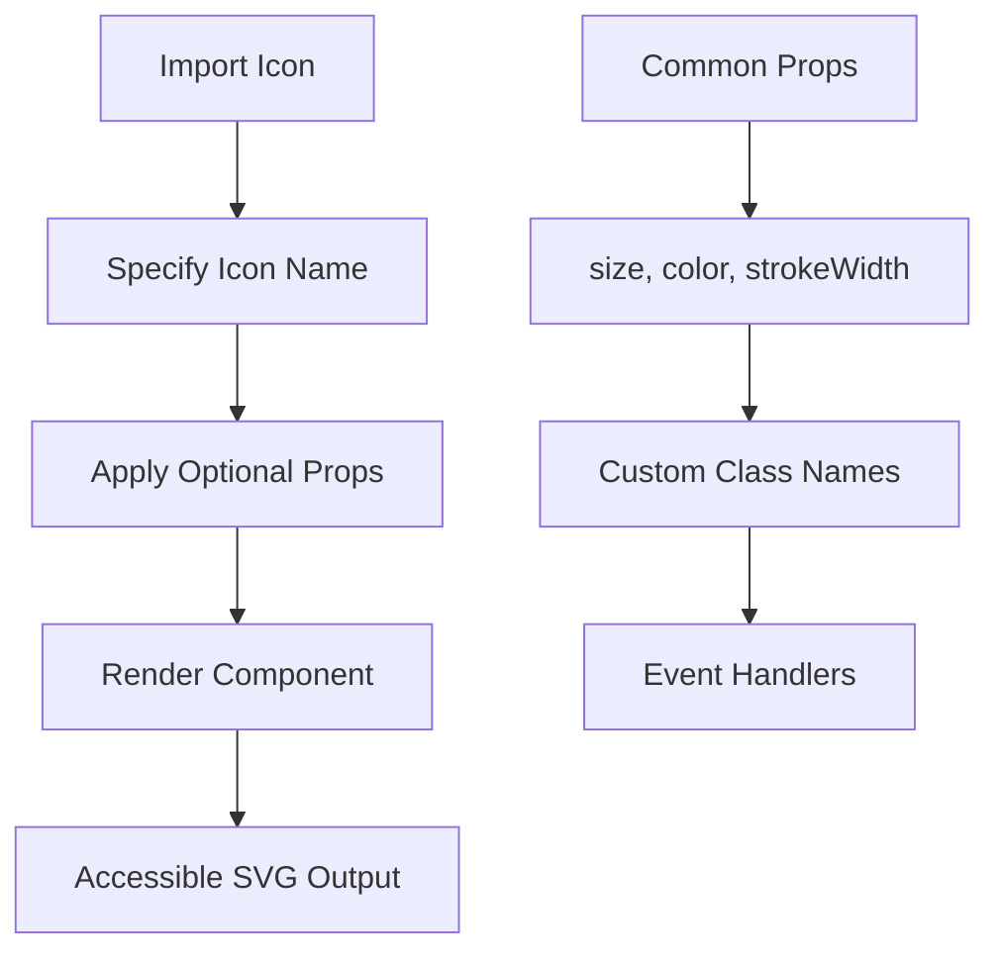
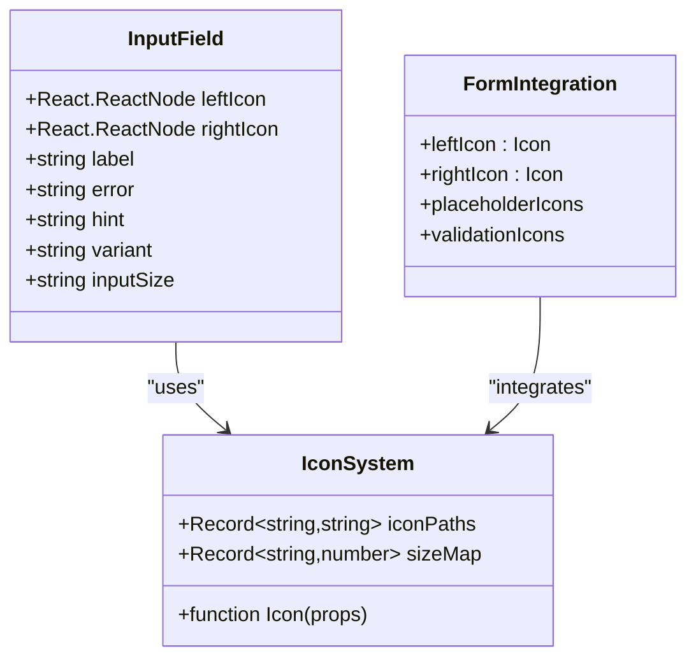
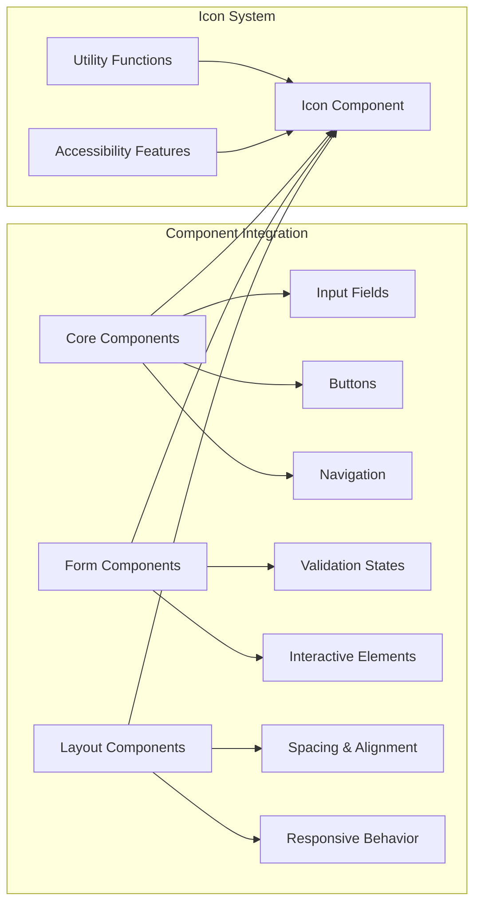

# Comprehensive Icon System

<cite>
**Referenced Files in This Document**
- [Icon.tsx](file://packages/icons/components/Icon.tsx)
- [index.ts](file://packages/icons/index.ts)
- [cn.ts](file://packages/utils/cn.ts)
- [Input.tsx](file://packages/core/components/Input.tsx)
- [ModelSelectionGate.tsx](file://components/ModelSelectionGate.tsx)
- [UserNav.tsx](file://components/auth/UserNav.tsx)
- [package.json](file://package.json)
</cite>

## Table of Contents
1. [Introduction](#introduction)
2. [System Architecture](#system-architecture)
3. [Core Components](#core-components)
4. [Icon Implementation Details](#icon-implementation-details)
5. [Usage Patterns](#usage-patterns)
6. [Icon Categories](#icon-categories)
7. [Integration Points](#integration-points)
8. [Performance Considerations](#performance-considerations)
9. [Extensibility Guide](#extensibility-guide)
10. [Troubleshooting Guide](#troubleshooting-guide)
11. [Conclusion](#conclusion)

## Introduction

The Comprehensive Icon System is a zero-dependency, inline SVG-based icon solution designed specifically for accessibility-first UI development. Built with React and TypeScript, this system provides a lightweight, customizable, and screen-reader friendly approach to iconography that integrates seamlessly with modern web applications.

The system prioritizes accessibility by implementing proper ARIA attributes, semantic markup, and keyboard navigation support. It leverages inline SVG paths to eliminate external dependencies while maintaining excellent performance characteristics and compatibility with various deployment environments, including Sandpack.

## System Architecture

The icon system follows a modular architecture with clear separation of concerns:

**Diagram sources**
- [Icon.tsx:1-126](file://packages/icons/components/Icon.tsx#L1-L126)
- [cn.ts:1-11](file://packages/utils/cn.ts#L1-L11)

The architecture ensures modularity, maintainability, and extensibility while maintaining zero runtime dependencies for the core icon functionality.

**Section sources**
- [Icon.tsx:1-126](file://packages/icons/components/Icon.tsx#L1-L126)
- [cn.ts:1-11](file://packages/utils/cn.ts#L1-L11)

## Core Components

### Icon Component

The primary `Icon` component serves as the central hub for all icon rendering operations. It accepts a comprehensive set of props that enable fine-grained control over appearance and behavior.

**Diagram sources**
- [Icon.tsx:4-17](file://packages/icons/components/Icon.tsx#L4-L17)
- [Icon.tsx:20-84](file://packages/icons/components/Icon.tsx#L20-L84)

**Section sources**
- [Icon.tsx:4-126](file://packages/icons/components/Icon.tsx#L4-L126)

### Utility Functions

The system leverages a sophisticated utility function for intelligent class merging, ensuring optimal CSS class management across different components.

**Section sources**
- [cn.ts:1-11](file://packages/utils/cn.ts#L1-L11)

## Icon Implementation Details

### Inline SVG Architecture

The icon system utilizes inline SVG paths stored as string data, eliminating the need for external asset loading while maintaining SVG scalability and customization capabilities.

**Diagram sources**
- [Icon.tsx:86-123](file://packages/icons/components/Icon.tsx#L86-L123)

### Size Management System

The system implements a comprehensive size management approach supporting both predefined sizes and custom dimensions:

| Size Category | Value (px) | Usage Context |
|---------------|------------|---------------|
| `xs` | 14 | Small notifications, micro-interactions |
| `sm` | 16 | Standard UI elements, buttons |
| `md` | 20 | Primary interface elements |
| `lg` | 24 | Large interactive elements, headers |
| `xl` | 32 | Hero elements, prominent actions |

**Section sources**
- [Icon.tsx:11-17](file://packages/icons/components/Icon.tsx#L11-L17)
- [Icon.tsx:86-101](file://packages/icons/components/Icon.tsx#L86-L101)

### Color and Styling System

The icon system supports dynamic color assignment while maintaining accessibility standards through proper contrast ratios and semantic color usage.

**Section sources**
- [Icon.tsx:100-117](file://packages/icons/components/Icon.tsx#L100-L117)

## Usage Patterns

### Basic Icon Rendering

The simplest usage pattern involves importing the Icon component and specifying the desired icon name:

**Diagram sources**
- [Icon.tsx:86-123](file://packages/icons/components/Icon.tsx#L86-L123)

### Integration with Form Components

The icon system integrates seamlessly with form elements, providing visual feedback and enhanced user experience:

**Diagram sources**
- [Input.tsx:7-62](file://packages/core/components/Input.tsx#L7-L62)
- [Icon.tsx:86-123](file://packages/icons/components/Icon.tsx#L86-L123)

**Section sources**
- [Input.tsx:7-62](file://packages/core/components/Input.tsx#L7-L62)

### Advanced Integration Examples

The system demonstrates sophisticated integration patterns across multiple application components, showcasing its versatility and adaptability.

**Section sources**
- [ModelSelectionGate.tsx:55](file://components/ModelSelectionGate.tsx#L55)
- [ModelSelectionGate.tsx:275](file://components/ModelSelectionGate.tsx#L275)
- [ModelSelectionGate.tsx:330](file://components/ModelSelectionGate.tsx#L330)
- [UserNav.tsx:191](file://components/auth/UserNav.tsx#L191)
- [UserNav.tsx:210](file://components/auth/UserNav.tsx#L210)

## Icon Categories

The icon library is systematically organized into logical categories, each serving specific UI interaction patterns:

### Navigation Icons
- Arrow directions (left, right, up, down)
- Chevron indicators (up, down, left, right)
- Menu and close indicators
- External link indicators

### Action Icons
- Addition and subtraction controls
- Validation and verification (check, x)
- Search and filtering mechanisms
- File operations (download, upload, save)
- Editing and modification tools
- Deletion and removal actions

### Content Icons
- Document and folder representations
- Media content (image, video)
- Code and programming elements
- Link and attachment indicators

### Status Icons
- Informational indicators
- Warning and alert systems
- Validation states (success, error, pending)
- Help and assistance elements

### Communication Icons
- Messaging and notification systems
- Contact and user communication
- Audio and visual alerts

### UI Control Icons
- Settings and configuration
- Home and navigation
- User profiles and authentication
- Security and access control
- Visibility controls (eye, eye-off)

### Miscellaneous Icons
- Rating and feedback (star, heart)
- Temporal indicators (clock)
- Energy and power (zap)
- Global and regional elements (globe)
- Environmental themes (moon, sun)
- Design and creativity (palette, sparkles)
- Technology and development (cpu, layers)

**Section sources**
- [Icon.tsx:20-84](file://packages/icons/components/Icon.tsx#L20-L84)

## Integration Points

### Component Library Integration

The icon system integrates deeply with the broader component library ecosystem, providing consistent visual language across all application interfaces.

**Diagram sources**
- [Input.tsx:7-62](file://packages/core/components/Input.tsx#L7-L62)
- [Icon.tsx:86-123](file://packages/icons/components/Icon.tsx#L86-L123)

### External Dependencies and Compatibility

The system maintains compatibility with major React ecosystems while minimizing external dependencies:

**Section sources**
- [package.json:32](file://package.json#L32)
- [cn.ts:1-11](file://packages/utils/cn.ts#L1-L11)

## Performance Considerations

### Zero Runtime Dependencies

The icon system achieves optimal performance through several key strategies:

- **Inline SVG Generation**: Eliminates external asset loading overhead
- **Static Path Data**: Reduces runtime computation requirements
- **Memory Efficiency**: Minimal memory footprint per icon instance
- **Bundle Size Optimization**: No additional dependencies in core functionality

### Rendering Optimization

The system implements several optimization techniques:

- **Conditional Rendering**: Graceful fallback for missing icons
- **SVG Path Parsing**: Efficient single-pass parsing of icon data
- **Class Merging**: Optimized CSS class combination using clsx and tailwind-merge
- **Accessibility Attributes**: Pre-computed ARIA attributes for screen readers

**Section sources**
- [Icon.tsx:86-123](file://packages/icons/components/Icon.tsx#L86-L123)
- [cn.ts:8-10](file://packages/utils/cn.ts#L8-L10)

## Extensibility Guide

### Adding New Icons

The system provides a straightforward mechanism for extending the icon library:

1. **Define Icon Path**: Add SVG path data to the `iconPaths` registry
2. **Choose Category**: Place icon in appropriate category section
3. **Maintain Consistency**: Follow existing naming conventions
4. **Test Accessibility**: Ensure proper ARIA attributes and keyboard navigation

### Customization Options

The icon system supports extensive customization through:

- **Size Variations**: Custom dimensions or predefined size categories
- **Color Theming**: Dynamic color assignment and theme integration
- **Stroke Width**: Adjustable line thickness for different visual weights
- **Class Extensions**: Additional CSS classes for specialized styling

**Section sources**
- [Icon.tsx:20-84](file://packages/icons/components/Icon.tsx#L20-L84)
- [Icon.tsx:118-121](file://packages/icons/components/Icon.tsx#L118-L121)

## Troubleshooting Guide

### Common Issues and Solutions

#### Missing Icon Display
**Symptom**: Question mark appears instead of expected icon
**Cause**: Icon name not found in registry
**Solution**: Verify icon name spelling and check category membership

#### Incorrect Sizing
**Symptom**: Icon appears too large or small
**Cause**: Size prop not properly specified or incompatible value
**Solution**: Use supported size values (xs, sm, md, lg, xl) or numeric values

#### Color Issues
**Symptom**: Icon color doesn't match design requirements
**Cause**: Color prop not applied or CSS overrides
**Solution**: Explicitly set color prop or adjust CSS class hierarchy

#### Accessibility Concerns
**Symptom**: Screen reader issues with icon elements
**Cause**: Missing ARIA attributes or improper semantic markup
**Solution**: Ensure proper `aria-hidden` attributes and semantic context

**Section sources**
- [Icon.tsx:88-98](file://packages/icons/components/Icon.tsx#L88-L98)
- [Icon.tsx:114-116](file://packages/icons/components/Icon.tsx#L114-L116)

### Performance Monitoring

Key metrics to monitor for optimal icon system performance:

- **Render Time**: Individual icon rendering duration
- **Memory Usage**: Per-icon memory footprint
- **Bundle Impact**: Size contribution to application bundle
- **Accessibility Score**: Screen reader compatibility metrics

## Conclusion

The Comprehensive Icon System represents a mature, accessibility-first approach to iconography in modern web applications. Its zero-dependency architecture, comprehensive feature set, and seamless integration capabilities make it an ideal choice for applications prioritizing both performance and user experience.

The system's modular design ensures maintainability and extensibility while its focus on accessibility guarantees inclusive user experiences across diverse audiences. The extensive icon library covering essential UI patterns, combined with flexible customization options, provides developers with the tools needed to create compelling, accessible interfaces.

Future enhancements could include dynamic icon loading, advanced animation support, and expanded internationalization features, building upon the solid foundation established by this comprehensive icon system.