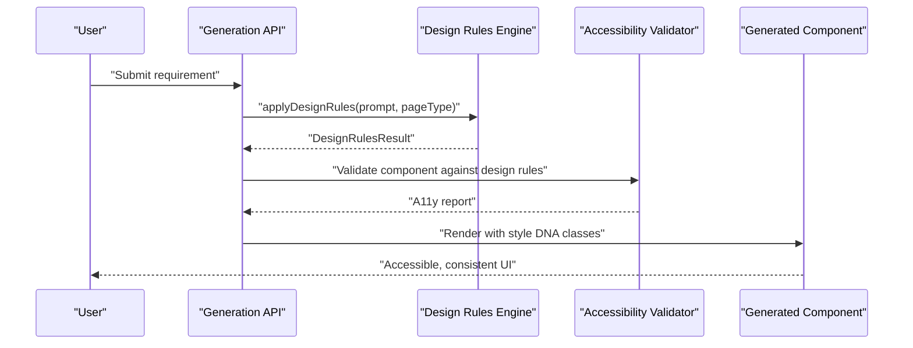
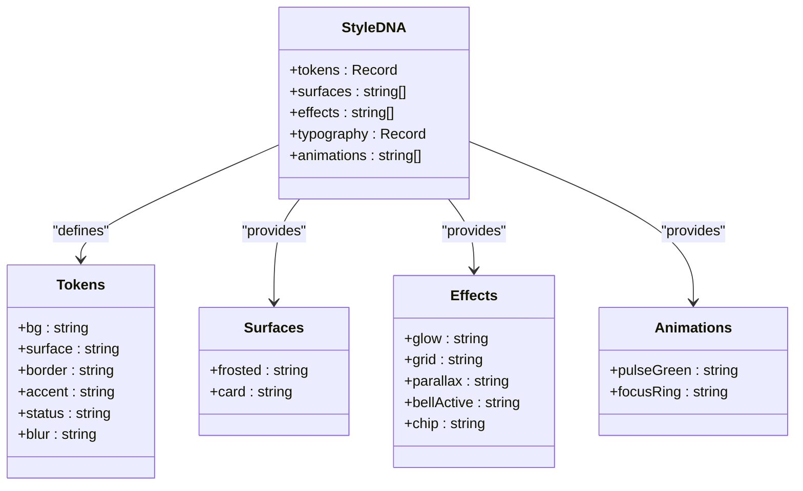
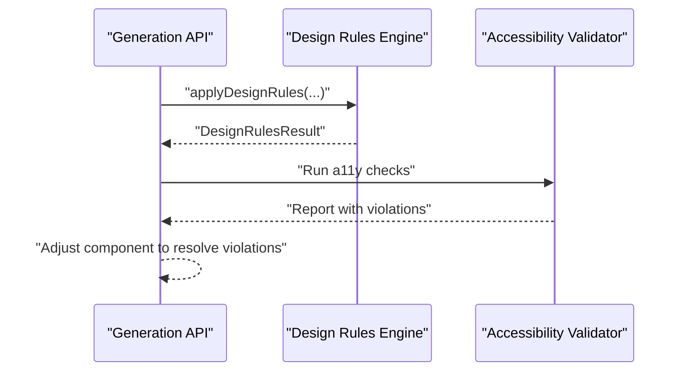
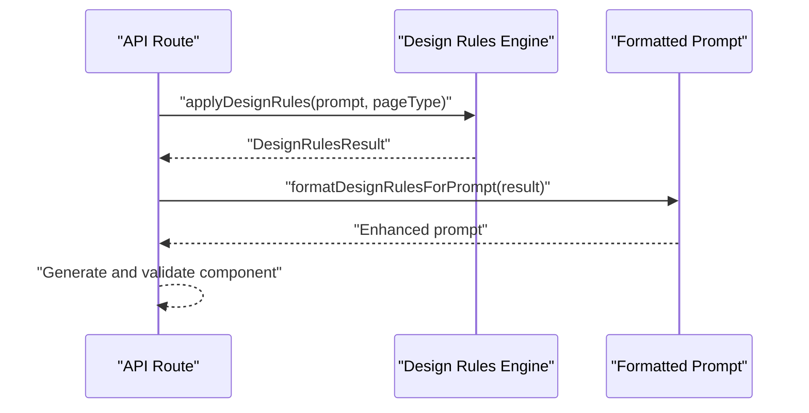
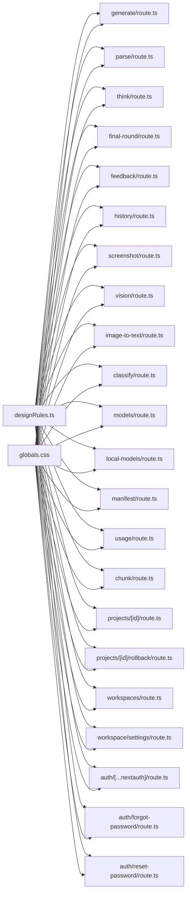

# Design System Integration

<cite>
**Referenced Files in This Document**
- [designRules.ts](file://lib/intelligence/designRules.ts)
- [globals.css](file://app/globals.css)
- [a11yValidator.test.ts](file://__tests__/a11yValidator.test.ts)
- [engine-config/route.ts](file://app/api/engine-config/route.ts)
- [generate/route.ts](file://app/api/generate/route.ts)
- [parse/route.ts](file://app/api/parse/route.ts)
- [think/route.ts](file://app/api/think/route.ts)
- [final-round/route.ts](file://app/api/final-round/route.ts)
- [feedback/route.ts](file://app/api/feedback/route.ts)
- [history/route.ts](file://app/api/history/route.ts)
- [screenshot/route.ts](file://app/api/screenshot/route.ts)
- [vision/route.ts](file://app/api/vision/route.ts)
- [image-to-text/route.ts](file://app/api/image-to-text/route.ts)
- [classify/route.ts](file://app/api/classify/route.ts)
- [models/route.ts](file://app/api/models/route.ts)
- [local-models/route.ts](file://app/api/local-models/route.ts)
- [manifest/route.ts](file://app/api/manifest/route.ts)
- [usage/route.ts](file://app/api/usage/route.ts)
- [chunk/route.ts](file://app/api/chunk/route.ts)
- [projects/[id]/route.ts](file://app/api/projects/[id]/route.ts)
- [projects/[id]/rollback/route.ts](file://app/api/projects/[id]/rollback/route.ts)
- [workspaces/route.ts](file://app/api/workspaces/route.ts)
- [workspace/settings/route.ts](file://app/api/workspace/settings/route.ts)
- [auth/[...nextauth]/route.ts](file://app/api/auth/[...nextauth]/route.ts)
- [auth/forgot-password/route.ts](file://app/api/auth/forgot-password/route.ts)
- [auth/reset-password/route.ts](file://app/api/auth/reset-password/route.ts)
</cite>

## Table of Contents
1. [Introduction](#introduction)
2. [Project Structure](#project-structure)
3. [Core Components](#core-components)
4. [Architecture Overview](#architecture-overview)
5. [Detailed Component Analysis](#detailed-component-analysis)
6. [Dependency Analysis](#dependency-analysis)
7. [Performance Considerations](#performance-considerations)
8. [Troubleshooting Guide](#troubleshooting-guide)
9. [Conclusion](#conclusion)
10. [Appendices](#appendices)

## Introduction
This document explains how the design system is integrated and enforced across the platform. It focuses on:
- The blueprint engine that applies design rules to guide component generation and validation
- The design rules framework that encodes accessibility standards, visual consistency, and composition guidelines
- The style DNA system that maintains design language consistency across generated components
- Theming integration, typography hierarchy enforcement, and color palette management
- Guidance for extending design rules, customizing style DNA, and integrating new design system elements
- How generated components are validated against design system constraints and how violations are surfaced and resolved

## Project Structure
The design system spans several layers:
- A central design rules engine that interprets prompts and produces a structured set of design decisions
- Global CSS that defines tokens, palettes, and reusable style DNA classes
- API routes that orchestrate generation and validation workflows
- Tests that validate accessibility outcomes

```mermaid
graph TB
subgraph "Intelligence Layer"
DR["designRules.ts<br/>Design Decision Engine"]
end
subgraph "Presentation Layer"
GCSS["globals.css<br/>Tokens, Palette, Style DNA"]
end
subgraph "API Orchestration"
GEN["generate/route.ts"]
PARSE["parse/route.ts"]
THINK["think/route.ts"]
FR["final-round/route.ts"]
FEED["feedback/route.ts"]
HIST["history/route.ts"]
SCR["screenshot/route.ts"]
VISION["vision/route.ts"]
IMG["image-to-text/route.ts"]
CLASS["classify/route.ts"]
MODELS["models/route.ts"]
LMODELS["local-models/route.ts"]
MAN["manifest/route.ts"]
USAGE["usage/route.ts"]
CHUNK["chunk/route.ts"]
PROJ["projects/[id]/route.ts"]
ROLL["projects/[id]/rollback/route.ts"]
WORKSPACES["workspaces/route.ts"]
WSSET["workspace/settings/route.ts"]
AUTH["auth/[...nextauth]/route.ts"]
FPW["auth/forgot-password/route.ts"]
RPW["auth/reset-password/route.ts"]
end
DR --> GEN
DR --> PARSE
DR --> THINK
DR --> FR
DR --> FEED
DR --> HIST
DR --> SCR
DR --> VISION
DR --> IMG
DR --> CLASS
DR --> MODELS
DR --> LMODELS
DR --> MAN
DR --> USAGE
DR --> CHUNK
DR --> PROJ
DR --> ROLL
DR --> WORKSPACES
DR --> WSSET
DR --> AUTH
DR --> FPW
DR --> RPW
GCSS -. "Consumed by generated components" .- GEN
GCSS -. "Consumed by generated components" .- PARSE
GCSS -. "Consumed by generated components" .- THINK
GCSS -. "Consumed by generated components" .- FR
GCSS -. "Consumed by generated components" .- FEED
GCSS -. "Consumed by generated components" .- HIST
GCSS -. "Consumed by generated components" .- SCR
GCSS -. "Consumed by generated components" .- VISION
GCSS -. "Consumed by generated components" .- IMG
GCSS -. "Consumed by generated components" .- CLASS
GCSS -. "Consumed by generated components" .- MODELS
GCSS -. "Consumed by generated components" .- LMODELS
GCSS -. "Consumed by generated components" .- MAN
GCSS -. "Consumed by generated components" .- USAGE
GCSS -. "Consumed by generated components" .- CHUNK
GCSS -. "Consumed by generated components" .- PROJ
GCSS -. "Consumed by generated components" .- ROLL
GCSS -. "Consumed by generated components" .- WORKSPACES
GCSS -. "Consumed by generated components" .- WSSET
GCSS -. "Consumed by generated components" .- AUTH
GCSS -. "Consumed by generated components" .- FPW
GCSS -. "Consumed by generated components" .- RPW
```

**Diagram sources**
- [designRules.ts:100-223](file://lib/intelligence/designRules.ts#L100-L223)
- [globals.css:3-21](file://app/globals.css#L3-L21)
- [generate/route.ts](file://app/api/generate/route.ts)
- [parse/route.ts](file://app/api/parse/route.ts)
- [think/route.ts](file://app/api/think/route.ts)
- [final-round/route.ts](file://app/api/final-round/route.ts)
- [feedback/route.ts](file://app/api/feedback/route.ts)
- [history/route.ts](file://app/api/history/route.ts)
- [screenshot/route.ts](file://app/api/screenshot/route.ts)
- [vision/route.ts](file://app/api/vision/route.ts)
- [image-to-text/route.ts](file://app/api/image-to-text/route.ts)
- [classify/route.ts](file://app/api/classify/route.ts)
- [models/route.ts](file://app/api/models/route.ts)
- [local-models/route.ts](file://app/api/local-models/route.ts)
- [manifest/route.ts](file://app/api/manifest/route.ts)
- [usage/route.ts](file://app/api/usage/route.ts)
- [chunk/route.ts](file://app/api/chunk/route.ts)
- [projects/[id]/route.ts](file://app/api/projects/[id]/route.ts)
- [projects/[id]/rollback/route.ts](file://app/api/projects/[id]/rollback/route.ts)
- [workspaces/route.ts](file://app/api/workspaces/route.ts)
- [workspace/settings/route.ts](file://app/api/workspace/settings/route.ts)
- [auth/[...nextauth]/route.ts](file://app/api/auth/[...nextauth]/route.ts)
- [auth/forgot-password/route.ts](file://app/api/auth/forgot-password/route.ts)
- [auth/reset-password/route.ts](file://app/api/auth/reset-password/route.ts)

**Section sources**
- [designRules.ts:1-245](file://lib/intelligence/designRules.ts#L1-L245)
- [globals.css:1-156](file://app/globals.css#L1-L156)

## Core Components
- Design Rules Engine: Interprets user intent and page type to produce navigation style, layout complexity, motion usage, content density, spacing rhythm, typography scale, and warnings. It also formats a reasoning layer for the generation pipeline.
- Style DNA: Global CSS tokens and reusable classes define a consistent visual language (palette, surfaces, borders, shadows, animations).
- API Orchestration: Routes integrate design decisions into generation and validation workflows, ensuring design system constraints are applied consistently.

Key responsibilities:
- Enforce accessibility-first and performance-first heuristics
- Align motion and depth UI usage with content complexity
- Maintain consistent typography and spacing scales
- Surface warnings for potentially conflicting design choices

**Section sources**
- [designRules.ts:9-32](file://lib/intelligence/designRules.ts#L9-L32)
- [designRules.ts:100-223](file://lib/intelligence/designRules.ts#L100-L223)
- [globals.css:3-21](file://app/globals.css#L3-L21)

## Architecture Overview
The design system enforcement architecture connects the design rules engine to generation and validation APIs, with global CSS providing shared style DNA.

**Diagram sources**
- [designRules.ts:100-223](file://lib/intelligence/designRules.ts#L100-L223)
- [a11yValidator.test.ts:1-50](file://__tests__/a11yValidator.test.ts#L1-L50)
- [generate/route.ts](file://app/api/generate/route.ts)

## Detailed Component Analysis

### Design Rules Engine
The engine evaluates prompts and page types to derive a structured set of design decisions. It:
- Selects navigation style based on trigger words
- Determines whether to enable Depth UI, motion, physics, or glassmorphism
- Prioritizes accessibility or performance depending on intent
- Computes content density, spacing rhythm, and typography scale
- Produces a formatted reasoning layer for downstream consumption

**Diagram sources**
- [designRules.ts:100-223](file://lib/intelligence/designRules.ts#L100-L223)

**Section sources**
- [designRules.ts:9-32](file://lib/intelligence/designRules.ts#L9-L32)
- [designRules.ts:38-87](file://lib/intelligence/designRules.ts#L38-L87)
- [designRules.ts:100-223](file://lib/intelligence/designRules.ts#L100-L223)
- [designRules.ts:225-244](file://lib/intelligence/designRules.ts#L225-L244)

### Style DNA System
Global CSS defines a cohesive design language:
- Tokens: Semantic color tokens (background, surface, border, accent, status) and effects (blur)
- Surfaces: Frosted glass surfaces with backdrop filters and borders
- Effects: Glows, dot-grid patterns, parallax helpers, and focus rings
- Typography: Font families and headings via Tailwind theme injection
- Animations: Pulse dots, transitions, and hover states

**Diagram sources**
- [globals.css:3-21](file://app/globals.css#L3-L21)
- [globals.css:40-156](file://app/globals.css#L40-L156)

**Section sources**
- [globals.css:3-21](file://app/globals.css#L3-L21)
- [globals.css:40-156](file://app/globals.css#L40-L156)

### Theming Integration and Typography Hierarchy
- Tailwind theme injection binds fonts to CSS variables for consistent typography across components.
- Typography scale is derived from design rules and applied via Tailwind utilities in generated components.
- Color palette is centralized in tokens and surfaces, ensuring consistent brand expression.

**Section sources**
- [globals.css:1-6](file://app/globals.css#L1-L6)
- [designRules.ts:182-186](file://lib/intelligence/designRules.ts#L182-L186)

### Accessibility Validation Workflow
- Accessibility checks are performed as part of the validation pipeline.
- The design rules engine surfaces warnings for motion-heavy or performance-intensive combinations, guiding safer defaults.

**Diagram sources**
- [designRules.ts:167-169](file://lib/intelligence/designRules.ts#L167-L169)
- [a11yValidator.test.ts:1-50](file://__tests__/a11yValidator.test.ts#L1-L50)

**Section sources**
- [designRules.ts:156-163](file://lib/intelligence/designRules.ts#L156-L163)
- [designRules.ts:167-169](file://lib/intelligence/designRules.ts#L167-L169)

### API Orchestration and Design Enforcement
- Generation and related routes consume design decisions to guide component creation.
- The design reasoning layer is formatted and injected into prompts to steer model outputs toward design-consistent results.

**Diagram sources**
- [designRules.ts:225-244](file://lib/intelligence/designRules.ts#L225-L244)
- [generate/route.ts](file://app/api/generate/route.ts)

**Section sources**
- [designRules.ts:225-244](file://lib/intelligence/designRules.ts#L225-L244)
- [engine-config/route.ts](file://app/api/engine-config/route.ts)
- [generate/route.ts](file://app/api/generate/route.ts)
- [parse/route.ts](file://app/api/parse/route.ts)
- [think/route.ts](file://app/api/think/route.ts)
- [final-round/route.ts](file://app/api/final-round/route.ts)
- [feedback/route.ts](file://app/api/feedback/route.ts)
- [history/route.ts](file://app/api/history/route.ts)
- [screenshot/route.ts](file://app/api/screenshot/route.ts)
- [vision/route.ts](file://app/api/vision/route.ts)
- [image-to-text/route.ts](file://app/api/image-to-text/route.ts)
- [classify/route.ts](file://app/api/classify/route.ts)
- [models/route.ts](file://app/api/models/route.ts)
- [local-models/route.ts](file://app/api/local-models/route.ts)
- [manifest/route.ts](file://app/api/manifest/route.ts)
- [usage/route.ts](file://app/api/usage/route.ts)
- [chunk/route.ts](file://app/api/chunk/route.ts)
- [projects/[id]/route.ts](file://app/api/projects/[id]/route.ts)
- [projects/[id]/rollback/route.ts](file://app/api/projects/[id]/rollback/route.ts)
- [workspaces/route.ts](file://app/api/workspaces/route.ts)
- [workspace/settings/route.ts](file://app/api/workspace/settings/route.ts)
- [auth/[...nextauth]/route.ts](file://app/api/auth/[...nextauth]/route.ts)
- [auth/forgot-password/route.ts](file://app/api/auth/forgot-password/route.ts)
- [auth/reset-password/route.ts](file://app/api/auth/reset-password/route.ts)

## Dependency Analysis
- The design rules engine is consumed by all generation-related routes.
- Global CSS is a shared dependency for rendering consistent visuals.
- Accessibility validation is integrated into the pipeline to ensure design system compliance.

**Diagram sources**
- [designRules.ts:100-223](file://lib/intelligence/designRules.ts#L100-L223)
- [globals.css:3-21](file://app/globals.css#L3-L21)
- [generate/route.ts](file://app/api/generate/route.ts)
- [parse/route.ts](file://app/api/parse/route.ts)
- [think/route.ts](file://app/api/think/route.ts)
- [final-round/route.ts](file://app/api/final-round/route.ts)
- [feedback/route.ts](file://app/api/feedback/route.ts)
- [history/route.ts](file://app/api/history/route.ts)
- [screenshot/route.ts](file://app/api/screenshot/route.ts)
- [vision/route.ts](file://app/api/vision/route.ts)
- [image-to-text/route.ts](file://app/api/image-to-text/route.ts)
- [classify/route.ts](file://app/api/classify/route.ts)
- [models/route.ts](file://app/api/models/route.ts)
- [local-models/route.ts](file://app/api/local-models/route.ts)
- [manifest/route.ts](file://app/api/manifest/route.ts)
- [usage/route.ts](file://app/api/usage/route.ts)
- [chunk/route.ts](file://app/api/chunk/route.ts)
- [projects/[id]/route.ts](file://app/api/projects/[id]/route.ts)
- [projects/[id]/rollback/route.ts](file://app/api/projects/[id]/rollback/route.ts)
- [workspaces/route.ts](file://app/api/workspaces/route.ts)
- [workspace/settings/route.ts](file://app/api/workspace/settings/route.ts)
- [auth/[...nextauth]/route.ts](file://app/api/auth/[...nextauth]/route.ts)
- [auth/forgot-password/route.ts](file://app/api/auth/forgot-password/route.ts)
- [auth/reset-password/route.ts](file://app/api/auth/reset-password/route.ts)

**Section sources**
- [designRules.ts:100-223](file://lib/intelligence/designRules.ts#L100-L223)
- [globals.css:3-21](file://app/globals.css#L3-L21)

## Performance Considerations
- Depth UI and glassmorphism can be performance-intensive; the engine warns when performance-first conflicts with immersive layouts.
- Prefer minimal motion for performance-critical contexts and avoid excessive parallax layers.
- Use transform layers and reduced motion fallbacks to maintain accessibility while preserving performance.

**Section sources**
- [designRules.ts:167-169](file://lib/intelligence/designRules.ts#L167-L169)
- [designRules.ts:147-154](file://lib/intelligence/designRules.ts#L147-L154)

## Troubleshooting Guide
Common issues and resolutions:
- Conflicting design goals: If performance-first and Depth UI are both enabled, reduce layer count and simplify animations.
- Accessibility violations: Enable accessibility-first mode and ensure focus styles, contrast, and reduced motion support are present.
- Visual inconsistency: Use global style DNA classes and tokens to maintain consistent spacing, typography, and color application.

Validation references:
- Accessibility checks are integrated into the pipeline and reported back to the generation API.
- The design rules engine surfaces warnings to guide safe defaults.

**Section sources**
- [designRules.ts:167-169](file://lib/intelligence/designRules.ts#L167-L169)
- [a11yValidator.test.ts:1-50](file://__tests__/a11yValidator.test.ts#L1-L50)

## Conclusion
The design system integration ensures that generated components adhere to a coherent visual language and accessibility standards. The design rules engine provides a structured decision-making layer, while global CSS establishes a reusable style DNA. Together with validation and warning mechanisms, the system enforces consistency and safety across diverse UI scenarios.

## Appendices

### Extending Design Rules
- Add new triggers or anti-triggers to existing heuristics to expand supported contexts.
- Introduce new categories (e.g., iconography, layout grids) by extending the result interface and adding evaluation logic.
- Keep warnings actionable and scoped to mitigate performance or accessibility risks.

**Section sources**
- [designRules.ts:38-87](file://lib/intelligence/designRules.ts#L38-L87)
- [designRules.ts:9-32](file://lib/intelligence/designRules.ts#L9-L32)

### Customizing Style DNA
- Modify tokens and surface classes in global CSS to reflect brand updates.
- Keep typography and spacing scales aligned with design rules outputs.
- Preserve motion-safe defaults and reduced-motion compatibility.

**Section sources**
- [globals.css:3-21](file://app/globals.css#L3-L21)
- [globals.css:40-156](file://app/globals.css#L40-L156)

### Integrating New Design System Elements
- Add new CSS utilities or tokens to global CSS and reference them in generated components.
- Update the design rules engine to recognize new intents and map them to appropriate outputs.
- Validate new elements through accessibility tests and adjust warnings accordingly.

**Section sources**
- [designRules.ts:225-244](file://lib/intelligence/designRules.ts#L225-L244)
- [a11yValidator.test.ts:1-50](file://__tests__/a11yValidator.test.ts#L1-L50)