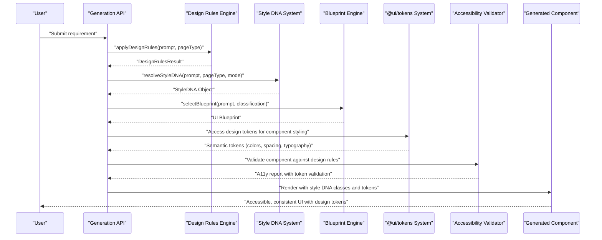
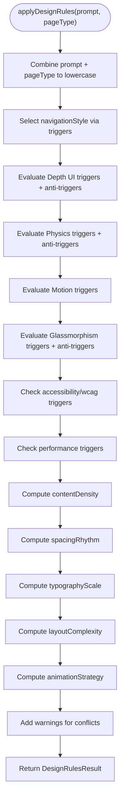
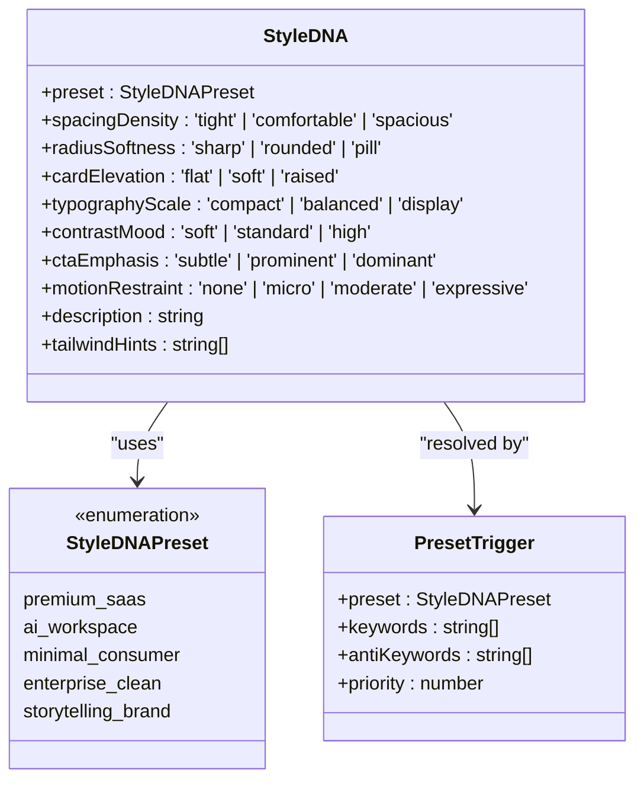
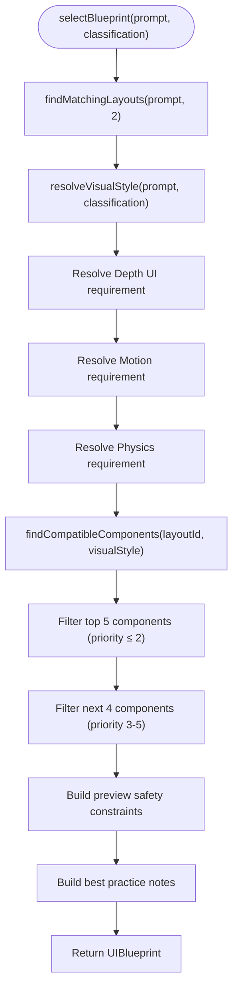
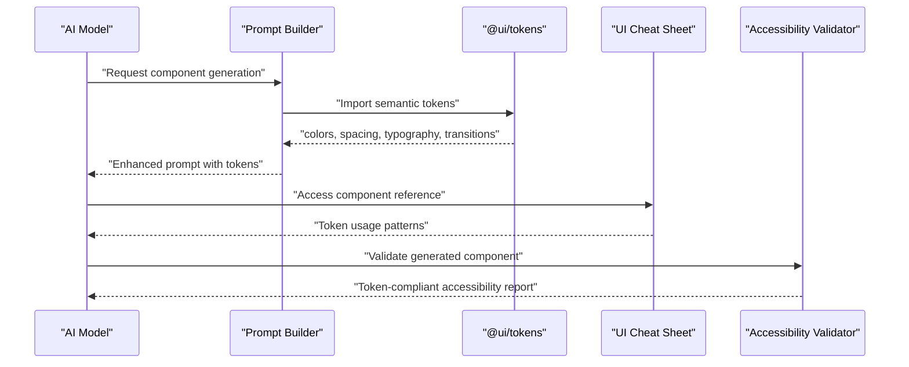
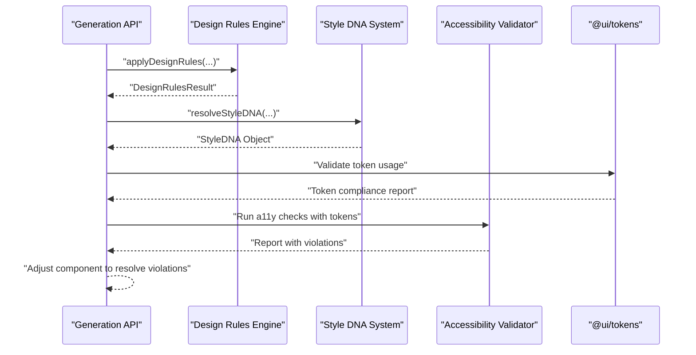
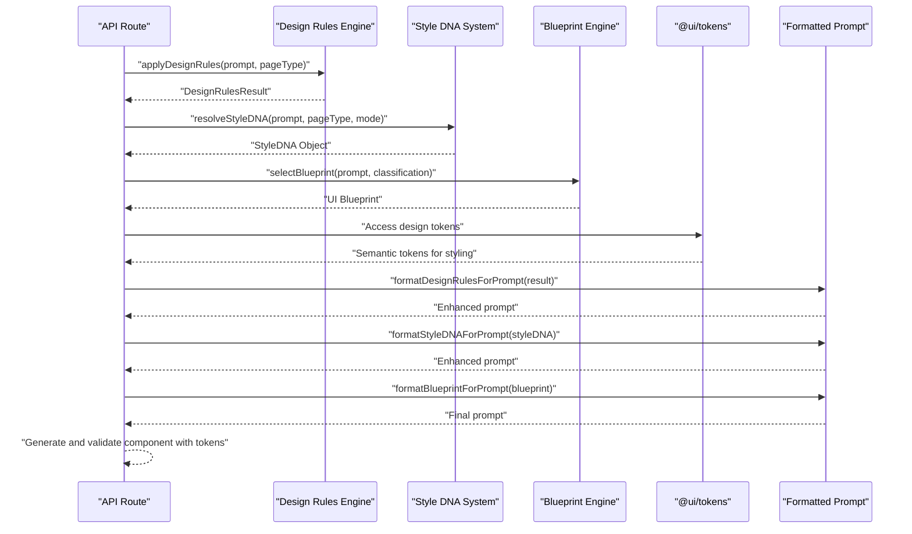

# Design System Integration

<cite>
**Referenced Files in This Document**
- [designRules.ts](file://lib/intelligence/designRules.ts)
- [styleDNA.ts](file://lib/intelligence/styleDNA.ts)
- [blueprintEngine.ts](file://lib/intelligence/blueprintEngine.ts)
- [colors.ts](file://packages/tokens/colors.ts)
- [spacing.ts](file://packages/tokens/spacing.ts)
- [typography.ts](file://packages/tokens/typography.ts)
- [transitions.ts](file://packages/tokens/transitions.ts)
- [index.ts](file://packages/tokens/index.ts)
- [promptBuilder.ts](file://lib/ai/promptBuilder.ts)
- [uiCheatSheet.ts](file://lib/ai/uiCheatSheet.ts)
- [a11yValidator.ts](file://lib/validation/a11yValidator.ts)
- [globals.css](file://app/globals.css)
- [a11yValidator.test.ts](file://__tests__/a11yValidator.test.ts)
- [engine-config/route.ts](file://app/api/engine-config/route.ts)
- [generate/route.ts](file://app/api/generate/route.ts)
- [parse/route.ts](file://app/api/parse/route.ts)
- [think/route.ts](file://app/api/think/route.ts)
- [final-round/route.ts](file://app/api/final-round/route.ts)
- [feedback/route.ts](file://app/api/feedback/route.ts)
- [history/route.ts](file://app/api/history/route.ts)
- [screenshot/route.ts](file://app/api/screenshot/route.ts)
- [vision/route.ts](file://app/api/vision/route.ts)
- [image-to-text/route.ts](file://app/api/image-to-text/route.ts)
- [classify/route.ts](file://app/api/classify/route.ts)
- [models/route.ts](file://app/api/models/route.ts)
- [local-models/route.ts](file://app/api/local-models/route.ts)
- [manifest/route.ts](file://app/api/manifest/route.ts)
- [usage/route.ts](file://app/api/usage/route.ts)
- [chunk/route.ts](file://app/api/chunk/route.ts)
- [projects/[id]/route.ts](file://app/api/projects/[id]/route.ts)
- [projects/[id]/rollback/route.ts](file://app/api/projects/[id]/rollback/route.ts)
- [workspaces/route.ts](file://app/api/workspaces/route.ts)
- [workspace/settings/route.ts](file://app/api/workspace/settings/route.ts)
- [auth/[...nextauth]/route.ts](file://app/api/auth/[...nextauth]/route.ts)
- [auth/forgot-password/route.ts](file://app/api/auth/forgot-password/route.ts)
- [auth/reset-password/route.ts](file://app/api/auth/reset-password/route.ts)
</cite>

## Update Summary
**Changes Made**
- Added comprehensive @ui/tokens design system implementation documentation
- Documented color tokens, spacing tokens, typography tokens, and transition tokens
- Updated Style DNA system to integrate with @ui/tokens design system
- Enhanced design rules framework to leverage design tokens for consistency
- Added @ui/tokens integration with AI ecosystem components
- Updated architecture diagrams to reflect the complete design system integration

## Table of Contents
1. [Introduction](#introduction)
2. [Project Structure](#project-structure)
3. [Core Components](#core-components)
4. [Architecture Overview](#architecture-overview)
5. [Detailed Component Analysis](#detailed-component-analysis)
6. [Design Token System](#design-token-system)
7. [Dependency Analysis](#dependency-analysis)
8. [Performance Considerations](#performance-considerations)
9. [Troubleshooting Guide](#troubleshooting-guide)
10. [Conclusion](#conclusion)
11. [Appendices](#appendices)

## Introduction
This document explains how the comprehensive @ui/tokens design system is integrated and enforced across the platform. The design system now includes a complete token-based approach covering color tokens, spacing tokens, typography tokens, transition tokens, and complete integration with the AI ecosystem. It focuses on:
- The blueprint engine that applies design rules to guide component generation and validation
- The design rules framework that encodes accessibility standards, visual consistency, and composition guidelines
- The style DNA system that maintains design language consistency across generated components using design tokens
- The comprehensive @ui/tokens design system providing semantic color, spacing, typography, and transition tokens
- Theming integration, typography hierarchy enforcement, and color palette management
- Guidance for extending design rules, customizing style DNA, and integrating new design system elements
- How generated components are validated against design system constraints and how violations are surfaced and resolved

**Updated** Added comprehensive @ui/tokens design system implementation including color tokens, spacing tokens, typography tokens, transition tokens, and complete integration with AI ecosystem.

## Project Structure
The design system spans several layers with the new @ui/tokens package providing comprehensive design tokens:
- A central design rules engine that interprets prompts and produces a structured set of design decisions
- A comprehensive style DNA system that defines visual personalities and design constraints using design tokens
- A complete @ui/tokens package providing semantic design tokens for colors, spacing, typography, and transitions
- Global CSS that defines tokens, palettes, and reusable style DNA classes
- API routes that orchestrate generation and validation workflows
- Tests that validate accessibility outcomes

```mermaid
graph TB
subgraph "Intelligence Layer"
DR["designRules.ts<br/>Design Decision Engine"]
SDNA["styleDNA.ts<br/>Style DNA System"]
BE["blueprintEngine.ts<br/>Blueprint Engine"]
end
subgraph "Design Token System"
TOKENS["@ui/tokens<br/>Complete Design Token System"]
COLORS["colors.ts<br/>Semantic Color Tokens"]
SPACING["spacing.ts<br/>Spacing & Layout Tokens"]
TYPO["typography.ts<br/>Typography Tokens"]
TRANS["transitions.ts<br/>Transition Tokens"]
INDEX["index.ts<br/>Token Exports"]
end
subgraph "Presentation Layer"
GCSS["globals.css<br/>Tokens, Palette, Style DNA"]
end
subgraph "AI Ecosystem Integration"
PB["promptBuilder.ts<br/>AI Prompt Integration"]
UCS["uiCheatSheet.ts<br/>Component Reference"]
AV["a11yValidator.ts<br/>Accessibility Validation"]
end
subgraph "API Orchestration"
GEN["generate/route.ts"]
PARSE["parse/route.ts"]
THINK["think/route.ts"]
FR["final-round/route.ts"]
FEED["feedback/route.ts"]
HIST["history/route.ts"]
SCR["screenshot/route.ts"]
VISION["vision/route.ts"]
IMG["image-to-text/route.ts"]
CLASS["classify/route.ts"]
MODELS["models/route.ts"]
LMODELS["local-models/route.ts"]
MAN["manifest/route.ts"]
USAGE["usage/route.ts"]
CHUNK["chunk/route.ts"]
PROJ["projects/[id]/route.ts"]
ROLL["projects/[id]/rollback/route.ts"]
WORKSPACES["workspaces/route.ts"]
WSSET["workspace/settings/route.ts"]
AUTH["auth/[...nextauth]/route.ts"]
FPW["auth/forgot-password/route.ts"]
RPW["auth/reset-password/route.ts"]
end
DR --> GEN
DR --> PARSE
DR --> THINK
DR --> FR
DR --> FEED
DR --> HIST
DR --> SCR
DR --> VISION
DR --> IMG
DR --> CLASS
DR --> MODELS
DR --> LMODELS
DR --> MAN
DR --> USAGE
DR --> CHUNK
DR --> PROJ
DR --> ROLL
DR --> WORKSPACES
DR --> WSSET
DR --> AUTH
DR --> FPW
DR --> RPW
SDNA --> GEN
SDNA --> PARSE
SDNA --> THINK
SDNA --> FR
SDNA --> FEED
SDNA --> HIST
SDNA --> SCR
SDNA --> VISION
SDNA --> IMG
SDNA --> CLASS
SDNA --> MODELS
SDNA --> LMODELS
SDNA --> MAN
SDNA --> USAGE
SDNA --> CHUNK
SDNA --> PROJ
SDNA --> ROLL
SDNA --> WORKSPACES
SDNA --> WSSET
SDNA --> AUTH
SDNA --> FPW
SDNA --> RPW
BE --> GEN
BE --> PARSE
BE --> THINK
BE --> FR
BE --> FEED
BE --> HIST
BE --> SCR
BE --> VISION
BE --> IMG
BE --> CLASS
BE --> MODELS
BE --> LMODELS
BE --> MAN
BE --> USAGE
BE --> CHUNK
BE --> PROJ
BE --> ROLL
BE --> WORKSPACES
BE --> WSSET
BE --> AUTH
BE --> FPW
BE --> RPW
TOKENS --> PB
TOKENS --> UCS
TOKENS --> AV
COLORS --> TOKENS
SPACING --> TOKENS
TYPO --> TOKENS
TRANS --> TOKENS
INDEX --> TOKENS
GCSS -. "Consumed by generated components" .- GEN
GCSS -. "Consumed by generated components" .- PARSE
GCSS -. "Consumed by generated components" .- THINK
GCSS -. "Consumed by generated components" .- FR
GCSS -. "Consumed by generated components" .- FEED
GCSS -. "Consumed by generated components" .- HIST
GCSS -. "Consumed by generated components" .- SCR
GCSS -. "Consumed by generated components" .- VISION
GCSS -. "Consumed by generated components" .- IMG
GCSS -. "Consumed by generated components" .- CLASS
GCSS -. "Consumed by generated components" .- MODELS
GCSS -. "Consumed by generated components" .- LMODELS
GCSS -. "Consumed by generated components" .- MAN
GCSS -. "Consumed by generated components" .- USAGE
GCSS -. "Consumed by generated components" .- CHUNK
GCSS -. "Consumed by generated components" .- PROJ
GCSS -. "Consumed by generated components" .- ROLL
GCSS -. "Consumed by generated components" .- WORKSPACES
GCSS -. "Consumed by generated components" .- WSSET
GCSS -. "Consumed by generated components" .- AUTH
GCSS -. "Consumed by generated components" .- FPW
GCSS -. "Consumed by generated components" .- RPW
```

**Diagram sources**
- [designRules.ts:100-223](file://lib/intelligence/designRules.ts#L100-L223)
- [styleDNA.ts:218-250](file://lib/intelligence/styleDNA.ts#L218-L250)
- [blueprintEngine.ts:122-176](file://lib/intelligence/blueprintEngine.ts#L122-L176)
- [colors.ts:1-137](file://packages/tokens/colors.ts#L1-L137)
- [spacing.ts:1-144](file://packages/tokens/spacing.ts#L1-L144)
- [typography.ts:1-163](file://packages/tokens/typography.ts#L1-L163)
- [transitions.ts:1-106](file://packages/tokens/transitions.ts#L1-L106)
- [index.ts:1-26](file://packages/tokens/index.ts#L1-L26)
- [promptBuilder.ts:77](file://lib/ai/promptBuilder.ts#L77)
- [uiCheatSheet.ts:87-97](file://lib/ai/uiCheatSheet.ts#L87-L97)
- [a11yValidator.ts:173-237](file://lib/validation/a11yValidator.ts#L173-L237)
- [globals.css:3-21](file://app/globals.css#L3-L21)
- [generate/route.ts](file://app/api/generate/route.ts)
- [parse/route.ts](file://app/api/parse/route.ts)
- [think/route.ts](file://app/api/think/route.ts)
- [final-round/route.ts](file://app/api/final-round/route.ts)
- [feedback/route.ts](file://app/api/feedback/route.ts)
- [history/route.ts](file://app/api/history/route.ts)
- [screenshot/route.ts](file://app/api/screenshot/route.ts)
- [vision/route.ts](file://app/api/vision/route.ts)
- [image-to-text/route.ts](file://app/api/image-to-text/route.ts)
- [classify/route.ts](file://app/api/classify/route.ts)
- [models/route.ts](file://app/api/models/route.ts)
- [local-models/route.ts](file://app/api/local-models/route.ts)
- [manifest/route.ts](file://app/api/manifest/route.ts)
- [usage/route.ts](file://app/api/usage/route.ts)
- [chunk/route.ts](file://app/api/chunk/route.ts)
- [projects/[id]/route.ts](file://app/api/projects/[id]/route.ts)
- [projects/[id]/rollback/route.ts](file://app/api/projects/[id]/rollback/route.ts)
- [workspaces/route.ts](file://app/api/workspaces/route.ts)
- [workspace/settings/route.ts](file://app/api/workspace/settings/route.ts)
- [auth/[...nextauth]/route.ts](file://app/api/auth/[...nextauth]/route.ts)
- [auth/forgot-password/route.ts](file://app/api/auth/forgot-password/route.ts)
- [auth/reset-password/route.ts](file://app/api/auth/reset-password/route.ts)

**Section sources**
- [designRules.ts:1-245](file://lib/intelligence/designRules.ts#L1-L245)
- [styleDNA.ts:1-290](file://lib/intelligence/styleDNA.ts#L1-L290)
- [blueprintEngine.ts:1-215](file://lib/intelligence/blueprintEngine.ts#L1-L215)
- [colors.ts:1-137](file://packages/tokens/colors.ts#L1-L137)
- [spacing.ts:1-144](file://packages/tokens/spacing.ts#L1-L144)
- [typography.ts:1-163](file://packages/tokens/typography.ts#L1-L163)
- [transitions.ts:1-106](file://packages/tokens/transitions.ts#L1-L106)
- [index.ts:1-26](file://packages/tokens/index.ts#L1-L26)
- [promptBuilder.ts:77](file://lib/ai/promptBuilder.ts#L77)
- [uiCheatSheet.ts:87-97](file://lib/ai/uiCheatSheet.ts#L87-L97)
- [a11yValidator.ts:173-237](file://lib/validation/a11yValidator.ts#L173-L237)
- [globals.css:1-156](file://app/globals.css#L1-L156)

## Core Components
- Design Rules Engine: Interprets user intent and page type to produce navigation style, layout complexity, motion usage, content density, spacing rhythm, typography scale, and warnings. It also formats a reasoning layer for the generation pipeline.
- Style DNA System: Comprehensive visual personality system that resolves design constraints and Tailwind class hints for consistent component styling using design tokens.
- Blueprint Engine: Assembles UI blueprints with layout specifications, component requirements, and assembly rules for generation.
- @ui/tokens Design System: Complete semantic design token system providing colors, spacing, typography, and transitions for consistent component styling.
- AI Ecosystem Integration: Seamless integration of design tokens into AI-generated components and validation systems.
- API Orchestration: Routes integrate design decisions into generation and validation workflows, ensuring design system constraints are applied consistently.

Key responsibilities:
- Enforce accessibility-first and performance-first heuristics
- Align motion and depth UI usage with content complexity
- Maintain consistent typography and spacing scales using design tokens
- Surface warnings for potentially conflicting design choices
- Resolve visual personalities deterministically from user prompts
- Generate Tailwind class hints for consistent component styling
- Provide semantic design tokens for AI ecosystem components
- Validate design token usage in generated components

**Updated** Enhanced Style DNA system documentation to reflect the current implementation with comprehensive preset definitions and trigger mapping, plus added @ui/tokens design system integration.

**Section sources**
- [designRules.ts:9-32](file://lib/intelligence/designRules.ts#L9-L32)
- [designRules.ts:100-223](file://lib/intelligence/designRules.ts#L100-L223)
- [styleDNA.ts:23-51](file://lib/intelligence/styleDNA.ts#L23-L51)
- [styleDNA.ts:55-160](file://lib/intelligence/styleDNA.ts#L55-L160)
- [blueprintEngine.ts:9-27](file://lib/intelligence/blueprintEngine.ts#L9-L27)
- [blueprintEngine.ts:122-176](file://lib/intelligence/blueprintEngine.ts#L122-L176)
- [colors.ts:1-137](file://packages/tokens/colors.ts#L1-L137)
- [spacing.ts:1-144](file://packages/tokens/spacing.ts#L1-L144)
- [typography.ts:1-163](file://packages/tokens/typography.ts#L1-L163)
- [transitions.ts:1-106](file://packages/tokens/transitions.ts#L1-L106)
- [index.ts:1-26](file://packages/tokens/index.ts#L1-L26)

## Architecture Overview
The design system enforcement architecture connects the design rules engine, style DNA system, blueprint engine, and @ui/tokens design system to generation and validation APIs, with global CSS providing shared style DNA and design tokens.

**Diagram sources**
- [designRules.ts:100-223](file://lib/intelligence/designRules.ts#L100-L223)
- [styleDNA.ts:218-250](file://lib/intelligence/styleDNA.ts#L218-L250)
- [blueprintEngine.ts:122-176](file://lib/intelligence/blueprintEngine.ts#L122-L176)
- [colors.ts:1-137](file://packages/tokens/colors.ts#L1-L137)
- [spacing.ts:1-144](file://packages/tokens/spacing.ts#L1-L144)
- [typography.ts:1-163](file://packages/tokens/typography.ts#L1-L163)
- [transitions.ts:1-106](file://packages/tokens/transitions.ts#L1-L106)
- [a11yValidator.test.ts:1-50](file://__tests__/a11yValidator.test.ts#L1-L50)
- [generate/route.ts](file://app/api/generate/route.ts)

## Detailed Component Analysis

### Design Rules Engine
The engine evaluates prompts and page types to derive a structured set of design decisions. It:
- Selects navigation style based on trigger words
- Determines whether to enable Depth UI, motion, physics, or glassmorphism
- Prioritizes accessibility or performance depending on intent
- Computes content density, spacing rhythm, and typography scale
- Produces a formatted reasoning layer for downstream consumption

**Diagram sources**
- [designRules.ts:100-223](file://lib/intelligence/designRules.ts#L100-L223)

**Section sources**
- [designRules.ts:9-32](file://lib/intelligence/designRules.ts#L9-L32)
- [designRules.ts:38-87](file://lib/intelligence/designRules.ts#L38-L87)
- [designRules.ts:100-223](file://lib/intelligence/designRules.ts#L100-L223)
- [designRules.ts:225-244](file://lib/intelligence/designRules.ts#L225-L244)

### Style DNA System
The Style DNA system provides deterministic visual personality resolution with comprehensive preset definitions and Tailwind class hints, now integrated with @ui/tokens design system:

- **Presets**: Premium SaaS, AI workspace, minimal consumer, enterprise clean, storytelling brand
- **Attributes**: Spacing density, radius softness, card elevation, typography scale, contrast mood, CTA emphasis, motion restraint
- **Resolution Algorithm**: Scores presets against keyword and anti-keyword triggers, with priority-based tie-breaking
- **Tailwind Hints**: Specific class recommendations for consistent styling across components using design tokens
- **Token Integration**: Leverages @ui/tokens for semantic color, spacing, and typography consistency

**Updated** Enhanced documentation to reflect the comprehensive Style DNA system with five distinct presets and detailed attribute definitions, now integrated with @ui/tokens design system.

**Diagram sources**
- [styleDNA.ts:23-51](file://lib/intelligence/styleDNA.ts#L23-L51)
- [styleDNA.ts:55-160](file://lib/intelligence/styleDNA.ts#L55-L160)
- [styleDNA.ts:164-202](file://lib/intelligence/styleDNA.ts#L164-L202)

**Section sources**
- [styleDNA.ts:23-51](file://lib/intelligence/styleDNA.ts#L23-L51)
- [styleDNA.ts:55-160](file://lib/intelligence/styleDNA.ts#L55-L160)
- [styleDNA.ts:164-202](file://lib/intelligence/styleDNA.ts#L164-L202)
- [styleDNA.ts:218-250](file://lib/intelligence/styleDNA.ts#L218-L250)
- [styleDNA.ts:268-289](file://lib/intelligence/styleDNA.ts#L268-L289)

### Blueprint Engine
The Blueprint Engine assembles comprehensive UI blueprints with:
- Layout selection and compatibility matching
- Component requirements and suggestions based on visual style
- Animation density determination and motion library selection
- Assembly rules for component composition
- Preview safety constraints and best practice notes
- Responsive strategy and complexity level specification

**Diagram sources**
- [blueprintEngine.ts:122-176](file://lib/intelligence/blueprintEngine.ts#L122-L176)

**Section sources**
- [blueprintEngine.ts:9-27](file://lib/intelligence/blueprintEngine.ts#L9-L27)
- [blueprintEngine.ts:122-176](file://lib/intelligence/blueprintEngine.ts#L122-L176)
- [blueprintEngine.ts:181-214](file://lib/intelligence/blueprintEngine.ts#L181-L214)

### Style DNA Integration with Design Rules
The Style DNA system integrates with design rules to provide comprehensive visual guidance using design tokens:

- **Deterministic Resolution**: Converts user prompts into specific visual personalities
- **Tailwind Class Hints**: Provides concrete styling guidance for consistent component appearance using @ui/tokens
- **Constraint Enforcement**: Ensures design consistency across all generated components
- **Mode-Specific Bias**: Prefers appropriate aesthetics for component vs depth UI modes
- **Token-Based Styling**: Leverages semantic design tokens for consistent color, spacing, and typography application

**Section sources**
- [styleDNA.ts:218-250](file://lib/intelligence/styleDNA.ts#L218-L250)
- [styleDNA.ts:268-289](file://lib/intelligence/styleDNA.ts#L268-L289)

### Design Token System
The @ui/tokens design system provides comprehensive semantic design tokens for consistent component styling:

#### Color Tokens
- **Brand Colors**: Complete 50-950 scale for primary brand identity
- **Semantic Colors**: Primary, destructive, success, warning, info actions with hover states
- **Surface Hierarchy**: Base, raised, overlay, sunken surfaces for dark theme
- **Text Hierarchy**: Primary, secondary, muted, inverse, and link text colors
- **Borders**: Default, hover, focus, and status-specific border colors
- **Gradients**: Primary, warm, cool, sunset, aurora, midnight, and glass gradients

#### Spacing Tokens
- **Base Unit Scale**: 4px increments from 0 to 384px for consistent spacing
- **Semantic Spacing**: Inline spacing (xs-sm-md-lg), stack spacing (xs-xl-2xl), inset spacing (xs-xl)
- **Layout Tokens**: Page padding, sidebar widths, header/footer heights
- **Border Radius**: 0-24px scale with full pill shape
- **Shadows**: XS to 2XL scale with inner, glow, and specialized effects
- **Z-Index Scale**: Dropdown, sticky, overlay, modal, popover, toast, tooltip, skiplink
- **Breakpoints & Containers**: Responsive design tokens for mobile-first development

#### Typography Tokens
- **Font Families**: Sans-serif, monospace, and display fonts with system fallbacks
- **Font Size Scale**: XS to 7XL scale with precise px/rem measurements
- **Font Weights**: Thin to black scale for semantic typography
- **Letter Spacing**: Tighter to widest scale for typographic refinement
- **Semantic Presets**: H1-H4 headings, body text, captions, labels, overline, and code styles
- **Utility Functions**: toStyle() function for converting presets to CSS properties

#### Transition Tokens
- **Duration Scale**: Instant to slowest with both CSS and JS millisecond values
- **Easing Curves**: Linear, in/out, inOut, spring, smooth, and specialized curves
- **Transition Presets**: Fast, normal, slow, spring, bounce, and smooth transitions
- **Animation Keyframes**: Fade, slide, scale, spin, pulse, bounce, shimmer, and float animations

**Section sources**
- [colors.ts:1-137](file://packages/tokens/colors.ts#L1-L137)
- [spacing.ts:1-144](file://packages/tokens/spacing.ts#L1-L144)
- [typography.ts:1-163](file://packages/tokens/typography.ts#L1-L163)
- [transitions.ts:1-106](file://packages/tokens/transitions.ts#L1-L106)
- [index.ts:1-26](file://packages/tokens/index.ts#L1-L26)

### AI Ecosystem Integration with Design Tokens
The @ui/tokens system integrates seamlessly with the AI ecosystem:

- **Prompt Builder Integration**: Direct import of design tokens for component styling guidance
- **Component Reference**: Comprehensive cheat sheet documenting token usage patterns
- **Accessibility Validation**: Token-aware validation for color contrast and semantic usage
- **Consistent Component Generation**: AI models receive design tokens to ensure consistent styling

**Diagram sources**
- [promptBuilder.ts:77](file://lib/ai/promptBuilder.ts#L77)
- [uiCheatSheet.ts:87-97](file://lib/ai/uiCheatSheet.ts#L87-L97)
- [a11yValidator.ts:173-237](file://lib/validation/a11yValidator.ts#L173-L237)

**Section sources**
- [promptBuilder.ts:77](file://lib/ai/promptBuilder.ts#L77)
- [uiCheatSheet.ts:87-97](file://lib/ai/uiCheatSheet.ts#L87-L97)
- [a11yValidator.ts:173-237](file://lib/validation/a11yValidator.ts#L173-L237)

### Theming Integration and Typography Hierarchy
- Tailwind theme injection binds fonts to CSS variables for consistent typography across components.
- Typography scale is derived from design rules and applied via Tailwind utilities in generated components.
- Color palette is centralized in @ui/tokens and surfaces, ensuring consistent brand expression.
- Global CSS provides comprehensive design tokens and reusable style classes.
- Design tokens integrate with AI ecosystem for consistent component generation.

**Updated** Added @ui/tokens design system integration and comprehensive token-based theming.

**Section sources**
- [globals.css:1-6](file://app/globals.css#L1-L6)
- [globals.css:8-21](file://app/globals.css#L8-L21)
- [designRules.ts:182-186](file://lib/intelligence/designRules.ts#L182-L186)
- [colors.ts:1-137](file://packages/tokens/colors.ts#L1-L137)
- [typography.ts:1-163](file://packages/tokens/typography.ts#L1-L163)

### Accessibility Validation Workflow
- Accessibility checks are performed as part of the validation pipeline.
- The design rules engine surfaces warnings for motion-heavy or performance-intensive combinations, guiding safer defaults.
- Blueprint engine includes WCAG 2.1 AA requirements and best practice notes.
- @ui/tokens provides semantic color tokens for proper contrast validation.
- AI ecosystem validates token usage during component generation.

**Diagram sources**
- [designRules.ts:167-169](file://lib/intelligence/designRules.ts#L167-L169)
- [styleDNA.ts:218-250](file://lib/intelligence/styleDNA.ts#L218-L250)
- [a11yValidator.test.ts:1-50](file://__tests__/a11yValidator.test.ts#L1-L50)
- [colors.ts:1-137](file://packages/tokens/colors.ts#L1-L137)

**Section sources**
- [designRules.ts:156-163](file://lib/intelligence/designRules.ts#L156-L163)
- [designRules.ts:167-169](file://lib/intelligence/designRules.ts#L167-L169)
- [blueprintEngine.ts:150-156](file://lib/intelligence/blueprintEngine.ts#L150-L156)
- [colors.ts:1-137](file://packages/tokens/colors.ts#L1-L137)

### API Orchestration and Design Enforcement
- Generation and related routes consume design decisions to guide component creation.
- The design reasoning layer is formatted and injected into prompts to steer model outputs toward design-consistent results.
- Style DNA objects are resolved and formatted for prompt injection alongside design rules.
- @ui/tokens provides semantic design tokens for consistent component styling.
- AI ecosystem integrates design tokens into component generation and validation.

**Updated** Added @ui/tokens design system integration to the API orchestration workflow and AI ecosystem integration.

**Diagram sources**
- [designRules.ts:225-244](file://lib/intelligence/designRules.ts#L225-L244)
- [styleDNA.ts:268-289](file://lib/intelligence/styleDNA.ts#L268-L289)
- [blueprintEngine.ts:181-214](file://lib/intelligence/blueprintEngine.ts#L181-L214)
- [colors.ts:1-137](file://packages/tokens/colors.ts#L1-L137)
- [generate/route.ts](file://app/api/generate/route.ts)

**Section sources**
- [designRules.ts:225-244](file://lib/intelligence/designRules.ts#L225-L244)
- [styleDNA.ts:268-289](file://lib/intelligence/styleDNA.ts#L268-L289)
- [blueprintEngine.ts:181-214](file://lib/intelligence/blueprintEngine.ts#L181-L214)
- [colors.ts:1-137](file://packages/tokens/colors.ts#L1-L137)
- [engine-config/route.ts](file://app/api/engine-config/route.ts)
- [generate/route.ts](file://app/api/generate/route.ts)
- [parse/route.ts](file://app/api/parse/route.ts)
- [think/route.ts](file://app/api/think/route.ts)
- [final-round/route.ts](file://app/api/final-round/route.ts)
- [feedback/route.ts](file://app/api/feedback/route.ts)
- [history/route.ts](file://app/api/history/route.ts)
- [screenshot/route.ts](file://app/api/screenshot/route.ts)
- [vision/route.ts](file://app/api/vision/route.ts)
- [image-to-text/route.ts](file://app/api/image-to-text/route.ts)
- [classify/route.ts](file://app/api/classify/route.ts)
- [models/route.ts](file://app/api/models/route.ts)
- [local-models/route.ts](file://app/api/local-models/route.ts)
- [manifest/route.ts](file://app/api/manifest/route.ts)
- [usage/route.ts](file://app/api/usage/route.ts)
- [chunk/route.ts](file://app/api/chunk/route.ts)
- [projects/[id]/route.ts](file://app/api/projects/[id]/route.ts)
- [projects/[id]/rollback/route.ts](file://app/api/projects/[id]/rollback/route.ts)
- [workspaces/route.ts](file://app/api/workspaces/route.ts)
- [workspace/settings/route.ts](file://app/api/workspace/settings/route.ts)
- [auth/[...nextauth]/route.ts](file://app/api/auth/[...nextauth]/route.ts)
- [auth/forgot-password/route.ts](file://app/api/auth/forgot-password/route.ts)
- [auth/reset-password/route.ts](file://app/api/auth/reset-password/route.ts)

## Dependency Analysis
- The design rules engine, style DNA system, and blueprint engine are consumed by all generation-related routes.
- @ui/tokens design system provides semantic design tokens for consistent component styling.
- Global CSS is a shared dependency for rendering consistent visuals.
- Accessibility validation is integrated into the pipeline to ensure design system compliance.
- AI ecosystem components depend on @ui/tokens for consistent design token usage.
- Style DNA provides Tailwind class hints that guide component styling consistency.

```mermaid
graph LR
DR["designRules.ts"] --> GEN["generate/route.ts"]
DR --> PARSE["parse/route.ts"]
DR --> THINK["think/route.ts"]
DR --> FR["final-round/route.ts"]
DR --> FEED["feedback/route.ts"]
DR --> HIST["history/route.ts"]
DR --> SCR["screenshot/route.ts"]
DR --> VISION["vision/route.ts"]
DR --> IMG["image-to-text/route.ts"]
DR --> CLASS["classify/route.ts"]
DR --> MODELS["models/route.ts"]
DR --> LMODELS["local-models/route.ts"]
DR --> MAN["manifest/route.ts"]
DR --> USAGE["usage/route.ts"]
DR --> CHUNK["chunk/route.ts"]
DR --> PROJ["projects/[id]/route.ts"]
DR --> ROLL["projects/[id]/rollback/route.ts"]
DR --> WORKSPACES["workspaces/route.ts"]
DR --> WSSET["workspace/settings/route.ts"]
DR --> AUTH["auth/[...nextauth]/route.ts"]
DR --> FPW["auth/forgot-password/route.ts"]
DR --> RPW["auth/reset-password/route.ts"]
SDNA["styleDNA.ts"] --> GEN
SDNA --> PARSE
SDNA --> THINK
SDNA --> FR
SDNA --> FEED
SDNA --> HIST
SDNA --> SCR
SDNA --> VISION
SDNA --> IMG
SDNA --> CLASS
SDNA --> MODELS
SDNA --> LMODELS
SDNA --> MAN
SDNA --> USAGE
SDNA --> CHUNK
SDNA --> PROJ
SDNA --> ROLL
SDNA --> WORKSPACES
SDNA --> WSSET
SDNA --> AUTH
SDNA --> FPW
SDNA --> RPW
BE["blueprintEngine.ts"] --> GEN
BE --> PARSE
BE --> THINK
BE --> FR
BE --> FEED
BE --> HIST
BE --> SCR
BE --> VISION
BE --> IMG
BE --> CLASS
BE --> MODELS
BE --> LMODELS
BE --> MAN
BE --> USAGE
BE --> CHUNK
BE --> PROJ
BE --> ROLL
BE --> WORKSPACES
BE --> WSSET
BE --> AUTH
BE --> FPW
BE --> RPW
TOKENS["@ui/tokens"] --> GEN
TOKENS --> PARSE
TOKENS --> THINK
TOKENS --> FR
TOKENS --> FEED
TOKENS --> HIST
TOKENS --> SCR
TOKENS --> VISION
TOKENS --> IMG
TOKENS --> CLASS
TOKENS --> MODELS
TOKENS --> LMODELS
TOKENS --> MAN
TOKENS --> USAGE
TOKENS --> CHUNK
TOKENS --> PROJ
TOKENS --> ROLL
TOKENS --> WORKSPACES
TOKENS --> WSSET
TOKENS --> AUTH
TOKENS --> FPW
TOKENS --> RPW
GCSS["globals.css"] --> GEN
GCSS --> PARSE
GCSS --> THINK
GCSS --> FR
GCSS --> FEED
GCSS --> HIST
GCSS --> SCR
GCSS --> VISION
GCSS --> IMG
GCSS --> CLASS
GCSS --> MODELS
GCSS --> LMODELS
GCSS --> MAN
GCSS --> USAGE
GCSS --> CHUNK
GCSS --> PROJ
GCSS --> ROLL
GCSS --> WORKSPACES
GCSS --> WSSET
GCSS --> AUTH
GCSS --> FPW
GCSS --> RPW
```

**Updated** Added @ui/tokens design system and AI ecosystem dependencies to the dependency graph.

**Diagram sources**
- [designRules.ts:100-223](file://lib/intelligence/designRules.ts#L100-L223)
- [styleDNA.ts:218-250](file://lib/intelligence/styleDNA.ts#L218-L250)
- [blueprintEngine.ts:122-176](file://lib/intelligence/blueprintEngine.ts#L122-L176)
- [colors.ts:1-137](file://packages/tokens/colors.ts#L1-L137)
- [spacing.ts:1-144](file://packages/tokens/spacing.ts#L1-L144)
- [typography.ts:1-163](file://packages/tokens/typography.ts#L1-L163)
- [transitions.ts:1-106](file://packages/tokens/transitions.ts#L1-L106)
- [globals.css:3-21](file://app/globals.css#L3-L21)
- [generate/route.ts](file://app/api/generate/route.ts)
- [parse/route.ts](file://app/api/parse/route.ts)
- [think/route.ts](file://app/api/think/route.ts)
- [final-round/route.ts](file://app/api/final-round/route.ts)
- [feedback/route.ts](file://app/api/feedback/route.ts)
- [history/route.ts](file://app/api/history/route.ts)
- [screenshot/route.ts](file://app/api/screenshot/route.ts)
- [vision/route.ts](file://app/api/vision/route.ts)
- [image-to-text/route.ts](file://app/api/image-to-text/route.ts)
- [classify/route.ts](file://app/api/classify/route.ts)
- [models/route.ts](file://app/api/models/route.ts)
- [local-models/route.ts](file://app/api/local-models/route.ts)
- [manifest/route.ts](file://app/api/manifest/route.ts)
- [usage/route.ts](file://app/api/usage/route.ts)
- [chunk/route.ts](file://app/api/chunk/route.ts)
- [projects/[id]/route.ts](file://app/api/projects/[id]/route.ts)
- [projects/[id]/rollback/route.ts](file://app/api/projects/[id]/rollback/route.ts)
- [workspaces/route.ts](file://app/api/workspaces/route.ts)
- [workspace/settings/route.ts](file://app/api/workspace/settings/route.ts)
- [auth/[...nextauth]/route.ts](file://app/api/auth/[...nextauth]/route.ts)
- [auth/forgot-password/route.ts](file://app/api/auth/forgot-password/route.ts)
- [auth/reset-password/route.ts](file://app/api/auth/reset-password/route.ts)

**Section sources**
- [designRules.ts:100-223](file://lib/intelligence/designRules.ts#L100-L223)
- [styleDNA.ts:218-250](file://lib/intelligence/styleDNA.ts#L218-L250)
- [blueprintEngine.ts:122-176](file://lib/intelligence/blueprintEngine.ts#L122-L176)
- [colors.ts:1-137](file://packages/tokens/colors.ts#L1-L137)
- [spacing.ts:1-144](file://packages/tokens/spacing.ts#L1-L144)
- [typography.ts:1-163](file://packages/tokens/typography.ts#L1-L163)
- [transitions.ts:1-106](file://packages/tokens/transitions.ts#L1-L106)
- [globals.css:3-21](file://app/globals.css#L3-L21)

## Performance Considerations
- Depth UI and glassmorphism can be performance-intensive; the engine warns when performance-first conflicts with immersive layouts.
- Prefer minimal motion for performance-critical contexts and avoid excessive parallax layers.
- Use transform layers and reduced motion fallbacks to maintain accessibility while preserving performance.
- Style DNA system provides motion restraint settings to balance visual appeal with performance considerations.
- @ui/tokens design system provides efficient semantic tokens for consistent styling without performance overhead.
- AI ecosystem benefits from token-based styling for faster component generation and validation.

**Updated** Added @ui/tokens design system and AI ecosystem performance considerations.

**Section sources**
- [designRules.ts:167-169](file://lib/intelligence/designRules.ts#L167-L169)
- [designRules.ts:147-154](file://lib/intelligence/designRules.ts#L147-L154)
- [styleDNA.ts:46](file://lib/intelligence/styleDNA.ts#L46)
- [colors.ts:1-137](file://packages/tokens/colors.ts#L1-L137)

## Troubleshooting Guide
Common issues and resolutions:
- Conflicting design goals: If performance-first and Depth UI are both enabled, reduce layer count and simplify animations.
- Accessibility violations: Enable accessibility-first mode and ensure focus styles, contrast, and reduced motion support are present.
- Visual inconsistency: Use @ui/tokens semantic design tokens to maintain consistent spacing, typography, and color application.
- Style DNA conflicts: Ensure single visual personality is applied consistently across components.
- Blueprint assembly errors: Follow assembly rules and component compatibility requirements.
- Token usage errors: Ensure @ui/tokens imports are properly configured in the AI ecosystem.
- Design token conflicts: Use semantic tokens consistently across components to avoid visual inconsistencies.

**Updated** Added @ui/tokens design system and AI ecosystem troubleshooting guidance.

**Section sources**
- [designRules.ts:167-169](file://lib/intelligence/designRules.ts#L167-L169)
- [styleDNA.ts:268-289](file://lib/intelligence/styleDNA.ts#L268-L289)
- [blueprintEngine.ts:181-214](file://lib/intelligence/blueprintEngine.ts#L181-L214)
- [a11yValidator.test.ts:1-50](file://__tests__/a11yValidator.test.ts#L1-L50)
- [colors.ts:1-137](file://packages/tokens/colors.ts#L1-L137)

## Conclusion
The design system integration ensures that generated components adhere to a coherent visual language and accessibility standards through the comprehensive @ui/tokens design system. The design rules engine provides a structured decision-making layer, while the comprehensive Style DNA system offers deterministic visual personality resolution using semantic design tokens. The Blueprint Engine coordinates layout and component assembly, and the @ui/tokens design system establishes a reusable design token foundation. Together with validation and warning mechanisms, the system enforces consistency and safety across diverse UI scenarios while providing seamless AI ecosystem integration.

**Updated** Enhanced conclusion to reflect the comprehensive @ui/tokens design system integration and improved design enforcement capabilities.

## Appendices

### Extending Design Rules
- Add new triggers or anti-triggers to existing heuristics to expand supported contexts.
- Introduce new categories (e.g., iconography, layout grids) by extending the result interface and adding evaluation logic.
- Keep warnings actionable and scoped to mitigate performance or accessibility risks.

**Section sources**
- [designRules.ts:38-87](file://lib/intelligence/designRules.ts#L38-L87)
- [designRules.ts:9-32](file://lib/intelligence/designRules.ts#L9-L32)

### Customizing Style DNA
- Modify preset definitions in the Style DNA system to reflect brand updates or new visual personalities.
- Update trigger keywords and anti-keywords to improve preset resolution accuracy.
- Adjust Tailwind class hints to align with evolving design requirements.
- Maintain motion restraint settings to balance visual appeal with performance considerations.
- Integrate @ui/tokens design tokens for consistent semantic styling across presets.

**Updated** Enhanced customization guidance to include comprehensive Style DNA system modifications and @ui/tokens integration.

**Section sources**
- [styleDNA.ts:55-160](file://lib/intelligence/styleDNA.ts#L55-L160)
- [styleDNA.ts:164-202](file://lib/intelligence/styleDNA.ts#L164-L202)
- [styleDNA.ts:218-250](file://lib/intelligence/styleDNA.ts#L218-L250)
- [colors.ts:1-137](file://packages/tokens/colors.ts#L1-L137)

### Integrating New Design System Elements
- Add new CSS utilities or tokens to @ui/tokens package and reference them in generated components.
- Update the design rules engine to recognize new intents and map them to appropriate outputs.
- Extend the Style DNA system with new presets and Tailwind class hints using design tokens.
- Update the blueprint engine to accommodate new component requirements and assembly rules.
- Validate new elements through accessibility tests and adjust warnings accordingly.
- Integrate new design tokens into AI ecosystem components for consistent usage.

**Updated** Added @ui/tokens design system and AI ecosystem integration guidance.

**Section sources**
- [designRules.ts:225-244](file://lib/intelligence/designRules.ts#L225-L244)
- [styleDNA.ts:268-289](file://lib/intelligence/styleDNA.ts#L268-L289)
- [blueprintEngine.ts:181-214](file://lib/intelligence/blueprintEngine.ts#L181-L214)
- [colors.ts:1-137](file://packages/tokens/colors.ts#L1-L137)
- [a11yValidator.test.ts:1-50](file://__tests__/a11yValidator.test.ts#L1-L50)

### Design Token Usage Patterns
Comprehensive usage patterns for @ui/tokens design system:

- **Color Tokens**: Use semantic colors (colors.primary.bg, colors.destructive.hover) for consistent brand application
- **Spacing Tokens**: Use space.* tokens (space.inlineMd, space.stackLg) for consistent layout spacing
- **Typography Tokens**: Use text.* presets (text.h1, text.body) with toStyle() conversion for typography consistency
- **Transition Tokens**: Use transition.* and duration.* tokens for consistent motion patterns
- **Chart Palettes**: Use chartPalette and getChartColor() for data visualization consistency

**Section sources**
- [colors.ts:1-137](file://packages/tokens/colors.ts#L1-L137)
- [spacing.ts:1-144](file://packages/tokens/spacing.ts#L1-L144)
- [typography.ts:1-163](file://packages/tokens/typography.ts#L1-L163)
- [transitions.ts:1-106](file://packages/tokens/transitions.ts#L1-L106)
- [uiCheatSheet.ts:87-97](file://lib/ai/uiCheatSheet.ts#L87-L97)

### Style DNA Preset Definitions
Comprehensive visual personality definitions for consistent component styling using design tokens:

- **Premium SaaS**: Dark, precise, and trusted aesthetic with high contrast and subtle depth using @ui/tokens brand colors
- **AI Workspace**: Dense, functional, tool-first design with monospace-friendly typography using @ui/tokens spacing and typography
- **Minimal Consumer**: Clean, whitespace-forward design with large typography and rounded elements using @ui/tokens surface hierarchy
- **Enterprise Clean**: Predictable, content-forward design with structured grids and professional colors using @ui/tokens semantic colors
- **Storytelling Brand**: Editorial, motion-rich design with bold typography and cinematic animations using @ui/tokens gradients and transitions

Each preset includes detailed Tailwind class hints, spacing guidelines, and motion restrictions using @ui/tokens design tokens to ensure consistent visual identity across generated components.

**Section sources**
- [styleDNA.ts:55-160](file://lib/intelligence/styleDNA.ts#L55-L160)
- [styleDNA.ts:268-289](file://lib/intelligence/styleDNA.ts#L268-L289)
- [colors.ts:1-137](file://packages/tokens/colors.ts#L1-L137)
- [spacing.ts:1-144](file://packages/tokens/spacing.ts#L1-L144)
- [typography.ts:1-163](file://packages/tokens/typography.ts#L1-L163)
- [transitions.ts:1-106](file://packages/tokens/transitions.ts#L1-L106)