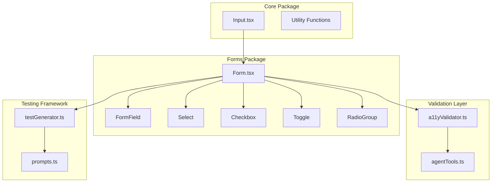
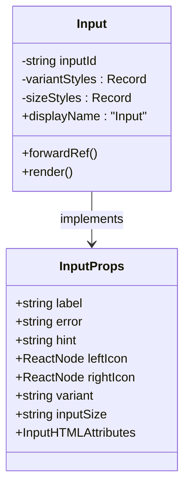
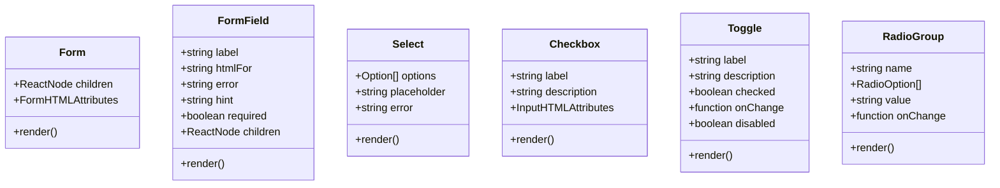
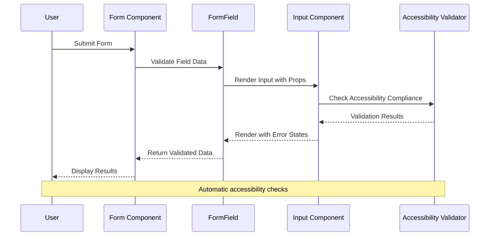
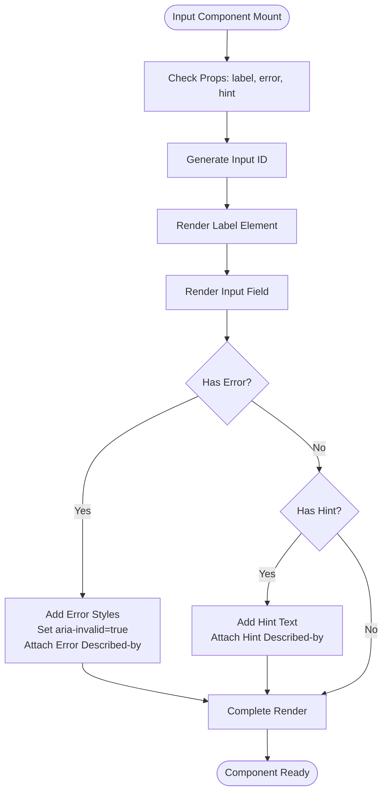
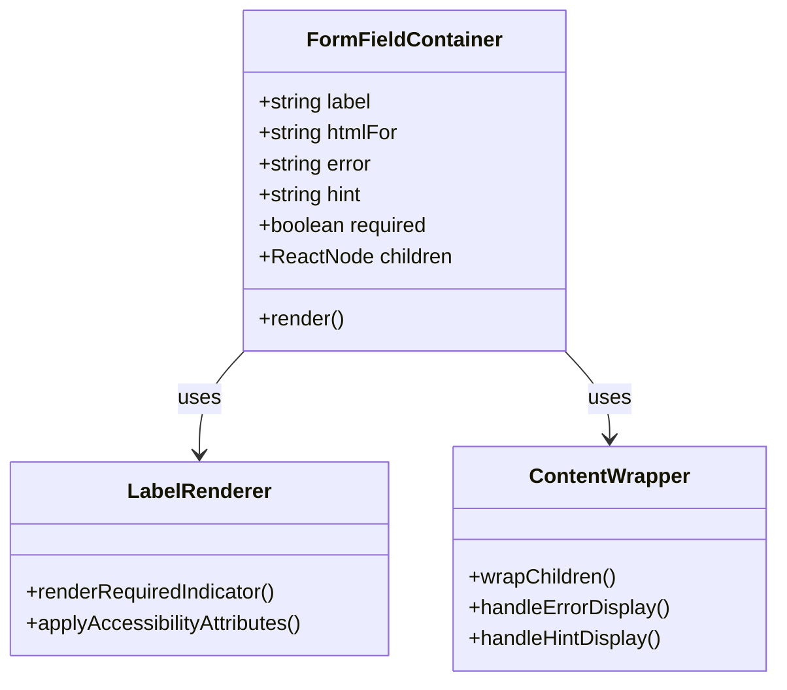
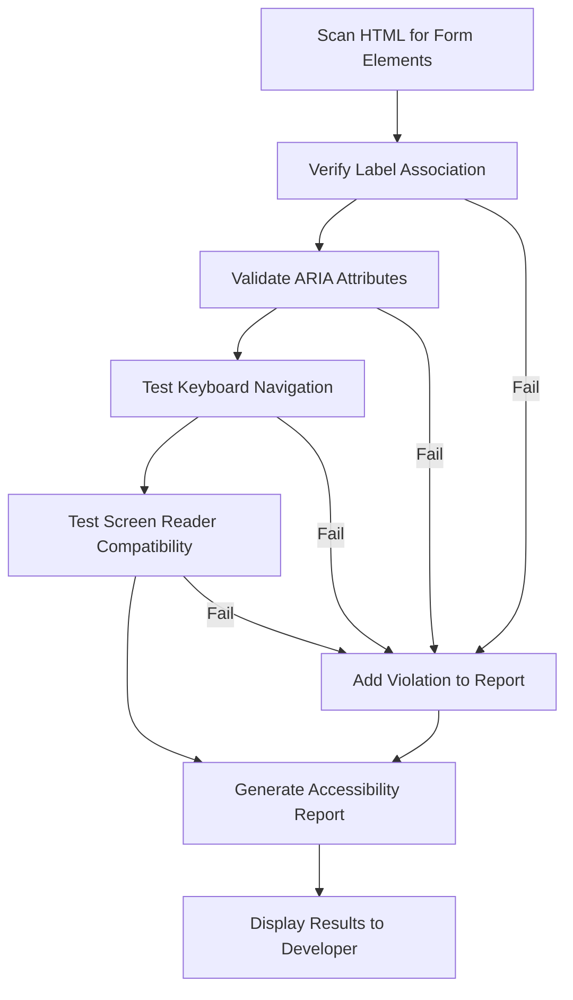
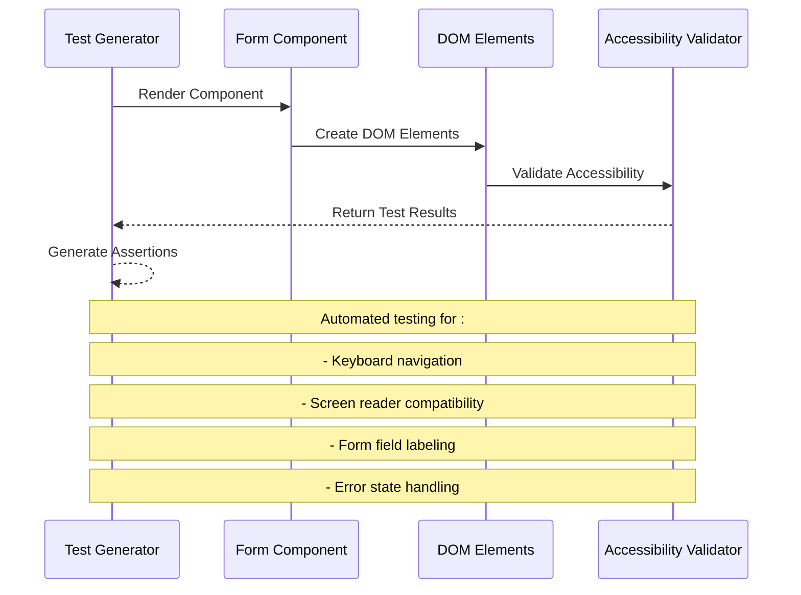
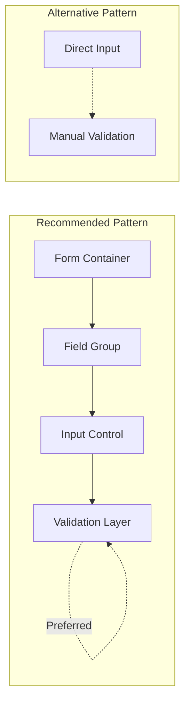

# Enhanced Form Controls

<cite>
**Referenced Files in This Document**
- [Input.tsx](file://packages/core/components/Input.tsx)
- [Form.tsx](file://packages/forms/components/Form.tsx)
- [index.ts](file://packages/forms/index.ts)
- [a11yValidator.ts](file://lib/validation/a11yValidator.ts)
- [agentTools.ts](file://lib/ai/agentTools.ts)
- [prompts.ts](file://lib/ai/prompts.ts)
- [testGenerator.ts](file://lib/testGenerator.ts)
</cite>

## Table of Contents
1. [Introduction](#introduction)
2. [Project Structure](#project-structure)
3. [Core Components](#core-components)
4. [Architecture Overview](#architecture-overview)
5. [Detailed Component Analysis](#detailed-component-analysis)
6. [Accessibility Integration](#accessibility-integration)
7. [Testing Framework](#testing-framework)
8. [Performance Considerations](#performance-considerations)
9. [Implementation Guidelines](#implementation-guidelines)
10. [Conclusion](#conclusion)

## Introduction

The Enhanced Form Controls system represents a comprehensive accessibility-first approach to building form interfaces in modern web applications. This system prioritizes inclusive design principles, WCAG compliance, and seamless user experiences while maintaining clean, maintainable code architecture.

The system consists of two primary packages: the core Input component and the forms package containing specialized form controls. These components work together to provide developers with robust, accessible form solutions that automatically handle error states, labeling, and assistive technology integration.

## Project Structure

The Enhanced Form Controls system is organized into a modular package structure designed for scalability and maintainability:

**Diagram sources**
- [Input.tsx:1-81](file://packages/core/components/Input.tsx#L1-L81)
- [Form.tsx:1-165](file://packages/forms/components/Form.tsx#L1-L165)

**Section sources**
- [Input.tsx:1-81](file://packages/core/components/Input.tsx#L1-L81)
- [Form.tsx:1-165](file://packages/forms/components/Form.tsx#L1-L165)

## Core Components

### Input Component

The Input component serves as the foundation for all form field implementations, providing comprehensive accessibility features and customizable styling options.

**Diagram sources**
- [Input.tsx:4-12](file://packages/core/components/Input.tsx#L4-L12)
- [Input.tsx:26-81](file://packages/core/components/Input.tsx#L26-L81)

The Input component supports three distinct variants:
- **Default**: Traditional bordered input with blue focus rings
- **Filled**: Solid background with hover effects
- **Ghost**: Minimal styling with bottom border only

**Section sources**
- [Input.tsx:14-24](file://packages/core/components/Input.tsx#L14-L24)
- [Input.tsx:26-81](file://packages/core/components/Input.tsx#L26-L81)

### Form Control Suite

The forms package provides specialized components for complex form interactions:

**Diagram sources**
- [Form.tsx:8-14](file://packages/forms/components/Form.tsx#L8-L14)
- [Form.tsx:26-38](file://packages/forms/components/Form.tsx#L26-L38)
- [Form.tsx:46-64](file://packages/forms/components/Form.tsx#L46-L64)
- [Form.tsx:71-91](file://packages/forms/components/Form.tsx#L71-L91)
- [Form.tsx:103-133](file://packages/forms/components/Form.tsx#L103-L133)
- [Form.tsx:143-165](file://packages/forms/components/Form.tsx#L143-L165)

**Section sources**
- [Form.tsx:16-38](file://packages/forms/components/Form.tsx#L16-L38)
- [Form.tsx:40-64](file://packages/forms/components/Form.tsx#L40-L64)
- [Form.tsx:66-91](file://packages/forms/components/Form.tsx#L66-L91)
- [Form.tsx:93-133](file://packages/forms/components/Form.tsx#L93-L133)
- [Form.tsx:135-165](file://packages/forms/components/Form.tsx#L135-L165)

## Architecture Overview

The Enhanced Form Controls system follows a layered architecture that separates concerns between presentation, accessibility, and validation:

**Diagram sources**
- [Form.tsx:8-14](file://packages/forms/components/Form.tsx#L8-L14)
- [Input.tsx:26-81](file://packages/core/components/Input.tsx#L26-L81)
- [a11yValidator.ts:19-48](file://lib/validation/a11yValidator.ts#L19-L48)

The architecture ensures that accessibility is built-in rather than bolted-on, providing automatic compliance checking and error reporting throughout the form lifecycle.

## Detailed Component Analysis

### Input Component Implementation

The Input component demonstrates sophisticated state management and accessibility integration:

**Diagram sources**
- [Input.tsx:27-78](file://packages/core/components/Input.tsx#L27-L78)

**Section sources**
- [Input.tsx:26-81](file://packages/core/components/Input.tsx#L26-L81)

### FormField Container Pattern

The FormField component provides a container pattern that standardizes form field layouts and accessibility:

**Diagram sources**
- [Form.tsx:26-38](file://packages/forms/components/Form.tsx#L26-L38)

**Section sources**
- [Form.tsx:16-38](file://packages/forms/components/Form.tsx#L16-L38)

### Advanced Form Controls

Each form control type implements specific accessibility patterns:

#### Checkbox Implementation
- Uses proper ARIA attributes (`aria-checked`)
- Supports keyboard navigation
- Provides visual feedback for focus states
- Includes optional description text

#### Toggle Switch
- Implements role="switch" pattern
- Handles disabled states gracefully
- Provides smooth transitions for state changes
- Supports programmatic control via onChange callback

#### Radio Group
- Manages group-level state through name attribute
- Implements proper radio group semantics
- Supports keyboard navigation within groups
- Provides visual hierarchy for options

**Section sources**
- [Form.tsx:71-91](file://packages/forms/components/Form.tsx#L71-L91)
- [Form.tsx:103-133](file://packages/forms/components/Form.tsx#L103-L133)
- [Form.tsx:143-165](file://packages/forms/components/Form.tsx#L143-L165)

## Accessibility Integration

The system incorporates comprehensive accessibility validation through multiple layers:

### Built-in Validation Rules

The accessibility validator enforces critical form accessibility requirements:

**Diagram sources**
- [a11yValidator.ts:19-48](file://lib/validation/a11yValidator.ts#L19-L48)

### AI-Powered Accessibility Guidance

The system leverages AI to provide intelligent accessibility recommendations:

**Section sources**
- [a11yValidator.ts:19-48](file://lib/validation/a11yValidator.ts#L19-L48)
- [agentTools.ts:137-157](file://lib/ai/agentTools.ts#L137-L157)
- [prompts.ts:43-68](file://lib/ai/prompts.ts#L43-L68)

## Testing Framework

The Enhanced Form Controls system includes comprehensive testing infrastructure:

### Automated Accessibility Testing

**Diagram sources**
- [testGenerator.ts:131-170](file://lib/testGenerator.ts#L131-L170)

**Section sources**
- [testGenerator.ts:131-170](file://lib/testGenerator.ts#L131-L170)

## Performance Considerations

The Enhanced Form Controls system is optimized for performance through several key strategies:

### Component Optimization
- **Forward Ref Usage**: Enables efficient DOM access without re-renders
- **Memoized Style Objects**: Reduces style computation overhead
- **Conditional Rendering**: Only renders error and hint elements when needed
- **CSS Class Composition**: Uses utility-first approach for minimal CSS overhead

### Accessibility Performance
- **Lazy Validation**: Only validates on user interaction or form submission
- **Efficient DOM Queries**: Minimizes DOM traversal for accessibility checks
- **Event Delegation**: Optimizes event handling for multiple form controls

## Implementation Guidelines

### Best Practices for Form Implementation

1. **Always Include Labels**: Every form field should have an associated label
2. **Provide Clear Error Messages**: Use descriptive error text that helps users understand corrections
3. **Support Keyboard Navigation**: Ensure all form controls are accessible via keyboard
4. **Maintain Focus Management**: Provide clear visual focus indicators
5. **Use Semantic HTML**: Leverage appropriate HTML elements for form controls

### Integration Patterns

**Section sources**
- [Form.tsx:8-14](file://packages/forms/components/Form.tsx#L8-L14)
- [Input.tsx:26-81](file://packages/core/components/Input.tsx#L26-L81)

## Conclusion

The Enhanced Form Controls system represents a comprehensive solution for building accessible, user-friendly forms in modern web applications. By integrating accessibility validation, comprehensive form controls, and automated testing, the system ensures that form interfaces meet WCAG guidelines while maintaining excellent user experience.

The modular architecture allows for easy extension and customization while the built-in accessibility features provide peace of mind that form interfaces will work for all users. The combination of manual controls, AI-powered guidance, and automated testing creates a robust development workflow that prioritizes inclusivity from the ground up.

Future enhancements could include additional form control types, advanced validation patterns, and integration with popular form libraries like Formik or React Hook Form. The current architecture provides a solid foundation for such extensions while maintaining backward compatibility and performance standards.