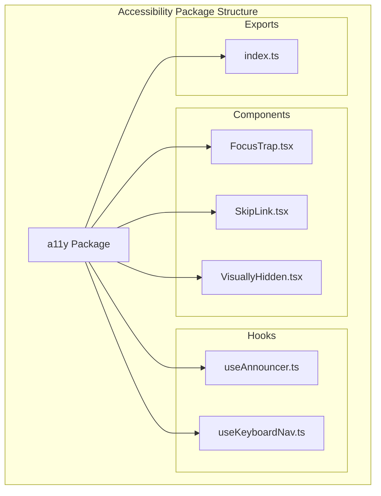
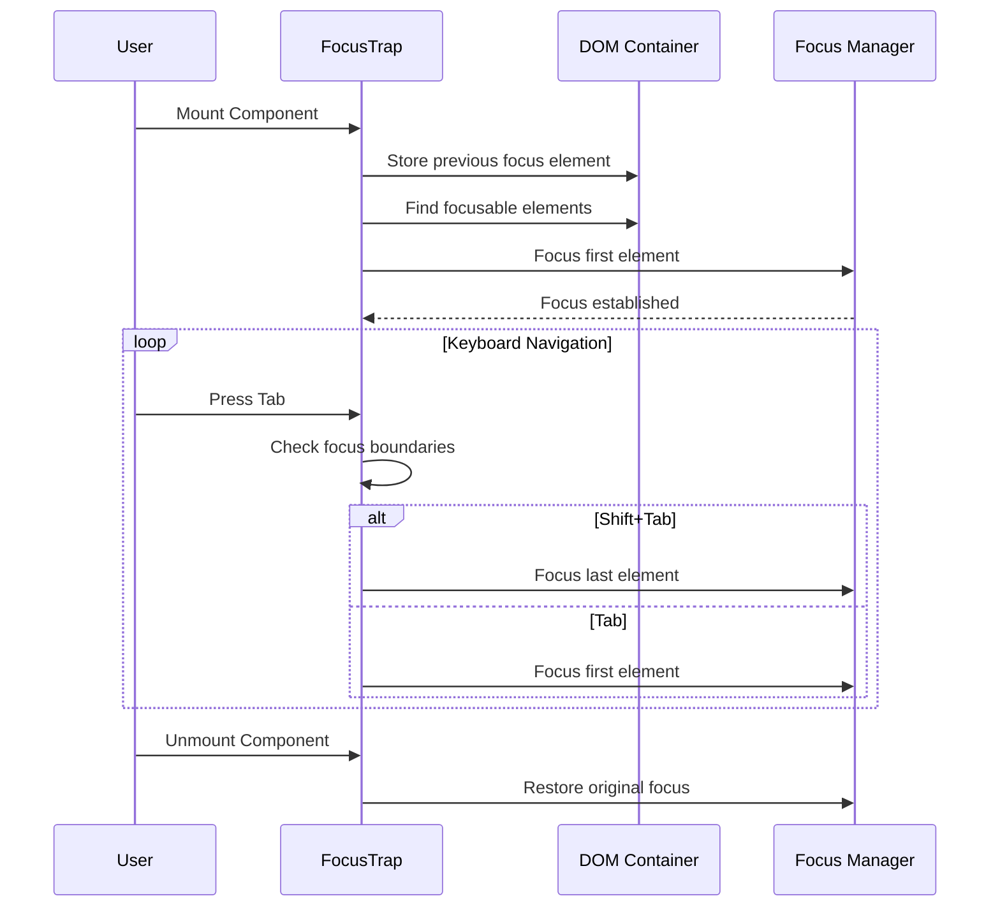
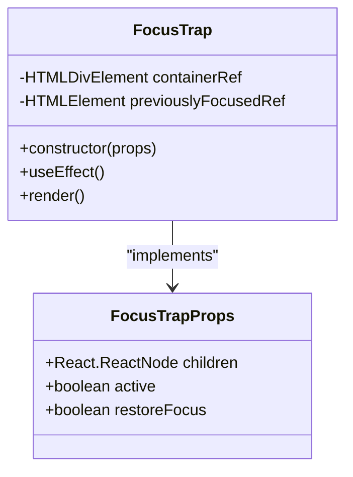
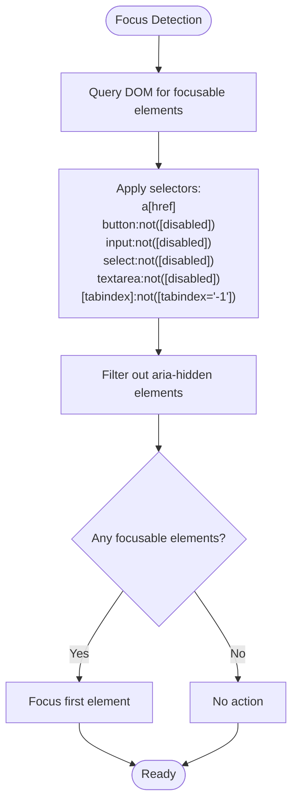
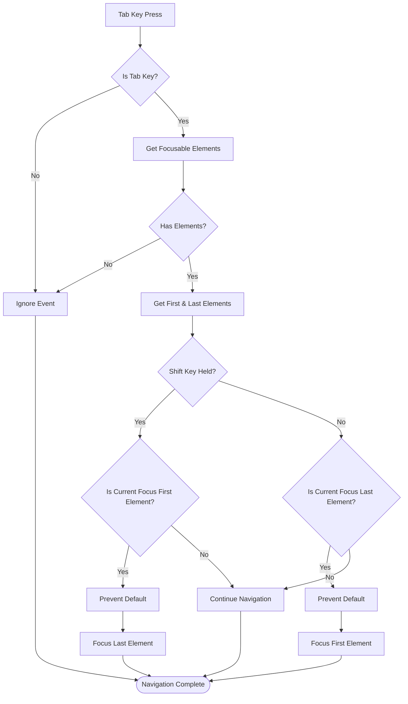
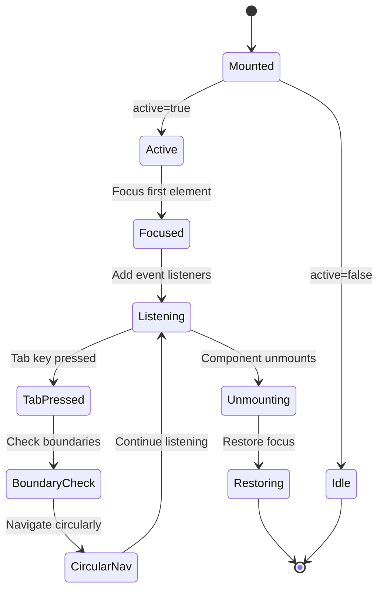
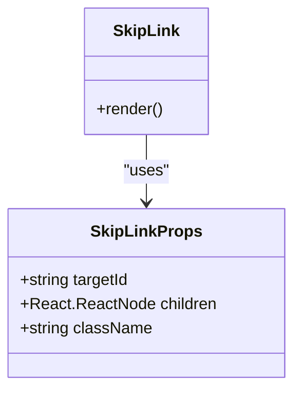
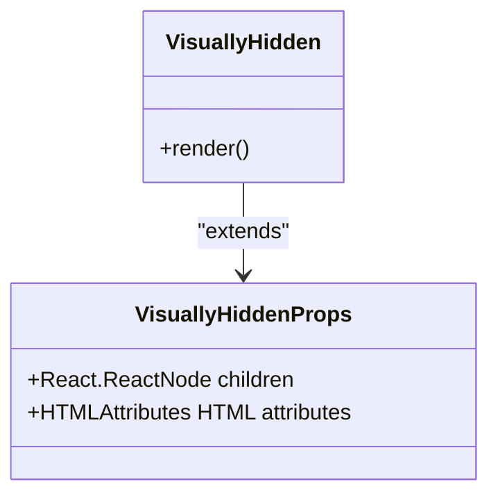
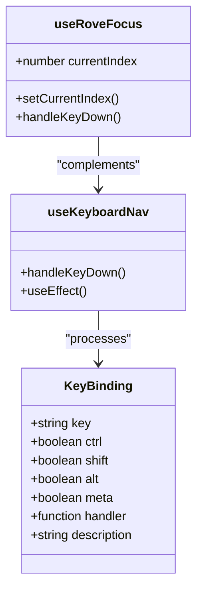
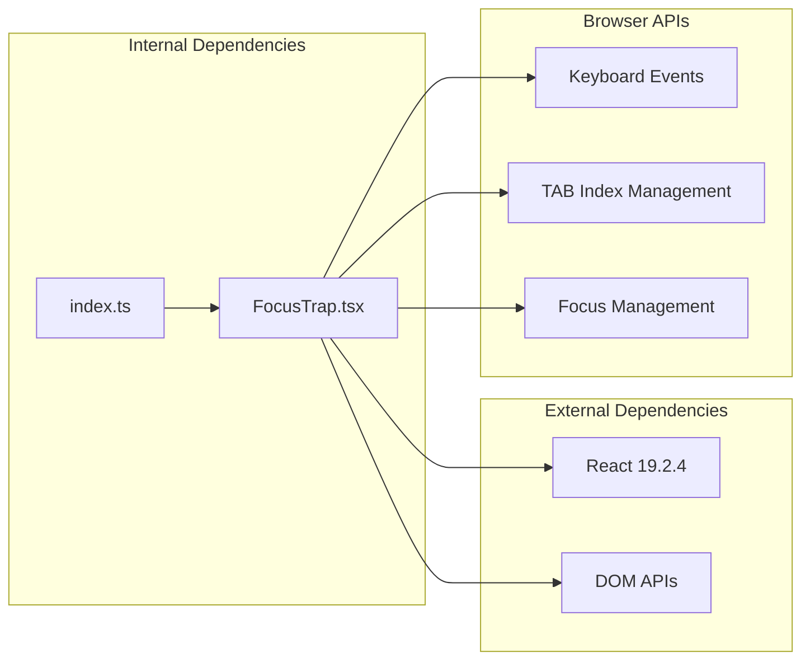

# Focus Trap Component

<cite>
**Referenced Files in This Document**
- [FocusTrap.tsx](file://packages/a11y/components/FocusTrap.tsx)
- [index.ts](file://packages/a11y/index.ts)
- [SkipLink.tsx](file://packages/a11y/components/SkipLink.tsx)
- [VisuallyHidden.tsx](file://packages/a11y/components/VisuallyHidden.tsx)
- [useAnnouncer.ts](file://packages/a11y/hooks/useAnnouncer.ts)
- [useKeyboardNav.ts](file://packages/a11y/hooks/useKeyboardNav.ts)
</cite>

## Table of Contents
1. [Introduction](#introduction)
2. [Project Structure](#project-structure)
3. [Core Components](#core-components)
4. [Architecture Overview](#architecture-overview)
5. [Detailed Component Analysis](#detailed-component-analysis)
6. [Dependency Analysis](#dependency-analysis)
7. [Performance Considerations](#performance-considerations)
8. [Troubleshooting Guide](#troubleshooting-guide)
9. [Conclusion](#conclusion)

## Introduction

The Focus Trap Component is a crucial accessibility utility designed to manage keyboard navigation within modal dialogs, dropdown menus, and other overlay containers. This component ensures that users can only navigate between interactive elements within the trapped area, preventing focus from escaping to elements outside the designated container. The implementation follows WCAG guidelines for modal dialog accessibility and provides seamless keyboard navigation experiences for assistive technology users.

The component operates by automatically focusing the first interactive element when activated and trapping subsequent Tab key presses between the first and last focusable elements within the container. It also handles proper focus restoration when the component is deactivated.

## Project Structure

The Focus Trap Component is part of the accessibility toolkit located in the `packages/a11y` directory. This package provides a collection of accessibility utilities and components that enhance the overall accessibility of the application.

**Diagram sources**
- [index.ts:1-6](file://packages/a11y/index.ts#L1-L6)
- [FocusTrap.tsx:1-66](file://packages/a11y/components/FocusTrap.tsx#L1-L66)

**Section sources**
- [index.ts:1-6](file://packages/a11y/index.ts#L1-L6)

## Core Components

The accessibility package consists of several interconnected components that work together to provide comprehensive keyboard navigation and focus management:

### FocusTrap Component
The primary focus trap implementation that manages keyboard navigation within a specified container area.

### Supporting Accessibility Components
- **SkipLink**: Provides quick navigation to main content areas
- **VisuallyHidden**: Hides content visually while keeping it accessible to screen readers
- **useAnnouncer**: Manages ARIA live regions for dynamic content announcements
- **useKeyboardNav**: Handles global keyboard shortcuts and navigation patterns

**Section sources**
- [FocusTrap.tsx:3-7](file://packages/a11y/components/FocusTrap.tsx#L3-L7)
- [SkipLink.tsx:3-7](file://packages/a11y/components/SkipLink.tsx#L3-L7)
- [VisuallyHidden.tsx:3-5](file://packages/a11y/components/VisuallyHidden.tsx#L3-L5)
- [useAnnouncer.ts:3-39](file://packages/a11y/hooks/useAnnouncer.ts#L3-L39)
- [useKeyboardNav.ts:4-12](file://packages/a11y/hooks/useKeyboardNav.ts#L4-L12)

## Architecture Overview

The Focus Trap Component follows a React-based architecture with automatic focus management and lifecycle handling. The component integrates deeply with the browser's focus management system while maintaining clean separation of concerns.

**Diagram sources**
- [FocusTrap.tsx:9-65](file://packages/a11y/components/FocusTrap.tsx#L9-L65)

The component architecture demonstrates several key design patterns:

1. **Automatic Focus Management**: The component automatically detects and focuses the first interactive element when mounted
2. **Boundary Enforcement**: Tab key navigation is constrained between the first and last focusable elements
3. **Focus Restoration**: Original focus is restored when the component is unmounted
4. **Conditional Activation**: The component can be activated/deactivated based on props

## Detailed Component Analysis

### FocusTrap Component Implementation

The FocusTrap component is implemented as a React functional component with sophisticated focus management capabilities.

#### Component Interface and Props

**Diagram sources**
- [FocusTrap.tsx:3-7](file://packages/a11y/components/FocusTrap.tsx#L3-L7)
- [FocusTrap.tsx:9-11](file://packages/a11y/components/FocusTrap.tsx#L9-L11)

#### Focus Detection Algorithm

The component uses a comprehensive selector to identify focusable elements within the container:

**Diagram sources**
- [FocusTrap.tsx:20-25](file://packages/a11y/components/FocusTrap.tsx#L20-L25)

#### Tab Key Navigation Logic

The tab key handling implements circular navigation between focusable elements:

**Diagram sources**
- [FocusTrap.tsx:33-52](file://packages/a11y/components/FocusTrap.tsx#L33-L52)

#### Lifecycle Management

The component implements proper cleanup and focus restoration:

**Diagram sources**
- [FocusTrap.tsx:13-62](file://packages/a11y/components/FocusTrap.tsx#L13-L62)

**Section sources**
- [FocusTrap.tsx:9-65](file://packages/a11y/components/FocusTrap.tsx#L9-L65)

### Supporting Components

#### SkipLink Component

Provides quick navigation to main content areas for keyboard users:

**Diagram sources**
- [SkipLink.tsx:3-18](file://packages/a11y/components/SkipLink.tsx#L3-L18)

#### VisuallyHidden Component

Creates content that is visually hidden but accessible to screen readers:

**Diagram sources**
- [VisuallyHidden.tsx:3-26](file://packages/a11y/components/VisuallyHidden.tsx#L3-L26)

#### Hook Ecosystem

The accessibility package includes supporting hooks for advanced keyboard navigation:

**Diagram sources**
- [useKeyboardNav.ts:4-37](file://packages/a11y/hooks/useKeyboardNav.ts#L4-L37)
- [useKeyboardNav.ts:39-65](file://packages/a11y/hooks/useKeyboardNav.ts#L39-L65)

**Section sources**
- [SkipLink.tsx:9-18](file://packages/a11y/components/SkipLink.tsx#L9-L18)
- [VisuallyHidden.tsx:7-26](file://packages/a11y/components/VisuallyHidden.tsx#L7-L26)
- [useKeyboardNav.ts:14-37](file://packages/a11y/hooks/useKeyboardNav.ts#L14-L37)
- [useKeyboardNav.ts:39-65](file://packages/a11y/hooks/useKeyboardNav.ts#L39-L65)

## Dependency Analysis

The Focus Trap Component has minimal external dependencies and integrates seamlessly with the React ecosystem:

**Diagram sources**
- [FocusTrap.tsx:1](file://packages/a11y/components/FocusTrap.tsx#L1)
- [index.ts:1](file://packages/a11y/index.ts#L1)

The component relies on standard web APIs for focus management and integrates with React's lifecycle methods for proper cleanup. The implementation avoids third-party dependencies to maintain reliability and reduce bundle size.

**Section sources**
- [package.json:37-38](file://package.json#L37-L38)

## Performance Considerations

The Focus Trap Component is optimized for performance through several key strategies:

### Efficient DOM Queries
- Uses `querySelectorAll` with optimized selectors to minimize DOM traversal
- Caches focusable elements during the component lifecycle
- Filters elements efficiently using array methods

### Request Animation Frame Usage
- Deferries focus operations to the next animation frame to prevent layout thrashing
- Ensures smooth user experience during focus transitions

### Event Listener Management
- Properly cleans up event listeners on component unmount
- Uses memoized callback functions to prevent unnecessary re-renders

### Conditional Activation
- Respects the `active` prop to avoid unnecessary computations when inactive
- Allows selective focus management based on component state

## Troubleshooting Guide

### Common Issues and Solutions

#### Focus Not Moving to First Element
**Symptoms**: Component mounts but focus remains unchanged
**Causes**: 
- No focusable elements in the container
- Container reference not properly set
- Disabled elements interfering with detection

**Solutions**:
- Verify container contains interactive elements
- Ensure proper ref assignment
- Check for disabled or aria-hidden elements

#### Tab Navigation Breaking Out of Container
**Symptoms**: Tab key allows navigation outside container bounds
**Causes**:
- Focusable elements outside container
- Incorrect container reference
- Dynamic content changes not accounted for

**Solutions**:
- Restrict container content to intended elements
- Re-query focusable elements after dynamic updates
- Use proper container scoping

#### Focus Restoration Issues
**Symptoms**: Previous focus not restored after component unmount
**Causes**:
- Component unmounts before initial focus is set
- Previous focus element no longer exists
- Multiple focus traps active simultaneously

**Solutions**:
- Ensure proper component lifecycle management
- Verify previous focus element validity
- Coordinate multiple focus traps carefully

#### Performance Degradation
**Symptoms**: Slow response to keyboard events or focus changes
**Causes**:
- Excessive DOM queries
- Unoptimized selector usage
- Memory leaks from event listeners

**Solutions**:
- Cache focusable elements appropriately
- Use efficient selector patterns
- Ensure proper cleanup in useEffect return

**Section sources**
- [FocusTrap.tsx:13-62](file://packages/a11y/components/FocusTrap.tsx#L13-L62)

## Conclusion

The Focus Trap Component represents a robust solution for managing keyboard navigation in complex UI applications. Its implementation demonstrates best practices in accessibility engineering, combining automatic focus management with precise boundary enforcement and graceful cleanup.

The component's architecture supports both simple and advanced use cases, from basic modal dialogs to complex nested focus management scenarios. The accompanying accessibility utilities provide a comprehensive toolkit for building inclusive user interfaces.

Key strengths of the implementation include:
- **WCAG Compliance**: Follows established accessibility standards
- **Performance Optimization**: Minimizes DOM manipulation and memory usage
- **Developer Experience**: Simple API with powerful functionality
- **Integration Ready**: Works seamlessly with existing React applications
- **Maintainable Code**: Clean architecture with clear separation of concerns

The Focus Trap Component serves as a foundation for accessible modal dialogs, dropdown menus, and other overlay interfaces, ensuring that keyboard users can navigate complex application interfaces with confidence and ease.