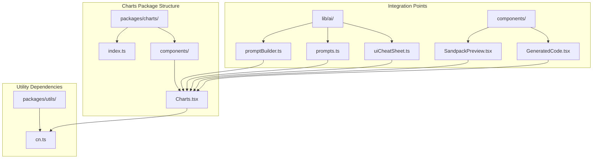
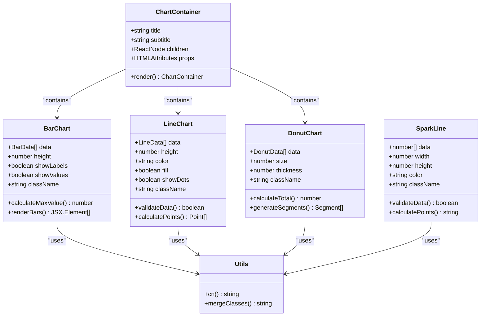
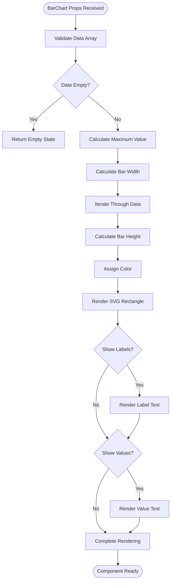
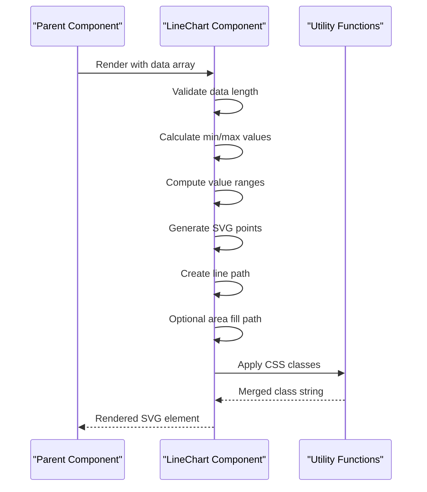
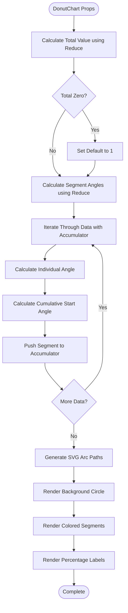
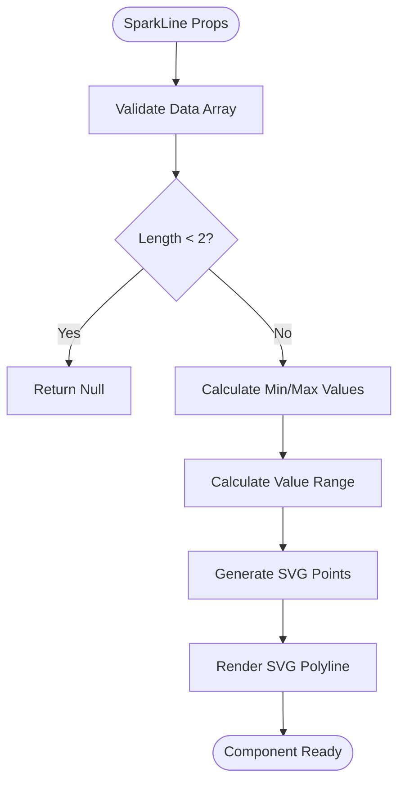
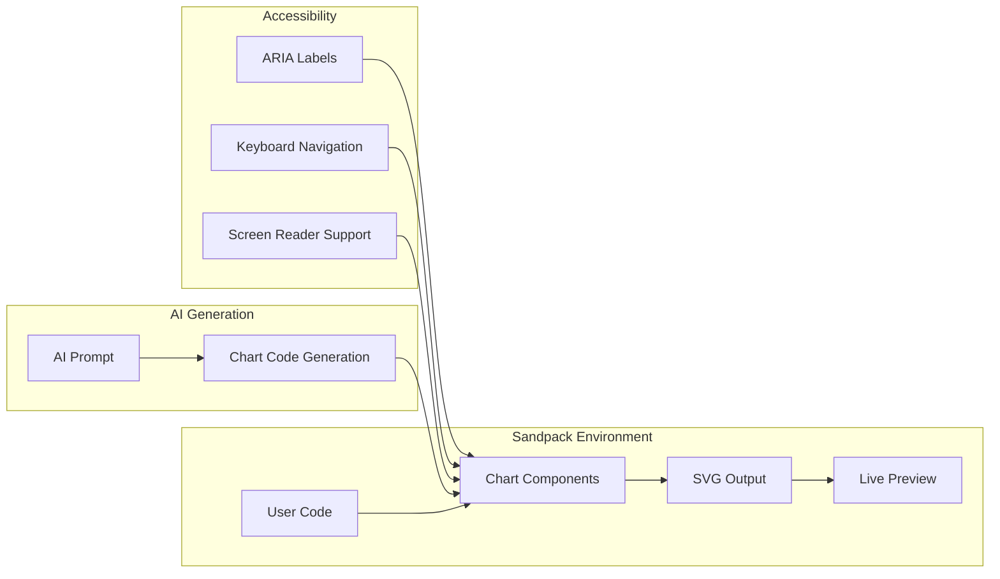

# Functional Chart Components

<cite>
**Referenced Files in This Document**
- [Charts.tsx](file://packages/charts/components/Charts.tsx)
- [index.ts](file://packages/charts/index.ts)
- [cn.ts](file://packages/utils/cn.ts)
- [SandpackPreview.tsx](file://components/SandpackPreview.tsx)
- [GeneratedCode.tsx](file://components/GeneratedCode.tsx)
- [promptBuilder.ts](file://lib/ai/promptBuilder.ts)
- [prompts.ts](file://lib/ai/prompts.ts)
- [uiCheatSheet.ts](file://lib/ai/uiCheatSheet.ts)
</cite>

## Update Summary
**Changes Made**
- Updated DonutChart component implementation details to reflect the fix for cumulativeAngle reassignment issue
- Revised DonutChart algorithm explanation to clarify the use of reduce operation for proper angle calculation
- Enhanced troubleshooting guidance for DonutChart rendering reliability improvements

## Table of Contents
1. [Introduction](#introduction)
2. [Project Structure](#project-structure)
3. [Core Components](#core-components)
4. [Architecture Overview](#architecture-overview)
5. [Detailed Component Analysis](#detailed-component-analysis)
6. [Integration Patterns](#integration-patterns)
7. [Accessibility Features](#accessibility-features)
8. [Performance Considerations](#performance-considerations)
9. [Usage Examples](#usage-examples)
10. [Troubleshooting Guide](#troubleshooting-guide)
11. [Conclusion](#conclusion)

## Introduction

The Functional Chart Components package provides zero-dependency, SVG-based chart visualizations designed specifically for the AI-powered accessibility-first UI engine. Built with React and TypeScript, these components offer lightweight, accessible, and customizable chart solutions that integrate seamlessly with the project's Sandpack-based development environment.

The package consists of five primary chart types: Bar Charts, Line Charts, Donut Charts, Spark Lines, and a Chart Container component. Each component is designed with accessibility in mind, featuring proper ARIA labels, keyboard navigation support, and screen reader compatibility.

## Project Structure

The chart components are organized within a dedicated package structure that follows modern React component architecture patterns:



**Diagram sources**
- [Charts.tsx:1-202](file://packages/charts/components/Charts.tsx#L1-L202)
- [index.ts:1-2](file://packages/charts/index.ts#L1-L2)
- [cn.ts:1-11](file://packages/utils/cn.ts#L1-L11)

**Section sources**
- [Charts.tsx:1-202](file://packages/charts/components/Charts.tsx#L1-L202)
- [index.ts:1-2](file://packages/charts/index.ts#L1-L2)
- [cn.ts:1-11](file://packages/utils/cn.ts#L1-L11)

## Core Components

The chart package provides five distinct chart components, each designed for specific data visualization needs:

### ChartContainer Component
The foundational container component that provides consistent styling and layout for all chart types. It accepts optional title and subtitle props for contextual labeling.

### BarChart Component
SVG-based vertical bar chart with configurable heights, labels, and value displays. Features automatic color assignment and responsive design.

### LineChart Component
Smooth line chart with optional area filling and data point indicators. Includes minimum data point validation and flexible styling options.

### DonutChart Component
**Updated** Circular donut chart with percentage labels and customizable sizing. Now uses a reduce operation for proper cumulative angle calculation, ensuring reliable segment positioning and improved rendering consistency.

### SparkLine Component
Compact trend indicator perfect for dashboards and summary views. Optimized for minimal space usage while maintaining visual clarity.

**Section sources**
- [Charts.tsx:6-24](file://packages/charts/components/Charts.tsx#L6-L24)
- [Charts.tsx:26-72](file://packages/charts/components/Charts.tsx#L26-L72)
- [Charts.tsx:74-115](file://packages/charts/components/Charts.tsx#L74-L115)
- [Charts.tsx:117-175](file://packages/charts/components/Charts.tsx#L117-L175)
- [Charts.tsx:177-202](file://packages/charts/components/Charts.tsx#L177-L202)

## Architecture Overview

The chart components follow a modular architecture pattern with clear separation of concerns and dependency management:



**Diagram sources**
- [Charts.tsx:6-202](file://packages/charts/components/Charts.tsx#L6-L202)
- [cn.ts:8-10](file://packages/utils/cn.ts#L8-L10)

**Section sources**
- [Charts.tsx:1-202](file://packages/charts/components/Charts.tsx#L1-L202)
- [cn.ts:1-11](file://packages/utils/cn.ts#L1-L11)

## Detailed Component Analysis

### BarChart Implementation

The BarChart component demonstrates sophisticated data visualization with automatic scaling and responsive design:



**Diagram sources**
- [Charts.tsx:34-72](file://packages/charts/components/Charts.tsx#L34-L72)

#### Key Features:
- **Automatic Scaling**: Maximum value calculation ensures proportional bar heights
- **Responsive Design**: Flexible width calculations adapt to data count
- **Accessibility**: Proper ARIA labels and role attributes
- **Customization**: Configurable colors, heights, and visibility options

### LineChart Implementation

The LineChart component provides smooth curve rendering with optional area filling:



**Diagram sources**
- [Charts.tsx:83-115](file://packages/charts/components/Charts.tsx#L83-L115)

#### Advanced Features:
- **Range Calculation**: Handles negative values and zero ranges
- **Smooth Curves**: Mathematical point calculation for curved lines
- **Interactive Elements**: Hover effects and dot indicators
- **Fill Options**: Configurable area filling below the line

### DonutChart Implementation

**Updated** The DonutChart component creates circular segment visualization with improved cumulative angle calculation:



**Diagram sources**
- [Charts.tsx:124-175](file://packages/charts/components/Charts.tsx#L124-L175)

#### Specialized Features:
- **Improved Angle Calculation**: Uses reduce operation with accumulator for proper cumulative angle assignment
- **Reliable Segment Positioning**: Eliminates cumulativeAngle reassignment issues through sequential calculation
- **Arc Mathematics**: Precise SVG arc path generation
- **Percentage Display**: Automatic percentage calculation and formatting
- **Segment Colors**: Consistent color palette assignment
- **Responsive Layout**: Flexible sizing and spacing

### SparkLine Implementation

The SparkLine component provides compact trend visualization:



**Diagram sources**
- [Charts.tsx:185-202](file://packages/charts/components/Charts.tsx#L185-L202)

#### Compact Design Features:
- **Minimal Rendering**: Optimized for dashboard spaces
- **Trend Indication**: Clear visual representation of data trends
- **Customizable Dimensions**: Adjustable width and height
- **Performance Optimized**: Lightweight implementation

**Section sources**
- [Charts.tsx:34-72](file://packages/charts/components/Charts.tsx#L34-L72)
- [Charts.tsx:83-115](file://packages/charts/components/Charts.tsx#L83-L115)
- [Charts.tsx:124-175](file://packages/charts/components/Charts.tsx#L124-L175)
- [Charts.tsx:185-202](file://packages/charts/components/Charts.tsx#L185-L202)

## Integration Patterns

The chart components integrate seamlessly with the broader application ecosystem through several key patterns:

### Sandpack Integration
The charts are designed to work within the Sandpack development environment, enabling real-time code generation and visualization:



**Diagram sources**
- [SandpackPreview.tsx:144-287](file://components/SandpackPreview.tsx#L144-L287)
- [promptBuilder.ts:70](file://lib/ai/promptBuilder.ts#L70)

### AI-Powered Code Generation
The charts integrate with AI systems for automated code generation and suggestion:

| Component | Integration Point | Purpose |
|-----------|------------------|---------|
| BarChart | `@ui/charts` | Recharts replacement for Sandpack |
| LineChart | `@ui/charts` | Alternative to external chart libraries |
| DonutChart | `@ui/charts` | Self-contained visualization solution |
| SparkLine | `@ui/charts` | Minimal chart for dashboards |

**Section sources**
- [promptBuilder.ts:70](file://lib/ai/promptBuilder.ts#L70)
- [prompts.ts:94](file://lib/ai/prompts.ts#L94)
- [uiCheatSheet.ts:57](file://lib/ai/uiCheatSheet.ts#L57)

## Accessibility Features

The chart components prioritize accessibility through comprehensive ARIA support and semantic markup:

### ARIA Implementation
- **Role Attributes**: All charts include appropriate ARIA roles (`role="img"`)
- **Labeling**: Comprehensive `aria-label` attributes with descriptive text
- **Keyboard Navigation**: Interactive elements support keyboard interaction
- **Screen Reader**: Proper semantic structure for assistive technologies

### Semantic HTML Structure
- **Proper Headings**: Chart containers include hierarchical heading structure
- **Descriptive Labels**: Data points include meaningful text labels
- **Alternative Text**: SVG elements include descriptive alt text
- **Focus Management**: Interactive elements maintain focus order

### Color Contrast and Visual Design
- **High Contrast**: Default color schemes meet WCAG contrast guidelines
- **Color Blind Friendly**: Color palette optimized for color vision deficiency
- **Visual Hierarchy**: Clear distinction between data elements and backgrounds
- **Responsive Typography**: Text sizes adapt to different viewing contexts

**Section sources**
- [Charts.tsx:40](file://packages/charts/components/Charts.tsx#L40)
- [Charts.tsx:100](file://packages/charts/components/Charts.tsx#L100)
- [Charts.tsx:151](file://packages/charts/components/Charts.tsx#L151)

## Performance Considerations

The chart components are optimized for performance through several key strategies:

### Zero Dependencies
- **Self-Contained**: No external library dependencies reduce bundle size
- **Lightweight**: Minimal JavaScript overhead for fast rendering
- **Efficient SVG**: Native browser SVG rendering capabilities

### Memory Management
- **Reactive Updates**: Efficient React component updates
- **Stable References**: Memoized calculations prevent unnecessary recomputation
- **Clean Lifecycle**: Proper cleanup of event listeners and observers

### Rendering Optimization
- **CSS Transitions**: Hardware-accelerated hover effects
- **Minimal DOM**: Efficient SVG element creation and manipulation
- **Responsive Scaling**: Adaptive sizing reduces layout thrashing

### Bundle Size Impact
- **Tree Shaking**: Individual component imports minimize unused code
- **TypeScript Types**: Compile-time type checking without runtime overhead
- **Utility Functions**: Shared utility functions reduce code duplication

**Section sources**
- [Charts.tsx:1-4](file://packages/charts/components/Charts.tsx#L1-L4)
- [cn.ts:1-11](file://packages/utils/cn.ts#L1-L11)

## Usage Examples

### Basic Bar Chart Implementation
```typescript
// Example data structure
const barData = [
  { label: 'Jan', value: 400 },
  { label: 'Feb', value: 300 },
  { label: 'Mar', value: 600 },
  { label: 'Apr', value: 800 }
];

// Basic usage
<ChartContainer title="Monthly Sales" subtitle="2024">
  <BarChart data={barData} height={250} />
</ChartContainer>
```

### Advanced Line Chart with Custom Styling
```typescript
const lineData = [
  { label: 'Q1', value: 120 },
  { label: 'Q2', value: 190 },
  { label: 'Q3', value: 130 },
  { label: 'Q4', value: 210 }
];

<LineChart 
  data={lineData} 
  height={300}
  color="#8b5cf6"
  fill={true}
  showDots={true}
/>
```

### Donut Chart with Percentage Display
**Updated** Improved rendering with reliable cumulative angle calculation
```typescript
const donutData = [
  { label: 'React', value: 45 },
  { label: 'Vue', value: 25 },
  { label: 'Angular', value: 20 },
  { label: 'Other', value: 10 }
];

<DonutChart data={donutData} size={200} thickness={30} />
```

### Spark Line for Dashboard
```typescript
const sparkData = [1, 3, 2, 5, 4, 7, 6, 9, 8];

<SparkLine data={sparkData} width={150} height={40} color="#10b981" />
```

**Section sources**
- [Charts.tsx:34-72](file://packages/charts/components/Charts.tsx#L34-L72)
- [Charts.tsx:83-115](file://packages/charts/components/Charts.tsx#L83-L115)
- [Charts.tsx:124-175](file://packages/charts/components/Charts.tsx#L124-L175)
- [Charts.tsx:185-202](file://packages/charts/components/Charts.tsx#L185-L202)

## Troubleshooting Guide

### Common Issues and Solutions

#### Issue: Charts Not Rendering
**Symptoms**: Empty chart container with no visual output
**Causes**: 
- Missing data array or empty data
- Incorrect data structure format
- Insufficient container dimensions

**Solutions**:
- Verify data array contains at least one element
- Ensure data objects include required `label` and `value` properties
- Check container CSS has sufficient width and height

#### Issue: Poor Performance with Large Datasets
**Symptoms**: Slow rendering or browser freezing
**Causes**: 
- Excessive data points (>100)
- Complex animations or transitions
- Frequent re-renders

**Solutions**:
- Implement data sampling for large datasets
- Disable animations for performance-critical scenarios
- Use React.memo for stable data props

#### Issue: Accessibility Concerns
**Symptoms**: Screen reader issues or poor keyboard navigation
**Causes**: 
- Missing ARIA attributes
- Inadequate color contrast
- Poor focus management

**Solutions**:
- Ensure proper ARIA labels and roles
- Verify color contrast ratios meet WCAG guidelines
- Implement keyboard navigation support

#### Issue: Styling Conflicts
**Symptoms**: Charts appear styled incorrectly
**Causes**: 
- CSS class conflicts
- Tailwind CSS specificity issues
- Theme incompatibility

**Solutions**:
- Use the provided `className` prop for customization
- Leverage the utility function for safe class merging
- Check for conflicting CSS frameworks

#### Issue: Donut Chart Rendering Problems
**Updated** Fixed cumulativeAngle reassignment issues
**Symptoms**: Segments overlapping, incorrect percentages, or misaligned chart segments
**Causes**: 
- Previous map-based approach caused cumulativeAngle reassignment issues
- Improper angle calculation sequence leading to rendering inconsistencies

**Solutions**:
- Ensure data contains valid numeric values
- Verify total calculation is not zero (defaults to 1 if empty)
- Check that segment angles sum to 360 degrees
- Use the improved reduce-based calculation for reliable cumulative angle assignment

**Section sources**
- [Charts.tsx:84](file://packages/charts/components/Charts.tsx#L84)
- [Charts.tsx:186](file://packages/charts/components/Charts.tsx#L186)
- [cn.ts:8-10](file://packages/utils/cn.ts#L8-L10)

## Conclusion

The Functional Chart Components package provides a comprehensive, accessible, and performant solution for data visualization within the AI-powered accessibility-first UI engine. The zero-dependency architecture ensures lightweight integration while maintaining professional-grade chart functionality.

Key strengths include:
- **Accessibility-First Design**: Comprehensive ARIA support and semantic markup
- **Performance Optimization**: Efficient SVG rendering with minimal overhead
- **Flexible Integration**: Seamless compatibility with Sandpack and AI generation workflows
- **Comprehensive Coverage**: Five distinct chart types for diverse visualization needs
- **Developer Experience**: TypeScript support with clear interfaces and documentation

**Updated** The DonutChart component now features improved reliability through the adoption of reduce operations for cumulative angle calculation, eliminating previous rendering inconsistencies and ensuring proper segment positioning. This enhancement maintains the project's commitment to accessibility, performance, and developer experience while providing more robust chart rendering capabilities.

The components serve as a bridge between traditional chart libraries and the project's unique requirements, offering a self-contained solution that maintains the project's commitment to accessibility, performance, and developer experience.