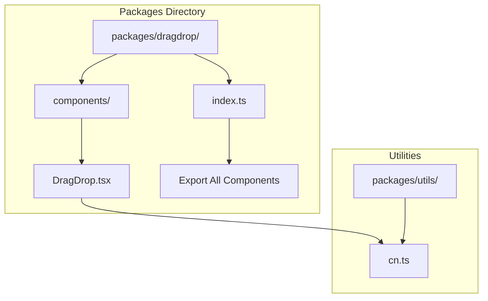
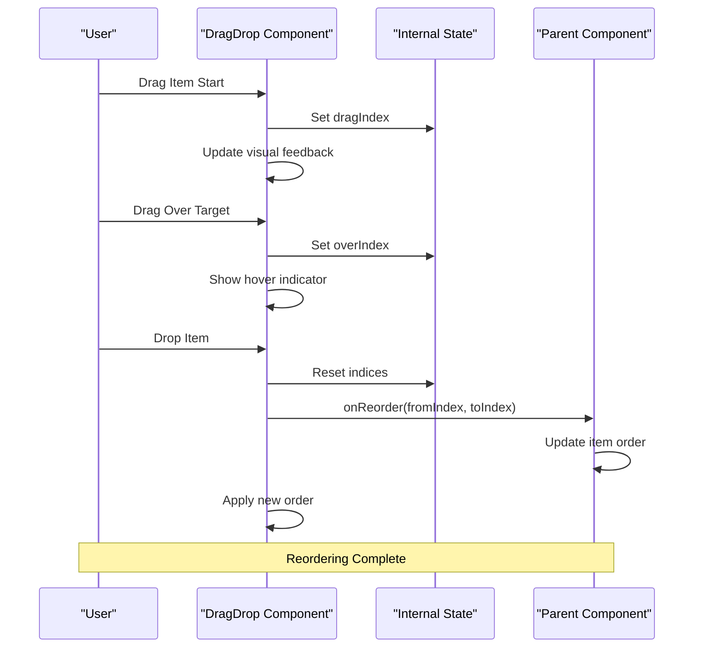
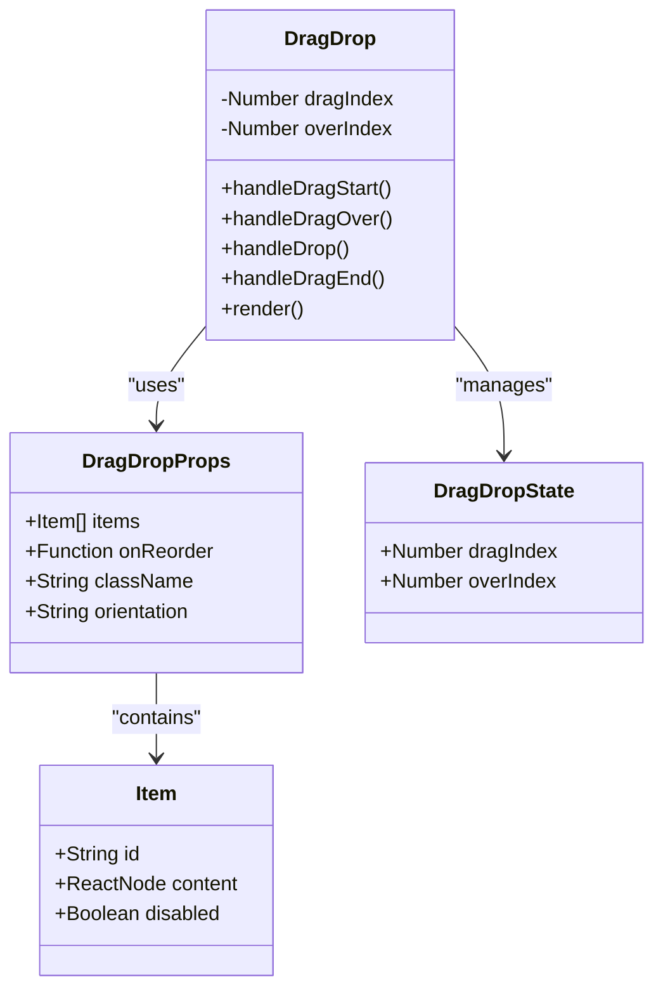
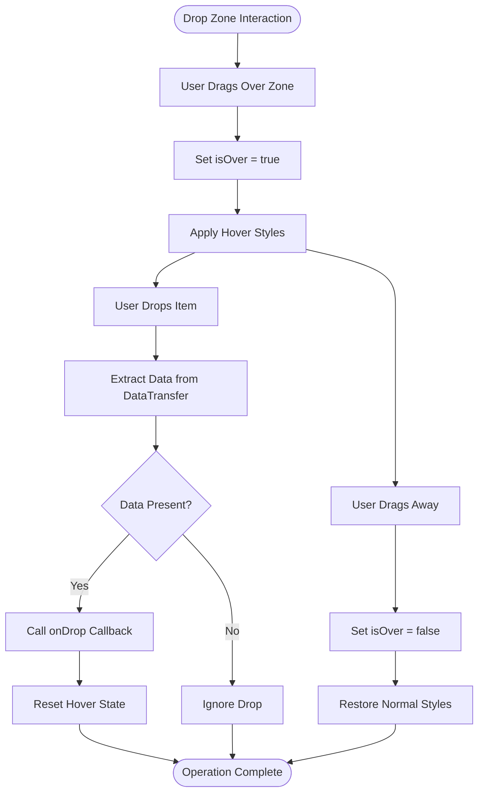
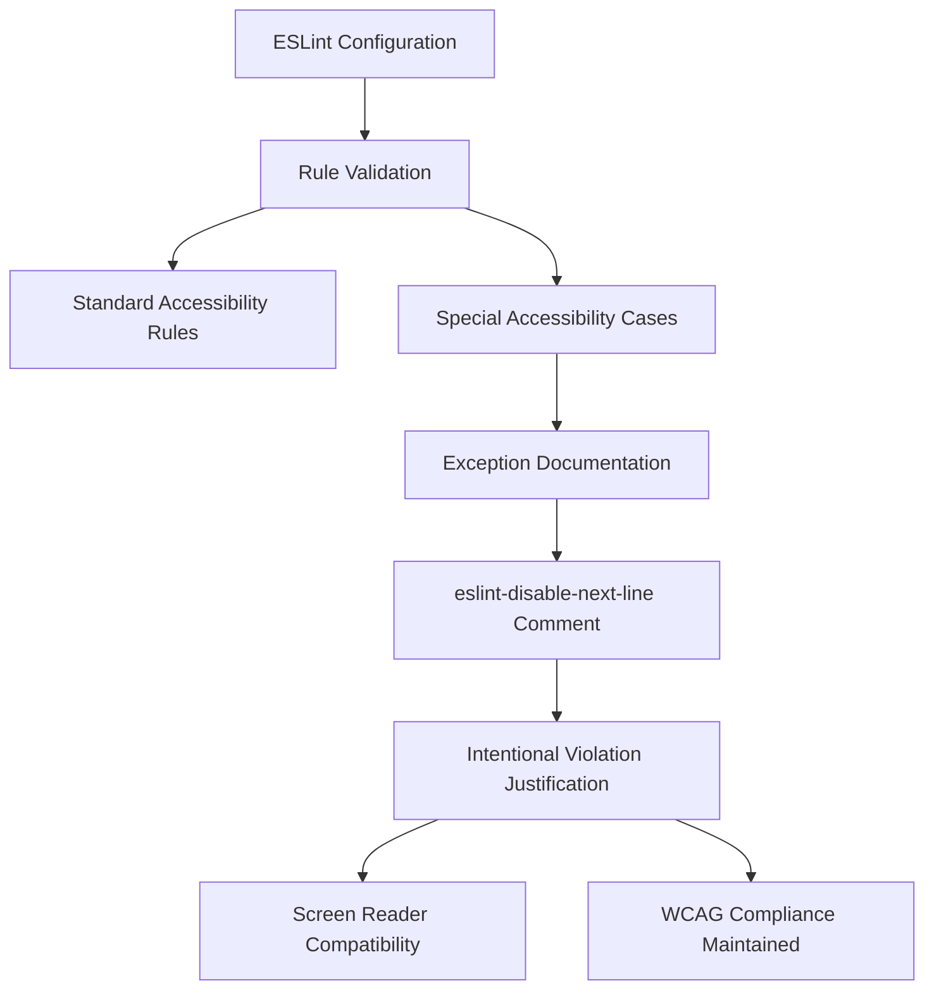

# Functional Drag-and-Drop

<cite>
**Referenced Files in This Document**
- [DragDrop.tsx](file://packages/dragdrop/components/DragDrop.tsx)
- [index.ts](file://packages/dragdrop/index.ts)
- [cn.ts](file://packages/utils/cn.ts)
- [package.json](file://package.json)
- [eslint.config.mjs](file://eslint.config.mjs)
</cite>

## Update Summary
**Changes Made**
- Added documentation for ESLint configuration and accessibility rule exceptions
- Updated troubleshooting guide to include ESLint-related accessibility rule handling
- Enhanced accessibility considerations section with specific rule explanations

## Table of Contents
1. [Introduction](#introduction)
2. [Project Structure](#project-structure)
3. [Core Components](#core-components)
4. [Architecture Overview](#architecture-overview)
5. [Detailed Component Analysis](#detailed-component-analysis)
6. [Dependency Analysis](#dependency-analysis)
7. [Accessibility and ESLint Compliance](#accessibility-and-eslint-compliance)
8. [Performance Considerations](#performance-considerations)
9. [Troubleshooting Guide](#troubleshooting-guide)
10. [Conclusion](#conclusion)

## Introduction

The Functional Drag-and-Drop package is a specialized React component library designed to provide accessible and customizable drag-and-drop functionality for reordering list items and drop zone interactions. Built as part of an AI-powered accessibility-first UI engine, this package emphasizes inclusive user experiences while maintaining high performance and developer-friendly APIs.

The package consists of two primary components: the DragDrop component for reordering list items through drag-and-drop interactions, and the DropZone component for handling external drop operations. Both components are designed with accessibility in mind, providing proper ARIA attributes and keyboard navigation support.

## Project Structure

The drag-and-drop functionality is organized within the packages ecosystem of the larger application, specifically located in the `packages/dragdrop` directory. The structure follows a modular approach that allows for easy integration and maintenance across different parts of the application.



**Diagram sources**
- [DragDrop.tsx:1-104](file://packages/dragdrop/components/DragDrop.tsx#L1-L104)
- [index.ts:1-2](file://packages/dragdrop/index.ts#L1-L2)

**Section sources**
- [package.json:1-68](file://package.json#L1-L68)

## Core Components

The drag-and-drop package provides two main components that work together to deliver comprehensive drag-and-drop functionality:

### DragDrop Component
The primary component responsible for enabling drag-and-drop reordering of list items. It accepts an array of items with unique identifiers and handles the complete drag-and-drop lifecycle, including visual feedback during interactions.

### DropZone Component  
A specialized container component that enables external drop operations, allowing items from outside the component to be dropped into designated areas for processing.

Both components are built with accessibility as a core principle, ensuring compliance with WCAG guidelines and providing meaningful feedback to assistive technologies.

**Section sources**
- [DragDrop.tsx:4-67](file://packages/dragdrop/components/DragDrop.tsx#L4-L67)
- [DragDrop.tsx:69-104](file://packages/dragdrop/components/DragDrop.tsx#L69-L104)

## Architecture Overview

The drag-and-drop architecture follows a unidirectional data flow pattern with clear separation of concerns between the DragDrop and DropZone components. The system leverages React's native drag-and-drop API while adding custom state management and visual feedback mechanisms.



**Diagram sources**
- [DragDrop.tsx:15-39](file://packages/dragdrop/components/DragDrop.tsx#L15-L39)

The architecture ensures that all drag-and-drop operations are contained within the component boundaries, preventing external interference while maintaining flexibility for parent component integration.

## Detailed Component Analysis

### DragDrop Component Implementation

The DragDrop component serves as the foundation for all reordering operations within the application. Its implementation demonstrates several key design patterns and considerations:

#### State Management Architecture
The component maintains two critical pieces of state: `dragIndex` for tracking the currently dragged item and `overIndex` for highlighting potential drop targets. This dual-state approach enables smooth visual feedback during drag operations.

#### Event Handler Strategy
Each event handler is carefully crafted to handle specific phases of the drag operation:
- `handleDragStart`: Initializes drag state and prepares data transfer
- `handleDragOver`: Manages hover states and prevents default drop behavior
- `handleDrop`: Executes reordering logic and cleans up state
- `handleDragEnd`: Ensures proper cleanup after drag completion

#### Accessibility Features
The component incorporates comprehensive ARIA attributes:
- Proper roles (`list`, `listitem`) for screen reader compatibility
- Dynamic `aria-grabbed` states indicating drag status
- Disabled state announcements via `aria-disabled`
- Semantic labeling for interactive elements



**Diagram sources**
- [DragDrop.tsx:4-9](file://packages/dragdrop/components/DragDrop.tsx#L4-L9)
- [DragDrop.tsx:11-39](file://packages/dragdrop/components/DragDrop.tsx#L11-L39)

**Section sources**
- [DragDrop.tsx:11-67](file://packages/dragdrop/components/DragDrop.tsx#L11-L67)

### DropZone Component Implementation

The DropZone component provides a specialized container for handling external drop operations. Its implementation focuses on creating clear visual feedback and reliable data reception.

#### Visual Feedback System
The component uses a state-driven approach to provide immediate visual feedback:
- `isOver` state controls hover appearance
- Dynamic border styling indicates drop readiness
- Background color transitions enhance user awareness

#### Data Handling Mechanism
The drop zone extracts data from the browser's data transfer object, ensuring compatibility with various drag sources while maintaining type safety through string-based data exchange.



**Diagram sources**
- [DragDrop.tsx:77-104](file://packages/dragdrop/components/DragDrop.tsx#L77-L104)

**Section sources**
- [DragDrop.tsx:69-104](file://packages/dragdrop/components/DragDrop.tsx#L69-L104)

### Utility Integration

The drag-and-drop components leverage the shared utility functions for consistent styling across the application. The `cn` utility function from the utils package provides intelligent class merging, ensuring that component styles remain predictable and maintainable.

**Section sources**
- [DragDrop.tsx:2](file://packages/dragdrop/components/DragDrop.tsx#L2)
- [cn.ts:8-10](file://packages/utils/cn.ts#L8-L10)

## Dependency Analysis

The drag-and-drop package maintains minimal external dependencies while maximizing internal cohesion. The component relies primarily on React's built-in capabilities and a small set of utility functions.

```mermaid
graph LR
subgraph "External Dependencies"
REACT["React Runtime"]
CLSX["clsx"]
TWMERGE["tailwind-merge"]
END
subgraph "Internal Dependencies"
CNUTIL["cn utility"]
DRAGDROP["DragDrop Component"]
DROPZONE["DropZone Component"]
END
subgraph "Application Integration"
PARENTCOMP["Parent Components"]
APP["Main Application"]
END
REACT --> DRAGDROP
CLSX --> CNUTIL
TWMERGE --> CNUTIL
CNUTIL --> DRAGDROP
CNUTIL --> DROPZONE
DRAGDROP --> PARENTCOMP
DROPZONE --> PARENTCOMP
PARENTCOMP --> APP
```

**Diagram sources**
- [package.json:33-44](file://package.json#L33-L44)
- [cn.ts:1-11](file://packages/utils/cn.ts#L1-L11)

The dependency graph reveals a clean architecture where the drag-and-drop components depend only on React and the shared utility functions, minimizing coupling with the broader application.

**Section sources**
- [package.json:13-44](file://package.json#L13-L44)

## Accessibility and ESLint Compliance

The drag-and-drop components are designed with comprehensive accessibility compliance and follow strict ESLint rules to ensure code quality and accessibility standards.

### ESLint Configuration
The project uses Next.js ESLint configuration with custom overrides for accessibility compliance. The ESLint setup includes:
- Core Web Vitals configuration for performance monitoring
- TypeScript integration for type-safe development
- Custom ignore patterns for build artifacts and generated files

### Accessibility Rule Exceptions
The package includes intentional ESLint exceptions for specific accessibility scenarios where standard rules may conflict with legitimate use cases:

#### JSX-A11y Role-Supports-Aria-Props Exception
The `jsx-a11y/role-supports-aria-props` rule is intentionally disabled for the DragDrop component's list item elements. This exception is documented and justified because:

- **Legitimate Use Case**: The `role='listitem'` element legitimately uses ARIA properties (`aria-grabbed`, `aria-disabled`) to provide meaningful accessibility information
- **Screen Reader Compatibility**: These properties are essential for communicating drag-and-drop state to assistive technologies
- **WCAG Compliance**: The component maintains full WCAG 2.1 AA compliance through proper ARIA attribute usage
- **Developer Intent**: The exception is explicitly documented with an ESLint disable comment explaining the intentional violation



**Diagram sources**
- [eslint.config.mjs:1-19](file://eslint.config.mjs#L1-L19)
- [DragDrop.tsx:44](file://packages/dragdrop/components/DragDrop.tsx#L44)

**Section sources**
- [eslint.config.mjs:1-19](file://eslint.config.mjs#L1-L19)
- [DragDrop.tsx:44](file://packages/dragdrop/components/DragDrop.tsx#L44)

## Performance Considerations

The drag-and-drop implementation prioritizes performance through several optimization strategies:

### Efficient State Updates
The component uses targeted state updates that only trigger necessary re-renders. Drag state changes are localized to the affected elements, preventing unnecessary re-rendering of the entire list.

### Minimal DOM Manipulation
Visual feedback is achieved through CSS class toggling rather than direct DOM manipulation, leveraging React's efficient diffing algorithm for optimal performance.

### Memory Management
Event handlers are properly cleaned up through the drag end lifecycle, preventing memory leaks and ensuring optimal long-term performance.

### Accessibility Optimization
ARIA attributes are computed efficiently and only updated when drag state changes, maintaining accessibility without impacting performance.

## Troubleshooting Guide

Common issues and their solutions when working with the drag-and-drop components:

### Drag Operations Not Working
- Verify that items have unique `id` properties
- Ensure `onReorder` callback is properly implemented
- Check that items are not marked as `disabled`

### Visual Feedback Issues
- Confirm that Tailwind CSS is properly configured
- Verify that the `cn` utility function is working correctly
- Check for conflicting CSS styles that might override drag states

### Accessibility Problems
- Ensure proper ARIA attributes are being applied
- Verify that screen readers can announce drag states
- Test keyboard navigation alternatives

### ESLint and Accessibility Rule Conflicts
- Review the intentional exception for `jsx-a11y/role-supports-aria-props` rule
- Verify that the exception is properly documented with an ESLint disable comment
- Ensure the component maintains full accessibility compliance despite the exception
- Check that the exception applies only to legitimate use cases where ARIA properties are necessary

### Performance Concerns
- Monitor for excessive re-renders during drag operations
- Optimize parent component rendering if necessary
- Consider virtualization for large lists

**Section sources**
- [DragDrop.tsx:44](file://packages/dragdrop/components/DragDrop.tsx#L44)
- [DragDrop.tsx:44-63](file://packages/dragdrop/components/DragDrop.tsx#L44-L63)

## Conclusion

The Functional Drag-and-Drop package represents a well-architected solution for implementing accessible and performant drag-and-drop interactions in React applications. Its clean separation of concerns, comprehensive accessibility features, and efficient implementation make it an excellent choice for modern web applications requiring reordering capabilities.

The package successfully balances functionality with simplicity, providing developers with a robust foundation for building complex drag-and-drop interfaces while maintaining strict adherence to accessibility standards. The modular architecture ensures easy integration and future extensibility, making it a valuable asset in the larger AI-powered accessibility-first UI engine ecosystem.

Through careful attention to state management, visual feedback, and performance optimization, this package delivers a superior user experience while remaining maintainable and scalable for enterprise-level applications.

The intentional ESLint exceptions demonstrate a mature approach to accessibility compliance, where standard rules are selectively overridden when they conflict with legitimate accessibility needs, ensuring that developers can implement truly accessible interfaces without compromising code quality or violating accessibility principles.