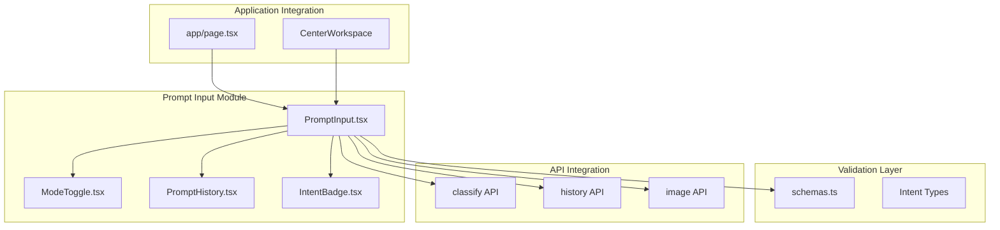
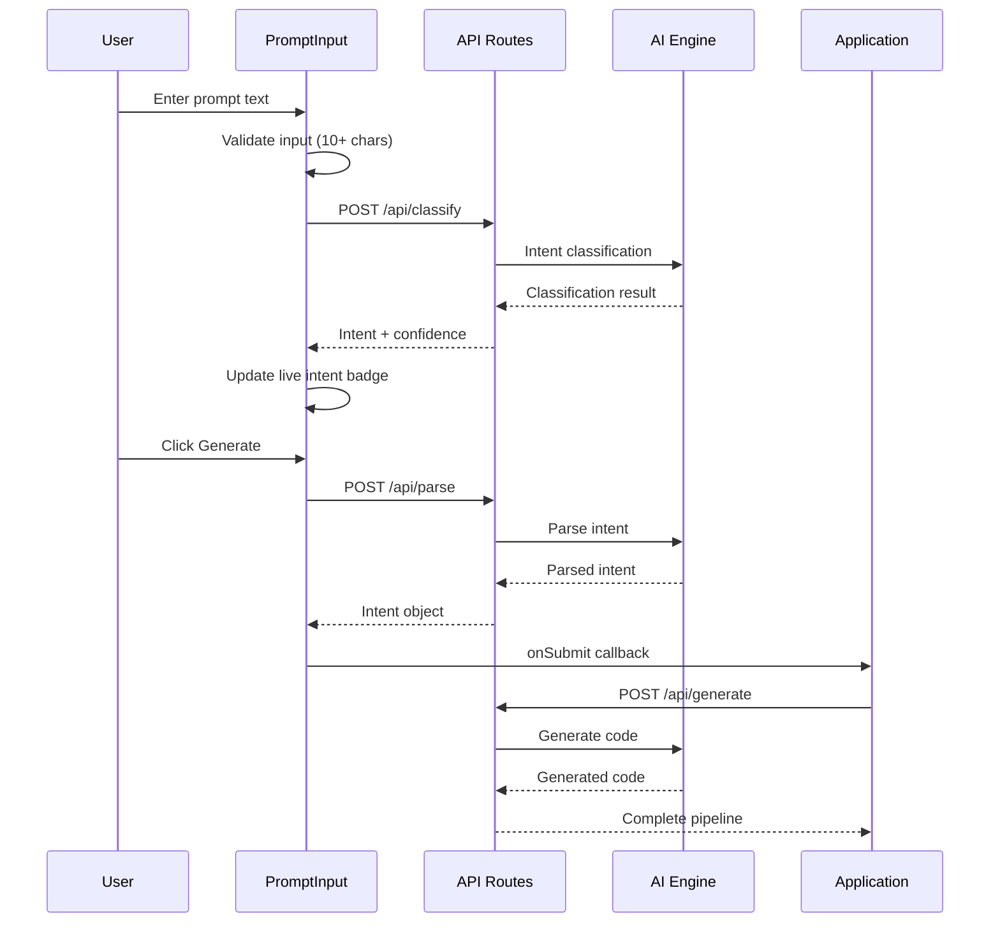
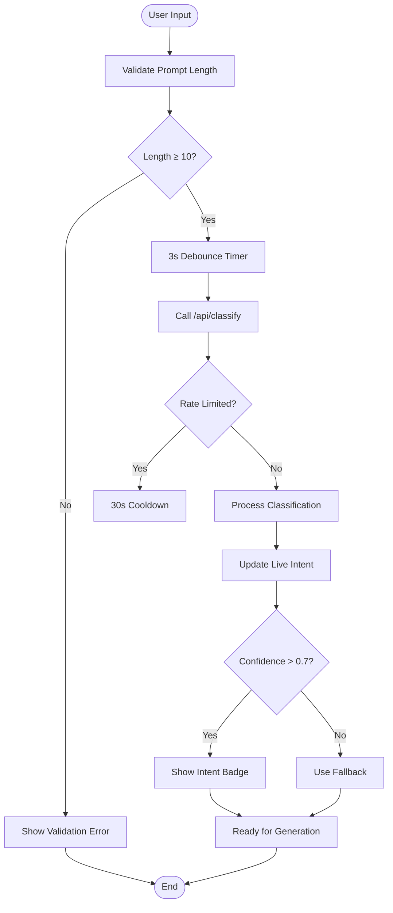
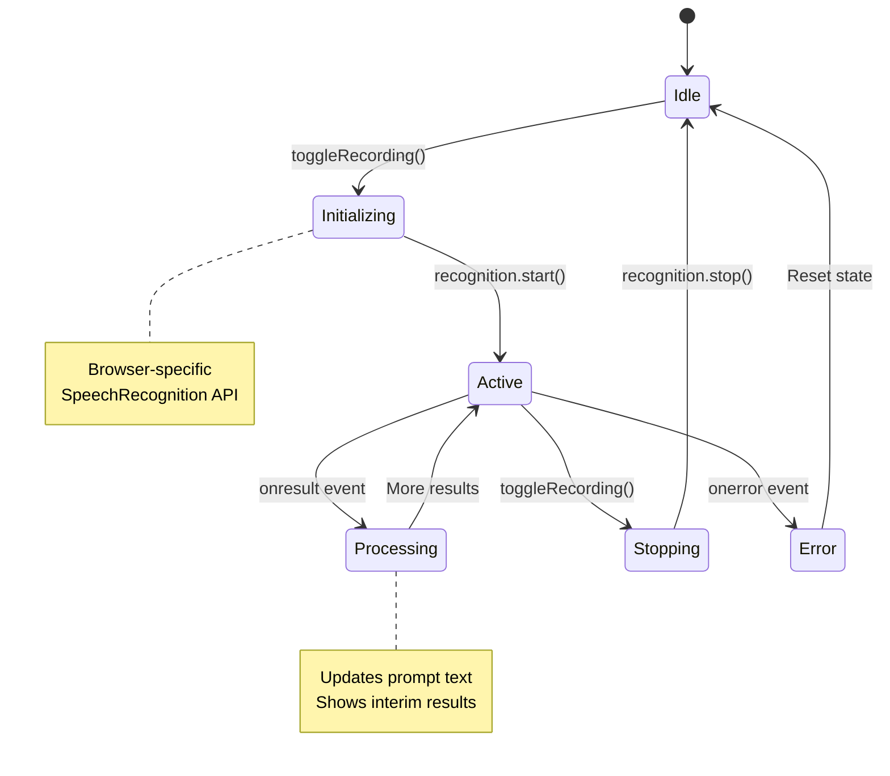
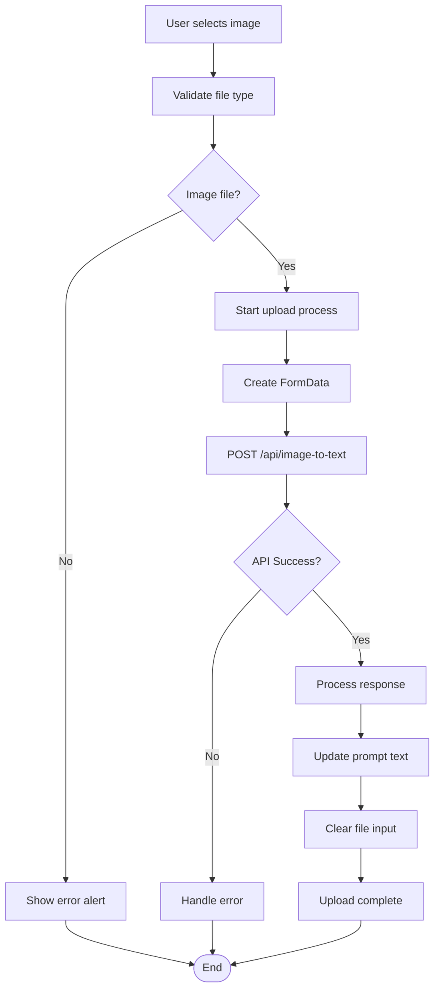
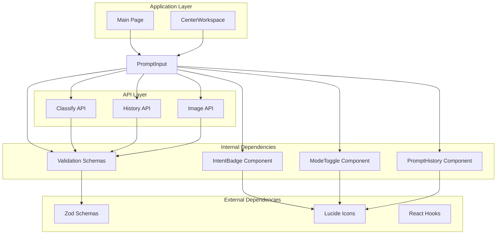

# Input Component

<cite>
**Referenced Files in This Document**
- [PromptInput.tsx](file://components/prompt-input/PromptInput.tsx)
- [types.ts](file://components/prompt-input/types.ts)
- [index.ts](file://components/prompt-input/index.ts)
- [ModeToggle.tsx](file://components/prompt-input/ModeToggle.tsx)
- [PromptHistory.tsx](file://components/prompt-input/PromptHistory.tsx)
- [IntentBadge.tsx](file://components/IntentBadge.tsx)
- [schemas.ts](file://lib/validation/schemas.ts)
- [route.ts](file://app/api/classify/route.ts)
- [route.ts](file://app/api/history/route.ts)
- [route.ts](file://app/api/image-to-text/route.ts)
- [page.tsx](file://app/page.tsx)
</cite>

## Table of Contents
1. [Introduction](#introduction)
2. [Project Structure](#project-structure)
3. [Core Components](#core-components)
4. [Architecture Overview](#architecture-overview)
5. [Detailed Component Analysis](#detailed-component-analysis)
6. [Dependency Analysis](#dependency-analysis)
7. [Performance Considerations](#performance-considerations)
8. [Troubleshooting Guide](#troubleshooting-guide)
9. [Conclusion](#conclusion)

## Introduction
The Input Component is a sophisticated prompt input system designed for natural language UI generation. It transforms user descriptions into accessible React components through AI-powered intent classification, live validation, and multimodal input support. The component supports three generation modes: component-level UI generation, full application creation, and premium Depth UI with advanced parallax effects.

The system emphasizes accessibility-first design with comprehensive validation, real-time feedback, and seamless integration with the broader AI generation pipeline. Users can describe UI components using natural language, with the system automatically detecting intent categories and providing appropriate visual feedback.

## Project Structure
The Input Component follows a modular architecture with clear separation of concerns:

**Diagram sources**
- [PromptInput.tsx:1-423](file://components/prompt-input/PromptInput.tsx#L1-L423)
- [ModeToggle.tsx:1-140](file://components/prompt-input/ModeToggle.tsx#L1-L140)
- [schemas.ts:1-340](file://lib/validation/schemas.ts#L1-L340)

**Section sources**
- [PromptInput.tsx:1-423](file://components/prompt-input/PromptInput.tsx#L1-L423)
- [types.ts:1-49](file://components/prompt-input/types.ts#L1-L49)
- [index.ts:1-10](file://components/prompt-input/index.ts#L1-L10)

## Core Components

### PromptInput Main Component
The central component manages the entire input workflow, including state management, validation, and integration with external APIs.

**Key Features:**
- Real-time intent classification with debounced API calls
- Voice input support via Web Speech Recognition
- Image attachment for visual context extraction
- Multi-modal validation with user feedback
- Generation mode switching (component/app/depth UI)

**State Management:**
- Prompt text with character limits and validation
- Generation mode tracking (component/app/depth_ui)
- Live intent classification with confidence scoring
- Speech recognition state management
- File upload processing state

**Section sources**
- [PromptInput.tsx:25-423](file://components/prompt-input/PromptInput.tsx#L25-L423)

### ModeToggle Component
Provides intuitive controls for switching between generation modes with visual feedback.

**Modes Supported:**
- Component: Generate individual UI components
- App: Create complete multi-screen applications
- Depth UI: Premium interfaces with parallax effects

**Section sources**
- [ModeToggle.tsx:20-140](file://components/prompt-input/ModeToggle.tsx#L20-L140)

### PromptHistory Component
Displays reusable generation history with quick-access buttons.

**Features:**
- Scrollable history chips with component names
- One-click prompt reuse functionality
- Loading state integration
- Responsive design for various screen sizes

**Section sources**
- [PromptHistory.tsx:18-58](file://components/prompt-input/PromptHistory.tsx#L18-L58)

## Architecture Overview

**Diagram sources**
- [PromptInput.tsx:166-244](file://components/prompt-input/PromptInput.tsx#L166-L244)
- [route.ts:7-86](file://app/api/classify/route.ts#L7-L86)
- [page.tsx:454-525](file://app/page.tsx#L454-L525)

The Input Component integrates deeply with the application's AI generation pipeline, providing real-time feedback and seamless transitions between different stages of the generation process.

## Detailed Component Analysis

### Intent Classification System

**Diagram sources**
- [PromptInput.tsx:166-214](file://components/prompt-input/PromptInput.tsx#L166-L214)
- [route.ts:42-50](file://app/api/classify/route.ts#L42-L50)

The intent classification system implements intelligent rate limiting and fallback mechanisms to ensure reliable operation under various conditions.

### Speech Recognition Integration

**Diagram sources**
- [PromptInput.tsx:65-127](file://components/prompt-input/PromptInput.tsx#L65-L127)

The speech recognition system handles browser compatibility and provides real-time transcription feedback during voice input.

### Image Attachment Workflow

**Diagram sources**
- [PromptInput.tsx:129-164](file://components/prompt-input/PromptInput.tsx#L129-L164)
- [route.ts:12-41](file://app/api/image-to-text/route.ts#L12-L41)

The image attachment system converts visual context into textual descriptions that enhance the generation process.

**Section sources**
- [PromptInput.tsx:129-164](file://components/prompt-input/PromptInput.tsx#L129-L164)
- [route.ts:12-41](file://app/api/image-to-text/route.ts#L12-L41)

## Dependency Analysis

**Diagram sources**
- [PromptInput.tsx:8-20](file://components/prompt-input/PromptInput.tsx#L8-L20)
- [schemas.ts:1-46](file://lib/validation/schemas.ts#L1-L46)

**Section sources**
- [PromptInput.tsx:8-20](file://components/prompt-input/PromptInput.tsx#L8-L20)
- [schemas.ts:1-46](file://lib/validation/schemas.ts#L1-L46)

## Performance Considerations

### Debounced Intent Classification
The system implements intelligent debouncing to optimize API usage:
- 3-second debounce period reduces unnecessary API calls
- 30-second cooldown after rate limit responses
- Pending classification cancellation on form submission

### Memory Management
- Cleanup of timeouts and intervals on component unmount
- Proper cleanup of speech recognition instances
- Efficient state updates to minimize re-renders

### API Optimization
- Conditional API calls based on input length and validity
- Free-tier provider detection to avoid unnecessary LLM calls
- Local fallback classification for basic providers

## Troubleshooting Guide

### Common Issues and Solutions

**Speech Recognition Not Working**
- Verify browser support (Chrome, Edge, Safari)
- Check microphone permissions
- Look for console warnings about initialization failures

**Intent Classification Failures**
- Monitor network connectivity
- Check API response status codes
- Verify authentication headers

**Image Upload Problems**
- Confirm file type validation (JPEG, PNG, GIF, WebP)
- Check API key configuration for OpenAI Vision
- Review file size limitations

**Section sources**
- [PromptInput.tsx:109-127](file://components/prompt-input/PromptInput.tsx#L109-L127)
- [route.ts:82-84](file://app/api/classify/route.ts#L82-L84)

## Conclusion

The Input Component represents a sophisticated integration of modern web technologies with AI-powered intent classification. Its modular architecture, comprehensive validation system, and seamless API integration create a robust foundation for natural language UI generation.

Key strengths include:
- Intelligent rate limiting and fallback mechanisms
- Comprehensive accessibility features
- Real-time feedback and validation
- Support for multiple input modalities (text, voice, images)
- Flexible generation modes with clear user feedback

The component serves as a critical bridge between user intent and AI-generated code, providing a smooth and intuitive experience for creating accessible React components through natural language descriptions.