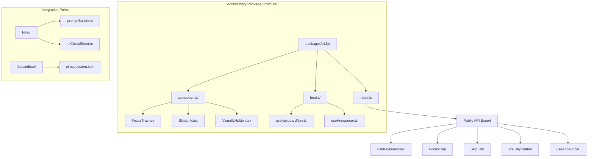
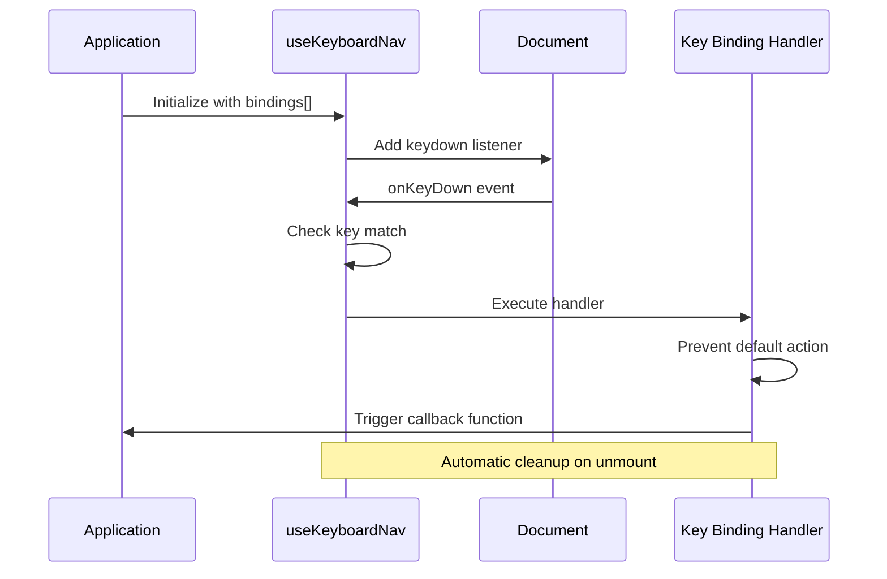
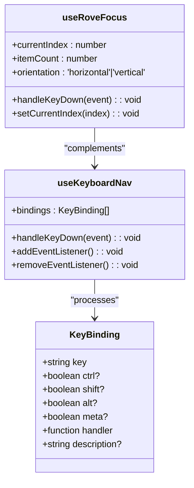
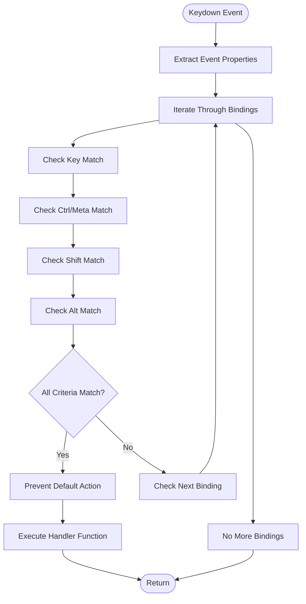
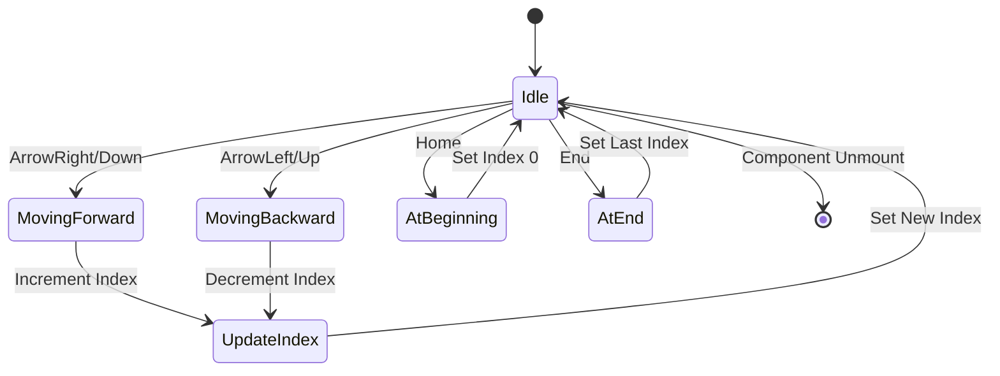
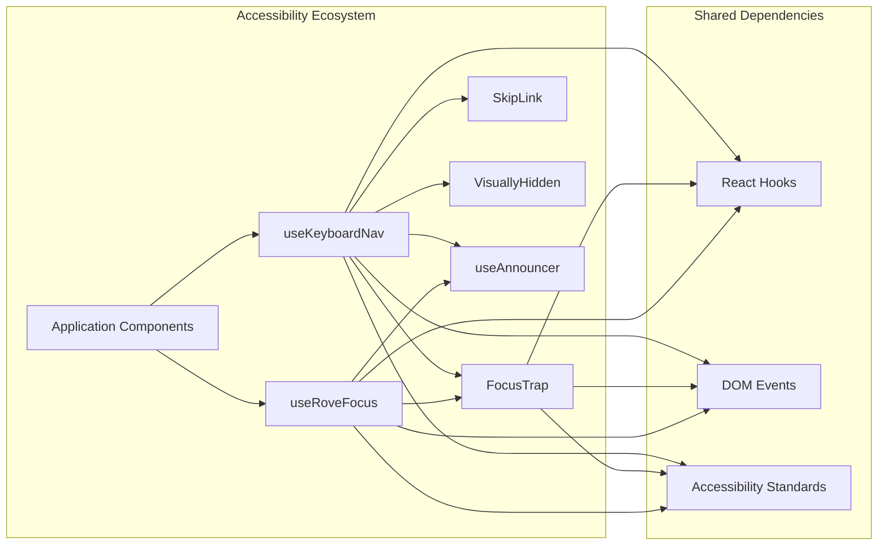

# Keyboard Navigation Hook

<cite>
**Referenced Files in This Document**
- [useKeyboardNav.ts](file://packages/a11y/hooks/useKeyboardNav.ts)
- [index.ts](file://packages/a11y/index.ts)
- [FocusTrap.tsx](file://packages/a11y/components/FocusTrap.tsx)
- [SkipLink.tsx](file://packages/a11y/components/SkipLink.tsx)
- [VisuallyHidden.tsx](file://packages/a11y/components/VisuallyHidden.tsx)
- [useAnnouncer.ts](file://packages/a11y/hooks/useAnnouncer.ts)
- [promptBuilder.ts](file://lib/ai/promptBuilder.ts)
- [uiCheatSheet.ts](file://lib/ai/uiCheatSheet.ts)
- [ui-ecosystem.json](file://lib/sandbox/ui-ecosystem.json)
</cite>

## Table of Contents
1. [Introduction](#introduction)
2. [Project Structure](#project-structure)
3. [Core Components](#core-components)
4. [Architecture Overview](#architecture-overview)
5. [Detailed Component Analysis](#detailed-component-analysis)
6. [Integration Patterns](#integration-patterns)
7. [Usage Examples](#usage-examples)
8. [Accessibility Considerations](#accessibility-considerations)
9. [Performance Analysis](#performance-analysis)
10. [Troubleshooting Guide](#troubleshooting-guide)
11. [Conclusion](#conclusion)

## Introduction

The Keyboard Navigation Hook is a core accessibility component within the AI-powered accessibility-first UI engine. This system provides developers with robust keyboard navigation capabilities while maintaining strict adherence to web accessibility standards. The implementation focuses on three primary areas: global keyboard shortcuts, roving tab index management, and comprehensive accessibility utilities.

The hook system is designed to be modular, reusable, and deeply integrated with React's ecosystem while ensuring seamless coordination with other accessibility features like focus management, screen reader announcements, and keyboard-only navigation patterns.

## Project Structure

The accessibility infrastructure is organized within the `packages/a11y` directory, following a component-based architecture that promotes separation of concerns and easy integration:

**Diagram sources**
- [index.ts:1-6](file://packages/a11y/index.ts#L1-L6)
- [useKeyboardNav.ts:1-66](file://packages/a11y/hooks/useKeyboardNav.ts#L1-L66)

**Section sources**
- [index.ts:1-6](file://packages/a11y/index.ts#L1-L6)
- [useKeyboardNav.ts:1-66](file://packages/a11y/hooks/useKeyboardNav.ts#L1-L66)

## Core Components

The keyboard navigation system consists of two primary hooks that work together to provide comprehensive keyboard accessibility:

### useKeyboardNav Hook

The `useKeyboardNav` hook serves as the foundation for global keyboard shortcut management. It accepts an array of key binding configurations and automatically handles event delegation, modifier key detection, and conflict resolution.

**Key Features:**
- **Universal Event Listener**: Attaches to the document level for global keyboard capture
- **Modifier Key Support**: Comprehensive support for Ctrl/Cmd, Shift, Alt, and Meta keys
- **Automatic Prevention**: Prevents default browser actions when shortcuts are triggered
- **Performance Optimized**: Uses React's useCallback for efficient event handling

### useRoveFocus Hook

The `useRoveFocus` hook implements the roving tab index pattern, enabling keyboard navigation through collections of focusable elements with arrow keys and Home/End navigation.

**Key Features:**
- **Circular Navigation**: Supports both forward and backward navigation
- **Boundary Management**: Handles edge cases with modulo arithmetic
- **Orientation Awareness**: Supports both horizontal and vertical navigation
- **State Management**: Provides current index state for external consumption

**Section sources**
- [useKeyboardNav.ts:14-37](file://packages/a11y/hooks/useKeyboardNav.ts#L14-L37)
- [useKeyboardNav.ts:39-65](file://packages/a11y/hooks/useKeyboardNav.ts#L39-L65)

## Architecture Overview

The keyboard navigation system follows a layered architecture that promotes modularity and maintainability:

**Diagram sources**
- [useKeyboardNav.ts:14-37](file://packages/a11y/hooks/useKeyboardNav.ts#L14-L37)

The architecture ensures that keyboard events are captured globally while maintaining proper separation of concerns between event handling and application logic.

**Section sources**
- [useKeyboardNav.ts:14-37](file://packages/a11y/hooks/useKeyboardNav.ts#L14-L37)

## Detailed Component Analysis

### KeyBinding Interface Design

The `KeyBinding` interface provides a flexible and extensible foundation for keyboard shortcut definitions:

**Diagram sources**
- [useKeyboardNav.ts:4-12](file://packages/a11y/hooks/useKeyboardNav.ts#L4-L12)
- [useKeyboardNav.ts:14-37](file://packages/a11y/hooks/useKeyboardNav.ts#L14-L37)
- [useKeyboardNav.ts:39-65](file://packages/a11y/hooks/useKeyboardNav.ts#L39-L65)

### Event Handling Mechanism

The event handling system implements a sophisticated matching algorithm that evaluates multiple criteria simultaneously:

**Diagram sources**
- [useKeyboardNav.ts:15-29](file://packages/a11y/hooks/useKeyboardNav.ts#L15-L29)

**Section sources**
- [useKeyboardNav.ts:14-37](file://packages/a11y/hooks/useKeyboardNav.ts#L14-L37)

### Roving Focus Implementation

The roving focus mechanism provides intuitive keyboard navigation through collections:

**Diagram sources**
- [useKeyboardNav.ts:42-62](file://packages/a11y/hooks/useKeyboardNav.ts#L42-L62)

**Section sources**
- [useKeyboardNav.ts:39-65](file://packages/a11y/hooks/useKeyboardNav.ts#L39-L65)

## Integration Patterns

The keyboard navigation system integrates seamlessly with other accessibility components through shared patterns and complementary functionality.

### Component Composition

**Diagram sources**
- [useKeyboardNav.ts:1-2](file://packages/a11y/hooks/useKeyboardNav.ts#L1-L2)
- [FocusTrap.tsx:1-2](file://packages/a11y/components/FocusTrap.tsx#L1-L2)
- [useAnnouncer.ts:1-2](file://packages/a11y/hooks/useAnnouncer.ts#L1-L2)

### Public API Exposure

The system exposes a clean public interface through the main index file, making all accessibility utilities available as a cohesive package:

**Section sources**
- [index.ts:1-6](file://packages/a11y/index.ts#L1-L6)

## Usage Examples

### Basic Keyboard Shortcut Implementation

Applications can define keyboard shortcuts by creating KeyBinding configurations and passing them to the useKeyboardNav hook. The system automatically handles event delegation and prevents conflicts with browser defaults.

### Roving Focus Collection Navigation

For components like dropdown menus, navigation lists, or carousel interfaces, the useRoveFocus hook provides seamless arrow key navigation with proper boundary handling and circular movement.

### Integration with Other Accessibility Features

The keyboard navigation system works harmoniously with focus traps, skip links, and screen reader announcements to create comprehensive keyboard accessibility experiences.

**Section sources**
- [promptBuilder.ts](file://lib/ai/promptBuilder.ts#L69)
- [uiCheatSheet.ts:48-53](file://lib/ai/uiCheatSheet.ts#L48-L53)

## Accessibility Considerations

The keyboard navigation system adheres to WCAG guidelines and accessibility best practices:

### Keyboard-Only Navigation
- Full support for Tab order and reverse Tab navigation
- Arrow key navigation for collections and menus
- Home and End key support for quick navigation
- Proper focus management and visual indicators

### Screen Reader Compatibility
- Integration with live regions for dynamic content updates
- Proper ARIA attributes and roles
- Semantic HTML structure maintenance
- Announcement system for programmatic updates

### Cross-Platform Compatibility
- Unified handling of Ctrl and Meta keys across platforms
- Consistent behavior across different operating systems
- Browser compatibility considerations
- Mobile device accessibility support

## Performance Analysis

The keyboard navigation system is optimized for performance through several key mechanisms:

### Efficient Event Handling
- Single global event listener per hook instance
- Memoized callback functions using React's useCallback
- Minimal DOM manipulation during key handling
- Cleanup procedures prevent memory leaks

### Computational Complexity
- **Time Complexity**: O(n) where n is the number of registered key bindings
- **Space Complexity**: O(1) for event handlers, O(n) for binding storage
- **Event Processing**: Linear scan through bindings with early termination

### Memory Management
- Automatic cleanup of event listeners on component unmount
- Weak references for DOM elements where appropriate
- Efficient state updates using React's built-in optimizations

## Troubleshooting Guide

### Common Issues and Solutions

**Issue**: Keyboard shortcuts not triggering
- **Solution**: Verify key binding configuration matches actual key presses
- **Check**: Modifier key combinations (Ctrl/Cmd, Shift, Alt)
- **Verify**: Event listener attachment and cleanup

**Issue**: Conflicts with browser default actions
- **Solution**: Ensure preventDefault() is called in handler functions
- **Check**: Event propagation blocking
- **Verify**: Proper event handler registration

**Issue**: Roving focus not working correctly
- **Solution**: Verify item count matches actual DOM elements
- **Check**: Orientation setting matches navigation direction
- **Verify**: Index boundaries and modulo arithmetic

**Section sources**
- [useKeyboardNav.ts:15-37](file://packages/a11y/hooks/useKeyboardNav.ts#L15-L37)
- [useKeyboardNav.ts:42-62](file://packages/a11y/hooks/useKeyboardNav.ts#L42-L62)

## Conclusion

The Keyboard Navigation Hook represents a comprehensive solution for implementing accessible keyboard navigation in modern web applications. Its modular design, performance optimizations, and adherence to accessibility standards make it an essential component of any accessibility-first development toolkit.

The system's ability to integrate seamlessly with other accessibility utilities while maintaining clean separation of concerns demonstrates thoughtful architectural design. By providing both global keyboard shortcut management and roving focus capabilities, it addresses the full spectrum of keyboard accessibility needs in contemporary web applications.

Future enhancements could include additional navigation patterns, extended modifier key support, and integration with emerging web platform APIs for even more sophisticated accessibility features.