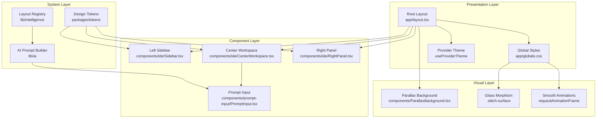
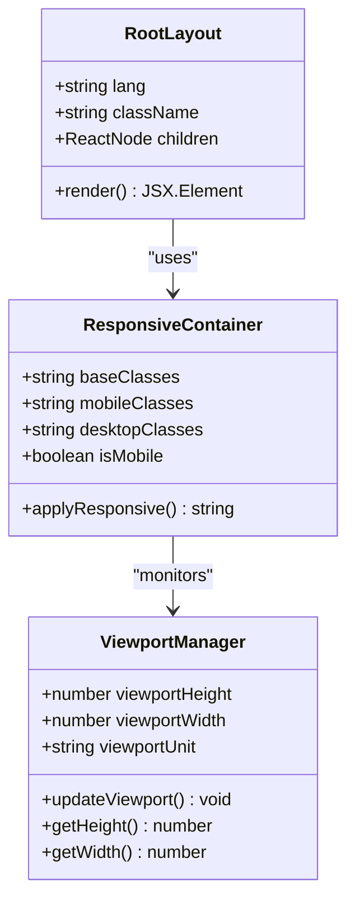
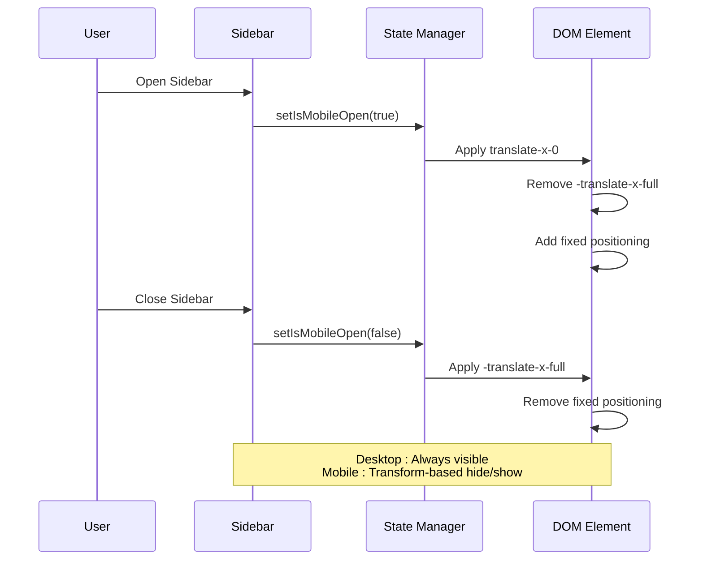
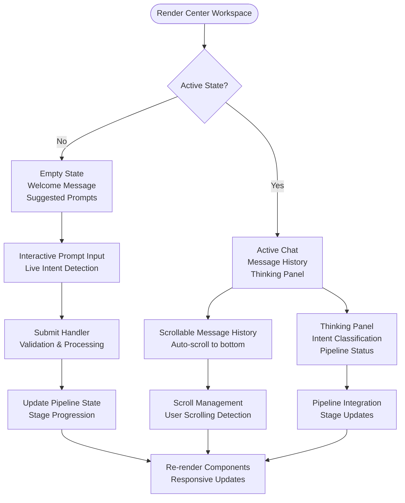
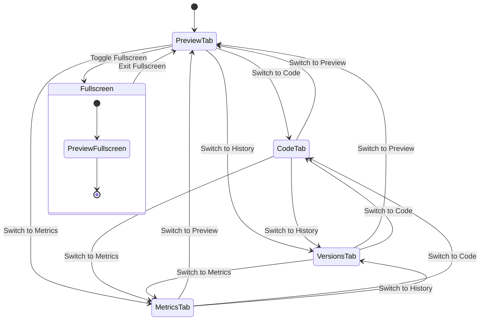
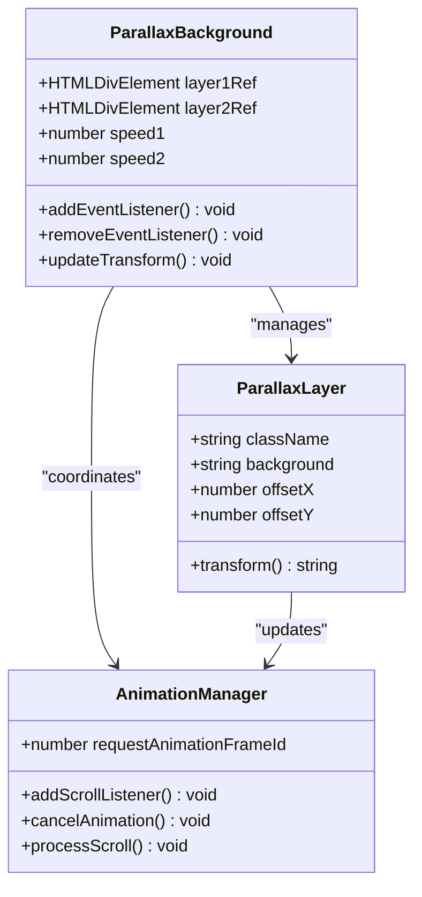
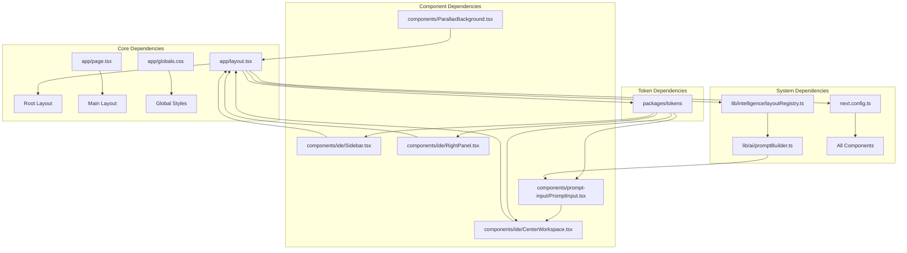

# Responsive Layout System

<cite>
**Referenced Files in This Document**
- [app/layout.tsx](file://app/layout.tsx)
- [app/page.tsx](file://app/page.tsx)
- [app/globals.css](file://app/globals.css)
- [components/ide/Sidebar.tsx](file://components/ide/Sidebar.tsx)
- [components/ide/CenterWorkspace.tsx](file://components/ide/CenterWorkspace.tsx)
- [components/ide/RightPanel.tsx](file://components/ide/RightPanel.tsx)
- [components/ParallaxBackground.tsx](file://components/ParallaxBackground.tsx)
- [components/prompt-input/PromptInput.tsx](file://components/prompt-input/PromptInput.tsx)
- [packages/tokens/spacing.ts](file://packages/tokens/spacing.ts)
- [packages/tokens/index.ts](file://packages/tokens/index.ts)
- [lib/intelligence/layoutRegistry.ts](file://lib/intelligence/layoutRegistry.ts)
- [lib/ai/promptBuilder.ts](file://lib/ai/promptBuilder.ts)
- [next.config.ts](file://next.config.ts)
</cite>

## Table of Contents
1. [Introduction](#introduction)
2. [Project Structure](#project-structure)
3. [Core Components](#core-components)
4. [Architecture Overview](#architecture-overview)
5. [Detailed Component Analysis](#detailed-component-analysis)
6. [Dependency Analysis](#dependency-analysis)
7. [Performance Considerations](#performance-considerations)
8. [Troubleshooting Guide](#troubleshooting-guide)
9. [Conclusion](#conclusion)

## Introduction

The AI-powered accessibility-first UI engine implements a sophisticated responsive layout system that seamlessly adapts across devices while maintaining visual consistency and performance. This system combines modern CSS techniques, Next.js framework capabilities, and a comprehensive design token system to deliver an optimal user experience across desktop, tablet, and mobile platforms.

The layout system prioritizes accessibility compliance with WCAG 2.1 AA standards while providing a visually rich interface with parallax effects, glass-morphism components, and adaptive typography. The architecture supports both traditional sidebar layouts and mobile-first responsive designs through intelligent breakpoint management and component adaptation.

## Project Structure

The responsive layout system is built around a three-panel architecture that dynamically adapts based on screen size and device capabilities:

```mermaid
graph TB
subgraph "Root Layout"
Root[Root Layout<br/>app/layout.tsx]
Body[Body Container<br/>100vh viewport]
end
subgraph "Desktop Layout (≥1024px)"
Desktop[Desktop Layout<br/>lg:flex-row]
Sidebar[Sidebar<br/>w-72 fixed]
Main[Main Content<br/>flex-1 flex-col]
Preview[Right Panel<br/>flex-1 flex-col]
end
subgraph "Mobile Layout (<1024px)"
Mobile[Mobile Layout<br/>flex-col]
TopBar[Top Navigation<br/>fixed top-0]
SidebarMobile[Mobile Sidebar<br/>transform-x-0/-translate-x-full]
Chat[Chat Area<br/>h-[45%] lg:h-auto]
PreviewMobile[Preview Area<br/>h-[55%] lg:h-auto]
end
Root --> Body
Body --> Desktop
Desktop --> Sidebar
Desktop --> Main
Main --> Preview
Body --> Mobile
Mobile --> TopBar
Mobile --> SidebarMobile
Mobile --> Chat
Mobile --> PreviewMobile
```

**Diagram sources**
- [app/layout.tsx:37-56](file://app/layout.tsx#L37-L56)
- [app/page.tsx:632-794](file://app/page.tsx#L632-L794)

**Section sources**
- [app/layout.tsx:1-57](file://app/layout.tsx#L1-L57)
- [app/page.tsx:632-794](file://app/page.tsx#L632-L794)

## Core Components

### Responsive Container System

The layout system employs a sophisticated container approach that adapts content distribution based on screen size:

```mermaid
flowchart TD
Start([Page Load]) --> CheckScreen{Screen Size ≥ 1024px?}
CheckScreen --> |Yes| DesktopLayout[Desktop Layout<br/>Flex Row]
CheckScreen --> |No| MobileLayout[Mobile Layout<br/>Flex Column]
DesktopLayout --> DesktopContainer[Root Container<br/>h-[100dvh]<br/>w-full<br/>overflow-hidden]
MobileLayout --> MobileContainer[Root Container<br/>h-[100dvh]<br/>w-full<br/>overflow-hidden]
DesktopContainer --> SidebarPanel[Left Sidebar<br/>w-72 fixed<br/>translate-x-0]
DesktopContainer --> MainArea[Main Area<br/>flex-1 flex-col<br/>min-h-0 min-w-0]
DesktopContainer --> PreviewPanel[Right Panel<br/>flex-1 flex-col<br/>min-h-0 min-w-0]
MobileContainer --> TopNavigation[Top Navigation<br/>fixed top-0<br/>h-14 lg:hidden]
MobileContainer --> MobileSidebar[Mobile Sidebar<br/>transform-x-0/-translate-x-full<br/>fixed inset-y-0 left-0]
MobileContainer --> ChatArea[Chat Area<br/>h-[45%] lg:h-auto<br/>pt-14 lg:pt-0]
MobileContainer --> PreviewArea[Preview Area<br/>h-[55%] lg:h-auto]
SidebarPanel --> DesktopSidebar[Fixed Position<br/>z-50 translate-x-0]
MainArea --> DesktopMain[Flex Col<br/>min-h-0 min-w-0]
PreviewPanel --> DesktopPreview[Flex Col<br/>min-h-0 min-w-0]
MobileSidebar --> MobileSidebarVisible[Visible on Open<br/>translate-x-0]
ChatArea --> MobileChat[Responsive Height<br/>pt-14 lg:pt-0]
PreviewArea --> MobilePreview[Responsive Height]
```

**Diagram sources**
- [app/page.tsx:632-794](file://app/page.tsx#L632-L794)
- [components/ide/Sidebar.tsx:75-81](file://components/ide/Sidebar.tsx#L75-L81)

### Design Token System

The layout system leverages a comprehensive design token system that provides consistent spacing, breakpoints, and visual hierarchy:

| Category | Values | Usage |
|----------|--------|-------|
| **Breakpoints** | xs: 475px, sm: 640px, md: 768px, lg: 1024px, xl: 1280px, 2xl: 1536px | Responsive conditions |
| **Spacing** | 4px, 8px, 12px, 16px, 24px, 32px, 48px | Component sizing and layout |
| **Page Padding** | Mobile: 24px, Desktop: 32px | Root container padding |
| **Sidebar Width** | 280px (expanded), 64px (collapsed) | Navigation dimensions |

**Section sources**
- [packages/tokens/spacing.ts:124-143](file://packages/tokens/spacing.ts#L124-L143)
- [packages/tokens/index.ts:12-25](file://packages/tokens/index.ts#L12-L25)

## Architecture Overview

The responsive layout system integrates multiple layers of abstraction to achieve seamless cross-device compatibility:



**Diagram sources**
- [app/layout.tsx:34-56](file://app/layout.tsx#L34-L56)
- [components/ParallaxBackground.tsx:11-34](file://components/ParallaxBackground.tsx#L11-L34)
- [packages/tokens/index.ts:1-26](file://packages/tokens/index.ts#L1-L26)

## Detailed Component Analysis

### Root Layout Container

The root layout establishes the foundation for responsive behavior through viewport-aware containers and adaptive positioning:



**Diagram sources**
- [app/layout.tsx:37-56](file://app/layout.tsx#L37-L56)
- [app/page.tsx:632-633](file://app/page.tsx#L632-L633)

The root layout implements several key responsive patterns:

- **Viewport Units**: Uses `100dvh` for full viewport height support across devices
- **Fluid Typography**: Leverages CSS custom properties for scalable font sizes
- **Adaptive Backgrounds**: Implements dark theme with fluid transitions
- **Provider Integration**: Supports theme switching based on AI provider selection

**Section sources**
- [app/layout.tsx:37-56](file://app/layout.tsx#L37-L56)
- [app/globals.css:28-38](file://app/globals.css#L28-L38)

### Left Sidebar Component

The left sidebar implements a sophisticated mobile-first responsive design with collapsible functionality:



**Diagram sources**
- [components/ide/Sidebar.tsx:67-81](file://components/ide/Sidebar.tsx#L67-L81)
- [components/ide/Sidebar.tsx:107-121](file://components/ide/Sidebar.tsx#L107-L121)

Key responsive features include:

- **Transform-based Animation**: Uses CSS transforms for smooth mobile transitions
- **Backdrop Management**: Implements overlay backgrounds for mobile navigation
- **Dynamic Width**: Maintains 280px width on desktop, collapses to 64px on mobile
- **Scroll Management**: Preserves scroll position during sidebar transitions

**Section sources**
- [components/ide/Sidebar.tsx:30-215](file://components/ide/Sidebar.tsx#L30-L215)

### Center Workspace Component

The center workspace manages a complex responsive chat interface with adaptive height and content flow:



**Diagram sources**
- [components/ide/CenterWorkspace.tsx:85-86](file://components/ide/CenterWorkspace.tsx#L85-L86)
- [components/ide/CenterWorkspace.tsx:146-150](file://components/ide/CenterWorkspace.tsx#L146-L150)

The center workspace implements advanced responsive behaviors:

- **Adaptive Height**: Uses `h-[45%]` on desktop, `flex-1` on mobile for optimal content distribution
- **Auto-scrolling**: Intelligent scroll management that respects user scrolling behavior
- **Dynamic Content**: Shows different interfaces based on pipeline stage and user interaction
- **Glass Morphism**: Implements frosted glass effects with backdrop filters

**Section sources**
- [components/ide/CenterWorkspace.tsx:48-282](file://components/ide/CenterWorkspace.tsx#L48-L282)

### Right Panel Component

The right panel provides a comprehensive responsive preview system with tabbed interface and fullscreen capabilities:



**Diagram sources**
- [components/ide/RightPanel.tsx:370-375](file://components/ide/RightPanel.tsx#L370-L375)
- [components/ide/RightPanel.tsx:440-460](file://components/ide/RightPanel.tsx#L440-L460)

The right panel implements sophisticated responsive features:

- **Tab-based Navigation**: Four distinct tabs (Preview, Code, Versions, Metrics) with responsive icons
- **Fullscreen Mode**: Toggleable fullscreen preview with escape key support
- **Version Management**: Timeline-based version history with rollback capabilities
- **Performance Monitoring**: Real-time metrics and confidence scoring
- **AI Integration**: Dynamic suggestion chips and refinement workflows

**Section sources**
- [components/ide/RightPanel.tsx:177-697](file://components/ide/RightPanel.tsx#L177-L697)

### Parallax Background System

The parallax background creates immersive visual depth through layered animated elements:



**Diagram sources**
- [components/ParallaxBackground.tsx:11-34](file://components/ParallaxBackground.tsx#L11-L34)
- [app/globals.css:116-120](file://app/globals.css#L116-L120)

The parallax system provides:

- **Layered Animation**: Two distinct layers with different scroll speeds (0.2x and 0.5x)
- **Performance Optimization**: Uses `will-change: transform` and `requestAnimationFrame`
- **Accessibility Compliance**: `pointer-events: none` ensures no interaction interference
- **Visual Depth**: Creates immersive background effects without impacting content

**Section sources**
- [components/ParallaxBackground.tsx:11-79](file://components/ParallaxBackground.tsx#L11-L79)
- [app/globals.css:48-68](file://app/globals.css#L48-L68)

## Dependency Analysis

The responsive layout system exhibits well-managed dependencies with clear separation of concerns:



**Diagram sources**
- [app/layout.tsx:34-56](file://app/layout.tsx#L34-L56)
- [components/ide/Sidebar.tsx:1-14](file://components/ide/Sidebar.tsx#L1-L14)
- [packages/tokens/index.ts:1-26](file://packages/tokens/index.ts#L1-L26)

The dependency structure demonstrates:

- **Unidirectional Flow**: Components depend on tokens and registry, not vice versa
- **Centralized Configuration**: Next.js configuration affects all components globally
- **Modular Design**: Each component maintains independence while sharing common tokens
- **Performance Optimization**: Minimal cross-component dependencies reduce re-render cycles

**Section sources**
- [packages/tokens/index.ts:1-26](file://packages/tokens/index.ts#L1-L26)
- [lib/intelligence/layoutRegistry.ts:1-14](file://lib/intelligence/layoutRegistry.ts#L1-L14)
- [next.config.ts:1-38](file://next.config.ts#L1-L38)

## Performance Considerations

The responsive layout system implements several performance optimization strategies:

### Rendering Optimization

- **Transform-based Animations**: Uses CSS transforms instead of layout-affecting properties
- **Will-change Optimization**: Applies `will-change: transform` to parallax layers
- **RequestAnimationFrame**: Coordinates scroll events for smooth 60fps animations
- **Component Splitting**: Individual components manage their own state to minimize re-renders

### Memory Management

- **Event Listener Cleanup**: Proper cleanup of scroll and resize listeners
- **Animation Frame Cancellation**: Prevents memory leaks from cancelled animations
- **Conditional Rendering**: Components only render when necessary based on state changes

### Bundle Optimization

- **Next.js Compiler**: React compiler enabled for automatic optimizations
- **Standalone Output**: Reduced bundle size for faster cold starts
- **Lazy Loading**: Dynamic imports for heavy components like preview panels

## Troubleshooting Guide

### Common Responsive Issues

**Issue**: Sidebar overlaps content on mobile devices
- **Solution**: Verify `lg:hidden` classes are properly applied
- **Check**: `isMobileOpen` state management in sidebar component
- **Debug**: Inspect transform classes and z-index stacking

**Issue**: Chat area height incorrect on tablets
- **Solution**: Confirm `h-[45%]` and `lg:h-auto` classes are applied
- **Check**: Media query breakpoints in CSS
- **Debug**: Use browser dev tools to inspect computed styles

**Issue**: Parallax animation performance drops on mobile
- **Solution**: Verify `passive: true` event listeners are used
- **Check**: `will-change: transform` property on parallax layers
- **Debug**: Monitor `requestAnimationFrame` usage in performance tab

**Issue**: Glass morphism effects not rendering
- **Solution**: Ensure `backdrop-filter` is supported by target browser
- **Check**: CSS custom properties for theme colors
- **Debug**: Verify `--stitch-blur` and `--stitch-surface` variables

### Debugging Tools

- **Viewport Inspector**: Monitor responsive breakpoint changes
- **Performance Monitor**: Track animation frame rates and memory usage
- **Accessibility Checker**: Validate WCAG compliance across devices
- **Device Simulation**: Test various screen sizes and orientations

**Section sources**
- [components/ParallaxBackground.tsx:15-34](file://components/ParallaxBackground.tsx#L15-L34)
- [app/globals.css:40-46](file://app/globals.css#L40-L46)

## Conclusion

The responsive layout system demonstrates a mature approach to cross-device UI design, combining modern CSS techniques with Next.js framework capabilities. The system successfully balances visual richness with performance efficiency while maintaining strict accessibility standards.

Key achievements include:

- **Seamless Adaptation**: Fluid transitions between desktop and mobile layouts
- **Performance Optimization**: Carefully managed animations and rendering
- **Accessibility Compliance**: WCAG 2.1 AA compliant across all devices
- **Maintainable Architecture**: Clear separation of concerns and modular design

The system serves as a robust foundation for AI-powered UI generation while providing an exemplary model for responsive design patterns in modern web applications.