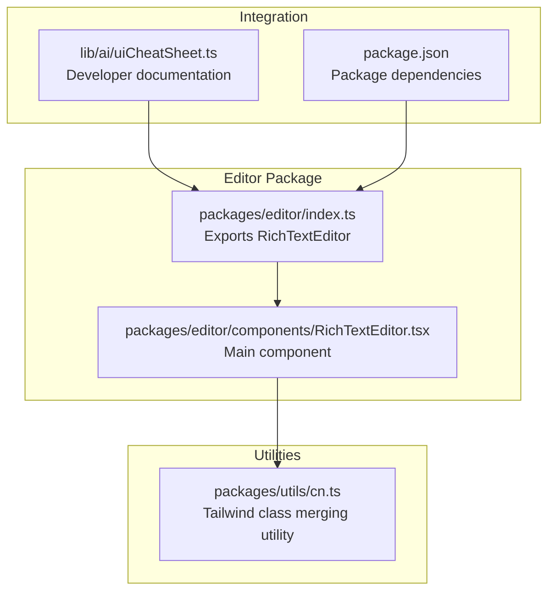
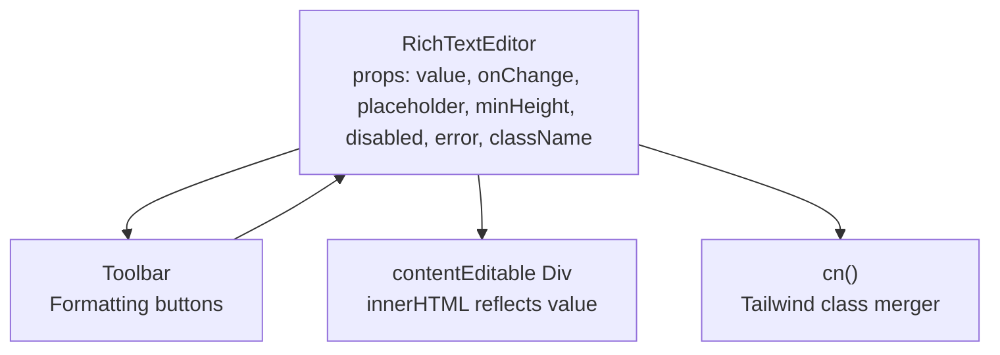
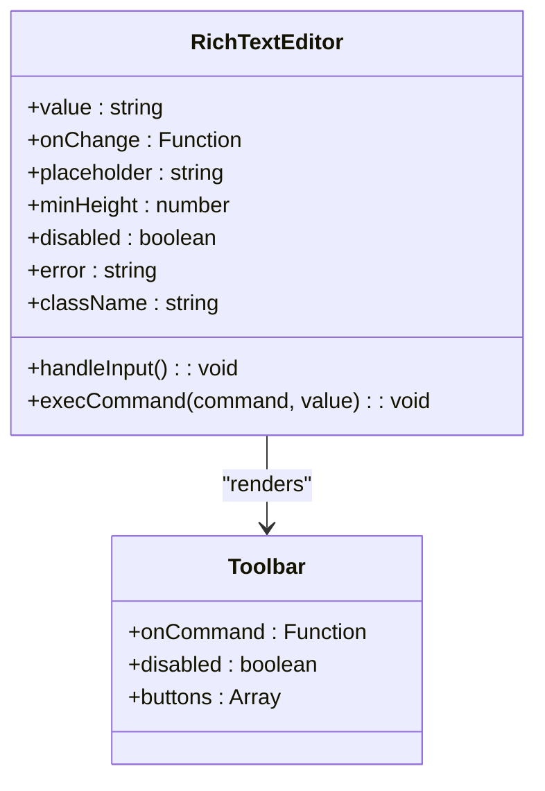
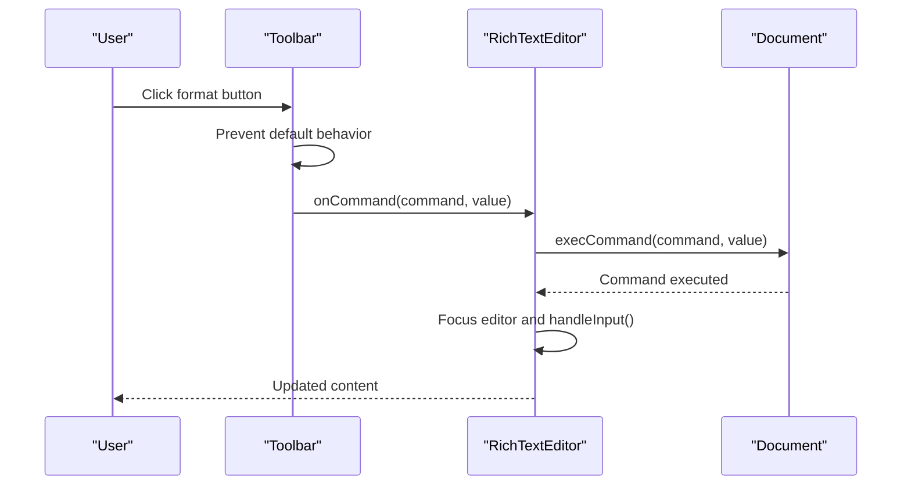
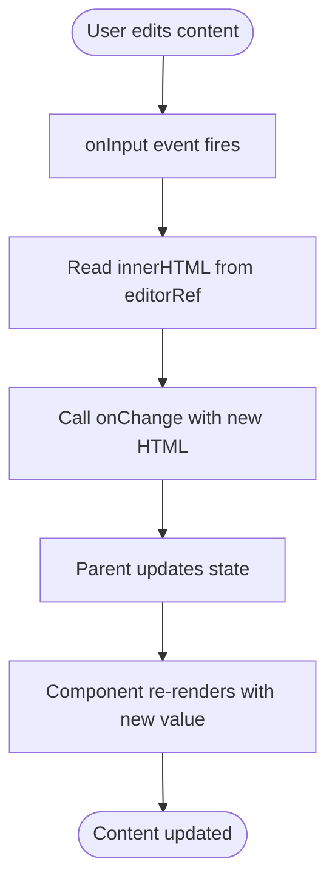
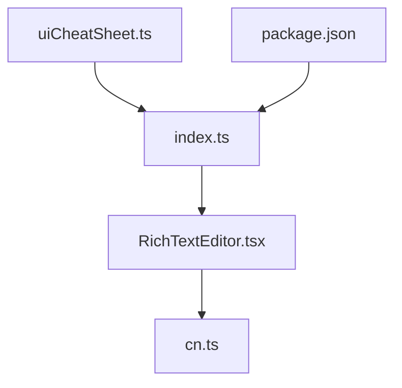

# Rich Text Editor

<cite>
**Referenced Files in This Document**
- [packages/editor/components/RichTextEditor.tsx](file://packages/editor/components/RichTextEditor.tsx)
- [packages/editor/index.ts](file://packages/editor/index.ts)
- [packages/utils/cn.ts](file://packages/utils/cn.ts)
- [lib/ai/uiCheatSheet.ts](file://lib/ai/uiCheatSheet.ts)
- [package.json](file://package.json)
</cite>

## Table of Contents
1. [Introduction](#introduction)
2. [Project Structure](#project-structure)
3. [Core Components](#core-components)
4. [Architecture Overview](#architecture-overview)
5. [Detailed Component Analysis](#detailed-component-analysis)
6. [Dependency Analysis](#dependency-analysis)
7. [Performance Considerations](#performance-considerations)
8. [Troubleshooting Guide](#troubleshooting-guide)
9. [Conclusion](#conclusion)

## Introduction
This document provides comprehensive documentation for the Rich Text Editor component, a key UI primitive in the AI-powered accessibility-first UI engine. The editor is designed to be lightweight, accessible, and highly customizable while integrating seamlessly with the broader component ecosystem. It supports essential text formatting capabilities, keyboard navigation, screen reader compatibility, and responsive design patterns.

The component is part of the @ui/editor package and is intended for use in AI-driven content creation workflows, where structured and accessible rich text editing is required.

## Project Structure
The Rich Text Editor resides within the @ui/editor package and exports a single primary component. Supporting utilities are provided via the @ui/utils package, and the component is integrated into the AI ecosystem documentation for developers.

**Diagram sources**
- [packages/editor/index.ts:1-2](file://packages/editor/index.ts#L1-L2)
- [packages/editor/components/RichTextEditor.tsx:1-121](file://packages/editor/components/RichTextEditor.tsx#L1-L121)
- [packages/utils/cn.ts:1-11](file://packages/utils/cn.ts#L1-L11)
- [lib/ai/uiCheatSheet.ts:69-71](file://lib/ai/uiCheatSheet.ts#L69-L71)
- [package.json:1-68](file://package.json#L1-L68)

**Section sources**
- [packages/editor/index.ts:1-2](file://packages/editor/index.ts#L1-L2)
- [packages/editor/components/RichTextEditor.tsx:1-121](file://packages/editor/components/RichTextEditor.tsx#L1-L121)
- [packages/utils/cn.ts:1-11](file://packages/utils/cn.ts#L1-L11)
- [lib/ai/uiCheatSheet.ts:69-71](file://lib/ai/uiCheatSheet.ts#L69-L71)
- [package.json:1-68](file://package.json#L1-L68)

## Core Components
The Rich Text Editor consists of two primary parts:
- RichTextEditor: The main component that renders the editable area and formatting toolbar.
- Toolbar: A formatting toolbar that provides quick access to common text formatting commands.

Key features:
- ContentEditable support with controlled value updates via onChange callbacks.
- Accessible ARIA attributes for screen reader compatibility.
- Placeholder support and dynamic styling based on focus and error states.
- Minimal styling using Tailwind classes merged via a utility function.
- Keyboard-friendly interactions and mouse-based formatting commands.

**Section sources**
- [packages/editor/components/RichTextEditor.tsx:4-72](file://packages/editor/components/RichTextEditor.tsx#L4-L72)
- [packages/editor/components/RichTextEditor.tsx:74-121](file://packages/editor/components/RichTextEditor.tsx#L74-L121)

## Architecture Overview
The editor follows a straightforward composition pattern:
- The main component manages state for focus and handles input events.
- The toolbar emits formatting commands that are executed against the document.
- The editor area is a contentEditable div that reflects the current HTML value.
- Utility functions merge Tailwind classes to ensure consistent styling.

**Diagram sources**
- [packages/editor/components/RichTextEditor.tsx:14-72](file://packages/editor/components/RichTextEditor.tsx#L14-L72)
- [packages/editor/components/RichTextEditor.tsx:79-121](file://packages/editor/components/RichTextEditor.tsx#L79-L121)
- [packages/utils/cn.ts:8-10](file://packages/utils/cn.ts#L8-L10)

## Detailed Component Analysis

### RichTextEditor Component
The RichTextEditor component encapsulates the entire editing experience:
- Props: Supports controlled value, onChange callback, placeholder text, minimum height, disabled state, error state, and custom className.
- State: Tracks focus state to adjust visual styling.
- Events: Handles input events to propagate innerHTML changes to the parent via onChange.
- Accessibility: Provides ARIA roles and labels for screen readers.
- Styling: Uses a utility function to merge Tailwind classes safely.

Implementation highlights:
- Controlled value rendering via dangerouslySetInnerHTML ensures the editor displays the latest HTML content.
- Focus state toggles highlight borders and ring styles for better UX.
- Error state visually indicates invalid input with red borders.
- Disabled state reduces opacity and prevents editing.

**Diagram sources**
- [packages/editor/components/RichTextEditor.tsx:4-12](file://packages/editor/components/RichTextEditor.tsx#L4-L12)
- [packages/editor/components/RichTextEditor.tsx:74-77](file://packages/editor/components/RichTextEditor.tsx#L74-L77)

**Section sources**
- [packages/editor/components/RichTextEditor.tsx:14-72](file://packages/editor/components/RichTextEditor.tsx#L14-L72)

### Toolbar Component
The Toolbar provides formatting controls:
- Buttons: Bold, italic, underline, strikethrough, bullet list, numbered list, headings (H1/H2), blockquote, alignment, and link insertion.
- Interaction: Prevents default mouse behavior to maintain focus on the editor during formatting actions.
- Link Creation: Prompts for a URL when inserting links.
- Disabled State: Disables all buttons when the editor is disabled.

**Diagram sources**
- [packages/editor/components/RichTextEditor.tsx:32-36](file://packages/editor/components/RichTextEditor.tsx#L32-L36)
- [packages/editor/components/RichTextEditor.tsx:95-118](file://packages/editor/components/RichTextEditor.tsx#L95-L118)

**Section sources**
- [packages/editor/components/RichTextEditor.tsx:79-121](file://packages/editor/components/RichTextEditor.tsx#L79-L121)

### ContentEditable Behavior
The editor leverages a contentEditable div to enable rich text editing:
- Controlled Rendering: The editor's HTML content is controlled via props and reflected in the DOM via dangerouslySetInnerHTML.
- Input Synchronization: Every input event triggers a callback to update the parent component with the current innerHTML.
- Placeholder Support: A data attribute stores placeholder text for styling and accessibility purposes.
- Focus Management: Focus and blur handlers update the internal focus state to adjust visual styling.

**Diagram sources**
- [packages/editor/components/RichTextEditor.tsx:26-30](file://packages/editor/components/RichTextEditor.tsx#L26-L30)
- [packages/editor/components/RichTextEditor.tsx:49-67](file://packages/editor/components/RichTextEditor.tsx#L49-L67)

**Section sources**
- [packages/editor/components/RichTextEditor.tsx:26-67](file://packages/editor/components/RichTextEditor.tsx#L26-L67)

## Dependency Analysis
The Rich Text Editor integrates with several supporting systems:
- Tailwind Class Merging: The cn utility merges Tailwind classes safely, preventing conflicts and ensuring consistent styling.
- Package Export: The editor is exported from the package index for easy consumption.
- AI Ecosystem Documentation: The component is documented in the UI cheat sheet for developers building AI-driven experiences.
- Package Dependencies: The project includes Tailwind-related dependencies that support the component's styling approach.

**Diagram sources**
- [packages/editor/components/RichTextEditor.tsx:1-2](file://packages/editor/components/RichTextEditor.tsx#L1-L2)
- [packages/utils/cn.ts:1-11](file://packages/utils/cn.ts#L1-L11)
- [packages/editor/index.ts:1-2](file://packages/editor/index.ts#L1-L2)
- [lib/ai/uiCheatSheet.ts:69-71](file://lib/ai/uiCheatSheet.ts#L69-L71)
- [package.json:28-44](file://package.json#L28-L44)

**Section sources**
- [packages/utils/cn.ts:1-11](file://packages/utils/cn.ts#L1-L11)
- [packages/editor/index.ts:1-2](file://packages/editor/index.ts#L1-L2)
- [lib/ai/uiCheatSheet.ts:69-71](file://lib/ai/uiCheatSheet.ts#L69-L71)
- [package.json:28-44](file://package.json#L28-L44)

## Performance Considerations
- Controlled Updates: The editor synchronizes content via onChange on every input event. For very large documents, consider debouncing the onChange callback to reduce re-renders.
- HTML Rendering: Using dangerouslySetInnerHTML avoids incremental DOM updates but requires careful sanitization if user-provided HTML is involved.
- Styling: The cn utility efficiently merges Tailwind classes, minimizing CSS conflicts and ensuring optimal rendering performance.
- Accessibility: ARIA attributes and keyboard navigation improve usability without impacting performance.

## Troubleshooting Guide
Common issues and resolutions:
- Placeholder Not Visible: Ensure the placeholder prop is set and the data-placeholder attribute is applied to the editor div.
- Formatting Commands Not Working: Verify that execCommand is supported in the target browser and that focus is maintained after executing commands.
- Disabled State Not Applying: Confirm that the disabled prop is passed correctly and that the toolbar buttons are disabled.
- Error State Styling: Check that the error prop is provided and that the component applies the appropriate border styling.
- Styling Conflicts: Use the cn utility to merge classes and avoid conflicting Tailwind directives.

**Section sources**
- [packages/editor/components/RichTextEditor.tsx:17-21](file://packages/editor/components/RichTextEditor.tsx#L17-L21)
- [packages/editor/components/RichTextEditor.tsx:41-46](file://packages/editor/components/RichTextEditor.tsx#L41-L46)
- [packages/editor/components/RichTextEditor.tsx:100-109](file://packages/editor/components/RichTextEditor.tsx#L100-L109)
- [packages/utils/cn.ts:8-10](file://packages/utils/cn.ts#L8-L10)

## Conclusion
The Rich Text Editor is a focused, accessible, and extensible component that fits seamlessly into the AI-powered UI engine. Its clean architecture, strong accessibility features, and integration with the broader component ecosystem make it suitable for content creation workflows. By leveraging controlled updates, ARIA attributes, and Tailwind-based styling, it provides a robust foundation for rich text editing in modern web applications.