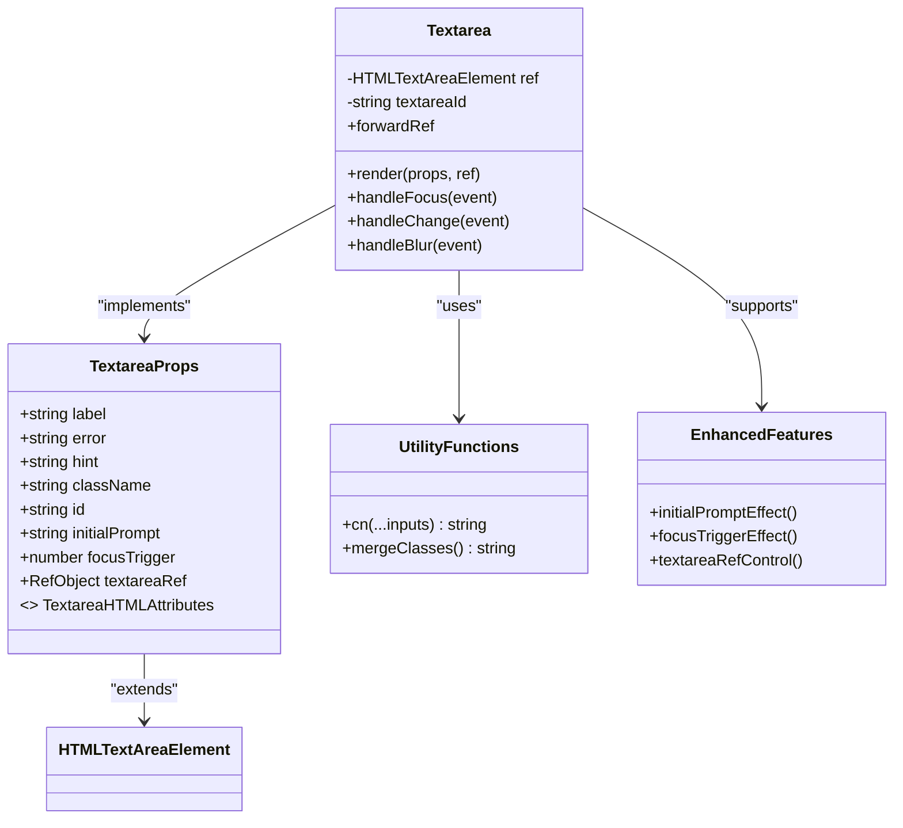
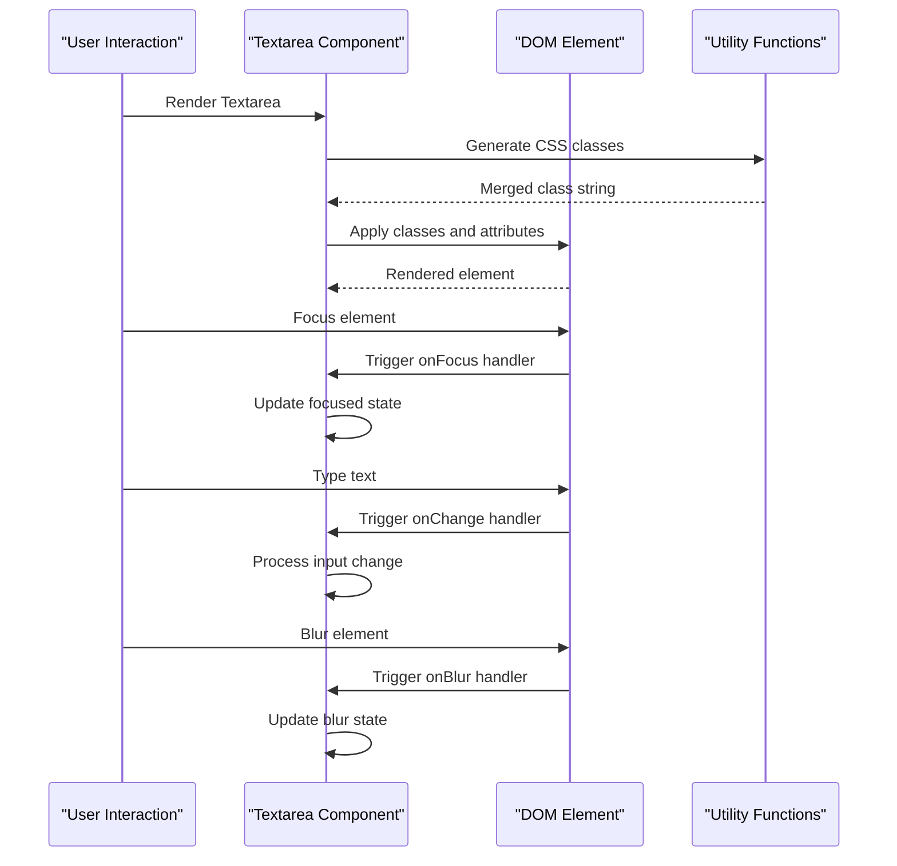
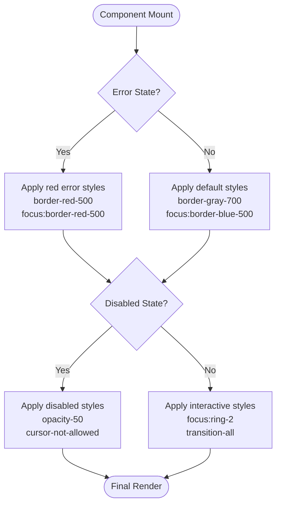
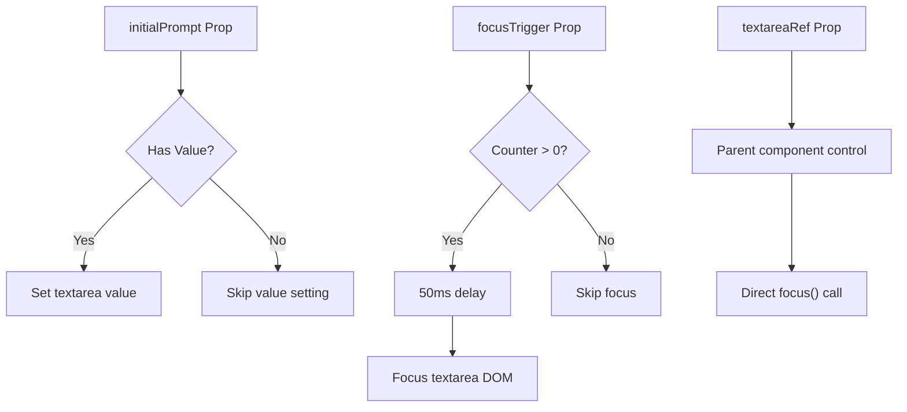

# Textarea Component

<cite>
**Referenced Files in This Document**
- [Textarea.tsx](file://packages/core/components/Textarea.tsx)
- [cn.ts](file://packages/utils/cn.ts)
- [index.ts](file://packages/core/index.ts)
- [PromptInput.tsx](file://components/prompt-input/PromptInput.tsx)
- [types.ts](file://components/prompt-input/types.ts)
</cite>

## Update Summary
**Changes Made**
- Updated component features section to include new props for initialPrompt pre-filling and focusTrigger management
- Added documentation for textareaRef prop for programmatic focus control
- Enhanced API documentation with new enhanced props
- Updated architecture overview to reflect enhanced functionality
- Added troubleshooting guidance for new features

## Table of Contents
1. [Introduction](#introduction)
2. [Project Structure](#project-structure)
3. [Core Components](#core-components)
4. [Architecture Overview](#architecture-overview)
5. [Detailed Component Analysis](#detailed-component-analysis)
6. [Enhanced Props and Features](#enhanced-props-and-features)
7. [Dependency Analysis](#dependency-analysis)
8. [Performance Considerations](#performance-considerations)
9. [Troubleshooting Guide](#troubleshooting-guide)
10. [Conclusion](#conclusion)

## Introduction
The Textarea component is a foundational form element designed for the AI-powered accessibility-first UI engine. Built with TypeScript and React, this component provides a robust, accessible, and visually consistent text input experience that integrates seamlessly with the application's dark-themed design system. The component follows modern React best practices by utilizing forwardRef for DOM access and implementing proper TypeScript interfaces for type safety.

**Updated** Enhanced with new props for initialPrompt pre-filling, focusTrigger management, and textareaRef for programmatic focus control, making it ideal for prompt input systems and dynamic form interactions.

## Project Structure
The Textarea component is part of the core package ecosystem within the larger Next.js application. It resides in the packages/core/components directory and is exported through the package's index file, making it available throughout the application.

```mermaid
graph TB
subgraph "Packages Structure"
CORE[packages/core]
UTILS[packages/utils]
subgraph "Core Package"
COMPONENTS[components/]
INDEX[index.ts]
END[Textarea.tsx]
END
CN[cn.ts]
END
INDEX --> END
END --> APP[app/page.tsx]
APP --> NEXT[Next.js App Router]
```

**Diagram sources**
- [Textarea.tsx:1-36](file://packages/core/components/Textarea.tsx#L1-L36)
- [cn.ts:1-11](file://packages/utils/cn.ts#L1-L11)
- [index.ts:1-8](file://packages/core/index.ts#L1-L8)

**Section sources**
- [Textarea.tsx:1-36](file://packages/core/components/Textarea.tsx#L1-L36)
- [index.ts:1-8](file://packages/core/index.ts#L1-L8)

## Core Components
The Textarea component serves as a specialized form input element optimized for multi-line text entry. It extends the native HTML textarea element while adding enhanced accessibility features, visual feedback states, and consistent styling that aligns with the application's design system.

### Component Features
- **Accessibility-First Design**: Implements proper ARIA attributes and semantic markup
- **Dynamic Styling**: Responsive color schemes that adapt to user interactions
- **Form Integration**: Seamless compatibility with React Hook Form and other form libraries
- **TypeScript Support**: Full type safety with comprehensive prop interfaces
- **ForwardRef Implementation**: Direct DOM access for advanced interactions
- **Enhanced Props Support**: New props for initialPrompt pre-filling and focusTrigger management
- **Programmatic Control**: textareaRef prop for direct DOM manipulation and focus control

### Key Properties
The component accepts standard textarea HTML attributes along with enhanced props for accessibility and user experience:

| Property | Type | Description | Default |
|----------|------|-------------|---------|
| `label` | `string` | Text label displayed above the textarea | `undefined` |
| `error` | `string` | Error message displayed below textarea | `undefined` |
| `hint` | `string` | Helper text displayed below textarea | `undefined` |
| `className` | `string` | Additional CSS classes applied to the textarea | `undefined` |
| `id` | `string` | Unique identifier for the textarea element | Auto-generated |
| `initialPrompt` | `string` | Pre-fill value for the textarea (for prompt input systems) | `undefined` |
| `focusTrigger` | `number` | Counter to trigger automatic focus (for prompt input systems) | `undefined` |
| `textareaRef` | `React.RefObject<HTMLTextAreaElement>` | Reference for programmatic focus control | `undefined` |

**Updated** Added new enhanced props for initialPrompt pre-filling, focusTrigger management, and textareaRef for programmatic control.

**Section sources**
- [Textarea.tsx:4-8](file://packages/core/components/Textarea.tsx#L4-L8)
- [Textarea.tsx:10-35](file://packages/core/components/Textarea.tsx#L10-L35)
- [types.ts:20-24](file://components/prompt-input/types.ts#L20-L24)

## Architecture Overview
The Textarea component follows a modular architecture pattern that emphasizes separation of concerns and reusability. It leverages the shared utility functions from the utils package while maintaining its own component-specific logic.



**Diagram sources**
- [Textarea.tsx:4-35](file://packages/core/components/Textarea.tsx#L4-L35)
- [cn.ts:8-10](file://packages/utils/cn.ts#L8-L10)
- [PromptInput.tsx:75-81](file://components/prompt-input/PromptInput.tsx#L75-L81)

The component architecture demonstrates several key design patterns:

1. **ForwardRef Pattern**: Enables direct DOM manipulation and focus management
2. **Utility Function Integration**: Leverages the cn utility for intelligent class merging
3. **Accessibility Integration**: Implements proper ARIA attributes and keyboard navigation
4. **Enhanced Props Pattern**: Supports initialPrompt pre-filling and focusTrigger management
5. **Programmatic Control**: Provides textareaRef for external focus control
6. **Styling Abstraction**: Uses Tailwind CSS classes with dynamic state management

**Section sources**
- [Textarea.tsx:1-36](file://packages/core/components/Textarea.tsx#L1-L36)
- [cn.ts:1-11](file://packages/utils/cn.ts#L1-L11)

## Detailed Component Analysis

### Component Implementation
The Textarea component is implemented as a forwardRef React component that wraps the native textarea element with enhanced functionality and accessibility features.



**Diagram sources**
- [Textarea.tsx:10-35](file://packages/core/components/Textarea.tsx#L10-L35)

### Accessibility Features
The component implements comprehensive accessibility features that ensure inclusive usage across different assistive technologies and user scenarios:

#### ARIA Implementation
- `aria-invalid`: Dynamically set based on error state
- Proper labeling through `htmlFor` and `id` attributes
- Semantic HTML structure for screen reader compatibility

#### Keyboard Navigation
- Native tab order support
- Standard keyboard shortcuts for text editing
- Focus management for modal contexts

#### Screen Reader Support
- Descriptive labels for form context
- Error messages announced via alert roles
- Placeholder text available through ARIA attributes

### Styling System
The component utilizes a sophisticated styling approach that combines Tailwind CSS utility classes with dynamic state management:



**Diagram sources**
- [Textarea.tsx:19-25](file://packages/core/components/Textarea.tsx#L19-L25)

**Section sources**
- [Textarea.tsx:1-36](file://packages/core/components/Textarea.tsx#L1-L36)

## Enhanced Props and Features

### Initial Prompt Pre-filling
The `initialPrompt` prop enables automatic pre-filling of the textarea with predefined content, commonly used in prompt refinement scenarios:

- **Purpose**: Pre-populate the textarea with initial values for prompt refinement
- **Implementation**: Automatically sets the textarea value when initialPrompt changes
- **Use Cases**: Refine button clicks, template loading, suggestion pre-filling

### Focus Trigger Management
The `focusTrigger` prop provides controlled focus management through a counter mechanism:

- **Purpose**: Programmatically trigger focus after component mounting
- **Implementation**: Uses useEffect with counter-based triggering
- **Delay Mechanism**: 50ms delay to ensure DOM readiness before focusing
- **Cleanup**: Proper timeout cleanup to prevent memory leaks

### Programmatic Focus Control
The `textareaRef` prop enables external control over the textarea's focus state:

- **Purpose**: Allow parent components to programmatically focus the textarea
- **Implementation**: Direct DOM reference access for focus management
- **Integration**: Seamlessly works with focusTrigger for combined control



**Diagram sources**
- [PromptInput.tsx:75-81](file://components/prompt-input/PromptInput.tsx#L75-L81)
- [types.ts:20-24](file://components/prompt-input/types.ts#L20-L24)

**Section sources**
- [PromptInput.tsx:75-81](file://components/prompt-input/PromptInput.tsx#L75-L81)
- [types.ts:20-24](file://components/prompt-input/types.ts#L20-L24)

## Dependency Analysis
The Textarea component maintains minimal external dependencies while leveraging essential utilities for optimal functionality and maintainability.

```mermaid
graph LR
subgraph "Internal Dependencies"
REACT[React Core]
UTILS[Utility Functions]
CN[cn utility]
END[Enhanced Props System]
END
subgraph "External Dependencies"
CLSX[clsx library]
TWMERGE[tailwind-merge library]
END
subgraph "Component Layer"
TEXTAREA[Textarea Component]
END
REACT --> TEXTAREA
UTILS --> TEXTAREA
CN --> TEXTAREA
END --> TEXTAREA
CLSX --> CN
TWMERGE --> CN
```

**Diagram sources**
- [Textarea.tsx:1-2](file://packages/core/components/Textarea.tsx#L1-L2)
- [cn.ts:1-10](file://packages/utils/cn.ts#L1-L10)

### Dependency Chain Analysis
The component follows a clean dependency chain that promotes maintainability and testability:

1. **React Core**: Provides component lifecycle and state management
2. **Utility Layer**: Abstracts class composition logic
3. **Enhanced Props System**: Handles new functionality for prompt input systems
4. **External Libraries**: Handle CSS class merging and conflict resolution

### Circular Dependency Prevention
The component architecture avoids circular dependencies through:
- Single-direction dependency flow (component → utility → external)
- ForwardRef pattern preventing parent-child coupling
- Pure function utilities with no side effects
- Controlled effect dependencies for enhanced props

**Section sources**
- [Textarea.tsx:1-36](file://packages/core/components/Textarea.tsx#L1-L36)
- [cn.ts:1-11](file://packages/utils/cn.ts#L1-L11)

## Performance Considerations
The Textarea component is optimized for performance through several strategic design decisions:

### Rendering Optimization
- **Minimal Re-renders**: Uses forwardRef to avoid unnecessary component wrapping
- **Efficient State Management**: Local state only for focus management
- **Static Class Generation**: CSS classes computed once during render
- **Controlled Effects**: Enhanced props use targeted dependency arrays

### Memory Management
- **No Event Listeners**: Leverages native DOM events instead of React handlers
- **Clean Ref Patterns**: Proper cleanup of DOM references
- **Lightweight Props**: Minimal prop surface area reduces overhead
- **Timeout Cleanup**: Proper cleanup of focus triggers

### Bundle Size Impact
- **Tree Shaking Friendly**: Individual component exports prevent unused code inclusion
- **Utility Reuse**: Shared cn function reduces code duplication
- **Native Browser APIs**: No additional runtime dependencies
- **Optional Enhancements**: Enhanced props don't affect basic component bundle

## Troubleshooting Guide

### Common Issues and Solutions

#### Issue: Incorrect Error State Display
**Symptoms**: Error message not appearing despite setting error prop
**Solution**: Ensure `aria-invalid` attribute is properly set and CSS classes are correctly merged

#### Issue: Focus State Not Working
**Symptoms**: Blue ring or focus styles not appearing
**Solution**: Verify that the component receives focus and that Tailwind CSS is properly configured

#### Issue: Label Association Problems
**Symptoms**: Screen readers not announcing labels correctly
**Solution**: Ensure unique `id` attributes are generated and `htmlFor` matches the textarea `id`

#### Issue: Styling Conflicts
**Symptoms**: Custom styles overriding component styles unexpectedly
**Solution**: Use the `className` prop to extend styles rather than override built-in classes

#### Issue: Enhanced Props Not Working
**Symptoms**: initialPrompt not pre-filling, focusTrigger not triggering, or textareaRef not controlling focus
**Solutions**:
- Verify enhanced props are passed correctly to the component
- Check that focusTrigger counter increments appropriately
- Ensure textareaRef is properly initialized before use
- Confirm proper cleanup of effects and timeouts

#### Issue: Focus Timing Problems
**Symptoms**: Focus not working immediately after component mount
**Solution**: Ensure proper delay mechanism is in place and component has mounted before focusing

### Debugging Tips
1. **Console Logging**: Add temporary logs in event handlers to trace user interactions
2. **CSS Inspection**: Use browser dev tools to verify class application
3. **Accessibility Testing**: Run automated accessibility scans to identify issues
4. **Component Isolation**: Test the component in isolation to identify integration problems
5. **Enhanced Props Testing**: Create test scenarios specifically for initialPrompt, focusTrigger, and textareaRef functionality

**Section sources**
- [Textarea.tsx:26-30](file://packages/core/components/Textarea.tsx#L26-L30)
- [PromptInput.tsx:75-81](file://components/prompt-input/PromptInput.tsx#L75-L81)

## Conclusion
The Textarea component represents a well-crafted, accessibility-focused form element that exemplifies modern React development practices. Its implementation demonstrates careful consideration of user experience, performance optimization, and maintainability. The component's modular architecture ensures seamless integration with the broader application ecosystem while maintaining clear boundaries and predictable behavior.

**Updated** The component now supports enhanced functionality for prompt input systems, including initialPrompt pre-filling, focusTrigger management, and programmatic focus control through textareaRef. These enhancements make it particularly suitable for AI-powered interfaces and dynamic form interactions.

Key strengths of the implementation include:
- **Accessibility-First Approach**: Comprehensive ARIA support and semantic markup
- **Performance Optimization**: Efficient rendering and minimal overhead
- **Type Safety**: Full TypeScript integration with comprehensive interfaces
- **Extensibility**: Flexible design that accommodates various use cases
- **Enhanced Props Support**: New functionality for prompt input systems
- **Programmatic Control**: Direct DOM access for advanced interactions
- **Maintainability**: Clean architecture with clear separation of concerns

The component serves as a foundation for more complex form interactions and demonstrates best practices for building accessible, user-friendly interfaces in modern web applications. The enhanced props make it particularly valuable for AI-powered interfaces where programmatic control and dynamic content management are essential.