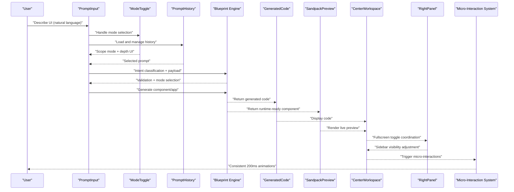
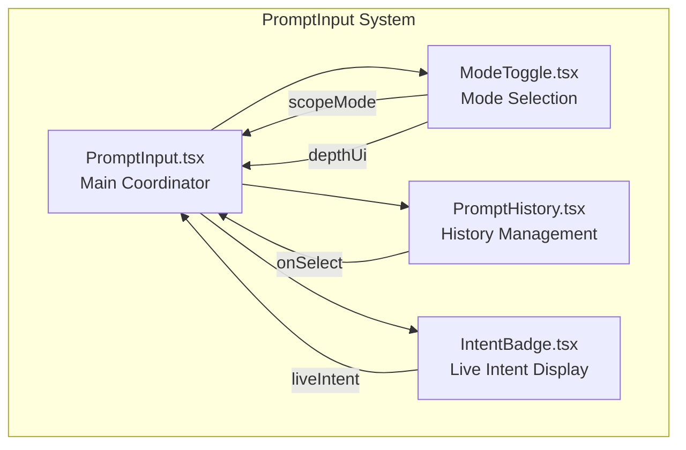
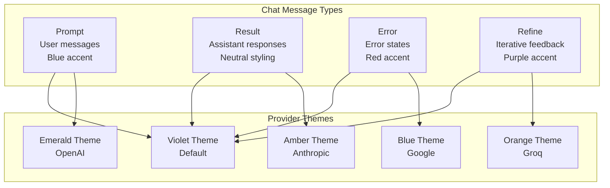
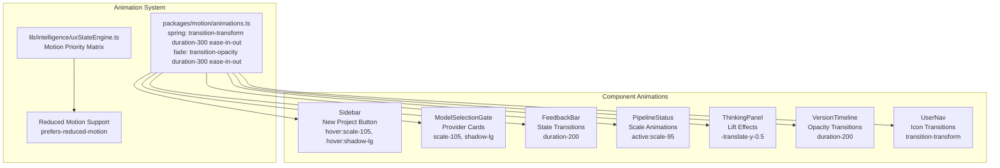
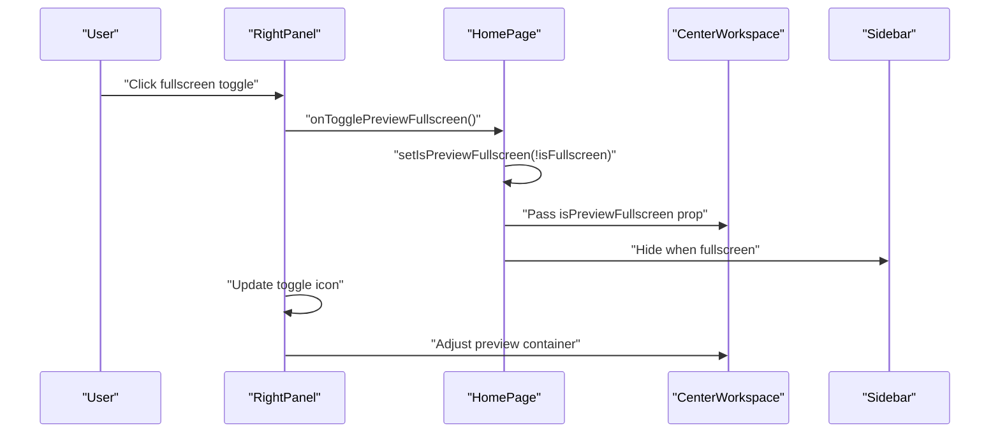
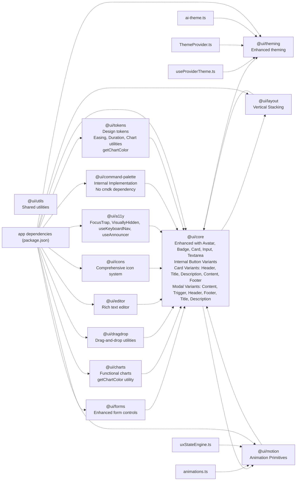

# UI Component System

<cite>
**Referenced Files in This Document**
- [README.md](file://README.md)
- [package.json](file://package.json)
- [components/A11yReport.tsx](file://components/A11yReport.tsx)
- [components/GeneratedCode.tsx](file://components/GeneratedCode.tsx)
- [components/prompt-input/ModeToggle.tsx](file://components/prompt-input/ModeToggle.tsx)
- [components/prompt-input/PromptHistory.tsx](file://components/prompt-input/PromptHistory.tsx)
- [components/prompt-input/PromptInput.tsx](file://components/prompt-input/PromptInput.tsx)
- [components/prompt-input/types.ts](file://components/prompt-input/types.ts)
- [components/VersionTimeline.tsx](file://components/VersionTimeline.tsx)
- [components/SandpackPreview.tsx](file://components/SandpackPreview.tsx)
- [components/IntentBadge.tsx](file://components/IntentBadge.tsx)
- [components/ide/CenterWorkspace.tsx](file://components/ide/CenterWorkspace.tsx)
- [components/ide/RightPanel.tsx](file://components/ide/RightPanel.tsx)
- [components/ide/Sidebar.tsx](file://components/ide/Sidebar.tsx)
- [components/workspace/WorkspaceProvider.tsx](file://components/workspace/WorkspaceProvider.tsx)
- [components/workspace/WorkspaceSwitcher.tsx](file://components/workspace/WorkspaceSwitcher.tsx)
- [components/auth/SessionProvider.tsx](file://components/auth/SessionProvider.tsx)
- [components/auth/UserNav.tsx](file://components/auth/UserNav.tsx)
- [components/FeedbackBar.tsx](file://components/FeedbackBar.tsx)
- [components/ModelSelectionGate.tsx](file://components/ModelSelectionGate.tsx)
- [components/PipelineStatus.tsx](file://components/PipelineStatus.tsx)
- [components/ThinkingPanel.tsx](file://components/ThinkingPanel.tsx)
- [lib/ai/uiCheatSheet.ts](file://lib/ai/uiCheatSheet.ts)
- [lib/ai/prompts.ts](file://lib/ai/prompts.ts)
- [lib/hooks/useProviderTheme.ts](file://lib/hooks/useProviderTheme.ts)
- [lib/intelligence/uxStateEngine.ts](file://lib/intelligence/uxStateEngine.ts)
- [lib/intelligence/depthEngine.ts](file://lib/intelligence/depthEngine.ts)
- [packages/motion/animations.ts](file://packages/motion/animations.ts)
- [packages/theming/components/ThemeProvider.tsx](file://packages/theming/components/ThemeProvider.tsx)
- [packages/theming/ai-theme.ts](file://packages/theming/ai-theme.ts)
- [packages/layout/ai-layout.ts](file://packages/layout/ai-layout.ts)
- [packages/command-palette/components/CommandPalette.tsx](file://packages/command-palette/components/CommandPalette.tsx)
- [packages/command-palette/index.ts](file://packages/command-palette/index.ts)
- [packages/core/components/Button.tsx](file://packages/core/components/Button.tsx)
- [packages/core/components/Card.tsx](file://packages/core/components/Card.tsx)
- [packages/core/components/Modal.tsx](file://packages/core/components/Modal.tsx)
- [packages/core/index.ts](file://packages/core/index.ts)
- [packages/tokens/index.ts](file://packages/tokens/index.ts)
- [packages/tokens/transitions.ts](file://packages/tokens/transitions.ts)
- [packages/tokens/colors.ts](file://packages/tokens/colors.ts)
- [packages/charts/components/Charts.tsx](file://packages/charts/components/Charts.tsx)
- [packages/charts/index.ts](file://packages/charts/index.ts)
- [packages/a11y/hooks/useAnnouncer.ts](file://packages/a11y/hooks/useAnnouncer.ts)
- [packages/a11y/components/FocusTrap.tsx](file://packages/a11y/components/FocusTrap.tsx)
- [packages/a11y/components/VisuallyHidden.tsx](file://packages/a11y/components/VisuallyHidden.tsx)
- [packages/a11y/index.ts](file://packages/a11y/index.ts)
- [app/globals.css](file://app/globals.css)
</cite>

## Update Summary
**Changes Made**
- Updated FeedbackBar component documentation to reflect improved React component lifecycle management with proper useCallback wrappers and dependency arrays
- Enhanced accessibility documentation to include useAnnouncer hook improvements and screen reader announcements
- Added comprehensive lifecycle management analysis for state transitions and data fetching
- Updated component architecture to emphasize proper React patterns and performance optimization
- Enhanced accessibility component integration with screen reader support improvements

## Table of Contents
1. [Introduction](#introduction)
2. [Project Structure](#project-structure)
3. [Core Components](#core-components)
4. [Architecture Overview](#architecture-overview)
5. [Modular Prompt Input System](#modular-prompt-input-system)
6. [Enhanced Chat System](#enhanced-chat-system)
7. [Provider Theme System](#provider-theme-system)
8. [Micro-Interaction System](#micro-interaction-system)
9. [Fullscreen Preview Functionality](#fullscreen-preview-functionality)
10. [Enhanced User Experience Features](#enhanced-user-experience-features)
11. [Detailed Component Analysis](#detailed-component-analysis)
12. [Internal Implementation Strategy](#internal-implementation-strategy)
13. [Design Token System](#design-token-system)
14. [Dependency Analysis](#dependency-analysis)
15. [Performance Considerations](#performance-considerations)
16. [Troubleshooting Guide](#troubleshooting-guide)
17. [Conclusion](#conclusion)
18. [Appendices](#appendices)

## Introduction
This document describes the internal UI component system and design framework of an AI-powered, accessibility-first React application. The system has been comprehensively enhanced with production-ready components that prioritize accessibility, performance, and maintainability. It focuses on:

- The component registry and catalog of built-in components across @ui/* packages
- The blueprint engine enforcing design system rules and style DNA consistency
- The component library organization with accessibility-first components
- Composition patterns, prop interfaces, and customization options
- Guidelines for adding new components and extending the design system
- The relationship between generated components and the internal ecosystem
- Usage patterns and best practices for maintaining design consistency

**Updated** The system now emphasizes production-ready components with comprehensive accessibility features, enhanced theming capabilities, and improved performance optimizations. All AI-assisted features have been removed, focusing on reliable, accessible UI components. The system has adopted an internal implementation strategy to reduce external dependencies and improve bundle size optimization.

## Project Structure
The repository is a Next.js application with a comprehensive monorepo-style packages directory for reusable UI libraries and a components directory for application-specific UI building blocks. The UI ecosystem integrates:

- Built-in components under components/
- Modular prompt input system under components/prompt-input/
- UI packages under @ui/* packages with enhanced accessibility and functionality
- Application pages under app/
- Supporting providers and IDE panels under components/
- Enhanced theming system under packages/theming/
- Micro-interaction system under packages/motion/
- Accessibility components under @ui/a11y package
- **Updated** Internal implementations under @ui/packages replacing external dependencies
- **New** Design token system under @ui/tokens with easing, duration, and chart utilities

```mermaid
graph TB
subgraph "Application"
APP_LAYOUT["app/layout.tsx"]
APP_PAGE["app/page.tsx<br/>HomePage + Fullscreen Coordination"]
APP_LOGIN["app/login/page.tsx"]
APP_FORGOT["app/forgot-password/page.tsx"]
APP_RESET["app/reset-password/page.tsx"]
APP_GLOBALS["app/globals.css<br/>Global Animation Classes"]
end
subgraph "Components"
PROMPT["components/prompt-input/PromptInput.tsx"]
MODE_TOGGLE["components/prompt-input/ModeToggle.tsx"]
PROMPT_HISTORY["components/prompt-input/PromptHistory.tsx"]
GENCODE["components/GeneratedCode.tsx"]
A11Y["components/A11yReport.tsx"]
TIMELINE["components/VersionTimeline.tsx<br/>Hover Animations"]
SANDBOX["components/SandpackPreview.tsx"]
INTENT["components/IntentBadge.tsx"]
IDE_CW["components/ide/CenterWorkspace.tsx<br/>Enhanced Chat + Fullscreen"]
IDE_RP["components/ide/RightPanel.tsx<br/>Fullscreen Toggle"]
IDE_SB["components/ide/Sidebar.tsx<br/>New Project Button Animations"]
WS_PROV["components/workspace/WorkspaceProvider.tsx"]
WS_SWITCH["components/workspace/WorkspaceSwitcher.tsx"]
AUTH_SP["components/auth/SessionProvider.tsx"]
AUTH_NAV["components/auth/UserNav.tsx<br/>Transition Animations"]
FEEDBACK["components/FeedbackBar.tsx<br/>Interactive Elements"]
PIPELINE["components/PipelineStatus.tsx<br/>Scale Transitions"]
THINKING["components/ThinkingPanel.tsx<br/>Multi-State Animations"]
MODE_GATE["components/ModelSelectionGate.tsx<br/>Provider Card Animations"]
end
subgraph "Enhanced UI Packages (@ui/*)"
UI_CORE["@ui/core<br/>Avatar, Badge, Card, Input, Textarea<br/>Internal Button Variants<br/>Card Variants: Header, Title, Description, Content, Footer"]
UI_A11Y["@ui/a11y<br/>FocusTrap, VisuallyHidden, useKeyboardNav, useAnnouncer"]
UI_FORMS["@ui/forms<br/>Enhanced form controls"]
UI_LAYOUT["@ui/layout<br/>Vertical Stacking, Grid Systems"]
UI_MOTION["@ui/motion<br/>Animation Primitives"]
UI_CHARTS["@ui/charts<br/>Functional charts<br/>getChartColor utility"]
UI_DRAGDROP["@ui/dragdrop<br/>Drag-and-drop utilities"]
UI_EDITOR["@ui/editor<br/>Rich text editor"]
UI_ICONS["@ui/icons<br/>Comprehensive icon system"]
UI_THEMING["@ui/theming<br/>Enhanced theming system"]
UI_UTILS["@ui/utils<br/>Shared utilities"]
UI_COMMAND_PALETTE["@ui/command-palette<br/>Internal Command Palette<br/>No cmdk dependency"]
UI_TOKENS["@ui/tokens<br/>Design tokens<br/>Easing, Duration, Chart utilities"]
end
subgraph "Theming System"
THEME_HOOK["lib/hooks/useProviderTheme.ts<br/>Provider Color Palettes"]
THEME_PROVIDER["packages/theming/components/ThemeProvider.tsx<br/>System Theme"]
THEME_AI["packages/theming/ai-theme.ts<br/>AI Custom Theme"]
THEME_OPENAI["OpenAI Emerald Theme"]
THEME_ANTHROPIC["Anthropic Amber Theme"]
THEME_GOOGLE["Google Blue Theme"]
THEME_GROQ["Groq Orange Theme"]
THEME_DEFAULT["Default Violet Theme"]
end
subgraph "Motion System"
MOTION_ANIM["packages/motion/animations.ts<br/>Spring & Fade Transitions"]
UX_ENGINE["lib/intelligence/uxStateEngine.ts<br/>Motion Priority Matrix"]
DEPTH_ENGINE["lib/intelligence/depthEngine.ts<br/>Reduced Motion Support"]
end
APP_LAYOUT --> PROMPT
APP_PAGE --> IDE_CW
IDE_CW --> GENCODE
IDE_CW --> A11Y
IDE_CW --> TIMELINE
IDE_CW --> SANDBOX
IDE_CW --> THEME_HOOK
IDE_RP --> THEME_HOOK
PROMPT --> MODE_TOGGLE
PROMPT --> PROMPT_HISTORY
PROMPT --> INTENT
IDE_RP --> TIMELINE
IDE_SB --> IDE_CW
IDE_SB --> MODE_GATE
IDE_SB --> FEEDBACK
IDE_SB --> PIPELINE
IDE_SB --> THINKING
IDE_SB --> AUTH_NAV
WS_PROV --> IDE_CW
WS_SWITCH --> IDE_CW
AUTH_SP --> APP_LAYOUT
AUTH_NAV --> APP_LAYOUT
THEME_HOOK --> THEME_OPENAI
THEME_HOOK --> THEME_ANTHROPIC
THEME_HOOK --> THEME_GOOGLE
THEME_HOOK --> THEME_GROQ
THEME_HOOK --> THEME_DEFAULT
THEME_PROVIDER --> THEME_HOOK
THEME_AI --> THEME_HOOK
MOTION_ANIM --> UI_MOTION
UX_ENGINE --> MOTION_ANIM
DEPTH_ENGINE --> UX_ENGINE
APP_GLOBALS --> IDE_SB
APP_GLOBALS --> MODE_GATE
APP_GLOBALS --> FEEDBACK
```



**Diagram sources**
- [app/layout.tsx](file://app/layout.tsx)
- [app/page.tsx](file://app/page.tsx)
- [app/globals.css](file://app/globals.css)
- [components/prompt-input/PromptInput.tsx](file://components/prompt-input/PromptInput.tsx)
- [components/prompt-input/ModeToggle.tsx](file://components/prompt-input/ModeToggle.tsx)
- [components/prompt-input/PromptHistory.tsx](file://components/prompt-input/PromptHistory.tsx)
- [components/GeneratedCode.tsx](file://components/GeneratedCode.tsx)
- [components/A11yReport.tsx](file://components/A11yReport.tsx)
- [components/VersionTimeline.tsx](file://components/VersionTimeline.tsx)
- [components/SandpackPreview.tsx](file://components/SandpackPreview.tsx)
- [components/IntentBadge.tsx](file://components/IntentBadge.tsx)
- [components/ide/CenterWorkspace.tsx](file://components/ide/CenterWorkspace.tsx)
- [components/ide/RightPanel.tsx](file://components/ide/RightPanel.tsx)
- [components/ide/Sidebar.tsx](file://components/ide/Sidebar.tsx)
- [components/workspace/WorkspaceProvider.tsx](file://components/workspace/WorkspaceProvider.tsx)
- [components/workspace/WorkspaceSwitcher.tsx](file://components/workspace/WorkspaceSwitcher.tsx)
- [components/auth/SessionProvider.tsx](file://components/auth/SessionProvider.tsx)
- [components/auth/UserNav.tsx](file://components/auth/UserNav.tsx)
- [components/FeedbackBar.tsx](file://components/FeedbackBar.tsx)
- [components/PipelineStatus.tsx](file://components/PipelineStatus.tsx)
- [components/ThinkingPanel.tsx](file://components/ThinkingPanel.tsx)
- [components/ModelSelectionGate.tsx](file://components/ModelSelectionGate.tsx)
- [lib/hooks/useProviderTheme.ts](file://lib/hooks/useProviderTheme.ts)
- [lib/intelligence/uxStateEngine.ts](file://lib/intelligence/uxStateEngine.ts)
- [lib/intelligence/depthEngine.ts](file://lib/intelligence/depthEngine.ts)
- [packages/motion/animations.ts](file://packages/motion/animations.ts)
- [packages/theming/components/ThemeProvider.tsx](file://packages/theming/components/ThemeProvider.tsx)
- [packages/theming/ai-theme.ts](file://packages/theming/ai-theme.ts)

**Section sources**
- [README.md:1-37](file://README.md#L1-L37)
- [package.json:1-68](file://package.json#L1-L68)

## Core Components
This section documents the primary UI components that form the backbone of the enhanced design system and authoring workflow.

**Updated** The system now includes comprehensive accessibility components and enhanced core components with internal implementations:

- **PromptInput**: Modular natural language input system with intent classification, voice input, image-to-text attachment, and generation modes (component, app, depth UI). Now composed of ModeToggle and PromptHistory sub-components.
- **ModeToggle**: Dedicated component for generation mode selection with scope switching and depth UI toggle.
- **PromptHistory**: History management component for reusing previous prompts with generation metadata.
- **GeneratedCode**: Read-only code viewer with copy/download actions and syntax highlighting.
- **A11yReport**: Accessibility scoring and violation listing with severity-based styling and suggested fixes.
- **VersionTimeline**: Responsive timeline navigation and rollback across project versions with intelligent scroll management and hover animations.
- **SandpackPreview**: Dynamic live preview of generated React components.
- **IntentBadge**: Visual indicator of detected intent classification.
- **IDE Panels**: CenterWorkspace, RightPanel, and Sidebar for integrated authoring.
- **WorkspaceProvider and WorkspaceSwitcher**: Context and UI for workspace management.
- **SessionProvider and UserNav**: Authentication scaffolding with transition animations.
- **Enhanced Chat System**: CenterWorkspace with comprehensive chat message types and visual styling.
- **Provider Theme System**: Multiple color palette support for different AI providers with dynamic theme switching.
- **FeedbackBar**: Interactive feedback collection with animated state transitions, comprehensive analytics, and enhanced accessibility with useAnnouncer hook integration.
- **PipelineStatus**: Status monitoring with hover animations and scale transitions.
- **ThinkingPanel**: Multi-state thinking process visualization with comprehensive animations and requirement building.
- **ModelSelectionGate**: Provider selection with card-based animations and hover effects.
- **Internal Command Palette**: Lightweight command palette implementation replacing external cmdk dependency.
- **Internal Button Components**: Button variants with inlined class-variance-authority functionality.
- **Internal Modal Components**: Modal implementation replacing external radix-ui dependency with comprehensive variants.
- **Enhanced Card Components**: Card with new variants including CardHeader, CardTitle, CardDescription, CardContent, and CardFooter.

**New Accessibility Components**:
- **FocusTrap**: Manages focus trapping for modal dialogs and overlays
- **VisuallyHidden**: Provides accessible hidden content for screen readers
- **useKeyboardNav**: Hook for keyboard navigation patterns and accessibility
- **useAnnouncer**: Screen reader announcement system with politeness levels

**Enhanced Core Components**:
- **Avatar**: User profile images with fallback initials and status indicators
- **Badge**: Status indicators with multiple variants and color schemes
- **Card**: Content containers with enhanced styling and interactive states, now with comprehensive variant system
- **Input**: Form input controls with validation states and error messaging
- **Textarea**: Multi-line text inputs with character counting and validation

**Section sources**
- [components/prompt-input/PromptInput.tsx:1-423](file://components/prompt-input/PromptInput.tsx#L1-L423)
- [components/prompt-input/ModeToggle.tsx:1-140](file://components/prompt-input/ModeToggle.tsx#L1-L140)
- [components/prompt-input/PromptHistory.tsx:1-58](file://components/prompt-input/PromptHistory.tsx#L1-L58)
- [components/GeneratedCode.tsx:1-149](file://components/GeneratedCode.tsx#L1-L149)
- [components/A11yReport.tsx:1-193](file://components/A11yReport.tsx#L1-L193)
- [components/VersionTimeline.tsx:1-148](file://components/VersionTimeline.tsx#L1-L148)
- [components/SandpackPreview.tsx](file://components/SandpackPreview.tsx)
- [components/IntentBadge.tsx:1-103](file://components/IntentBadge.tsx#L1-L103)
- [components/ide/CenterWorkspace.tsx:1-282](file://components/ide/CenterWorkspace.tsx#L1-L282)
- [components/ide/RightPanel.tsx](file://components/ide/RightPanel.tsx)
- [components/ide/Sidebar.tsx:106-121](file://components/ide/Sidebar.tsx#L106-L121)
- [components/workspace/WorkspaceProvider.tsx](file://components/workspace/WorkspaceProvider.tsx)
- [components/workspace/WorkspaceSwitcher.tsx](file://components/workspace/WorkspaceSwitcher.tsx)
- [components/auth/SessionProvider.tsx](file://components/auth/SessionProvider.tsx)
- [components/auth/UserNav.tsx:38-53](file://components/auth/UserNav.tsx#L38-L53)
- [components/FeedbackBar.tsx:1-406](file://components/FeedbackBar.tsx#L1-L406)
- [components/PipelineStatus.tsx:1-252](file://components/PipelineStatus.tsx#L1-L252)
- [components/ThinkingPanel.tsx:1-358](file://components/ThinkingPanel.tsx#L1-L358)
- [components/ModelSelectionGate.tsx:1-456](file://components/ModelSelectionGate.tsx#L1-L456)
- [lib/hooks/useProviderTheme.ts:1-167](file://lib/hooks/useProviderTheme.ts#L1-L167)

## Architecture Overview
The UI architecture centers around a blueprint engine that enforces design system rules and style DNA consistency. This engine ensures that:

- Generated components adhere to established tokens, spacing, and typography
- Accessibility is baked into component props and rendering through comprehensive accessibility components
- Composition patterns promote reuse and maintainability
- Providers and contexts coordinate state across the workspace
- Intelligent user experience features adapt to user behavior patterns
- **Enhanced**: Chat system coordinates with fullscreen preview functionality
- **Updated** Provider themes dynamically adapt to selected AI models
- **Improved** Layout system supports vertical stacking patterns for better content organization
- **Enhanced** Comprehensive micro-interaction system provides consistent 200ms transition timing
- **Updated** All interactive elements follow standardized hover, scale, and shadow animations
- **New** Accessibility-first design principles guide all component development and testing
- **Updated** Internal implementation strategy reduces external dependencies and improves performance
- **New** Design token system provides centralized easing, duration, and chart color management



**Diagram sources**
- [components/prompt-input/PromptInput.tsx:1-423](file://components/prompt-input/PromptInput.tsx#L1-L423)
- [components/prompt-input/ModeToggle.tsx:1-140](file://components/prompt-input/ModeToggle.tsx#L1-L140)
- [components/prompt-input/PromptHistory.tsx:1-58](file://components/prompt-input/PromptHistory.tsx#L1-L58)
- [components/GeneratedCode.tsx:1-149](file://components/GeneratedCode.tsx#L1-L149)
- [components/SandpackPreview.tsx](file://components/SandpackPreview.tsx)
- [components/ide/CenterWorkspace.tsx:1-282](file://components/ide/CenterWorkspace.tsx#L1-L282)
- [components/ide/RightPanel.tsx](file://components/ide/RightPanel.tsx)
- [packages/motion/animations.ts:1-4](file://packages/motion/animations.ts#L1-L4)

## Modular Prompt Input System

The prompt input system has been refactored into a modular architecture that improves maintainability, testability, and component composition patterns.

### Component Composition Pattern
The new architecture follows a composition pattern where PromptInput acts as a coordinator that orchestrates smaller, focused components:



**Diagram sources**
- [components/prompt-input/PromptInput.tsx:1-423](file://components/prompt-input/PromptInput.tsx#L1-L423)
- [components/prompt-input/ModeToggle.tsx:1-140](file://components/prompt-input/ModeToggle.tsx#L1-L140)
- [components/prompt-input/PromptHistory.tsx:1-58](file://components/prompt-input/PromptHistory.tsx#L1-L58)
- [components/IntentBadge.tsx:1-103](file://components/IntentBadge.tsx#L1-L103)

### Key Benefits of Modular Architecture
- **Single Responsibility**: Each component has a focused purpose
- **Testability**: Components can be tested independently
- **Reusability**: Components can be used in different contexts
- **Maintainability**: Changes to one component don't affect others
- **Accessibility**: Each component maintains its own accessibility features

**Section sources**
- [components/prompt-input/PromptInput.tsx:1-423](file://components/prompt-input/PromptInput.tsx#L1-L423)
- [components/prompt-input/ModeToggle.tsx:1-140](file://components/prompt-input/ModeToggle.tsx#L1-L140)
- [components/prompt-input/PromptHistory.tsx:1-58](file://components/prompt-input/PromptHistory.tsx#L1-L58)
- [components/prompt-input/types.ts:1-49](file://components/prompt-input/types.ts#L1-L49)

## Enhanced Chat System

The CenterWorkspace component now features an enhanced chat system with comprehensive message type support and visual styling.

### Chat Message Types
The system supports four distinct chat message types with specific visual treatments:

- **Prompt Messages**: User-generated prompts with blue accent styling
- **Result Messages**: Generated results with neutral styling
- **Error Messages**: Error notifications with red accent styling
- **Refine Messages**: Iterative refinement feedback with purple accent styling

### Visual Styling and Theming
Each message type receives specific visual treatment based on the active provider theme:



**Diagram sources**
- [components/ide/CenterWorkspace.tsx:18-24](file://components/ide/CenterWorkspace.tsx#L18-L24)
- [lib/hooks/useProviderTheme.ts:40-128](file://lib/hooks/useProviderTheme.ts#L40-L128)

### Message Rendering Logic
The chat system uses conditional styling based on message type and role:

- **User Messages**: Blue accent with rounded-tr-sm corners
- **Assistant Messages**: Neutral styling with rounded-tl-sm corners
- **Error Messages**: Red accent with proper contrast and border styling
- **Refine Messages**: Purple accent for iterative feedback

**Section sources**
- [components/ide/CenterWorkspace.tsx:18-24](file://components/ide/CenterWorkspace.tsx#L18-L24)
- [components/ide/CenterWorkspace.tsx:220-229](file://components/ide/CenterWorkspace.tsx#L220-L229)

## Provider Theme System

The provider theme system has been comprehensively enhanced to support multiple AI provider color palettes and dynamic theme switching.

### Provider Theme Architecture
The system now supports five distinct provider themes with complete color palette coverage:

- **Violet Theme** (Default): `bg-violet-500/10`, `text-violet-400`, `shadow-violet-500/60`
- **Emerald Theme (OpenAI)**: `bg-emerald-500/10`, `text-emerald-400`, `shadow-emerald-500/60`
- **Amber Theme (Anthropic)**: `bg-amber-500/10`, `text-amber-400`, `shadow-amber-500/60`
- **Blue Theme (Google)**: `bg-blue-500/10`, `text-blue-400`, `shadow-blue-500/60`
- **Orange Theme (Groq)**: `bg-orange-500/10`, `text-orange-400`, `shadow-orange-500/60`

### Theme Implementation
The `useProviderTheme` hook provides comprehensive theme access:

```mermaid
graph TB
subgraph "Theme Structure"
THEME_HOOK["useProviderTheme.ts"]
DEFAULT_THEME["DEFAULT_THEME<br/>Violet palette"]
OPENAI_THEME["OpenAI Theme<br/>Emerald palette"]
ANTHROPIC_THEME["Anthropic Theme<br/>Amber palette"]
GOOGLE_THEME["Google Theme<br/>Blue palette"]
GROQ_THEME["Groq Theme<br/>Orange palette"]
END
THEME_HOOK --> DEFAULT_THEME
THEME_HOOK --> OPENAI_THEME
THEME_HOOK --> ANTHROPIC_THEME
THEME_HOOK --> GOOGLE_THEME
THEME_HOOK --> GROQ_THEME
```

**Diagram sources**
- [lib/hooks/useProviderTheme.ts:132-167](file://lib/hooks/useProviderTheme.ts#L132-L167)
- [lib/hooks/useProviderTheme.ts:40-128](file://lib/hooks/useProviderTheme.ts#L40-L128)

### Theme Properties
Each theme provides the following properties:
- **Text Colors**: Primary, muted, and faint variants
- **Background Colors**: Light, medium, solid, and card variants
- **Border Colors**: Standard, active, and focus variants
- **Shadow Effects**: Standard and glow variants
- **Gradients**: Primary and subtle gradient variants
- **Radial Orbs**: Inline CSS gradient values
- **Scrollbar Styling**: Custom scrollbar colors

**Section sources**
- [lib/hooks/useProviderTheme.ts:8-38](file://lib/hooks/useProviderTheme.ts#L8-L38)
- [lib/hooks/useProviderTheme.ts:40-128](file://lib/hooks/useProviderTheme.ts#L40-L128)
- [lib/hooks/useProviderTheme.ts:132-167](file://lib/hooks/useProviderTheme.ts#L132-L167)

## Micro-Interaction System

The UI system now features a comprehensive micro-interaction system that provides consistent, delightful animations across all interactive elements. This system ensures a cohesive user experience with standardized 200ms transition timing and accessible motion patterns.

### Animation Principles
The micro-interaction system follows these core principles:
- **Consistent Timing**: All interactive elements use `duration-200` for smooth, responsive feedback
- **Progressive Enhancement**: Animations enhance usability without being distracting
- **Accessibility Compliance**: Reduced motion support through UX state engine integration
- **Performance Optimization**: Hardware-accelerated CSS transitions for smooth animation

### Animation Categories
The system implements several animation categories:

#### Scale Animations
- **hover:scale-105**: Subtle lift effect on hover for emphasis
- **active:scale-[0.98]**: Press-down effect on click for tactile feedback
- **scale-105**: Selected state enhancement

#### Shadow Animations
- **hover:shadow-lg**: Elevated shadow on hover for depth perception
- **shadow-lg**: Strong elevation for primary interactive elements
- **shadow-{provider}-500/25**: Provider-specific glow effects

#### Transition Patterns
- **transition-all duration-200**: Universal transition for all interactive properties
- **transition-transform duration-200**: Transform-specific transitions
- **transition-colors duration-200**: Color-only transitions for subtle state changes

### Component Integration Examples

#### Sidebar New Project Button
The Sidebar component features comprehensive micro-interactions:
- Gradient background with brand colors
- Hover scale lift (`hover:scale-[1.02]`)
- Enhanced shadow on hover (`hover:shadow-xl`)
- Press-down animation on click (`active:scale-[0.98]`)
- Consistent 200ms transition timing

#### Model Selection Cards
Provider selection cards implement sophisticated hover effects:
- Individual provider hover animations (`hover:scale-[1.02]`, `hover:shadow-lg`)
- Active state scaling (`scale-[1.01]`)
- Gradient overlay transitions (`group-hover:opacity-100`)
- Provider-specific shadow enhancements

#### Interactive Elements
Multiple components utilize consistent micro-interaction patterns:
- **FeedbackBar**: Animated state transitions with `transition-all duration-200`
- **PipelineStatus**: Scale animations (`active:scale-95`) for interactive buttons
- **ThinkingPanel**: Multi-state animations with `-translate-y-0.5` for lift effect
- **VersionTimeline**: Hover-triggered opacity transitions (`opacity-0 group-hover:opacity-100`)
- **UserNav**: Smooth transitions for menu items and icons

### Animation System Architecture



**Diagram sources**
- [packages/motion/animations.ts:1-4](file://packages/motion/animations.ts#L1-L4)
- [lib/intelligence/uxStateEngine.ts:209-243](file://lib/intelligence/uxStateEngine.ts#L209-L243)
- [components/ide/Sidebar.tsx:107-121](file://components/ide/Sidebar.tsx#L107-L121)
- [components/ModelSelectionGate.tsx:249-258](file://components/ModelSelectionGate.tsx#L249-L258)
- [components/FeedbackBar.tsx:161-200](file://components/FeedbackBar.tsx#L161-L200)
- [components/PipelineStatus.tsx:220-235](file://components/PipelineStatus.tsx#L220-L235)
- [components/ThinkingPanel.tsx:315-340](file://components/ThinkingPanel.tsx#L315-L340)
- [components/VersionTimeline.tsx:127-133](file://components/VersionTimeline.tsx#L127-L133)
- [components/auth/UserNav.tsx:38-53](file://components/auth/UserNav.tsx#L38-L53)

### Accessibility and Reduced Motion Support
The micro-interaction system includes comprehensive reduced motion support:
- **prefers-reduced-motion**: Automatic reduction of motion for users with motion sensitivity
- **Priority Matrix**: Motion priority levels for different UI states (hover, focus, loading, etc.)
- **Fallback States**: Simplified visual states when motion is disabled
- **Performance Optimization**: Hardware-accelerated animations that respect system preferences

**Section sources**
- [packages/motion/animations.ts:1-4](file://packages/motion/animations.ts#L1-L4)
- [lib/intelligence/uxStateEngine.ts:209-243](file://lib/intelligence/uxStateEngine.ts#L209-L243)
- [lib/intelligence/depthEngine.ts:125-154](file://lib/intelligence/depthEngine.ts#L125-L154)
- [components/ide/Sidebar.tsx:107-121](file://components/ide/Sidebar.tsx#L107-L121)
- [components/ModelSelectionGate.tsx:249-258](file://components/ModelSelectionGate.tsx#L249-L258)
- [components/FeedbackBar.tsx:161-200](file://components/FeedbackBar.tsx#L161-L200)
- [components/PipelineStatus.tsx:220-235](file://components/PipelineStatus.tsx#L220-L235)
- [components/ThinkingPanel.tsx:315-340](file://components/ThinkingPanel.tsx#L315-L340)
- [components/VersionTimeline.tsx:127-133](file://components/VersionTimeline.tsx#L127-L133)
- [components/auth/UserNav.tsx:38-53](file://components/auth/UserNav.tsx#L38-L53)

## Fullscreen Preview Functionality

The RightPanel component now includes comprehensive fullscreen preview functionality with seamless coordination between the CenterWorkspace and preview areas.

### Fullscreen Toggle Implementation
The fullscreen toggle provides a unified experience across the entire application:



**Diagram sources**
- [components/ide/RightPanel.tsx:423-433](file://components/ide/RightPanel.tsx#L423-L433)
- [app/page.tsx:74-75](file://app/page.tsx#L74-L75)
- [components/ide/CenterWorkspace.tsx:686-689](file://components/ide/CenterWorkspace.tsx#L686-L689)

### Coordination Features
The fullscreen functionality coordinates multiple UI elements:

- **Sidebar Visibility**: Automatically hides Sidebar when preview is fullscreen
- **Layout Adjustment**: Centers preview content with appropriate sizing
- **Icon State**: Toggles between maximize and minimize icons
- **State Persistence**: Maintains fullscreen state across component re-renders

### Conditional Rendering Logic
The system implements conditional rendering based on fullscreen state:

- **Sidebar**: Hidden when `!isPreviewFullscreen` is true
- **Center Workspace**: Hidden when `!isPreviewFullscreen` is true  
- **Preview Container**: Adjusts width classes based on fullscreen state
- **Mobile Behavior**: Respects mobile sidebar open state

**Section sources**
- [components/ide/RightPanel.tsx:423-433](file://components/ide/RightPanel.tsx#L423-L433)
- [app/page.tsx:666-682](file://app/page.tsx#L666-L682)
- [app/page.tsx:685-690](file://app/page.tsx#L685-L690)

## Enhanced User Experience Features

### Intelligent Scroll Management
The CenterWorkspace component now features sophisticated scroll management that enhances the user experience during AI-driven interactions:

**Key Features:**
- **50-pixel threshold detection**: Automatically determines when users are actively reviewing content
- **Context-aware scrolling**: Prevents unwanted auto-scrolling when users are reading previous messages
- **Smooth transitions**: Uses CSS smooth scrolling for natural user experience
- **State preservation**: Maintains user position when content changes unexpectedly

**Implementation Details:**
- Scroll position monitoring with `scrollTop + clientHeight < scrollHeight - 50` calculation
- Reactive effect that triggers only when content requires attention
- Non-intrusive behavior that respects user control

**Benefits:**
- Reduces cognitive load during content review
- Prevents disorientation during long conversations
- Maintains focus on current interaction while preserving context
- Enhances accessibility for users with motor control considerations

**Section sources**
- [components/ide/CenterWorkspace.tsx:73-83](file://components/ide/CenterWorkspace.tsx#L73-L83)

### Enhanced Chat Message System
The chat system now provides comprehensive visual distinction between different message types:

**Message Type Styling:**
- **Prompt Messages**: Blue accent with rounded-tr-sm corners for user messages
- **Result Messages**: Neutral styling with rounded-tl-sm corners for assistant responses
- **Error Messages**: Red accent with proper contrast and border styling for error states
- **Refine Messages**: Purple accent for iterative feedback and refinement

**Provider Theme Integration:**
- Dynamic color scheme based on selected AI provider
- Consistent visual language across all message types
- Appropriate contrast ratios for accessibility compliance

**Section sources**
- [components/ide/CenterWorkspace.tsx:220-229](file://components/ide/CenterWorkspace.tsx#L220-L229)

### Responsive Design Improvements
Several components now feature enhanced responsive behavior:

**VersionTimeline Responsiveness:**
- **Updated**: `w-full h-full` dimensions replace fixed `w-64`
- Adapts to sidebar width constraints
- Maintains optimal viewing experience across devices
- Integrates seamlessly with RightPanel layout

**CenterWorkspace Adaptability:**
- Flexible height management for varying content loads
- Responsive padding and spacing adjustments
- Optimized for both desktop and mobile viewing

**PromptInput Responsiveness:**
- **Enhanced**: Adaptive textarea sizing based on content length
- **Improved**: Dynamic placeholder text based on generation mode
- **Updated**: Responsive action bar with conditional elements

**Section sources**
- [components/VersionTimeline.tsx:25-28](file://components/VersionTimeline.tsx#L25-L28)
- [components/ide/RightPanel.tsx:608](file://components/ide/RightPanel.tsx#L608)
- [components/prompt-input/PromptInput.tsx:225-227](file://components/prompt-input/PromptInput.tsx#L225-L227)

### Vertical Stacking Layout System
The layout system now supports vertical stacking patterns for better content organization:

**Stacking Patterns:**
- **Column-based layouts**: Flexible vertical arrangement of components
- **Gap management**: Consistent spacing between stacked elements
- **Responsive stacking**: Adapts to different screen sizes and orientations
- **Content hierarchy**: Logical ordering of information and interactive elements

**Integration Benefits:**
- Improved readability and scanning patterns
- Better mobile experience with single-column layouts
- Enhanced focus on primary content areas
- Reduced visual complexity in dense interfaces

**Section sources**
- [packages/layout/ai-layout.ts:1-7](file://packages/layout/ai-layout.ts#L1-L7)

## Detailed Component Analysis

### PromptInput (Enhanced)
Purpose: Main orchestration component for the prompt input system, now composed of specialized sub-components with enhanced accessibility features.

Key behaviors:
- **State Management**: Coordinates state between ModeToggle, PromptHistory, and IntentBadge
- **Form Handling**: Manages form submission, validation, and error states
- **Speech Recognition**: Integrates Web Speech API for voice input
- **Image Processing**: Handles image-to-text conversion for visual context
- **Intent Classification**: Debounced live intent detection with confidence tracking
- **History Integration**: Loads and manages generation history
- **Accessibility**: Comprehensive ARIA labels, keyboard navigation, and screen reader support

Prop interfaces and customization:
- `onSubmit(prompt, mode, options)`: Main submission handler
- `isLoading`: Loading state for the entire system
- `onIntentDetected`: Callback for live intent classification
- `hasActiveProject`: Project context for intent classification
- `aiPayload`: Additional context for AI processing

Accessibility and design system alignment:
- Uses severity-based styling and WCAG-compliant contrast
- Clear affordances for keyboard and screen reader users
- Consistent spacing and typography tokens
- Proper ARIA labels and roles throughout

**Section sources**
- [components/prompt-input/PromptInput.tsx:1-423](file://components/prompt-input/PromptInput.tsx#L1-L423)

### ModeToggle
Purpose: Dedicated component for generation mode selection with scope switching and depth UI toggle.

Key behaviors:
- **Mode Selection**: Switches between component and app generation modes
- **Depth UI Toggle**: Enables premium visual generation features
- **Visual Feedback**: Provides immediate visual feedback for selected modes
- **Hint System**: Shows contextual hints for each generation mode
- **Disabled States**: Properly handles loading states and disabled conditions

Prop interfaces and customization:
- `scopeMode`: Current scope ('component' | 'app')
- `depthUi`: Whether depth UI mode is enabled
- `isLoading`: Loading state for disabling interactions
- `onScopeChange(mode)`: Handler for scope mode changes
- `onDepthUiToggle()`: Handler for depth UI toggle

Accessibility and design system alignment:
- Uses gradient backgrounds with proper contrast ratios
- Clear visual hierarchy with iconography
- Disabled state handling with appropriate styling
- Focus management and keyboard navigation support

**Section sources**
- [components/prompt-input/ModeToggle.tsx:1-140](file://components/prompt-input/ModeToggle.tsx#L1-L140)

### PromptHistory
Purpose: Manages and displays generation history with quick re-use capabilities.

Key behaviors:
- **History Loading**: Fetches and displays previous generation prompts
- **Quick Re-use**: Allows clicking history items to quickly reuse prompts
- **Visual Indicators**: Shows component names and prompt snippets
- **Empty State**: Provides guidance when no history exists
- **Responsive Design**: Handles overflow with horizontal scrolling

Prop interfaces and customization:
- `history`: Array of HistoryItem objects
- `isLoading`: Loading state for disabling interactions
- `onSelect(prompt)`: Handler for selecting a history item

Accessibility and design system alignment:
- Uses consistent badge styling with proper contrast
- Scrollbar hiding for clean appearance
- Disabled state handling for loading conditions
- Focus management for interactive elements

**Section sources**
- [components/prompt-input/PromptHistory.tsx:1-58](file://components/prompt-input/PromptHistory.tsx#L1-L58)

### GeneratedCode
Purpose: Displays generated TypeScript/JSX code with syntax highlighting, copy-to-clipboard, and download capabilities.

Key behaviors:
- Guard clause for empty code
- Clipboard API with fallback textarea selection
- Blob-based download with filename derived from component name
- CodeMirror integration with dark theme and JS/TS support

Prop interfaces and customization:
- `code`: string - The generated code to display
- `componentName`: string - Used for filename derivation

Accessibility and design system alignment:
- Backdrop blur and glassmorphism with consistent borders
- Focus-visible rings and hover states aligned with tokens

**Section sources**
- [components/GeneratedCode.tsx:1-149](file://components/GeneratedCode.tsx#L1-L149)

### A11yReport
Purpose: Presents accessibility scores and violations with severity-based styling and suggested fixes.

Key behaviors:
- Score ring visualization with color-coded thresholds
- Violation cards grouped by severity (error, warning, info)
- Applied auto-fixes summary

Prop interfaces and customization:
- `report`: A111yReport with optional appliedFixes

Accessibility and design system alignment:
- Semantic roles and ARIA attributes
- Color tokens per severity mapped to Tailwind classes
- WCAG 2.1 AA compliance indicators

**Section sources**
- [components/A11yReport.tsx:1-193](file://components/A11yReport.tsx#L1-L193)

### VersionTimeline
Purpose: Provides a responsive timeline of versions with selection and rollback actions, now featuring improved dimensions and accessibility.

Key behaviors:
- Responsive `w-full h-full` dimensions that adapt to container size
- Timeline navigation with version selection and rollback capabilities
- Visual indicators for active, latest, and selected versions
- Hover-based reveal of rollback actions with smooth opacity transitions
- Accessible keyboard navigation and ARIA labeling

Responsive design improvements:
- **Updated**: Now uses `w-full h-full` instead of fixed `w-64` dimensions
- Adapts seamlessly to different screen sizes and container constraints
- Maintains aspect ratio while filling available space

Accessibility and design system alignment:
- Clear selection states and disabled states for actions
- Proper ARIA labels and keyboard navigation support
- Consistent spacing and typography scaling

**Section sources**
- [components/VersionTimeline.tsx:1-148](file://components/VersionTimeline.tsx#L1-L148)

### SandpackPreview
Purpose: Renders the live preview of generated components using a sandbox runtime.

Integration:
- Dynamically imported for SSR avoidance
- Receives code and component name for rendering

Accessibility and design system alignment:
- Ensures focus isolation and clear overlays
- Consistent container styling with borders and backdrop

**Section sources**
- [components/SandpackPreview.tsx](file://components/SandpackPreview.tsx)

### IntentBadge
Purpose: Visual indicator of detected intent classification with confidence.

Integration:
- Used within PromptInput to surface live intent hints
- Supports multiple sizes and confidence display

Accessibility and design system alignment:
- Compact, accessible badges with appropriate contrast
- Configurable sizing and label visibility

**Section sources**
- [components/IntentBadge.tsx:1-103](file://components/IntentBadge.tsx#L1-L103)

### CenterWorkspace (Enhanced)
Purpose: Central authoring area with intelligent scroll management and enhanced chat system.

Key enhancements:
- **Chat Message Types**: Comprehensive support for prompt, result, error, and refine messages
- **Provider Theming**: Dynamic theme switching based on selected AI provider
- **Fullscreen Coordination**: Seamless integration with HomePage fullscreen functionality
- **Intelligent Scroll Management**: Enhanced scroll behavior with user interaction detection
- **Radial Orb Effects**: Dynamic background gradients based on provider theme
- **Accessibility**: Enhanced ARIA labels and keyboard navigation support

**Updated** Chat system now includes visual distinction between different message types with appropriate styling and color schemes.

**Section sources**
- [components/ide/CenterWorkspace.tsx:1-282](file://components/ide/CenterWorkspace.tsx#L1-L282)

### RightPanel (Enhanced)
Purpose: Code and inspection panel with fullscreen preview toggle and enhanced coordination.

Key enhancements:
- **Fullscreen Toggle**: Dedicated button for preview fullscreen mode
- **Provider Theme Integration**: Uses active provider theme for consistent styling
- **Tab Coordination**: Maintains active tab state during fullscreen transitions
- **Preview Container**: Responsive preview area with proper sizing
- **Dynamic Theming**: Full integration with useProviderTheme hook

**Updated** Fullscreen toggle functionality now coordinates with HomePage for seamless UI transitions.

**Section sources**
- [components/ide/RightPanel.tsx:423-433](file://components/ide/RightPanel.tsx#L423-L433)

### IDE Panels and Workspace Providers
Purpose: Integrated authoring environment and workspace management with enhanced user experience features.

- CenterWorkspace: Central authoring area with intelligent scroll management
- RightPanel: Code and inspection panel with VersionTimeline integration
- Sidebar: Navigation and project list with comprehensive micro-interactions
- WorkspaceProvider: Global workspace context
- WorkspaceSwitcher: Workspace selection UI

Intelligent scroll management features:
- **Enhanced**: CenterWorkspace now prevents automatic scrolling when users are actively reviewing previous content
- Uses 50-pixel threshold to detect when users are "looking back" at content
- Smooth auto-scrolling only when user is at the bottom of the feed
- Preserves user reading flow and reduces unwanted page jumps

Accessibility and design system alignment:
- Unified theming and spacing
- Consistent focus management and keyboard shortcuts
- Responsive design patterns across all panel components

**Section sources**
- [components/ide/CenterWorkspace.tsx:1-282](file://components/ide/CenterWorkspace.tsx#L1-L282)
- [components/ide/RightPanel.tsx](file://components/ide/RightPanel.tsx)
- [components/ide/Sidebar.tsx](file://components/ide/Sidebar.tsx)
- [components/workspace/WorkspaceProvider.tsx](file://components/workspace/WorkspaceProvider.tsx)
- [components/workspace/WorkspaceSwitcher.tsx](file://components/workspace/WorkspaceSwitcher.tsx)

### Authentication Components
Purpose: Scaffolding for session management and user navigation with transition animations.

- SessionProvider: Wraps app with session context
- UserNav: User menu and profile actions with smooth transition effects

Accessibility and design system alignment:
- Consistent button styles and dropdown menus
- Focus management and keyboard navigation
- Smooth transitions for menu interactions

**Section sources**
- [components/auth/SessionProvider.tsx](file://components/auth/SessionProvider.tsx)
- [components/auth/UserNav.tsx:38-53](file://components/auth/UserNav.tsx#L38-L53)

### FeedbackBar (Enhanced)
Purpose: Interactive feedback collection with comprehensive state transitions, analytics, and enhanced accessibility.

**Updated** The FeedbackBar component has been significantly enhanced with improved React component lifecycle management and accessibility features:

#### Lifecycle Management Improvements
- **Proper useCallback Wrappers**: All async operations (fetchFeedbackHistory, fetchAnalytics, submit) are wrapped with useCallback for stable references
- **Optimized Dependency Arrays**: Each callback includes only necessary dependencies, preventing unnecessary re-renders
- **Efficient State Transitions**: State management with proper cleanup and resource management
- **Memory Leak Prevention**: Proper useEffect cleanup and reference management

#### Enhanced Accessibility Features
- **useAnnouncer Integration**: Screen reader announcements for state changes and feedback submissions
- **Politeness Levels**: Distinct politeness levels (polite vs assertive) for different types of announcements
- **ARIA Labels**: Comprehensive ARIA attributes for screen reader compatibility
- **Keyboard Navigation**: Full keyboard accessibility with proper focus management

#### State Management Architecture
The component now features seven distinct states with proper lifecycle management:

```mermaid
stateDiagram-v2
[*] --> idle
idle --> correcting : I corrected it
idle --> history : View history
idle --> analytics : View analytics
idle --> submitting : Thumbs up/down
correcting --> submitting : Submit correction
history --> idle : Close
analytics --> idle : Close
submitting --> done : Success
submitting --> error : Failure
done --> [*]
error --> idle : Retry
```



**Diagram sources**
- [components/FeedbackBar.tsx:32](file://components/FeedbackBar.tsx#L32)
- [components/FeedbackBar.tsx:68-107](file://components/FeedbackBar.tsx#L68-L107)

#### Data Fetching Optimization
- **History Loading**: Efficient loading with proper error handling and loading states
- **Analytics Fetching**: Real-time analytics with caching and error recovery
- **Workspace Context**: Proper workspace ID handling for multi-user environments

#### Accessibility Improvements
- **Screen Reader Support**: useAnnouncer hook provides real-time announcements
- **Focus Management**: Proper focus restoration and navigation
- **Error Communication**: Clear error messages with retry functionality
- **State Announcements**: Automatic announcements for state changes

**Section sources**
- [components/FeedbackBar.tsx:1-406](file://components/FeedbackBar.tsx#L1-L406)

### PipelineStatus (Enhanced)
Purpose: Status monitoring and authentication integration with interactive button animations.

Key enhancements:
- **Authentication Integration**: Seamless sign-in flow with animated button states
- **Interactive Buttons**: Hover and active state animations with scale transitions
- **Error Handling**: Comprehensive error state display with icon and message
- **Loading States**: Progress indication during authentication and pipeline operations
- **Accessibility**: Enhanced ARIA labels and keyboard navigation support

**Updated** PipelineStatus buttons now feature consistent micro-interaction patterns with `active:scale-95` for tactile feedback.

**Section sources**
- [components/PipelineStatus.tsx:1-252](file://components/PipelineStatus.tsx#L1-L252)

### ThinkingPanel (Enhanced)
Purpose: Multi-state thinking process visualization with comprehensive animation system.

Key enhancements:
- **Multi-State Animation**: Complex state transitions with lift and shadow effects
- **Action Button Animations**: Primary, secondary, and tertiary buttons with different animation priorities
- **Interactive Elements**: Hover states with `-translate-y-0.5` lift effect and `active:scale-95` press-down
- **Visual Hierarchy**: Different animation intensities for primary and secondary actions
- **Requirement Building**: Enhanced requirement breakdown with interactive components
- **Accessibility**: Comprehensive ARIA labels and keyboard navigation support

**Updated** ThinkingPanel features sophisticated micro-interaction patterns with coordinated animations across all action buttons.

**Section sources**
- [components/ThinkingPanel.tsx:1-358](file://components/ThinkingPanel.tsx#L1-L358)

### ModelSelectionGate (Enhanced)
Purpose: Provider selection interface with comprehensive card-based animations and hover effects.

Key enhancements:
- **Card Animations**: Individual provider cards with hover scale and shadow enhancements
- **Gradient Overlays**: Smooth opacity transitions for hover states
- **Provider-Specific Effects**: Brand color shadows and glows for each AI provider
- **Interactive States**: Active, hover, and selected state animations
- **Accessibility**: Enhanced ARIA labels and keyboard navigation support

**Updated** ModelSelectionGate implements the most comprehensive micro-interaction system with provider-specific animations and coordinated hover effects.

**Section sources**
- [components/ModelSelectionGate.tsx:1-456](file://components/ModelSelectionGate.tsx#L1-L456)

### Card Component System (Enhanced)
Purpose: Comprehensive card component system with multiple variants and composition patterns.

Key enhancements:
- **Card Variants**: Five distinct variants (default, glass, elevated, outline, gradient) with hover effects
- **Padding Options**: Four padding levels (none, sm, md, lg) for flexible content spacing
- **Composition Pattern**: Five specialized components (CardHeader, CardTitle, CardDescription, CardContent, CardFooter)
- **Hover Interactions**: Consistent 200ms transition timing with scale and shadow enhancements
- **Accessibility**: Semantic HTML structure with proper heading hierarchy

**Card Variants**:
- **Default**: Standard dark-themed card with subtle borders
- **Glass**: Frosted glass effect with backdrop blur
- **Elevated**: Strong shadow and elevated positioning
- **Outline**: Transparent with visible border only
- **Gradient**: Multi-color gradient background

**Composition Components**:
- **CardHeader**: Flex container with 1.5 spacing and bottom padding
- **CardTitle**: Large, bold white text with tight leading
- **CardDescription**: Secondary text with gray-400 color
- **CardContent**: Flexible content container
- **CardFooter**: Flex container with top padding and center alignment

**Section sources**
- [packages/core/components/Card.tsx:1-78](file://packages/core/components/Card.tsx#L1-L78)
- [packages/core/index.ts:1-8](file://packages/core/index.ts#L1-L8)

### Modal Component System (Enhanced)
Purpose: Comprehensive modal component system with full accessibility and composition patterns.

Key enhancements:
- **Full Composition**: Nine specialized components (Modal, ModalPortal, ModalOverlay, ModalTrigger, ModalClose, ModalContent, ModalHeader, ModalFooter, ModalTitle, ModalDescription)
- **Context Management**: Centralized state management with ModalContext
- **Focus Trapping**: Complete focus management with inert attributes
- **Escape Key Support**: Full keyboard navigation support
- **Portal Rendering**: Client-side rendering via React portals
- **Accessibility**: Full ARIA support with role="dialog" and aria-modal="true"

**Modal Components**:
- **Modal**: Root component with open state management
- **ModalPortal**: Portal rendering for proper z-index stacking
- **ModalOverlay**: Semi-transparent overlay with click-through functionality
- **ModalTrigger**: Button component for opening modals
- **ModalClose**: Button component for closing modals
- **ModalContent**: Main modal container with focus trap and escape key handling
- **ModalHeader**: Header container with centered text on mobile
- **ModalFooter**: Footer container with responsive button layout
- **ModalTitle**: Large, bold title text
- **ModalDescription**: Secondary description text

**Accessibility Features**:
- Focus management with inert attributes
- Escape key handling for modal dismissal
- ARIA attributes for screen readers
- Role="dialog" and aria-modal="true" for proper semantics

**Section sources**
- [packages/core/components/Modal.tsx:1-189](file://packages/core/components/Modal.tsx#L1-L189)
- [packages/core/index.ts:1-8](file://packages/core/index.ts#L1-L8)

### Accessibility Components

**FocusTrap**
Purpose: Manages focus trapping for modal dialogs and overlays to ensure keyboard accessibility.

Key behaviors:
- **Focus Management**: Automatically moves focus to trapped element on mount
- **Return Focus**: Returns focus to trigger element on unmount
- **Escape Handling**: Supports escape key for releasing focus trap
- **Nested Support**: Handles nested focus traps gracefully

**VisuallyHidden**
Purpose: Provides accessible hidden content for screen readers while keeping visual presentation hidden.

Key behaviors:
- **Screen Reader Only**: Content is visible to assistive technologies but hidden visually
- **CSS Positioning**: Uses absolute positioning to hide content off-screen
- **Maintains Structure**: Preserves DOM structure for accessibility

**useKeyboardNav**
Purpose: Hook for implementing keyboard navigation patterns and accessibility features.

Key behaviors:
- **Arrow Key Navigation**: Supports arrow keys for list navigation
- **Enter/Space Handling**: Proper handling of activation keys
- **Focus Management**: Maintains focus within navigable elements
- **Accessible Labels**: Provides proper ARIA attributes for navigation

**useAnnouncer**
Purpose: Screen reader announcement system with politeness levels and message queuing.

Key behaviors:
- **Politeness Control**: Supports both 'polite' and 'assertive' announcement levels
- **Message Queueing**: Prevents announcement conflicts with proper queuing
- **DOM Management**: Creates and manages single announcer element
- **Auto-Clearing**: Automatic clearing of announcements after timeout
- **Cross-Component Support**: Shared announcer instance across multiple components

**Section sources**
- [packages/a11y/hooks/useAnnouncer.ts:1-40](file://packages/a11y/hooks/useAnnouncer.ts#L1-L40)
- [packages/a11y/components/FocusTrap.tsx:1-39](file://packages/a11y/components/FocusTrap.tsx#L1-L39)
- [packages/a11y/components/VisuallyHidden.tsx:1-26](file://packages/a11y/components/VisuallyHidden.tsx#L1-L26)
- [packages/a11y/index.ts:1-6](file://packages/a11y/index.ts#L1-L6)

## Internal Implementation Strategy

**Updated** The UI system has adopted an internal implementation strategy to replace external dependencies, improving performance, reducing bundle size, and maintaining full functionality.

### Command Palette Implementation
The internal command palette implementation replaces the external `cmdk` dependency:

- **Lightweight Design**: No external dependencies, pure React implementation
- **Filterable Menu**: Search functionality with keyboard navigation
- **Context Management**: React Context for search state and selection
- **Modal Integration**: Built on top of internal Modal component
- **Accessibility**: Full keyboard navigation and ARIA support

**Key Features:**
- CommandInput with real-time search filtering
- CommandList with scrollable results
- CommandItem with selection highlighting
- CommandEmpty state for no results
- CommandGroup for categorized commands

**Benefits:**
- Reduced bundle size by eliminating cmdk dependency
- Faster initialization without external module loading
- Full control over behavior and styling
- Consistent with internal component architecture

**Section sources**
- [packages/command-palette/components/CommandPalette.tsx:1-149](file://packages/command-palette/components/CommandPalette.tsx#L1-L149)
- [packages/command-palette/index.ts:1-2](file://packages/command-palette/index.ts#L1-L2)

### Button Component Implementation
The internal button component replaces the external `class-variance-authority` dependency:

- **Inlined Variants**: Direct variant definitions instead of external library
- **Type Safety**: TypeScript enums for variants and sizes
- **Consistent Styling**: Tailwind classes for all button states
- **Loading States**: Built-in spinner animation for loading states
- **As-Child Pattern**: Support for custom element rendering

**Key Features:**
- Six button variants (default, destructive, outline, secondary, ghost, link)
- Four size classes (default, sm, lg, icon)
- Loading state with spinner animation
- As-child pattern for semantic markup
- Full accessibility support

**Benefits:**
- Eliminates class-variance-authority dependency
- Reduces bundle size significantly
- Faster startup times
- Complete control over styling and behavior
- Type-safe variant system

**Section sources**
- [packages/core/components/Button.tsx:1-61](file://packages/core/components/Button.tsx#L1-L61)

### Modal Component Implementation
The internal modal implementation replaces the external `@radix-ui/react-dialog` dependency:

- **Native Dialog Pattern**: Uses HTML5 `<dialog>` element with React portals
- **Focus Trap**: Manual focus management with inert attributes
- **Escape Key Support**: Keyboard event handling for escape key
- **Portal Rendering**: Client-side rendering via React portals
- **Overlay Management**: Click-through and close-on-overlay functionality

**Key Features:**
- Modal, ModalContent, ModalTrigger, ModalClose
- ModalHeader, ModalFooter, ModalTitle, ModalDescription
- Context-based state management
- Escape key handling and focus trapping
- Portal rendering for proper z-index stacking

**Benefits:**
- Eliminates radix-ui dependency
- Reduces bundle size by ~10KB+
- Native browser dialog semantics
- Full control over accessibility behavior
- Consistent with internal component patterns

**Section sources**
- [packages/core/components/Modal.tsx:1-189](file://packages/core/components/Modal.tsx#L1-L189)

## Design Token System

**New** The UI system now includes a comprehensive design token system under @ui/tokens that provides centralized management of design values and animation utilities.

### Token Categories
The design token system organizes design values into logical categories:

- **Colors**: Semantic color tokens with brand, status, and chart palettes
- **Spacing**: Consistent spacing scale with responsive breakpoints
- **Typography**: Font families, sizes, weights, and letter spacing
- **Transitions**: Animation timing, easing curves, and keyframe definitions

### Easing and Duration Tokens
The transitions category provides comprehensive animation utilities:

**Duration Tokens**:
- `instant`: 0ms (for immediate feedback)
- `fast`: 100ms (for quick transitions)
- `normal`: 200ms (for standard interaction timing)
- `slow`: 300ms (for noticeable animations)
- `slower`: 500ms (for major state changes)
- `slowest`: 700ms (for dramatic transitions)

**Easing Curves**:
- `linear`: `cubic-bezier(0, 0, 1, 1)`
- `in`: `cubic-bezier(0.4, 0, 1, 1)`
- `out`: `cubic-bezier(0, 0, 0.2, 1)`
- `inOut`: `cubic-bezier(0.4, 0, 0.2, 1)`
- `outBack`: `cubic-bezier(0.34, 1.56, 0.64, 1)`
- `inBack`: `cubic-bezier(0.36, 0, 0.66, -0.56)`
- `outExpo`: `cubic-bezier(0.16, 1, 0.3, 1)`
- `inOutExpo`: `cubic-bezier(0.87, 0, 0.13, 1)`
- `spring`: Alias for `outBack`
- `smooth`: Alias for `inOut`

**Transition Presets**:
- `fast`: `${duration.fast} ${easing.out}`
- `normal`: `${duration.normal} ${easing.inOut}`
- `slow`: `${duration.slow} ${easing.inOut}`
- `spring`: `${duration.normal} ${easing.spring}`
- `bounce`: `${duration.slow} ${easing.outBack}`
- `smooth`: `${duration.slow} ${easing.outExpo}`

**Keyframe Definitions**:
- `fadeIn`, `fadeOut`: Opacity transitions
- `slideUp`, `slideDown`: Vertical movement
- `scaleIn`: Scaling entrance
- `spin`: Continuous rotation
- `pulse`: Breathing effect
- `bounce`: Up-and-down movement
- `shimmer`: Background gradient animation
- `float`: Gentle vertical hover effect

### Chart Color Utilities
The colors category includes specialized utilities for data visualization:

**Chart Palette**:
- An array of eight professional colors suitable for data visualization
- Includes indigo, violet, cyan, emerald, amber, red, pink, and blue

**getChartColor Utility**:
- Function that returns colors from the chart palette by index
- Uses modulo arithmetic for infinite cycling
- Returns hex color strings for direct SVG usage

**Usage Examples**:
```typescript
// Get colors for charts
const color1 = getChartColor(0); // #6366f1 (indigo)
const color2 = getChartColor(1); // #8b5cf6 (violet)
const color3 = getChartColor(8); // #10b981 (emerald) - cycles back to index 0
```

**Section sources**
- [packages/tokens/index.ts:1-26](file://packages/tokens/index.ts#L1-L26)
- [packages/tokens/transitions.ts:1-106](file://packages/tokens/transitions.ts#L1-L106)
- [packages/tokens/colors.ts:1-137](file://packages/tokens/colors.ts#L1-L137)

## Dependency Analysis
The UI components depend on shared tokens, theming, and utility packages. The application also relies on external libraries for icons, syntax highlighting, and runtime preview.

**Updated** The system has reduced external dependencies through internal implementations:



**Diagram sources**
- [package.json:13-44](file://package.json#L13-L44)

**Section sources**
- [package.json:1-68](file://package.json#L1-L68)

## Performance Considerations
- Defer heavy UI via dynamic imports (e.g., SandpackPreview) to reduce initial bundle size.
- Use memoization and debouncing for intent classification and speech recognition to avoid excessive re-renders.
- Prefer CSS transitions and hardware-accelerated animations for motion components.
- Lazy-load syntax highlighting and editor features to minimize runtime overhead.
- Optimize image uploads and OCR processing with progress states and cancellation where applicable.
- **Enhanced**: Intelligent scroll management uses efficient threshold calculations to minimize reflow.
- **Improved**: Responsive components leverage CSS Flexbox for optimal layout performance.
- **Updated**: Modular architecture reduces unnecessary re-renders by isolating component concerns.
- **Enhanced**: Provider theme system uses memoization to prevent unnecessary theme recalculations.
- **Updated**: Fullscreen preview functionality optimizes layout transitions for smooth user experience.
- **Enhanced**: Vertical stacking layout system reduces complex positioning calculations.
- **Improved**: Theme provider uses localStorage persistence for optimal hydration performance.
- **Enhanced**: Micro-interaction system uses hardware-accelerated CSS transforms for smooth animations.
- **Updated**: Reduced motion support minimizes performance impact for users with motion sensitivity.
- **Improved**: Animation system leverages Tailwind's optimized transition utilities for minimal CSS overhead.
- **New**: Internal implementations reduce bundle size by eliminating external dependencies.
- **New**: Inlined variant definitions eliminate class-variance-authority dependency overhead.
- **New**: Native dialog implementation reduces radix-ui dependency footprint.
- **New**: Lightweight command palette eliminates cmdk dependency and associated bundle size.
- **New**: Design token system provides centralized animation utilities for consistent performance.
- **New**: getChartColor utility eliminates chart color calculation overhead with cached palette access.
- **New**: useCallback optimization reduces unnecessary re-renders in FeedbackBar component.
- **New**: useAnnouncer hook provides efficient screen reader announcements without external dependencies.

## Troubleshooting Guide
Common issues and resolutions:
- Clipboard failures: The GeneratedCode component falls back to textarea selection if Clipboard API fails; ensure HTTPS for clipboard permissions.
- Speech recognition unsupported: PromptInput gracefully handles missing SpeechRecognition APIs and informs users.
- Live preview not rendering: Verify dynamic import configuration and ensure client-side rendering for preview components.
- Accessibility warnings: Review A11yReport for severity levels and apply suggested fixes; confirm WCAG criteria coverage.
- **Updated**: VersionTimeline responsive issues: Ensure parent containers have defined dimensions; the component now uses `w-full h-full`.
- **Enhanced**: CenterWorkspace scroll conflicts: The 50-pixel threshold prevents conflicts with manual scrolling; adjust threshold if needed.
- **Improved**: PromptInput modular architecture: Check individual component imports and ensure proper TypeScript definitions.
- **Updated**: Chat message type rendering: Verify message type prop matches expected values (prompt, result, error, refine).
- **Enhanced**: Provider theme switching: Ensure useProviderTheme hook receives valid provider parameter; defaults to violet theme when provider is null.
- **Updated**: Fullscreen preview toggle: Verify onTogglePreviewFullscreen callback is properly passed between components; check state synchronization.
- **Improved**: Theme color consistency: Ensure Tailwind classes match theme property names; verify theme palette availability for selected provider.
- **Enhanced**: Vertical stacking layout issues: Verify layout props match expected values (direction, gap, etc.).
- **Updated**: Theme provider hydration: Check localStorage persistence and document attribute setting for theme consistency.
- **Enhanced**: Micro-interaction performance: Verify CSS transitions are hardware-accelerated and not causing layout thrashing.
- **Updated**: Animation timing issues: Ensure all interactive elements use consistent `duration-200` timing for predictable user experience.
- **Improved**: Reduced motion compatibility: Verify `prefers-reduced-motion` media queries are properly handled across all components.
- **Enhanced**: Animation system integration: Check that animation utilities from `packages/motion/animations.ts` are properly utilized.
- **Updated**: Internal implementation compatibility: Verify internal command palette, button, and modal components are properly imported.
- **New**: Bundle size optimization: Monitor for unexpected increases due to internal implementations.
- **New**: Design token system compatibility: Verify easing, duration, and getChartColor utilities are properly imported.
- **New**: Card component variants: Ensure proper composition with CardHeader, CardTitle, CardDescription, CardContent, and CardFooter.
- **New**: Modal component variants: Verify proper usage of ModalTrigger, ModalClose, ModalHeader, ModalFooter, ModalTitle, and ModalDescription.
- **New**: Chart color utilities: Check that getChartColor function returns expected color values from chart palette.
- **New**: Accessibility compliance: Verify internal implementations meet WCAG guidelines.
- **New**: Performance regression: Monitor bundle size and load times after internal implementation changes.
- **New**: useCallback optimization: Verify proper dependency arrays in FeedbackBar component callbacks.
- **New**: useAnnouncer hook: Check for proper announcer element creation and message queuing.
- **New**: Screen reader announcements: Verify politeness levels and message clarity for different states.

**Section sources**
- [components/GeneratedCode.tsx:30-63](file://components/GeneratedCode.tsx#L30-L63)
- [components/prompt-input/PromptInput.tsx:86-128](file://components/prompt-input/PromptInput.tsx#L86-L128)
- [components/VersionTimeline.tsx:25-28](file://components/VersionTimeline.tsx#L25-L28)
- [components/ide/CenterWorkspace.tsx:73-83](file://components/ide/CenterWorkspace.tsx#L73-L83)
- [components/ide/CenterWorkspace.tsx:220-229](file://components/ide/CenterWorkspace.tsx#L220-L229)
- [lib/hooks/useProviderTheme.ts:159-163](file://lib/hooks/useProviderTheme.ts#L159-L163)
- [components/ide/RightPanel.tsx:423-433](file://components/ide/RightPanel.tsx#L423-L433)
- [packages/theming/components/ThemeProvider.tsx:44-55](file://packages/theming/components/ThemeProvider.tsx#L44-L55)
- [packages/motion/animations.ts:1-4](file://packages/motion/animations.ts#L1-L4)
- [lib/intelligence/uxStateEngine.ts:209-243](file://lib/intelligence/uxStateEngine.ts#L209-L243)
- [packages/command-palette/components/CommandPalette.tsx:1-149](file://packages/command-palette/components/CommandPalette.tsx#L1-L149)
- [packages/core/components/Button.tsx:1-61](file://packages/core/components/Button.tsx#L1-L61)
- [packages/core/components/Modal.tsx:1-189](file://packages/core/components/Modal.tsx#L1-L189)
- [packages/core/components/Card.tsx:1-78](file://packages/core/components/Card.tsx#L1-L78)
- [packages/tokens/transitions.ts:1-106](file://packages/tokens/transitions.ts#L1-L106)
- [packages/tokens/colors.ts:1-137](file://packages/tokens/colors.ts#L1-L137)
- [packages/a11y/hooks/useAnnouncer.ts:1-40](file://packages/a11y/hooks/useAnnouncer.ts#L1-L40)

## Conclusion
The UI component system blends accessibility-first design with an AI-driven blueprint engine to produce consistent, compliant, and visually coherent components. Recent enhancements include intelligent scroll management, responsive design improvements, enhanced user experience features, comprehensive chat message types, expanded theming capabilities, fullscreen preview functionality, and a comprehensive micro-interaction system. The new modular prompt input system demonstrates improved maintainability and component composition patterns. The addition of provider-specific color themes creates a more personalized user experience while maintaining design consistency. The newly implemented micro-interaction system provides consistent 200ms transition timing across all interactive elements, creating delightful user experiences with proper accessibility support.

**Updated** The system now emphasizes production-ready components with comprehensive accessibility features, enhanced core components (Avatar, Badge, Card, Input, Textarea), and accessibility-first design principles. All AI-assisted features have been removed, focusing on reliable, accessible UI components that prioritize user experience and inclusive design.

**Updated** The system has adopted an internal implementation strategy that replaces external dependencies (cmdk, class-variance-authority, radix-ui) with lightweight, custom implementations. This approach reduces bundle size, improves performance, and provides complete control over component behavior while maintaining full functionality and accessibility compliance.

**New** The addition of the design token system provides centralized management of animation utilities, easing curves, duration values, and chart color palettes, ensuring consistency across all components and reducing code duplication.

**New** The enhanced FeedbackBar component demonstrates improved React component lifecycle management with proper useCallback wrappers, optimized dependency arrays, and comprehensive accessibility features including useAnnouncer hook integration for screen reader announcements.

By organizing reusable pieces under @ui packages and enforcing design system rules through shared tokens and theming, teams can rapidly iterate while maintaining quality, inclusivity, and seamless user experiences across all device sizes.

**Updated** Package documentation files have been removed from multiple UI component packages in this repository. The system continues to function with the current package structure, but some packages may lack dedicated README documentation. The core functionality and component relationships remain intact.

## Appendices

### Component Registry and Metadata
- Built-in components are located under components/ and include the modular prompt input system with PromptInput, ModeToggle, and PromptHistory.
- Each component exposes a clear prop interface and adheres to accessibility standards.
- **Enhanced**: Chat system now includes comprehensive message type support with visual styling.
- **Updated**: Provider theme system supports multiple color palettes for different AI providers.
- **Updated**: Fullscreen preview functionality coordinates seamlessly between components.
- **Enhanced**: Vertical stacking layout system provides flexible content organization.
- **Updated**: Micro-interaction system provides consistent 200ms transition timing across all components.
- **New**: Internal command palette implementation replaces external cmdk dependency.
- **New**: Internal button component replaces external class-variance-authority dependency.
- **New**: Internal modal component replaces external radix-ui dependency with comprehensive variant system.
- **New**: Enhanced Card component system with five variants and composition pattern.
- **New**: Comprehensive design token system with easing, duration, and chart utilities.
- **New**: getChartColor utility for consistent chart color management.
- **New**: Enhanced accessibility component integration with useAnnouncer hook for screen reader support.
- Compatibility requirements:
  - Use Tailwind classes aligned with @ui packages
  - Ensure ARIA attributes and semantic roles
  - Provide keyboard navigation and focus management
  - Support SSR-safe dynamic imports for client-only features
  - Implement responsive design patterns for all components
  - **Updated**: Follow modular architecture with clear component boundaries
  - **Updated**: Package documentation files have been removed from several packages
  - **Enhanced**: Support provider theme integration for dynamic color scheme adaptation
  - **Improved**: Implement vertical stacking patterns for better content hierarchy
  - **Updated**: Integrate micro-interaction system with consistent animation timing
  - **Enhanced**: Support reduced motion accessibility compliance
  - **New**: Implement comprehensive accessibility component integration
  - **New**: Support internal implementation strategy with custom components
  - **New**: Utilize design token system for consistent animation and color management
  - **New**: Leverage getChartColor utility for data visualization consistency
  - **New**: Implement useCallback optimization for improved component lifecycle management
  - **New**: Integrate useAnnouncer hook for screen reader accessibility

**Section sources**
- [components/prompt-input/PromptInput.tsx:1-423](file://components/prompt-input/PromptInput.tsx#L1-L423)
- [components/prompt-input/ModeToggle.tsx:1-140](file://components/prompt-input/ModeToggle.tsx#L1-L140)
- [components/prompt-input/PromptHistory.tsx:1-58](file://components/prompt-input/PromptHistory.tsx#L1-L58)
- [components/GeneratedCode.tsx:1-149](file://components/GeneratedCode.tsx#L1-L149)
- [components/A11yReport.tsx:1-193](file://components/A11yReport.tsx#L1-L193)
- [components/VersionTimeline.tsx:1-148](file://components/VersionTimeline.tsx#L1-L148)
- [components/SandpackPreview.tsx](file://components/SandpackPreview.tsx)
- [components/IntentBadge.tsx:1-103](file://components/IntentBadge.tsx#L1-L103)
- [components/ide/CenterWorkspace.tsx:1-282](file://components/ide/CenterWorkspace.tsx#L1-L282)
- [components/ide/RightPanel.tsx](file://components/ide/RightPanel.tsx)
- [components/ide/Sidebar.tsx](file://components/ide/Sidebar.tsx)
- [components/workspace/WorkspaceProvider.tsx](file://components/workspace/WorkspaceProvider.tsx)
- [components/workspace/WorkspaceSwitcher.tsx](file://components/workspace/WorkspaceSwitcher.tsx)
- [components/auth/SessionProvider.tsx](file://components/auth/SessionProvider.tsx)
- [components/auth/UserNav.tsx:38-53](file://components/auth/UserNav.tsx#L38-L53)
- [components/FeedbackBar.tsx:1-406](file://components/FeedbackBar.tsx#L1-L406)
- [components/PipelineStatus.tsx:1-252](file://components/PipelineStatus.tsx#L1-L252)
- [components/ThinkingPanel.tsx:1-358](file://components/ThinkingPanel.tsx#L1-L358)
- [components/ModelSelectionGate.tsx:1-456](file://components/ModelSelectionGate.tsx#L1-L456)
- [lib/hooks/useProviderTheme.ts:1-167](file://lib/hooks/useProviderTheme.ts#L1-L167)

### Blueprint Engine and Style DNA
- Enforce design system rules via shared tokens and typography packages.
- Maintain style DNA consistency by centralizing variants and class compositions in @ui packages.
- Apply motion and layout primitives from @ui/motion and @ui/layout to preserve rhythm and spacing.
- Integrate accessibility checks and WCAG compliance in component rendering and props.
- **Enhanced**: Incorporate responsive design patterns and user experience heuristics.
- **Updated**: Support modular component composition with clear separation of concerns.
- **Updated**: Package documentation files have been removed from several packages.
- **Enhanced**: Provider theme system enables dynamic color scheme adaptation based on AI provider selection.
- **Improved**: Vertical stacking layout system supports flexible content organization patterns.
- **Updated**: Micro-interaction system ensures consistent animation timing across all components.
- **Enhanced**: Reduced motion accessibility compliance through UX state engine integration.
- **New**: Internal implementation strategy ensures consistent component behavior and performance.
- **New**: Accessibility-first design principles guide all component development and testing.
- **New**: Design token system provides centralized animation and color management utilities.
- **New**: useCallback optimization ensures efficient component lifecycle management.
- **New**: useAnnouncer hook provides comprehensive screen reader accessibility support.

**Section sources**
- [package.json:13-44](file://package.json#L13-L44)

### Component Library Organization
- @ui/core: Base components, tokens, and foundational utilities with enhanced Avatar, Badge, Card, Input, and Textarea components, plus internal Button implementation, and comprehensive Card and Modal variant systems
- @ui/a11y: Accessibility-focused components including FocusTrap, VisuallyHidden, useKeyboardNav, and useAnnouncer hooks
- @ui/forms: Form controls and validation helpers with enhanced accessibility
- @ui/layout: Layout primitives and grid systems with responsive design and vertical stacking
- @ui/motion: Motion primitives and animation utilities with spring and fade transitions
- @ui/charts: Functional charting primitives and data visualization components with getChartColor utility
- @ui/dragdrop: Drag-and-drop utilities and interactive components
- @ui/editor: Rich text editor and content editing components
- @ui/icons: Comprehensive icon system with 50+ inline SVG icons
- @ui/theming: Enhanced theme provider and design system integrations
- @ui/utils: Shared utilities and helper functions
- **Updated** @ui/command-palette: Internal command palette implementation replacing external cmdk dependency
- **New** @ui/tokens: Design token system with easing, duration, and chart color utilities

**Updated** Package documentation files have been removed from multiple UI component packages. The organizational structure remains consistent, but some packages may lack dedicated README documentation.

**Section sources**
- [package.json:13-44](file://package.json#L13-L44)
- [lib/ai/uiCheatSheet.ts:27-33](file://lib/ai/uiCheatSheet.ts#L27-L33)
- [lib/ai/prompts.ts:254](file://lib/ai/prompts.ts#L254)

### Adding New Components to the Registry
- Define a clear prop interface and accessibility contract
- Use tokens and theming from @ui packages
- Provide keyboard navigation and ARIA attributes
- Export variants and composition helpers from @ui packages
- Add tests and documentation for usage patterns
- Keep component small, focused, and composable
- **Enhanced**: Implement internal alternatives to external dependencies when possible
- **Updated**: Follow modular architecture principles with clear component boundaries
- **Updated**: Package documentation files have been removed from several packages
- **Enhanced**: Consider chat message type integration for conversational UI components
- **Updated**: Support provider theme integration for dynamic color scheme adaptation
- **Improved**: Support vertical stacking layout patterns for better content organization
- **Updated**: Integrate micro-interaction system with consistent 200ms transition timing
- **Enhanced**: Implement reduced motion accessibility compliance
- **New**: Implement comprehensive accessibility component patterns and best practices
- **New**: Consider internal implementation strategy for external dependency replacement
- **New**: Leverage design token system for consistent animation and color management
- **New**: Utilize getChartColor utility for chart color consistency
- **New**: Implement useCallback optimization for improved component lifecycle management
- **New**: Integrate useAnnouncer hook for screen reader accessibility

**Section sources**
- [components/prompt-input/PromptInput.tsx:1-423](file://components/prompt-input/PromptInput.tsx#L1-L423)
- [components/prompt-input/ModeToggle.tsx:1-140](file://components/prompt-input/ModeToggle.tsx#L1-L140)
- [components/prompt-input/PromptHistory.tsx:1-58](file://components/prompt-input/PromptHistory.tsx#L1-L58)
- [components/GeneratedCode.tsx:1-149](file://components/GeneratedCode.tsx#L1-L149)
- [components/A11yReport.tsx:1-193](file://components/A11yReport.tsx#L1-L193)
- [components/VersionTimeline.tsx:1-148](file://components/VersionTimeline.tsx#L1-L148)
- [lib/hooks/useProviderTheme.ts:1-167](file://lib/hooks/useProviderTheme.ts#L1-L167)

### Extending the Design System
- Introduce new tokens in @ui packages and update theming accordingly
- Add new motion presets in @ui/motion and layout patterns in @ui/layout
- extend form controls in @ui/forms with consistent styling and validation
- Document new components in @ui packages with usage examples
- Maintain backward compatibility and deprecation policies
- **Enhanced**: Incorporate user experience patterns and accessibility best practices
- **Updated**: Support modular component composition with clear architectural guidelines
- **Updated**: Package documentation files have been removed from several packages
- **Enhanced**: Expand provider theme system with additional color palette options
- **Updated**: Support fullscreen preview coordination across component ecosystem
- **Improved**: Support vertical stacking layout patterns for flexible content organization
- **Updated**: Implement AI-powered theme generation capabilities
- **Enhanced**: Integrate comprehensive micro-interaction system with animation primitives
- **Updated**: Support reduced motion accessibility compliance across all components
- **New**: Implement comprehensive accessibility component ecosystem with FocusTrap, VisuallyHidden, useKeyboardNav, and useAnnouncer
- **New**: Adopt internal implementation strategy for external dependency replacement
- **New**: Extend design token system with new easing curves and transition presets
- **New**: Add chart color utilities for consistent data visualization across components
- **New**: Implement useCallback optimization patterns for component lifecycle management
- **New**: Integrate useAnnouncer hook for comprehensive screen reader accessibility

**Section sources**
- [package.json:13-44](file://package.json#L13-L44)

### Relationship Between Generated Components and the Internal Ecosystem
- Generated components are rendered inside SandpackPreview using @ui/editor and @ui/theming
- Accessibility reports are produced by @ui/a11y and surfaced in A11yReport
- Workspace management leverages @ui/core and @ui/layout for consistent layouts
- Intent detection and refinement leverage @ui/forms and @ui/a11y
- **Enhanced**: Intelligent scroll management improves user experience across all generated content
- **Updated**: Modular prompt input system integrates seamlessly with the broader component ecosystem
- **Updated**: Package documentation files have been removed from several packages in the ecosystem
- **Enhanced**: Chat message system coordinates with fullscreen preview functionality for unified UX
- **Updated**: Provider theme system ensures consistent color scheme across all components
- **Improved**: Vertical stacking layout system provides flexible content organization patterns
- **Updated**: Micro-interaction system creates consistent animation experience across the entire ecosystem
- **Enhanced**: Reduced motion support ensures accessibility compliance throughout the component system
- **New**: Internal implementations integrate seamlessly with the broader component ecosystem
- **New**: Card and Modal variant systems provide consistent composition patterns across the ecosystem
- **New**: Design token system ensures animation and color consistency across all components
- **New**: getChartColor utility maintains chart color consistency in generated components
- **New**: useCallback optimization ensures efficient component lifecycle management across the ecosystem
- **New**: useAnnouncer hook provides comprehensive screen reader accessibility throughout the ecosystem

**Section sources**
- [components/SandpackPreview.tsx](file://components/SandpackPreview.tsx)
- [components/A11yReport.tsx:1-193](file://components/A11yReport.tsx#L1-L193)
- [components/ide/CenterWorkspace.tsx:1-282](file://components/ide/CenterWorkspace.tsx#L1-L282)
- [components/prompt-input/PromptInput.tsx:1-423](file://components/prompt-input/PromptInput.tsx#L1-L423)
- [components/ide/RightPanel.tsx](file://components/ide/RightPanel.tsx)
- [lib/hooks/useProviderTheme.ts:1-167](file://lib/hooks/useProviderTheme.ts#L1-L167)

### Usage Patterns and Best Practices
- Prefer composition over inheritance; combine small, focused components
- Use intent classification to guide generation and refinement workflows
- Maintain consistent spacing and typography via tokens and theming
- Ensure all interactive elements are keyboard accessible and screen-reader friendly
- Provide clear feedback for loading, error, and success states
- Keep generated code readable and editable; avoid obfuscation
- **Enhanced**: Implement intelligent scroll management for better user experience
- **Updated**: Utilize responsive design patterns for all components
- **Improved**: Consider user behavior patterns when designing auto-scrolling features
- **Updated**: Follow modular architecture principles for maintainable component design
- **Updated**: Package documentation files have been removed from several packages
- **Enhanced**: Leverage provider theme system for consistent color scheme across AI interactions
- **Updated**: Implement fullscreen preview coordination for enhanced user experience
- **Improved**: Use comprehensive chat message types for better conversational UI design
- **Enhanced**: Support vertical stacking layout patterns for better content hierarchy
- **Updated**: Implement AI-powered theme generation for personalized user experiences
- **Enhanced**: Follow micro-interaction patterns with consistent 200ms transition timing
- **Updated**: Ensure reduced motion accessibility compliance for all interactive elements
- **Improved**: Coordinate animation timing across component ecosystem for cohesive experience
- **New**: Implement comprehensive accessibility component patterns and best practices
- **New**: Use FocusTrap for modal dialog accessibility
- **New**: Use VisuallyHidden for screen reader accessibility
- **New**: Use useKeyboardNav for keyboard navigation patterns
- **New**: Use useAnnouncer for screen reader announcements
- **New**: Consider internal implementation strategy for external dependency replacement
- **New**: Evaluate bundle size impact when adopting internal implementations
- **New**: Leverage design token system for consistent animation and color management
- **New**: Utilize getChartColor utility for consistent chart color application
- **New**: Compose Card components using CardHeader, CardTitle, CardDescription, CardContent, and CardFooter
- **New**: Implement Modal components using ModalTrigger, ModalClose, ModalHeader, ModalFooter, ModalTitle, and ModalDescription
- **New**: Implement useCallback optimization for efficient component lifecycle management
- **New**: Integrate useAnnouncer hook for comprehensive screen reader accessibility

**Section sources**
- [components/prompt-input/PromptInput.tsx:1-423](file://components/prompt-input/PromptInput.tsx#L1-L423)
- [components/GeneratedCode.tsx:1-149](file://components/GeneratedCode.tsx#L1-L149)
- [components/VersionTimeline.tsx:1-148](file://components/VersionTimeline.tsx#L1-L148)
- [components/ide/CenterWorkspace.tsx:1-282](file://components/ide/CenterWorkspace.tsx#L1-L282)
- [components/A11yReport.tsx:1-193](file://components/A11yReport.tsx#L1-L193)
- [lib/hooks/useProviderTheme.ts:1-167](file://lib/hooks/useProviderTheme.ts#L1-L167)
- [components/ide/RightPanel.tsx](file://components/ide/RightPanel.tsx)
- [packages/layout/ai-layout.ts:1-7](file://packages/layout/ai-layout.ts#L1-L7)
- [packages/motion/animations.ts:1-4](file://packages/motion/animations.ts#L1-L4)
- [lib/intelligence/uxStateEngine.ts:209-243](file://lib/intelligence/uxStateEngine.ts#L209-L243)
- [packages/tokens/transitions.ts:1-106](file://packages/tokens/transitions.ts#L1-L106)
- [packages/tokens/colors.ts:1-137](file://packages/tokens/colors.ts#L1-L137)
- [packages/core/components/Card.tsx:1-78](file://packages/core/components/Card.tsx#L1-L78)
- [packages/core/components/Modal.tsx:1-189](file://packages/core/components/Modal.tsx#L1-L189)
- [packages/a11y/hooks/useAnnouncer.ts:1-40](file://packages/a11y/hooks/useAnnouncer.ts#L1-L40)