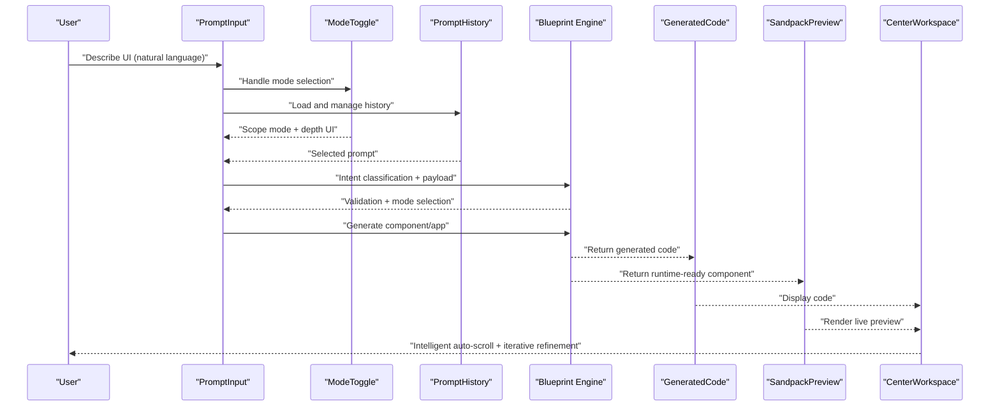
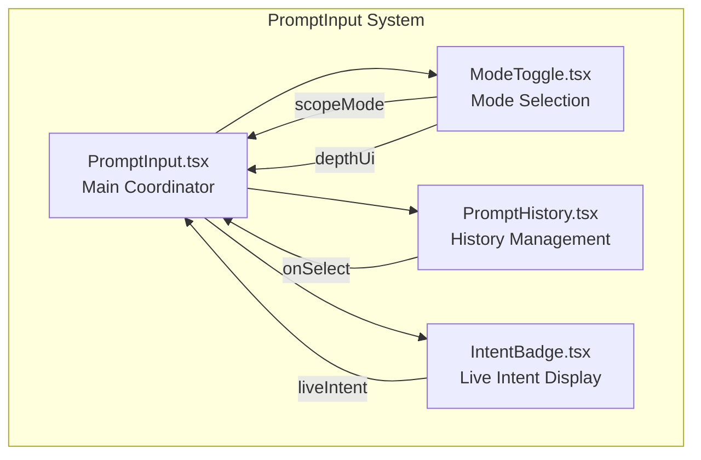
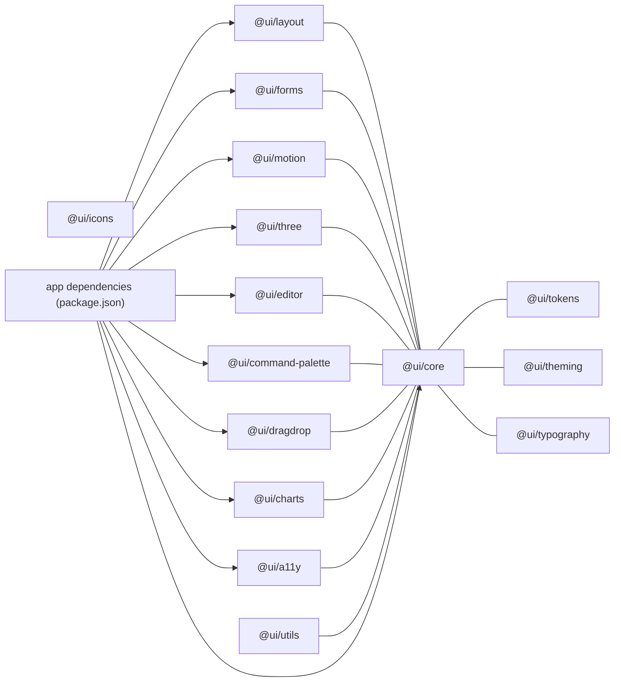

# UI Component System

<cite>
**Referenced Files in This Document**
- [README.md](file://README.md)
- [package.json](file://package.json)
- [components/A11yReport.tsx](file://components/A11yReport.tsx)
- [components/GeneratedCode.tsx](file://components/GeneratedCode.tsx)
- [components/prompt-input/ModeToggle.tsx](file://components/prompt-input/ModeToggle.tsx)
- [components/prompt-input/PromptHistory.tsx](file://components/prompt-input/PromptHistory.tsx)
- [components/prompt-input/PromptInput.tsx](file://components/prompt-input/PromptInput.tsx)
- [components/prompt-input/types.ts](file://components/prompt-input/types.ts)
- [components/VersionTimeline.tsx](file://components/VersionTimeline.tsx)
- [components/SandpackPreview.tsx](file://components/SandpackPreview.tsx)
- [components/IntentBadge.tsx](file://components/IntentBadge.tsx)
- [components/ide/CenterWorkspace.tsx](file://components/ide/CenterWorkspace.tsx)
- [components/ide/RightPanel.tsx](file://components/ide/RightPanel.tsx)
- [components/ide/Sidebar.tsx](file://components/ide/Sidebar.tsx)
- [components/workspace/WorkspaceProvider.tsx](file://components/workspace/WorkspaceProvider.tsx)
- [components/workspace/WorkspaceSwitcher.tsx](file://components/workspace/WorkspaceSwitcher.tsx)
- [components/auth/SessionProvider.tsx](file://components/auth/SessionProvider.tsx)
- [components/auth/UserNav.tsx](file://components/auth/UserNav.tsx)
- [app/layout.tsx](file://app/layout.tsx)
- [app/page.tsx](file://app/page.tsx)
- [app/forgot-password/page.tsx](file://app/forgot-password/page.tsx)
- [app/login/page.tsx](file://app/login/page.tsx)
- [app/reset-password/page.tsx](file://app/reset-password/page.tsx)
</cite>

## Update Summary
**Changes Made**
- Updated package documentation to reflect dropped package documentation files across multiple UI component packages
- Removed references to package-specific documentation that no longer exists
- Updated component library organization to reflect current package structure without deleted README files
- Enhanced documentation to clarify that package documentation was removed from the repository
- Updated troubleshooting guide to address package structure changes

## Table of Contents
1. [Introduction](#introduction)
2. [Project Structure](#project-structure)
3. [Core Components](#core-components)
4. [Architecture Overview](#architecture-overview)
5. [Modular Prompt Input System](#modular-prompt-input-system)
6. [Detailed Component Analysis](#detailed-component-analysis)
7. [Enhanced User Experience Features](#enhanced-user-experience-features)
8. [Dependency Analysis](#dependency-analysis)
9. [Performance Considerations](#performance-considerations)
10. [Troubleshooting Guide](#troubleshooting-guide)
11. [Conclusion](#conclusion)
12. [Appendices](#appendices)

## Introduction
This document describes the internal UI component system and design framework of an AI-powered, accessibility-first React application. It focuses on:
- The component registry and catalog of built-in components
- The blueprint engine enforcing design system rules and style DNA consistency
- The component library organization across @ui/* packages
- Composition patterns, prop interfaces, and customization options
- Guidelines for adding new components and extending the design system
- The relationship between generated components and the internal ecosystem
- Usage patterns and best practices for maintaining design consistency

The system emphasizes accessibility, a cohesive visual language, responsive design, and intelligent user experience features that adapt to user behavior patterns.

**Updated** Package documentation files have been removed from multiple UI component packages in this repository. The documentation now reflects the current package structure without deleted README files and package-specific documentation.

## Project Structure
The repository is a Next.js application with a monorepo-style packages directory for reusable UI libraries and a components directory for application-specific UI building blocks. The UI ecosystem integrates:
- Built-in components under components/
- Modular prompt input system under components/prompt-input/
- UI packages under packages/@ui/*
- Application pages under app/
- Supporting providers and IDE panels under components/

```mermaid
graph TB
subgraph "Application"
APP_LAYOUT["app/layout.tsx"]
APP_PAGE["app/page.tsx"]
APP_LOGIN["app/login/page.tsx"]
APP_FORGOT["app/forgot-password/page.tsx"]
APP_RESET["app/reset-password/page.tsx"]
end
subgraph "Components"
PROMPT["components/prompt-input/PromptInput.tsx"]
MODE_TOGGLE["components/prompt-input/ModeToggle.tsx"]
PROMPT_HISTORY["components/prompt-input/PromptHistory.tsx"]
GENCODE["components/GeneratedCode.tsx"]
A11Y["components/A11yReport.tsx"]
TIMELINE["components/VersionTimeline.tsx"]
SANDBOX["components/SandpackPreview.tsx"]
INTENT["components/IntentBadge.tsx"]
IDE_CW["components/ide/CenterWorkspace.tsx"]
IDE_RP["components/ide/RightPanel.tsx"]
IDE_SB["components/ide/Sidebar.tsx"]
WS_PROV["components/workspace/WorkspaceProvider.tsx"]
WS_SWITCH["components/workspace/WorkspaceSwitcher.tsx"]
AUTH_SP["components/auth/SessionProvider.tsx"]
AUTH_NAV["components/auth/UserNav.tsx"]
end
subgraph "Packages (@ui)"
PK_CORE["@ui/core"]
PK_LAYOUT["@ui/layout"]
PK_FORMS["@ui/forms"]
PK_MOTION["@ui/motion"]
PK_THREE["@ui/three"]
PK_TOKENS["@ui/tokens"]
PK_THEMING["@ui/theming"]
PK_TYPOGRAPHY["@ui/typography"]
PK_ICONS["@ui/icons"]
PK_CHARTS["@ui/charts"]
PK_COMMAND["@ui/command-palette"]
PK_DRAGDROP["@ui/dragdrop"]
PK_EDITOR["@ui/editor"]
PK_UTILS["@ui/utils"]
PK_A11Y["@ui/a11y"]
end
APP_LAYOUT --> PROMPT
APP_PAGE --> IDE_CW
IDE_CW --> GENCODE
IDE_CW --> A11Y
IDE_CW --> TIMELINE
IDE_CW --> SANDBOX
PROMPT --> MODE_TOGGLE
PROMPT --> PROMPT_HISTORY
PROMPT --> INTENT
IDE_RP --> TIMELINE
IDE_SB --> IDE_CW
WS_PROV --> IDE_CW
WS_SWITCH --> IDE_CW
AUTH_SP --> APP_LAYOUT
AUTH_NAV --> APP_LAYOUT
PROMPT --> PK_CORE
GENCODE --> PK_CORE
A11Y --> PK_CORE
TIMELINE --> PK_CORE
INTENT --> PK_CORE
IDE_* --> PK_LAYOUT
WS_* --> PK_CORE
AUTH_* --> PK_CORE
```

**Diagram sources**
- [app/layout.tsx](file://app/layout.tsx)
- [app/page.tsx](file://app/page.tsx)
- [components/prompt-input/PromptInput.tsx](file://components/prompt-input/PromptInput.tsx)
- [components/prompt-input/ModeToggle.tsx](file://components/prompt-input/ModeToggle.tsx)
- [components/prompt-input/PromptHistory.tsx](file://components/prompt-input/PromptHistory.tsx)
- [components/GeneratedCode.tsx](file://components/GeneratedCode.tsx)
- [components/A11yReport.tsx](file://components/A11yReport.tsx)
- [components/VersionTimeline.tsx](file://components/VersionTimeline.tsx)
- [components/SandpackPreview.tsx](file://components/SandpackPreview.tsx)
- [components/IntentBadge.tsx](file://components/IntentBadge.tsx)
- [components/ide/CenterWorkspace.tsx](file://components/ide/CenterWorkspace.tsx)
- [components/ide/RightPanel.tsx](file://components/ide/RightPanel.tsx)
- [components/ide/Sidebar.tsx](file://components/ide/Sidebar.tsx)
- [components/workspace/WorkspaceProvider.tsx](file://components/workspace/WorkspaceProvider.tsx)
- [components/workspace/WorkspaceSwitcher.tsx](file://components/workspace/WorkspaceSwitcher.tsx)
- [components/auth/SessionProvider.tsx](file://components/auth/SessionProvider.tsx)
- [components/auth/UserNav.tsx](file://components/auth/UserNav.tsx)

**Section sources**
- [README.md:1-37](file://README.md#L1-L37)
- [package.json:1-68](file://package.json#L1-L68)

## Core Components
This section documents the primary UI components that form the backbone of the design system and authoring workflow.

- **PromptInput**: Modular natural language input system with intent classification, voice input, image-to-text attachment, and generation modes (component, app, depth UI). Now composed of ModeToggle and PromptHistory sub-components.
- **ModeToggle**: Dedicated component for generation mode selection with scope switching and depth UI toggle.
- **PromptHistory**: History management component for reusing previous prompts with generation metadata.
- **GeneratedCode**: Read-only code viewer with copy/download actions and syntax highlighting.
- **A11yReport**: Accessibility scoring and violation listing with severity-based styling and suggested fixes.
- **VersionTimeline**: Responsive timeline navigation and rollback across project versions with intelligent scroll management.
- **SandpackPreview**: Dynamic live preview of generated React components.
- **IntentBadge**: Visual indicator of detected intent classification.
- **IDE Panels**: CenterWorkspace, RightPanel, and Sidebar for integrated authoring.
- **WorkspaceProvider and WorkspaceSwitcher**: Context and UI for workspace management.
- **SessionProvider and UserNav**: Authentication scaffolding.

These components share a consistent design language, accessibility attributes, responsive behavior, and intelligent user experience features that enforce style DNA and design system rules.

**Section sources**
- [components/prompt-input/PromptInput.tsx:1-402](file://components/prompt-input/PromptInput.tsx#L1-L402)
- [components/prompt-input/ModeToggle.tsx:1-140](file://components/prompt-input/ModeToggle.tsx#L1-L140)
- [components/prompt-input/PromptHistory.tsx:1-58](file://components/prompt-input/PromptHistory.tsx#L1-L58)
- [components/GeneratedCode.tsx:1-149](file://components/GeneratedCode.tsx#L1-L149)
- [components/A11yReport.tsx:1-193](file://components/A11yReport.tsx#L1-L193)
- [components/VersionTimeline.tsx:1-148](file://components/VersionTimeline.tsx#L1-L148)
- [components/SandpackPreview.tsx](file://components/SandpackPreview.tsx)
- [components/IntentBadge.tsx:1-103](file://components/IntentBadge.tsx#L1-L103)
- [components/ide/CenterWorkspace.tsx:1-255](file://components/ide/CenterWorkspace.tsx#L1-L255)
- [components/ide/RightPanel.tsx](file://components/ide/RightPanel.tsx)
- [components/ide/Sidebar.tsx](file://components/ide/Sidebar.tsx)
- [components/workspace/WorkspaceProvider.tsx](file://components/workspace/WorkspaceProvider.tsx)
- [components/workspace/WorkspaceSwitcher.tsx](file://components/workspace/WorkspaceSwitcher.tsx)
- [components/auth/SessionProvider.tsx](file://components/auth/SessionProvider.tsx)
- [components/auth/UserNav.tsx](file://components/auth/UserNav.tsx)

## Architecture Overview
The UI architecture centers around a blueprint engine that enforces design system rules and style DNA consistency. This engine ensures that:
- Generated components adhere to established tokens, spacing, and typography
- Accessibility is baked into component props and rendering
- Composition patterns promote reuse and maintainability
- Providers and contexts coordinate state across the workspace
- Intelligent user experience features adapt to user behavior patterns

**Diagram sources**
- [components/prompt-input/PromptInput.tsx:1-402](file://components/prompt-input/PromptInput.tsx#L1-L402)
- [components/prompt-input/ModeToggle.tsx:1-140](file://components/prompt-input/ModeToggle.tsx#L1-L140)
- [components/prompt-input/PromptHistory.tsx:1-58](file://components/prompt-input/PromptHistory.tsx#L1-L58)
- [components/GeneratedCode.tsx:1-149](file://components/GeneratedCode.tsx#L1-L149)
- [components/SandpackPreview.tsx](file://components/SandpackPreview.tsx)
- [components/ide/CenterWorkspace.tsx:1-255](file://components/ide/CenterWorkspace.tsx#L1-L255)

## Modular Prompt Input System

The prompt input system has been refactored into a modular architecture that improves maintainability, testability, and component composition patterns.

### Component Composition Pattern
The new architecture follows a composition pattern where PromptInput acts as a coordinator that orchestrates smaller, focused components:

**Diagram sources**
- [components/prompt-input/PromptInput.tsx:1-402](file://components/prompt-input/PromptInput.tsx#L1-L402)
- [components/prompt-input/ModeToggle.tsx:1-140](file://components/prompt-input/ModeToggle.tsx#L1-L140)
- [components/prompt-input/PromptHistory.tsx:1-58](file://components/prompt-input/PromptHistory.tsx#L1-L58)
- [components/IntentBadge.tsx:1-103](file://components/IntentBadge.tsx#L1-L103)

### Key Benefits of Modular Architecture
- **Single Responsibility**: Each component has a focused purpose
- **Testability**: Components can be tested independently
- **Reusability**: Components can be used in different contexts
- **Maintainability**: Changes to one component don't affect others
- **Accessibility**: Each component maintains its own accessibility features

**Section sources**
- [components/prompt-input/PromptInput.tsx:1-402](file://components/prompt-input/PromptInput.tsx#L1-L402)
- [components/prompt-input/ModeToggle.tsx:1-140](file://components/prompt-input/ModeToggle.tsx#L1-L140)
- [components/prompt-input/PromptHistory.tsx:1-58](file://components/prompt-input/PromptHistory.tsx#L1-L58)
- [components/prompt-input/types.ts:1-49](file://components/prompt-input/types.ts#L1-L49)

## Detailed Component Analysis

### PromptInput (Refactored)
Purpose: Main orchestration component for the prompt input system, now composed of specialized sub-components.

Key behaviors:
- **State Management**: Coordinates state between ModeToggle, PromptHistory, and IntentBadge
- **Form Handling**: Manages form submission, validation, and error states
- **Speech Recognition**: Integrates Web Speech API for voice input
- **Image Processing**: Handles image-to-text conversion for visual context
- **Intent Classification**: Debounced live intent detection with confidence tracking
- **History Integration**: Loads and manages generation history

Prop interfaces and customization:
- `onSubmit(prompt, mode, options)`: Main submission handler
- `isLoading`: Loading state for the entire system
- `onIntentDetected`: Callback for live intent classification
- `hasActiveProject`: Project context for intent classification
- `aiPayload`: Additional context for AI processing

Accessibility and design system alignment:
- Uses severity-based styling and WCAG-compliant contrast
- Clear affordances for keyboard and screen reader users
- Consistent spacing and typography tokens
- Proper ARIA labels and roles throughout

**Section sources**
- [components/prompt-input/PromptInput.tsx:1-402](file://components/prompt-input/PromptInput.tsx#L1-L402)

### ModeToggle
Purpose: Dedicated component for generation mode selection with scope switching and depth UI toggle.

Key behaviors:
- **Mode Selection**: Switches between component and app generation modes
- **Depth UI Toggle**: Enables premium visual generation features
- **Visual Feedback**: Provides immediate visual feedback for selected modes
- **Hint System**: Shows contextual hints for each generation mode
- **Disabled States**: Properly handles loading states and disabled conditions

Prop interfaces and customization:
- `scopeMode`: Current scope ('component' | 'app')
- `depthUi`: Whether depth UI mode is enabled
- `isLoading`: Loading state for disabling interactions
- `onScopeChange(mode)`: Handler for scope mode changes
- `onDepthUiToggle()`: Handler for depth UI toggle

Accessibility and design system alignment:
- Uses gradient backgrounds with proper contrast ratios
- Clear visual hierarchy with iconography
- Disabled state handling with appropriate styling
- Focus management and keyboard navigation support

**Section sources**
- [components/prompt-input/ModeToggle.tsx:1-140](file://components/prompt-input/ModeToggle.tsx#L1-L140)

### PromptHistory
Purpose: Manages and displays generation history with quick re-use capabilities.

Key behaviors:
- **History Loading**: Fetches and displays previous generation prompts
- **Quick Re-use**: Allows clicking history items to quickly reuse prompts
- **Visual Indicators**: Shows component names and prompt snippets
- **Empty State**: Provides guidance when no history exists
- **Responsive Design**: Handles overflow with horizontal scrolling

Prop interfaces and customization:
- `history`: Array of HistoryItem objects
- `isLoading`: Loading state for disabling interactions
- `onSelect(prompt)`: Handler for selecting a history item

Accessibility and design system alignment:
- Uses consistent badge styling with proper contrast
- Scrollbar hiding for clean appearance
- Disabled state handling for loading conditions
- Focus management for interactive elements

**Section sources**
- [components/prompt-input/PromptHistory.tsx:1-58](file://components/prompt-input/PromptHistory.tsx#L1-L58)

### GeneratedCode
Purpose: Displays generated TypeScript/JSX code with syntax highlighting, copy-to-clipboard, and download capabilities.

Key behaviors:
- Guard clause for empty code
- Clipboard API with fallback textarea selection
- Blob-based download with filename derived from component name
- CodeMirror integration with dark theme and JS/TS support

Prop interfaces and customization:
- `code`: string - The generated code to display
- `componentName`: string - Used for filename derivation

Accessibility and design system alignment:
- Backdrop blur and glassmorphism with consistent borders
- Focus-visible rings and hover states aligned with tokens

**Section sources**
- [components/GeneratedCode.tsx:1-149](file://components/GeneratedCode.tsx#L1-L149)

### A11yReport
Purpose: Presents accessibility scores and violations with severity-based styling and suggested fixes.

Key behaviors:
- Score ring visualization with color-coded thresholds
- Violation cards grouped by severity (error, warning, info)
- Applied auto-fixes summary

Prop interfaces and customization:
- `report`: A111yReport with optional appliedFixes

Accessibility and design system alignment:
- Semantic roles and ARIA attributes
- Color tokens per severity mapped to Tailwind classes
- WCAG 2.1 AA compliance indicators

**Section sources**
- [components/A11yReport.tsx:1-193](file://components/A11yReport.tsx#L1-L193)

### VersionTimeline
Purpose: Provides a responsive timeline of versions with selection and rollback actions, now featuring improved dimensions and accessibility.

Key behaviors:
- Responsive `w-full h-full` dimensions that adapt to container size
- Timeline navigation with version selection and rollback capabilities
- Visual indicators for active, latest, and selected versions
- Hover-based reveal of rollback actions
- Accessible keyboard navigation and ARIA labeling

Responsive design improvements:
- **Updated**: Now uses `w-full h-full` instead of fixed `w-64` dimensions
- Adapts seamlessly to different screen sizes and container constraints
- Maintains aspect ratio while filling available space

Accessibility and design system alignment:
- Clear selection states and disabled states for actions
- Proper ARIA labels and keyboard navigation support
- Consistent spacing and typography scaling

**Section sources**
- [components/VersionTimeline.tsx:1-148](file://components/VersionTimeline.tsx#L1-L148)

### SandpackPreview
Purpose: Renders the live preview of generated components using a sandbox runtime.

Integration:
- Dynamically imported for SSR avoidance
- Receives code and component name for rendering

Accessibility and design system alignment:
- Ensures focus isolation and clear overlays
- Consistent container styling with borders and backdrop

**Section sources**
- [components/SandpackPreview.tsx](file://components/SandpackPreview.tsx)

### IntentBadge
Purpose: Visual indicator of detected intent classification with confidence.

Integration:
- Used within PromptInput to surface live intent hints
- Supports multiple sizes and confidence display

Accessibility and design system alignment:
- Compact, accessible badges with appropriate contrast
- Configurable sizing and label visibility

**Section sources**
- [components/IntentBadge.tsx:1-103](file://components/IntentBadge.tsx#L1-L103)

### IDE Panels and Workspace Providers
Purpose: Integrated authoring environment and workspace management with enhanced user experience features.

- CenterWorkspace: Central authoring area with intelligent scroll management
- RightPanel: Code and inspection panel with VersionTimeline integration
- Sidebar: Navigation and project list
- WorkspaceProvider: Global workspace context
- WorkspaceSwitcher: Workspace selection UI

Intelligent scroll management features:
- **Enhanced**: CenterWorkspace now prevents automatic scrolling when users are actively reviewing previous content
- Uses 50-pixel threshold to detect when users are "looking back" at content
- Smooth auto-scrolling only when user is at the bottom of the feed
- Preserves user reading flow and reduces unwanted page jumps

Accessibility and design system alignment:
- Unified theming and spacing
- Consistent focus management and keyboard shortcuts
- Responsive design patterns across all panel components

**Section sources**
- [components/ide/CenterWorkspace.tsx:1-255](file://components/ide/CenterWorkspace.tsx#L1-L255)
- [components/ide/RightPanel.tsx](file://components/ide/RightPanel.tsx)
- [components/ide/Sidebar.tsx](file://components/ide/Sidebar.tsx)
- [components/workspace/WorkspaceProvider.tsx](file://components/workspace/WorkspaceProvider.tsx)
- [components/workspace/WorkspaceSwitcher.tsx](file://components/workspace/WorkspaceSwitcher.tsx)

### Authentication Components
Purpose: Scaffolding for session management and user navigation.

- SessionProvider: Wraps app with session context
- UserNav: User menu and profile actions

Accessibility and design system alignment:
- Consistent button styles and dropdown menus
- Focus management and keyboard navigation

**Section sources**
- [components/auth/SessionProvider.tsx](file://components/auth/SessionProvider.tsx)
- [components/auth/UserNav.tsx](file://components/auth/UserNav.tsx)

## Enhanced User Experience Features

### Intelligent Scroll Management
The CenterWorkspace component now features sophisticated scroll management that enhances the user experience during AI-driven interactions:

**Key Features:**
- **50-pixel threshold detection**: Automatically determines when users are actively reviewing content
- **Context-aware scrolling**: Prevents unwanted auto-scrolling when users are reading previous messages
- **Smooth transitions**: Uses CSS smooth scrolling for natural user experience
- **State preservation**: Maintains user position when content changes unexpectedly

**Implementation Details:**
- Scroll position monitoring with `scrollTop + clientHeight < scrollHeight - 50` calculation
- Reactive effect that triggers only when content requires attention
- Non-intrusive behavior that respects user control

**Benefits:**
- Reduces cognitive load during content review
- Prevents disorientation during long conversations
- Maintains focus on current interaction while preserving context
- Enhances accessibility for users with motor control considerations

**Section sources**
- [components/ide/CenterWorkspace.tsx:56-68](file://components/ide/CenterWorkspace.tsx#L56-L68)

### Responsive Design Improvements
Several components now feature enhanced responsive behavior:

**VersionTimeline Responsiveness:**
- **Updated**: `w-full h-full` dimensions replace fixed `w-64`
- Adapts to sidebar width constraints
- Maintains optimal viewing experience across devices
- Integrates seamlessly with RightPanel layout

**CenterWorkspace Adaptability:**
- Flexible height management for varying content loads
- Responsive padding and spacing adjustments
- Optimized for both desktop and mobile viewing

**PromptInput Responsiveness:**
- **Enhanced**: Adaptive textarea sizing based on content length
- **Improved**: Dynamic placeholder text based on generation mode
- **Updated**: Responsive action bar with conditional elements

**Section sources**
- [components/VersionTimeline.tsx:25-28](file://components/VersionTimeline.tsx#L25-L28)
- [components/ide/RightPanel.tsx:608](file://components/ide/RightPanel.tsx#L608)
- [components/prompt-input/PromptInput.tsx:225-227](file://components/prompt-input/PromptInput.tsx#L225-L227)

## Dependency Analysis
The UI components depend on shared tokens, theming, and utility packages. The application also relies on external libraries for icons, syntax highlighting, and runtime preview.

**Diagram sources**
- [package.json:13-44](file://package.json#L13-L44)

**Section sources**
- [package.json:1-68](file://package.json#L1-L68)

## Performance Considerations
- Defer heavy UI via dynamic imports (e.g., SandpackPreview) to reduce initial bundle size.
- Use memoization and debouncing for intent classification and speech recognition to avoid excessive re-renders.
- Prefer CSS transitions and hardware-accelerated animations for motion components.
- Lazy-load syntax highlighting and editor features to minimize runtime overhead.
- Optimize image uploads and OCR processing with progress states and cancellation where applicable.
- **Enhanced**: Intelligent scroll management uses efficient threshold calculations to minimize reflow.
- **Improved**: Responsive components leverage CSS Flexbox for optimal layout performance.
- **Updated**: Modular architecture reduces unnecessary re-renders by isolating component concerns.

## Troubleshooting Guide
Common issues and resolutions:
- Clipboard failures: The GeneratedCode component falls back to textarea selection if Clipboard API fails; ensure HTTPS for clipboard permissions.
- Speech recognition unsupported: PromptInput gracefully handles missing SpeechRecognition APIs and informs users.
- Live preview not rendering: Verify dynamic import configuration and ensure client-side rendering for preview components.
- Accessibility warnings: Review A11yReport for severity levels and apply suggested fixes; confirm WCAG criteria coverage.
- **Updated**: VersionTimeline responsive issues: Ensure parent containers have defined dimensions; the component now uses `w-full h-full`.
- **Enhanced**: CenterWorkspace scroll conflicts: The 50-pixel threshold prevents conflicts with manual scrolling; adjust threshold if needed.
- **Improved**: PromptInput modular architecture: Check individual component imports and ensure proper TypeScript definitions.
- Workspace rollback errors: Confirm projectId presence and network connectivity; handle server-side rollback responses.
- **Updated**: Package documentation issues: Some package documentation files have been removed from the repository. Package structure remains functional but lacks dedicated README documentation.

**Section sources**
- [components/GeneratedCode.tsx:30-63](file://components/GeneratedCode.tsx#L30-L63)
- [components/prompt-input/PromptInput.tsx:86-128](file://components/prompt-input/PromptInput.tsx#L86-L128)
- [components/VersionTimeline.tsx:25-28](file://components/VersionTimeline.tsx#L25-L28)
- [components/ide/CenterWorkspace.tsx:56-68](file://components/ide/CenterWorkspace.tsx#L56-L68)

## Conclusion
The UI component system blends accessibility-first design with an AI-driven blueprint engine to produce consistent, compliant, and visually coherent components. Recent enhancements include intelligent scroll management, responsive design improvements, and enhanced user experience features that adapt to user behavior patterns. The new modular prompt input system demonstrates improved maintainability and component composition patterns. By organizing reusable pieces under @ui packages and enforcing design system rules through shared tokens and theming, teams can rapidly iterate while maintaining quality, inclusivity, and seamless user experiences across all device sizes.

**Updated** Package documentation files have been removed from multiple UI component packages in this repository. The system continues to function with the current package structure, but some packages may lack dedicated README documentation. The core functionality and component relationships remain intact.

## Appendices

### Component Registry and Metadata
- Built-in components are located under components/ and include the modular prompt input system with PromptInput, ModeToggle, and PromptHistory.
- Each component exposes a clear prop interface and adheres to accessibility standards.
- Compatibility requirements:
  - Use Tailwind classes aligned with @ui/tokens and @ui/theming
  - Ensure ARIA attributes and semantic roles
  - Provide keyboard navigation and focus management
  - Support SSR-safe dynamic imports for client-only features
  - Implement responsive design patterns for all components
  - **Updated**: Follow modular architecture with clear component boundaries
  - **Updated**: Package documentation files have been removed from several packages

**Section sources**
- [components/prompt-input/PromptInput.tsx:1-402](file://components/prompt-input/PromptInput.tsx#L1-L402)
- [components/prompt-input/ModeToggle.tsx:1-140](file://components/prompt-input/ModeToggle.tsx#L1-L140)
- [components/prompt-input/PromptHistory.tsx:1-58](file://components/prompt-input/PromptHistory.tsx#L1-L58)
- [components/GeneratedCode.tsx:1-149](file://components/GeneratedCode.tsx#L1-L149)
- [components/A11yReport.tsx:1-193](file://components/A11yReport.tsx#L1-L193)
- [components/VersionTimeline.tsx:1-148](file://components/VersionTimeline.tsx#L1-L148)
- [components/SandpackPreview.tsx](file://components/SandpackPreview.tsx)
- [components/IntentBadge.tsx:1-103](file://components/IntentBadge.tsx#L1-L103)
- [components/ide/CenterWorkspace.tsx:1-255](file://components/ide/CenterWorkspace.tsx#L1-L255)
- [components/ide/RightPanel.tsx](file://components/ide/RightPanel.tsx)
- [components/ide/Sidebar.tsx](file://components/ide/Sidebar.tsx)
- [components/workspace/WorkspaceProvider.tsx](file://components/workspace/WorkspaceProvider.tsx)
- [components/workspace/WorkspaceSwitcher.tsx](file://components/workspace/WorkspaceSwitcher.tsx)
- [components/auth/SessionProvider.tsx](file://components/auth/SessionProvider.tsx)
- [components/auth/UserNav.tsx](file://components/auth/UserNav.tsx)

### Blueprint Engine and Style DNA
- Enforce design system rules via shared tokens and typography packages.
- Maintain style DNA consistency by centralizing variants and class compositions in @ui/core and @ui/theming.
- Apply motion and layout primitives from @ui/motion and @ui/layout to preserve rhythm and spacing.
- Integrate accessibility checks and WCAG compliance in component rendering and props.
- **Enhanced**: Incorporate responsive design patterns and user experience heuristics.
- **Updated**: Support modular component composition with clear separation of concerns.
- **Updated**: Package documentation files have been removed from several packages in the ecosystem.

**Section sources**
- [package.json:13-44](file://package.json#L13-L44)

### Component Library Organization
- @ui/core: Base components, tokens, and foundational utilities
- @ui/layout: Layout primitives and grid systems with responsive design
- @ui/forms: Form controls and validation helpers
- @ui/motion: Motion primitives and animation utilities
- @ui/three: 3D and advanced rendering helpers
- @ui/theming: Theme provider and design system integrations
- @ui/tokens: Design tokens (colors, spacing, typography)
- @ui/typography: Typography system and text utilities
- @ui/icons: Iconography and SVG utilities
- @ui/charts: Charting primitives
- @ui/command-palette: Command palette and keyboard navigation
- @ui/dragdrop: Drag-and-drop utilities
- @ui/editor: Code editor and preview integrations
- @ui/utils: Shared utilities and helpers
- @ui/a11y: Accessibility-focused components and utilities

**Updated** Package documentation files have been removed from multiple UI component packages. The organizational structure remains consistent, but some packages may lack dedicated README documentation.

**Section sources**
- [package.json:13-44](file://package.json#L13-L44)

### Adding New Components to the Registry
- Define a clear prop interface and accessibility contract
- Use tokens and theming from @ui packages
- Provide keyboard navigation and ARIA attributes
- Export variants and composition helpers from @ui/core
- Add tests and documentation for usage patterns
- Keep component small, focused, and composable
- **Enhanced**: Implement responsive design patterns and user experience considerations
- **Updated**: Follow modular architecture principles with clear component boundaries
- **Updated**: Package documentation files have been removed from several packages

**Section sources**
- [components/prompt-input/PromptInput.tsx:1-402](file://components/prompt-input/PromptInput.tsx#L1-L402)
- [components/prompt-input/ModeToggle.tsx:1-140](file://components/prompt-input/ModeToggle.tsx#L1-L140)
- [components/prompt-input/PromptHistory.tsx:1-58](file://components/prompt-input/PromptHistory.tsx#L1-L58)
- [components/GeneratedCode.tsx:1-149](file://components/GeneratedCode.tsx#L1-L149)
- [components/A11yReport.tsx:1-193](file://components/A11yReport.tsx#L1-L193)
- [components/VersionTimeline.tsx:1-148](file://components/VersionTimeline.tsx#L1-L148)

### Extending the Design System
- Introduce new tokens in @ui/tokens and update @ui/theming accordingly
- Add new motion presets in @ui/motion and layout patterns in @ui/layout
- Extend form controls in @ui/forms with consistent styling and validation
- Document new components in @ui packages with usage examples
- Maintain backward compatibility and deprecation policies
- **Enhanced**: Incorporate user experience patterns and accessibility best practices
- **Updated**: Support modular component composition with clear architectural guidelines
- **Updated**: Package documentation files have been removed from several packages

**Section sources**
- [package.json:13-44](file://package.json#L13-L44)

### Relationship Between Generated Components and the Internal Ecosystem
- Generated components are rendered inside SandpackPreview using @ui/editor and @ui/theming
- Accessibility reports are produced by @ui/a11y and surfaced in A11yReport
- Workspace management leverages @ui/core and @ui/layout for consistent layouts
- Intent detection and refinement leverage @ui/command-palette and @ui/forms
- **Enhanced**: Intelligent scroll management improves user experience across all generated content
- **Updated**: Modular prompt input system integrates seamlessly with the broader component ecosystem
- **Updated**: Package documentation files have been removed from several packages in the ecosystem

**Section sources**
- [components/SandpackPreview.tsx](file://components/SandpackPreview.tsx)
- [components/A11yReport.tsx:1-193](file://components/A11yReport.tsx#L1-L193)
- [components/ide/CenterWorkspace.tsx:1-255](file://components/ide/CenterWorkspace.tsx#L1-L255)
- [components/prompt-input/PromptInput.tsx:1-402](file://components/prompt-input/PromptInput.tsx#L1-L402)

### Usage Patterns and Best Practices
- Prefer composition over inheritance; combine small, focused components
- Use intent classification to guide generation and refinement workflows
- Maintain consistent spacing and typography via tokens and theming
- Ensure all interactive elements are keyboard accessible and screen-reader friendly
- Provide clear feedback for loading, error, and success states
- Keep generated code readable and editable; avoid obfuscation
- **Enhanced**: Implement intelligent scroll management for better user experience
- **Updated**: Utilize responsive design patterns for all components
- **Improved**: Consider user behavior patterns when designing auto-scrolling features
- **Updated**: Follow modular architecture principles for maintainable component design
- **Updated**: Package documentation files have been removed from several packages

**Section sources**
- [components/prompt-input/PromptInput.tsx:1-402](file://components/prompt-input/PromptInput.tsx#L1-L402)
- [components/GeneratedCode.tsx:1-149](file://components/GeneratedCode.tsx#L1-L149)
- [components/VersionTimeline.tsx:1-148](file://components/VersionTimeline.tsx#L1-L148)
- [components/ide/CenterWorkspace.tsx:1-255](file://components/ide/CenterWorkspace.tsx#L1-L255)
- [components/A11yReport.tsx:1-193](file://components/A11yReport.tsx#L1-L193)