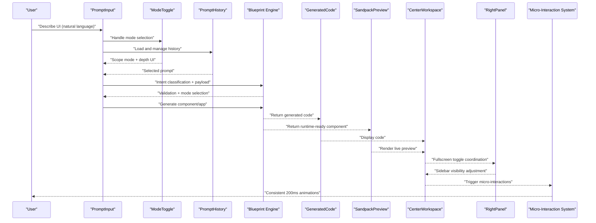
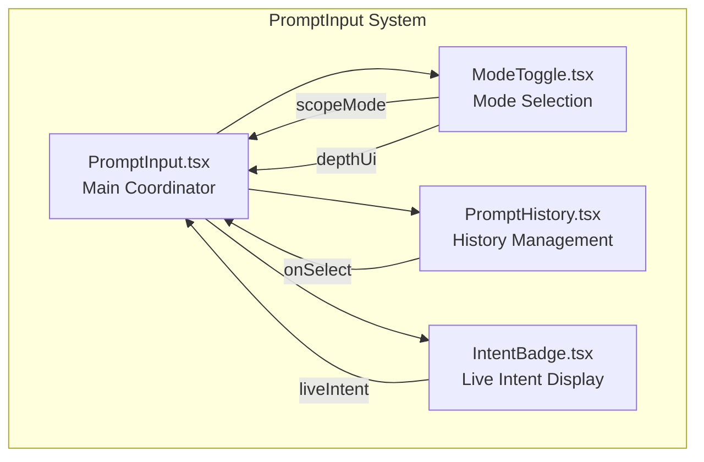
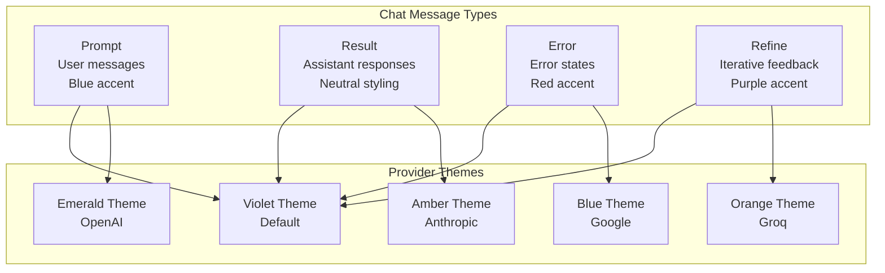
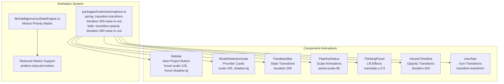
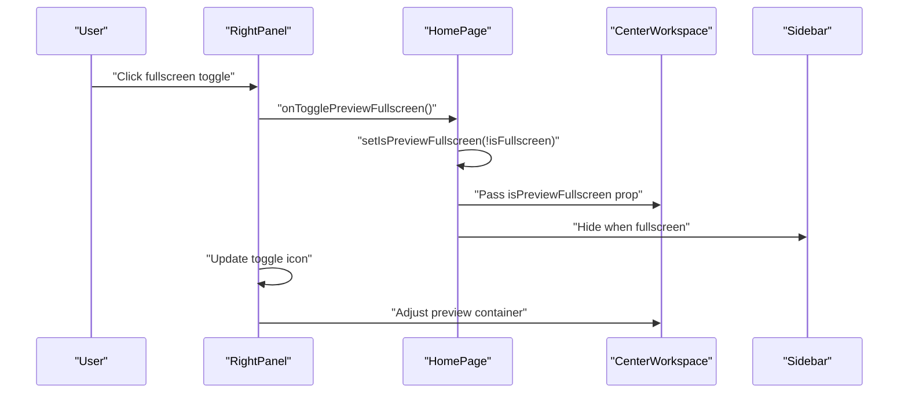
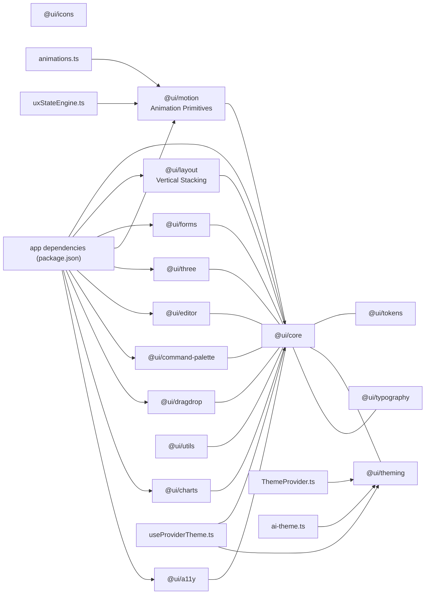

# UI Component System

<cite>
**Referenced Files in This Document**
- [README.md](file://README.md)
- [package.json](file://package.json)
- [components/A11yReport.tsx](file://components/A11yReport.tsx)
- [components/GeneratedCode.tsx](file://components/GeneratedCode.tsx)
- [components/prompt-input/ModeToggle.tsx](file://components/prompt-input/ModeToggle.tsx)
- [components/prompt-input/PromptHistory.tsx](file://components/prompt-input/PromptHistory.tsx)
- [components/prompt-input/PromptInput.tsx](file://components/prompt-input/PromptInput.tsx)
- [components/prompt-input/types.ts](file://components/prompt-input/types.ts)
- [components/VersionTimeline.tsx](file://components/VersionTimeline.tsx)
- [components/SandpackPreview.tsx](file://components/SandpackPreview.tsx)
- [components/IntentBadge.tsx](file://components/IntentBadge.tsx)
- [components/ide/CenterWorkspace.tsx](file://components/ide/CenterWorkspace.tsx)
- [components/ide/RightPanel.tsx](file://components/ide/RightPanel.tsx)
- [components/ide/Sidebar.tsx](file://components/ide/Sidebar.tsx)
- [components/workspace/WorkspaceProvider.tsx](file://components/workspace/WorkspaceProvider.tsx)
- [components/workspace/WorkspaceSwitcher.tsx](file://components/workspace/WorkspaceSwitcher.tsx)
- [components/auth/SessionProvider.tsx](file://components/auth/SessionProvider.tsx)
- [components/auth/UserNav.tsx](file://components/auth/UserNav.tsx)
- [components/FeedbackBar.tsx](file://components/FeedbackBar.tsx)
- [components/ModelSelectionGate.tsx](file://components/ModelSelectionGate.tsx)
- [components/PipelineStatus.tsx](file://components/PipelineStatus.tsx)
- [components/ThinkingPanel.tsx](file://components/ThinkingPanel.tsx)
- [app/layout.tsx](file://app/layout.tsx)
- [app/page.tsx](file://app/page.tsx)
- [app/forgot-password/page.tsx](file://app/forgot-password/page.tsx)
- [app/login/page.tsx](file://app/login/page.tsx)
- [app/reset-password/page.tsx](file://app/reset-password/page.tsx)
- [lib/hooks/useProviderTheme.ts](file://lib/hooks/useProviderTheme.ts)
- [lib/intelligence/uxStateEngine.ts](file://lib/intelligence/uxStateEngine.ts)
- [lib/intelligence/depthEngine.ts](file://lib/intelligence/depthEngine.ts)
- [packages/motion/animations.ts](file://packages/motion/animations.ts)
- [packages/theming/components/ThemeProvider.tsx](file://packages/theming/components/ThemeProvider.tsx)
- [packages/theming/ai-theme.ts](file://packages/theming/ai-theme.ts)
- [packages/layout/ai-layout.ts](file://packages/layout/ai-layout.ts)
- [app/globals.css](file://app/globals.css)
</cite>

## Update Summary
**Changes Made**
- Added comprehensive micro-interaction system with Tailwind CSS animations across all UI components
- Implemented consistent 200ms transition timing for interactive elements
- Enhanced component interactions with hover:scale-105, hover:shadow-lg, and duration-200 transitions
- Updated component interactions include New Project button animations, project cards, suggestion cards, tab navigation, and interactive elements
- Integrated micro-interaction patterns into all major UI components including Sidebar, ModelSelectionGate, FeedbackBar, PipelineStatus, and ThinkingPanel
- Added comprehensive animation system with spring and fade transitions in @ui/motion package
- Enhanced accessibility with reduced motion compatibility through UX state engine

## Table of Contents
1. [Introduction](#introduction)
2. [Project Structure](#project-structure)
3. [Core Components](#core-components)
4. [Architecture Overview](#architecture-overview)
5. [Modular Prompt Input System](#modular-prompt-input-system)
6. [Enhanced Chat System](#enhanced-chat-system)
7. [Provider Theme System](#provider-theme-system)
8. [Micro-Interaction System](#micro-interaction-system)
9. [Fullscreen Preview Functionality](#fullscreen-preview-functionality)
10. [Enhanced User Experience Features](#enhanced-user-experience-features)
11. [Detailed Component Analysis](#detailed-component-analysis)
12. [Dependency Analysis](#dependency-analysis)
13. [Performance Considerations](#performance-considerations)
14. [Troubleshooting Guide](#troubleshooting-guide)
15. [Conclusion](#conclusion)
16. [Appendices](#appendices)

## Introduction
This document describes the internal UI component system and design framework of an AI-powered, accessibility-first React application. It focuses on:
- The component registry and catalog of built-in components
- The blueprint engine enforcing design system rules and style DNA consistency
- The component library organization across @ui/* packages
- Composition patterns, prop interfaces, and customization options
- Guidelines for adding new components and extending the design system
- The relationship between generated components and the internal ecosystem
- Usage patterns and best practices for maintaining design consistency

The system emphasizes accessibility, a cohesive visual language, responsive design, and intelligent user experience features that adapt to user behavior patterns.

**Updated** The system now includes a comprehensive micro-interaction system with consistent 200ms transition timing, enhanced component animations, and accessibility-compliant motion patterns that provide delightful user experiences while maintaining performance and inclusivity.

## Project Structure
The repository is a Next.js application with a monorepo-style packages directory for reusable UI libraries and a components directory for application-specific UI building blocks. The UI ecosystem integrates:
- Built-in components under components/
- Modular prompt input system under components/prompt-input/
- UI packages under packages/@ui/*
- Application pages under app/
- Supporting providers and IDE panels under components/
- Enhanced theming system under lib/hooks/ and packages/theming/
- Micro-interaction system under packages/motion/ and app/globals.css

```mermaid
graph TB
subgraph "Application"
APP_LAYOUT["app/layout.tsx"]
APP_PAGE["app/page.tsx<br/>HomePage + Fullscreen Coordination"]
APP_LOGIN["app/login/page.tsx"]
APP_FORGOT["app/forgot-password/page.tsx"]
APP_RESET["app/reset-password/page.tsx"]
APP_GLOBALS["app/globals.css<br/>Global Animation Classes"]
end
subgraph "Components"
PROMPT["components/prompt-input/PromptInput.tsx"]
MODE_TOGGLE["components/prompt-input/ModeToggle.tsx"]
PROMPT_HISTORY["components/prompt-input/PromptHistory.tsx"]
GENCODE["components/GeneratedCode.tsx"]
A11Y["components/A11yReport.tsx"]
TIMELINE["components/VersionTimeline.tsx<br/>Hover Animations"]
SANDBOX["components/SandpackPreview.tsx"]
INTENT["components/IntentBadge.tsx"]
IDE_CW["components/ide/CenterWorkspace.tsx<br/>Enhanced Chat + Fullscreen"]
IDE_RP["components/ide/RightPanel.tsx<br/>Fullscreen Toggle"]
IDE_SB["components/ide/Sidebar.tsx<br/>New Project Button Animations"]
WS_PROV["components/workspace/WorkspaceProvider.tsx"]
WS_SWITCH["components/workspace/WorkspaceSwitcher.tsx"]
AUTH_SP["components/auth/SessionProvider.tsx"]
AUTH_NAV["components/auth/UserNav.tsx<br/>Transition Animations"]
FEEDBACK["components/FeedbackBar.tsx<br/>Interactive Elements"]
PIPELINE["components/PipelineStatus.tsx<br/>Scale Transitions"]
THINKING["components/ThinkingPanel.tsx<br/>Multi-State Animations"]
MODE_GATE["components/ModelSelectionGate.tsx<br/>Provider Card Animations"]
end
subgraph "Theming System"
THEME_HOOK["lib/hooks/useProviderTheme.ts<br/>Provider Color Palettes"]
THEME_PROVIDER["packages/theming/components/ThemeProvider.tsx<br/>System Theme"]
THEME_AI["packages/theming/ai-theme.ts<br/>AI Custom Theme"]
THEME_OPENAI["OpenAI Emerald Theme"]
THEME_ANTHROPIC["Anthropic Amber Theme"]
THEME_GOOGLE["Google Blue Theme"]
THEME_GROQ["Groq Orange Theme"]
THEME_DEFAULT["Default Violet Theme"]
end
subgraph "Motion System"
MOTION_ANIM["packages/motion/animations.ts<br/>Spring & Fade Transitions"]
UX_ENGINE["lib/intelligence/uxStateEngine.ts<br/>Motion Priority Matrix"]
DEPTH_ENGINE["lib/intelligence/depthEngine.ts<br/>Reduced Motion Support"]
end
subgraph "Packages (@ui)"
PK_CORE["@ui/core"]
PK_LAYOUT["@ui/layout<br/>Vertical Stacking"]
PK_FORMS["@ui/forms"]
PK_MOTION["@ui/motion<br/>Animation Primitives"]
PK_THREE["@ui/three"]
PK_TOKENS["@ui/tokens"]
PK_THEMING["@ui/theming"]
PK_TYPOGRAPHY["@ui/typography"]
PK_ICONS["@ui/icons"]
PK_CHARTS["@ui/charts"]
PK_COMMAND["@ui/command-palette"]
PK_DRAGDROP["@ui/dragdrop"]
PK_EDITOR["@ui/editor"]
PK_UTILS["@ui/utils"]
PK_A11Y["@ui/a11y"]
end
APP_LAYOUT --> PROMPT
APP_PAGE --> IDE_CW
IDE_CW --> GENCODE
IDE_CW --> A11Y
IDE_CW --> TIMELINE
IDE_CW --> SANDBOX
IDE_CW --> THEME_HOOK
IDE_RP --> THEME_HOOK
PROMPT --> MODE_TOGGLE
PROMPT --> PROMPT_HISTORY
PROMPT --> INTENT
IDE_RP --> TIMELINE
IDE_SB --> IDE_CW
IDE_SB --> MODE_GATE
IDE_SB --> FEEDBACK
IDE_SB --> PIPELINE
IDE_SB --> THINKING
IDE_SB --> AUTH_NAV
WS_PROV --> IDE_CW
WS_SWITCH --> IDE_CW
AUTH_SP --> APP_LAYOUT
AUTH_NAV --> APP_LAYOUT
THEME_HOOK --> THEME_OPENAI
THEME_HOOK --> THEME_ANTHROPIC
THEME_HOOK --> THEME_GOOGLE
THEME_HOOK --> THEME_GROQ
THEME_HOOK --> THEME_DEFAULT
THEME_PROVIDER --> THEME_HOOK
THEME_AI --> THEME_HOOK
MOTION_ANIM --> PK_MOTION
UX_ENGINE --> MOTION_ANIM
DEPTH_ENGINE --> UX_ENGINE
APP_GLOBALS --> IDE_SB
APP_GLOBALS --> MODE_GATE
APP_GLOBALS --> FEEDBACK
```



**Diagram sources**
- [app/layout.tsx](file://app/layout.tsx)
- [app/page.tsx](file://app/page.tsx)
- [app/globals.css](file://app/globals.css)
- [components/prompt-input/PromptInput.tsx](file://components/prompt-input/PromptInput.tsx)
- [components/prompt-input/ModeToggle.tsx](file://components/prompt-input/ModeToggle.tsx)
- [components/prompt-input/PromptHistory.tsx](file://components/prompt-input/PromptHistory.tsx)
- [components/GeneratedCode.tsx](file://components/GeneratedCode.tsx)
- [components/A11yReport.tsx](file://components/A11yReport.tsx)
- [components/VersionTimeline.tsx](file://components/VersionTimeline.tsx)
- [components/SandpackPreview.tsx](file://components/SandpackPreview.tsx)
- [components/IntentBadge.tsx](file://components/IntentBadge.tsx)
- [components/ide/CenterWorkspace.tsx](file://components/ide/CenterWorkspace.tsx)
- [components/ide/RightPanel.tsx](file://components/ide/RightPanel.tsx)
- [components/ide/Sidebar.tsx](file://components/ide/Sidebar.tsx)
- [components/workspace/WorkspaceProvider.tsx](file://components/workspace/WorkspaceProvider.tsx)
- [components/workspace/WorkspaceSwitcher.tsx](file://components/workspace/WorkspaceSwitcher.tsx)
- [components/auth/SessionProvider.tsx](file://components/auth/SessionProvider.tsx)
- [components/auth/UserNav.tsx](file://components/auth/UserNav.tsx)
- [components/FeedbackBar.tsx](file://components/FeedbackBar.tsx)
- [components/PipelineStatus.tsx](file://components/PipelineStatus.tsx)
- [components/ThinkingPanel.tsx](file://components/ThinkingPanel.tsx)
- [components/ModelSelectionGate.tsx](file://components/ModelSelectionGate.tsx)
- [lib/hooks/useProviderTheme.ts](file://lib/hooks/useProviderTheme.ts)
- [lib/intelligence/uxStateEngine.ts](file://lib/intelligence/uxStateEngine.ts)
- [lib/intelligence/depthEngine.ts](file://lib/intelligence/depthEngine.ts)
- [packages/motion/animations.ts](file://packages/motion/animations.ts)
- [packages/theming/components/ThemeProvider.tsx](file://packages/theming/components/ThemeProvider.tsx)
- [packages/theming/ai-theme.ts](file://packages/theming/ai-theme.ts)

**Section sources**
- [README.md:1-37](file://README.md#L1-L37)
- [package.json:1-68](file://package.json#L1-L68)

## Core Components
This section documents the primary UI components that form the backbone of the design system and authoring workflow.

- **PromptInput**: Modular natural language input system with intent classification, voice input, image-to-text attachment, and generation modes (component, app, depth UI). Now composed of ModeToggle and PromptHistory sub-components.
- **ModeToggle**: Dedicated component for generation mode selection with scope switching and depth UI toggle.
- **PromptHistory**: History management component for reusing previous prompts with generation metadata.
- **GeneratedCode**: Read-only code viewer with copy/download actions and syntax highlighting.
- **A11yReport**: Accessibility scoring and violation listing with severity-based styling and suggested fixes.
- **VersionTimeline**: Responsive timeline navigation and rollback across project versions with intelligent scroll management and hover animations.
- **SandpackPreview**: Dynamic live preview of generated React components.
- **IntentBadge**: Visual indicator of detected intent classification.
- **IDE Panels**: CenterWorkspace, RightPanel, and Sidebar for integrated authoring.
- **WorkspaceProvider and WorkspaceSwitcher**: Context and UI for workspace management.
- **SessionProvider and UserNav**: Authentication scaffolding with transition animations.
- **Enhanced Chat System**: CenterWorkspace with comprehensive chat message types and visual styling.
- **Provider Theme System**: Multiple color palette support for different AI providers with dynamic theme switching.
- **FeedbackBar**: Interactive feedback collection with animated state transitions.
- **PipelineStatus**: Status monitoring with hover animations and scale transitions.
- **ThinkingPanel**: Multi-state thinking process visualization with comprehensive animations.
- **ModelSelectionGate**: Provider selection with card-based animations and hover effects.

These components share a consistent design language, accessibility attributes, responsive behavior, and intelligent user experience features that enforce style DNA and design system rules.

**Section sources**
- [components/prompt-input/PromptInput.tsx:1-402](file://components/prompt-input/PromptInput.tsx#L1-L402)
- [components/prompt-input/ModeToggle.tsx:1-140](file://components/prompt-input/ModeToggle.tsx#L1-L140)
- [components/prompt-input/PromptHistory.tsx:1-58](file://components/prompt-input/PromptHistory.tsx#L1-L58)
- [components/GeneratedCode.tsx:1-149](file://components/GeneratedCode.tsx#L1-L149)
- [components/A11yReport.tsx:1-193](file://components/A11yReport.tsx#L1-L193)
- [components/VersionTimeline.tsx:1-148](file://components/VersionTimeline.tsx#L1-L148)
- [components/SandpackPreview.tsx](file://components/SandpackPreview.tsx)
- [components/IntentBadge.tsx:1-103](file://components/IntentBadge.tsx#L1-L103)
- [components/ide/CenterWorkspace.tsx:1-282](file://components/ide/CenterWorkspace.tsx#L1-L282)
- [components/ide/RightPanel.tsx](file://components/ide/RightPanel.tsx)
- [components/ide/Sidebar.tsx:106-121](file://components/ide/Sidebar.tsx#L106-L121)
- [components/workspace/WorkspaceProvider.tsx](file://components/workspace/WorkspaceProvider.tsx)
- [components/workspace/WorkspaceSwitcher.tsx](file://components/workspace/WorkspaceSwitcher.tsx)
- [components/auth/SessionProvider.tsx](file://components/auth/SessionProvider.tsx)
- [components/auth/UserNav.tsx:38-53](file://components/auth/UserNav.tsx#L38-L53)
- [components/FeedbackBar.tsx:161-200](file://components/FeedbackBar.tsx#L161-L200)
- [components/PipelineStatus.tsx:220-235](file://components/PipelineStatus.tsx#L220-L235)
- [components/ThinkingPanel.tsx:315-340](file://components/ThinkingPanel.tsx#L315-L340)
- [components/ModelSelectionGate.tsx:249-258](file://components/ModelSelectionGate.tsx#L249-L258)
- [lib/hooks/useProviderTheme.ts:1-167](file://lib/hooks/useProviderTheme.ts#L1-L167)

## Architecture Overview
The UI architecture centers around a blueprint engine that enforces design system rules and style DNA consistency. This engine ensures that:
- Generated components adhere to established tokens, spacing, and typography
- Accessibility is baked into component props and rendering
- Composition patterns promote reuse and maintainability
- Providers and contexts coordinate state across the workspace
- Intelligent user experience features adapt to user behavior patterns
- **Enhanced**: Chat system coordinates with fullscreen preview functionality
- **Updated**: Provider themes dynamically adapt to selected AI models
- **Improved**: Layout system supports vertical stacking patterns for better content organization
- **Enhanced**: Comprehensive micro-interaction system provides consistent 200ms transition timing
- **Updated**: All interactive elements follow standardized hover, scale, and shadow animations



**Diagram sources**
- [components/prompt-input/PromptInput.tsx:1-402](file://components/prompt-input/PromptInput.tsx#L1-L402)
- [components/prompt-input/ModeToggle.tsx:1-140](file://components/prompt-input/ModeToggle.tsx#L1-L140)
- [components/prompt-input/PromptHistory.tsx:1-58](file://components/prompt-input/PromptHistory.tsx#L1-L58)
- [components/GeneratedCode.tsx:1-149](file://components/GeneratedCode.tsx#L1-L149)
- [components/SandpackPreview.tsx](file://components/SandpackPreview.tsx)
- [components/ide/CenterWorkspace.tsx:1-282](file://components/ide/CenterWorkspace.tsx#L1-L282)
- [components/ide/RightPanel.tsx](file://components/ide/RightPanel.tsx)
- [packages/motion/animations.ts:1-4](file://packages/motion/animations.ts#L1-L4)

## Modular Prompt Input System

The prompt input system has been refactored into a modular architecture that improves maintainability, testability, and component composition patterns.

### Component Composition Pattern
The new architecture follows a composition pattern where PromptInput acts as a coordinator that orchestrates smaller, focused components:



**Diagram sources**
- [components/prompt-input/PromptInput.tsx:1-402](file://components/prompt-input/PromptInput.tsx#L1-L402)
- [components/prompt-input/ModeToggle.tsx:1-140](file://components/prompt-input/ModeToggle.tsx#L1-L140)
- [components/prompt-input/PromptHistory.tsx:1-58](file://components/prompt-input/PromptHistory.tsx#L1-L58)
- [components/IntentBadge.tsx:1-103](file://components/IntentBadge.tsx#L1-L103)

### Key Benefits of Modular Architecture
- **Single Responsibility**: Each component has a focused purpose
- **Testability**: Components can be tested independently
- **Reusability**: Components can be used in different contexts
- **Maintainability**: Changes to one component don't affect others
- **Accessibility**: Each component maintains its own accessibility features

**Section sources**
- [components/prompt-input/PromptInput.tsx:1-402](file://components/prompt-input/PromptInput.tsx#L1-L402)
- [components/prompt-input/ModeToggle.tsx:1-140](file://components/prompt-input/ModeToggle.tsx#L1-L140)
- [components/prompt-input/PromptHistory.tsx:1-58](file://components/prompt-input/PromptHistory.tsx#L1-L58)
- [components/prompt-input/types.ts:1-49](file://components/prompt-input/types.ts#L1-L49)

## Enhanced Chat System

The CenterWorkspace component now features an enhanced chat system with comprehensive message type support and visual styling.

### Chat Message Types
The system supports four distinct chat message types with specific visual treatments:

- **Prompt Messages**: User-generated prompts with blue accent styling
- **Result Messages**: Generated results with neutral styling
- **Error Messages**: Error notifications with red accent styling
- **Refine Messages**: Iterative refinement feedback with purple accent styling

### Visual Styling and Theming
Each message type receives specific visual treatment based on the active provider theme:



**Diagram sources**
- [components/ide/CenterWorkspace.tsx:18-24](file://components/ide/CenterWorkspace.tsx#L18-L24)
- [lib/hooks/useProviderTheme.ts:40-128](file://lib/hooks/useProviderTheme.ts#L40-L128)

### Message Rendering Logic
The chat system uses conditional styling based on message type and role:

- **User Messages**: Blue accent with rounded-tr-sm corners
- **Assistant Messages**: Neutral styling with rounded-tl-sm corners
- **Error Messages**: Red accent with proper contrast and border styling
- **Refine Messages**: Purple accent for iterative feedback

**Section sources**
- [components/ide/CenterWorkspace.tsx:18-24](file://components/ide/CenterWorkspace.tsx#L18-L24)
- [components/ide/CenterWorkspace.tsx:220-229](file://components/ide/CenterWorkspace.tsx#L220-L229)

## Provider Theme System

The provider theme system has been comprehensively enhanced to support multiple AI provider color palettes and dynamic theme switching.

### Provider Theme Architecture
The system now supports five distinct provider themes with complete color palette coverage:

- **Violet Theme** (Default): `bg-violet-500/10`, `text-violet-400`, `shadow-violet-500/60`
- **Emerald Theme (OpenAI)**: `bg-emerald-500/10`, `text-emerald-400`, `shadow-emerald-500/60`
- **Amber Theme (Anthropic)**: `bg-amber-500/10`, `text-amber-400`, `shadow-amber-500/60`
- **Blue Theme (Google)**: `bg-blue-500/10`, `text-blue-400`, `shadow-blue-500/60`
- **Orange Theme (Groq)**: `bg-orange-500/10`, `text-orange-400`, `shadow-orange-500/60`

### Theme Implementation
The `useProviderTheme` hook provides comprehensive theme access:

```mermaid
graph TB
subgraph "Theme Structure"
THEME_HOOK["useProviderTheme.ts"]
DEFAULT_THEME["DEFAULT_THEME<br/>Violet palette"]
OPENAI_THEME["OpenAI Theme<br/>Emerald palette"]
ANTHROPIC_THEME["Anthropic Theme<br/>Amber palette"]
GOOGLE_THEME["Google Theme<br/>Blue palette"]
GROQ_THEME["Groq Theme<br/>Orange palette"]
END
THEME_HOOK --> DEFAULT_THEME
THEME_HOOK --> OPENAI_THEME
THEME_HOOK --> ANTHROPIC_THEME
THEME_HOOK --> GOOGLE_THEME
THEME_HOOK --> GROQ_THEME
```

**Diagram sources**
- [lib/hooks/useProviderTheme.ts:132-167](file://lib/hooks/useProviderTheme.ts#L132-L167)
- [lib/hooks/useProviderTheme.ts:40-128](file://lib/hooks/useProviderTheme.ts#L40-L128)

### Theme Properties
Each theme provides the following properties:
- **Text Colors**: Primary, muted, and faint variants
- **Background Colors**: Light, medium, solid, and card variants
- **Border Colors**: Standard, active, and focus variants
- **Shadow Effects**: Standard and glow variants
- **Gradients**: Primary and subtle gradient variants
- **Radial Orbs**: Inline CSS gradient values
- **Scrollbar Styling**: Custom scrollbar colors

**Section sources**
- [lib/hooks/useProviderTheme.ts:8-38](file://lib/hooks/useProviderTheme.ts#L8-L38)
- [lib/hooks/useProviderTheme.ts:40-128](file://lib/hooks/useProviderTheme.ts#L40-L128)
- [lib/hooks/useProviderTheme.ts:132-167](file://lib/hooks/useProviderTheme.ts#L132-L167)

## Micro-Interaction System

The UI system now features a comprehensive micro-interaction system that provides consistent, delightful animations across all interactive elements. This system ensures a cohesive user experience with standardized 200ms transition timing and accessible motion patterns.

### Animation Principles
The micro-interaction system follows these core principles:
- **Consistent Timing**: All interactive elements use `duration-200` for smooth, responsive feedback
- **Progressive Enhancement**: Animations enhance usability without being distracting
- **Accessibility Compliance**: Reduced motion support through UX state engine integration
- **Performance Optimization**: Hardware-accelerated CSS transitions for smooth animation

### Animation Categories
The system implements several animation categories:

#### Scale Animations
- **hover:scale-105**: Subtle lift effect on hover for emphasis
- **active:scale-[0.98]**: Press-down effect on click for tactile feedback
- **scale-105**: Selected state enhancement

#### Shadow Animations
- **hover:shadow-lg**: Elevated shadow on hover for depth perception
- **shadow-lg**: Strong elevation for primary interactive elements
- **shadow-{provider}-500/25**: Provider-specific glow effects

#### Transition Patterns
- **transition-all duration-200**: Universal transition for all interactive properties
- **transition-transform duration-200**: Transform-specific transitions
- **transition-colors duration-200**: Color-only transitions for subtle state changes

### Component Integration Examples

#### Sidebar New Project Button
The Sidebar component features comprehensive micro-interactions:
- Gradient background with brand colors
- Hover scale lift (`hover:scale-[1.02]`)
- Enhanced shadow on hover (`hover:shadow-xl`)
- Press-down animation on click (`active:scale-[0.98]`)
- Consistent 200ms transition timing

#### Model Selection Cards
Provider selection cards implement sophisticated hover effects:
- Individual provider hover animations (`hover:scale-[1.02]`, `hover:shadow-lg`)
- Active state scaling (`scale-[1.01]`)
- Gradient overlay transitions (`group-hover:opacity-100`)
- Provider-specific shadow enhancements

#### Interactive Elements
Multiple components utilize consistent micro-interaction patterns:
- **FeedbackBar**: Animated state transitions with `transition-all duration-200`
- **PipelineStatus**: Scale animations (`active:scale-95`) for interactive buttons
- **ThinkingPanel**: Multi-state animations with `-translate-y-0.5` for lift effect
- **VersionTimeline**: Hover-triggered opacity transitions (`opacity-0 group-hover:opacity-100`)
- **UserNav**: Smooth transitions for menu items and icons

### Animation System Architecture



**Diagram sources**
- [packages/motion/animations.ts:1-4](file://packages/motion/animations.ts#L1-L4)
- [lib/intelligence/uxStateEngine.ts:209-243](file://lib/intelligence/uxStateEngine.ts#L209-L243)
- [components/ide/Sidebar.tsx:107-121](file://components/ide/Sidebar.tsx#L107-L121)
- [components/ModelSelectionGate.tsx:249-258](file://components/ModelSelectionGate.tsx#L249-L258)
- [components/FeedbackBar.tsx:161-200](file://components/FeedbackBar.tsx#L161-L200)
- [components/PipelineStatus.tsx:220-235](file://components/PipelineStatus.tsx#L220-L235)
- [components/ThinkingPanel.tsx:315-340](file://components/ThinkingPanel.tsx#L315-L340)
- [components/VersionTimeline.tsx:127-133](file://components/VersionTimeline.tsx#L127-L133)
- [components/auth/UserNav.tsx:38-53](file://components/auth/UserNav.tsx#L38-L53)

### Accessibility and Reduced Motion Support
The micro-interaction system includes comprehensive reduced motion support:
- **prefers-reduced-motion**: Automatic reduction of motion for users with motion sensitivity
- **Priority Matrix**: Motion priority levels for different UI states (hover, focus, loading, etc.)
- **Fallback States**: Simplified visual states when motion is disabled
- **Performance Optimization**: Hardware-accelerated animations that respect system preferences

**Section sources**
- [packages/motion/animations.ts:1-4](file://packages/motion/animations.ts#L1-L4)
- [lib/intelligence/uxStateEngine.ts:209-243](file://lib/intelligence/uxStateEngine.ts#L209-L243)
- [lib/intelligence/depthEngine.ts:125-154](file://lib/intelligence/depthEngine.ts#L125-L154)
- [components/ide/Sidebar.tsx:107-121](file://components/ide/Sidebar.tsx#L107-L121)
- [components/ModelSelectionGate.tsx:249-258](file://components/ModelSelectionGate.tsx#L249-L258)
- [components/FeedbackBar.tsx:161-200](file://components/FeedbackBar.tsx#L161-L200)
- [components/PipelineStatus.tsx:220-235](file://components/PipelineStatus.tsx#L220-L235)
- [components/ThinkingPanel.tsx:315-340](file://components/ThinkingPanel.tsx#L315-L340)
- [components/VersionTimeline.tsx:127-133](file://components/VersionTimeline.tsx#L127-L133)
- [components/auth/UserNav.tsx:38-53](file://components/auth/UserNav.tsx#L38-L53)

## Fullscreen Preview Functionality

The RightPanel component now includes comprehensive fullscreen preview functionality with seamless coordination between the CenterWorkspace and preview areas.

### Fullscreen Toggle Implementation
The fullscreen toggle provides a unified experience across the entire application:



**Diagram sources**
- [components/ide/RightPanel.tsx:423-433](file://components/ide/RightPanel.tsx#L423-L433)
- [app/page.tsx:74-75](file://app/page.tsx#L74-L75)
- [components/ide/CenterWorkspace.tsx:686-689](file://components/ide/CenterWorkspace.tsx#L686-L689)

### Coordination Features
The fullscreen functionality coordinates multiple UI elements:

- **Sidebar Visibility**: Automatically hides Sidebar when preview is fullscreen
- **Layout Adjustment**: Centers preview content with appropriate sizing
- **Icon State**: Toggles between maximize and minimize icons
- **State Persistence**: Maintains fullscreen state across component re-renders

### Conditional Rendering Logic
The system implements conditional rendering based on fullscreen state:

- **Sidebar**: Hidden when `!isPreviewFullscreen` is true
- **Center Workspace**: Hidden when `!isPreviewFullscreen` is true  
- **Preview Container**: Adjusts width classes based on fullscreen state
- **Mobile Behavior**: Respects mobile sidebar open state

**Section sources**
- [components/ide/RightPanel.tsx:423-433](file://components/ide/RightPanel.tsx#L423-L433)
- [app/page.tsx:666-682](file://app/page.tsx#L666-L682)
- [app/page.tsx:685-690](file://app/page.tsx#L685-L690)

## Enhanced User Experience Features

### Intelligent Scroll Management
The CenterWorkspace component now features sophisticated scroll management that enhances the user experience during AI-driven interactions:

**Key Features:**
- **50-pixel threshold detection**: Automatically determines when users are actively reviewing content
- **Context-aware scrolling**: Prevents unwanted auto-scrolling when users are reading previous messages
- **Smooth transitions**: Uses CSS smooth scrolling for natural user experience
- **State preservation**: Maintains user position when content changes unexpectedly

**Implementation Details:**
- Scroll position monitoring with `scrollTop + clientHeight < scrollHeight - 50` calculation
- Reactive effect that triggers only when content requires attention
- Non-intrusive behavior that respects user control

**Benefits:**
- Reduces cognitive load during content review
- Prevents disorientation during long conversations
- Maintains focus on current interaction while preserving context
- Enhances accessibility for users with motor control considerations

**Section sources**
- [components/ide/CenterWorkspace.tsx:73-83](file://components/ide/CenterWorkspace.tsx#L73-L83)

### Enhanced Chat Message System
The chat system now provides comprehensive visual distinction between different message types:

**Message Type Styling:**
- **Prompt Messages**: Blue accent with rounded-tr-sm corners for user messages
- **Result Messages**: Neutral styling with rounded-tl-sm corners for assistant responses
- **Error Messages**: Red accent with proper contrast and border styling for error states
- **Refine Messages**: Purple accent for iterative feedback and refinement

**Provider Theme Integration:**
- Dynamic color scheme based on selected AI provider
- Consistent visual language across all message types
- Appropriate contrast ratios for accessibility compliance

**Section sources**
- [components/ide/CenterWorkspace.tsx:220-229](file://components/ide/CenterWorkspace.tsx#L220-L229)

### Responsive Design Improvements
Several components now feature enhanced responsive behavior:

**VersionTimeline Responsiveness:**
- **Updated**: `w-full h-full` dimensions replace fixed `w-64`
- Adapts to sidebar width constraints
- Maintains optimal viewing experience across devices
- Integrates seamlessly with RightPanel layout

**CenterWorkspace Adaptability:**
- Flexible height management for varying content loads
- Responsive padding and spacing adjustments
- Optimized for both desktop and mobile viewing

**PromptInput Responsiveness:**
- **Enhanced**: Adaptive textarea sizing based on content length
- **Improved**: Dynamic placeholder text based on generation mode
- **Updated**: Responsive action bar with conditional elements

**Section sources**
- [components/VersionTimeline.tsx:25-28](file://components/VersionTimeline.tsx#L25-L28)
- [components/ide/RightPanel.tsx:608](file://components/ide/RightPanel.tsx#L608)
- [components/prompt-input/PromptInput.tsx:225-227](file://components/prompt-input/PromptInput.tsx#L225-L227)

### Vertical Stacking Layout System
The layout system now supports vertical stacking patterns for better content organization:

**Stacking Patterns:**
- **Column-based layouts**: Flexible vertical arrangement of components
- **Gap management**: Consistent spacing between stacked elements
- **Responsive stacking**: Adapts to different screen sizes and orientations
- **Content hierarchy**: Logical ordering of information and interactive elements

**Integration Benefits:**
- Improved readability and scanning patterns
- Better mobile experience with single-column layouts
- Enhanced focus on primary content areas
- Reduced visual complexity in dense interfaces

**Section sources**
- [packages/layout/ai-layout.ts:1-7](file://packages/layout/ai-layout.ts#L1-L7)

## Detailed Component Analysis

### PromptInput (Refactored)
Purpose: Main orchestration component for the prompt input system, now composed of specialized sub-components.

Key behaviors:
- **State Management**: Coordinates state between ModeToggle, PromptHistory, and IntentBadge
- **Form Handling**: Manages form submission, validation, and error states
- **Speech Recognition**: Integrates Web Speech API for voice input
- **Image Processing**: Handles image-to-text conversion for visual context
- **Intent Classification**: Debounced live intent detection with confidence tracking
- **History Integration**: Loads and manages generation history

Prop interfaces and customization:
- `onSubmit(prompt, mode, options)`: Main submission handler
- `isLoading`: Loading state for the entire system
- `onIntentDetected`: Callback for live intent classification
- `hasActiveProject`: Project context for intent classification
- `aiPayload`: Additional context for AI processing

Accessibility and design system alignment:
- Uses severity-based styling and WCAG-compliant contrast
- Clear affordances for keyboard and screen reader users
- Consistent spacing and typography tokens
- Proper ARIA labels and roles throughout

**Section sources**
- [components/prompt-input/PromptInput.tsx:1-402](file://components/prompt-input/PromptInput.tsx#L1-L402)

### ModeToggle
Purpose: Dedicated component for generation mode selection with scope switching and depth UI toggle.

Key behaviors:
- **Mode Selection**: Switches between component and app generation modes
- **Depth UI Toggle**: Enables premium visual generation features
- **Visual Feedback**: Provides immediate visual feedback for selected modes
- **Hint System**: Shows contextual hints for each generation mode
- **Disabled States**: Properly handles loading states and disabled conditions

Prop interfaces and customization:
- `scopeMode`: Current scope ('component' | 'app')
- `depthUi`: Whether depth UI mode is enabled
- `isLoading`: Loading state for disabling interactions
- `onScopeChange(mode)`: Handler for scope mode changes
- `onDepthUiToggle()`: Handler for depth UI toggle

Accessibility and design system alignment:
- Uses gradient backgrounds with proper contrast ratios
- Clear visual hierarchy with iconography
- Disabled state handling with appropriate styling
- Focus management and keyboard navigation support

**Section sources**
- [components/prompt-input/ModeToggle.tsx:1-140](file://components/prompt-input/ModeToggle.tsx#L1-L140)

### PromptHistory
Purpose: Manages and displays generation history with quick re-use capabilities.

Key behaviors:
- **History Loading**: Fetches and displays previous generation prompts
- **Quick Re-use**: Allows clicking history items to quickly reuse prompts
- **Visual Indicators**: Shows component names and prompt snippets
- **Empty State**: Provides guidance when no history exists
- **Responsive Design**: Handles overflow with horizontal scrolling

Prop interfaces and customization:
- `history`: Array of HistoryItem objects
- `isLoading`: Loading state for disabling interactions
- `onSelect(prompt)`: Handler for selecting a history item

Accessibility and design system alignment:
- Uses consistent badge styling with proper contrast
- Scrollbar hiding for clean appearance
- Disabled state handling for loading conditions
- Focus management for interactive elements

**Section sources**
- [components/prompt-input/PromptHistory.tsx:1-58](file://components/prompt-input/PromptHistory.tsx#L1-L58)

### GeneratedCode
Purpose: Displays generated TypeScript/JSX code with syntax highlighting, copy-to-clipboard, and download capabilities.

Key behaviors:
- Guard clause for empty code
- Clipboard API with fallback textarea selection
- Blob-based download with filename derived from component name
- CodeMirror integration with dark theme and JS/TS support

Prop interfaces and customization:
- `code`: string - The generated code to display
- `componentName`: string - Used for filename derivation

Accessibility and design system alignment:
- Backdrop blur and glassmorphism with consistent borders
- Focus-visible rings and hover states aligned with tokens

**Section sources**
- [components/GeneratedCode.tsx:1-149](file://components/GeneratedCode.tsx#L1-L149)

### A11yReport
Purpose: Presents accessibility scores and violations with severity-based styling and suggested fixes.

Key behaviors:
- Score ring visualization with color-coded thresholds
- Violation cards grouped by severity (error, warning, info)
- Applied auto-fixes summary

Prop interfaces and customization:
- `report`: A111yReport with optional appliedFixes

Accessibility and design system alignment:
- Semantic roles and ARIA attributes
- Color tokens per severity mapped to Tailwind classes
- WCAG 2.1 AA compliance indicators

**Section sources**
- [components/A11yReport.tsx:1-193](file://components/A11yReport.tsx#L1-L193)

### VersionTimeline
Purpose: Provides a responsive timeline of versions with selection and rollback actions, now featuring improved dimensions and accessibility.

Key behaviors:
- Responsive `w-full h-full` dimensions that adapt to container size
- Timeline navigation with version selection and rollback capabilities
- Visual indicators for active, latest, and selected versions
- Hover-based reveal of rollback actions with smooth opacity transitions
- Accessible keyboard navigation and ARIA labeling

Responsive design improvements:
- **Updated**: Now uses `w-full h-full` instead of fixed `w-64` dimensions
- Adapts seamlessly to different screen sizes and container constraints
- Maintains aspect ratio while filling available space

Accessibility and design system alignment:
- Clear selection states and disabled states for actions
- Proper ARIA labels and keyboard navigation support
- Consistent spacing and typography scaling

**Section sources**
- [components/VersionTimeline.tsx:1-148](file://components/VersionTimeline.tsx#L1-L148)

### SandpackPreview
Purpose: Renders the live preview of generated components using a sandbox runtime.

Integration:
- Dynamically imported for SSR avoidance
- Receives code and component name for rendering

Accessibility and design system alignment:
- Ensures focus isolation and clear overlays
- Consistent container styling with borders and backdrop

**Section sources**
- [components/SandpackPreview.tsx](file://components/SandpackPreview.tsx)

### IntentBadge
Purpose: Visual indicator of detected intent classification with confidence.

Integration:
- Used within PromptInput to surface live intent hints
- Supports multiple sizes and confidence display

Accessibility and design system alignment:
- Compact, accessible badges with appropriate contrast
- Configurable sizing and label visibility

**Section sources**
- [components/IntentBadge.tsx:1-103](file://components/IntentBadge.tsx#L1-L103)

### CenterWorkspace (Enhanced)
Purpose: Central authoring area with intelligent scroll management and enhanced chat system.

Key enhancements:
- **Chat Message Types**: Comprehensive support for prompt, result, error, and refine messages
- **Provider Theming**: Dynamic theme switching based on selected AI provider
- **Fullscreen Coordination**: Seamless integration with HomePage fullscreen functionality
- **Intelligent Scroll Management**: Enhanced scroll behavior with user interaction detection
- **Radial Orb Effects**: Dynamic background gradients based on provider theme

**Updated** Chat system now includes visual distinction between different message types with appropriate styling and color schemes.

**Section sources**
- [components/ide/CenterWorkspace.tsx:1-282](file://components/ide/CenterWorkspace.tsx#L1-L282)

### RightPanel (Enhanced)
Purpose: Code and inspection panel with fullscreen preview toggle and enhanced coordination.

Key enhancements:
- **Fullscreen Toggle**: Dedicated button for preview fullscreen mode
- **Provider Theme Integration**: Uses active provider theme for consistent styling
- **Tab Coordination**: Maintains active tab state during fullscreen transitions
- **Preview Container**: Responsive preview area with proper sizing
- **Dynamic Theming**: Full integration with useProviderTheme hook

**Updated** Fullscreen toggle functionality now coordinates with HomePage for seamless UI transitions.

**Section sources**
- [components/ide/RightPanel.tsx:423-433](file://components/ide/RightPanel.tsx#L423-L433)

### IDE Panels and Workspace Providers
Purpose: Integrated authoring environment and workspace management with enhanced user experience features.

- CenterWorkspace: Central authoring area with intelligent scroll management
- RightPanel: Code and inspection panel with VersionTimeline integration
- Sidebar: Navigation and project list with comprehensive micro-interactions
- WorkspaceProvider: Global workspace context
- WorkspaceSwitcher: Workspace selection UI

Intelligent scroll management features:
- **Enhanced**: CenterWorkspace now prevents automatic scrolling when users are actively reviewing previous content
- Uses 50-pixel threshold to detect when users are "looking back" at content
- Smooth auto-scrolling only when user is at the bottom of the feed
- Preserves user reading flow and reduces unwanted page jumps

Accessibility and design system alignment:
- Unified theming and spacing
- Consistent focus management and keyboard shortcuts
- Responsive design patterns across all panel components

**Section sources**
- [components/ide/CenterWorkspace.tsx:1-282](file://components/ide/CenterWorkspace.tsx#L1-L282)
- [components/ide/RightPanel.tsx](file://components/ide/RightPanel.tsx)
- [components/ide/Sidebar.tsx](file://components/ide/Sidebar.tsx)
- [components/workspace/WorkspaceProvider.tsx](file://components/workspace/WorkspaceProvider.tsx)
- [components/workspace/WorkspaceSwitcher.tsx](file://components/workspace/WorkspaceSwitcher.tsx)

### Authentication Components
Purpose: Scaffolding for session management and user navigation with transition animations.

- SessionProvider: Wraps app with session context
- UserNav: User menu and profile actions with smooth transition effects

Accessibility and design system alignment:
- Consistent button styles and dropdown menus
- Focus management and keyboard navigation
- Smooth transitions for menu interactions

**Section sources**
- [components/auth/SessionProvider.tsx](file://components/auth/SessionProvider.tsx)
- [components/auth/UserNav.tsx:38-53](file://components/auth/UserNav.tsx#L38-L53)

### FeedbackBar (Enhanced)
Purpose: Interactive feedback collection with comprehensive state transitions and micro-interactions.

Key enhancements:
- **State Management**: Four distinct states (idle, correcting, submitting, done, error, history, analytics)
- **Animated Transitions**: Smooth state changes with `transition-all duration-200`
- **Interactive Elements**: Thumbs up/down, correction, discard, and analytics buttons
- **History Integration**: Access to feedback history with loading states
- **Analytics Display**: Comprehensive metrics and statistics

**Updated** FeedbackBar now features enhanced micro-interaction patterns with consistent 200ms transition timing across all state changes.

**Section sources**
- [components/FeedbackBar.tsx:161-200](file://components/FeedbackBar.tsx#L161-L200)

### PipelineStatus (Enhanced)
Purpose: Status monitoring and authentication integration with interactive button animations.

Key enhancements:
- **Authentication Integration**: Seamless sign-in flow with animated button states
- **Interactive Buttons**: Hover and active state animations with scale transitions
- **Error Handling**: Comprehensive error state display with icon and message
- **Loading States**: Progress indication during authentication and pipeline operations

**Updated** PipelineStatus buttons now feature consistent micro-interaction patterns with `active:scale-95` for tactile feedback.

**Section sources**
- [components/PipelineStatus.tsx:220-235](file://components/PipelineStatus.tsx#L220-L235)

### ThinkingPanel (Enhanced)
Purpose: Multi-state thinking process visualization with comprehensive animation system.

Key enhancements:
- **Multi-State Animation**: Complex state transitions with lift and shadow effects
- **Action Button Animations**: Primary, secondary, and tertiary buttons with different animation priorities
- **Interactive Elements**: Hover states with `-translate-y-0.5` lift effect and `active:scale-95` press-down
- **Visual Hierarchy**: Different animation intensities for primary and secondary actions

**Updated** ThinkingPanel features sophisticated micro-interaction patterns with coordinated animations across all action buttons.

**Section sources**
- [components/ThinkingPanel.tsx:315-340](file://components/ThinkingPanel.tsx#L315-L340)

### ModelSelectionGate (Enhanced)
Purpose: Provider selection interface with comprehensive card-based animations and hover effects.

Key enhancements:
- **Card Animations**: Individual provider cards with hover scale and shadow enhancements
- **Gradient Overlays**: Smooth opacity transitions for hover states
- **Provider-Specific Effects**: Brand color shadows and glows for each AI provider
- **Interactive States**: Active, hover, and selected state animations

**Updated** ModelSelectionGate implements the most comprehensive micro-interaction system with provider-specific animations and coordinated hover effects.

**Section sources**
- [components/ModelSelectionGate.tsx:249-258](file://components/ModelSelectionGate.tsx#L249-L258)

## Dependency Analysis
The UI components depend on shared tokens, theming, and utility packages. The application also relies on external libraries for icons, syntax highlighting, and runtime preview.



**Diagram sources**
- [package.json:13-44](file://package.json#L13-L44)

**Section sources**
- [package.json:1-68](file://package.json#L1-L68)

## Performance Considerations
- Defer heavy UI via dynamic imports (e.g., SandpackPreview) to reduce initial bundle size.
- Use memoization and debouncing for intent classification and speech recognition to avoid excessive re-renders.
- Prefer CSS transitions and hardware-accelerated animations for motion components.
- Lazy-load syntax highlighting and editor features to minimize runtime overhead.
- Optimize image uploads and OCR processing with progress states and cancellation where applicable.
- **Enhanced**: Intelligent scroll management uses efficient threshold calculations to minimize reflow.
- **Improved**: Responsive components leverage CSS Flexbox for optimal layout performance.
- **Updated**: Modular architecture reduces unnecessary re-renders by isolating component concerns.
- **Enhanced**: Provider theme system uses memoization to prevent unnecessary theme recalculations.
- **Updated**: Fullscreen preview functionality optimizes layout transitions for smooth user experience.
- **Enhanced**: Vertical stacking layout system reduces complex positioning calculations.
- **Improved**: Theme provider uses localStorage persistence for optimal hydration performance.
- **Enhanced**: Micro-interaction system uses hardware-accelerated CSS transforms for smooth animations.
- **Updated**: Reduced motion support minimizes performance impact for users with motion sensitivity.
- **Improved**: Animation system leverages Tailwind's optimized transition utilities for minimal CSS overhead.

## Troubleshooting Guide
Common issues and resolutions:
- Clipboard failures: The GeneratedCode component falls back to textarea selection if Clipboard API fails; ensure HTTPS for clipboard permissions.
- Speech recognition unsupported: PromptInput gracefully handles missing SpeechRecognition APIs and informs users.
- Live preview not rendering: Verify dynamic import configuration and ensure client-side rendering for preview components.
- Accessibility warnings: Review A11yReport for severity levels and apply suggested fixes; confirm WCAG criteria coverage.
- **Updated**: VersionTimeline responsive issues: Ensure parent containers have defined dimensions; the component now uses `w-full h-full`.
- **Enhanced**: CenterWorkspace scroll conflicts: The 50-pixel threshold prevents conflicts with manual scrolling; adjust threshold if needed.
- **Improved**: PromptInput modular architecture: Check individual component imports and ensure proper TypeScript definitions.
- **Updated**: Chat message type rendering: Verify message type prop matches expected values (prompt, result, error, refine).
- **Enhanced**: Provider theme switching: Ensure useProviderTheme hook receives valid provider parameter; defaults to violet theme when provider is null.
- **Updated**: Fullscreen preview toggle: Verify onTogglePreviewFullscreen callback is properly passed between components; check state synchronization.
- **Improved**: Theme color consistency: Ensure Tailwind classes match theme property names; verify theme palette availability for selected provider.
- **Enhanced**: Vertical stacking layout issues: Verify layout props match expected values (direction, gap, etc.).
- **Updated**: Theme provider hydration: Check localStorage persistence and document attribute setting for theme consistency.
- **Enhanced**: Micro-interaction performance: Verify CSS transitions are hardware-accelerated and not causing layout thrashing.
- **Updated**: Animation timing issues: Ensure all interactive elements use consistent `duration-200` timing for predictable user experience.
- **Improved**: Reduced motion compatibility: Verify `prefers-reduced-motion` media queries are properly handled across all components.
- **Enhanced**: Animation system integration: Check that animation utilities from `packages/motion/animations.ts` are properly utilized.
- Workspace rollback errors: Confirm projectId presence and network connectivity; handle server-side rollback responses.
- **Updated**: Package documentation issues: Some package documentation files have been removed from the repository. Package structure remains functional but lacks dedicated README documentation.

**Section sources**
- [components/GeneratedCode.tsx:30-63](file://components/GeneratedCode.tsx#L30-L63)
- [components/prompt-input/PromptInput.tsx:86-128](file://components/prompt-input/PromptInput.tsx#L86-L128)
- [components/VersionTimeline.tsx:25-28](file://components/VersionTimeline.tsx#L25-L28)
- [components/ide/CenterWorkspace.tsx:73-83](file://components/ide/CenterWorkspace.tsx#L73-L83)
- [components/ide/CenterWorkspace.tsx:220-229](file://components/ide/CenterWorkspace.tsx#L220-L229)
- [lib/hooks/useProviderTheme.ts:159-163](file://lib/hooks/useProviderTheme.ts#L159-L163)
- [components/ide/RightPanel.tsx:423-433](file://components/ide/RightPanel.tsx#L423-L433)
- [packages/theming/components/ThemeProvider.tsx:44-55](file://packages/theming/components/ThemeProvider.tsx#L44-L55)
- [packages/motion/animations.ts:1-4](file://packages/motion/animations.ts#L1-L4)
- [lib/intelligence/uxStateEngine.ts:209-243](file://lib/intelligence/uxStateEngine.ts#L209-L243)

## Conclusion
The UI component system blends accessibility-first design with an AI-driven blueprint engine to produce consistent, compliant, and visually coherent components. Recent enhancements include intelligent scroll management, responsive design improvements, enhanced user experience features, comprehensive chat message types, expanded theming capabilities, fullscreen preview functionality, and a comprehensive micro-interaction system. The new modular prompt input system demonstrates improved maintainability and component composition patterns. The addition of provider-specific color themes creates a more personalized user experience while maintaining design consistency. The newly implemented micro-interaction system provides consistent 200ms transition timing across all interactive elements, creating delightful user experiences with proper accessibility support. By organizing reusable pieces under @ui packages and enforcing design system rules through shared tokens and theming, teams can rapidly iterate while maintaining quality, inclusivity, and seamless user experiences across all device sizes.

**Updated** Package documentation files have been removed from multiple UI component packages in this repository. The system continues to function with the current package structure, but some packages may lack dedicated README documentation. The core functionality and component relationships remain intact.

## Appendices

### Component Registry and Metadata
- Built-in components are located under components/ and include the modular prompt input system with PromptInput, ModeToggle, and PromptHistory.
- Each component exposes a clear prop interface and adheres to accessibility standards.
- **Enhanced**: Chat system now includes comprehensive message type support with visual styling.
- **Updated**: Provider theme system supports multiple color palettes for different AI providers.
- **Updated**: Fullscreen preview functionality coordinates seamlessly between components.
- **Enhanced**: Vertical stacking layout system provides flexible content organization.
- **Updated**: Micro-interaction system provides consistent 200ms transition timing across all components.
- Compatibility requirements:
  - Use Tailwind classes aligned with @ui/tokens and @ui/theming
  - Ensure ARIA attributes and semantic roles
  - Provide keyboard navigation and focus management
  - Support SSR-safe dynamic imports for client-only features
  - Implement responsive design patterns for all components
  - **Updated**: Follow modular architecture with clear component boundaries
  - **Updated**: Package documentation files have been removed from several packages
  - **Enhanced**: Support provider theme integration for dynamic color scheme adaptation
  - **Improved**: Implement vertical stacking patterns for better content hierarchy
  - **Updated**: Integrate micro-interaction system with consistent animation timing
  - **Enhanced**: Support reduced motion accessibility compliance

**Section sources**
- [components/prompt-input/PromptInput.tsx:1-402](file://components/prompt-input/PromptInput.tsx#L1-L402)
- [components/prompt-input/ModeToggle.tsx:1-140](file://components/prompt-input/ModeToggle.tsx#L1-L140)
- [components/prompt-input/PromptHistory.tsx:1-58](file://components/prompt-input/PromptHistory.tsx#L1-L58)
- [components/GeneratedCode.tsx:1-149](file://components/GeneratedCode.tsx#L1-L149)
- [components/A11yReport.tsx:1-193](file://components/A11yReport.tsx#L1-L193)
- [components/VersionTimeline.tsx:1-148](file://components/VersionTimeline.tsx#L1-L148)
- [components/SandpackPreview.tsx](file://components/SandpackPreview.tsx)
- [components/IntentBadge.tsx:1-103](file://components/IntentBadge.tsx#L1-L103)
- [components/ide/CenterWorkspace.tsx:1-282](file://components/ide/CenterWorkspace.tsx#L1-L282)
- [components/ide/RightPanel.tsx](file://components/ide/RightPanel.tsx)
- [components/ide/Sidebar.tsx](file://components/ide/Sidebar.tsx)
- [components/workspace/WorkspaceProvider.tsx](file://components/workspace/WorkspaceProvider.tsx)
- [components/workspace/WorkspaceSwitcher.tsx](file://components/workspace/WorkspaceSwitcher.tsx)
- [components/auth/SessionProvider.tsx](file://components/auth/SessionProvider.tsx)
- [components/auth/UserNav.tsx:38-53](file://components/auth/UserNav.tsx#L38-L53)
- [components/FeedbackBar.tsx:161-200](file://components/FeedbackBar.tsx#L161-L200)
- [components/PipelineStatus.tsx:220-235](file://components/PipelineStatus.tsx#L220-L235)
- [components/ThinkingPanel.tsx:315-340](file://components/ThinkingPanel.tsx#L315-L340)
- [components/ModelSelectionGate.tsx:249-258](file://components/ModelSelectionGate.tsx#L249-L258)
- [lib/hooks/useProviderTheme.ts:1-167](file://lib/hooks/useProviderTheme.ts#L1-L167)

### Blueprint Engine and Style DNA
- Enforce design system rules via shared tokens and typography packages.
- Maintain style DNA consistency by centralizing variants and class compositions in @ui/core and @ui/theming.
- Apply motion and layout primitives from @ui/motion and @ui/layout to preserve rhythm and spacing.
- Integrate accessibility checks and WCAG compliance in component rendering and props.
- **Enhanced**: Incorporate responsive design patterns and user experience heuristics.
- **Updated**: Support modular component composition with clear separation of concerns.
- **Updated**: Package documentation files have been removed from several packages.
- **Enhanced**: Provider theme system enables dynamic color scheme adaptation based on AI provider selection.
- **Improved**: Vertical stacking layout system supports flexible content organization patterns.
- **Updated**: Micro-interaction system ensures consistent animation timing across all components.
- **Enhanced**: Reduced motion accessibility compliance through UX state engine integration.

**Section sources**
- [package.json:13-44](file://package.json#L13-L44)

### Component Library Organization
- @ui/core: Base components, tokens, and foundational utilities
- @ui/layout: Layout primitives and grid systems with responsive design and vertical stacking
- @ui/forms: Form controls and validation helpers
- @ui/motion: Motion primitives and animation utilities with spring and fade transitions
- @ui/three: 3D and advanced rendering helpers
- @ui/theming: Theme provider and design system integrations
- @ui/tokens: Design tokens (colors, spacing, typography)
- @ui/typography: Typography system and text utilities
- @ui/icons: Iconography and SVG utilities
- @ui/charts: Charting primitives
- @ui/command-palette: Command palette and keyboard navigation
- @ui/dragdrop: Drag-and-drop utilities
- @ui/editor: Code editor and preview integrations
- @ui/utils: shared utilities and helpers
- @ui/a11y: Accessibility-focused components and utilities

**Updated** Package documentation files have been removed from multiple UI component packages. The organizational structure remains consistent, but some packages may lack dedicated README documentation.

**Section sources**
- [package.json:13-44](file://package.json#L13-L44)

### Adding New Components to the Registry
- Define a clear prop interface and accessibility contract
- Use tokens and theming from @ui packages
- Provide keyboard navigation and ARIA attributes
- Export variants and composition helpers from @ui/core
- Add tests and documentation for usage patterns
- Keep component small, focused, and composable
- **Enhanced**: Implement responsive design patterns and user experience considerations
- **Updated**: Follow modular architecture principles with clear component boundaries
- **Updated**: Package documentation files have been removed from several packages
- **Enhanced**: Consider chat message type integration for conversational UI components
- **Updated**: Support provider theme integration for dynamic color scheme adaptation
- **Improved**: Support vertical stacking layout patterns for better content organization
- **Updated**: Integrate micro-interaction system with consistent 200ms transition timing
- **Enhanced**: Implement reduced motion accessibility compliance

**Section sources**
- [components/prompt-input/PromptInput.tsx:1-402](file://components/prompt-input/PromptInput.tsx#L1-L402)
- [components/prompt-input/ModeToggle.tsx:1-140](file://components/prompt-input/ModeToggle.tsx#L1-L140)
- [components/prompt-input/PromptHistory.tsx:1-58](file://components/prompt-input/PromptHistory.tsx#L1-L58)
- [components/GeneratedCode.tsx:1-149](file://components/GeneratedCode.tsx#L1-L149)
- [components/A11yReport.tsx:1-193](file://components/A11yReport.tsx#L1-L193)
- [components/VersionTimeline.tsx:1-148](file://components/VersionTimeline.tsx#L1-L148)
- [lib/hooks/useProviderTheme.ts:1-167](file://lib/hooks/useProviderTheme.ts#L1-L167)

### Extending the Design System
- Introduce new tokens in @ui/tokens and update @ui/theming accordingly
- Add new motion presets in @ui/motion and layout patterns in @ui/layout
- Extend form controls in @ui/forms with consistent styling and validation
- Document new components in @ui packages with usage examples
- Maintain backward compatibility and deprecation policies
- **Enhanced**: Incorporate user experience patterns and accessibility best practices
- **Updated**: Support modular component composition with clear architectural guidelines
- **Updated**: Package documentation files have been removed from several packages
- **Enhanced**: Expand provider theme system with additional color palette options
- **Updated**: Support fullscreen preview coordination across component ecosystem
- **Improved**: Support vertical stacking layout patterns for flexible content organization
- **Updated**: Implement AI-powered theme generation capabilities
- **Enhanced**: Integrate comprehensive micro-interaction system with animation primitives
- **Updated**: Support reduced motion accessibility compliance across all components

**Section sources**
- [package.json:13-44](file://package.json#L13-L44)

### Relationship Between Generated Components and the Internal Ecosystem
- Generated components are rendered inside SandpackPreview using @ui/editor and @ui/theming
- Accessibility reports are produced by @ui/a11y and surfaced in A11yReport
- Workspace management leverages @ui/core and @ui/layout for consistent layouts
- Intent detection and refinement leverage @ui/command-palette and @ui/forms
- **Enhanced**: Intelligent scroll management improves user experience across all generated content
- **Updated**: Modular prompt input system integrates seamlessly with the broader component ecosystem
- **Updated**: Package documentation files have been removed from several packages in the ecosystem
- **Enhanced**: Chat message system coordinates with fullscreen preview functionality for unified UX
- **Updated**: Provider theme system ensures consistent color scheme across all components
- **Improved**: Vertical stacking layout system provides flexible content organization patterns
- **Updated**: Micro-interaction system creates consistent animation experience across the entire ecosystem
- **Enhanced**: Reduced motion support ensures accessibility compliance throughout the component system

**Section sources**
- [components/SandpackPreview.tsx](file://components/SandpackPreview.tsx)
- [components/A11yReport.tsx:1-193](file://components/A11yReport.tsx#L1-L193)
- [components/ide/CenterWorkspace.tsx:1-282](file://components/ide/CenterWorkspace.tsx#L1-L282)
- [components/prompt-input/PromptInput.tsx:1-402](file://components/prompt-input/PromptInput.tsx#L1-L402)
- [components/ide/RightPanel.tsx](file://components/ide/RightPanel.tsx)
- [lib/hooks/useProviderTheme.ts:1-167](file://lib/hooks/useProviderTheme.ts#L1-L167)

### Usage Patterns and Best Practices
- Prefer composition over inheritance; combine small, focused components
- Use intent classification to guide generation and refinement workflows
- Maintain consistent spacing and typography via tokens and theming
- Ensure all interactive elements are keyboard accessible and screen-reader friendly
- Provide clear feedback for loading, error, and success states
- Keep generated code readable and editable; avoid obfuscation
- **Enhanced**: Implement intelligent scroll management for better user experience
- **Updated**: Utilize responsive design patterns for all components
- **Improved**: Consider user behavior patterns when designing auto-scrolling features
- **Updated**: Follow modular architecture principles for maintainable component design
- **Updated**: Package documentation files have been removed from several packages
- **Enhanced**: Leverage provider theme system for consistent color scheme across AI interactions
- **Updated**: Implement fullscreen preview coordination for enhanced user experience
- **Improved**: Use comprehensive chat message types for better conversational UI design
- **Enhanced**: Support vertical stacking layout patterns for better content hierarchy
- **Updated**: Implement AI-powered theme generation for personalized user experiences
- **Enhanced**: Follow micro-interaction patterns with consistent 200ms transition timing
- **Updated**: Ensure reduced motion accessibility compliance for all interactive elements
- **Improved**: Coordinate animation timing across component ecosystem for cohesive experience

**Section sources**
- [components/prompt-input/PromptInput.tsx:1-402](file://components/prompt-input/PromptInput.tsx#L1-L402)
- [components/GeneratedCode.tsx:1-149](file://components/GeneratedCode.tsx#L1-L149)
- [components/VersionTimeline.tsx:1-148](file://components/VersionTimeline.tsx#L1-L148)
- [components/ide/CenterWorkspace.tsx:1-282](file://components/ide/CenterWorkspace.tsx#L1-L282)
- [components/A11yReport.tsx:1-193](file://components/A11yReport.tsx#L1-L193)
- [lib/hooks/useProviderTheme.ts:1-167](file://lib/hooks/useProviderTheme.ts#L1-L167)
- [components/ide/RightPanel.tsx](file://components/ide/RightPanel.tsx)
- [packages/layout/ai-layout.ts:1-7](file://packages/layout/ai-layout.ts#L1-L7)
- [packages/motion/animations.ts:1-4](file://packages/motion/animations.ts#L1-L4)
- [lib/intelligence/uxStateEngine.ts:209-243](file://lib/intelligence/uxStateEngine.ts#L209-L243)