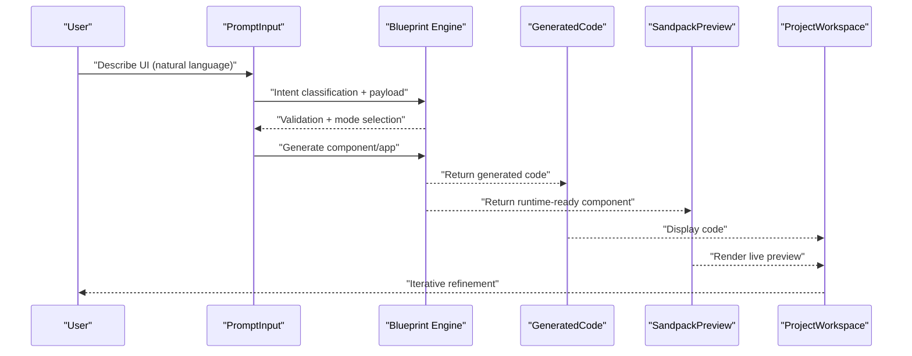
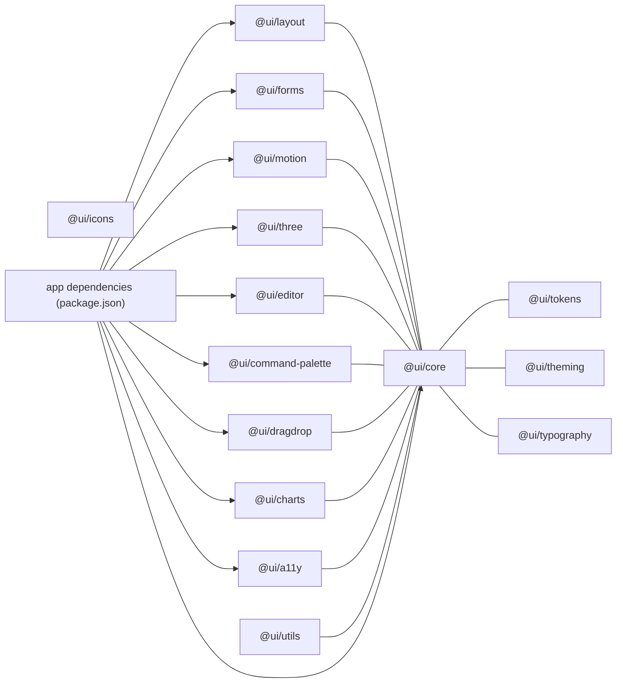

# UI Component System

<cite>
**Referenced Files in This Document**
- [README.md](file://README.md)
- [package.json](file://package.json)
- [components/A11yReport.tsx](file://components/A11yReport.tsx)
- [components/GeneratedCode.tsx](file://components/GeneratedCode.tsx)
- [components/PromptInput.tsx](file://components/PromptInput.tsx)
- [components/ProjectWorkspace.tsx](file://components/ProjectWorkspace.tsx)
- [components/SandpackPreview.tsx](file://components/SandpackPreview.tsx)
- [components/VersionTimeline.tsx](file://components/VersionTimeline.tsx)
- [components/IntentBadge.tsx](file://components/IntentBadge.tsx)
- [components/IDE/CentreWorkspace.tsx](file://components/IDE/CentreWorkspace.tsx)
- [components/IDE/RightPanel.tsx](file://components/IDE/RightPanel.tsx)
- [components/IDE/Sidebar.tsx](file://components/IDE/Sidebar.tsx)
- [components/workspace/WorkspaceProvider.tsx](file://components/workspace/WorkspaceProvider.tsx)
- [components/workspace/WorkspaceSwitcher.tsx](file://components/workspace/WorkspaceSwitcher.tsx)
- [components/auth/SessionProvider.tsx](file://components/auth/SessionProvider.tsx)
- [components/auth/UserNav.tsx](file://components/auth/UserNav.tsx)
- [app/layout.tsx](file://app/layout.tsx)
- [app/page.tsx](file://app/page.tsx)
- [app/forgot-password/page.tsx](file://app/forgot-password/page.tsx)
- [app/login/page.tsx](file://app/login/page.tsx)
- [app/reset-password/page.tsx](file://app/reset-password/page.tsx)
- [docs/ARCHITECTURE.md](file://docs/ARCHITECTURE.md)
- [docs/ENV_SETUP.md](file://docs/ENV_SETUP.md)
</cite>

## Table of Contents
1. [Introduction](#introduction)
2. [Project Structure](#project-structure)
3. [Core Components](#core-components)
4. [Architecture Overview](#architecture-overview)
5. [Detailed Component Analysis](#detailed-component-analysis)
6. [Dependency Analysis](#dependency-analysis)
7. [Performance Considerations](#performance-considerations)
8. [Troubleshooting Guide](#troubleshooting-guide)
9. [Conclusion](#conclusion)
10. [Appendices](#appendices)

## Introduction
This document describes the internal UI component system and design framework of an AI-powered, accessibility-first React application. It focuses on:
- The component registry and catalog of built-in components
- The blueprint engine enforcing design system rules and style DNA consistency
- The component library organization across @ui/* packages
- Composition patterns, prop interfaces, and customization options
- Guidelines for adding new components and extending the design system
- The relationship between generated components and the internal ecosystem
- Usage patterns and best practices for maintaining design consistency

The system emphasizes accessibility, a cohesive visual language, and an integrated authoring experience that supports natural language-driven UI generation.

## Project Structure
The repository is a Next.js application with a monorepo-style packages directory for reusable UI libraries and a components directory for application-specific UI building blocks. The UI ecosystem integrates:
- Built-in components under components/
- UI packages under packages/@ui/*
- Application pages under app/
- Supporting providers and IDE panels under components/

```mermaid
graph TB
subgraph "Application"
APP_LAYOUT["app/layout.tsx"]
APP_PAGE["app/page.tsx"]
APP_LOGIN["app/login/page.tsx"]
APP_FORGOT["app/forgot-password/page.tsx"]
APP_RESET["app/reset-password/page.tsx"]
end
subgraph "Components"
PROMPT["components/PromptInput.tsx"]
GENCODE["components/GeneratedCode.tsx"]
A11Y["components/A11yReport.tsx"]
WORKSPACE["components/ProjectWorkspace.tsx"]
TIMELINE["components/VersionTimeline.tsx"]
SANDBOX["components/SandpackPreview.tsx"]
INTENT["components/IntentBadge.tsx"]
IDE_CW["components/IDE/CentreWorkspace.tsx"]
IDE_RP["components/IDE/RightPanel.tsx"]
IDE_SB["components/IDE/Sidebar.tsx"]
WS_PROV["components/workspace/WorkspaceProvider.tsx"]
WS_SWITCH["components/workspace/WorkspaceSwitcher.tsx"]
AUTH_SP["components/auth/SessionProvider.tsx"]
AUTH_NAV["components/auth/UserNav.tsx"]
end
subgraph "Packages (@ui)"
PK_CORE["@ui/core"]
PK_LAYOUT["@ui/layout"]
PK_FORMS["@ui/forms"]
PK_MOTION["@ui/motion"]
PK_THREE["@ui/three"]
PK_TOKENS["@ui/tokens"]
PK_THEMING["@ui/theming"]
PK_TYPOGRAPHY["@ui/typography"]
PK_ICONS["@ui/icons"]
PK_CHARTS["@ui/charts"]
PK_COMMAND["@ui/command-palette"]
PK_DRAGDROP["@ui/dragdrop"]
PK_EDITOR["@ui/editor"]
PK_UTILS["@ui/utils"]
PK_A11Y["@ui/a11y"]
end
APP_LAYOUT --> PROMPT
APP_PAGE --> WORKSPACE
WORKSPACE --> GENCODE
WORKSPACE --> A11Y
WORKSPACE --> TIMELINE
WORKSPACE --> SANDBOX
PROMPT --> INTENT
IDE_CW --> PROMPT
IDE_RP --> GENCODE
IDE_SB --> WORKSPACE
WS_PROV --> WORKSPACE
WS_SWITCH --> WORKSPACE
AUTH_SP --> APP_LAYOUT
AUTH_NAV --> APP_LAYOUT
PROMPT --> PK_CORE
GENCODE --> PK_CORE
A11Y --> PK_CORE
WORKSPACE --> PK_LAYOUT
SANDBOX --> PK_EDITOR
TIMELINE --> PK_CORE
INTENT --> PK_CORE
IDE_* --> PK_LAYOUT
WS_* --> PK_CORE
AUTH_* --> PK_CORE
```

**Diagram sources**
- [app/layout.tsx](file://app/layout.tsx)
- [app/page.tsx](file://app/page.tsx)
- [components/PromptInput.tsx](file://components/PromptInput.tsx)
- [components/GeneratedCode.tsx](file://components/GeneratedCode.tsx)
- [components/A11yReport.tsx](file://components/A11yReport.tsx)
- [components/ProjectWorkspace.tsx](file://components/ProjectWorkspace.tsx)
- [components/VersionTimeline.tsx](file://components/VersionTimeline.tsx)
- [components/SandpackPreview.tsx](file://components/SandpackPreview.tsx)
- [components/IntentBadge.tsx](file://components/IntentBadge.tsx)
- [components/IDE/CentreWorkspace.tsx](file://components/IDE/CentreWorkspace.tsx)
- [components/IDE/RightPanel.tsx](file://components/IDE/RightPanel.tsx)
- [components/IDE/Sidebar.tsx](file://components/IDE/Sidebar.tsx)
- [components/workspace/WorkspaceProvider.tsx](file://components/workspace/WorkspaceProvider.tsx)
- [components/workspace/WorkspaceSwitcher.tsx](file://components/workspace/WorkspaceSwitcher.tsx)
- [components/auth/SessionProvider.tsx](file://components/auth/SessionProvider.tsx)
- [components/auth/UserNav.tsx](file://components/auth/UserNav.tsx)

**Section sources**
- [README.md:1-37](file://README.md#L1-L37)
- [package.json:1-68](file://package.json#L1-L68)

## Core Components
This section documents the primary UI components that form the backbone of the design system and authoring workflow.

- PromptInput: Natural language input with intent classification, voice input, image-to-text attachment, and generation modes (component, app, depth UI).
- GeneratedCode: Read-only code viewer with copy/download actions and syntax highlighting.
- A11yReport: Accessibility scoring and violation listing with severity-based styling and suggested fixes.
- ProjectWorkspace: Iterative design workspace with preview/code modes, version timeline, and refinement controls.
- SandpackPreview: Dynamic live preview of generated React components.
- VersionTimeline: Navigation and rollback across project versions.
- IntentBadge: Visual indicator of detected intent classification.
- IDE Panels: CentreWorkspace, RightPanel, and Sidebar for integrated authoring.
- WorkspaceProvider and WorkspaceSwitcher: Context and UI for workspace management.
- SessionProvider and UserNav: Authentication scaffolding.

These components share a consistent design language, accessibility attributes, and integration points that enforce style DNA and design system rules.

**Section sources**
- [components/PromptInput.tsx:1-563](file://components/PromptInput.tsx#L1-L563)
- [components/GeneratedCode.tsx:1-149](file://components/GeneratedCode.tsx#L1-L149)
- [components/A11yReport.tsx:1-193](file://components/A11yReport.tsx#L1-L193)
- [components/ProjectWorkspace.tsx:1-313](file://components/ProjectWorkspace.tsx#L1-L313)
- [components/SandpackPreview.tsx](file://components/SandpackPreview.tsx)
- [components/VersionTimeline.tsx](file://components/VersionTimeline.tsx)
- [components/IntentBadge.tsx](file://components/IntentBadge.tsx)
- [components/IDE/CentreWorkspace.tsx](file://components/IDE/CentreWorkspace.tsx)
- [components/IDE/RightPanel.tsx](file://components/IDE/RightPanel.tsx)
- [components/IDE/Sidebar.tsx](file://components/IDE/Sidebar.tsx)
- [components/workspace/WorkspaceProvider.tsx](file://components/workspace/WorkspaceProvider.tsx)
- [components/workspace/WorkspaceSwitcher.tsx](file://components/workspace/WorkspaceSwitcher.tsx)
- [components/auth/SessionProvider.tsx](file://components/auth/SessionProvider.tsx)
- [components/auth/UserNav.tsx](file://components/auth/UserNav.tsx)

## Architecture Overview
The UI architecture centers around a blueprint engine that enforces design system rules and style DNA consistency. This engine ensures that:
- Generated components adhere to established tokens, spacing, and typography
- Accessibility is baked into component props and rendering
- Composition patterns promote reuse and maintainability
- Providers and contexts coordinate state across the workspace

**Diagram sources**
- [components/PromptInput.tsx:1-563](file://components/PromptInput.tsx#L1-L563)
- [components/GeneratedCode.tsx:1-149](file://components/GeneratedCode.tsx#L1-L149)
- [components/SandpackPreview.tsx](file://components/SandpackPreview.tsx)
- [components/ProjectWorkspace.tsx:1-313](file://components/ProjectWorkspace.tsx#L1-L313)

## Detailed Component Analysis

### PromptInput
Purpose: Accepts natural language prompts, validates input, detects intent, and triggers generation in component/app/depth UI modes. Integrates voice input and image-to-text attachment.

Key behaviors:
- Input validation and error messaging
- Debounced intent classification with confidence metrics
- Voice recording via Web Speech API
- Image upload pipeline for OCR/context
- Mode toggles and submission routing

Prop interfaces and customization:
- onSubmit(prompt, mode, options)
- isLoading, onIntentDetected, hasActiveProject, aiPayload
- Options include depthUi flag

Accessibility and design system alignment:
- Uses severity-based styling and WCAG-compliant contrast
- Clear affordances for keyboard and screen reader users
- Consistent spacing and typography tokens

**Section sources**
- [components/PromptInput.tsx:1-563](file://components/PromptInput.tsx#L1-L563)

### GeneratedCode
Purpose: Displays generated TypeScript/JSX code with syntax highlighting, copy-to-clipboard, and download capabilities.

Key behaviors:
- Guard clause for empty code
- Clipboard API with fallback textarea selection
- Blob-based download with filename derived from component name
- CodeMirror integration with dark theme and JS/TS support

Prop interfaces and customization:
- code: string
- componentName: string

Accessibility and design system alignment:
- Backdrop blur and glassmorphism with consistent borders
- Focus-visible rings and hover states aligned with tokens

**Section sources**
- [components/GeneratedCode.tsx:1-149](file://components/GeneratedCode.tsx#L1-L149)

### A11yReport
Purpose: Presents accessibility scores and violations with severity-based styling and suggested fixes.

Key behaviors:
- Score ring visualization with color-coded thresholds
- Violation cards grouped by severity (error, warning, info)
- Applied auto-fixes summary

Prop interfaces and customization:
- report: A11yReport with optional appliedFixes

Accessibility and design system alignment:
- Semantic roles and ARIA attributes
- Color tokens per severity mapped to Tailwind classes
- WCAG 2.1 AA compliance indicators

**Section sources**
- [components/A11yReport.tsx:1-193](file://components/A11yReport.tsx#L1-L193)

### ProjectWorkspace
Purpose: Manages iterative design iterations with preview/code modes, version timeline, and refinement controls.

Key behaviors:
- Tracks versions and current selection
- Supports local and server-side rollback
- Switchable view modes (preview/code)
- Quick refinement chips and custom prompts

Prop interfaces and customization:
- initialProject: ProjectIteration
- onRefine(prompt): Promise<void>
- isRefining: boolean
- projectId?: string | null

Accessibility and design system alignment:
- Consistent header, borders, and backdrop blur
- Keyboard-navigable refinement bar and buttons

**Section sources**
- [components/ProjectWorkspace.tsx:1-313](file://components/ProjectWorkspace.tsx#L1-L313)

### SandpackPreview
Purpose: Renders the live preview of generated components using a sandbox runtime.

Integration:
- Dynamically imported for SSR avoidance
- Receives code and component name for rendering

Accessibility and design system alignment:
- Ensures focus isolation and clear overlays
- Consistent container styling with borders and backdrop

**Section sources**
- [components/SandpackPreview.tsx](file://components/SandpackPreview.tsx)

### VersionTimeline
Purpose: Provides a compact timeline of versions with selection and rollback actions.

Integration:
- Consumed by ProjectWorkspace for navigation and rollback

Accessibility and design system alignment:
- Clear selection states and disabled states for actions

**Section sources**
- [components/VersionTimeline.tsx](file://components/VersionTimeline.tsx)

### IntentBadge
Purpose: Visual indicator of detected intent classification with confidence.

Integration:
- Used within PromptInput to surface live intent hints

Accessibility and design system alignment:
- Compact, accessible badges with appropriate contrast

**Section sources**
- [components/IntentBadge.tsx](file://components/IntentBadge.tsx)

### IDE Panels and Workspace Providers
Purpose: Integrated authoring environment and workspace management.

- CentreWorkspace: Central authoring area
- RightPanel: Code and inspection panel
- Sidebar: Navigation and project list
- WorkspaceProvider: Global workspace context
- WorkspaceSwitcher: Workspace selection UI

Accessibility and design system alignment:
- Unified theming and spacing
- Consistent focus management and keyboard shortcuts

**Section sources**
- [components/IDE/CentreWorkspace.tsx](file://components/IDE/CentreWorkspace.tsx)
- [components/IDE/RightPanel.tsx](file://components/IDE/RightPanel.tsx)
- [components/IDE/Sidebar.tsx](file://components/IDE/Sidebar.tsx)
- [components/workspace/WorkspaceProvider.tsx](file://components/workspace/WorkspaceProvider.tsx)
- [components/workspace/WorkspaceSwitcher.tsx](file://components/workspace/WorkspaceSwitcher.tsx)

### Authentication Components
Purpose: Scaffolding for session management and user navigation.

- SessionProvider: Wraps app with session context
- UserNav: User menu and profile actions

Accessibility and design system alignment:
- Consistent button styles and dropdown menus
- Focus management and keyboard navigation

**Section sources**
- [components/auth/SessionProvider.tsx](file://components/auth/SessionProvider.tsx)
- [components/auth/UserNav.tsx](file://components/auth/UserNav.tsx)

## Dependency Analysis
The UI components depend on shared tokens, theming, and utility packages. The application also relies on external libraries for icons, syntax highlighting, and runtime preview.

**Diagram sources**
- [package.json:13-44](file://package.json#L13-L44)

**Section sources**
- [package.json:1-68](file://package.json#L1-L68)

## Performance Considerations
- Defer heavy UI via dynamic imports (e.g., SandpackPreview) to reduce initial bundle size.
- Use memoization and debouncing for intent classification and speech recognition to avoid excessive re-renders.
- Prefer CSS transitions and hardware-accelerated animations for motion components.
- Lazy-load syntax highlighting and editor features to minimize runtime overhead.
- Optimize image uploads and OCR processing with progress states and cancellation where applicable.

## Troubleshooting Guide
Common issues and resolutions:
- Clipboard failures: The GeneratedCode component falls back to textarea selection if Clipboard API fails; ensure HTTPS for clipboard permissions.
- Speech recognition unsupported: PromptInput gracefully handles missing SpeechRecognition APIs and informs users.
- Live preview not rendering: Verify dynamic import configuration and ensure client-side rendering for preview components.
- Accessibility warnings: Review A11yReport for severity levels and apply suggested fixes; confirm WCAG criteria coverage.
- Workspace rollback errors: Confirm projectId presence and network connectivity; handle server-side rollback responses.

**Section sources**
- [components/GeneratedCode.tsx:30-63](file://components/GeneratedCode.tsx#L30-L63)
- [components/PromptInput.tsx:86-128](file://components/PromptInput.tsx#L86-L128)
- [components/ProjectWorkspace.tsx:111-133](file://components/ProjectWorkspace.tsx#L111-L133)
- [components/A11yReport.tsx:1-193](file://components/A11yReport.tsx#L1-L193)

## Conclusion
The UI component system blends accessibility-first design with an AI-driven blueprint engine to produce consistent, compliant, and visually coherent components. By organizing reusable pieces under @ui packages and enforcing design system rules through shared tokens and theming, teams can rapidly iterate while maintaining quality and inclusivity. The component registry and composition patterns outlined here provide a foundation for extending the system with new components and capabilities.

## Appendices

### Component Registry and Metadata
- Built-in components are located under components/ and include PromptInput, GeneratedCode, A11yReport, ProjectWorkspace, SandpackPreview, VersionTimeline, IntentBadge, and IDE/workspace/auth panels.
- Each component exposes a clear prop interface and adheres to accessibility standards.
- Compatibility requirements:
  - Use Tailwind classes aligned with @ui/tokens and @ui/theming
  - Ensure ARIA attributes and semantic roles
  - Provide keyboard navigation and focus management
  - Support SSR-safe dynamic imports for client-only features

**Section sources**
- [components/PromptInput.tsx:1-563](file://components/PromptInput.tsx#L1-L563)
- [components/GeneratedCode.tsx:1-149](file://components/GeneratedCode.tsx#L1-L149)
- [components/A11yReport.tsx:1-193](file://components/A11yReport.tsx#L1-L193)
- [components/ProjectWorkspace.tsx:1-313](file://components/ProjectWorkspace.tsx#L1-L313)
- [components/SandpackPreview.tsx](file://components/SandpackPreview.tsx)
- [components/VersionTimeline.tsx](file://components/VersionTimeline.tsx)
- [components/IntentBadge.tsx](file://components/IntentBadge.tsx)
- [components/IDE/CentreWorkspace.tsx](file://components/IDE/CentreWorkspace.tsx)
- [components/IDE/RightPanel.tsx](file://components/IDE/RightPanel.tsx)
- [components/IDE/Sidebar.tsx](file://components/IDE/Sidebar.tsx)
- [components/workspace/WorkspaceProvider.tsx](file://components/workspace/WorkspaceProvider.tsx)
- [components/workspace/WorkspaceSwitcher.tsx](file://components/workspace/WorkspaceSwitcher.tsx)
- [components/auth/SessionProvider.tsx](file://components/auth/SessionProvider.tsx)
- [components/auth/UserNav.tsx](file://components/auth/UserNav.tsx)

### Blueprint Engine and Style DNA
- Enforce design system rules via shared tokens and typography packages.
- Maintain style DNA consistency by centralizing variants and class compositions in @ui/core and @ui/theming.
- Apply motion and layout primitives from @ui/motion and @ui/layout to preserve rhythm and spacing.
- Integrate accessibility checks and WCAG compliance in component rendering and props.

**Section sources**
- [package.json:13-44](file://package.json#L13-L44)

### Component Library Organization
- @ui/core: Base components, tokens, and foundational utilities
- @ui/layout: Layout primitives and grid systems
- @ui/forms: Form controls and validation helpers
- @ui/motion: Motion primitives and animation utilities
- @ui/three: 3D and advanced rendering helpers
- @ui/theming: Theme provider and design system integrations
- @ui/tokens: Design tokens (colors, spacing, typography)
- @ui/typography: Typography system and text utilities
- @ui/icons: Iconography and SVG utilities
- @ui/charts: Charting primitives
- @ui/command-palette: Command palette and keyboard navigation
- @ui/dragdrop: Drag-and-drop utilities
- @ui/editor: Code editor and preview integrations
- @ui/utils: Shared utilities and helpers
- @ui/a11y: Accessibility-focused components and utilities

**Section sources**
- [package.json:13-44](file://package.json#L13-L44)

### Adding New Components to the Registry
- Define a clear prop interface and accessibility contract
- Use tokens and theming from @ui packages
- Provide keyboard navigation and ARIA attributes
- Export variants and composition helpers from @ui/core
- Add tests and documentation for usage patterns
- Keep component small, focused, and composable

**Section sources**
- [components/PromptInput.tsx:1-563](file://components/PromptInput.tsx#L1-L563)
- [components/GeneratedCode.tsx:1-149](file://components/GeneratedCode.tsx#L1-L149)
- [components/A11yReport.tsx:1-193](file://components/A11yReport.tsx#L1-L193)
- [components/ProjectWorkspace.tsx:1-313](file://components/ProjectWorkspace.tsx#L1-L313)

### Extending the Design System
- Introduce new tokens in @ui/tokens and update @ui/theming accordingly
- Add new motion presets in @ui/motion and layout patterns in @ui/layout
- Extend form controls in @ui/forms with consistent styling and validation
- Document new components in @ui packages with usage examples
- Maintain backward compatibility and deprecation policies

**Section sources**
- [package.json:13-44](file://package.json#L13-L44)

### Relationship Between Generated Components and the Internal Ecosystem
- Generated components are rendered inside SandpackPreview using @ui/editor and @ui/theming
- Accessibility reports are produced by @ui/a11y and surfaced in A11yReport
- Workspace management leverages @ui/core and @ui/layout for consistent layouts
- Intent detection and refinement leverage @ui/command-palette and @ui/forms

**Section sources**
- [components/SandpackPreview.tsx](file://components/SandpackPreview.tsx)
- [components/A11yReport.tsx:1-193](file://components/A11yReport.tsx#L1-L193)
- [components/ProjectWorkspace.tsx:1-313](file://components/ProjectWorkspace.tsx#L1-L313)
- [components/PromptInput.tsx:1-563](file://components/PromptInput.tsx#L1-L563)

### Usage Patterns and Best Practices
- Prefer composition over inheritance; combine small, focused components
- Use intent classification to guide generation and refinement workflows
- Maintain consistent spacing and typography via tokens and theming
- Ensure all interactive elements are keyboard accessible and screen-reader friendly
- Provide clear feedback for loading, error, and success states
- Keep generated code readable and editable; avoid obfuscation

**Section sources**
- [components/PromptInput.tsx:1-563](file://components/PromptInput.tsx#L1-L563)
- [components/GeneratedCode.tsx:1-149](file://components/GeneratedCode.tsx#L1-L149)
- [components/ProjectWorkspace.tsx:1-313](file://components/ProjectWorkspace.tsx#L1-L313)
- [components/A11yReport.tsx:1-193](file://components/A11yReport.tsx#L1-L193)