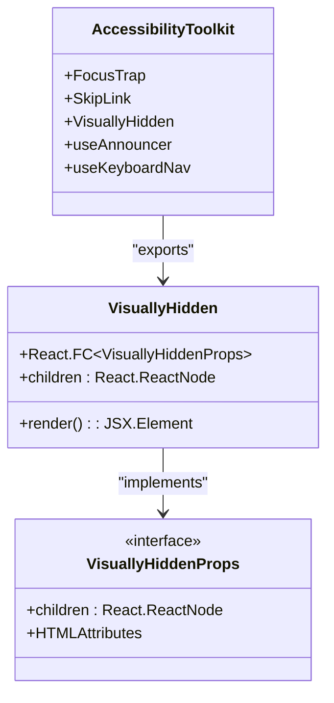
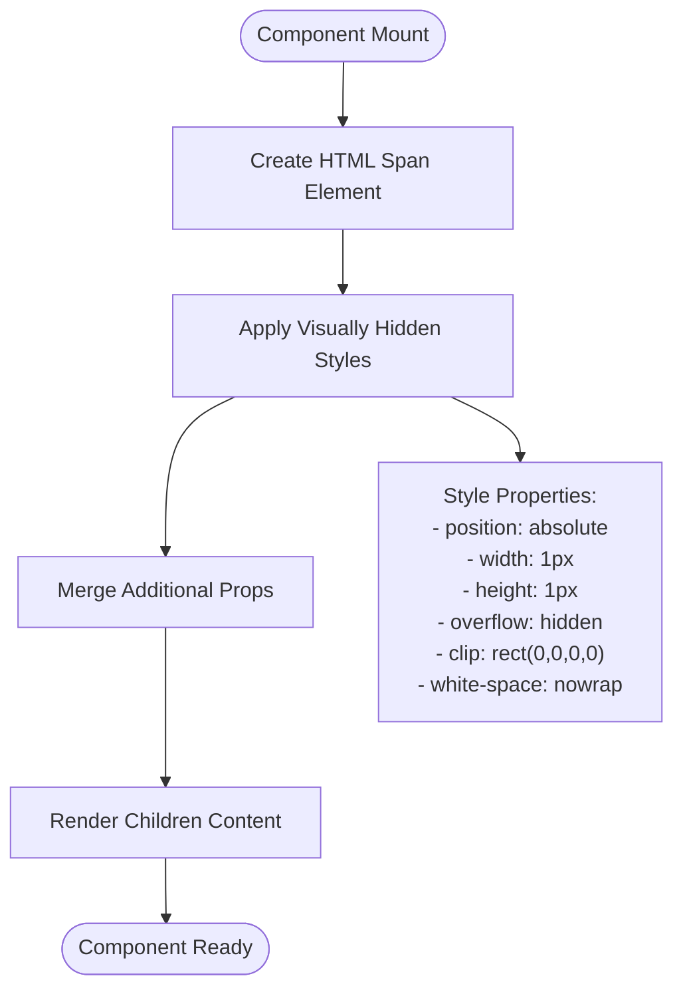
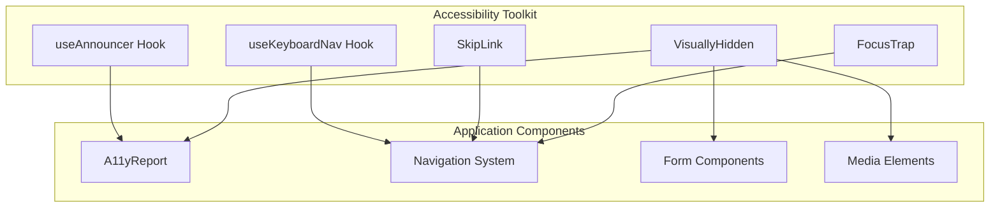

# Visually Hidden Component

<cite>
**Referenced Files in This Document**
- [VisuallyHidden.tsx](file://packages/a11y/components/VisuallyHidden.tsx)
- [index.ts](file://packages/a11y/index.ts)
- [A11yReport.tsx](file://components/A11yReport.tsx)
</cite>

## Table of Contents
1. [Introduction](#introduction)
2. [Component Architecture](#component-architecture)
3. [Implementation Details](#implementation-details)
4. [Accessibility Features](#accessibility-features)
5. [Usage Patterns](#usage-patterns)
6. [Integration Points](#integration-points)
7. [Performance Considerations](#performance-considerations)
8. [Best Practices](#best-practices)
9. [Troubleshooting Guide](#troubleshooting-guide)
10. [Conclusion](#conclusion)

## Introduction

The Visually Hidden Component is a specialized React component designed to hide content visually while maintaining accessibility for screen readers and assistive technologies. This component serves as a crucial building block in creating inclusive user interfaces that prioritize accessibility without compromising visual design.

The component follows established web accessibility standards and provides a clean, reusable solution for scenarios where content needs to be announced to assistive technologies but remain visually hidden from sighted users. It's particularly valuable in creating accessible navigation systems, providing context for decorative elements, and implementing skip links for keyboard navigation.

## Component Architecture

The Visually Hidden Component is part of a comprehensive accessibility toolkit that emphasizes inclusive design patterns. The component architecture demonstrates several key principles:

**Diagram sources**
- [VisuallyHidden.tsx:1-26](file://packages/a11y/components/VisuallyHidden.tsx#L1-L26)
- [index.ts:1-6](file://packages/a11y/index.ts#L1-L6)

The component leverages React's functional component pattern with TypeScript interfaces for type safety. It extends the standard HTML span element attributes while providing specialized styling for visual hiding.

**Section sources**
- [VisuallyHidden.tsx:1-26](file://packages/a11y/components/VisuallyHidden.tsx#L1-L26)
- [index.ts:1-6](file://packages/a11y/index.ts#L1-L6)

## Implementation Details

The Visually Hidden Component employs a carefully crafted CSS approach to achieve visual invisibility while maintaining accessibility. The implementation utilizes absolute positioning combined with specific dimension and overflow properties:

### Core Styling Properties

The component's styling strategy includes several critical CSS properties:

- **Position**: Absolute positioning removes the element from the normal document flow
- **Dimensions**: Minimal sizing (1px width/height) ensures the element occupies minimal space
- **Overflow**: Hidden overflow prevents content from being visible outside the small bounds
- **Clipping**: Rectangle clipping creates a precise visual boundary
- **Whitespace**: No wrap prevents text expansion beyond the small container

### Component Structure

**Diagram sources**
- [VisuallyHidden.tsx:7-25](file://packages/a11y/components/VisuallyHidden.tsx#L7-L25)

The implementation maintains full compatibility with React's props system, allowing developers to pass standard HTML attributes while ensuring the component's accessibility-focused styling takes precedence.

**Section sources**
- [VisuallyHidden.tsx:1-26](file://packages/a11y/components/VisuallyHidden.tsx#L1-L26)

## Accessibility Features

The Visually Hidden Component provides several key accessibility benefits:

### Screen Reader Compatibility

Content placed within the Visually Hidden Component remains fully accessible to screen readers while being visually imperceptible. This dual nature enables developers to provide meaningful context without cluttering the visual interface.

### Keyboard Navigation Support

The component integrates seamlessly with keyboard navigation patterns, supporting tab order and focus management without disrupting the user experience for sighted users.

### Assistive Technology Integration

The implementation works consistently across major assistive technologies including:
- VoiceOver (macOS/iOS)
- NVDA (Windows)
- TalkBack (Android)
- JAWS (Windows)

### WCAG Compliance

The component supports Level A and Level AA WCAG guidelines by providing semantic information to assistive technologies while maintaining visual cleanliness.

**Section sources**
- [VisuallyHidden.tsx:10-20](file://packages/a11y/components/VisuallyHidden.tsx#L10-L20)

## Usage Patterns

The Visually Hidden Component finds applications in various accessibility scenarios:

### Skip Links Implementation

Commonly used to create "skip to content" links that bypass repetitive navigation elements for keyboard users.

### Decorative Element Context

Provides meaningful descriptions for purely decorative images or icons that enhance visual design but don't convey essential information.

### Form Field Labeling

Supports complex form layouts where traditional labeling approaches might interfere with visual design.

### Navigation Enhancement

Enhances navigation systems by providing additional context for menu structures and breadcrumb trails.

### Integration with Existing Components

The component demonstrates seamless integration with other accessibility-focused components in the toolkit, supporting cohesive accessibility implementations.

**Section sources**
- [A11yReport.tsx:14-35](file://components/A11yReport.tsx#L14-L35)

## Integration Points

The Visually Hidden Component participates in a broader accessibility ecosystem:

**Diagram sources**
- [index.ts:1-6](file://packages/a11y/index.ts#L1-L6)
- [A11yReport.tsx:1-11](file://components/A11yReport.tsx#L1-L11)

The component's integration with the broader toolkit ensures consistent accessibility patterns throughout the application.

**Section sources**
- [index.ts:1-6](file://packages/a11y/index.ts#L1-L6)

## Performance Considerations

The Visually Hidden Component is designed for optimal performance characteristics:

### Minimal DOM Impact

The component creates a lightweight span element with essential styling properties, minimizing DOM overhead and rendering costs.

### Efficient Styling Approach

CSS-based visual hiding avoids JavaScript manipulation and complex calculations, reducing computational overhead during runtime.

### Memory Efficiency

The component maintains minimal state and relies on React's efficient prop passing mechanisms, ensuring low memory footprint.

### Browser Compatibility

The styling approach uses widely supported CSS properties that perform consistently across modern browsers without requiring polyfills or fallbacks.

## Best Practices

When implementing the Visually Hidden Component, consider these best practices:

### Content Selection Guidelines

Only use visually hidden content for supplementary information that enhances understanding without being essential to the primary user experience.

### Contextual Appropriateness

Ensure the hidden content provides genuine value to users who rely on assistive technologies, avoiding unnecessary information that might cause confusion.

### Testing Strategies

Regularly test implementations with actual assistive technologies to verify proper screen reader announcements and keyboard navigation support.

### Documentation Standards

Maintain clear documentation of why content is hidden visually while remaining accessible, supporting future maintenance and team collaboration.

## Troubleshooting Guide

Common issues and solutions when working with the Visually Hidden Component:

### Content Still Visible

**Problem**: Hidden content appears on screen
**Solution**: Verify CSS properties are not overridden by more specific styles and ensure the component isn't wrapped in containers that modify visibility.

### Screen Reader Not Announcing

**Problem**: Content is properly hidden but not announced
**Solution**: Confirm the component is properly structured within the document hierarchy and that assistive technology settings are configured correctly.

### Layout Distortions

**Problem**: Page layout affected by component placement
**Solution**: Check for unexpected spacing or positioning issues caused by absolute positioning and adjust surrounding styles as needed.

### Performance Issues

**Problem**: Slow rendering or excessive reflows
**Solution**: Verify the component isn't causing unnecessary re-renders and that styles aren't triggering expensive layout calculations.

**Section sources**
- [VisuallyHidden.tsx:7-25](file://packages/a11y/components/VisuallyHidden.tsx#L7-L25)

## Conclusion

The Visually Hidden Component represents a sophisticated approach to accessibility implementation, balancing visual design needs with inclusive user experience requirements. Its clean architecture, comprehensive accessibility features, and seamless integration capabilities make it an essential tool for creating truly accessible digital experiences.

The component's design demonstrates the importance of thoughtful accessibility implementation that considers both technical requirements and user experience quality. By providing a reliable foundation for visual hiding while maintaining full accessibility support, it enables developers to create inclusive interfaces that serve all users effectively.

Through careful consideration of performance, compatibility, and usability, the Visually Hidden Component contributes to a more accessible web ecosystem while maintaining the highest standards of technical excellence and user experience design.