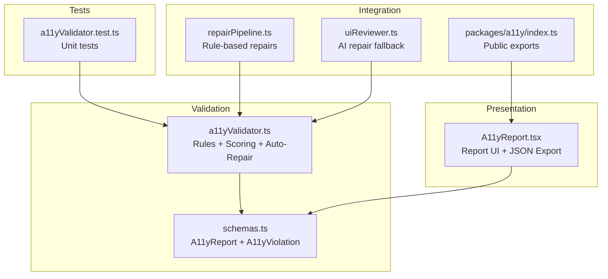
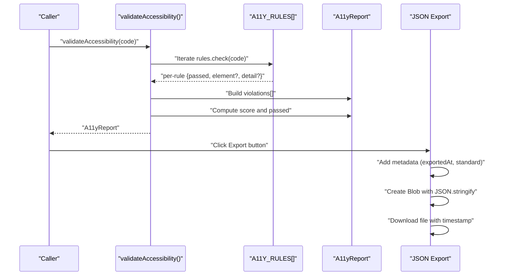
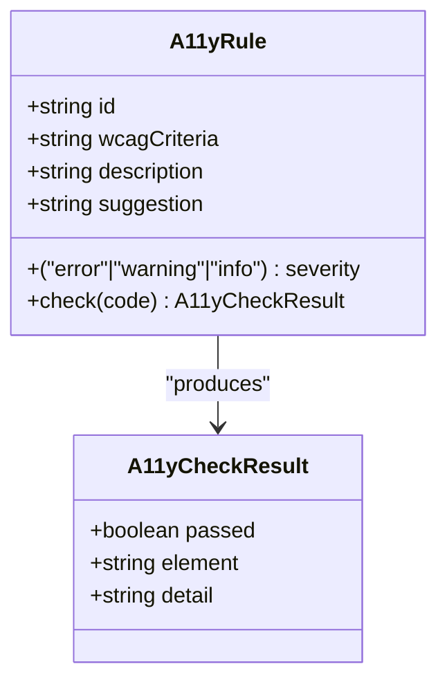
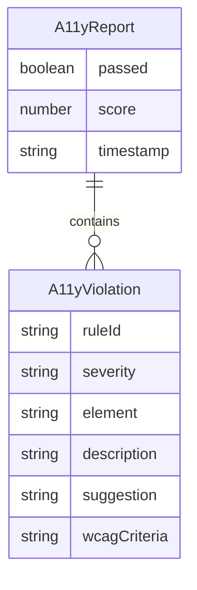
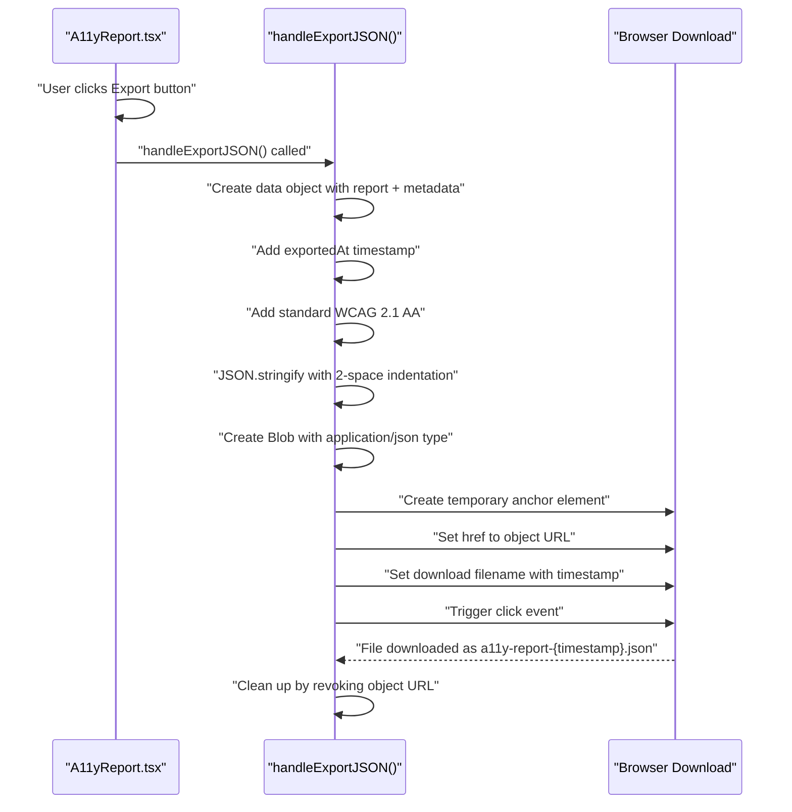
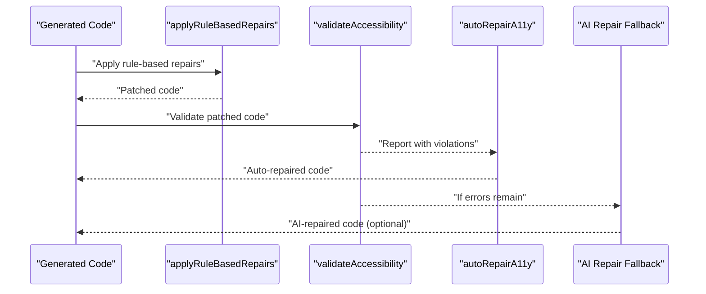
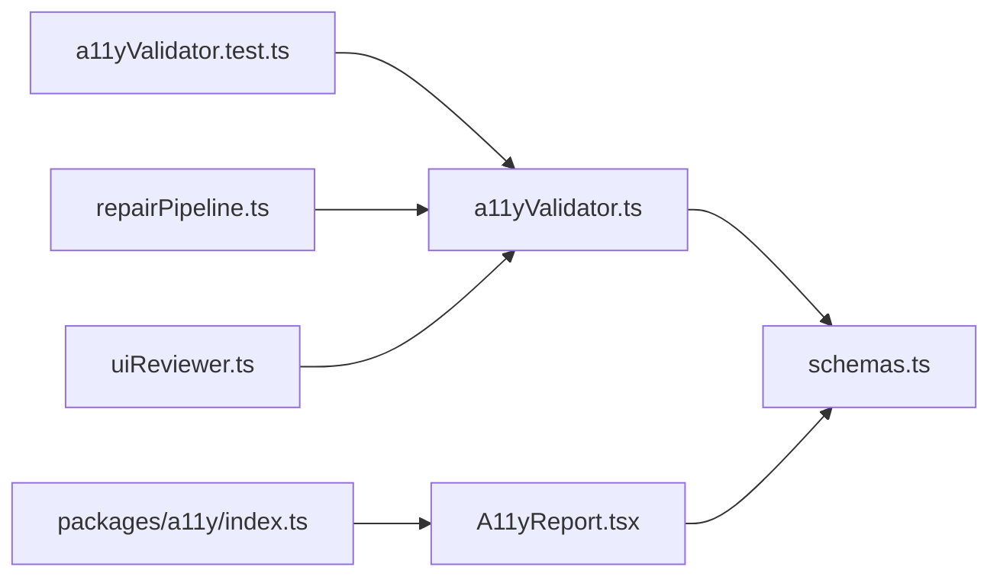

# Accessibility Validation (WCAG 2.1 AA)

<cite>
**Referenced Files in This Document**
- [a11yValidator.ts](file://lib/validation/a11yValidator.ts)
- [schemas.ts](file://lib/validation/schemas.ts)
- [A11yReport.tsx](file://components/A11yReport.tsx)
- [a11yValidator.test.ts](file://__tests__/a11yValidator.test.ts)
- [index.ts](file://packages/a11y/index.ts)
- [repairPipeline.ts](file://lib/intelligence/repairPipeline.ts)
- [uiReviewer.ts](file://lib/ai/uiReviewer.ts)
</cite>

## Update Summary
**Changes Made**
- Added documentation for the new JSON export functionality in A11yReport component
- Updated the Report UI Rendering section to include export capabilities
- Enhanced the A11yReport schema documentation to reflect new metadata fields
- Added new section covering JSON export workflow and metadata

## Table of Contents
1. [Introduction](#introduction)
2. [Project Structure](#project-structure)
3. [Core Components](#core-components)
4. [Architecture Overview](#architecture-overview)
5. [Detailed Component Analysis](#detailed-component-analysis)
6. [Dependency Analysis](#dependency-analysis)
7. [Performance Considerations](#performance-considerations)
8. [Troubleshooting Guide](#troubleshooting-guide)
9. [Conclusion](#conclusion)
10. [Appendices](#appendices)

## Introduction
This document describes the WCAG 2.1 AA–compliant accessibility validation system implemented as a rule-based static analyzer for generated TSX code. It documents all 12 accessibility rules, the scoring mechanism, the A11yReport schema, auto-repair capabilities, and the new JSON export functionality. Guidance is included for extending the rule set, customizing thresholds, and exporting accessibility reports with metadata.

## Project Structure
The accessibility validation system spans three main areas:
- Validation engine: rule definitions and scoring logic
- Report renderer: UI component for displaying violations and suggestions with JSON export capabilities
- Tests and integration: unit tests and optional AI-based repair pipeline

**Diagram sources**
- [a11yValidator.ts:1-376](file://lib/validation/a11yValidator.ts#L1-L376)
- [schemas.ts:300-340](file://lib/validation/schemas.ts#L300-L340)
- [A11yReport.tsx:1-220](file://components/A11yReport.tsx#L1-L220)
- [a11yValidator.test.ts:1-110](file://__tests__/a11yValidator.test.ts#L1-L110)
- [repairPipeline.ts:1-286](file://lib/intelligence/repairPipeline.ts#L1-L286)
- [uiReviewer.ts:165-198](file://lib/ai/uiReviewer.ts#L165-L198)
- [index.ts:1-4](file://packages/a11y/index.ts#L1-L4)

**Section sources**
- [a11yValidator.ts:1-376](file://lib/validation/a11yValidator.ts#L1-L376)
- [schemas.ts:300-340](file://lib/validation/schemas.ts#L300-L340)
- [A11yReport.tsx:1-220](file://components/A11yReport.tsx#L1-L220)
- [a11yValidator.test.ts:1-110](file://__tests__/a11yValidator.test.ts#L1-L110)
- [repairPipeline.ts:1-286](file://lib/intelligence/repairPipeline.ts#L1-L286)
- [uiReviewer.ts:165-198](file://lib/ai/uiReviewer.ts#L165-L198)
- [index.ts:1-4](file://packages/a11y/index.ts#L1-L4)

## Core Components
- Rule engine: Defines 12 WCAG 2.1 AA–aligned rules and executes them against TSX code.
- Scoring: Computes a compliance score from severity counts with configurable penalties.
- Auto-repair: Applies targeted, safe transformations to fix common issues.
- Report schema: Structured data model for violations and suggestions with export metadata.
- Report UI: Renders the accessibility report with severity badges, suggestions, fixes, and JSON export functionality.

**Section sources**
- [a11yValidator.ts:10-260](file://lib/validation/a11yValidator.ts#L10-L260)
- [a11yValidator.ts:264-297](file://lib/validation/a11yValidator.ts#L264-L297)
- [a11yValidator.ts:303-375](file://lib/validation/a11yValidator.ts#L303-L375)
- [schemas.ts:301-318](file://lib/validation/schemas.ts#L301-L318)
- [A11yReport.tsx:11-95](file://components/A11yReport.tsx#L11-L95)

## Architecture Overview
The validator runs a static analysis pass over TSX code, collecting violations and computing a score. The report schema ensures consistent serialization, while the UI renders severity, suggestions, and applied fixes. The new JSON export functionality allows users to download comprehensive accessibility reports with metadata for audit trails and compliance documentation.

**Diagram sources**
- [a11yValidator.ts:264-297](file://lib/validation/a11yValidator.ts#L264-L297)
- [a11yValidator.ts:19-260](file://lib/validation/a11yValidator.ts#L19-L260)
- [A11yReport.tsx:102-117](file://components/A11yReport.tsx#L102-L117)

## Detailed Component Analysis

### Rule Set Overview
The validator enforces 12 rules aligned with WCAG 2.1 AA criteria. Each rule defines:
- id: Unique rule identifier
- wcagCriteria: WCAG reference
- severity: error | warning | info
- description: Human-readable explanation
- check: Static analysis function returning { passed, element?, detail? }
- suggestion: Remediation guidance

**Diagram sources**
- [a11yValidator.ts:10-17](file://lib/validation/a11yValidator.ts#L10-L17)
- [a11yValidator.ts:25-44](file://lib/validation/a11yValidator.ts#L25-L44)

**Section sources**
- [a11yValidator.ts:19-260](file://lib/validation/a11yValidator.ts#L19-L260)

### Rule Details and Examples

- Input labeling
  - Criteria: WCAG 1.3.1 (Level A)
  - Severity: error
  - Description: All form inputs must have an associated label
  - Example failure: An input with an id but no matching htmlFor and no aria-label
  - Remediation: Add a label with htmlFor pointing to the input id, or add aria-label
  - Scoring impact: Deducts heavily due to severity

- Button accessible name
  - Criteria: WCAG 4.1.2 (Level A)
  - Severity: error
  - Description: Buttons must have accessible names
  - Example failure: An icon-only button with no text and no aria-label
  - Remediation: Add visible text content or aria-label

- Image alt text
  - Criteria: WCAG 1.1.1 (Level A)
  - Severity: error
  - Description: Images must have alternative text
  - Example failure: An img tag without an alt attribute
  - Remediation: Add alt="" for decorative images or alt="Descriptive text" for informative images

- Form labeling
  - Criteria: WCAG 1.3.1 (Level A)
  - Severity: warning
  - Description: Forms should have accessible labels or legends
  - Example failure: A form element with no aria-label or legend
  - Remediation: Add aria-label or wrap fields in fieldset with legend

- Heading hierarchy
  - Criteria: WCAG 1.3.1 (Level A)
  - Severity: warning
  - Description: Headings should follow a logical hierarchy
  - Example failure: Jumping from h1 to h3 without intermediate levels
  - Remediation: Ensure headings increment by one level at a time

- Keyboard accessibility
  - Criteria: WCAG 2.1.1 (Level A)
  - Severity: error
  - Description: Interactive elements must be keyboard accessible
  - Example failure: A div with onClick but no role or tabIndex
  - Remediation: Use native button, or add role="button" and tabIndex

- Error announcements
  - Criteria: WCAG 4.1.3 (Level AA)
  - Severity: info
  - Description: Error messages should be announced to screen readers
  - Example failure: Error text without aria-live or role="alert"
  - Remediation: Add aria-live="polite" or role="alert" to error containers

- Color contrast (tokens)
  - Criteria: WCAG 1.4.3 (Level AA)
  - Severity: warning
  - Description: Text must have sufficient color contrast
  - Example failure: Light gray text on a light background without a dark background class
  - Remediation: Use darker text or ensure a sufficiently dark background class

- Focus indicators
  - Criteria: WCAG 2.4.7 (Level AA)
  - Severity: warning
  - Description: Focused elements must have visible focus indicators
  - Example failure: Using outline-none without a focus ring replacement
  - Remediation: Replace outline-none with a focus ring utility

- Additional rules (warnings/info)
  - Form legend presence
  - Heading hierarchy continuity
  - Low-contrast text on light backgrounds
  - Missing focus ring after removing outline

**Section sources**
- [a11yValidator.ts:19-260](file://lib/validation/a11yValidator.ts#L19-L260)
- [a11yValidator.test.ts:3-108](file://__tests__/a11yValidator.test.ts#L3-L108)

### Scoring System
- Base score: 100
- Penalty: 10 points per error, 3 points per warning
- Minimum score: 0
- passed: true if no errors

**Diagram sources**
- [a11yValidator.ts:281-286](file://lib/validation/a11yValidator.ts#L281-L286)

**Section sources**
- [a11yValidator.ts:281-286](file://lib/validation/a11yValidator.ts#L281-L286)

### Auto-Repair Functionality
The autoRepairA11y function applies safe, automated fixes:
- Adds focus ring utilities to elements using outline-none without a focus ring replacement
- Adds role="alert" and aria-live="polite" to error containers
- Adds aria-label to unlabeled inputs derived from placeholder/name/id
- Adds aria-label to icon-only buttons

**Diagram sources**
- [a11yValidator.ts:303-375](file://lib/validation/a11yValidator.ts#L303-L375)

**Section sources**
- [a11yValidator.ts:303-375](file://lib/validation/a11yValidator.ts#L303-L375)

### A11yReport Schema
The report structure ensures consistent serialization and consumption:
- passed: boolean
- score: number in [0, 100]
- violations: array of A11yViolation
- suggestions: array of human-readable remediation hints
- timestamp: ISO string

A11yViolation fields:
- ruleId: string
- severity: "error" | "warning" | "info"
- element: string identifying the problematic element
- description: string
- suggestion: string
- wcagCriteria: string

**Updated** Enhanced with JSON export metadata fields

The A11yReport schema now supports export functionality with additional metadata fields that are automatically added during JSON export:

- exportedAt: ISO timestamp indicating when the report was exported
- standard: WCAG compliance standard identifier ("WCAG 2.1 AA")

These fields provide audit trail capabilities and compliance documentation support.

**Diagram sources**
- [schemas.ts:312-318](file://lib/validation/schemas.ts#L312-L318)
- [schemas.ts:301-308](file://lib/validation/schemas.ts#L301-L308)

**Section sources**
- [schemas.ts:301-318](file://lib/validation/schemas.ts#L301-L318)

### Report UI Rendering and JSON Export
The A11yReport component displays:
- Compliance score with a circular progress indicator
- Severity counts and pass/fail state
- List of violations with ruleId, WCAG criteria, element, description, and suggestion
- Applied auto-repairs when present
- **New**: JSON export functionality with metadata

**Updated** Added comprehensive JSON export capabilities

The JSON export functionality provides users with downloadable accessibility reports containing:
- Complete violation details
- Auto-repair information (if applicable)
- Timestamp metadata
- WCAG compliance standard identification

**Diagram sources**
- [A11yReport.tsx:97-141](file://components/A11yReport.tsx#L97-L141)
- [A11yReport.tsx:102-117](file://components/A11yReport.tsx#L102-L117)

The export functionality includes:
- Automatic timestamp generation (`exportedAt` field)
- WCAG standard specification (`standard` field)
- Proper MIME type handling (`application/json`)
- User-friendly filename generation with timestamp
- Safe cleanup of object URLs

**Section sources**
- [A11yReport.tsx:11-95](file://components/A11yReport.tsx#L11-L95)
- [A11yReport.tsx:97-193](file://components/A11yReport.tsx#L97-L193)
- [A11yReport.tsx:102-117](file://components/A11yReport.tsx#L102-L117)

### Integration with Repair Pipeline
The system integrates with a broader repair pipeline:
- Rule-based repairs run first to fix common issues
- Optional AI-based repair fallback can address remaining problems
- The validator's auto-repair complements these steps

**Diagram sources**
- [repairPipeline.ts:238-286](file://lib/intelligence/repairPipeline.ts#L238-L286)
- [a11yValidator.ts:264-297](file://lib/validation/a11yValidator.ts#L264-L297)
- [a11yValidator.ts:303-375](file://lib/validation/a11yValidator.ts#L303-L375)
- [uiReviewer.ts:165-198](file://lib/ai/uiReviewer.ts#L165-L198)

**Section sources**
- [repairPipeline.ts:18-229](file://lib/intelligence/repairPipeline.ts#L18-L229)
- [repairPipeline.ts:238-286](file://lib/intelligence/repairPipeline.ts#L238-L286)
- [uiReviewer.ts:165-198](file://lib/ai/uiReviewer.ts#L165-L198)

## Dependency Analysis
- a11yValidator.ts depends on schemas.ts for A11yReport and A11yViolation types.
- A11yReport.tsx consumes schemas.ts and renders the report UI with JSON export functionality.
- Tests validate both the validator and auto-repair behavior.
- Public exports include accessibility-related packages.

**Diagram sources**
- [a11yValidator.ts:1-2](file://lib/validation/a11yValidator.ts#L1-L2)
- [schemas.ts:300-340](file://lib/validation/schemas.ts#L300-L340)
- [A11yReport.tsx:1-6](file://components/A11yReport.tsx#L1-L6)
- [a11yValidator.test.ts:1](file://__tests__/a11yValidator.test.ts#L1)
- [repairPipeline.ts:1-286](file://lib/intelligence/repairPipeline.ts#L1-L286)
- [uiReviewer.ts:165-198](file://lib/ai/uiReviewer.ts#L165-L198)
- [index.ts:1-4](file://packages/a11y/index.ts#L1-L4)

**Section sources**
- [a11yValidator.ts:1-2](file://lib/validation/a11yValidator.ts#L1-L2)
- [schemas.ts:300-340](file://lib/validation/schemas.ts#L300-L340)
- [A11yReport.tsx:1-6](file://components/A11yReport.tsx#L1-L6)
- [a11yValidator.test.ts:1](file://__tests__/a11yValidator.test.ts#L1)
- [repairPipeline.ts:1-286](file://lib/intelligence/repairPipeline.ts#L1-L286)
- [uiReviewer.ts:165-198](file://lib/ai/uiReviewer.ts#L165-L198)
- [index.ts:1-4](file://packages/a11y/index.ts#L1-L4)

## Performance Considerations
- Regex-based scanning scales linearly with code length; keep patterns efficient.
- Early exits in rule checks reduce unnecessary work.
- Consider caching or incremental analysis for repeated validations on large codebases.
- **New**: JSON export operations are lightweight and triggered by user interaction only.

## Troubleshooting Guide
Common issues and resolutions:
- False positives in color contrast detection: Ensure dark background classes are present or dark-mode utilities are used.
- Missing aria-label on buttons: Provide visible text or aria-label.
- Unlabeled inputs: Add matching label or aria-label; autoRepair derives aria-label from placeholder/name/id.
- Focus ring removal: Replace outline-none with a focus ring utility.
- Error message announcements: Add role="alert" or aria-live="polite".
- **New**: JSON export issues: Ensure browser allows downloads and check console for any security restrictions.

Validation and repair verification:
- Unit tests assert rule detection and auto-repair outcomes.
- Repair pipeline applies rule-based repairs and optionally AI-based repairs.
- **New**: Export functionality tested through user interaction scenarios.

**Section sources**
- [a11yValidator.test.ts:3-108](file://__tests__/a11yValidator.test.ts#L3-L108)
- [a11yValidator.ts:303-375](file://lib/validation/a11yValidator.ts#L303-L375)
- [repairPipeline.ts:238-286](file://lib/intelligence/repairPipeline.ts#L238-L286)
- [uiReviewer.ts:165-198](file://lib/ai/uiReviewer.ts#L165-L198)

## Conclusion
The system provides a robust, rule-based validator for WCAG 2.1 AA–compliant accessibility checks on generated TSX code. It offers actionable reporting, a scoring mechanism, practical auto-repair capabilities, and comprehensive JSON export functionality for compliance documentation and audit trails.

## Appendices

### Extending the Rule Set
To add a new rule:
- Define a new A11yRule with id, wcagCriteria, severity, description, check, and suggestion.
- Append it to the A11Y_RULES array.
- Update tests to cover positive and negative cases.
- Consider scoring implications and adjust penalties if needed.

**Section sources**
- [a11yValidator.ts:10-17](file://lib/validation/a11yValidator.ts#L10-L17)
- [a11yValidator.ts:19-260](file://lib/validation/a11yValidator.ts#L19-L260)

### Customizing Validation Thresholds
- Modify scoring penalties in the scoring calculation to reflect project priorities.
- Adjust rule severities to raise or lower the threshold for blocking passes.

**Section sources**
- [a11yValidator.ts:281-286](file://lib/validation/a11yValidator.ts#L281-L286)

### JSON Export Metadata Specification
**New Section**

The JSON export functionality adds standardized metadata to accessibility reports:

**Exported Fields:**
- `exportedAt`: ISO 8601 timestamp indicating when the report was exported
- `standard`: WCAG compliance standard identifier ("WCAG 2.1 AA")

**File Naming Convention:**
- `a11y-report-{timestamp}.json`
- Timestamp uses milliseconds since epoch for uniqueness

**Export Workflow Benefits:**
- Audit trail creation for compliance documentation
- Historical tracking of accessibility improvements
- Integration with quality assurance processes
- Automated compliance reporting capabilities

**Section sources**
- [A11yReport.tsx:102-117](file://components/A11yReport.tsx#L102-L117)
- [schemas.ts:312-318](file://lib/validation/schemas.ts#L312-L318)