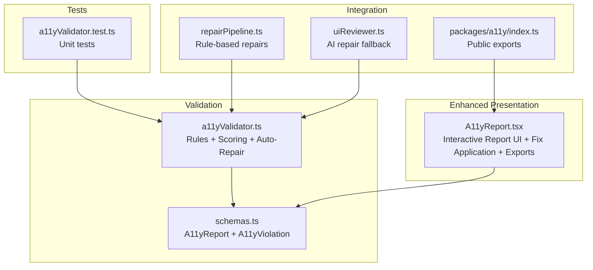
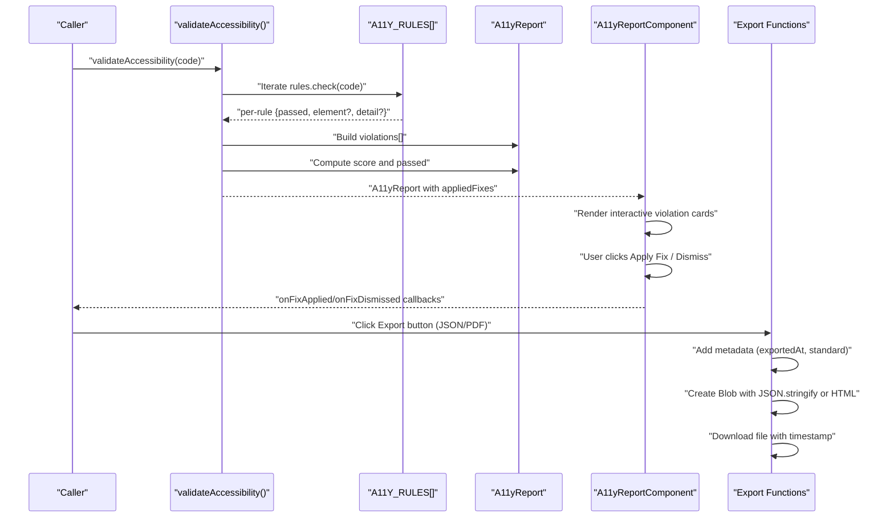
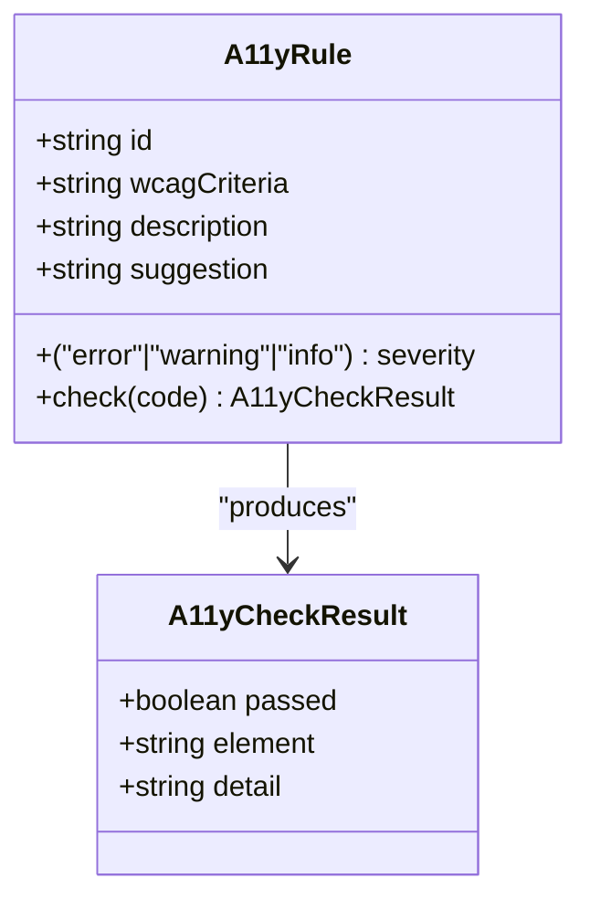
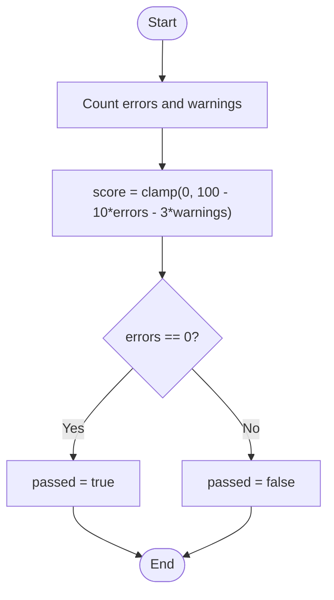
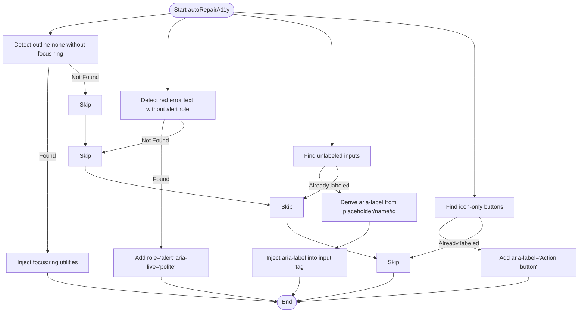
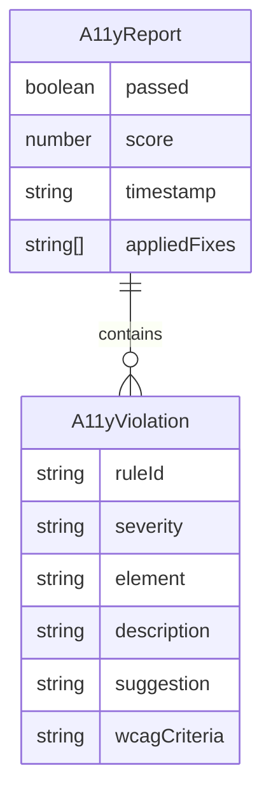
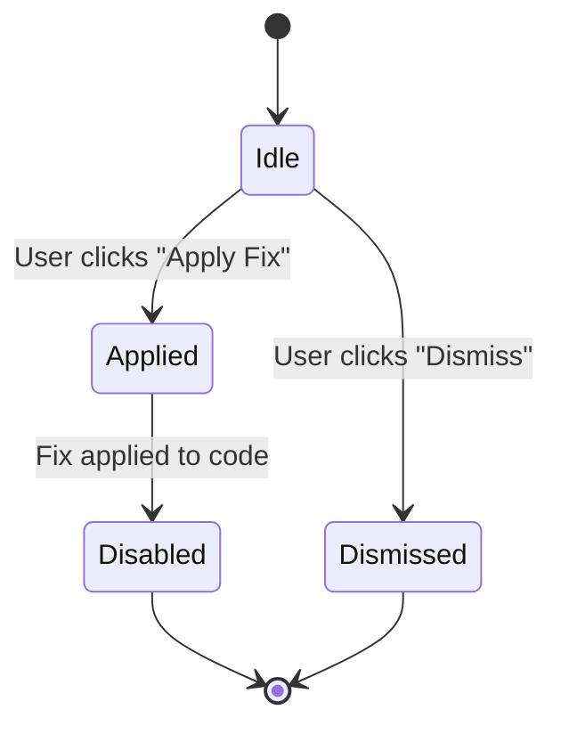
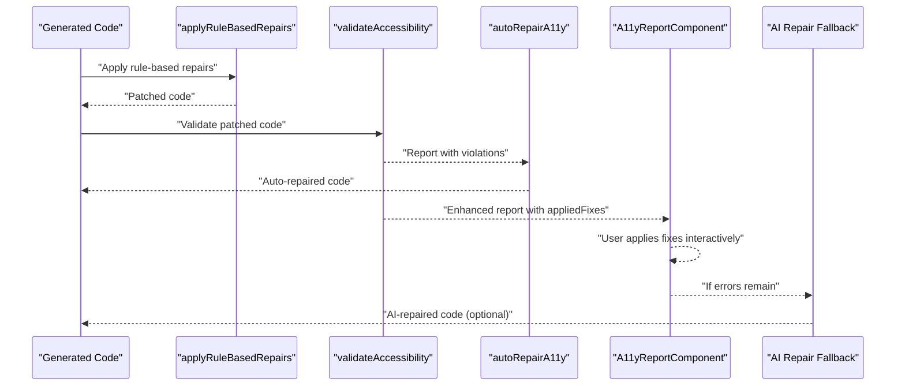
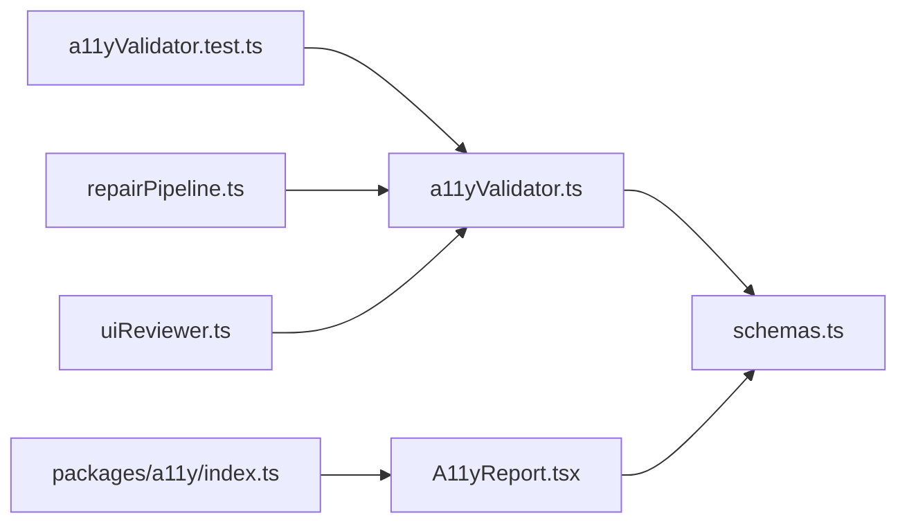

# Accessibility Validation (WCAG 2.1 AA)

<cite>
**Referenced Files in This Document**
- [a11yValidator.ts](file://lib/validation/a11yValidator.ts)
- [schemas.ts](file://lib/validation/schemas.ts)
- [A11yReport.tsx](file://components/A11yReport.tsx)
- [a11yValidator.test.ts](file://__tests__/a11yValidator.test.ts)
- [index.ts](file://packages/a11y/index.ts)
- [repairPipeline.ts](file://lib/intelligence/repairPipeline.ts)
- [uiReviewer.ts](file://lib/ai/uiReviewer.ts)
</cite>

## Update Summary
**Changes Made**
- Enhanced A11yReport component with interactive fix application functionality
- Added PDF export capabilities alongside existing JSON export
- Improved violation card UI with applied fix tracking and interactive controls
- Updated report schema to support appliedFixes metadata
- Enhanced user interaction capabilities for marking violations as fixed or dismissed

## Table of Contents
1. [Introduction](#introduction)
2. [Project Structure](#project-structure)
3. [Core Components](#core-components)
4. [Architecture Overview](#architecture-overview)
5. [Detailed Component Analysis](#detailed-component-analysis)
6. [Dependency Analysis](#dependency-analysis)
7. [Performance Considerations](#performance-considerations)
8. [Troubleshooting Guide](#troubleshooting-guide)
9. [Conclusion](#conclusion)
10. [Appendices](#appendices)

## Introduction
This document describes the WCAG 2.1 AA–compliant accessibility validation system implemented as a rule-based static analyzer for generated TSX code. It documents all 12 accessibility rules, the scoring mechanism, the A11yReport schema, auto-repair capabilities, and the enhanced interactive report interface with fix application functionality. The system now provides users with the ability to directly mark violations as fixed or dismissed from the report interface, along with comprehensive export capabilities for compliance documentation.

## Project Structure
The accessibility validation system spans three main areas:
- Validation engine: rule definitions and scoring logic
- Report renderer: enhanced UI component with interactive fix application and export capabilities
- Tests and integration: unit tests and optional AI-based repair pipeline



**Diagram sources**
- [a11yValidator.ts:1-376](file://lib/validation/a11yValidator.ts#L1-L376)
- [schemas.ts:300-340](file://lib/validation/schemas.ts#L300-L340)
- [A11yReport.tsx:1-334](file://components/A11yReport.tsx#L1-L334)
- [a11yValidator.test.ts:1-110](file://__tests__/a11yValidator.test.ts#L1-L110)
- [repairPipeline.ts:1-286](file://lib/intelligence/repairPipeline.ts#L1-L286)
- [uiReviewer.ts:165-198](file://lib/ai/uiReviewer.ts#L165-L198)
- [index.ts:1-4](file://packages/a11y/index.ts#L1-L4)

**Section sources**
- [a11yValidator.ts:1-376](file://lib/validation/a11yValidator.ts#L1-L376)
- [schemas.ts:300-340](file://lib/validation/schemas.ts#L300-L340)
- [A11yReport.tsx:1-334](file://components/A11yReport.tsx#L1-L334)
- [a11yValidator.test.ts:1-110](file://__tests__/a11yValidator.test.ts#L1-L110)
- [repairPipeline.ts:1-286](file://lib/intelligence/repairPipeline.ts#L1-L286)
- [uiReviewer.ts:165-198](file://lib/ai/uiReviewer.ts#L165-L198)
- [index.ts:1-4](file://packages/a11y/index.ts#L1-L4)

## Core Components
- Rule engine: Defines 12 WCAG 2.1 AA–aligned rules and executes them against TSX code.
- Scoring: Computes a compliance score from severity counts with configurable penalties.
- Auto-repair: Applies targeted, safe transformations to fix common issues.
- Report schema: Structured data model for violations and suggestions with export metadata.
- Enhanced Report UI: Renders the accessibility report with interactive fix application, severity badges, suggestions, fixes, and comprehensive export functionality.

**Section sources**
- [a11yValidator.ts:10-260](file://lib/validation/a11yValidator.ts#L10-L260)
- [a11yValidator.ts:264-297](file://lib/validation/a11yValidator.ts#L264-L297)
- [a11yValidator.ts:303-375](file://lib/validation/a11yValidator.ts#L303-L375)
- [schemas.ts:301-318](file://lib/validation/schemas.ts#L301-L318)
- [A11yReport.tsx:11-95](file://components/A11yReport.tsx#L11-L95)

## Architecture Overview
The validator runs a static analysis pass over TSX code, collecting violations and computing a score. The enhanced report schema ensures consistent serialization with applied fix tracking, while the interactive UI renders severity, suggestions, applied fixes, and provides users with direct control over violation states. The system now supports both JSON and PDF export capabilities for comprehensive accessibility reporting and compliance documentation.



**Diagram sources**
- [a11yValidator.ts:264-297](file://lib/validation/a11yValidator.ts#L264-L297)
- [a11yValidator.ts:19-260](file://lib/validation/a11yValidator.ts#L19-L260)
- [A11yReport.tsx:143-334](file://components/A11yReport.tsx#L143-L334)

## Detailed Component Analysis

### Rule Set Overview
The validator enforces 12 rules aligned with WCAG 2.1 AA criteria. Each rule defines:
- id: Unique rule identifier
- wcagCriteria: WCAG reference
- severity: error | warning | info
- description: Human-readable explanation
- check: Static analysis function returning { passed, element?, detail? }
- suggestion: Remediation guidance



**Diagram sources**
- [a11yValidator.ts:10-17](file://lib/validation/a11yValidator.ts#L10-L17)
- [a11yValidator.ts:25-44](file://lib/validation/a11yValidator.ts#L25-L44)

**Section sources**
- [a11yValidator.ts:19-260](file://lib/validation/a11yValidator.ts#L19-L260)

### Rule Details and Examples

- Input labeling
  - Criteria: WCAG 1.3.1 (Level A)
  - Severity: error
  - Description: All form inputs must have an associated label
  - Example failure: An input with an id but no matching htmlFor and no aria-label
  - Remediation: Add a label with htmlFor pointing to the input id, or add aria-label
  - Scoring impact: Deducts heavily due to severity

- Button accessible name
  - Criteria: WCAG 4.1.2 (Level A)
  - Severity: error
  - Description: Buttons must have accessible names
  - Example failure: An icon-only button with no text and no aria-label
  - Remediation: Add visible text content or aria-label

- Image alt text
  - Criteria: WCAG 1.1.1 (Level A)
  - Severity: error
  - Description: Images must have alternative text
  - Example failure: An img tag without an alt attribute
  - Remediation: Add alt="" for decorative images or alt="Descriptive text" for informative images

- Form labeling
  - Criteria: WCAG 1.3.1 (Level A)
  - Severity: warning
  - Description: Forms should have accessible labels or legends
  - Example failure: A form element with no aria-label or legend
  - Remediation: Add aria-label or wrap fields in fieldset with legend

- Heading hierarchy
  - Criteria: WCAG 1.3.1 (Level A)
  - Severity: warning
  - Description: Headings should follow a logical hierarchy
  - Example failure: Jumping from h1 to h3 without intermediate levels
  - Remediation: Ensure headings increment by one level at a time

- Keyboard accessibility
  - Criteria: WCAG 2.1.1 (Level A)
  - Severity: error
  - Description: Interactive elements must be keyboard accessible
  - Example failure: A div with onClick but no role or tabIndex
  - Remediation: Use native button, or add role="button" and tabIndex

- Error announcements
  - Criteria: WCAG 4.1.3 (Level AA)
  - Severity: info
  - Description: Error messages should be announced to screen readers
  - Example failure: Error text without aria-live or role="alert"
  - Remediation: Add aria-live="polite" or role="alert" to error containers

- Color contrast (tokens)
  - Criteria: WCAG 1.4.3 (Level AA)
  - Severity: warning
  - Description: Text must have sufficient color contrast
  - Example failure: Light gray text on a light background without a dark background class
  - Remediation: Use darker text or ensure a sufficiently dark background class

- Focus indicators
  - Criteria: WCAG 2.4.7 (Level AA)
  - Severity: warning
  - Description: Focused elements must have visible focus indicators
  - Example failure: Using outline-none without a focus ring replacement
  - Remediation: Replace outline-none with a focus ring utility

- Additional rules (warnings/info)
  - Form legend presence
  - Heading hierarchy continuity
  - Low-contrast text on light backgrounds
  - Missing focus ring after removing outline

**Section sources**
- [a11yValidator.ts:19-260](file://lib/validation/a11yValidator.ts#L19-L260)
- [a11yValidator.test.ts:3-108](file://__tests__/a11yValidator.test.ts#L3-L108)

### Scoring System
- Base score: 100
- Penalty: 10 points per error, 3 points per warning
- Minimum score: 0
- passed: true if no errors



**Diagram sources**
- [a11yValidator.ts:281-286](file://lib/validation/a11yValidator.ts#L281-L286)

**Section sources**
- [a11yValidator.ts:281-286](file://lib/validation/a11yValidator.ts#L281-L286)

### Auto-Repair Functionality
The autoRepairA11y function applies safe, automated fixes:
- Adds focus ring utilities to elements using outline-none without a focus ring replacement
- Adds role="alert" and aria-live="polite" to error containers
- Adds aria-label to unlabeled inputs derived from placeholder/name/id
- Adds aria-label to icon-only buttons



**Diagram sources**
- [a11yValidator.ts:303-375](file://lib/validation/a11yValidator.ts#L303-L375)

**Section sources**
- [a11yValidator.ts:303-375](file://lib/validation/a11yValidator.ts#L303-L375)

### Enhanced A11yReport Schema
The report structure ensures consistent serialization and consumption with enhanced metadata:
- passed: boolean
- score: number in [0, 100]
- violations: array of A11yViolation
- suggestions: array of human-readable remediation hints
- timestamp: ISO string
- **New**: appliedFixes: array of strings for auto-applied fixes

A11yViolation fields:
- ruleId: string
- severity: "error" | "warning" | "info"
- element: string identifying the problematic element
- description: string
- suggestion: string
- wcagCriteria: string

**Enhanced** Added appliedFixes metadata for tracking auto-applied repairs

The A11yReport schema now supports applied fix tracking through the appliedFixes array, which contains human-readable descriptions of auto-applied repairs. This provides users with immediate visibility into which accessibility improvements have been automatically implemented.



**Diagram sources**
- [schemas.ts:312-318](file://lib/validation/schemas.ts#L312-L318)
- [schemas.ts:301-308](file://lib/validation/schemas.ts#L301-L308)

**Section sources**
- [schemas.ts:301-318](file://lib/validation/schemas.ts#L301-L318)

### Interactive Report UI Rendering and Export Capabilities
The enhanced A11yReport component provides:
- Compliance score with interactive circular progress indicator
- Severity counts and pass/fail state
- Interactive violation cards with fix application controls
- Applied auto-repairs tracking
- **New**: Interactive fix application functionality
- **New**: PDF export capabilities alongside JSON export
- **New**: Enhanced violation card UI with applied fix tracking

**Enhanced** Added comprehensive interactive fix application and export functionality

The interactive violation card system provides users with direct control over accessibility violations:



The export functionality includes:
- **JSON Export**: Downloads comprehensive accessibility reports with metadata
- **PDF/HTML Export**: Creates printable accessibility reports with styling
- Automatic timestamp generation (`exportedAt` field)
- WCAG standard specification (`standard` field)
- Proper MIME type handling for both formats
- User-friendly filename generation with timestamp
- Safe cleanup of object URLs

**Section sources**
- [A11yReport.tsx:11-95](file://components/A11yReport.tsx#L11-L95)
- [A11yReport.tsx:143-334](file://components/A11yReport.tsx#L143-L334)

### Integration with Repair Pipeline
The system integrates with a broader repair pipeline:
- Rule-based repairs run first to fix common issues
- Optional AI-based repair fallback can address remaining problems
- The validator's auto-repair complements these steps
- **New**: Interactive fix application integrates with the repair pipeline



**Diagram sources**
- [repairPipeline.ts:238-286](file://lib/intelligence/repairPipeline.ts#L238-L286)
- [a11yValidator.ts:264-297](file://lib/validation/a11yValidator.ts#L264-L297)
- [a11yValidator.ts:303-375](file://lib/validation/a11yValidator.ts#L303-L375)
- [uiReviewer.ts:165-198](file://lib/ai/uiReviewer.ts#L165-L198)

**Section sources**
- [repairPipeline.ts:18-229](file://lib/intelligence/repairPipeline.ts#L18-L229)
- [repairPipeline.ts:238-286](file://lib/intelligence/repairPipeline.ts#L238-L286)
- [uiReviewer.ts:165-198](file://lib/ai/uiReviewer.ts#L165-L198)

## Dependency Analysis
- a11yValidator.ts depends on schemas.ts for A11yReport and A11yViolation types.
- A11yReport.tsx consumes schemas.ts and renders the enhanced report UI with interactive fix application and export functionality.
- Tests validate both the validator and auto-repair behavior.
- Public exports include accessibility-related packages.



**Diagram sources**
- [a11yValidator.ts:1-2](file://lib/validation/a11yValidator.ts#L1-L2)
- [schemas.ts:300-340](file://lib/validation/schemas.ts#L300-L340)
- [A11yReport.tsx:1-6](file://components/A11yReport.tsx#L1-L6)
- [a11yValidator.test.ts:1](file://__tests__/a11yValidator.test.ts#L1)
- [repairPipeline.ts:1-286](file://lib/intelligence/repairPipeline.ts#L1-L286)
- [uiReviewer.ts:165-198](file://lib/ai/uiReviewer.ts#L165-L198)
- [index.ts:1-4](file://packages/a11y/index.ts#L1-L4)

**Section sources**
- [a11yValidator.ts:1-2](file://lib/validation/a11yValidator.ts#L1-L2)
- [schemas.ts:300-340](file://lib/validation/schemas.ts#L300-L340)
- [A11yReport.tsx:1-6](file://components/A11yReport.tsx#L1-L6)
- [a11yValidator.test.ts:1](file://__tests__/a11yValidator.test.ts#L1)
- [repairPipeline.ts:1-286](file://lib/intelligence/repairPipeline.ts#L1-L286)
- [uiReviewer.ts:165-198](file://lib/ai/uiReviewer.ts#L165-L198)
- [index.ts:1-4](file://packages/a11y/index.ts#L1-L4)

## Performance Considerations
- Regex-based scanning scales linearly with code length; keep patterns efficient.
- Early exits in rule checks reduce unnecessary work.
- Consider caching or incremental analysis for repeated validations on large codebases.
- **New**: Interactive fix application state management is optimized with local component state.
- **New**: Export operations are lightweight and triggered by user interaction only.

## Troubleshooting Guide
Common issues and resolutions:
- False positives in color contrast detection: Ensure dark background classes are present or dark-mode utilities are used.
- Missing aria-label on buttons: Provide visible text or aria-label.
- Unlabeled inputs: Add matching label or aria-label; autoRepair derives aria-label from placeholder/name/id.
- Focus ring removal: Replace outline-none with a focus ring utility.
- Error message announcements: Add role="alert" or aria-live="polite".
- **New**: Interactive fix application issues: Ensure callback handlers are properly implemented in parent components.
- **New**: Export functionality issues: Ensure browser allows downloads and check console for any security restrictions.
- **New**: PDF export limitations: HTML export creates printable versions suitable for PDF conversion.

Validation and repair verification:
- Unit tests assert rule detection and auto-repair outcomes.
- Repair pipeline applies rule-based repairs and optionally AI-based repairs.
- **New**: Interactive fix application tested through user interaction scenarios.
- **New**: Export functionality tested through user interaction scenarios.

**Section sources**
- [a11yValidator.test.ts:3-108](file://__tests__/a11yValidator.test.ts#L3-L108)
- [a11yValidator.ts:303-375](file://lib/validation/a11yValidator.ts#L303-L375)
- [repairPipeline.ts:238-286](file://lib/intelligence/repairPipeline.ts#L238-L286)
- [uiReviewer.ts:165-198](file://lib/ai/uiReviewer.ts#L165-L198)

## Conclusion
The system provides a robust, rule-based validator for WCAG 2.1 AA–compliant accessibility checks on generated TSX code. It offers actionable reporting, a scoring mechanism, practical auto-repair capabilities, and comprehensive export functionality for compliance documentation. The enhanced interactive report interface enables users to directly manage accessibility violations, improving the development workflow and ensuring higher compliance rates.

## Appendices

### Extending the Rule Set
To add a new rule:
- Define a new A11yRule with id, wcagCriteria, severity, description, check, and suggestion.
- Append it to the A11Y_RULES array.
- Update tests to cover positive and negative cases.
- Consider scoring implications and adjust penalties if needed.

**Section sources**
- [a11yValidator.ts:10-17](file://lib/validation/a11yValidator.ts#L10-L17)
- [a11yValidator.ts:19-260](file://lib/validation/a11yValidator.ts#L19-L260)

### Customizing Validation Thresholds
- Modify scoring penalties in the scoring calculation to reflect project priorities.
- Adjust rule severities to raise or lower the threshold for blocking passes.

**Section sources**
- [a11yValidator.ts:281-286](file://lib/validation/a11yValidator.ts#L281-L286)

### Interactive Fix Application API
**New Section**

The enhanced A11yReport component provides interactive fix application capabilities through the following API:

**Props Interface:**
- `report`: A11yReport with optional `appliedFixes` array
- `onFixApplied`: Callback function `(fixId: string) => void`
- `onFixDismissed`: Callback function `(fixId: string) => void`

**Fix State Management:**
- Violation cards maintain local state: `'idle' | 'applied' | 'dismissed'`
- Applied violations become semi-transparent and show "Fixed" badge
- Dismissed violations are removed from the DOM
- Parent components receive callbacks for state changes

**Usage Pattern:**
```typescript
<A11yReportComponent 
  report={enhancedReport}
  onFixApplied={(ruleId) => handleFixApplied(ruleId)}
  onFixDismissed={(ruleId) => handleFixDismissed(ruleId)}
/>
```

**Section sources**
- [A11yReport.tsx:7-11](file://components/A11yReport.tsx#L7-L11)
- [A11yReport.tsx:69-81](file://components/A11yReport.tsx#L69-L81)

### Export Functionality Specifications
**New Section**

The enhanced A11yReport component provides comprehensive export capabilities:

**JSON Export Features:**
- Downloads complete accessibility reports with metadata
- Includes appliedFixes array when present
- Adds `exportedAt` timestamp field
- Sets `standard` field to "WCAG 2.1 AA"
- Uses `application/json` MIME type
- Filename format: `a11y-report-{timestamp}.json`

**PDF/HTML Export Features:**
- Creates printable accessibility reports
- Includes styling for professional presentation
- Supports WCAG 2.1 AA compliance visualization
- Uses `text/html` MIME type
- Filename format: `a11y-report-{timestamp}.html`
- Contains violation summaries with severity indicators

**Export Workflow Benefits:**
- Audit trail creation for compliance documentation
- Historical tracking of accessibility improvements
- Integration with quality assurance processes
- Automated compliance reporting capabilities
- Professional presentation for stakeholders

**Section sources**
- [A11yReport.tsx:148-163](file://components/A11yReport.tsx#L148-L163)
- [A11yReport.tsx:165-218](file://components/A11yReport.tsx#L165-L218)