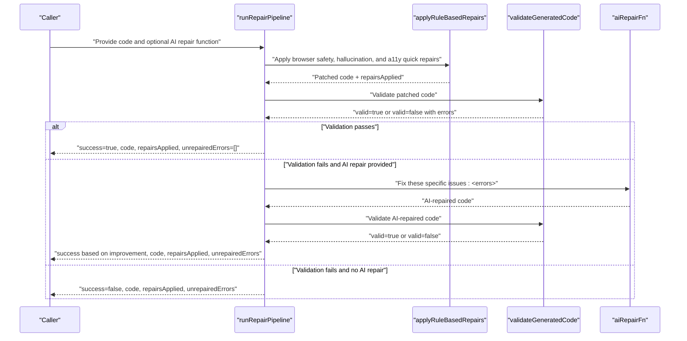
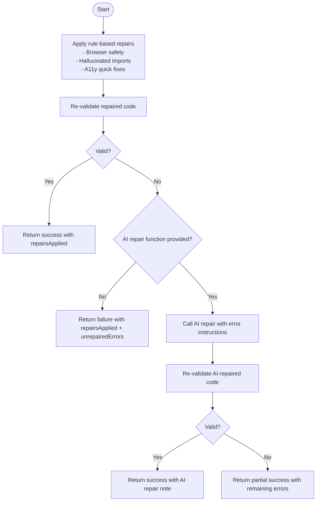
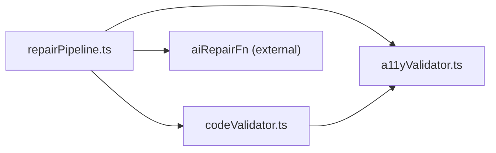

# Auto-Repair System

<cite>
**Referenced Files in This Document**
- [repairPipeline.ts](file://lib/intelligence/repairPipeline.ts)
- [codeValidator.ts](file://lib/intelligence/codeValidator.ts)
- [a11yValidator.ts](file://lib/validation/a11yValidator.ts)
- [security.test.ts](file://__tests__/security.test.ts)
- [encryption.test.ts](file://__tests__/encryption.test.ts)
- [encryption.ts](file://lib/security/encryption.ts)
- [logger.ts](file://lib/logger.ts)
- [RightPanel.tsx](file://components/ide/RightPanel.tsx)
- [tool-call-repair-error.ts](file://node_modules/ai/src/error/tool-call-repair-error.ts)
- [repair-text.ts](file://node_modules/ai/src/generate-object/repair-text.ts)
</cite>

## Table of Contents
1. [Introduction](#introduction)
2. [Project Structure](#project-structure)
3. [Core Components](#core-components)
4. [Architecture Overview](#architecture-overview)
5. [Detailed Component Analysis](#detailed-component-analysis)
6. [Dependency Analysis](#dependency-analysis)
7. [Performance Considerations](#performance-considerations)
8. [Troubleshooting Guide](#troubleshooting-guide)
9. [Conclusion](#conclusion)
10. [Appendices](#appendices)

## Introduction
This document describes the auto-repair system that automatically detects and fixes common accessibility and security issues in generated code. The system applies deterministic, rule-based repairs first, followed by optional AI-assisted repairs when validation fails. It also tracks applied fixes and maintains audit trails for transparency and reproducibility.

## Project Structure
The auto-repair system spans several modules:
- Intelligence pipeline: orchestrates rule-based repairs and optional AI fallback
- Validation: enforces browser safety, structural correctness, and accessibility warnings
- Accessibility: rule-based validator and auto-repair functions
- Security: browser safety validation and sanitization helpers
- Logging: structured logging for auditability
- UI confidence gauge: demonstrates how repair outcomes influence perceived confidence

```mermaid
graph TB
subgraph "Intelligence"
RP["repairPipeline.ts"]
CV["codeValidator.ts"]
end
subgraph "Validation"
A11Y["a11yValidator.ts"]
end
subgraph "Security"
SEC_TEST["security.test.ts"]
ENC["encryption.ts"]
end
subgraph "Logging"
LOG["logger.ts"]
end
subgraph "UI"
UI["RightPanel.tsx"]
end
RP --> CV
RP --> A11Y
CV --> A11Y
SEC_TEST --> ENC
UI --> RP
LOG --> RP
```

**Diagram sources**
- [repairPipeline.ts:1-287](file://lib/intelligence/repairPipeline.ts#L1-L287)
- [codeValidator.ts:1-388](file://lib/intelligence/codeValidator.ts#L1-L388)
- [a11yValidator.ts:1-376](file://lib/validation/a11yValidator.ts#L1-L376)
- [security.test.ts:1-60](file://__tests__/security.test.ts#L1-L60)
- [encryption.ts:71-94](file://lib/security/encryption.ts#L71-L94)
- [logger.ts:1-89](file://lib/logger.ts#L1-L89)
- [RightPanel.tsx:66-252](file://components/ide/RightPanel.tsx#L66-L252)

**Section sources**
- [repairPipeline.ts:1-287](file://lib/intelligence/repairPipeline.ts#L1-L287)
- [codeValidator.ts:1-388](file://lib/intelligence/codeValidator.ts#L1-L388)
- [a11yValidator.ts:1-376](file://lib/validation/a11yValidator.ts#L1-L376)
- [security.test.ts:1-60](file://__tests__/security.test.ts#L1-L60)
- [encryption.ts:71-94](file://lib/security/encryption.ts#L71-L94)
- [logger.ts:1-89](file://lib/logger.ts#L1-L89)
- [RightPanel.tsx:66-252](file://components/ide/RightPanel.tsx#L66-L252)

## Core Components
- Repair pipeline: applies rule-based repairs, re-validates, and optionally calls an AI repair function
- Code validator: detects browser-unsafe imports, structural issues, and accessibility warnings
- Accessibility validator and auto-repair: static analysis and deterministic fixes for common WCAG issues
- Security helpers: tests and encryption utilities supporting secure handling of sensitive data
- Logger: structured logging for request-scoped audit trails
- UI confidence gauge: aggregates deterministic and probabilistic signals to inform perceived confidence

**Section sources**
- [repairPipeline.ts:14-113](file://lib/intelligence/repairPipeline.ts#L14-L113)
- [codeValidator.ts:12-26](file://lib/intelligence/codeValidator.ts#L12-L26)
- [a11yValidator.ts:10-260](file://lib/validation/a11yValidator.ts#L10-L260)
- [security.test.ts:1-60](file://__tests__/security.test.ts#L1-L60)
- [encryption.ts:71-94](file://lib/security/encryption.ts#L71-L94)
- [logger.ts:14-21](file://lib/logger.ts#L14-L21)
- [RightPanel.tsx:218-252](file://components/ide/RightPanel.tsx#L218-L252)

## Architecture Overview
The auto-repair system follows a deterministic-first, AI-fallback strategy:
1. Apply rule-based repairs across categories: browser safety, hallucinated imports, and accessibility quick fixes
2. Re-validate the repaired code
3. If validation fails, optionally call an AI repair function with a concise instruction set derived from validation errors
4. Re-validate again and return a RepairResult with applied fixes and any remaining errors



**Diagram sources**
- [repairPipeline.ts:238-286](file://lib/intelligence/repairPipeline.ts#L238-L286)
- [codeValidator.ts:264-364](file://lib/intelligence/codeValidator.ts#L264-L364)

## Detailed Component Analysis

### Repair Pipeline
The repair pipeline defines three categories of rule-based repairs:
- Browser safety: strips unsafe imports and TTY/process stdout calls
- Hallucinated imports: replaces unavailable libraries with Sandpack-compatible alternatives
- Accessibility quick fixes: adds missing alt attributes and role/tabIndex for clickable divs

It then runs deterministic validation and either returns success or invokes an AI repair function with a concise instruction list derived from validation errors.



**Diagram sources**
- [repairPipeline.ts:18-113](file://lib/intelligence/repairPipeline.ts#L18-L113)
- [repairPipeline.ts:238-286](file://lib/intelligence/repairPipeline.ts#L238-L286)

**Section sources**
- [repairPipeline.ts:14-113](file://lib/intelligence/repairPipeline.ts#L14-L113)
- [repairPipeline.ts:210-229](file://lib/intelligence/repairPipeline.ts#L210-L229)
- [repairPipeline.ts:238-286](file://lib/intelligence/repairPipeline.ts#L238-L286)

### Code Validator
The validator consolidates multiple checks:
- Browser-unsafe patterns (Node.js/Terminal APIs)
- Registry hallucinations (libraries not available in Sandpack)
- Structural checks (exports, JSX presence, balance, import counts)
- Accessibility warnings (WCAG-related heuristics)

It returns a structured result with errors and warnings, enabling the repair pipeline to decide whether AI assistance is needed.

**Section sources**
- [codeValidator.ts:31-47](file://lib/intelligence/codeValidator.ts#L31-L47)
- [codeValidator.ts:53-114](file://lib/intelligence/codeValidator.ts#L53-L114)
- [codeValidator.ts:118-178](file://lib/intelligence/codeValidator.ts#L118-L178)
- [codeValidator.ts:184-257](file://lib/intelligence/codeValidator.ts#L184-L257)
- [codeValidator.ts:264-364](file://lib/intelligence/codeValidator.ts#L264-L364)

### Accessibility Validator and Auto-Repair
The accessibility validator statically checks for WCAG issues and computes a score based on error and warning counts. The auto-repair function applies deterministic fixes such as:
- Adding focus ring replacements for outline-none without focus indicators
- Annotating error containers with role and aria-live
- Supplying aria-labels for unlabeled inputs and icon-only buttons

These repairs are designed to be safe, deterministic, and aligned with WCAG guidelines.

**Section sources**
- [a11yValidator.ts:19-260](file://lib/validation/a11yValidator.ts#L19-L260)
- [a11yValidator.ts:264-297](file://lib/validation/a11yValidator.ts#L264-L297)
- [a11yValidator.ts:303-375](file://lib/validation/a11yValidator.ts#L303-L375)

### Security Helpers and Tests
Security tests validate browser safety checks and sanitization of generated code. They ensure that unsafe Node.js imports, process exit calls, and terminal manipulation are flagged. Sanitization collapses multi-line template literals and normalizes line endings.

**Section sources**
- [security.test.ts:1-60](file://__tests__/security.test.ts#L1-L60)

### Encryption Utilities
Encryption utilities provide secure handling of sensitive keys with startup validation and runtime error handling. Tests demonstrate correct encrypt/decrypt behavior and idempotency guarantees.

**Section sources**
- [encryption.test.ts:1-49](file://__tests__/encryption.test.ts#L1-L49)
- [encryption.ts:71-94](file://lib/security/encryption.ts#L71-L94)

### Logging and Audit Trails
The logger provides structured, request-scoped logging with a stable requestId, timing, and optional error metadata. This supports auditability for repair actions and system diagnostics.

**Section sources**
- [logger.ts:14-21](file://lib/logger.ts#L14-L21)
- [logger.ts:66-85](file://lib/logger.ts#L66-L85)

### Confidence Scoring and Repair Effectiveness
The UI confidence gauge aggregates multiple signals (intent quality, accessibility score, critique score, feedback success rate) into a single confidence metric. While not part of the repair pipeline itself, it demonstrates how deterministic repair outcomes (e.g., higher accessibility scores) improve perceived reliability.

**Section sources**
- [RightPanel.tsx:218-252](file://components/ide/RightPanel.tsx#L218-L252)

## Dependency Analysis
The repair pipeline depends on:
- Code validation for determining whether AI assistance is needed
- Accessibility validation for generating repair instructions and verifying deterministic fixes
- Optional AI repair function for complex or ambiguous issues



**Diagram sources**
- [repairPipeline.ts:5](file://lib/intelligence/repairPipeline.ts#L5)
- [codeValidator.ts:1-10](file://lib/intelligence/codeValidator.ts#L1-L10)
- [a11yValidator.ts:1-2](file://lib/validation/a11yValidator.ts#L1-L2)

**Section sources**
- [repairPipeline.ts:5](file://lib/intelligence/repairPipeline.ts#L5)
- [codeValidator.ts:1-10](file://lib/intelligence/codeValidator.ts#L1-L10)
- [a11yValidator.ts:1-2](file://lib/validation/a11yValidator.ts#L1-L2)

## Performance Considerations
- Rule-based repairs are fast regex/string transformations and should complete in milliseconds
- Re-validation uses lightweight heuristics and regex scans to avoid heavy compilation
- AI fallback introduces latency; callers should provide it conditionally to minimize overhead
- Deterministic accessibility repairs avoid expensive parsing and rely on targeted regex substitutions

[No sources needed since this section provides general guidance]

## Troubleshooting Guide
Common issues and resolutions:
- AI repair failures: The pipeline catches exceptions and returns best-effort results. Review the returned unrepaired errors and consider refining instructions or disabling AI fallback temporarily.
- Environment secrets: Encryption utilities warn at startup if the secret is invalid; ensure the environment variable is set correctly before runtime.
- Validation drift: If validation keeps failing, verify that the AI repair function returns syntactically valid code and that the instruction list is concise and actionable.

**Section sources**
- [repairPipeline.ts:275-278](file://lib/intelligence/repairPipeline.ts#L275-L278)
- [encryption.ts:81-94](file://lib/security/encryption.ts#L81-L94)

## Conclusion
The auto-repair system combines deterministic rule-based fixes with optional AI assistance to improve generated code quality rapidly. It emphasizes safety (browser compatibility), accessibility (WCAG alignment), and maintainability (audit trails). Extending the system involves adding new rule-based repair functions, expanding validation checks, and integrating additional AI repair strategies.

[No sources needed since this section summarizes without analyzing specific files]

## Appendices

### Repair Prioritization and Conflict Resolution
- Priority order within the pipeline: browser safety → hallucinated imports → accessibility quick fixes
- Conflicts are resolved deterministically by applying repairs sequentially and re-validating after each stage
- If multiple issues remain, the AI fallback receives a consolidated instruction list of remaining errors

**Section sources**
- [repairPipeline.ts:214-229](file://lib/intelligence/repairPipeline.ts#L214-L229)
- [repairPipeline.ts:257-278](file://lib/intelligence/repairPipeline.ts#L257-L278)

### Repair Tracking and Audit Trails
- The pipeline logs applied repairs and returns a list of human-readable descriptions
- Structured logging with request IDs enables tracing of repair actions across systems

**Section sources**
- [repairPipeline.ts:10-12](file://lib/intelligence/repairPipeline.ts#L10-L12)
- [repairPipeline.ts:220-228](file://lib/intelligence/repairPipeline.ts#L220-L228)
- [logger.ts:66-85](file://lib/logger.ts#L66-L85)

### Examples of Common Repair Scenarios
- Accessibility violations: Missing alt attributes on images, missing accessible names on buttons, role and tabIndex additions for clickable divs
- Security issues: Removal of unsafe Node.js imports and TTY/process stdout calls
- Code formatting problems: Reordering CSS @import before @tailwind directives, flattening multi-line template literals in JSX

**Section sources**
- [repairPipeline.ts:18-113](file://lib/intelligence/repairPipeline.ts#L18-L113)
- [a11yValidator.ts:184-203](file://lib/validation/a11yValidator.ts#L184-L203)
- [codeValidator.ts:160-168](file://lib/intelligence/codeValidator.ts#L160-L168)

### Repair Confidence Scoring
- Accessibility score is computed from error and warning counts; higher scores indicate fewer violations
- UI confidence gauge aggregates deterministic signals (accessibility score, intent quality) with optional critique and feedback signals

**Section sources**
- [a11yValidator.ts:284-286](file://lib/validation/a11yValidator.ts#L284-L286)
- [RightPanel.tsx:218-252](file://components/ide/RightPanel.tsx#L218-L252)

### Extending Repair Capabilities
- Add new rule-based repair functions to the appropriate category arrays
- Extend validation checks to detect new failure modes and include them in the instruction list for AI repair
- Integrate additional AI repair strategies by implementing the aiRepairFn signature and passing it to the pipeline

**Section sources**
- [repairPipeline.ts:16-113](file://lib/intelligence/repairPipeline.ts#L16-L113)
- [codeValidator.ts:184-257](file://lib/intelligence/codeValidator.ts#L184-L257)
- [repairPipeline.ts:240](file://lib/intelligence/repairPipeline.ts#L240)