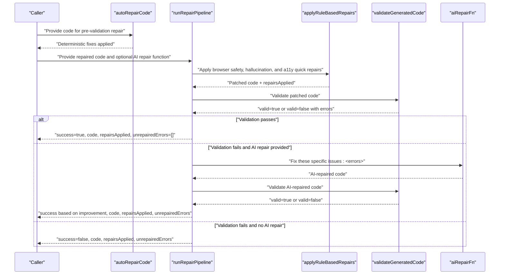
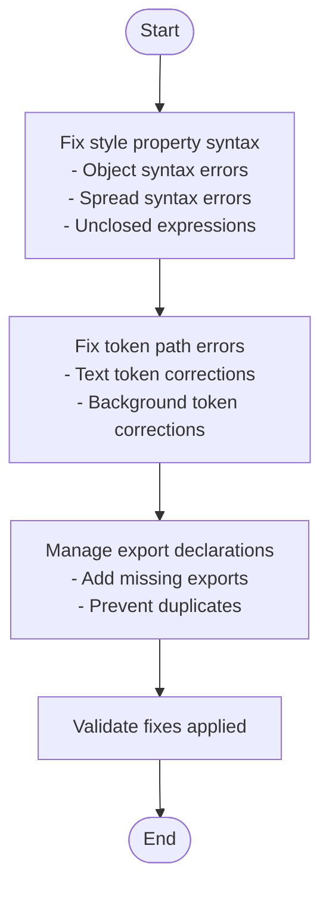
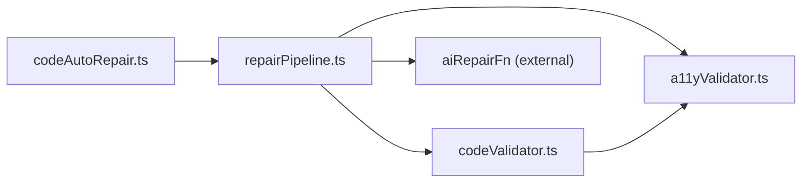

# Auto-Repair System

<cite>
**Referenced Files in This Document**
- [codeAutoRepair.ts](file://lib/intelligence/codeAutoRepair.ts)
- [repairPipeline.ts](file://lib/intelligence/repairPipeline.ts)
- [codeValidator.ts](file://lib/intelligence/codeValidator.ts)
- [a11yValidator.ts](file://lib/validation/a11yValidator.ts)
- [security.test.ts](file://__tests__/security.test.ts)
- [encryption.test.ts](file://__tests__/encryption.test.ts)
- [encryption.ts](file://lib/security/encryption.ts)
- [logger.ts](file://lib/logger.ts)
- [RightPanel.tsx](file://components/ide/RightPanel.tsx)
- [codeAutoRepair.test.ts](file://__tests__/codeAutoRepair.test.ts)
- [tool-call-repair-error.ts](file://node_modules/ai/src/error/tool-call-repair-error.ts)
- [repair-text.ts](file://node_modules/ai/src/generate-object/repair-text.ts)
</cite>

## Update Summary
**Changes Made**
- Added comprehensive documentation for the new codeAutoRepair system that operates as a pre-validation step
- Enhanced repair pipeline documentation to include the new deterministic fixes for style properties, token paths, and missing exports
- Updated architecture diagrams to show the dual-layer repair system
- Added detailed examples of common repair scenarios including style syntax errors and token path corrections
- Expanded troubleshooting guide with new repair categories

## Table of Contents
1. [Introduction](#introduction)
2. [Project Structure](#project-structure)
3. [Core Components](#core-components)
4. [Architecture Overview](#architecture-overview)
5. [Detailed Component Analysis](#detailed-component-analysis)
6. [Dependency Analysis](#dependency-analysis)
7. [Performance Considerations](#performance-considerations)
8. [Troubleshooting Guide](#troubleshooting-guide)
9. [Conclusion](#conclusion)
10. [Appendices](#appendices)

## Introduction
This document describes the comprehensive auto-repair system that automatically detects and fixes common accessibility and security issues in generated code. The system now operates as a dual-layer approach: a pre-validation step that handles deterministic fixes for common AI-generated code mistakes, followed by a comprehensive repair pipeline that addresses browser safety, hallucinated imports, and accessibility issues. The system applies deterministic, regex-based repairs first, followed by optional AI-assisted repairs when validation fails. It also tracks applied fixes and maintains audit trails for transparency and reproducibility.

## Project Structure
The auto-repair system spans several modules with a hierarchical structure:
- Pre-validation auto-repair: handles style property syntax errors, token path corrections, and missing export declarations
- Intelligence pipeline: orchestrates rule-based repairs and optional AI fallback
- Validation: enforces browser safety, structural correctness, and accessibility warnings
- Accessibility: rule-based validator and auto-repair functions
- Security: browser safety validation and sanitization helpers
- Logging: structured logging for auditability
- UI confidence gauge: demonstrates how repair outcomes influence perceived confidence

```mermaid
graph TB
subgraph "Pre-Validation Auto-Repair"
CAR["codeAutoRepair.ts"]
CARTEST["codeAutoRepair.test.ts"]
end
subgraph "Intelligence Pipeline"
RP["repairPipeline.ts"]
CV["codeValidator.ts"]
end
subgraph "Validation"
A11Y["a11yValidator.ts"]
end
subgraph "Security"
SEC_TEST["security.test.ts"]
ENC["encryption.ts"]
end
subgraph "Logging"
LOG["logger.ts"]
end
subgraph "UI"
UI["RightPanel.tsx"]
end
CAR --> CARTEST
RP --> CV
RP --> A11Y
CV --> A11Y
SEC_TEST --> ENC
UI --> RP
LOG --> RP
```

**Diagram sources**
- [codeAutoRepair.ts:1-107](file://lib/intelligence/codeAutoRepair.ts#L1-L107)
- [codeAutoRepair.test.ts:1-108](file://__tests__/codeAutoRepair.test.ts#L1-L108)
- [repairPipeline.ts:1-287](file://lib/intelligence/repairPipeline.ts#L1-L287)
- [codeValidator.ts:1-386](file://lib/intelligence/codeValidator.ts#L1-L386)
- [a11yValidator.ts:1-376](file://lib/validation/a11yValidator.ts#L1-L376)
- [security.test.ts:1-60](file://__tests__/security.test.ts#L1-L60)
- [encryption.ts:71-94](file://lib/security/encryption.ts#L71-L94)
- [logger.ts:1-89](file://lib/logger.ts#L1-L89)
- [RightPanel.tsx:66-252](file://components/ide/RightPanel.tsx#L66-L252)

**Section sources**
- [codeAutoRepair.ts:1-107](file://lib/intelligence/codeAutoRepair.ts#L1-L107)
- [codeAutoRepair.test.ts:1-108](file://__tests__/codeAutoRepair.test.ts#L1-L108)
- [repairPipeline.ts:1-287](file://lib/intelligence/repairPipeline.ts#L1-L287)
- [codeValidator.ts:1-386](file://lib/intelligence/codeValidator.ts#L1-L386)
- [a11yValidator.ts:1-376](file://lib/validation/a11yValidator.ts#L1-L376)
- [security.test.ts:1-60](file://__tests__/security.test.ts#L1-L60)
- [encryption.ts:71-94](file://lib/security/encryption.ts#L71-L94)
- [logger.ts:1-89](file://lib/logger.ts#L1-L89)
- [RightPanel.tsx:66-252](file://components/ide/RightPanel.tsx#L66-L252)

## Core Components
- **Pre-validation auto-repair**: Handles style property syntax errors, token path corrections, missing export declarations, and basic JSX syntax fixes
- **Repair pipeline**: Applies rule-based repairs across browser safety, hallucinated imports, and accessibility quick fixes
- **Code validator**: Detects browser-unsafe imports, structural issues, and accessibility warnings
- **Accessibility validator and auto-repair**: Static analysis and deterministic fixes for common WCAG issues
- **Security helpers**: Tests and encryption utilities supporting secure handling of sensitive data
- **Logger**: Structured logging for request-scoped audit trails
- **UI confidence gauge**: Aggregates deterministic and probabilistic signals to inform perceived confidence

**Section sources**
- [codeAutoRepair.ts:1-107](file://lib/intelligence/codeAutoRepair.ts#L1-L107)
- [repairPipeline.ts:14-113](file://lib/intelligence/repairPipeline.ts#L14-L113)
- [codeValidator.ts:12-26](file://lib/intelligence/codeValidator.ts#L12-L26)
- [a11yValidator.ts:10-260](file://lib/validation/a11yValidator.ts#L10-L260)
- [security.test.ts:1-60](file://__tests__/security.test.ts#L1-L60)
- [encryption.ts:71-94](file://lib/security/encryption.ts#L71-L94)
- [logger.ts:14-21](file://lib/logger.ts#L14-L21)
- [RightPanel.tsx:218-252](file://components/ide/RightPanel.tsx#L218-L252)

## Architecture Overview
The auto-repair system follows a dual-layer deterministic-first, AI-fallback strategy:
1. **Pre-validation auto-repair**: Apply deterministic fixes for common AI-generated code mistakes including style property syntax errors, incorrect token path usage, and missing export declarations
2. **Rule-based repairs**: Apply browser safety, hallucinated imports, and accessibility quick fixes
3. **Re-validate the repaired code**
4. **AI repair fallback**: If validation fails, optionally call an AI repair function with a concise instruction set derived from validation errors
5. **Final validation**: Re-validate again and return a RepairResult with applied fixes and any remaining errors



**Diagram sources**
- [codeAutoRepair.ts:25-93](file://lib/intelligence/codeAutoRepair.ts#L25-L93)
- [repairPipeline.ts:238-286](file://lib/intelligence/repairPipeline.ts#L238-L286)
- [codeValidator.ts:264-364](file://lib/intelligence/codeValidator.ts#L264-L364)

## Detailed Component Analysis

### Pre-Validation Auto-Repair System
The pre-validation auto-repair system operates as the first step in the generation pipeline, handling deterministic fixes for common AI-generated code mistakes:

**Style Property Fixes**:
- Converts invalid style syntax: `style= color: "red"` → `style={{color: "red"}}`
- Handles spread syntax without braces: `style= ...text.h1, lineHeight: 1.2` → `style={{ ...text.h1, lineHeight: 1.2 }}`
- Fixes unclosed JSX expressions: `style={{ color: 'red'` → `style={{color: 'red'}}`

**Token Path Corrections**:
- Fixes incorrect token paths: `colors.text.primary.fg` → `colors.text.primary`
- Handles background token corrections: `colors.text.primary.bg` → `colors.text.primary`

**Export Declaration Management**:
- Adds missing export default statements when components are detected
- Preserves existing exports and avoids duplicates

**Basic JSX Syntax Fixes**:
- Closes unclosed JSX expressions
- Basic tag validation and correction



**Diagram sources**
- [codeAutoRepair.ts:29-93](file://lib/intelligence/codeAutoRepair.ts#L29-L93)

**Section sources**
- [codeAutoRepair.ts:1-107](file://lib/intelligence/codeAutoRepair.ts#L1-L107)
- [codeAutoRepair.test.ts:8-107](file://__tests__/codeAutoRepair.test.ts#L8-L107)

### Repair Pipeline
The repair pipeline defines three categories of rule-based repairs:
- **Browser safety**: strips unsafe imports and TTY/process stdout calls
- **Hallucinated imports**: replaces unavailable libraries with Sandpack-compatible alternatives
- **Accessibility quick fixes**: adds missing alt attributes and role/tabIndex for clickable divs

It then runs deterministic validation and either returns success or invokes an AI repair function with a concise instruction list derived from validation errors.


**Diagram sources**
- [repairPipeline.ts:18-113](file://lib/intelligence/repairPipeline.ts#L18-L113)
- [repairPipeline.ts:238-286](file://lib/intelligence/repairPipeline.ts#L238-L286)

**Section sources**
- [repairPipeline.ts:14-113](file://lib/intelligence/repairPipeline.ts#L14-L113)
- [repairPipeline.ts:210-229](file://lib/intelligence/repairPipeline.ts#L210-L229)
- [repairPipeline.ts:238-286](file://lib/intelligence/repairPipeline.ts#L238-L286)

### Code Validator
The validator consolidates multiple checks:
- **Browser-unsafe patterns** (Node.js/Terminal APIs)
- **Registry hallucinations** (libraries not available in Sandpack)
- **Structural checks** (exports, JSX presence, balance, import counts)
- **Accessibility warnings** (WCAG-related heuristics)

It returns a structured result with errors and warnings, enabling the repair pipeline to decide whether AI assistance is needed.

**Section sources**
- [codeValidator.ts:31-47](file://lib/intelligence/codeValidator.ts#L31-L47)
- [codeValidator.ts:53-114](file://lib/intelligence/codeValidator.ts#L53-L114)
- [codeValidator.ts:118-178](file://lib/intelligence/codeValidator.ts#L118-L178)
- [codeValidator.ts:184-257](file://lib/intelligence/codeValidator.ts#L184-L257)
- [codeValidator.ts:264-364](file://lib/intelligence/codeValidator.ts#L264-L364)

### Accessibility Validator and Auto-Repair
The accessibility validator statically checks for WCAG issues and computes a score based on error and warning counts. The auto-repair function applies deterministic fixes such as:
- Adding focus ring replacements for outline-none without focus indicators
- Annotating error containers with role and aria-live
- Supplying aria-labels for unlabeled inputs and icon-only buttons

These repairs are designed to be safe, deterministic, and aligned with WCAG guidelines.

**Section sources**
- [a11yValidator.ts:19-260](file://lib/validation/a11yValidator.ts#L19-L260)
- [a11yValidator.ts:264-297](file://lib/validation/a11yValidator.ts#L264-L297)
- [a11yValidator.ts:303-375](file://lib/validation/a11yValidator.ts#L303-L375)

### Security Helpers and Tests
Security tests validate browser safety checks and sanitization of generated code. They ensure that unsafe Node.js imports, process exit calls, and terminal manipulation are flagged. Sanitization collapses multi-line template literals and normalizes line endings.

**Section sources**
- [security.test.ts:1-60](file://__tests__/security.test.ts#L1-L60)

### Encryption Utilities
Encryption utilities provide secure handling of sensitive keys with startup validation and runtime error handling. Tests demonstrate correct encrypt/decrypt behavior and idempotency guarantees.

**Section sources**
- [encryption.test.ts:1-49](file://__tests__/encryption.test.ts#L1-L49)
- [encryption.ts:71-94](file://lib/security/encryption.ts#L71-L94)

### Logging and Audit Trails
The logger provides structured, request-scoped logging with a stable requestId, timing, and optional error metadata. This supports auditability for repair actions and system diagnostics.

**Section sources**
- [logger.ts:14-21](file://lib/logger.ts#L14-L21)
- [logger.ts:66-85](file://lib/logger.ts#L66-L85)

### Confidence Scoring and Repair Effectiveness
The UI confidence gauge aggregates multiple signals (intent quality, accessibility score, critique score, feedback success rate) into a single confidence metric. While not part of the repair pipeline itself, it demonstrates how deterministic repair outcomes (e.g., higher accessibility scores) improve perceived reliability.

**Section sources**
- [RightPanel.tsx:218-252](file://components/ide/RightPanel.tsx#L218-L252)

## Dependency Analysis
The auto-repair system has a hierarchical dependency structure:
- **Pre-validation auto-repair** operates independently and serves as the first line of defense
- **Repair pipeline** depends on code validation for determining whether AI assistance is needed
- **Accessibility validation** for generating repair instructions and verifying deterministic fixes
- **Optional AI repair function** for complex or ambiguous issues



**Diagram sources**
- [codeAutoRepair.ts:1](file://lib/intelligence/codeAutoRepair.ts#L1)
- [repairPipeline.ts:5](file://lib/intelligence/repairPipeline.ts#L5)
- [codeValidator.ts:1-10](file://lib/intelligence/codeValidator.ts#L1-L10)
- [a11yValidator.ts:1-2](file://lib/validation/a11yValidator.ts#L1-L2)

**Section sources**
- [codeAutoRepair.ts:1](file://lib/intelligence/codeAutoRepair.ts#L1)
- [repairPipeline.ts:5](file://lib/intelligence/repairPipeline.ts#L5)
- [codeValidator.ts:1-10](file://lib/intelligence/codeValidator.ts#L1-L10)
- [a11yValidator.ts:1-2](file://lib/validation/a11yValidator.ts#L1-L2)

## Performance Considerations
- **Pre-validation auto-repair** uses fast regex/string transformations and completes in milliseconds
- **Rule-based repairs** are fast regex/string transformations and should complete in milliseconds
- **Re-validation** uses lightweight heuristics and regex scans to avoid heavy compilation
- **AI fallback** introduces latency; callers should provide it conditionally to minimize overhead
- **Deterministic accessibility repairs** avoid expensive parsing and rely on targeted regex substitutions

## Troubleshooting Guide
Common issues and resolutions:
- **AI repair failures**: The pipeline catches exceptions and returns best-effort results. Review the returned unrepaired errors and consider refining instructions or disabling AI fallback temporarily.
- **Environment secrets**: Encryption utilities warn at startup if the secret is invalid; ensure the environment variable is set correctly before runtime.
- **Validation drift**: If validation keeps failing, verify that the AI repair function returns syntactically valid code and that the instruction list is concise and actionable.
- **Pre-validation auto-repair edge cases**: The system may not catch all style syntax errors; manual review is recommended for complex cases.
- **Export declaration conflicts**: The system prevents duplicate exports but may not handle all edge cases; verify export statements manually when conflicts arise.

**Section sources**
- [repairPipeline.ts:275-278](file://lib/intelligence/repairPipeline.ts#L275-L278)
- [encryption.ts:81-94](file://lib/security/encryption.ts#L81-L94)

## Conclusion
The auto-repair system combines a comprehensive pre-validation step with deterministic rule-based fixes and optional AI assistance to improve generated code quality rapidly. The dual-layer approach ensures that common AI-generated code mistakes are caught early, while the repair pipeline handles browser safety, accessibility, and structural issues. It emphasizes safety (browser compatibility), accessibility (WCAG alignment), and maintainability (audit trails). Extending the system involves adding new rule-based repair functions, expanding validation checks, and integrating additional AI repair strategies.

## Appendices

### Repair Prioritization and Conflict Resolution
- **Pre-validation auto-repair priority**: Style property syntax → Token path corrections → Export declarations → Basic JSX fixes
- **Pipeline priority order**: Browser safety → hallucinated imports → accessibility quick fixes
- **Conflict resolution**: Repairs are applied sequentially with re-validation after each stage
- **Multi-issue handling**: If multiple issues remain, the AI fallback receives a consolidated instruction list of remaining errors

**Section sources**
- [codeAutoRepair.ts:29-93](file://lib/intelligence/codeAutoRepair.ts#L29-L93)
- [repairPipeline.ts:214-229](file://lib/intelligence/repairPipeline.ts#L214-L229)
- [repairPipeline.ts:257-278](file://lib/intelligence/repairPipeline.ts#L257-L278)

### Repair Tracking and Audit Trails
- **Pre-validation auto-repair**: Logs specific fixes applied with detailed descriptions
- **Pipeline**: Logs applied repairs and returns a list of human-readable descriptions
- **Structured logging** with request IDs enables tracing of repair actions across systems

**Section sources**
- [codeAutoRepair.ts:25-93](file://lib/intelligence/codeAutoRepair.ts#L25-L93)
- [repairPipeline.ts:10-12](file://lib/intelligence/repairPipeline.ts#L10-L12)
- [repairPipeline.ts:220-228](file://lib/intelligence/repairPipeline.ts#L220-L228)
- [logger.ts:66-85](file://lib/logger.ts#L66-L85)

### Examples of Common Repair Scenarios
**Pre-Validation Auto-Repair Scenarios**:
- **Style property syntax errors**: `style= color: "red"` → `style={{color: "red"}}`
- **Spread syntax errors**: `style= ...text.h1, lineHeight: 1.2` → `style={{ ...text.h1, lineHeight: 1.2 }}`
- **Token path corrections**: `colors.text.primary.fg` → `colors.text.primary`
- **Missing export declarations**: Automatic addition of `export default ComponentName`

**Pipeline Repair Scenarios**:
- **Accessibility violations**: Missing alt attributes on images, missing accessible names on buttons, role and tabIndex additions for clickable divs
- **Security issues**: Removal of unsafe Node.js imports and TTY/process stdout calls
- **Code formatting problems**: Reordering CSS @import before @tailwind directives, flattening multi-line template literals in JSX

**Section sources**
- [codeAutoRepair.test.ts:8-107](file://__tests__/codeAutoRepair.test.ts#L8-L107)
- [repairPipeline.ts:18-113](file://lib/intelligence/repairPipeline.ts#L18-L113)
- [a11yValidator.ts:184-203](file://lib/validation/a11yValidator.ts#L184-L203)
- [codeValidator.ts:160-168](file://lib/intelligence/codeValidator.ts#L160-L168)

### Repair Confidence Scoring
- **Accessibility score** is computed from error and warning counts; higher scores indicate fewer violations
- **UI confidence gauge** aggregates deterministic signals (accessibility score, intent quality) with optional critique and feedback signals
- **Pre-validation auto-repair effectiveness** contributes to overall confidence by catching common syntax errors early

**Section sources**
- [a11yValidator.ts:284-286](file://lib/validation/a11yValidator.ts#L284-L286)
- [RightPanel.tsx:218-252](file://components/ide/RightPanel.tsx#L218-L252)

### Extending Repair Capabilities
**Pre-Validation Auto-Repair Extensions**:
- Add new regex patterns for style property syntax corrections
- Extend token path validation for new design system tokens
- Implement additional export declaration detection logic

**Pipeline Extensions**:
- Add new rule-based repair functions to the appropriate category arrays
- Extend validation checks to detect new failure modes and include them in the instruction list for AI repair
- Integrate additional AI repair strategies by implementing the aiRepairFn signature and passing it to the pipeline

**Section sources**
- [codeAutoRepair.ts:29-93](file://lib/intelligence/codeAutoRepair.ts#L29-L93)
- [repairPipeline.ts:16-113](file://lib/intelligence/repairPipeline.ts#L16-L113)
- [codeValidator.ts:184-257](file://lib/intelligence/codeValidator.ts#L184-L257)
- [repairPipeline.ts:240](file://lib/intelligence/repairPipeline.ts#L240)