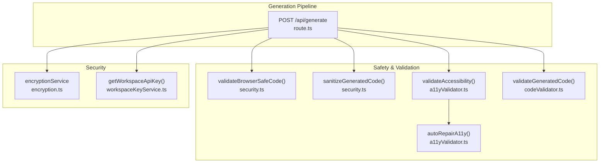
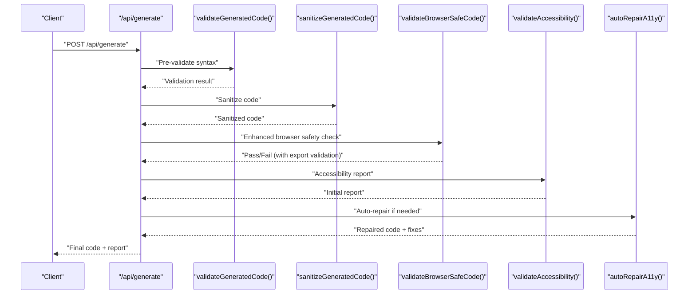
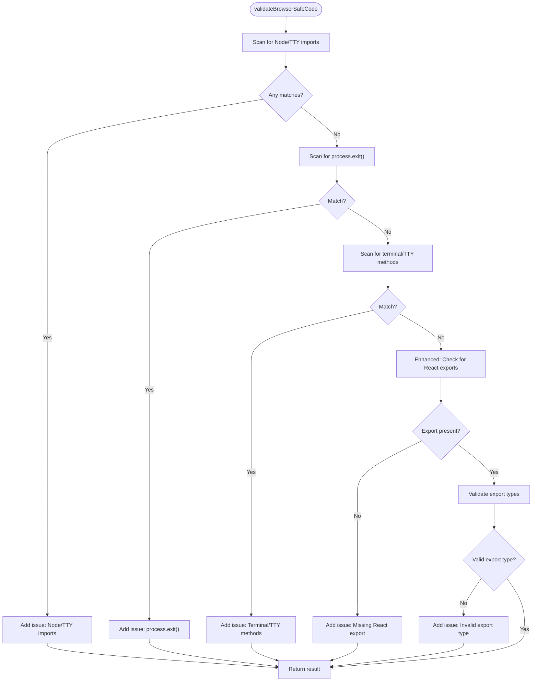
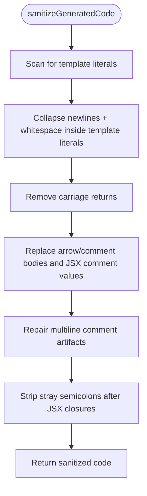
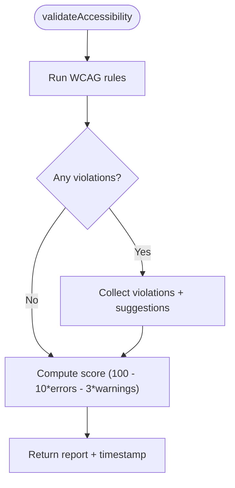
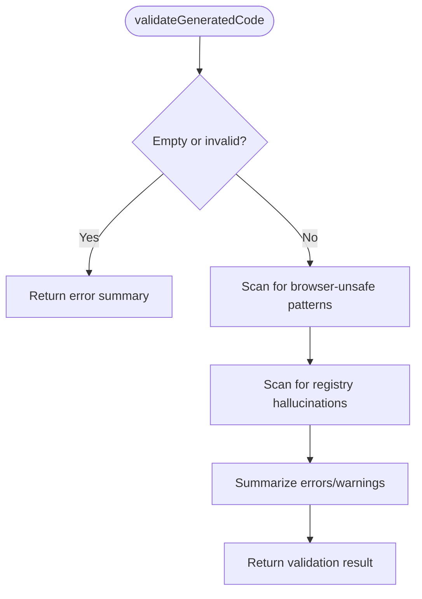
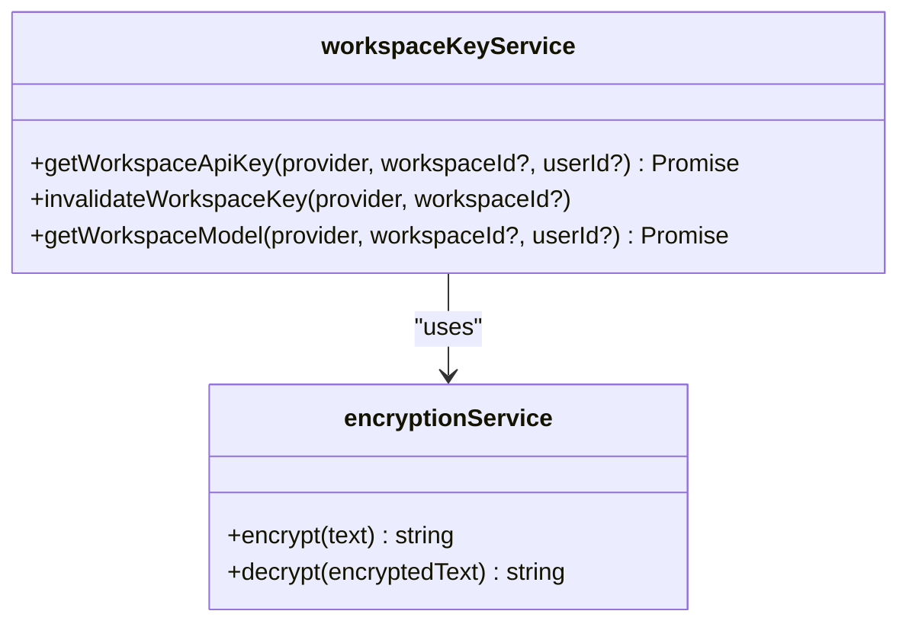
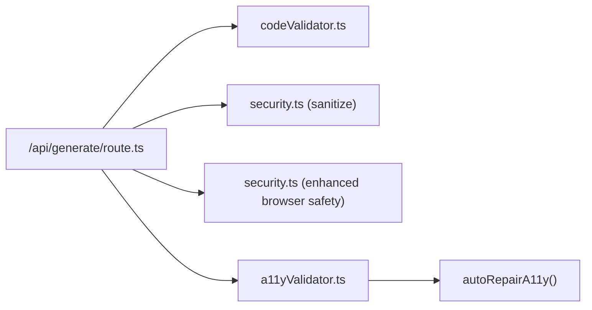

# Browser Safety Validation

<cite>
**Referenced Files in This Document**
- [security.ts](file://lib/validation/security.ts)
- [security.test.ts](file://__tests__/security.test.ts)
- [a11yValidator.ts](file://lib/validation/a11yValidator.ts)
- [codeValidator.ts](file://lib/intelligence/codeValidator.ts)
- [route.ts](file://app/api/generate/route.ts)
- [encryption.ts](file://lib/security/encryption.ts)
- [workspaceKeyService.ts](file://lib/security/workspaceKeyService.ts)
</cite>

## Update Summary
**Changes Made**
- Enhanced React component export validation in browser safety checks
- Strengthened validation rules for proper React component exports
- Updated browser safety validation to address previous failures due to missing export declarations
- Improved integration with the generation pipeline for stricter quality gates

## Table of Contents
1. [Introduction](#introduction)
2. [Project Structure](#project-structure)
3. [Core Components](#core-components)
4. [Architecture Overview](#architecture-overview)
5. [Detailed Component Analysis](#detailed-component-analysis)
6. [Dependency Analysis](#dependency-analysis)
7. [Performance Considerations](#performance-considerations)
8. [Troubleshooting Guide](#troubleshooting-guide)
9. [Conclusion](#conclusion)

## Introduction
This document describes the browser safety validation system that ensures generated UI code is safe for execution in web browsers. The system has been recently enhanced with stricter validation rules for AI-generated code export requirements, specifically targeting React component exports to address previous browser safety check failures due to missing export declarations. It covers:
- Security scanning algorithms that detect unsafe patterns and constructs
- Input validation and sanitization processes that prepare generated code for preview and execution
- Accessibility validation aligned with WCAG criteria
- Integration with the generation pipeline and how safety violations act as quality gates
- Guidance on configuring policies and extending validation rules

## Project Structure
The safety validation spans several modules:
- Validation and sanitization of generated code for browser compatibility
- Accessibility validation against WCAG 2.1 AA criteria
- Deterministic syntax and registry hallucination checks
- Encryption and workspace key management for secure storage of secrets
- Integration within the generation pipeline to gate unsafe outputs

**Diagram sources**
- [route.ts:264-273](file://app/api/generate/route.ts#L264-L273)
- [security.ts:6-34](file://lib/validation/security.ts#L6-L34)
- [security.ts:44-128](file://lib/validation/security.ts#L44-L128)
- [a11yValidator.ts:264-297](file://lib/validation/a11yValidator.ts#L264-L297)
- [a11yValidator.ts:303-375](file://lib/validation/a11yValidator.ts#L303-L375)
- [codeValidator.ts:264-291](file://lib/intelligence/codeValidator.ts#L264-L291)
- [encryption.ts:27-69](file://lib/security/encryption.ts#L27-L69)
- [workspaceKeyService.ts:32-95](file://lib/security/workspaceKeyService.ts#L32-L95)

**Section sources**
- [route.ts:200-387](file://app/api/generate/route.ts#L200-L387)
- [security.ts:1-129](file://lib/validation/security.ts#L1-L129)
- [a11yValidator.ts:1-376](file://lib/validation/a11yValidator.ts#L1-L376)
- [codeValidator.ts:1-386](file://lib/intelligence/codeValidator.ts#L1-L386)
- [encryption.ts:1-95](file://lib/security/encryption.ts#L1-L95)
- [workspaceKeyService.ts:1-138](file://lib/security/workspaceKeyService.ts#L1-L138)

## Core Components
- Browser safety validator: detects Node.js/TTY imports, disallowed process APIs, and missing React exports with enhanced validation rules.
- Code sanitizer: flattens multi-line template literals, removes carriage returns, and cleans AI artifacts that break parsers.
- Accessibility validator: enforces WCAG 2.1 AA rules (labels, roles, focus, contrast, headings, interactive elements).
- Deterministic syntax validator: catches structural and registry hallucinations before expensive review steps.
- Encryption and workspace key service: securely stores and retrieves provider API keys per workspace.

**Section sources**
- [security.ts:6-34](file://lib/validation/security.ts#L6-L34)
- [security.ts:44-128](file://lib/validation/security.ts#L44-L128)
- [a11yValidator.ts:19-260](file://lib/validation/a11yValidator.ts#L19-L260)
- [codeValidator.ts:28-386](file://lib/intelligence/codeValidator.ts#L28-L386)
- [encryption.ts:27-69](file://lib/security/encryption.ts#L27-L69)
- [workspaceKeyService.ts:32-95](file://lib/security/workspaceKeyService.ts#L32-L95)

## Architecture Overview
The generation pipeline applies deterministic checks first, then sanitizes code, validates browser safety with enhanced export validation, and finally runs accessibility checks with optional auto-repairs. Failures at any stage act as quality gates, with particular emphasis on React component export compliance.

**Diagram sources**
- [route.ts:264-273](file://app/api/generate/route.ts#L264-L273)
- [codeValidator.ts:264-291](file://lib/intelligence/codeValidator.ts#L264-L291)
- [security.ts:44-128](file://lib/validation/security.ts#L44-L128)
- [security.ts:6-34](file://lib/validation/security.ts#L6-L34)
- [a11yValidator.ts:264-297](file://lib/validation/a11yValidator.ts#L264-L297)
- [a11yValidator.ts:303-375](file://lib/validation/a11yValidator.ts#L303-L375)

## Detailed Component Analysis

### Browser Safety Validator
**Updated** Enhanced with stricter React component export validation to address previous browser safety check failures due to missing export declarations.

Purpose:
- Block code containing Node.js standard library imports, TTY/console utilities, process exits, and missing React exports.
- Act as a quality gate to prevent unsafe code from reaching previews.
- Ensure generated React components have proper export declarations for browser compatibility.

Detection logic:
- Imports and requires for Node-only modules are flagged.
- Disallows process.exit and terminal/TTY manipulation.
- **Enhanced**: Ensures presence of React exports for valid components with stricter validation rules.

**Diagram sources**
- [security.ts:6-34](file://lib/validation/security.ts#L6-L34)

**Section sources**
- [security.ts:6-34](file://lib/validation/security.ts#L6-L34)
- [security.test.ts:26-31](file://__tests__/security.test.ts#L26-L31)

### Enhanced React Export Validation
**New Section** The browser safety validation now includes stricter checks for proper React component exports to address previous failures.

The enhanced validation ensures that generated React components have valid export declarations:

- **Default exports**: `export default function Component()` or `export default Component`
- **Named exports**: `export const Component = () => ...` or `export function Component()`
- **Function exports**: `export function Component()` for functional components

This addresses common issues where AI-generated code lacks proper export declarations, causing browser safety validation failures and preventing components from rendering correctly in the preview environment.

**Section sources**
- [security.ts:25-28](file://lib/validation/security.ts#L25-L28)
- [security.test.ts:26-31](file://__tests__/security.test.ts#L26-L31)

### Code Sanitizer
Purpose:
- Normalize generated code to avoid parser errors in Sandpack/Babel.
- Clean AI artifacts that cause syntax errors.

Techniques:
- Flatten multi-line template literals inside JSX attribute expressions.
- Remove carriage returns.
- Replace problematic AI-generated comment artifacts with valid syntax.
- Repair multiline comment artifacts and stray semicolons after JSX attribute closures.

**Diagram sources**
- [security.ts:44-128](file://lib/validation/security.ts#L44-L128)

**Section sources**
- [security.ts:44-128](file://lib/validation/security.ts#L44-L128)
- [security.test.ts:40-58](file://__tests__/security.test.ts#L40-L58)

### Accessibility Validator (WCAG 2.1 AA)
Purpose:
- Static analysis of generated TSX to enforce WCAG 2.1 AA rules.
- Produce a scored report and actionable suggestions.

Rules include:
- Form inputs require labels or accessible names.
- Buttons must have accessible names.
- Images require alt text.
- Forms should have legends or accessible labels.
- Headings must follow logical hierarchy.
- Interactive elements must be keyboard accessible.
- Error messages should be announced to assistive technologies.
- Color contrast must meet AA thresholds on appropriate backgrounds.
- Focus indicators must be visible when outline-none is used.

Auto-repair capabilities:
- Adds focus rings for elements using outline-none without replacements.
- Adds role="alert" and aria-live="polite" to error containers.
- Adds aria-label to unlabeled inputs derived from placeholder/name/id.
- Adds aria-label to icon-only buttons.

**Diagram sources**
- [a11yValidator.ts:264-297](file://lib/validation/a11yValidator.ts#L264-L297)

**Section sources**
- [a11yValidator.ts:19-260](file://lib/validation/a11yValidator.ts#L19-L260)
- [a11yValidator.ts:303-375](file://lib/validation/a11yValidator.ts#L303-L375)

### Deterministic Syntax Validator
Purpose:
- Catch structural and hallucination issues early to reduce downstream costs.
- Prevent unsafe or invalid code from entering expensive review loops.

Checks include:
- Browser-unsafe patterns (Node/TTY APIs).
- Registry hallucinations (e.g., unsafe third-party libraries).
- Additional A11y-related warnings.

**Diagram sources**
- [codeValidator.ts:264-291](file://lib/intelligence/codeValidator.ts#L264-L291)

**Section sources**
- [codeValidator.ts:28-386](file://lib/intelligence/codeValidator.ts#L28-L386)

### Encryption and Workspace Key Management
Purpose:
- Securely store and retrieve provider API keys per workspace.
- Cache decrypted keys to minimize database lookups.

Key features:
- Supports base64 or raw 32-byte keys; falls back to a SHA-256-derived key if missing.
- Caches keys with TTL to reduce latency.
- Provides global fallback for pipeline routes when no workspace context is available.

**Diagram sources**
- [encryption.ts:27-69](file://lib/security/encryption.ts#L27-L69)
- [workspaceKeyService.ts:32-95](file://lib/security/workspaceKeyService.ts#L32-L95)

**Section sources**
- [encryption.ts:1-95](file://lib/security/encryption.ts#L1-L95)
- [workspaceKeyService.ts:1-138](file://lib/security/workspaceKeyService.ts#L1-L138)

## Dependency Analysis
The generation pipeline orchestrates safety checks in a specific order to maximize throughput while ensuring safety. The enhanced browser safety validation now includes stricter React export checks as a critical quality gate.

**Diagram sources**
- [route.ts:264-273](file://app/api/generate/route.ts#L264-L273)
- [codeValidator.ts:264-291](file://lib/intelligence/codeValidator.ts#L264-L291)
- [security.ts:44-128](file://lib/validation/security.ts#L44-L128)
- [security.ts:6-34](file://lib/validation/security.ts#L6-L34)
- [a11yValidator.ts:264-297](file://lib/validation/a11yValidator.ts#L264-L297)
- [a11yValidator.ts:303-375](file://lib/validation/a11yValidator.ts#L303-L375)

**Section sources**
- [route.ts:200-387](file://app/api/generate/route.ts#L200-L387)

## Performance Considerations
- Early deterministic checks reduce the need for expensive reviewer calls.
- Sanitization avoids parser failures that could trigger retries or crashes.
- Accessibility auto-repair reduces manual intervention and re-runs.
- Caching of decrypted workspace keys minimizes database overhead.
- **Enhanced**: The stricter React export validation adds minimal overhead while significantly improving code quality.

## Troubleshooting Guide
Common safety issues and resolutions:
- Node.js standard library imports: Remove or replace with browser-compatible alternatives.
- process.exit(): Replace with graceful UI state updates or error boundaries.
- Terminal/TTY methods: Remove or guard behind feature detection.
- **Enhanced**: Missing React exports: Ensure a default or named export for a valid component. Common patterns:
  - `export default function MyComponent() { ... }`
  - `export const MyComponent = () => { ... }`
  - `export function MyComponent() { ... }`
- Multi-line template literals in JSX: Allowed after sanitization; ensure no stray semicolons after JSX attribute closures.
- AI comment artifacts: Automatically cleaned by sanitizer; verify final code parses.

Integration points:
- The pipeline returns structured safety issues and aborts with a 422 status when browser safety fails.
- **Enhanced**: The browser safety validation now specifically targets React export issues as a critical failure condition.
- Accessibility reports include suggestions and a scored compliance level.
- Deterministic validation failures trigger an automatic repair step before expensive review.

**Section sources**
- [security.test.ts:26-31](file://__tests__/security.test.ts#L26-L31)
- [route.ts:264-273](file://app/api/generate/route.ts#L264-L273)
- [a11yValidator.ts:264-297](file://lib/validation/a11yValidator.ts#L264-L297)

## Conclusion
The browser safety validation system provides layered protections with enhanced React export validation:
- Deterministic syntax and hallucination checks
- **Enhanced**: Browser safety validation with stricter React component export requirements
- Code sanitization
- WCAG-aligned accessibility validation with auto-repair

The recent enhancement addresses previous browser safety check failures by implementing stricter validation rules for AI-generated code export requirements. These components integrate tightly into the generation pipeline, acting as quality gates that prevent unsafe or inaccessible code from being returned to clients. The system is designed to be extensible: new browser safety rules, accessibility rules, and sanitization strategies can be added to the existing modular architecture while maintaining the enhanced export validation standards.