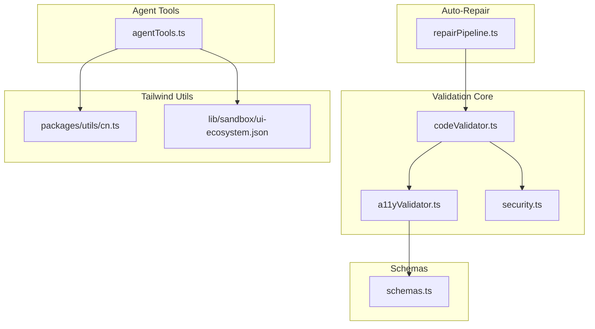
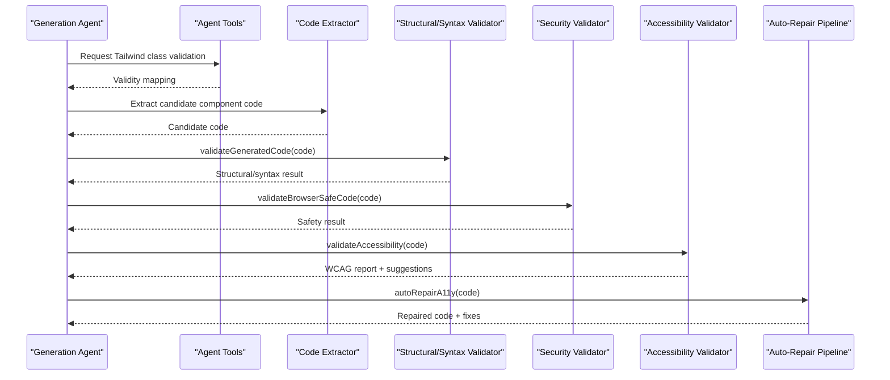
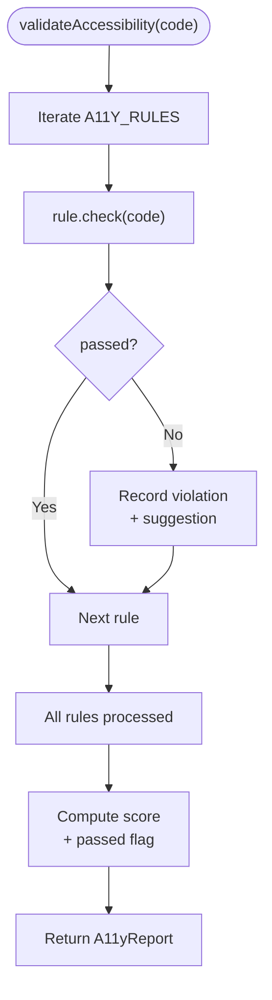
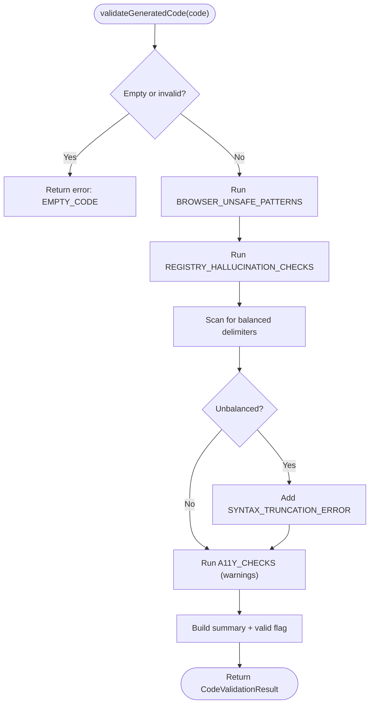
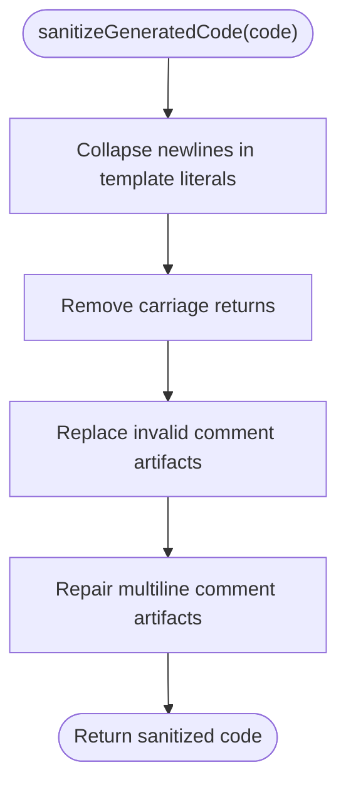
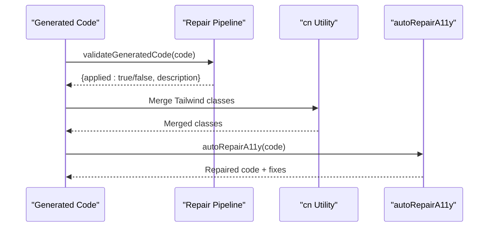
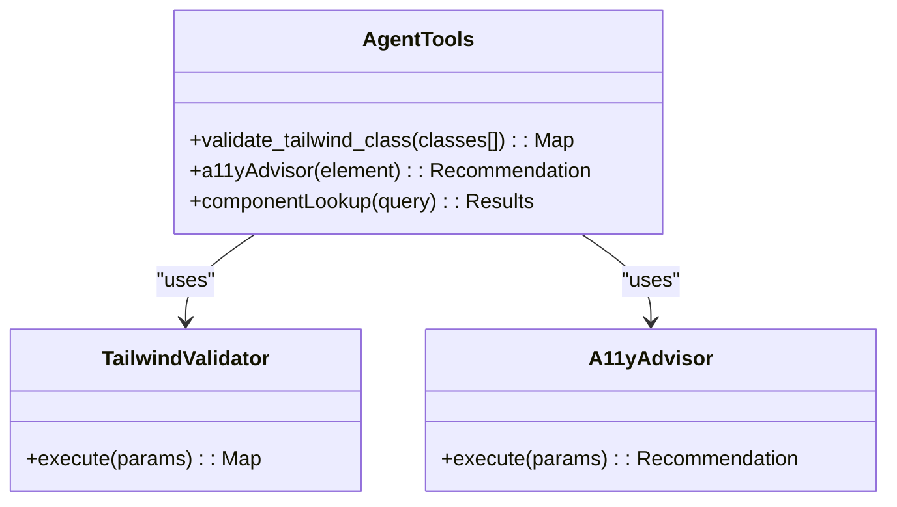
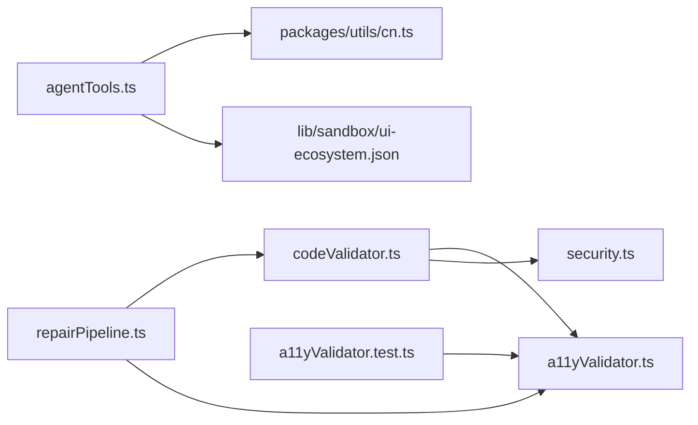

# Code Quality & Syntax Validation

<cite>
**Referenced Files in This Document**
- [a11yValidator.ts](file://lib/validation/a11yValidator.ts)
- [schemas.ts](file://lib/validation/schemas.ts)
- [security.ts](file://lib/validation/security.ts)
- [a11yValidator.test.ts](file://__tests__/a11yValidator.test.ts)
- [codeValidator.ts](file://lib/intelligence/codeValidator.ts)
- [repairPipeline.ts](file://lib/intelligence/repairPipeline.ts)
- [codeExtractor.ts](file://lib/ai/codeExtractor.ts)
- [agentTools.ts](file://lib/ai/agentTools.ts)
- [cn.ts](file://packages/utils/cn.ts)
- [ui-ecosystem.json](file://lib/sandbox/ui-ecosystem.json)
</cite>

## Table of Contents
1. [Introduction](#introduction)
2. [Project Structure](#project-structure)
3. [Core Components](#core-components)
4. [Architecture Overview](#architecture-overview)
5. [Detailed Component Analysis](#detailed-component-analysis)
6. [Dependency Analysis](#dependency-analysis)
7. [Performance Considerations](#performance-considerations)
8. [Troubleshooting Guide](#troubleshooting-guide)
9. [Conclusion](#conclusion)
10. [Appendices](#appendices)

## Introduction
This document describes the code quality and syntax validation system that ensures generated React components meet structural, syntactic, and accessibility requirements. It covers deterministic validation rules for React component structure, TypeScript compatibility, Tailwind CSS usage patterns, and component composition standards. It also explains syntax-checking algorithms for JSX, prop types, and lifecycle requirements, along with semantic validation for logical consistency in component relationships and data flow. Guidance is included on integrating with the auto-repair system and customizing validation rules to maintain code standards.

## Project Structure
The validation system spans several modules:
- Accessibility validation: rule-based checker and auto-repair for WCAG-compliant components
- Structural and syntax validation: checks for React exports, JSX presence, balanced syntax, and safety
- Security validation: browser-safe code checks and sanitization for Sandpack compatibility
- Tailwind utilities and ecosystem integration: class merging and ecosystem metadata
- Agent tools: runtime Tailwind class validation and accessibility advisor for generation agents

**Diagram sources**
- [a11yValidator.ts:1-376](file://lib/validation/a11yValidator.ts#L1-L376)
- [security.ts:1-129](file://lib/validation/security.ts#L1-L129)
- [codeValidator.ts:118-387](file://lib/intelligence/codeValidator.ts#L118-L387)
- [schemas.ts:1-340](file://lib/validation/schemas.ts#L1-L340)
- [repairPipeline.ts:54-87](file://lib/intelligence/repairPipeline.ts#L54-L87)
- [agentTools.ts:69-173](file://lib/ai/agentTools.ts#L69-L173)
- [cn.ts:1-10](file://packages/utils/cn.ts#L1-L10)
- [ui-ecosystem.json:47-49](file://lib/sandbox/ui-ecosystem.json#L47-L49)

**Section sources**
- [a11yValidator.ts:1-376](file://lib/validation/a11yValidator.ts#L1-L376)
- [security.ts:1-129](file://lib/validation/security.ts#L1-L129)
- [codeValidator.ts:118-387](file://lib/intelligence/codeValidator.ts#L118-L387)
- [schemas.ts:1-340](file://lib/validation/schemas.ts#L1-L340)
- [repairPipeline.ts:54-87](file://lib/intelligence/repairPipeline.ts#L54-L87)
- [agentTools.ts:69-173](file://lib/ai/agentTools.ts#L69-L173)
- [cn.ts:1-10](file://packages/utils/cn.ts#L1-L10)
- [ui-ecosystem.json:47-49](file://lib/sandbox/ui-ecosystem.json#L47-L49)

## Core Components
- Accessibility validator: rule-based checker and scoring for WCAG criteria, plus auto-repair for common issues
- Structural and syntax validator: checks for React exports, JSX presence, balanced syntax, and safety patterns
- Security validator: detects unsafe Node.js APIs and sanitizes generated code for Sandpack
- Tailwind utilities: class merging and ecosystem metadata for consistent styling
- Agent tools: runtime Tailwind class validation and accessibility advisor for generation agents

**Section sources**
- [a11yValidator.ts:10-297](file://lib/validation/a11yValidator.ts#L10-L297)
- [codeValidator.ts:118-387](file://lib/intelligence/codeValidator.ts#L118-L387)
- [security.ts:6-128](file://lib/validation/security.ts#L6-L128)
- [cn.ts:1-10](file://packages/utils/cn.ts#L1-L10)
- [agentTools.ts:69-173](file://lib/ai/agentTools.ts#L69-L173)

## Architecture Overview
The validation pipeline integrates multiple layers:
- Pre-generation agent tools validate Tailwind classes and provide accessibility guidance
- Generated code undergoes structural and syntax checks
- Security checks ensure browser compatibility
- Accessibility validation runs with scoring and suggestions
- Auto-repair applies deterministic fixes for common issues

**Diagram sources**
- [agentTools.ts:69-173](file://lib/ai/agentTools.ts#L69-L173)
- [codeExtractor.ts:271-279](file://lib/ai/codeExtractor.ts#L271-L279)
- [codeValidator.ts:264-387](file://lib/intelligence/codeValidator.ts#L264-L387)
- [security.ts:6-34](file://lib/validation/security.ts#L6-L34)
- [a11yValidator.ts:264-297](file://lib/validation/a11yValidator.ts#L264-L297)
- [repairPipeline.ts:54-87](file://lib/intelligence/repairPipeline.ts#L54-L87)

## Detailed Component Analysis

### Accessibility Validator
Deterministic WCAG-based rules statically analyze generated TSX code strings. Each rule defines:
- Identifier and WCAG criteria
- Severity level
- Description and suggestion
- A check function that scans code and reports violations
- Scoring and report generation

Key rules include:
- Form inputs require labels or accessible names
- Buttons must have accessible names
- Images require alt text
- Forms should have labels or legends
- Headings must follow logical hierarchy
- Interactive elements must be keyboard accessible
- Color contrast rules for text on light backgrounds
- Focus visibility indicators

Auto-repair capabilities:
- Adds focus ring replacements for outline-none
- Adds role="alert" and aria-live="polite" to error containers
- Adds aria-label to unlabeled inputs derived from placeholder/name/id
- Adds aria-label to icon-only buttons

**Diagram sources**
- [a11yValidator.ts:264-297](file://lib/validation/a11yValidator.ts#L264-L297)

**Section sources**
- [a11yValidator.ts:10-297](file://lib/validation/a11yValidator.ts#L10-L297)
- [a11yValidator.test.ts:1-110](file://__tests__/a11yValidator.test.ts#L1-L110)

### Structural and Syntax Validator
Checks for:
- Presence of a default export required by Sandpack
- Return statements and JSX rendering
- Minimum code length to avoid truncation
- Balanced JSX tags and enclosing delimiters
- Unrecognized external libraries and registry hallucinations
- Syntax truncation errors

Multi-file validation aggregates results per file and produces a consolidated summary.

**Diagram sources**
- [codeValidator.ts:264-387](file://lib/intelligence/codeValidator.ts#L264-L387)

**Section sources**
- [codeValidator.ts:118-387](file://lib/intelligence/codeValidator.ts#L118-L387)
- [codeExtractor.ts:271-279](file://lib/ai/codeExtractor.ts#L271-L279)

### Security Validator
Ensures generated code is safe for the browser sandbox:
- Blocks Node.js standard library imports and requires
- Prohibits process.exit and terminal/TTY manipulation
- Validates presence of a valid React export
- Sanitizes multi-line template literals and removes artifacts that break the parser

Sanitization strategies:
- Collapse newlines inside JSX template literals
- Strip carriage returns
- Replace invalid comment-only arrow function bodies and attribute values
- Repair multiline comment artifacts and stray semicolons

**Diagram sources**
- [security.ts:44-128](file://lib/validation/security.ts#L44-L128)

**Section sources**
- [security.ts:6-128](file://lib/validation/security.ts#L6-L128)

### Auto-Repair Pipeline
Deterministic repairs address common structural and stylistic issues:
- Adds missing default export if a named component exists
- Reorders CSS @import before @tailwind directives
- Applies Tailwind class merging via cn utility
- Integrates with accessibility auto-repair

**Diagram sources**
- [repairPipeline.ts:54-87](file://lib/intelligence/repairPipeline.ts#L54-L87)
- [cn.ts:1-10](file://packages/utils/cn.ts#L1-L10)
- [a11yValidator.ts:303-375](file://lib/validation/a11yValidator.ts#L303-L375)

**Section sources**
- [repairPipeline.ts:54-87](file://lib/intelligence/repairPipeline.ts#L54-L87)
- [cn.ts:1-10](file://packages/utils/cn.ts#L1-L10)
- [a11yValidator.ts:303-375](file://lib/validation/a11yValidator.ts#L303-L375)

### Agent Tools for Tailwind and Accessibility
Agent tools provide runtime validation and guidance:
- Tailwind class validator: checks validity of classes before writing JSX
- Accessibility advisor: provides WCAG guidance during generation
- Component lookup: helps agents discover existing components

**Diagram sources**
- [agentTools.ts:69-173](file://lib/ai/agentTools.ts#L69-L173)

**Section sources**
- [agentTools.ts:69-173](file://lib/ai/agentTools.ts#L69-L173)

## Dependency Analysis
The validation system exhibits layered dependencies:
- Agent tools depend on Tailwind utilities and ecosystem metadata
- Structural validator depends on accessibility rules and security patterns
- Auto-repair pipeline depends on structural and accessibility validations
- Tests validate accessibility rules and repair outcomes

**Diagram sources**
- [agentTools.ts:69-173](file://lib/ai/agentTools.ts#L69-L173)
- [cn.ts:1-10](file://packages/utils/cn.ts#L1-L10)
- [ui-ecosystem.json:47-49](file://lib/sandbox/ui-ecosystem.json#L47-L49)
- [codeValidator.ts:264-387](file://lib/intelligence/codeValidator.ts#L264-L387)
- [a11yValidator.ts:264-297](file://lib/validation/a11yValidator.ts#L264-L297)
- [security.ts:6-34](file://lib/validation/security.ts#L6-L34)
- [repairPipeline.ts:54-87](file://lib/intelligence/repairPipeline.ts#L54-L87)
- [a11yValidator.test.ts:1-110](file://__tests__/a11yValidator.test.ts#L1-L110)

**Section sources**
- [agentTools.ts:69-173](file://lib/ai/agentTools.ts#L69-L173)
- [codeValidator.ts:264-387](file://lib/intelligence/codeValidator.ts#L264-L387)
- [a11yValidator.ts:264-297](file://lib/validation/a11yValidator.ts#L264-L297)
- [repairPipeline.ts:54-87](file://lib/intelligence/repairPipeline.ts#L54-L87)
- [a11yValidator.test.ts:1-110](file://__tests__/a11yValidator.test.ts#L1-L110)

## Performance Considerations
- Regex-based scanning is efficient for rule checks but should avoid excessive backtracking; keep patterns minimal and anchored
- Auto-repair operations are linear in code length; batching repairs reduces repeated scans
- Zod schema validation adds overhead; cache validated intents and reuse where appropriate
- Tailwind class merging via cn is lightweight but should avoid excessive recomputation

## Troubleshooting Guide
Common validation failures and fixes:
- Missing export default: Add a default export for the main component
  - Reference: [codeValidator.ts:118-124](file://lib/intelligence/codeValidator.ts#L118-L124)
- No JSX detected: Ensure the component renders JSX elements
  - Reference: [codeValidator.ts:138-142](file://lib/intelligence/codeValidator.ts#L138-L142)
- Unbalanced JSX/brackets: Fix unclosed tags or mismatched delimiters
  - Reference: [codeValidator.ts:343-349](file://lib/intelligence/codeValidator.ts#L343-L349)
- Unsafe Node.js APIs: Remove imports/usage of fs, path, child_process, etc.
  - Reference: [security.ts:9-23](file://lib/validation/security.ts#L9-L23)
- Multi-line template literals causing parse errors: Sanitize via provided sanitizer
  - Reference: [security.ts:44-128](file://lib/validation/security.ts#L44-L128)
- Low contrast text on light backgrounds: Use darker text or add dark background classes
  - Reference: [a11yValidator.ts:178-232](file://lib/validation/a11yValidator.ts#L178-L232)
- Missing aria-label on buttons/inputs: Add accessible names or labels
  - Reference: [a11yValidator.ts:25-46](file://lib/validation/a11yValidator.ts#L25-L46), [a11yValidator.ts:52-74](file://lib/validation/a11yValidator.ts#L52-L74)

Integration with auto-repair:
- Accessibility auto-repair adds focus rings, role="alert", aria-labels, and labels
  - Reference: [a11yValidator.ts:303-375](file://lib/validation/a11yValidator.ts#L303-L375)
- Structural auto-repair adds missing default export and reorders CSS directives
  - Reference: [repairPipeline.ts:54-87](file://lib/intelligence/repairPipeline.ts#L54-L87)

Customizing validation rules:
- Extend A11Y_RULES with new rules and suggestions
  - Reference: [a11yValidator.ts:19-260](file://lib/validation/a11yValidator.ts#L19-L260)
- Add new structural checks to STRUCTURAL_CHECKS
  - Reference: [codeValidator.ts:118-153](file://lib/intelligence/codeValidator.ts#L118-L153)
- Integrate new agent tools for additional guidance
  - Reference: [agentTools.ts:167-173](file://lib/ai/agentTools.ts#L167-L173)

**Section sources**
- [codeValidator.ts:118-387](file://lib/intelligence/codeValidator.ts#L118-L387)
- [security.ts:6-128](file://lib/validation/security.ts#L6-L128)
- [a11yValidator.ts:19-375](file://lib/validation/a11yValidator.ts#L19-L375)
- [repairPipeline.ts:54-87](file://lib/intelligence/repairPipeline.ts#L54-L87)
- [agentTools.ts:69-173](file://lib/ai/agentTools.ts#L69-L173)

## Conclusion
The validation system enforces deterministic, WCAG-aligned, and browser-safe React component generation. It combines structural, syntax, security, and accessibility checks with an auto-repair pipeline to maintain high code quality and reduce manual remediation. Extensible rule sets and agent tools enable customization and continuous improvement of code standards.

## Appendices
- Schema definitions for intents and validation reports support consistent parsing and reporting
  - Reference: [schemas.ts:150-340](file://lib/validation/schemas.ts#L150-L340)

**Section sources**
- [schemas.ts:150-340](file://lib/validation/schemas.ts#L150-L340)