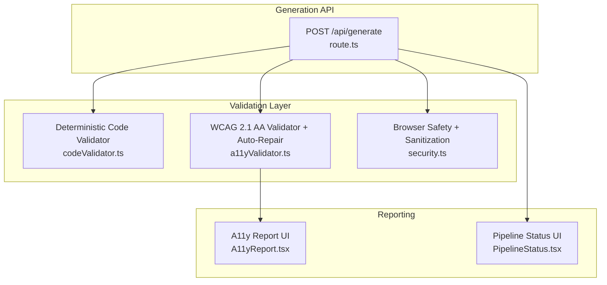
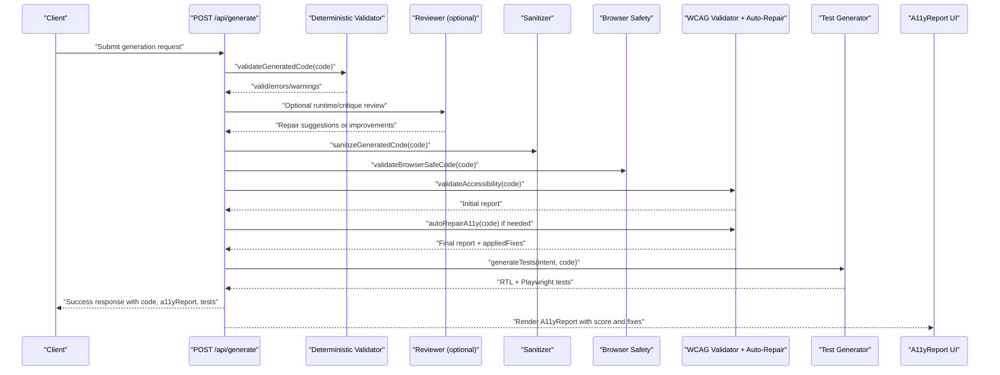
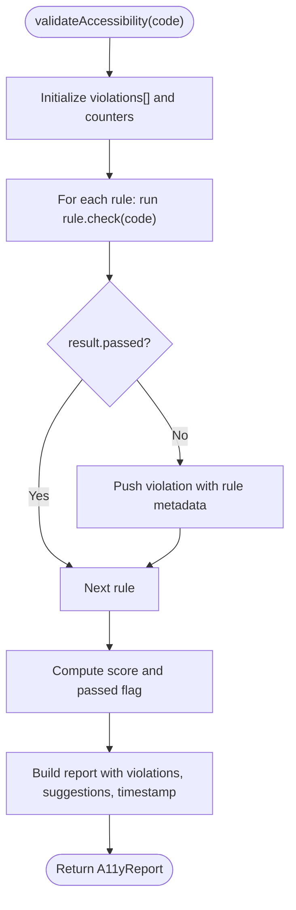
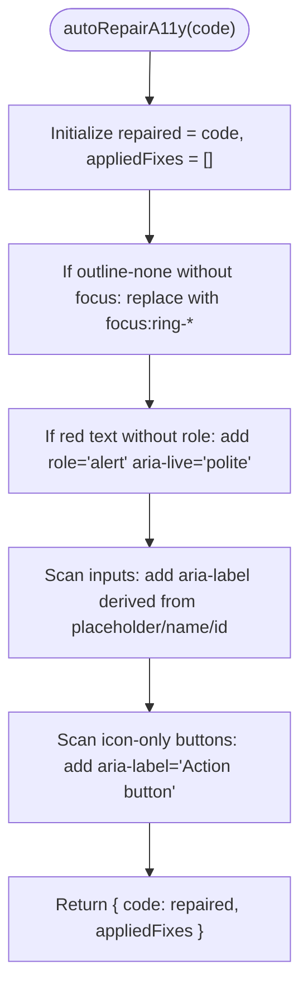
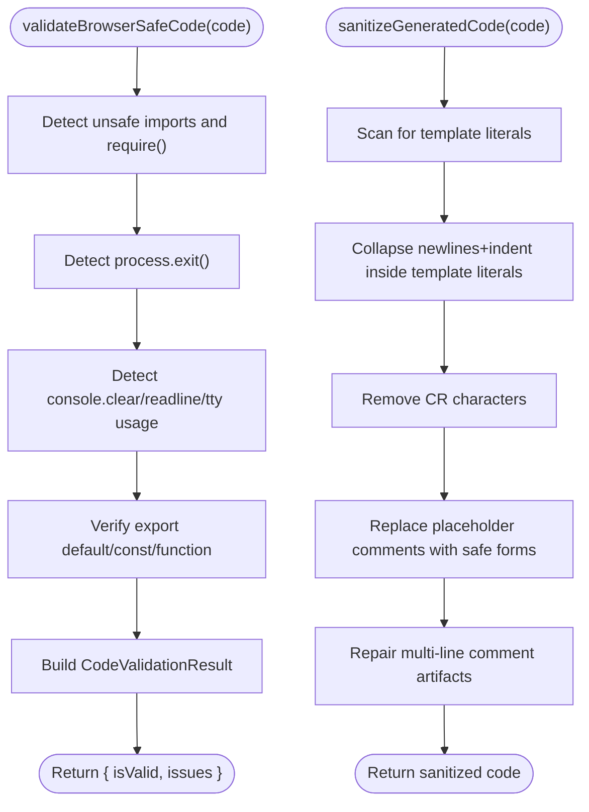
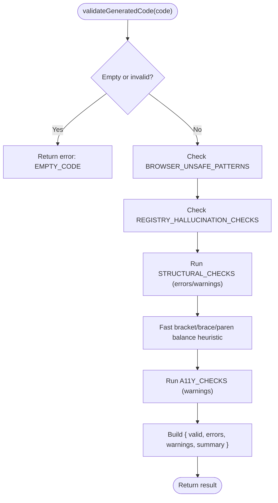
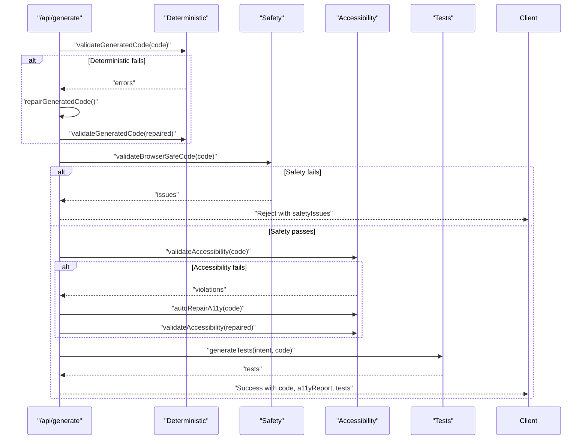
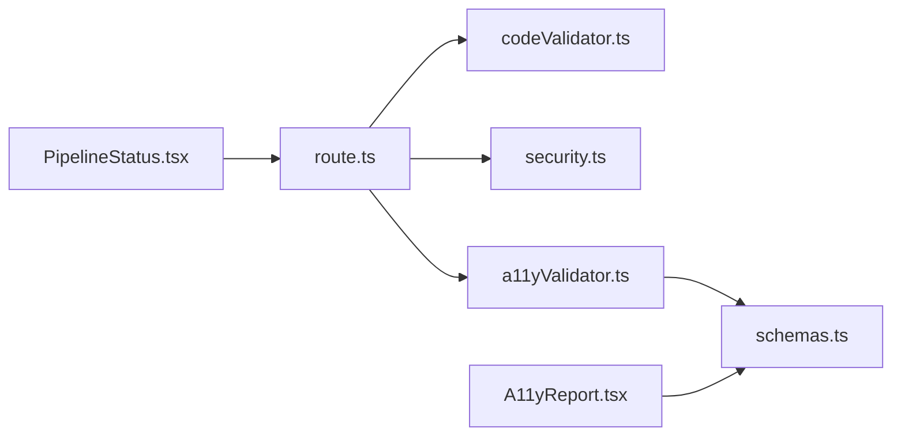

# Validation & Quality Assurance

<cite>
**Referenced Files in This Document**
- [a11yValidator.ts](file://lib/validation/a11yValidator.ts)
- [security.ts](file://lib/validation/security.ts)
- [schemas.ts](file://lib/validation/schemas.ts)
- [codeValidator.ts](file://lib/intelligence/codeValidator.ts)
- [route.ts](file://app/api/generate/route.ts)
- [A11yReport.tsx](file://components/A11yReport.tsx)
- [PipelineStatus.tsx](file://components/PipelineStatus.tsx)
- [a11yValidator.test.ts](file://__tests__/a11yValidator.test.ts)
- [security.test.ts](file://__tests__/security.test.ts)
</cite>

## Table of Contents
1. [Introduction](#introduction)
2. [Project Structure](#project-structure)
3. [Core Components](#core-components)
4. [Architecture Overview](#architecture-overview)
5. [Detailed Component Analysis](#detailed-component-analysis)
6. [Dependency Analysis](#dependency-analysis)
7. [Performance Considerations](#performance-considerations)
8. [Troubleshooting Guide](#troubleshooting-guide)
9. [Conclusion](#conclusion)
10. [Appendices](#appendices)

## Introduction
This document describes the validation and quality assurance system that ensures generated components meet accessibility and safety standards. It covers:
- WCAG 2.1 AA compliance checking
- Browser safety validation for security scanning and sanitization
- Syntax and semantic validation rules
- An auto-repair system that automatically fixes common issues
- Deterministic validation rules, compliance reporting, and integration with the generation pipeline
- Examples of validation failures and their automatic repairs
- The relationship between validation stages and quality gates in the generation pipeline
- Guidance on customizing validation rules and extending the system

## Project Structure
The validation system spans several modules:
- Accessibility validation and auto-repair logic
- Browser safety validation and sanitization
- Deterministic syntax/semantic validation used prior to expensive review steps
- Generation pipeline integration and UI reporting

**Diagram sources**
- [route.ts:1-451](file://app/api/generate/route.ts#L1-L451)
- [codeValidator.ts:1-388](file://lib/intelligence/codeValidator.ts#L1-L388)
- [a11yValidator.ts:1-376](file://lib/validation/a11yValidator.ts#L1-L376)
- [security.ts:1-129](file://lib/validation/security.ts#L1-L129)
- [A11yReport.tsx:1-193](file://components/A11yReport.tsx#L1-L193)
- [PipelineStatus.tsx:1-219](file://components/PipelineStatus.tsx#L1-L219)

**Section sources**
- [route.ts:1-451](file://app/api/generate/route.ts#L1-L451)
- [codeValidator.ts:1-388](file://lib/intelligence/codeValidator.ts#L1-L388)
- [a11yValidator.ts:1-376](file://lib/validation/a11yValidator.ts#L1-L376)
- [security.ts:1-129](file://lib/validation/security.ts#L1-L129)
- [A11yReport.tsx:1-193](file://components/A11yReport.tsx#L1-L193)
- [PipelineStatus.tsx:1-219](file://components/PipelineStatus.tsx#L1-L219)

## Core Components
- WCAG 2.1 AA Accessibility Validator and Auto-Repair
  - Implements rule-based checks for WCAG 2.1 AA criteria
  - Produces a structured report with severity, suggestions, and a score
  - Provides targeted auto-repair for common issues
- Browser Safety Validator and Sanitization
  - Detects Node.js/TTY APIs and unsupported constructs
  - Sanitizes generated code to prevent parsing errors in Sandpack/Babel
- Deterministic Code Validator
  - Previews stage validation to catch structural and registry hallucinations early
  - Uses fast heuristics to detect truncation and mismatches
- Generation Pipeline Integration
  - Orchestrates deterministic checks, browser safety, accessibility, and tests in parallel
  - Applies quality gates and optional reviewer-driven repairs
- Reporting UI
  - Visualizes accessibility scores, violations, and applied fixes
  - Tracks pipeline progress and errors

**Section sources**
- [a11yValidator.ts:1-376](file://lib/validation/a11yValidator.ts#L1-L376)
- [security.ts:1-129](file://lib/validation/security.ts#L1-L129)
- [codeValidator.ts:1-388](file://lib/intelligence/codeValidator.ts#L1-L388)
- [route.ts:1-451](file://app/api/generate/route.ts#L1-L451)
- [A11yReport.tsx:1-193](file://components/A11yReport.tsx#L1-L193)
- [PipelineStatus.tsx:1-219](file://components/PipelineStatus.tsx#L1-L219)

## Architecture Overview
The generation pipeline applies layered validations and auto-repairs to ensure generated components are safe, syntactically sound, and accessible.

**Diagram sources**
- [route.ts:1-451](file://app/api/generate/route.ts#L1-L451)
- [codeValidator.ts:264-364](file://lib/intelligence/codeValidator.ts#L264-L364)
- [security.ts:6-34](file://lib/validation/security.ts#L6-L34)
- [security.ts:44-128](file://lib/validation/security.ts#L44-L128)
- [a11yValidator.ts:264-297](file://lib/validation/a11yValidator.ts#L264-L297)
- [a11yValidator.ts:303-375](file://lib/validation/a11yValidator.ts#L303-L375)
- [A11yReport.tsx:97-192](file://components/A11yReport.tsx#L97-L192)

**Section sources**
- [route.ts:225-363](file://app/api/generate/route.ts#L225-L363)
- [codeValidator.ts:264-364](file://lib/intelligence/codeValidator.ts#L264-L364)
- [security.ts:6-34](file://lib/validation/security.ts#L6-L34)
- [security.ts:44-128](file://lib/validation/security.ts#L44-L128)
- [a11yValidator.ts:264-297](file://lib/validation/a11yValidator.ts#L264-L297)
- [a11yValidator.ts:303-375](file://lib/validation/a11yValidator.ts#L303-L375)
- [A11yReport.tsx:97-192](file://components/A11yReport.tsx#L97-L192)

## Detailed Component Analysis

### WCAG 2.1 AA Compliance Checker
- Purpose: Static analysis of generated TSX code against WCAG 2.1 AA rules
- Coverage includes:
  - Form inputs must have labels or accessible names
  - Buttons must have accessible names
  - Images must have alternative text
  - Forms should have accessible labels or legends
  - Headings should follow a logical hierarchy
  - Interactive elements must be keyboard accessible
  - Error messages should be announced to assistive technologies
  - Color contrast and focus visibility rules
- Scoring: Starts at 100, subtracts points for errors and warnings
- Severity mapping: error, warning, info
- Report structure: includes passed flag, score, violations, suggestions, timestamp

**Diagram sources**
- [a11yValidator.ts:264-297](file://lib/validation/a11yValidator.ts#L264-L297)

**Section sources**
- [a11yValidator.ts:10-260](file://lib/validation/a11yValidator.ts#L10-L260)
- [a11yValidator.ts:264-297](file://lib/validation/a11yValidator.ts#L264-L297)
- [schemas.ts:301-320](file://lib/validation/schemas.ts#L301-L320)

### Auto-Repair System
- Purpose: Automatically fix common accessibility issues to improve pass rates
- Repairs include:
  - Adding focus ring replacements for elements using outline-none without focus ring
  - Adding role="alert" and aria-live="polite" to error text
  - Adding aria-label to inputs that lack labels or accessible names
  - Adding aria-label to icon-only buttons
- Returns the repaired code and a list of applied fixes

**Diagram sources**
- [a11yValidator.ts:303-375](file://lib/validation/a11yValidator.ts#L303-L375)

**Section sources**
- [a11yValidator.ts:303-375](file://lib/validation/a11yValidator.ts#L303-L375)
- [a11yValidator.test.ts:90-108](file://__tests__/a11yValidator.test.ts#L90-L108)

### Browser Safety Validation and Sanitization
- Safety checks:
  - Detect Node.js standard library imports and TTY/console APIs
  - Detect process.exit and terminal manipulation
  - Verify presence of a valid React export
- Sanitization:
  - Collapse multi-line template literals inside JSX attribute expressions
  - Strip carriage returns
  - Remove or transform placeholder comments that break parsers
  - Repair artifacts from multi-line comment transformations

**Diagram sources**
- [security.ts:6-34](file://lib/validation/security.ts#L6-L34)
- [security.ts:44-128](file://lib/validation/security.ts#L44-L128)

**Section sources**
- [security.ts:6-34](file://lib/validation/security.ts#L6-L34)
- [security.ts:44-128](file://lib/validation/security.ts#L44-L128)
- [security.test.ts:3-38](file://__tests__/security.test.ts#L3-L38)
- [security.test.ts:40-59](file://__tests__/security.test.ts#L40-L59)

### Deterministic Validation Rules
- Purpose: Catch structural and registry hallucinations quickly before expensive review steps
- Browser-unsafe patterns: Node.js modules and TTY/console APIs
- Registry hallucinations: unavailable libraries (e.g., Three.js, GSAP, Material UI)
- Structural checks: missing exports, return statements, JSX presence, imbalance, import order, excessive dynamic imports
- Accessibility heuristics: missing alt, missing aria-label, interactive divs, input labels, heading hierarchy, reduced motion fallback
- Fast truncation detection: balance of braces/parentheses/brackets without heavy compiler

**Diagram sources**
- [codeValidator.ts:264-364](file://lib/intelligence/codeValidator.ts#L264-L364)

**Section sources**
- [codeValidator.ts:28-114](file://lib/intelligence/codeValidator.ts#L28-L114)
- [codeValidator.ts:118-178](file://lib/intelligence/codeValidator.ts#L118-L178)
- [codeValidator.ts:184-257](file://lib/intelligence/codeValidator.ts#L184-L257)
- [codeValidator.ts:302-349](file://lib/intelligence/codeValidator.ts#L302-L349)

### Compliance Reporting Mechanisms
- Accessibility reports include:
  - passed flag and score
  - list of violations with ruleId, severity, element, description, suggestion, WCAG criteria
  - suggestions array and timestamp
- UI rendering:
  - A11yReport displays score ring, counts by severity, applied fixes, and violation cards
- Pipeline status:
  - PipelineStatus shows current step and error messaging

**Section sources**
- [schemas.ts:301-320](file://lib/validation/schemas.ts#L301-L320)
- [A11yReport.tsx:97-192](file://components/A11yReport.tsx#L97-L192)
- [PipelineStatus.tsx:34-75](file://components/PipelineStatus.tsx#L34-L75)

### Integration with the Generation Pipeline
- Quality gates:
  - Deterministic validation before expensive review
  - Browser safety validation before accessibility checks
  - Parallel execution of accessibility and test generation
- Decision points:
  - If deterministic validation fails, trigger repair and re-check
  - If browser safety fails, reject with safety issues
  - If accessibility fails, auto-repair and re-validate
- Outputs:
  - Final code, a11yReport (with appliedFixes), tests, and generator metadata

**Diagram sources**
- [route.ts:225-363](file://app/api/generate/route.ts#L225-L363)

**Section sources**
- [route.ts:225-442](file://app/api/generate/route.ts#L225-L442)

### Examples of Validation Failures and Automatic Repairs
- Accessibility failures and repairs:
  - Missing alt on images: autoRepair adds alt attribute
  - Icon-only buttons without accessible names: autoRepair adds aria-label
  - Inputs without labels: autoRepair derives aria-label from placeholder/name/id
  - Low focus visibility: autoRepair augments outline-none with focus ring classes
  - Error messages not announced: autoRepair adds role="alert" and aria-live="polite"
- Browser safety failures and sanitization:
  - Node.js imports and TTY/console usage: flagged as unsafe
  - Missing React export: flagged as invalid component
  - Multi-line template literals and placeholder comments: sanitized to avoid parser errors

**Section sources**
- [a11yValidator.test.ts:4-108](file://__tests__/a11yValidator.test.ts#L4-L108)
- [security.test.ts:3-59](file://__tests__/security.test.ts#L3-L59)
- [a11yValidator.ts:303-375](file://lib/validation/a11yValidator.ts#L303-L375)
- [security.ts:44-128](file://lib/validation/security.ts#L44-L128)

### Relationship Between Validation Stages and Quality Gates
- Deterministic gate: early detection of structural and registry issues to reduce downstream costs
- Safety gate: browser compatibility enforcement before proceeding to accessibility checks
- Accessibility gate: WCAG 2.1 AA compliance enforced with auto-repair fallback
- Test gate: automated tests generated in parallel to validate behavior

**Section sources**
- [route.ts:225-363](file://app/api/generate/route.ts#L225-L363)
- [codeValidator.ts:264-364](file://lib/intelligence/codeValidator.ts#L264-L364)
- [security.ts:6-34](file://lib/validation/security.ts#L6-L34)
- [a11yValidator.ts:264-297](file://lib/validation/a11yValidator.ts#L264-L297)

### Customizing Validation Rules and Extending the System
- Accessibility rules:
  - Add new A11yRule entries with id, wcagCriteria, severity, description, check function, and suggestion
  - Integrate into validateAccessibility loop and autoRepairA11y logic as appropriate
- Deterministic checks:
  - Extend BROWSER_UNSAFE_PATTERNS, REGISTRY_HALLUCINATION_CHECKS, STRUCTURAL_CHECKS, or A11Y_CHECKS arrays
  - Add new tests to assert expected behavior
- Browser safety:
  - Add new unsafe patterns to validateBrowserSafeCode
  - Enhance sanitizeGeneratedCode to address new artifact patterns
- Reporting:
  - Extend A11yReport and A11yViolation schemas to include additional metadata
  - Update UI components to render new fields

**Section sources**
- [a11yValidator.ts:10-260](file://lib/validation/a11yValidator.ts#L10-L260)
- [a11yValidator.ts:303-375](file://lib/validation/a11yValidator.ts#L303-L375)
- [codeValidator.ts:28-114](file://lib/intelligence/codeValidator.ts#L28-L114)
- [codeValidator.ts:118-178](file://lib/intelligence/codeValidator.ts#L118-L178)
- [codeValidator.ts:184-257](file://lib/intelligence/codeValidator.ts#L184-L257)
- [security.ts:6-34](file://lib/validation/security.ts#L6-L34)
- [security.ts:44-128](file://lib/validation/security.ts#L44-L128)
- [schemas.ts:301-320](file://lib/validation/schemas.ts#L301-L320)
- [A11yReport.tsx:97-192](file://components/A11yReport.tsx#L97-L192)

## Dependency Analysis
- Module coupling:
  - Generation API depends on deterministic validator, browser safety, accessibility validator, and sanitizer
  - Accessibility validator depends on schemas for report typing
  - UI components depend on schemas and validation outputs
- Cohesion:
  - Each module encapsulates a distinct responsibility (syntax, safety, accessibility, reporting)
- External dependencies:
  - Zod for schema validation and typed reports
  - Next.js for API routes and UI rendering

**Diagram sources**
- [route.ts:1-451](file://app/api/generate/route.ts#L1-L451)
- [codeValidator.ts:1-388](file://lib/intelligence/codeValidator.ts#L1-L388)
- [security.ts:1-129](file://lib/validation/security.ts#L1-L129)
- [a11yValidator.ts:1-376](file://lib/validation/a11yValidator.ts#L1-L376)
- [schemas.ts:1-340](file://lib/validation/schemas.ts#L1-L340)
- [A11yReport.tsx:1-193](file://components/A11yReport.tsx#L1-L193)
- [PipelineStatus.tsx:1-219](file://components/PipelineStatus.tsx#L1-L219)

**Section sources**
- [route.ts:1-451](file://app/api/generate/route.ts#L1-L451)
- [schemas.ts:1-340](file://lib/validation/schemas.ts#L1-L340)

## Performance Considerations
- Deterministic validation uses fast heuristics to avoid heavy compilation and catch truncation early
- Parallel execution of accessibility and test generation reduces total latency
- Auto-repair minimizes rework by fixing common issues proactively
- Sanitization avoids costly parser failures in Sandpack environments

[No sources needed since this section provides general guidance]

## Troubleshooting Guide
- Deterministic validation failures:
  - Causes: missing exports, return statements, JSX, unbalanced tags, excessive dynamic imports
  - Action: review generated code structure and fix immediately before expensive review
- Browser safety failures:
  - Causes: Node.js imports, TTY/console usage, missing React export
  - Action: remove unsafe patterns or refactor to browser-compatible alternatives
- Accessibility failures:
  - Causes: missing alt, aria-label, input labels, focus visibility, error announcements
  - Action: rely on auto-repair or manually apply suggestions from the report
- Pipeline errors:
  - Use PipelineStatus UI to identify the failing stage
  - Check logs for detailed error messages and suggestions

**Section sources**
- [codeValidator.ts:264-364](file://lib/intelligence/codeValidator.ts#L264-L364)
- [security.ts:6-34](file://lib/validation/security.ts#L6-L34)
- [a11yValidator.ts:264-297](file://lib/validation/a11yValidator.ts#L264-L297)
- [PipelineStatus.tsx:165-215](file://components/PipelineStatus.tsx#L165-L215)

## Conclusion
The validation and quality assurance system enforces WCAG 2.1 AA compliance, browser safety, and deterministic syntax/semantic correctness. It integrates seamlessly into the generation pipeline with quality gates, auto-repair capabilities, and robust reporting. By extending the rule sets and maintaining strict safety and accessibility standards, the system ensures reliable, accessible, and secure component generation.

[No sources needed since this section summarizes without analyzing specific files]

## Appendices

### Example Validation Scenarios
- Accessibility
  - Missing alt attribute on an image triggers a violation and suggests adding alt text
  - Icon-only button without aria-label triggers a violation and suggests adding an accessible label
  - Input without label triggers a violation and suggests adding aria-label derived from placeholder/name/id
- Browser Safety
  - Import of fs or path leads to rejection with safety issues
  - Presence of process.exit or console.clear leads to rejection with safety issues
  - Missing export default leads to rejection as invalid component

**Section sources**
- [a11yValidator.test.ts:4-108](file://__tests__/a11yValidator.test.ts#L4-L108)
- [security.test.ts:3-59](file://__tests__/security.test.ts#L3-L59)