# Authentication & Authorization

<cite>
**Referenced Files in This Document**
- [route.ts](file://app/api/auth/[...nextauth]/route.ts)
- [auth.ts](file://lib/auth.ts)
- [SessionProvider.tsx](file://components/auth/SessionProvider.tsx)
- [UserNav.tsx](file://components/auth/UserNav.tsx)
- [WorkspaceProvider.tsx](file://components/workspace/WorkspaceProvider.tsx)
- [WorkspaceSwitcher.tsx](file://components/workspace/WorkspaceSwitcher.tsx)
- [schema.prisma](file://prisma/schema.prisma)
- [route.ts](file://app/api/auth/forgot-password/route.ts)
- [route.ts](file://app/api/auth/reset-password/route.ts)
- [route.ts](file://app/api/workspaces/route.ts)
- [route.ts](file://app/api/workspace/settings/route.ts)
- [route.ts](file://app/api/projects/route.ts)
- [workspaceKeyService.ts](file://lib/security/workspaceKeyService.ts)
</cite>

## Table of Contents
1. [Introduction](#introduction)
2. [Project Structure](#project-structure)
3. [Core Components](#core-components)
4. [Architecture Overview](#architecture-overview)
5. [Detailed Component Analysis](#detailed-component-analysis)
6. [Dependency Analysis](#dependency-analysis)
7. [Performance Considerations](#performance-considerations)
8. [Troubleshooting Guide](#troubleshooting-guide)
9. [Conclusion](#conclusion)
10. [Appendices](#appendices)

## Introduction
This document explains the authentication and authorization system built on NextAuth.js. It covers:
- User account management with email/password authentication against a single owner account
- Session handling via JWT strategy
- Workspace-level permissions with role-based access control (OWNER, ADMIN, MEMBER)
- How permissions cascade through projects and workspaces
- Membership model linking users to workspaces
- Authentication flows: login, logout, password reset, and session lifecycle
- Authorization patterns for API endpoints and frontend components
- Security considerations, session token management, and best practices for protecting workspace data
- Examples: user registration (single owner), workspace invitation (implicit via membership creation), and permission escalation (not supported in this design)

## Project Structure
The authentication and authorization system spans several layers:
- NextAuth.js configuration and API routes
- Frontend providers and components for session and workspace context
- Prisma schema modeling users, sessions, workspaces, and memberships
- API endpoints for workspaces, settings, and password reset flows
- Security utilities for workspace key caching and access checks

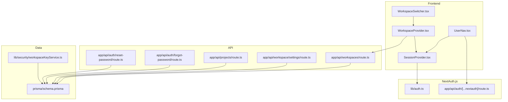

**Diagram sources**
- [SessionProvider.tsx:1-8](file://components/auth/SessionProvider.tsx#L1-L8)
- [UserNav.tsx:1-299](file://components/auth/UserNav.tsx#L1-L299)
- [WorkspaceProvider.tsx:1-155](file://components/workspace/WorkspaceProvider.tsx#L1-L155)
- [WorkspaceSwitcher.tsx:1-196](file://components/workspace/WorkspaceSwitcher.tsx#L1-L196)
- [auth.ts:1-87](file://lib/auth.ts#L1-L87)
- [route.ts:1-4](file://app/api/auth/[...nextauth]/route.ts#L1-L4)
- [route.ts:1-129](file://app/api/workspaces/route.ts#L1-L129)
- [route.ts:1-147](file://app/api/workspace/settings/route.ts#L1-L147)
- [route.ts:1-92](file://app/api/projects/route.ts#L1-L92)
- [route.ts:1-94](file://app/api/auth/forgot-password/route.ts#L1-L94)
- [route.ts:1-65](file://app/api/auth/reset-password/route.ts#L1-L65)
- [schema.prisma:1-222](file://prisma/schema.prisma#L1-L222)
- [workspaceKeyService.ts:1-45](file://lib/security/workspaceKeyService.ts#L1-L45)

**Section sources**
- [auth.ts:1-87](file://lib/auth.ts#L1-L87)
- [route.ts:1-4](file://app/api/auth/[...nextauth]/route.ts#L1-L4)
- [SessionProvider.tsx:1-8](file://components/auth/SessionProvider.tsx#L1-L8)
- [UserNav.tsx:1-299](file://components/auth/UserNav.tsx#L1-L299)
- [WorkspaceProvider.tsx:1-155](file://components/workspace/WorkspaceProvider.tsx#L1-L155)
- [WorkspaceSwitcher.tsx:1-196](file://components/workspace/WorkspaceSwitcher.tsx#L1-L196)
- [schema.prisma:1-222](file://prisma/schema.prisma#L1-L222)
- [route.ts:1-129](file://app/api/workspaces/route.ts#L1-L129)
- [route.ts:1-147](file://app/api/workspace/settings/route.ts#L1-L147)
- [route.ts:1-92](file://app/api/projects/route.ts#L1-L92)
- [route.ts:1-94](file://app/api/auth/forgot-password/route.ts#L1-L94)
- [route.ts:1-65](file://app/api/auth/reset-password/route.ts#L1-L65)
- [workspaceKeyService.ts:1-45](file://lib/security/workspaceKeyService.ts#L1-L45)

## Core Components
- NextAuth.js configuration defines the JWT session strategy, credentials provider, and callbacks for token/session propagation. It also sets login and error pages.
- API route for NextAuth.js exposes GET/POST handlers for authentication.
- SessionProvider wraps the app to enable client-side session consumption.
- UserNav displays unauthenticated prompts and authenticated owner profile with sign-out.
- WorkspaceProvider manages workspace list, selection, creation, deletion, and auto-provisions a default workspace for new users.
- WorkspaceSwitcher renders the workspace list and supports creation and deletion for owners.
- Prisma schema models users, sessions, workspaces, memberships, and related entities.
- Workspaces API enforces authorization via workspace membership checks.
- Password reset endpoints implement token generation, validation, and secure updates.
- Workspace settings API validates and stores provider/model configurations with encryption and cache invalidation.
- Workspace key service enforces per-request authorization and caches decrypted keys.

**Section sources**
- [auth.ts:11-87](file://lib/auth.ts#L11-L87)
- [route.ts:1-4](file://app/api/auth/[...nextauth]/route.ts#L1-L4)
- [SessionProvider.tsx:1-8](file://components/auth/SessionProvider.tsx#L1-L8)
- [UserNav.tsx:17-299](file://components/auth/UserNav.tsx#L17-L299)
- [WorkspaceProvider.tsx:27-155](file://components/workspace/WorkspaceProvider.tsx#L27-L155)
- [WorkspaceSwitcher.tsx:7-196](file://components/workspace/WorkspaceSwitcher.tsx#L7-L196)
- [schema.prisma:40-95](file://prisma/schema.prisma#L40-L95)
- [route.ts:1-129](file://app/api/workspaces/route.ts#L1-L129)
- [route.ts:1-94](file://app/api/auth/forgot-password/route.ts#L1-L94)
- [route.ts:1-65](file://app/api/auth/reset-password/route.ts#L1-L65)
- [route.ts:1-147](file://app/api/workspace/settings/route.ts#L1-L147)
- [workspaceKeyService.ts:32-45](file://lib/security/workspaceKeyService.ts#L32-L45)

## Architecture Overview
The system uses a JWT-based session strategy with a single owner credentials provider. Users are linked to workspaces via WorkspaceMember records. Workspace-level permissions are enforced by checking membership roles on API requests.

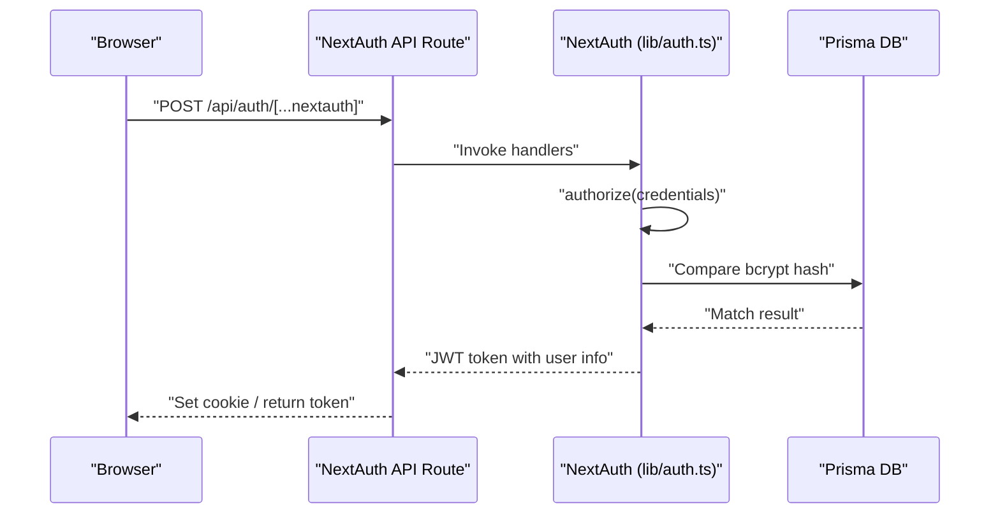

**Diagram sources**
- [route.ts:1-4](file://app/api/auth/[...nextauth]/route.ts#L1-L4)
- [auth.ts:25-60](file://lib/auth.ts#L25-L60)
- [schema.prisma:13-52](file://prisma/schema.prisma#L13-L52)

## Detailed Component Analysis

### NextAuth.js Configuration and Handlers
- Session strategy: JWT with a 7-day max age.
- Provider: Credentials with email/password fields.
- authorize: Validates the provided password against a stored hash from environment variables, returning a synthetic owner user object on success.
- callbacks: Populate JWT token and session with user identity.
- Pages: Redirects to login on sign-in or error.

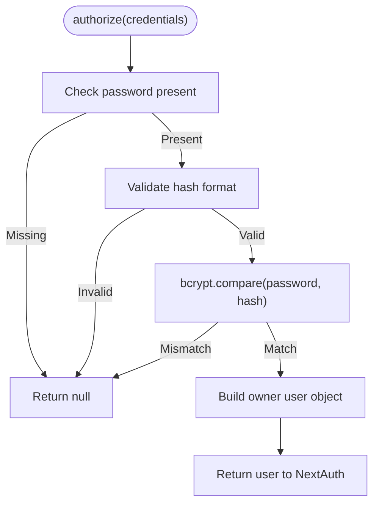

**Diagram sources**
- [auth.ts:25-60](file://lib/auth.ts#L25-L60)

**Section sources**
- [auth.ts:11-87](file://lib/auth.ts#L11-L87)
- [route.ts:1-4](file://app/api/auth/[...nextauth]/route.ts#L1-L4)

### SessionProvider and UserNav
- SessionProvider wraps the app to enable useSession in components.
- UserNav shows an unauthenticated prompt with sign-in action and an authenticated owner menu with sign-out.

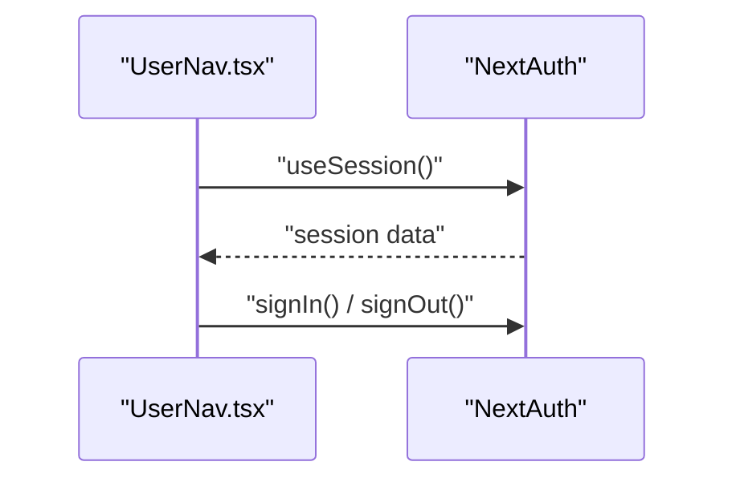

**Diagram sources**
- [SessionProvider.tsx:1-8](file://components/auth/SessionProvider.tsx#L1-L8)
- [UserNav.tsx:17-299](file://components/auth/UserNav.tsx#L17-L299)

**Section sources**
- [SessionProvider.tsx:1-8](file://components/auth/SessionProvider.tsx#L1-L8)
- [UserNav.tsx:17-299](file://components/auth/UserNav.tsx#L17-L299)

### Workspace Membership and Role-Based Access Control
- WorkspaceRole enum defines OWNER, ADMIN, MEMBER.
- WorkspaceMember links User to Workspace with a role.
- Workspaces API enforces authorization by verifying membership before listing, creating, or deleting workspaces.
- WorkspaceSwitcher displays the current role and allows owner actions like deletion.

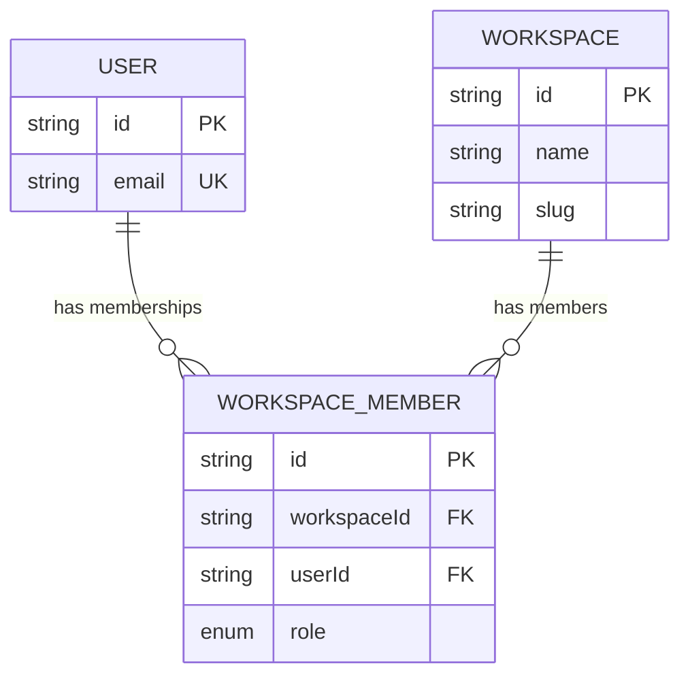

**Diagram sources**
- [schema.prisma:78-95](file://prisma/schema.prisma#L78-L95)
- [schema.prisma:84-95](file://prisma/schema.prisma#L84-L95)
- [schema.prisma:40-52](file://prisma/schema.prisma#L40-L52)

**Section sources**
- [schema.prisma:78-95](file://prisma/schema.prisma#L78-L95)
- [route.ts:1-129](file://app/api/workspaces/route.ts#L1-L129)
- [WorkspaceSwitcher.tsx:128-138](file://components/workspace/WorkspaceSwitcher.tsx#L128-L138)

### WorkspaceProvider and WorkspaceSwitcher
- WorkspaceProvider fetches workspaces for the authenticated user, auto-creates a default workspace if none exist, and manages active selection.
- WorkspaceSwitcher renders the list, supports creation and deletion for owners.

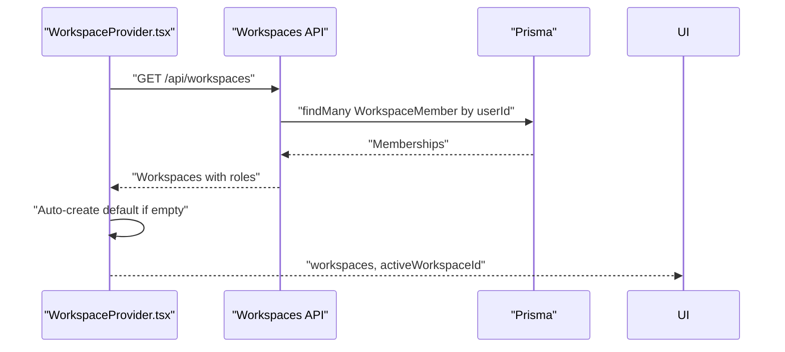

**Diagram sources**
- [WorkspaceProvider.tsx:89-123](file://components/workspace/WorkspaceProvider.tsx#L89-L123)
- [route.ts:1-45](file://app/api/workspaces/route.ts#L1-L45)

**Section sources**
- [WorkspaceProvider.tsx:27-155](file://components/workspace/WorkspaceProvider.tsx#L27-L155)
- [WorkspaceSwitcher.tsx:7-196](file://components/workspace/WorkspaceSwitcher.tsx#L7-L196)
- [route.ts:1-129](file://app/api/workspaces/route.ts#L1-L129)

### Password Reset Flow
- Forgot password endpoint generates a SHA-256 token, stores it as a verification token, and emails a reset link (Resend optional).
- Reset password endpoint validates the token, checks expiration, hashes the new password, and persists it while deleting the token.

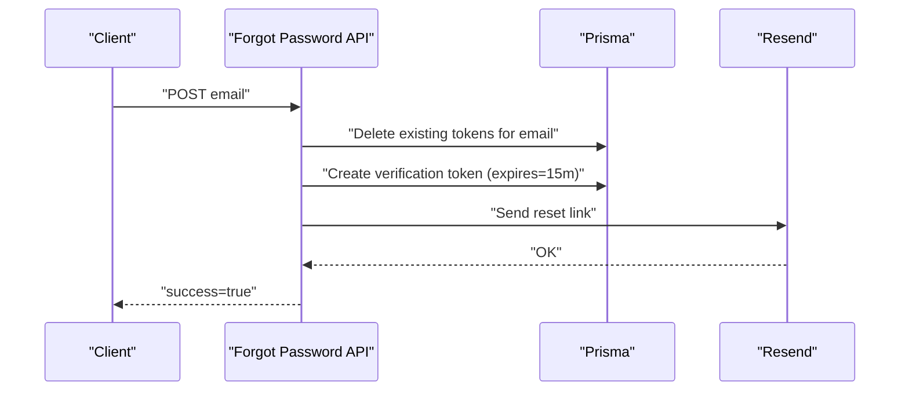

**Diagram sources**
- [route.ts:1-94](file://app/api/auth/forgot-password/route.ts#L1-L94)

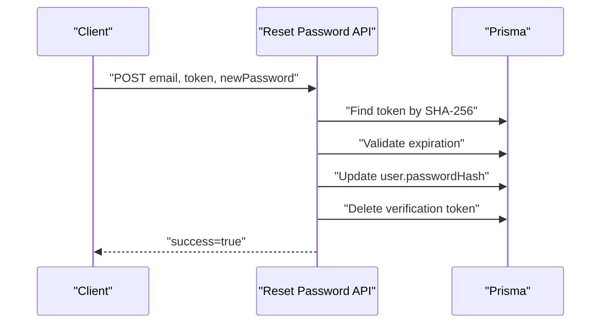

**Diagram sources**
- [route.ts:1-65](file://app/api/auth/reset-password/route.ts#L1-L65)

**Section sources**
- [route.ts:1-94](file://app/api/auth/forgot-password/route.ts#L1-L94)
- [route.ts:1-65](file://app/api/auth/reset-password/route.ts#L1-L65)

### Workspace Settings and API Key Management
- Settings API validates provider/model combinations, optionally tests API keys via lightweight adapter calls, encrypts keys, and upserts records.
- Cache invalidation ensures immediate availability after updates.

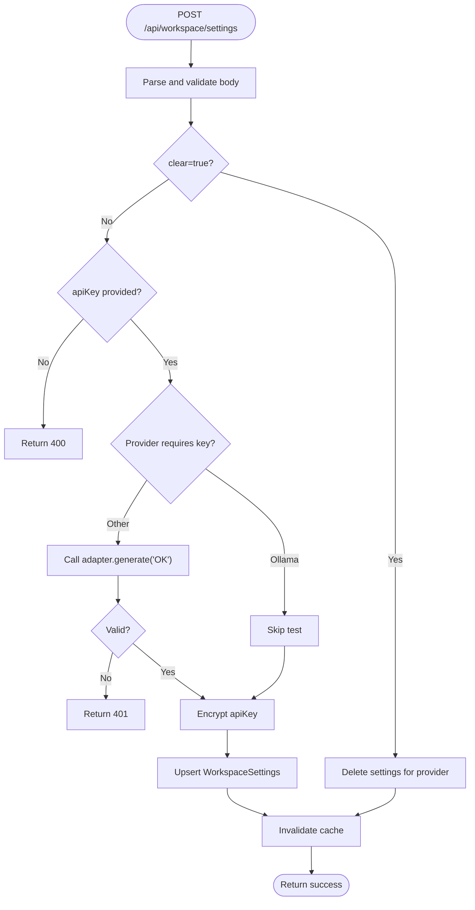

**Diagram sources**
- [route.ts:59-147](file://app/api/workspace/settings/route.ts#L59-L147)

**Section sources**
- [route.ts:1-147](file://app/api/workspace/settings/route.ts#L1-L147)

### Workspace Key Access Control and Caching
- The workspace key service enforces that callers with a userId must be a member of the target workspace before retrieving decrypted keys.
- Keys are cached in-process with a TTL to reduce database load.

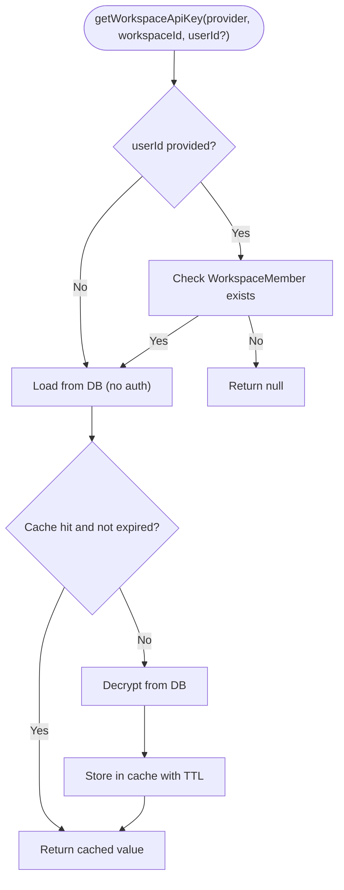

**Diagram sources**
- [workspaceKeyService.ts:32-45](file://lib/security/workspaceKeyService.ts#L32-L45)

**Section sources**
- [workspaceKeyService.ts:1-45](file://lib/security/workspaceKeyService.ts#L1-L45)

## Dependency Analysis
- Frontend depends on NextAuth for session state and on workspace providers for multi-tenant context.
- Backend APIs depend on NextAuth for session extraction and on Prisma for persistence.
- Workspace key service depends on Prisma and encryption utilities.

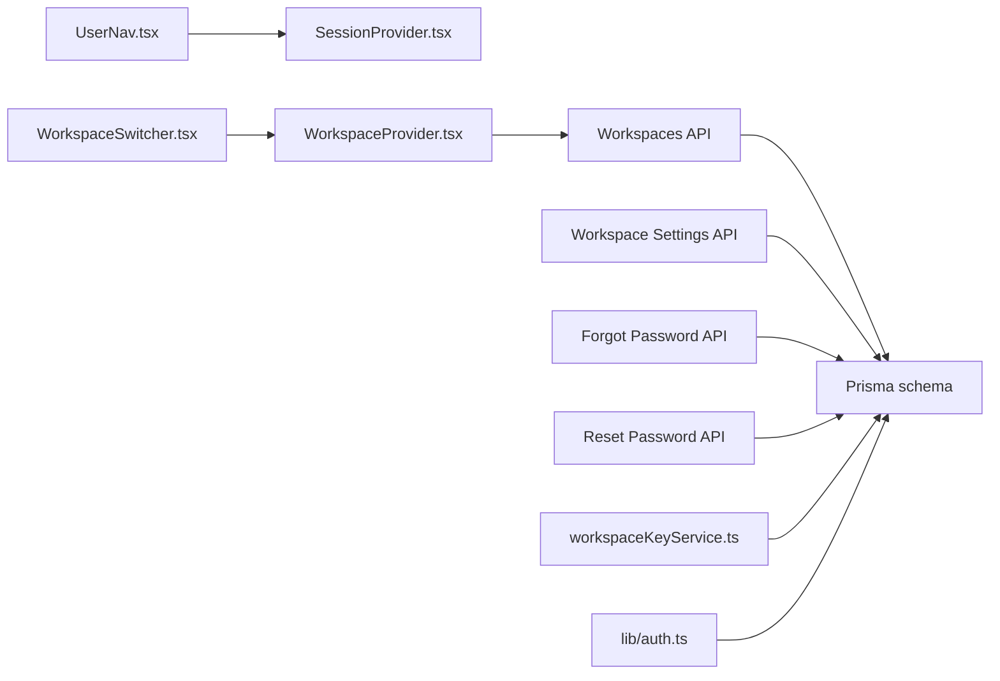

**Diagram sources**
- [UserNav.tsx:17-299](file://components/auth/UserNav.tsx#L17-L299)
- [SessionProvider.tsx:1-8](file://components/auth/SessionProvider.tsx#L1-L8)
- [WorkspaceProvider.tsx:27-155](file://components/workspace/WorkspaceProvider.tsx#L27-L155)
- [WorkspaceSwitcher.tsx:7-196](file://components/workspace/WorkspaceSwitcher.tsx#L7-L196)
- [route.ts:1-129](file://app/api/workspaces/route.ts#L1-L129)
- [route.ts:1-147](file://app/api/workspace/settings/route.ts#L1-L147)
- [route.ts:1-94](file://app/api/auth/forgot-password/route.ts#L1-L94)
- [route.ts:1-65](file://app/api/auth/reset-password/route.ts#L1-L65)
- [workspaceKeyService.ts:1-45](file://lib/security/workspaceKeyService.ts#L1-L45)
- [schema.prisma:1-222](file://prisma/schema.prisma#L1-L222)
- [auth.ts:11-87](file://lib/auth.ts#L11-L87)

**Section sources**
- [schema.prisma:1-222](file://prisma/schema.prisma#L1-L222)
- [auth.ts:11-87](file://lib/auth.ts#L11-L87)
- [route.ts:1-129](file://app/api/workspaces/route.ts#L1-L129)
- [route.ts:1-147](file://app/api/workspace/settings/route.ts#L1-L147)
- [route.ts:1-94](file://app/api/auth/forgot-password/route.ts#L1-L94)
- [route.ts:1-65](file://app/api/auth/reset-password/route.ts#L1-L65)
- [workspaceKeyService.ts:1-45](file://lib/security/workspaceKeyService.ts#L1-L45)

## Performance Considerations
- JWT session strategy reduces server-side session storage overhead.
- Workspace key service caches decrypted keys with a TTL to minimize database reads.
- Workspaces API uses a single query to fetch memberships and counts, reducing round-trips.
- Settings API avoids unnecessary writes by upserting only when needed.

[No sources needed since this section provides general guidance]

## Troubleshooting Guide
- Login fails:
  - Verify the environment variable containing the owner password hash is set and properly formatted.
  - Confirm bcrypt comparison succeeds and the authorize function returns a user object.
- Unauthorized on workspace endpoints:
  - Ensure the user is authenticated and has a WorkspaceMember record for the target workspace.
- Password reset not received:
  - Confirm the email matches the owner email and that the RESEND_API_KEY is configured.
  - Check that verification tokens are created and not expired.
- API key not applied:
  - Validate provider/model combination and ensure the adapter test passes.
  - Confirm cache invalidation occurs after updates.

**Section sources**
- [auth.ts:25-60](file://lib/auth.ts#L25-L60)
- [route.ts:31-45](file://app/api/workspaces/route.ts#L31-L45)
- [route.ts:20-36](file://app/api/auth/forgot-password/route.ts#L20-L36)
- [route.ts:101-118](file://app/api/workspace/settings/route.ts#L101-L118)
- [workspaceKeyService.ts:32-45](file://lib/security/workspaceKeyService.ts#L32-L45)

## Conclusion
This system implements a streamlined authentication and authorization model centered on a single owner account with JWT sessions and workspace-level RBAC. It leverages NextAuth.js for session management, Prisma for persistence, and a dedicated workspace key service for secure, cached access to provider credentials. While the current design focuses on a single owner, the underlying membership and role model can be extended to support invitations and elevated roles.

[No sources needed since this section summarizes without analyzing specific files]

## Appendices

### Authentication Flow: Login
- Client submits credentials to NextAuth handler.
- NextAuth compares the password against the stored hash.
- On success, a JWT is returned and stored by the client.

**Section sources**
- [auth.ts:25-60](file://lib/auth.ts#L25-L60)
- [route.ts:1-4](file://app/api/auth/[...nextauth]/route.ts#L1-L4)

### Authentication Flow: Logout
- Client invokes signOut, which clears the session.

**Section sources**
- [UserNav.tsx:266](file://components/auth/UserNav.tsx#L266)

### Authentication Flow: Password Reset
- Client requests a reset; a time-bound token is emailed.
- Client submits the token and new password; the system validates and updates the hash.

**Section sources**
- [route.ts:1-94](file://app/api/auth/forgot-password/route.ts#L1-L94)
- [route.ts:1-65](file://app/api/auth/reset-password/route.ts#L1-L65)

### Authorization Patterns
- API endpoints call the NextAuth auth() function to extract the session and enforce membership checks.
- WorkspaceSwitcher conditionally renders owner-only actions (e.g., delete) based on the current role.

**Section sources**
- [route.ts:31-45](file://app/api/workspaces/route.ts#L31-L45)
- [WorkspaceSwitcher.tsx:128-138](file://components/workspace/WorkspaceSwitcher.tsx#L128-L138)

### Security Considerations
- Use HTTPS and secure cookies in production.
- Enforce strong password hashing and rate-limit authentication attempts.
- Validate and sanitize all inputs in API endpoints.
- Limit sensitive data exposure; never return raw API keys.
- Regularly rotate secrets and environment variables.

[No sources needed since this section provides general guidance]

### Examples
- User registration: Not applicable; the system uses a single owner account.
- Workspace invitation: Implicit via membership creation when a workspace is created; future extensions could add explicit invite flows.
- Permission escalation: Not supported in the current design; owners cannot elevate others to OWNER.

[No sources needed since this section provides general guidance]