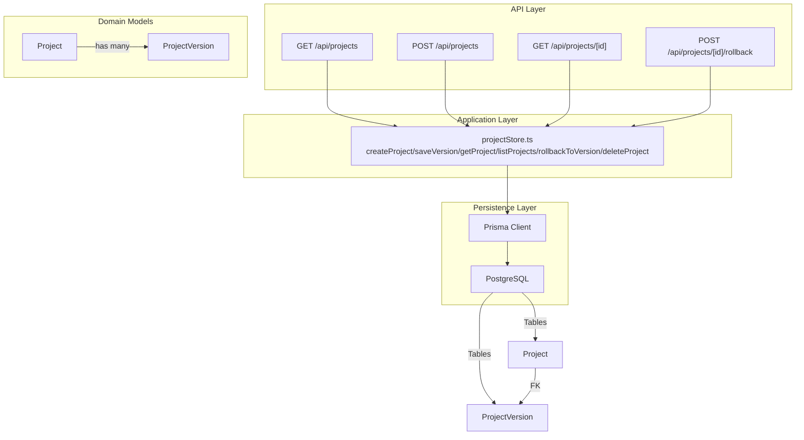
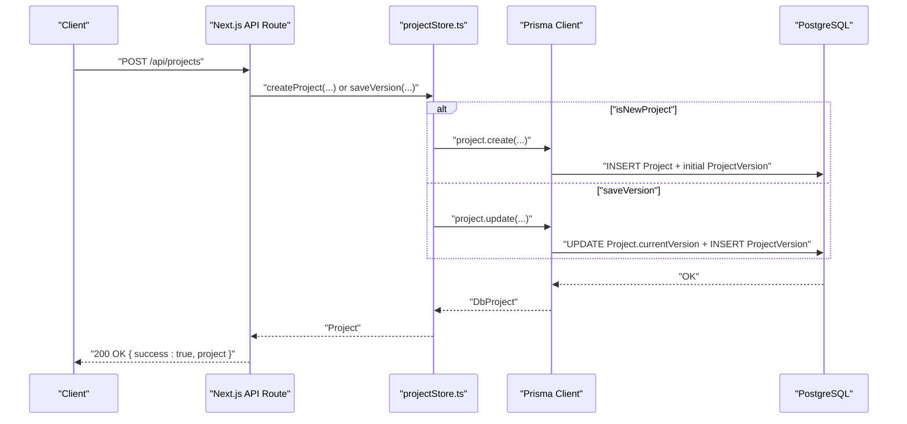
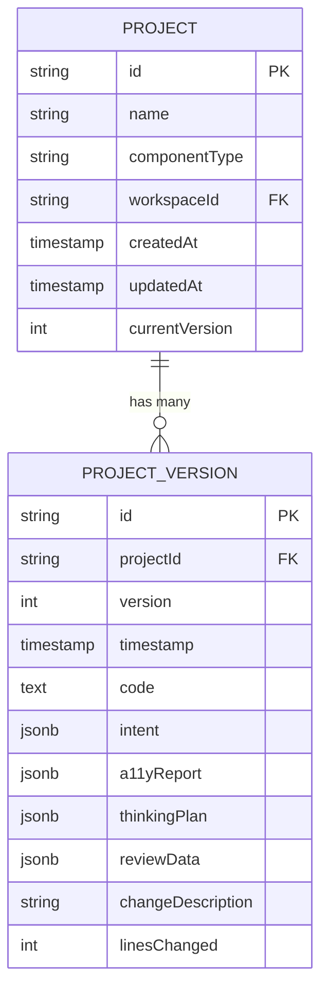
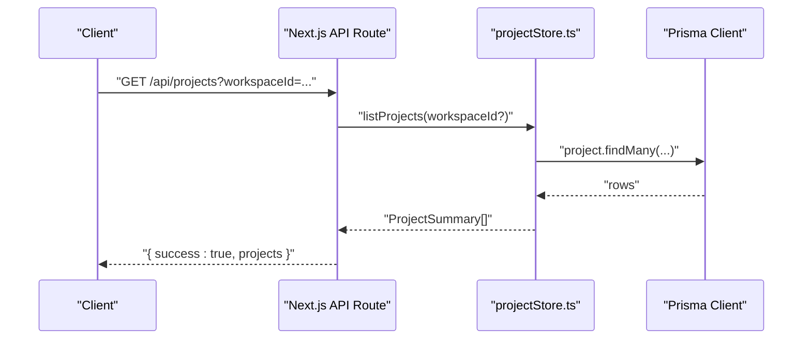
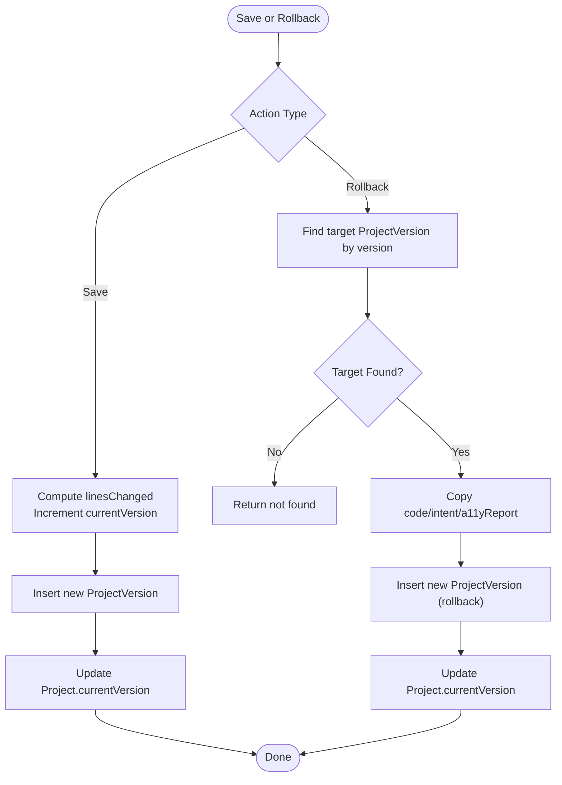
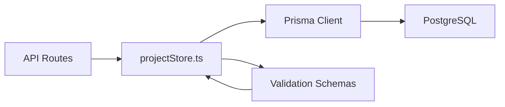

# Project Persistence

<cite>
**Referenced Files in This Document**
- [schema.prisma](file://prisma/schema.prisma)
- [projectStore.ts](file://lib/projects/projectStore.ts)
- [prisma.ts](file://lib/prisma.ts)
- [schemas.ts](file://lib/validation/schemas.ts)
- [projects route.ts](file://app/api/projects/route.ts)
- [projects [id] route.ts](file://app/api/projects/[id]/route.ts)
- [projects [id]/rollback route.ts](file://app/api/projects/[id]/rollback/route.ts)
- [20260407120000_add_project_model migration.sql](file://prisma/migrations/20260407120000_add_project_model/migration.sql)
- [20260410113000_add_thinking_review_metadata_to_project_version migration.sql](file://prisma/migrations/20260410113000_add_thinking_review_metadata_to_project_version/migration.sql)
</cite>

## Table of Contents
1. [Introduction](#introduction)
2. [Project Structure](#project-structure)
3. [Core Components](#core-components)
4. [Architecture Overview](#architecture-overview)
5. [Detailed Component Analysis](#detailed-component-analysis)
6. [Dependency Analysis](#dependency-analysis)
7. [Performance Considerations](#performance-considerations)
8. [Troubleshooting Guide](#troubleshooting-guide)
9. [Conclusion](#conclusion)
10. [Appendices](#appendices)

## Introduction
This document explains the project persistence system that replaces a read-only filesystem JSON store with a relational database-backed solution. It covers the complete project lifecycle from creation to deletion, including metadata, component types, workspace associations, and version control. It also documents the ProjectVersion model with code storage, intent metadata, accessibility reports, and thinking/review data. The document details CRUD operations through API endpoints, version history management, and collaborative editing workflows, with examples for creation, version comparison, and rollback scenarios.

## Project Structure
The project persistence system is implemented using:
- Prisma schema defining Project and ProjectVersion entities and their relationships
- A project store module implementing CRUD operations against the database
- Next.js API routes exposing endpoints for listing, retrieving, creating/updating, and deleting projects, plus rolling back to specific versions
- Validation schemas for intent and accessibility report structures
- Database migrations establishing the Project and ProjectVersion tables and adding optional metadata fields

**Diagram sources**
- [projectStore.ts:105-290](file://lib/projects/projectStore.ts#L105-L290)
- [projects route.ts:1-92](file://app/api/projects/route.ts#L1-L92)
- [projects [id] route.ts:1-12](file://app/api/projects/[id]/route.ts#L1-L12)
- [projects [id]/rollback route.ts:1-23](file://app/api/projects/[id]/rollback/route.ts#L1-L23)
- [schema.prisma:158-187](file://prisma/schema.prisma#L158-L187)

**Section sources**
- [schema.prisma:158-187](file://prisma/schema.prisma#L158-L187)
- [projectStore.ts:105-290](file://lib/projects/projectStore.ts#L105-L290)
- [prisma.ts:1-70](file://lib/prisma.ts#L1-L70)
- [projects route.ts:1-92](file://app/api/projects/route.ts#L1-L92)
- [projects [id] route.ts:1-12](file://app/api/projects/[id]/route.ts#L1-L12)
- [projects [id]/rollback route.ts:1-23](file://app/api/projects/[id]/rollback/route.ts#L1-L23)

## Core Components
- Project entity: stores project identity, human-readable name, component type, workspace association, and current version number. It has a one-to-many relationship with ProjectVersion.
- ProjectVersion entity: stores a specific snapshot of a project with version number, timestamp, code content, intent metadata, accessibility report, optional thinking/review metadata, change description, and lines changed count.
- Project Store: encapsulates database operations for creating projects, saving new versions, retrieving projects, listing projects, rolling back to a specific version, and deleting projects.
- API Routes: expose endpoints for listing projects, creating/upserting versions, retrieving a single project, and rolling back to a specific version.
- Validation Schemas: define the shape of intent and accessibility report structures used in persistence.

Key responsibilities:
- Project lifecycle management: creation, versioning, retrieval, listing, rollback, deletion
- Metadata preservation: intent classification, accessibility scoring, thinking/review artifacts
- Workspace linkage: optional workspace association enabling multi-tenant filtering
- Robustness: graceful handling of pending migrations and transient database errors

**Section sources**
- [schema.prisma:158-187](file://prisma/schema.prisma#L158-L187)
- [projectStore.ts:12-43](file://lib/projects/projectStore.ts#L12-L43)
- [projectStore.ts:105-290](file://lib/projects/projectStore.ts#L105-L290)
- [schemas.ts:149-320](file://lib/validation/schemas.ts#L149-L320)
- [prisma.ts:1-70](file://lib/prisma.ts#L1-L70)

## Architecture Overview
The system follows a layered architecture:
- API routes accept requests and delegate to the project store
- The project store uses Prisma Client to interact with PostgreSQL
- Domain models (Project, ProjectVersion) are mapped from database rows
- Validation schemas ensure data integrity for intent and accessibility report structures

**Diagram sources**
- [projects route.ts:16-82](file://app/api/projects/route.ts#L16-L82)
- [projectStore.ts:105-208](file://lib/projects/projectStore.ts#L105-L208)

**Section sources**
- [projects route.ts:16-82](file://app/api/projects/route.ts#L16-L82)
- [projectStore.ts:105-208](file://lib/projects/projectStore.ts#L105-L208)

## Detailed Component Analysis

### Project and ProjectVersion Entities
The Prisma schema defines:
- Project: id, name, componentType, workspaceId, timestamps, currentVersion
- ProjectVersion: id, projectId, version, timestamp, code, intent (JSONB), a11yReport (JSONB), thinkingPlan (JSONB), reviewData (JSONB), changeDescription, linesChanged

Constraints and relationships:
- Unique constraint on (projectId, version) ensures single-version snapshots
- Foreign keys: Project.workspaceId -> Workspace.id (SET NULL on delete), ProjectVersion.projectId -> Project.id (CASCADE on delete)
- Default values and timestamps managed by Prisma

**Diagram sources**
- [schema.prisma:158-187](file://prisma/schema.prisma#L158-L187)
- [20260407120000_add_project_model migration.sql:1-37](file://prisma/migrations/20260407120000_add_project_model/migration.sql#L1-L37)
- [20260410113000_add_thinking_review_metadata_to_project_version migration.sql:1-5](file://prisma/migrations/20260410113000_add_thinking_review_metadata_to_project_version/migration.sql#L1-L5)

**Section sources**
- [schema.prisma:158-187](file://prisma/schema.prisma#L158-L187)
- [20260407120000_add_project_model migration.sql:1-37](file://prisma/migrations/20260407120000_add_project_model/migration.sql#L1-L37)
- [20260410113000_add_thinking_review_metadata_to_project_version migration.sql:1-5](file://prisma/migrations/20260410113000_add_thinking_review_metadata_to_project_version/migration.sql#L1-L5)

### Project Store Implementation
Responsibilities:
- createProject: inserts a new project with an initial version snapshot; supports optional workspaceId and optional in-memory fallback when migrations are pending
- saveVersion: computes linesChanged based on previous version, increments currentVersion, and creates a new version snapshot
- getProject: retrieves a project with all version snapshots ordered ascending by version
- listProjects: lists projects optionally filtered by workspaceId, with latest version summary and total version count
- rollbackToVersion: finds a target version and creates a new version copying the target’s code/intent/a11yReport with a descriptive change description
- deleteProject: removes a project and cascades deletion of all associated versions

Data mapping:
- DbProject/DbVersion are transformed to Project/ProjectVersion domain types
- Code is parsed to detect multi-file records or plain string
- Dates are normalized to ISO strings

Error handling:
- Graceful handling of missing table errors (migration pending) by returning in-memory stubs
- Transient database errors handled via automatic reconnect wrapper

**Section sources**
- [projectStore.ts:105-290](file://lib/projects/projectStore.ts#L105-L290)
- [prisma.ts:54-70](file://lib/prisma.ts#L54-L70)

### API Endpoints
Endpoints:
- GET /api/projects: Lists projects, optionally filtered by workspaceId
- POST /api/projects: Creates a new project (isNewProject=true) or saves a new version (isNewProject=false); falls back to create if save fails due to missing project
- GET /api/projects/[id]: Retrieves a single project by ID
- POST /api/projects/[id]/rollback: Rolls back to a specific version by creating a new version snapshot with a descriptive change description

Request/response characteristics:
- Validation occurs at the API boundary for required fields and JSON parsing
- Responses include a success flag and either the resource or an error message

**Diagram sources**
- [projects route.ts:7-14](file://app/api/projects/route.ts#L7-L14)
- [projectStore.ts:222-245](file://lib/projects/projectStore.ts#L222-L245)

**Section sources**
- [projects route.ts:7-14](file://app/api/projects/route.ts#L7-L14)
- [projects route.ts:16-82](file://app/api/projects/route.ts#L16-L82)
- [projects [id] route.ts:4-11](file://app/api/projects/[id]/route.ts#L4-L11)
- [projects [id]/rollback route.ts:4-22](file://app/api/projects/[id]/rollback/route.ts#L4-L22)

### Version Control and History Management
Versioning mechanics:
- Each save creates a new ProjectVersion with an auto-incremented version number and timestamp
- Lines changed computed as absolute difference between previous and new line counts
- Rollback creates a new version copying the target snapshot’s code and metadata
- Listing returns latest version summary and total count for quick navigation

Comparison and rollback workflow:
- Retrieve project to enumerate versions
- Choose target version for rollback
- POST to rollback endpoint to create a new version snapshot copying the target

**Diagram sources**
- [projectStore.ts:162-208](file://lib/projects/projectStore.ts#L162-L208)
- [projectStore.ts:247-281](file://lib/projects/projectStore.ts#L247-L281)

**Section sources**
- [projectStore.ts:162-208](file://lib/projects/projectStore.ts#L162-L208)
- [projectStore.ts:247-281](file://lib/projects/projectStore.ts#L247-L281)

### Collaborative Editing Workflows
Collaboration is supported through:
- Workspace association: Projects can be linked to a Workspace, enabling filtering and tenant isolation
- Version snapshots: Each change is preserved as a distinct version, allowing team members to compare and revert collectively
- Rollback capability: Teams can revert to a known good version when conflicts arise

Filtering by workspace:
- Listing projects accepts an optional workspaceId parameter to scope results to a specific workspace

**Section sources**
- [schema.prisma:64-76](file://prisma/schema.prisma#L64-L76)
- [schema.prisma:158-169](file://prisma/schema.prisma#L158-L169)
- [projects route.ts:9-13](file://app/api/projects/route.ts#L9-L13)
- [projectStore.ts:222-245](file://lib/projects/projectStore.ts#L222-L245)

### Examples

#### Example: Project Creation
Steps:
- Call POST /api/projects with isNewProject=true
- Provide id, name, componentType, code, intent, a11yReport, and optional workspaceId
- The backend creates the project and initial version snapshot

Outcome:
- Returns success with the created Project including versions array

**Section sources**
- [projects route.ts:50-57](file://app/api/projects/route.ts#L50-L57)
- [projectStore.ts:105-160](file://lib/projects/projectStore.ts#L105-L160)

#### Example: Version Comparison
Steps:
- Retrieve a project via GET /api/projects/[id]
- Compare versions in the returned versions array
- Use changeDescription and linesChanged for quick triage

Outcome:
- Inspect version differences and decide on rollback or further refinement

**Section sources**
- [projects [id] route.ts:6-L11](file://app/api/projects/[id]/route.ts#L6-L11)
- [projectStore.ts:210-220](file://lib/projects/projectStore.ts#L210-L220)

#### Example: Rollback Scenario
Steps:
- POST /api/projects/[id]/rollback with version number
- The backend creates a new version copying the target snapshot
- Change description indicates rollback to the chosen version

Outcome:
- Project advances to a new version reflecting the rollback

**Section sources**
- [projects [id]/rollback route.ts:16-L22](file://app/api/projects/[id]/rollback/route.ts#L16-L22)
- [projectStore.ts:247-281](file://lib/projects/projectStore.ts#L247-L281)

## Dependency Analysis
High-level dependencies:
- API routes depend on projectStore functions
- projectStore depends on Prisma Client and wraps operations with reconnect logic
- Prisma Client connects to PostgreSQL; migrations define table structure and constraints
- Validation schemas underpin intent and accessibility report structures

**Diagram sources**
- [projects route.ts:1-5](file://app/api/projects/route.ts#L1-L5)
- [projectStore.ts:1-3](file://lib/projects/projectStore.ts#L1-L3)
- [prisma.ts:1-2](file://lib/prisma.ts#L1-L2)
- [schemas.ts:1-3](file://lib/validation/schemas.ts#L1-L3)

**Section sources**
- [projects route.ts:1-5](file://app/api/projects/route.ts#L1-L5)
- [projectStore.ts:1-3](file://lib/projects/projectStore.ts#L1-L3)
- [prisma.ts:1-2](file://lib/prisma.ts#L1-L2)
- [schemas.ts:1-3](file://lib/validation/schemas.ts#L1-L3)

## Performance Considerations
- Connection pooling and reconnection: The Prisma client is configured as a singleton and includes a reconnect wrapper to handle transient Neon errors, reducing cold starts and maintaining availability during serverless invocations.
- Indexing: The (projectId, version) unique index optimizes lookup of specific versions and enforces uniqueness.
- Query patterns: Listing projects fetches latest version summaries and counts efficiently; retrieval includes all versions ordered ascending for deterministic diffs.
- Data serialization: Code is stored as text and parsed on demand; JSONB fields enable flexible intent and accessibility report structures.

[No sources needed since this section provides general guidance]

## Troubleshooting Guide
Common issues and resolutions:
- Missing project table (migration pending): The project store returns an in-memory stub to keep UI responsive while migrations are applied.
- Transient database errors: The reconnect wrapper retries once after a brief delay to recover from temporary disconnections.
- Invalid JSON payload: API routes validate JSON and required fields, returning appropriate error responses.
- Not found scenarios: Retrieval and rollback endpoints return not found when the project or target version does not exist.

**Section sources**
- [projectStore.ts:142-159](file://lib/projects/projectStore.ts#L142-L159)
- [prisma.ts:58-70](file://lib/prisma.ts#L58-L70)
- [projects route.ts:20-47](file://app/api/projects/route.ts#L20-L47)
- [projects [id]/rollback route.ts:12-L19](file://app/api/projects/[id]/rollback/route.ts#L12-L19)

## Conclusion
The project persistence system provides a robust, versioned, and collaborative foundation for managing UI projects. By replacing the read-only filesystem JSON store with relational tables and a dedicated store module, it enables precise version control, workspace-aware filtering, and safe rollback capabilities. The API layer offers straightforward CRUD operations, while the validation schemas ensure consistent intent and accessibility metadata. Together, these components support efficient development workflows and maintain a complete audit trail of changes.

[No sources needed since this section summarizes without analyzing specific files]

## Appendices

### API Endpoint Reference
- GET /api/projects?workspaceId={id}: List projects, optionally scoped to a workspace
- POST /api/projects: Create a new project (isNewProject=true) or save a new version (isNewProject=false)
- GET /api/projects/[id]: Retrieve a single project
- POST /api/projects/[id]/rollback: Roll back to a specific version

**Section sources**
- [projects route.ts:7-14](file://app/api/projects/route.ts#L7-L14)
- [projects route.ts:16-82](file://app/api/projects/route.ts#L16-L82)
- [projects [id] route.ts:4-11](file://app/api/projects/[id]/route.ts#L4-L11)
- [projects [id]/rollback route.ts:4-22](file://app/api/projects/[id]/rollback/route.ts#L4-L22)