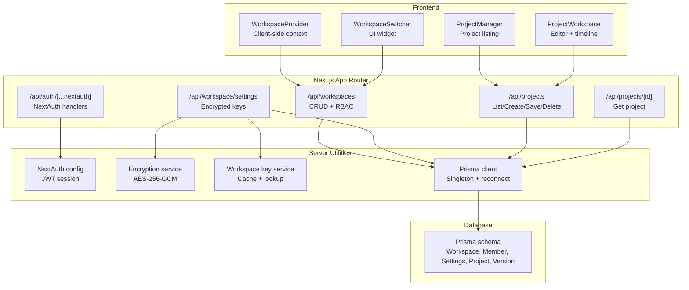
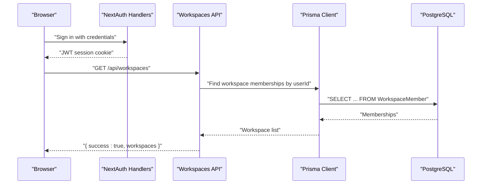
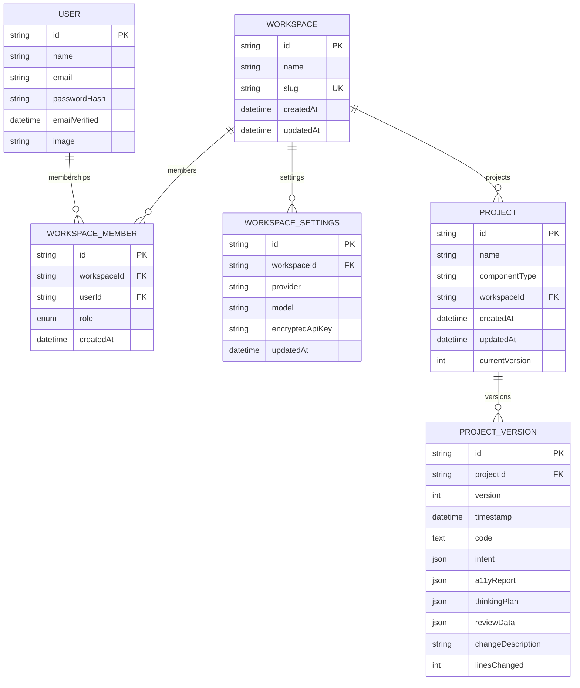
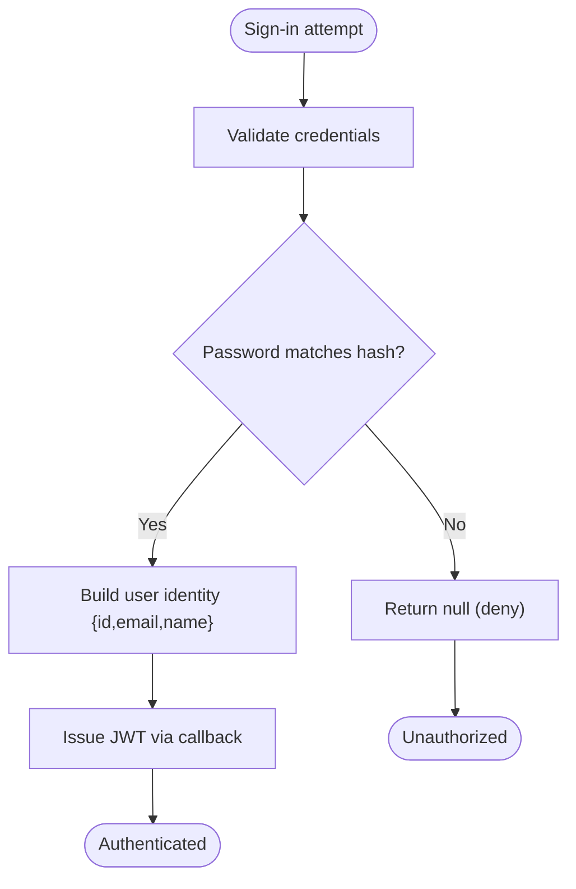
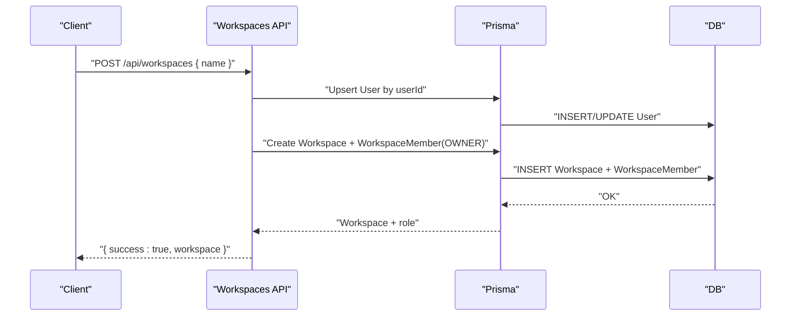
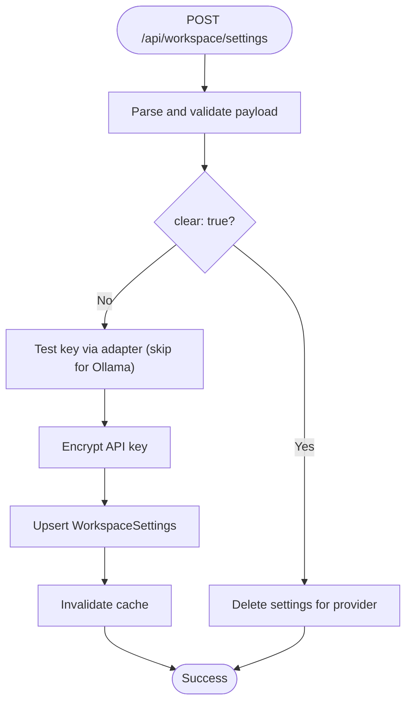
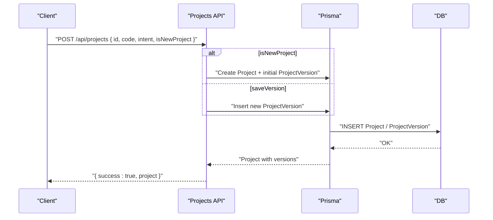
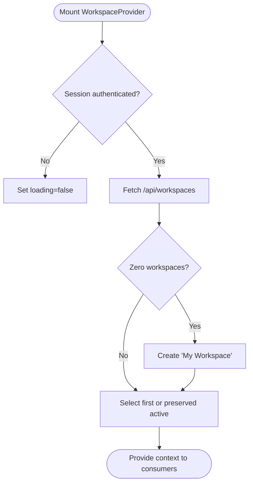
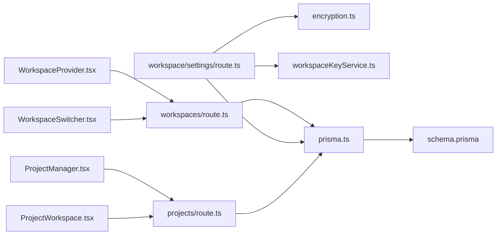

# Workspace & Multi-Tenancy

<cite>
**Referenced Files in This Document**
- [schema.prisma](file://prisma/schema.prisma)
- [route.ts](file://app/api/auth/[...nextauth]/route.ts)
- [auth.ts](file://lib/auth.ts)
- [WorkspaceProvider.tsx](file://components/workspace/WorkspaceProvider.tsx)
- [WorkspaceSwitcher.tsx](file://components/workspace/WorkspaceSwitcher.tsx)
- [route.ts](file://app/api/workspaces/route.ts)
- [route.ts](file://app/api/workspace/settings/route.ts)
- [route.ts](file://app/api/projects/route.ts)
- [route.ts](file://app/api/projects/[id]/route.ts)
- [encryption.ts](file://lib/security/encryption.ts)
- [workspaceKeyService.ts](file://lib/security/workspaceKeyService.ts)
- [prisma.ts](file://lib/prisma.ts)
- [ProjectManager.tsx](file://components/ProjectManager.tsx)
- [ProjectWorkspace.tsx](file://components/ProjectWorkspace.tsx)
- [20260403065359_init_workspace_settings/migration.sql](file://prisma/migrations/20260403065359_init_workspace_settings/migration.sql)
- [20260407120000_add_project_model/migration.sql](file://prisma/migrations/20260407120000_add_project_model/migration.sql)
</cite>

## Table of Contents
1. [Introduction](#introduction)
2. [Project Structure](#project-structure)
3. [Core Components](#core-components)
4. [Architecture Overview](#architecture-overview)
5. [Detailed Component Analysis](#detailed-component-analysis)
6. [Dependency Analysis](#dependency-analysis)
7. [Performance Considerations](#performance-considerations)
8. [Troubleshooting Guide](#troubleshooting-guide)
9. [Conclusion](#conclusion)
10. [Appendices](#appendices)

## Introduction
This document explains the workspace management and multi-tenancy system that isolates user data and workspaces, defines user roles and permissions, and documents workspace settings configuration. It also covers the project persistence system including lifecycle management, version control and history tracking, and collaboration features. Authentication and authorization are implemented with NextAuth.js, session management, and role-based access control. The database schema for workspaces, projects, and user relationships is documented, along with API endpoints for workspace management, project CRUD operations, and permission handling. Finally, it provides examples of workspace setup, team collaboration workflows, and data isolation patterns.

## Project Structure
The workspace and multi-tenancy system spans several layers:
- Authentication and session management via NextAuth.js
- Workspace and membership management with RBAC
- Workspace settings storage with encryption and caching
- Project persistence with version history and collaboration-friendly UI
- Database schema and migrations for multi-tenancy primitives

**Diagram sources**
- [WorkspaceProvider.tsx:1-155](file://components/workspace/WorkspaceProvider.tsx#L1-L155)
- [WorkspaceSwitcher.tsx:1-196](file://components/workspace/WorkspaceSwitcher.tsx#L1-L196)
- [route.ts:1-4](file://app/api/auth/[...nextauth]/route.ts#L1-L4)
- [auth.ts:1-87](file://lib/auth.ts#L1-L87)
- [route.ts:1-145](file://app/api/workspaces/route.ts#L1-L145)
- [route.ts:1-147](file://app/api/workspace/settings/route.ts#L1-L147)
- [route.ts:1-92](file://app/api/projects/route.ts#L1-L92)
- [route.ts:1-12](file://app/api/projects/[id]/route.ts#L1-L12)
- [encryption.ts:1-95](file://lib/security/encryption.ts#L1-L95)
- [workspaceKeyService.ts:1-138](file://lib/security/workspaceKeyService.ts#L1-L138)
- [prisma.ts:1-70](file://lib/prisma.ts#L1-L70)
- [schema.prisma:1-222](file://prisma/schema.prisma#L1-L222)

**Section sources**
- [route.ts:1-4](file://app/api/auth/[...nextauth]/route.ts#L1-L4)
- [auth.ts:1-87](file://lib/auth.ts#L1-L87)
- [WorkspaceProvider.tsx:1-155](file://components/workspace/WorkspaceProvider.tsx#L1-L155)
- [WorkspaceSwitcher.tsx:1-196](file://components/workspace/WorkspaceSwitcher.tsx#L1-L196)
- [route.ts:1-145](file://app/api/workspaces/route.ts#L1-L145)
- [route.ts:1-147](file://app/api/workspace/settings/route.ts#L1-L147)
- [route.ts:1-92](file://app/api/projects/route.ts#L1-L92)
- [route.ts:1-12](file://app/api/projects/[id]/route.ts#L1-L12)
- [encryption.ts:1-95](file://lib/security/encryption.ts#L1-L95)
- [workspaceKeyService.ts:1-138](file://lib/security/workspaceKeyService.ts#L1-L138)
- [prisma.ts:1-70](file://lib/prisma.ts#L1-L70)
- [schema.prisma:1-222](file://prisma/schema.prisma#L1-L222)

## Core Components
- Multi-tenant models and relations:
  - Workspace: tenant container with members and projects
  - WorkspaceMember: user-role mapping with unique workspace-user constraint
  - WorkspaceSettings: per-provider encrypted keys scoped to workspace
  - Project and ProjectVersion: persistent project history with JSON metadata
- Authentication and session:
  - NextAuth.js with JWT strategy and credential provider
  - Session includes user identity for workspace membership checks
- Workspace management:
  - Create/delete/list workspaces with role-based access
  - Auto-provision first workspace for new users
- Workspace settings:
  - Encrypted API keys per provider, with validation and cache invalidation
- Project persistence:
  - Create/update projects and manage versions with rollback support
  - UI components for project listing and version timeline

**Section sources**
- [schema.prisma:64-187](file://prisma/schema.prisma#L64-L187)
- [auth.ts:11-87](file://lib/auth.ts#L11-L87)
- [WorkspaceProvider.tsx:27-127](file://components/workspace/WorkspaceProvider.tsx#L27-L127)
- [route.ts:31-144](file://app/api/workspaces/route.ts#L31-L144)
- [route.ts:34-146](file://app/api/workspace/settings/route.ts#L34-L146)
- [route.ts:7-91](file://app/api/projects/route.ts#L7-L91)
- [ProjectManager.tsx:31-72](file://components/ProjectManager.tsx#L31-L72)
- [ProjectWorkspace.tsx:111-133](file://components/ProjectWorkspace.tsx#L111-L133)

## Architecture Overview
The system enforces strict data isolation per workspace using foreign keys and membership checks. Authentication is centralized via NextAuth.js, and workspace membership determines access to resources. Workspace settings are encrypted and cached for performance. Projects are persisted with version history enabling collaboration and rollback.

**Diagram sources**
- [route.ts:1-4](file://app/api/auth/[...nextauth]/route.ts#L1-L4)
- [auth.ts:11-87](file://lib/auth.ts#L11-L87)
- [route.ts:31-45](file://app/api/workspaces/route.ts#L31-L45)
- [prisma.ts:20-70](file://lib/prisma.ts#L20-L70)

**Section sources**
- [route.ts:31-45](file://app/api/workspaces/route.ts#L31-L45)
- [prisma.ts:20-70](file://lib/prisma.ts#L20-L70)

## Detailed Component Analysis

### Multi-Tenant Data Model
The schema defines core multi-tenancy primitives:
- Workspace: tenant entity with unique slug and collections of members, settings, projects, usage logs, and feedback entries
- WorkspaceMember: enforces unique workspace-user pairing and role assignment
- WorkspaceSettings: per-workspace, per-provider encrypted keys
- Project and ProjectVersion: project metadata and immutable versions with JSON intent/a11y reports

**Diagram sources**
- [schema.prisma:40-187](file://prisma/schema.prisma#L40-L187)

**Section sources**
- [schema.prisma:40-187](file://prisma/schema.prisma#L40-L187)

### Authentication and Authorization (NextAuth.js)
- Provider: Credentials with bcrypt-compare against a stored hash
- Session: JWT strategy with 7-day max age
- Callbacks: attach user identity to JWT and session
- Pages: redirects to login on auth errors

**Diagram sources**
- [auth.ts:25-58](file://lib/auth.ts#L25-L58)

**Section sources**
- [auth.ts:11-87](file://lib/auth.ts#L11-L87)

### Workspace Management API
- GET /api/workspaces: lists workspaces and roles for the authenticated user
- POST /api/workspaces: creates a workspace and grants OWNER membership atomically
- DELETE /api/workspaces?id=: deletes a workspace if the caller is OWNER

**Diagram sources**
- [route.ts:74-108](file://app/api/workspaces/route.ts#L74-L108)
- [prisma.ts:58-70](file://lib/prisma.ts#L58-L70)

**Section sources**
- [route.ts:31-144](file://app/api/workspaces/route.ts#L31-L144)

### Workspace Settings and Encryption
- GET /api/workspace/settings: returns provider models and presence of keys (without exposing secrets)
- POST /api/workspace/settings: validates key via lightweight adapter test, encrypts, persists, and invalidates cache
- Encryption service supports AES-256-GCM with flexible key derivation
- Workspace key service caches decrypted keys per workspace/provider with TTL and optional user membership verification

**Diagram sources**
- [route.ts:59-146](file://app/api/workspace/settings/route.ts#L59-L146)
- [encryption.ts:27-69](file://lib/security/encryption.ts#L27-L69)
- [workspaceKeyService.ts:32-95](file://lib/security/workspaceKeyService.ts#L32-L95)

**Section sources**
- [route.ts:34-146](file://app/api/workspace/settings/route.ts#L34-L146)
- [encryption.ts:1-95](file://lib/security/encryption.ts#L1-L95)
- [workspaceKeyService.ts:1-138](file://lib/security/workspaceKeyService.ts#L1-L138)

### Project Persistence and Version Control
- List/create/save/delete projects via /api/projects
- Retrieve individual projects via /api/projects/[id]
- Project versions capture immutable snapshots with intent, a11y report, and change descriptions
- UI supports version timeline and rollback to previous versions

**Diagram sources**
- [route.ts:16-81](file://app/api/projects/route.ts#L16-L81)
- [schema.prisma:158-187](file://prisma/schema.prisma#L158-L187)

**Section sources**
- [route.ts:7-91](file://app/api/projects/route.ts#L7-L91)
- [route.ts:4-11](file://app/api/projects/[id]/route.ts#L4-L11)
- [schema.prisma:158-187](file://prisma/schema.prisma#L158-L187)

### Client-Side Workspace Context and UI
- WorkspaceProvider fetches and manages workspaces, auto-creating a default workspace for new users
- WorkspaceSwitcher renders the workspace list, creation UI, and deletion controls for owners
- ProjectManager lists projects and supports inline deletion
- ProjectWorkspace displays version timeline and handles rollback

**Diagram sources**
- [WorkspaceProvider.tsx:88-127](file://components/workspace/WorkspaceProvider.tsx#L88-L127)
- [WorkspaceSwitcher.tsx:32-55](file://components/workspace/WorkspaceSwitcher.tsx#L32-L55)
- [ProjectManager.tsx:49-72](file://components/ProjectManager.tsx#L49-L72)
- [ProjectWorkspace.tsx:111-133](file://components/ProjectWorkspace.tsx#L111-L133)

**Section sources**
- [WorkspaceProvider.tsx:27-146](file://components/workspace/WorkspaceProvider.tsx#L27-L146)
- [WorkspaceSwitcher.tsx:1-196](file://components/workspace/WorkspaceSwitcher.tsx#L1-L196)
- [ProjectManager.tsx:1-231](file://components/ProjectManager.tsx#L1-L231)
- [ProjectWorkspace.tsx:1-313](file://components/ProjectWorkspace.tsx#L1-L313)

## Dependency Analysis
- WorkspaceProvider depends on NextAuth session and fetches workspaces
- Workspaces API depends on NextAuth for session, Prisma for persistence, and uses reconnect wrapper for transient DB errors
- Workspace settings API depends on encryption and key service utilities
- Project APIs depend on Prisma and project store functions
- Database schema enforces referential integrity and uniqueness constraints

**Diagram sources**
- [WorkspaceProvider.tsx:1-155](file://components/workspace/WorkspaceProvider.tsx#L1-L155)
- [WorkspaceSwitcher.tsx:1-196](file://components/workspace/WorkspaceSwitcher.tsx#L1-L196)
- [route.ts:1-145](file://app/api/workspaces/route.ts#L1-L145)
- [route.ts:1-147](file://app/api/workspace/settings/route.ts#L1-L147)
- [route.ts:1-92](file://app/api/projects/route.ts#L1-L92)
- [encryption.ts:1-95](file://lib/security/encryption.ts#L1-L95)
- [workspaceKeyService.ts:1-138](file://lib/security/workspaceKeyService.ts#L1-L138)
- [prisma.ts:1-70](file://lib/prisma.ts#L1-L70)
- [schema.prisma:1-222](file://prisma/schema.prisma#L1-L222)

**Section sources**
- [prisma.ts:1-70](file://lib/prisma.ts#L1-L70)
- [schema.prisma:1-222](file://prisma/schema.prisma#L1-L222)

## Performance Considerations
- Prisma singleton with reconnect: reduces connection churn and retries on transient Neon errors
- Workspace settings cache: TTL-based in-memory cache avoids repeated DB lookups and decryption
- Encryption fallback: graceful handling of missing keys with warnings to prevent build failures
- Client-side workspace provisioning: minimal network round-trips by auto-creating default workspace on first login

[No sources needed since this section provides general guidance]

## Troubleshooting Guide
- Authentication fails:
  - Verify environment variables for NextAuth secret and owner password hash
  - Confirm bcrypt hash validity and absence of extra quotes
- Workspace creation fails:
  - Ensure user exists in DB before creating membership
  - Check uniqueness constraints on workspace slug and member pairs
- Workspace settings save fails:
  - Validate provider-specific model and key
  - Confirm encryption secret is properly configured
  - Invalidate cache after manual DB changes
- Project version rollback fails:
  - Ensure project exists and caller has access to workspace
  - Confirm version number exists for the project

**Section sources**
- [auth.ts:5-10](file://lib/auth.ts#L5-L10)
- [route.ts:74-108](file://app/api/workspaces/route.ts#L74-L108)
- [route.ts:101-118](file://app/api/workspace/settings/route.ts#L101-L118)
- [encryption.ts:81-94](file://lib/security/encryption.ts#L81-L94)
- [workspaceKeyService.ts:100-106](file://lib/security/workspaceKeyService.ts#L100-L106)

## Conclusion
The workspace and multi-tenancy system provides strong data isolation through foreign keys and membership checks, secure credential management with encryption and cache, and robust project persistence with version control. NextAuth.js centralizes authentication and session handling, while the frontend components deliver a seamless workspace switching and project management experience.

[No sources needed since this section summarizes without analyzing specific files]

## Appendices

### Database Migrations Overview
- Initial workspace settings and usage logging tables
- Project and project version tables with foreign keys and unique constraints

**Section sources**
- [20260403065359_init_workspace_settings/migration.sql:1-32](file://prisma/migrations/20260403065359_init_workspace_settings/migration.sql#L1-L32)
- [20260407120000_add_project_model/migration.sql:1-37](file://prisma/migrations/20260407120000_add_project_model/migration.sql#L1-L37)

### API Reference Summary
- Authentication
  - POST /api/auth/[...nextauth] — NextAuth handler entrypoint
- Workspace Management
  - GET /api/workspaces — list workspaces and roles
  - POST /api/workspaces — create workspace and grant OWNER
  - DELETE /api/workspaces?id= — delete workspace (OWNER only)
- Workspace Settings
  - GET /api/workspace/settings — list providers and models
  - POST /api/workspace/settings — validate and save provider key
- Project Management
  - GET /api/projects — list projects
  - POST /api/projects — create or save project/version
  - GET /api/projects/[id] — get project by id

**Section sources**
- [route.ts:1-4](file://app/api/auth/[...nextauth]/route.ts#L1-L4)
- [route.ts:31-144](file://app/api/workspaces/route.ts#L31-L144)
- [route.ts:34-146](file://app/api/workspace/settings/route.ts#L34-L146)
- [route.ts:7-91](file://app/api/projects/route.ts#L7-L91)
- [route.ts:4-11](file://app/api/projects/[id]/route.ts#L4-L11)

### Examples

#### Workspace Setup
- On first login, if no workspaces exist, the client auto-creates a default workspace named “My Workspace” and selects it.

**Section sources**
- [WorkspaceProvider.tsx:103-107](file://components/workspace/WorkspaceProvider.tsx#L103-L107)

#### Team Collaboration Workflow
- Owner creates a workspace and invites members (via external onboarding). Members gain access to workspace projects and settings based on their role. Owners can delete workspaces and manage keys.

**Section sources**
- [route.ts:126-133](file://app/api/workspaces/route.ts#L126-L133)
- [schema.prisma:78-95](file://prisma/schema.prisma#L78-L95)

#### Data Isolation Patterns
- All workspace-scoped entities (projects, settings, usage logs) reference the workspace via foreign keys. Membership checks ensure users only access workspaces they belong to.

**Section sources**
- [schema.prisma:158-187](file://prisma/schema.prisma#L158-L187)
- [workspaceKeyService.ts:37-45](file://lib/security/workspaceKeyService.ts#L37-L45)