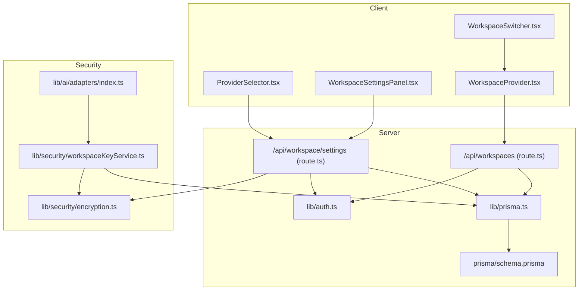
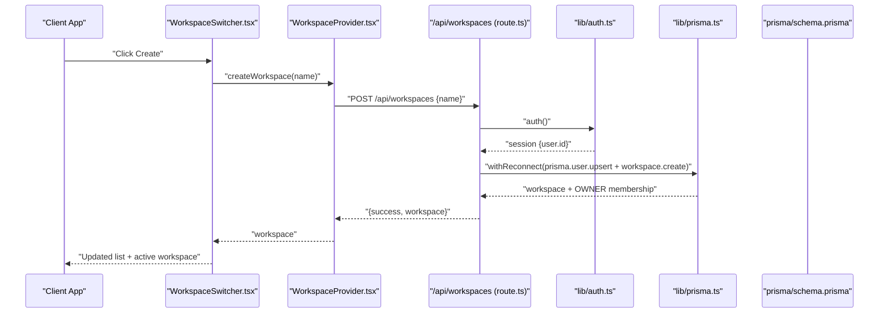
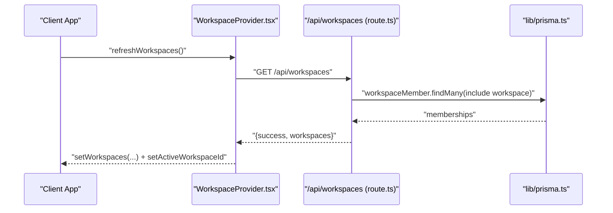
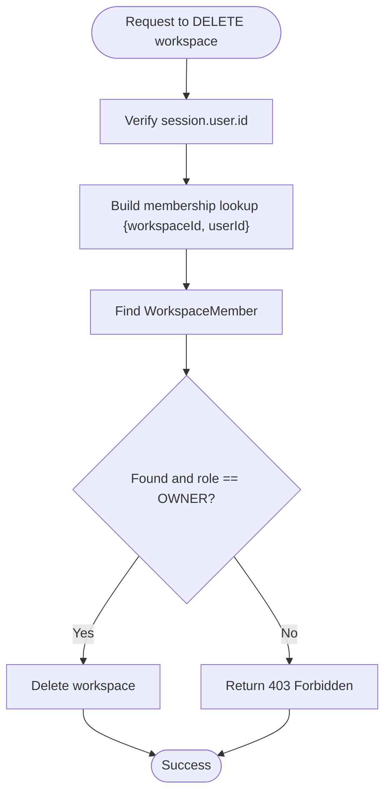
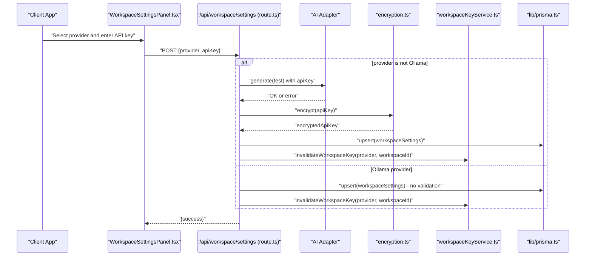
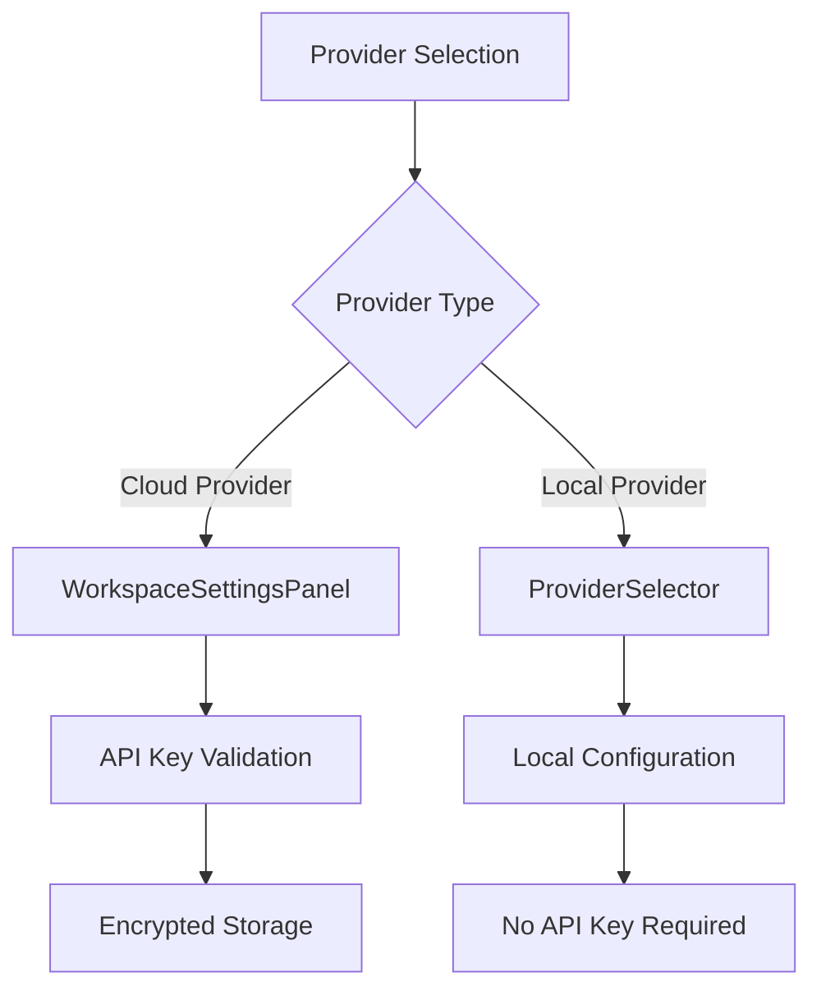
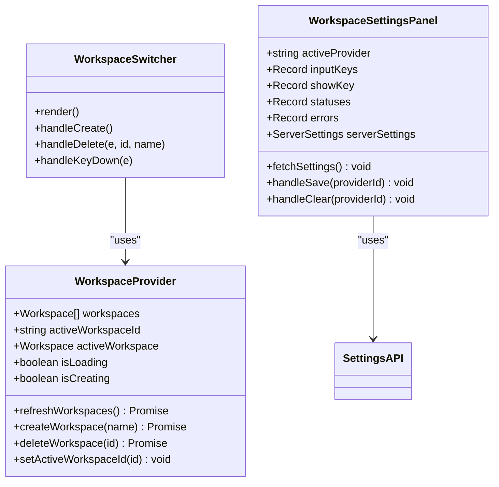
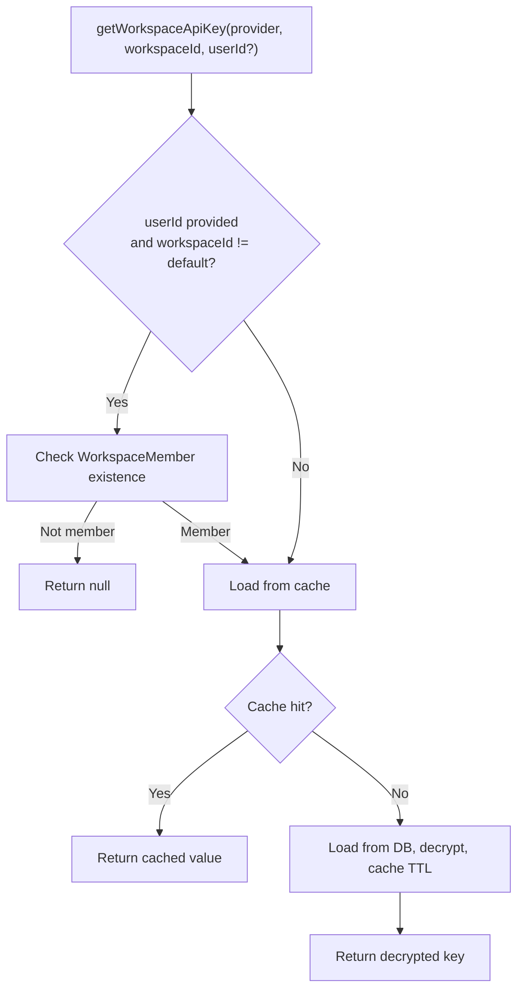
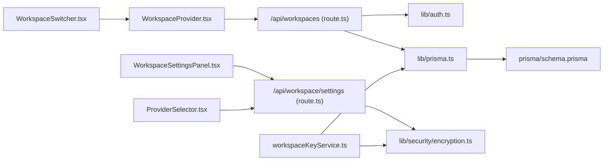

# Workspace Management

<cite>
**Referenced Files in This Document**
- [app/api/workspaces/route.ts](file://app/api/workspaces/route.ts)
- [app/api/workspace/settings/route.ts](file://app/api/workspace/settings/route.ts)
- [components/workspace/WorkspaceProvider.tsx](file://components/workspace/WorkspaceProvider.tsx)
- [components/workspace/WorkspaceSwitcher.tsx](file://components/workspace/WorkspaceSwitcher.tsx)
- [components/WorkspaceSettingsPanel.tsx](file://components/WorkspaceSettingsPanel.tsx)
- [components/ProviderSelector.tsx](file://components/ProviderSelector.tsx)
- [lib/prisma.ts](file://lib/prisma.ts)
- [prisma/schema.prisma](file://prisma/schema.prisma)
- [lib/security/encryption.ts](file://lib/security/encryption.ts)
- [lib/security/workspaceKeyService.ts](file://lib/security/workspaceKeyService.ts)
- [lib/auth.ts](file://lib/auth.ts)
- [lib/ai/adapters/index.ts](file://lib/ai/adapters/index.ts)
- [tmp/verify_multitenancy.ts](file://tmp/verify_multitenancy.ts)
</cite>

## Update Summary
**Changes Made**
- Updated Workspace Settings section to reflect removal of Ollama configuration options from WorkspaceSettingsPanel
- Revised provider configuration documentation to exclude Ollama from workspace settings
- Updated troubleshooting section to address Ollama-related configuration changes
- Clarified that Ollama is still supported in ProviderSelector but not through workspace settings

## Table of Contents
1. [Introduction](#introduction)
2. [Project Structure](#project-structure)
3. [Core Components](#core-components)
4. [Architecture Overview](#architecture-overview)
5. [Detailed Component Analysis](#detailed-component-analysis)
6. [Dependency Analysis](#dependency-analysis)
7. [Performance Considerations](#performance-considerations)
8. [Troubleshooting Guide](#troubleshooting-guide)
9. [Conclusion](#conclusion)

## Introduction
This document explains the workspace management system that powers multi-tenant isolation for user data and projects. Workspaces act as secure containers for projects and users, with role-based access control (OWNER, ADMIN, MEMBER). The system supports workspace creation, configuration, lifecycle management, and secure API key storage. It also documents how workspaces isolate data across tenants, the security boundaries enforced, and performance considerations for multi-tenant deployments.

**Updated** Removed Ollama configuration options from workspace settings panel as part of the applied changes.

## Project Structure
The workspace system spans API routes, client-side providers, database models, and security services:
- API routes expose workspace CRUD and settings management
- Client components manage workspace selection and creation
- Prisma defines multi-tenant models and relations
- Security services handle encryption and key caching
- Authentication integrates with NextAuth and enforces session-based access

**Diagram sources**
- [components/workspace/WorkspaceProvider.tsx:1-155](file://components/workspace/WorkspaceProvider.tsx#L1-L155)
- [components/workspace/WorkspaceSwitcher.tsx:1-196](file://components/workspace/WorkspaceSwitcher.tsx#L1-L196)
- [components/WorkspaceSettingsPanel.tsx:1-426](file://components/WorkspaceSettingsPanel.tsx#L1-L426)
- [components/ProviderSelector.tsx:1-375](file://components/ProviderSelector.tsx#L1-L375)
- [app/api/workspaces/route.ts:1-145](file://app/api/workspaces/route.ts#L1-L145)
- [app/api/workspace/settings/route.ts:1-147](file://app/api/workspace/settings/route.ts#L1-L147)
- [lib/auth.ts:1-87](file://lib/auth.ts#L1-L87)
- [lib/prisma.ts:1-70](file://lib/prisma.ts#L1-L70)
- [prisma/schema.prisma:1-222](file://prisma/schema.prisma#L1-L222)
- [lib/security/encryption.ts:1-95](file://lib/security/encryption.ts#L1-L95)
- [lib/security/workspaceKeyService.ts:1-138](file://lib/security/workspaceKeyService.ts#L1-L138)
- [lib/ai/adapters/index.ts:1-289](file://lib/ai/adapters/index.ts#L1-L289)

**Section sources**
- [components/workspace/WorkspaceProvider.tsx:1-155](file://components/workspace/WorkspaceProvider.tsx#L1-L155)
- [components/workspace/WorkspaceSwitcher.tsx:1-196](file://components/workspace/WorkspaceSwitcher.tsx#L1-L196)
- [components/WorkspaceSettingsPanel.tsx:1-426](file://components/WorkspaceSettingsPanel.tsx#L1-L426)
- [components/ProviderSelector.tsx:1-375](file://components/ProviderSelector.tsx#L1-L375)
- [app/api/workspaces/route.ts:1-145](file://app/api/workspaces/route.ts#L1-L145)
- [app/api/workspace/settings/route.ts:1-147](file://app/api/workspace/settings/route.ts#L1-L147)
- [lib/auth.ts:1-87](file://lib/auth.ts#L1-L87)
- [lib/prisma.ts:1-70](file://lib/prisma.ts#L1-L70)
- [prisma/schema.prisma:1-222](file://prisma/schema.prisma#L1-L222)
- [lib/security/encryption.ts:1-95](file://lib/security/encryption.ts#L1-L95)
- [lib/security/workspaceKeyService.ts:1-138](file://lib/security/workspaceKeyService.ts#L1-L138)
- [lib/ai/adapters/index.ts:1-289](file://lib/ai/adapters/index.ts#L1-L289)

## Core Components
- WorkspaceProvider: Client-side context managing workspaces, active workspace, creation/deletion, and auto-provisioning
- WorkspaceSwitcher: UI component for selecting, creating, and deleting workspaces
- WorkspaceSettingsPanel: Secure API key management interface for cloud providers (OpenAI, Anthropic, Google, Groq)
- ProviderSelector: Provider selection component supporting both cloud providers and local Ollama
- Workspaces API: Server endpoints for listing, creating, and deleting workspaces with RBAC checks
- Workspace Settings API: Securely stores and validates provider API keys per workspace
- Security Services: Encryption for API keys and in-memory cache with TTL for decrypted keys
- Prisma Models: Multi-tenant schema with Workspace, WorkspaceMember, WorkspaceSettings, and related entities
- Authentication: Session-based auth enforcing access to workspace resources

**Updated** Removed Ollama from WorkspaceSettingsPanel provider configuration while maintaining Ollama support in ProviderSelector.

**Section sources**
- [components/workspace/WorkspaceProvider.tsx:1-155](file://components/workspace/WorkspaceProvider.tsx#L1-L155)
- [components/workspace/WorkspaceSwitcher.tsx:1-196](file://components/workspace/WorkspaceSwitcher.tsx#L1-L196)
- [components/WorkspaceSettingsPanel.tsx:1-426](file://components/WorkspaceSettingsPanel.tsx#L1-L426)
- [components/ProviderSelector.tsx:1-375](file://components/ProviderSelector.tsx#L1-L375)
- [app/api/workspaces/route.ts:1-145](file://app/api/workspaces/route.ts#L1-L145)
- [app/api/workspace/settings/route.ts:1-147](file://app/api/workspace/settings/route.ts#L1-L147)
- [lib/security/encryption.ts:1-95](file://lib/security/encryption.ts#L1-L95)
- [lib/security/workspaceKeyService.ts:1-138](file://lib/security/workspaceKeyService.ts#L1-L138)
- [prisma/schema.prisma:64-110](file://prisma/schema.prisma#L64-L110)
- [lib/auth.ts:1-87](file://lib/auth.ts#L1-L87)

## Architecture Overview
The workspace system enforces multi-tenant isolation through:
- Workspace containerization: Projects and usage logs belong to a workspace
- Membership-based access: WorkspaceMember links users to workspaces with roles
- Provider settings per workspace: Encrypted API keys stored separately per provider
- Session-scoped access: All endpoints require a valid session
- Cache with TTL: Decrypted keys refreshed periodically to balance performance and security

**Updated** Workspace settings now support cloud providers only (OpenAI, Anthropic, Google, Groq), with Ollama managed separately through ProviderSelector.

**Diagram sources**
- [components/workspace/WorkspaceSwitcher.tsx:32-45](file://components/workspace/WorkspaceSwitcher.tsx#L32-L45)
- [components/workspace/WorkspaceProvider.tsx:35-58](file://components/workspace/WorkspaceProvider.tsx#L35-L58)
- [app/api/workspaces/route.ts:47-109](file://app/api/workspaces/route.ts#L47-L109)
- [lib/auth.ts:11-87](file://lib/auth.ts#L11-L87)
- [lib/prisma.ts:58-69](file://lib/prisma.ts#L58-L69)
- [prisma/schema.prisma:64-95](file://prisma/schema.prisma#L64-L95)

## Detailed Component Analysis

### Multi-Tenant Data Model
Workspaces are the primary tenant boundary. Users join workspaces via WorkspaceMember with roles. WorkspaceSettings stores provider configurations per workspace. Projects and usage logs are scoped to workspaces.

```mermaid
erDiagram
USER {
string id PK
string name
string email
}
WORKSPACE {
string id PK
string name
string slug
}
WORKSPACE_MEMBER {
string id PK
string workspaceId FK
string userId FK
enum role
}
WORKSPACE_SETTINGS {
string id PK
string workspaceId FK
string provider
string encrypted_api_key
string model
}
PROJECT {
string id PK
string name
string workspaceId FK
}
USAGE_LOG {
string id PK
string workspaceId FK
string provider
string model
}
USER ||--o{ WORKSPACE_MEMBER : "membership"
WORKSPACE ||--o{ WORKSPACE_MEMBER : "members"
WORKSPACE ||--o{ WORKSPACE_SETTINGS : "settings"
WORKSPACE ||--o{ PROJECT : "projects"
WORKSPACE ||--o{ USAGE_LOG : "usage_logs"
```

**Diagram sources**
- [prisma/schema.prisma:40-95](file://prisma/schema.prisma#L40-L95)
- [prisma/schema.prisma:99-126](file://prisma/schema.prisma#L99-L126)
- [prisma/schema.prisma:158-187](file://prisma/schema.prisma#L158-L187)
- [prisma/schema.prisma:112-126](file://prisma/schema.prisma#L112-L126)

**Section sources**
- [prisma/schema.prisma:40-126](file://prisma/schema.prisma#L40-L126)

### Workspace Lifecycle Management
- Listing: GET /api/workspaces returns workspaces and membership roles for the authenticated user
- Creation: POST /api/workspaces creates a workspace and assigns the creator as OWNER
- Deletion: DELETE /api/workspaces requires OWNER role and workspaceId query param

**Diagram sources**
- [components/workspace/WorkspaceProvider.tsx:89-123](file://components/workspace/WorkspaceProvider.tsx#L89-L123)
- [app/api/workspaces/route.ts:31-45](file://app/api/workspaces/route.ts#L31-L45)
- [lib/prisma.ts:58-69](file://lib/prisma.ts#L58-L69)

**Section sources**
- [app/api/workspaces/route.ts:31-145](file://app/api/workspaces/route.ts#L31-L145)
- [components/workspace/WorkspaceProvider.tsx:89-123](file://components/workspace/WorkspaceProvider.tsx#L89-L123)

### Role-Based Access Control (RBAC)
- Roles: OWNER, ADMIN, MEMBER
- Ownership enforcement: Only OWNER can delete a workspace
- Authorization checks: WorkspaceMember records enforce access to workspace resources

**Diagram sources**
- [app/api/workspaces/route.ts:111-144](file://app/api/workspaces/route.ts#L111-L144)
- [prisma/schema.prisma:78-95](file://prisma/schema.prisma#L78-L95)

**Section sources**
- [app/api/workspaces/route.ts:111-144](file://app/api/workspaces/route.ts#L111-L144)
- [prisma/schema.prisma:78-95](file://prisma/schema.prisma#L78-L95)

### Workspace Settings and API Key Management
- Settings endpoint: GET returns provider configurations; POST validates and stores encrypted keys
- Validation: Lightweight test call against provider unless Ollama (no key)
- Storage: Encrypted API keys per provider per workspace
- Retrieval: getWorkspaceApiKey decrypts and caches keys with TTL

**Updated** Workspace settings panel now supports only cloud providers (OpenAI, Anthropic, Google, Groq). Ollama configuration is managed separately through ProviderSelector.

**Diagram sources**
- [components/WorkspaceSettingsPanel.tsx:127-159](file://components/WorkspaceSettingsPanel.tsx#L127-L159)
- [app/api/workspace/settings/route.ts:59-146](file://app/api/workspace/settings/route.ts#L59-L146)
- [lib/security/encryption.ts:27-68](file://lib/security/encryption.ts#L27-L68)
- [lib/security/workspaceKeyService.ts:32-95](file://lib/security/workspaceKeyService.ts#L32-L95)
- [lib/prisma.ts:58-69](file://lib/prisma.ts#L58-L69)

**Section sources**
- [components/WorkspaceSettingsPanel.tsx:1-426](file://components/WorkspaceSettingsPanel.tsx#L1-L426)
- [app/api/workspace/settings/route.ts:1-147](file://app/api/workspace/settings/route.ts#L1-L147)
- [lib/security/encryption.ts:1-95](file://lib/security/encryption.ts#L1-L95)
- [lib/security/workspaceKeyService.ts:1-138](file://lib/security/workspaceKeyService.ts#L1-L138)

### Provider Configuration and Support
The system supports multiple AI providers with different configuration approaches:

**Cloud Providers (configured through Workspace Settings):**
- OpenAI: GPT models with API key validation
- Anthropic: Claude models with API key validation  
- Google Gemini: Gemini models with API key validation
- Groq: OpenAI-compatible models with API key validation

**Local Provider (configured through Provider Selector):**
- Ollama: Local model inference with no API key required

**Updated** Removed Ollama from workspace settings configuration while maintaining support in ProviderSelector.

**Diagram sources**
- [components/WorkspaceSettingsPanel.tsx:23-64](file://components/WorkspaceSettingsPanel.tsx#L23-L64)
- [components/ProviderSelector.tsx:34-101](file://components/ProviderSelector.tsx#L34-L101)
- [app/api/workspace/settings/route.ts:91-119](file://app/api/workspace/settings/route.ts#L91-L119)

**Section sources**
- [components/WorkspaceSettingsPanel.tsx:1-426](file://components/WorkspaceSettingsPanel.tsx#L1-L426)
- [components/ProviderSelector.tsx:1-375](file://components/ProviderSelector.tsx#L1-L375)
- [app/api/workspace/settings/route.ts:1-147](file://app/api/workspace/settings/route.ts#L1-L147)
- [lib/ai/adapters/index.ts:1-289](file://lib/ai/adapters/index.ts#L1-L289)

### Client-Side Workspace Management
- WorkspaceProvider: Fetches workspaces, auto-provisions first workspace, manages active workspace, and exposes create/delete helpers
- WorkspaceSwitcher: Renders workspace list, handles creation, deletion, and selection
- WorkspaceSettingsPanel: Manages API key configuration for cloud providers with validation and error handling

**Updated** WorkspaceSettingsPanel now excludes Ollama from provider configuration options.

**Diagram sources**
- [components/workspace/WorkspaceProvider.tsx:13-145](file://components/workspace/WorkspaceProvider.tsx#L13-L145)
- [components/workspace/WorkspaceSwitcher.tsx:7-196](file://components/workspace/WorkspaceSwitcher.tsx#L7-L196)
- [components/WorkspaceSettingsPanel.tsx:86-179](file://components/WorkspaceSettingsPanel.tsx#L86-L179)

**Section sources**
- [components/workspace/WorkspaceProvider.tsx:1-155](file://components/workspace/WorkspaceProvider.tsx#L1-L155)
- [components/workspace/WorkspaceSwitcher.tsx:1-196](file://components/workspace/WorkspaceSwitcher.tsx#L1-L196)
- [components/WorkspaceSettingsPanel.tsx:1-426](file://components/WorkspaceSettingsPanel.tsx#L1-L426)

### Data Isolation and Security Boundaries
- Tenant isolation: Queries filter by workspaceId; membership checks prevent cross-tenant access
- Key isolation: Each workspace/provider pair stores its own encrypted key
- Cache isolation: In-memory cache keyed by workspaceId:provider
- Fallback behavior: getWorkspaceApiKey falls back to any workspace when workspaceId is default

**Diagram sources**
- [lib/security/workspaceKeyService.ts:32-95](file://lib/security/workspaceKeyService.ts#L32-L95)

**Section sources**
- [lib/security/workspaceKeyService.ts:1-138](file://lib/security/workspaceKeyService.ts#L1-L138)
- [tmp/verify_multitenancy.ts:1-70](file://tmp/verify_multitenancy.ts#L1-L70)

## Dependency Analysis
- WorkspaceProvider depends on NextAuth session and fetches from Workspaces API
- Workspaces API depends on NextAuth for session and Prisma for persistence
- Settings API depends on encryption service and Prisma; retrieves keys via workspaceKeyService
- Prisma models define foreign keys and uniqueness constraints ensuring referential integrity
- ProviderSelector integrates with both WorkspaceSettingsPanel and direct provider configuration

**Updated** Added dependency on ProviderSelector for local provider configuration.

**Diagram sources**
- [components/workspace/WorkspaceProvider.tsx:1-155](file://components/workspace/WorkspaceProvider.tsx#L1-L155)
- [components/workspace/WorkspaceSwitcher.tsx:1-196](file://components/workspace/WorkspaceSwitcher.tsx#L1-L196)
- [components/WorkspaceSettingsPanel.tsx:1-426](file://components/WorkspaceSettingsPanel.tsx#L1-L426)
- [components/ProviderSelector.tsx:1-375](file://components/ProviderSelector.tsx#L1-L375)
- [app/api/workspaces/route.ts:1-145](file://app/api/workspaces/route.ts#L1-L145)
- [app/api/workspace/settings/route.ts:1-147](file://app/api/workspace/settings/route.ts#L1-L147)
- [lib/auth.ts:1-87](file://lib/auth.ts#L1-L87)
- [lib/prisma.ts:1-70](file://lib/prisma.ts#L1-L70)
- [lib/security/encryption.ts:1-95](file://lib/security/encryption.ts#L1-L95)
- [lib/security/workspaceKeyService.ts:1-138](file://lib/security/workspaceKeyService.ts#L1-L138)
- [prisma/schema.prisma:1-222](file://prisma/schema.prisma#L1-L222)

**Section sources**
- [prisma/schema.prisma:64-110](file://prisma/schema.prisma#L64-L110)
- [lib/prisma.ts:1-70](file://lib/prisma.ts#L1-L70)

## Performance Considerations
- Connection pooling: Prisma singleton with reconnect logic mitigates transient Neon connection issues
- Cache TTL: Keys cached for 5 minutes to reduce DB lookups while maintaining freshness
- Minimal payload: Workspace listing includes counts and slugs to minimize client-side computation
- Auto-provisioning: First-time users get a default workspace to reduce friction
- Provider optimization: Separate handling for local vs cloud providers reduces unnecessary validation overhead

**Updated** Added optimization for local provider handling to avoid unnecessary validation steps.

## Troubleshooting Guide
- Unauthorized access: Ensure a valid session is present; endpoints return 401 when missing
- Workspace creation failures: Verify name length and JSON payload; check server logs for DB errors
- Key validation failures: Provider test call may fail due to invalid key or network issues; adjust provider/model accordingly
- Key not found: getWorkspaceApiKey returns null when user lacks membership or key is not set; confirm workspaceId and membership
- Connection drops: withReconnect retries once after a brief delay; ensure DATABASE_URL connection limits are configured
- Ollama configuration issues: Ollama is no longer configurable through WorkspaceSettingsPanel; use ProviderSelector instead
- Provider not appearing: Cloud providers (OpenAI, Anthropic, Google, Groq) are supported in WorkspaceSettingsPanel; Ollama requires ProviderSelector configuration

**Updated** Added troubleshooting guidance for Ollama configuration changes and provider availability.

**Section sources**
- [app/api/workspaces/route.ts:31-109](file://app/api/workspaces/route.ts#L31-L109)
- [app/api/workspace/settings/route.ts:59-146](file://app/api/workspace/settings/route.ts#L59-L146)
- [lib/security/workspaceKeyService.ts:32-95](file://lib/security/workspaceKeyService.ts#L32-L95)
- [lib/prisma.ts:58-69](file://lib/prisma.ts#L58-L69)
- [components/WorkspaceSettingsPanel.tsx:1-426](file://components/WorkspaceSettingsPanel.tsx#L1-L426)

## Conclusion
The workspace management system provides robust multi-tenant isolation with clear boundaries between workspaces, secure API key handling, and a seamless user experience for workspace creation and switching. By combining Prisma's relational model, session-based auth, encryption, and caching, it balances security, performance, and developer ergonomics for scalable deployments.

**Updated** The system now separates cloud provider configuration (through WorkspaceSettingsPanel) from local provider configuration (through ProviderSelector), improving clarity and security by limiting workspace settings to cloud-based providers only.