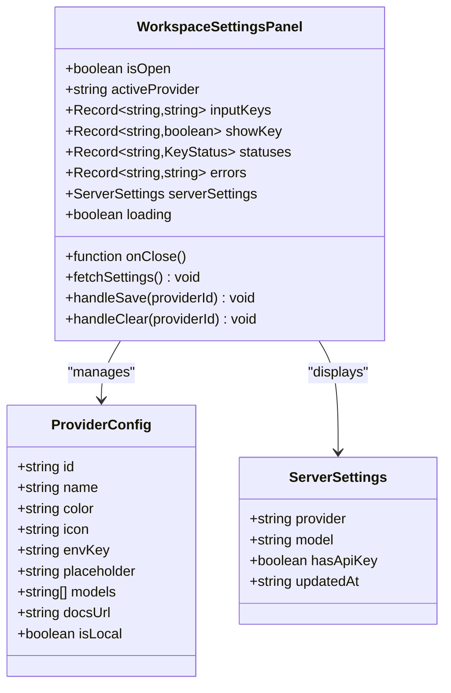
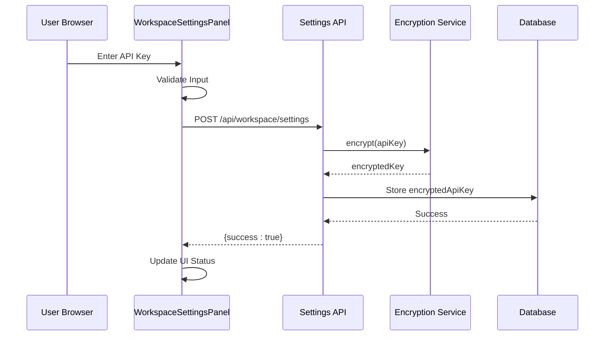
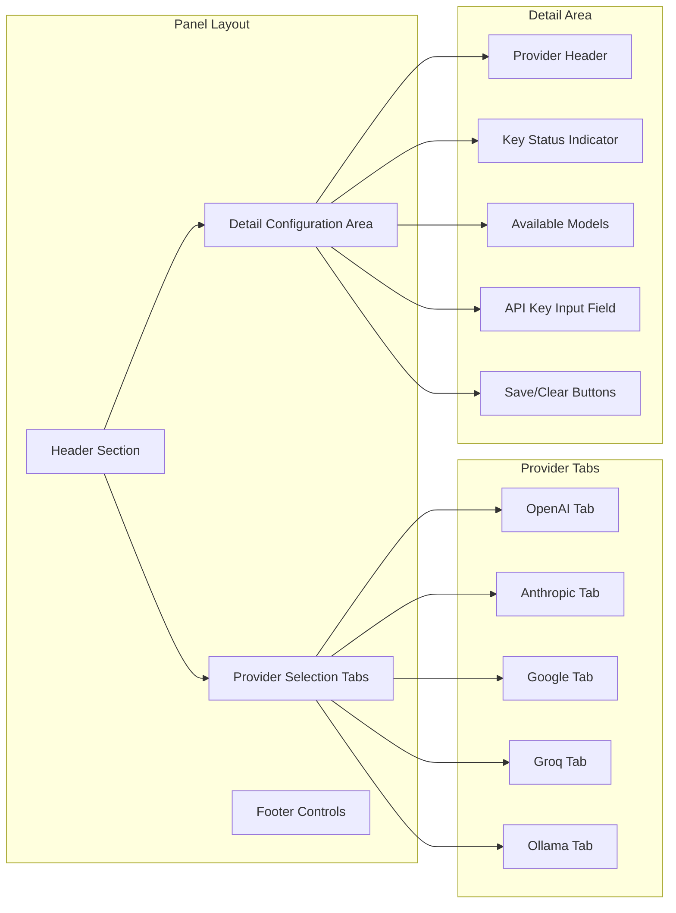
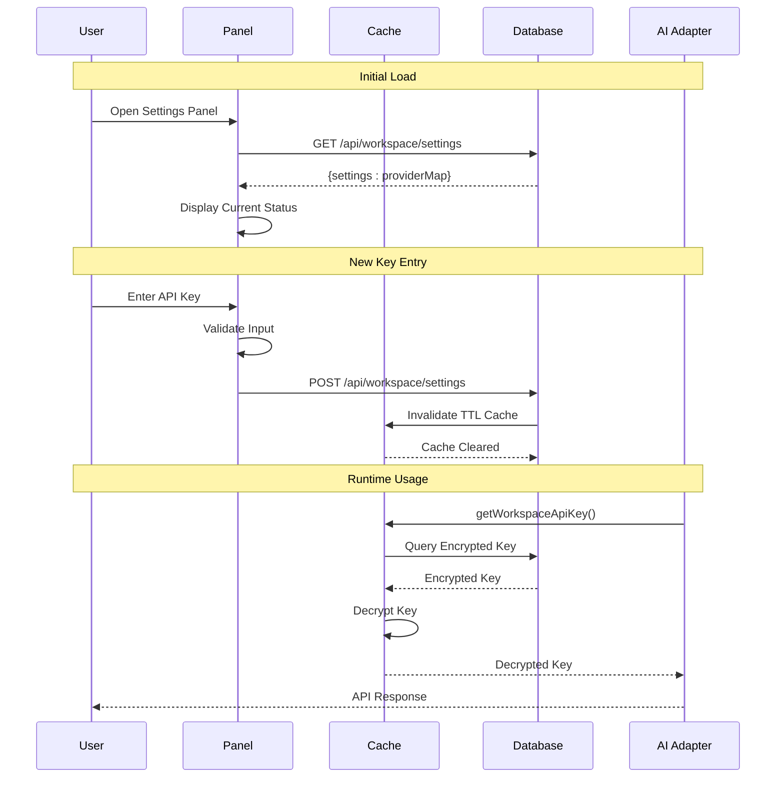
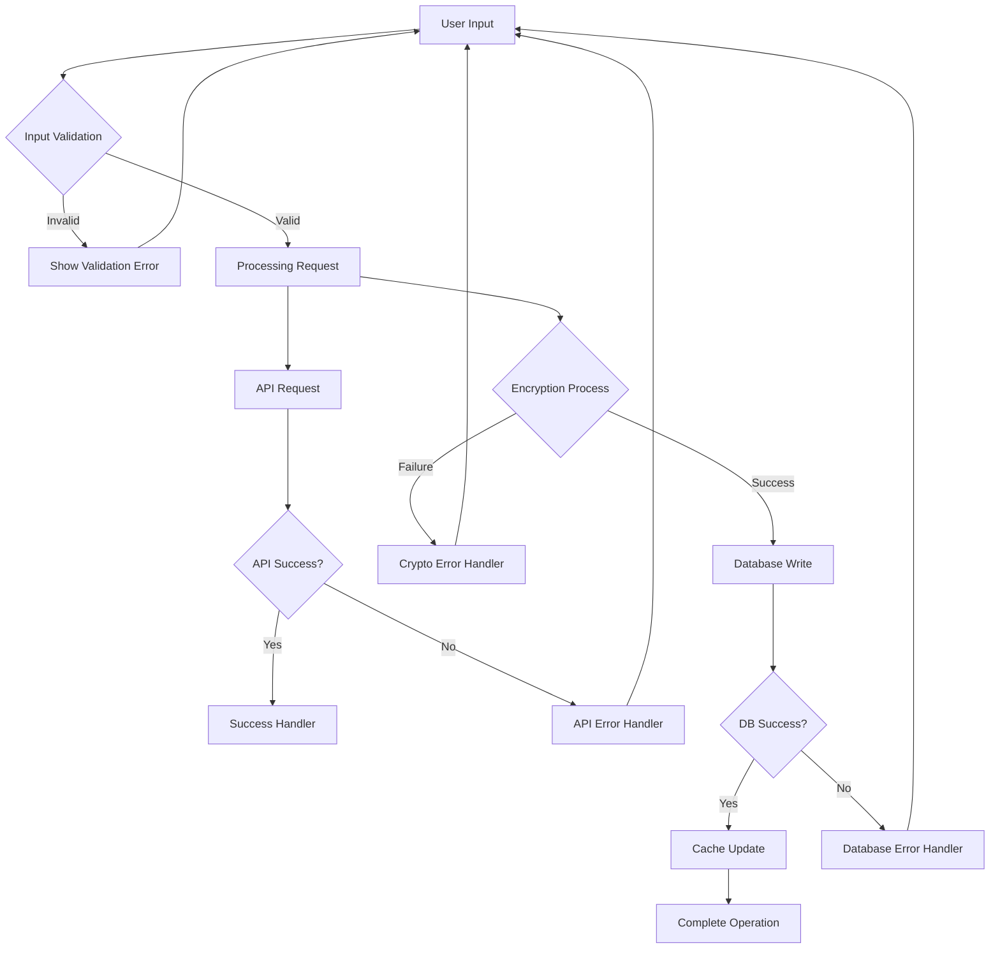
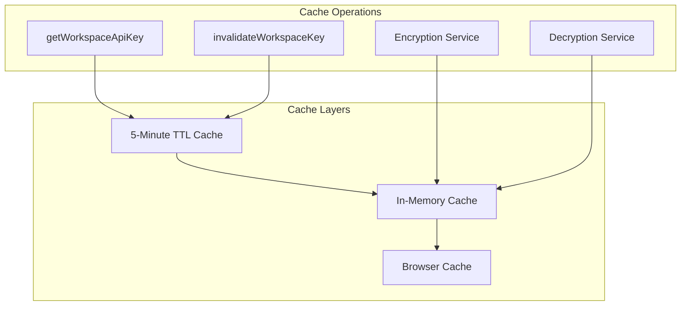

# Workspace Settings Panel

<cite>
**Referenced Files in This Document**
- [WorkspaceSettingsPanel.tsx](file://components/WorkspaceSettingsPanel.tsx)
- [route.ts](file://app/api/workspace/settings/route.ts)
- [encryption.ts](file://lib/security/encryption.ts)
- [workspaceKeyService.ts](file://lib/security/workspaceKeyService.ts)
- [schema.prisma](file://prisma/schema.prisma)
- [Sidebar.tsx](file://components/ide/Sidebar.tsx)
- [ARCHITECTURE.md](file://docs/ARCHITECTURE.md)
</cite>

## Table of Contents
1. [Introduction](#introduction)
2. [System Architecture](#system-architecture)
3. [Core Components](#core-components)
4. [Security Implementation](#security-implementation)
5. [API Integration](#api-integration)
6. [User Interface Design](#user-interface-design)
7. [Data Flow Analysis](#data-flow-analysis)
8. [Error Handling](#error-handling)
9. [Performance Considerations](#performance-considerations)
10. [Troubleshooting Guide](#troubleshooting-guide)
11. [Conclusion](#conclusion)

## Introduction

The Workspace Settings Panel is a critical component of the AI-powered accessibility-first UI engine that manages API key configuration for multiple AI providers. This panel provides a secure, user-friendly interface for developers to configure and manage their workspace-specific API credentials for OpenAI, Anthropic, Google Gemini, Groq, and Ollama providers.

The panel operates as a modal interface that integrates seamlessly with the application's workspace management system, allowing users to securely store their API keys while maintaining strict security protocols to prevent credential exposure.

## System Architecture

The Workspace Settings Panel is part of a larger multi-tenant architecture that separates concerns between frontend presentation, backend API services, and secure credential storage:

```mermaid
graph TB
subgraph "Frontend Layer"
WSPanel[WorkspaceSettingsPanel]
Sidebar[Sidebar Component]
ProviderSelector[ProviderSelector]
end
subgraph "API Layer"
SettingsAPI[GET/POST /api/workspace/settings]
WorkspacesAPI[/api/workspaces]
end
subgraph "Security Layer"
Encryption[Encryption Service]
KeyService[Workspace Key Service]
Cache[TTL Cache]
end
subgraph "Data Layer"
Prisma[Prisma ORM]
Database[(PostgreSQL)]
end
WSPanel --> SettingsAPI
Sidebar --> WSPanel
SettingsAPI --> Encryption
SettingsAPI --> KeyService
SettingsAPI --> Prisma
Prisma --> Database
KeyService --> Cache
KeyService --> Encryption
```

**Diagram sources**
- [WorkspaceSettingsPanel.tsx:96-436](file://components/WorkspaceSettingsPanel.tsx#L96-L436)
- [route.ts:34-147](file://app/api/workspace/settings/route.ts#L34-L147)
- [encryption.ts:27-69](file://lib/security/encryption.ts#L27-L69)

## Core Components

### Frontend Component Structure

The Workspace Settings Panel is implemented as a React component with comprehensive state management and user interaction handling:



**Diagram sources**
- [WorkspaceSettingsPanel.tsx:11-104](file://components/WorkspaceSettingsPanel.tsx#L11-L104)

### Provider Configuration Management

The component supports five major AI providers with specific configuration requirements:

| Provider | API Key Environment Variable | Local Support | Default Models |
|----------|------------------------------|---------------|----------------|
| OpenAI | OPENAI_API_KEY | No | gpt-4o, gpt-4o-mini, gpt-4-turbo |
| Anthropic | ANTHROPIC_API_KEY | No | claude-3-5-sonnet, claude-3-haiku |
| Google Gemini | GOOGLE_API_KEY | No | gemini-2.0-flash, gemini-1.5-pro |
| Groq | GROQ_API_KEY | No | llama-3.3-70b-versatile, mixtral-8x7b |
| Ollama | OLLAMA_API_KEY | Yes | llama3, mistral, codellama |

**Section sources**
- [WorkspaceSettingsPanel.tsx:23-74](file://components/WorkspaceSettingsPanel.tsx#L23-L74)

## Security Implementation

### Encryption and Storage

The system implements robust security measures to protect API credentials:



**Diagram sources**
- [WorkspaceSettingsPanel.tsx:137-169](file://components/WorkspaceSettingsPanel.tsx#L137-L169)
- [route.ts:101-136](file://app/api/workspace/settings/route.ts#L101-L136)
- [encryption.ts:28-44](file://lib/security/encryption.ts#L28-L44)

### Key Validation Process

The system performs comprehensive validation before storing any API keys:

1. **Input Validation**: Ensures the API key is not empty and properly formatted
2. **Provider-Specific Testing**: Makes lightweight API calls to validate credentials
3. **Encryption**: Applies AES-256-GCM encryption before database storage
4. **Cache Invalidation**: Updates in-memory cache to reflect new credentials

**Section sources**
- [route.ts:91-119](file://app/api/workspace/settings/route.ts#L91-L119)
- [encryption.ts:1-95](file://lib/security/encryption.ts#L1-L95)

## API Integration

### Backend Endpoint Design

The `/api/workspace/settings` endpoint provides both GET and POST functionality:

```mermaid
flowchart TD
Start([API Request]) --> Method{HTTP Method}
Method --> |GET| LoadSettings[Load from Database]
LoadSettings --> MapResponse[Map to Provider Structure]
MapResponse --> ReturnSettings[Return {settings}]
Method --> |POST| ParseBody[Parse Request Body]
ParseBody --> ValidateSchema{Validate Schema}
ValidateSchema --> |clear=true| DeleteKey[Delete Stored Key]
ValidateSchema --> |apiKey provided| TestKey[Test API Key]
ValidateSchema --> |no key| ReturnError[Return 400 Error]
TestKey --> EncryptKey[Encrypt Key]
EncryptKey --> UpsertDB[Upsert Database Record]
UpsertDB --> InvalidateCache[Invalidate Cache]
InvalidateCache --> ReturnSuccess[Return Success]
DeleteKey --> InvalidateCache
ReturnError --> End([End])
ReturnSuccess --> End
DeleteKey --> End
```

**Diagram sources**
- [route.ts:34-147](file://app/api/workspace/settings/route.ts#L34-L147)

### Database Schema

The WorkspaceSettings model provides secure credential storage:

| Column | Type | Description |
|--------|------|-------------|
| id | String | Unique identifier |
| workspaceId | String | Workspace association |
| provider | String | AI provider identifier |
| model | String? | Preferred model selection |
| encryptedApiKey | String | AES-256-GCM encrypted key |
| updatedAt | DateTime | Last modification timestamp |

**Section sources**
- [schema.prisma:99-110](file://prisma/schema.prisma#L99-L110)

## User Interface Design

### Modal Interface Structure

The panel follows a clean, accessible design pattern optimized for developer workflows:



**Diagram sources**
- [WorkspaceSettingsPanel.tsx:210-432](file://components/WorkspaceSettingsPanel.tsx#L210-L432)

### Interactive Features

The panel includes several user-friendly features:

- **Real-time Validation**: Immediate feedback on key validity
- **Toggle Visibility**: Secure password masking with show/hide functionality
- **Keyboard Shortcuts**: Escape key closes panel, Enter key triggers save
- **Loading States**: Visual indicators for processing operations
- **Error Handling**: Comprehensive error messaging and recovery options

**Section sources**
- [WorkspaceSettingsPanel.tsx:128-133](file://components/WorkspaceSettingsPanel.tsx#L128-L133)
- [WorkspaceSettingsPanel.tsx:365-415](file://components/WorkspaceSettingsPanel.tsx#L365-L415)

## Data Flow Analysis

### Credential Lifecycle

The system manages API key lifecycle through a comprehensive data flow:



**Diagram sources**
- [workspaceKeyService.ts:32-95](file://lib/security/workspaceKeyService.ts#L32-L95)
- [route.ts:101-136](file://app/api/workspace/settings/route.ts#L101-L136)

### State Management

The component maintains comprehensive state for optimal user experience:

| State Variable | Purpose | Scope | Persistence |
|----------------|---------|-------|-------------|
| `activeProvider` | Currently selected provider | Component | Session |
| `inputKeys` | User-entered API keys | Component | Session |
| `showKey` | Password visibility toggle | Component | Session |
| `statuses` | Operation status tracking | Component | Session |
| `errors` | Error message storage | Component | Session |
| `serverSettings` | Database-stored settings | Component | Session |
| `loading` | Loading state indicator | Component | Session |

**Section sources**
- [WorkspaceSettingsPanel.tsx:96-125](file://components/WorkspaceSettingsPanel.tsx#L96-L125)

## Error Handling

### Comprehensive Error Management

The system implements layered error handling across all components:



**Diagram sources**
- [WorkspaceSettingsPanel.tsx:137-169](file://components/WorkspaceSettingsPanel.tsx#L137-L169)
- [route.ts:142-146](file://app/api/workspace/settings/route.ts#L142-L146)

### Error Categories and Responses

| Error Type | Trigger Condition | User Impact | Recovery Path |
|------------|-------------------|-------------|---------------|
| Input Validation | Empty or malformed key | Immediate feedback | Correct input and retry |
| API Validation | Provider rejects key | Clear error message | Verify key and provider |
| Encryption Failure | Crypto service unavailable | Generic error | Retry operation |
| Database Error | Storage failure | Temporary unavailability | Retry after delay |
| Network Error | Request timeout | Loading state | Manual refresh |

**Section sources**
- [WorkspaceSettingsPanel.tsx:164-168](file://components/WorkspaceSettingsPanel.tsx#L164-L168)
- [route.ts:110-118](file://app/api/workspace/settings/route.ts#L110-L118)

## Performance Considerations

### Caching Strategy

The system implements intelligent caching to minimize database queries and improve response times:



**Diagram sources**
- [workspaceKeyService.ts:100-106](file://lib/security/workspaceKeyService.ts#L100-L106)
- [encryption.ts:27-69](file://lib/security/encryption.ts#L27-L69)

### Optimization Techniques

The implementation includes several performance optimizations:

- **Lazy Loading**: Settings only loaded when panel opens
- **Debounced Requests**: Prevents excessive API calls
- **Efficient State Updates**: Minimal re-renders through proper state management
- **TTL Caching**: Reduces database load for repeated requests
- **Conditional Rendering**: Only renders relevant provider sections

**Section sources**
- [workspaceKeyService.ts:12-24](file://lib/security/workspaceKeyService.ts#L12-L24)
- [WorkspaceSettingsPanel.tsx:105-125](file://components/WorkspaceSettingsPanel.tsx#L105-L125)

## Troubleshooting Guide

### Common Issues and Solutions

#### API Key Validation Failures

**Symptoms**: Key validation fails with "Invalid API key" message
**Causes**: 
- Incorrect API key format
- Provider rate limiting
- Network connectivity issues
- Expired or revoked keys

**Solutions**:
1. Verify API key format matches provider documentation
2. Check provider account status and billing
3. Ensure network connectivity to provider services
4. Regenerate API key if compromised

#### Encryption Service Issues

**Symptoms**: Application throws encryption-related errors
**Causes**:
- Missing ENCRYPTION_SECRET environment variable
- Invalid key length or format
- Corrupted encryption data

**Solutions**:
1. Generate proper 32-byte base64-encoded key
2. Set ENCRYPTION_SECRET in deployment environment
3. Restart application to reload encryption service

#### Database Connection Problems

**Symptoms**: Cannot save or retrieve workspace settings
**Causes**:
- Database connection timeout
- Schema migration issues
- Permission denied errors

**Solutions**:
1. Verify DATABASE_URL environment variable
2. Run database migrations
3. Check user permissions for workspace settings table

**Section sources**
- [encryption.ts:81-94](file://lib/security/encryption.ts#L81-L94)
- [route.ts:51-54](file://app/api/workspace/settings/route.ts#L51-L54)

### Debugging Tools

The system provides several debugging capabilities:

- **Console Logging**: Comprehensive error logging with stack traces
- **Network Inspection**: API request/response inspection
- **State Monitoring**: Real-time state variable monitoring
- **Cache Inspection**: Cache hit/miss ratio tracking

## Conclusion

The Workspace Settings Panel represents a sophisticated implementation of secure credential management for AI-powered applications. Through its comprehensive security model, intuitive user interface, and robust error handling, it provides developers with a reliable foundation for managing workspace-specific API credentials.

The panel's architecture demonstrates best practices in modern web development, including proper separation of concerns, comprehensive error handling, and performance optimization. Its integration with the broader system ensures seamless operation within the multi-tenant workspace management framework.

Key strengths of the implementation include:
- **Security-First Design**: End-to-end encryption with secure storage
- **Developer Experience**: Intuitive interface with comprehensive feedback
- **Reliability**: Robust error handling and recovery mechanisms
- **Performance**: Intelligent caching and efficient resource management
- **Extensibility**: Modular design supporting future provider additions

This component serves as a critical foundation for the AI-powered accessibility-first UI engine, enabling secure and scalable AI integration while maintaining the highest standards of security and user experience.