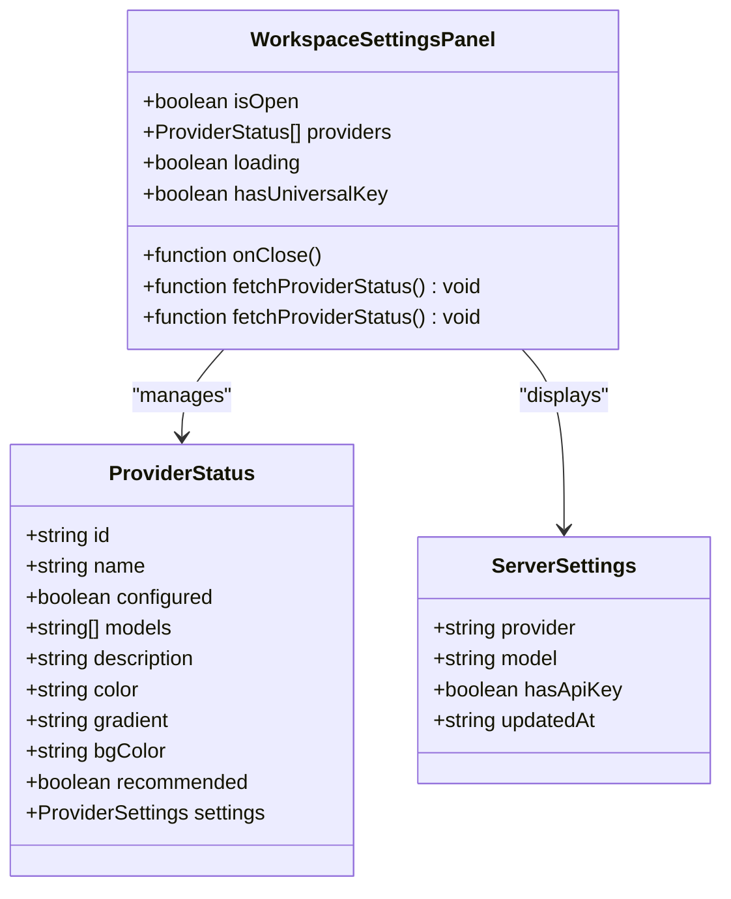
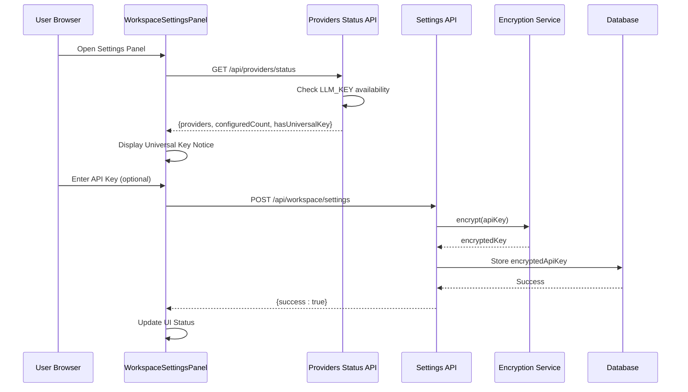
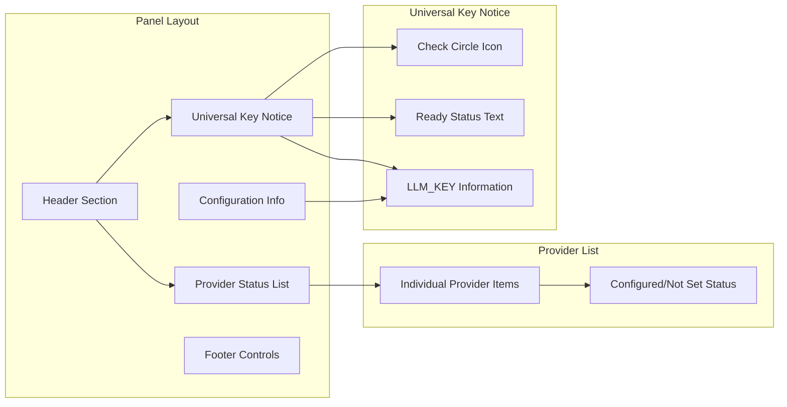
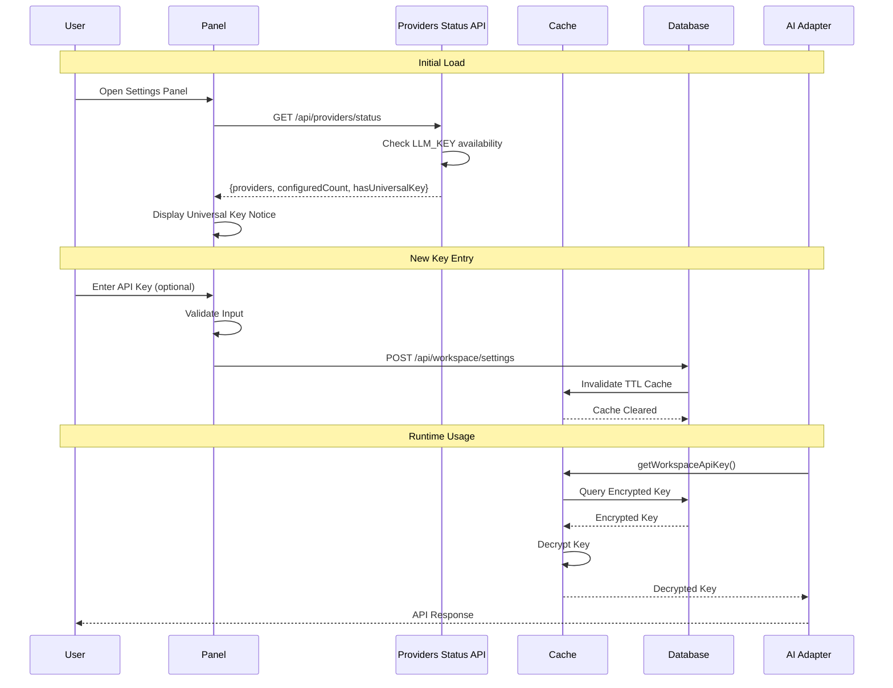
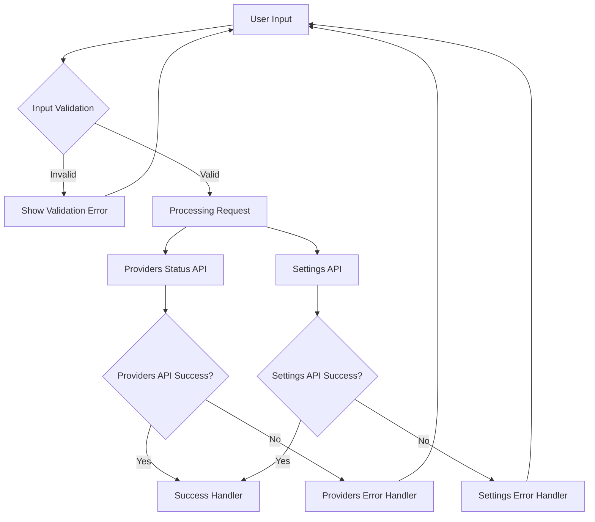
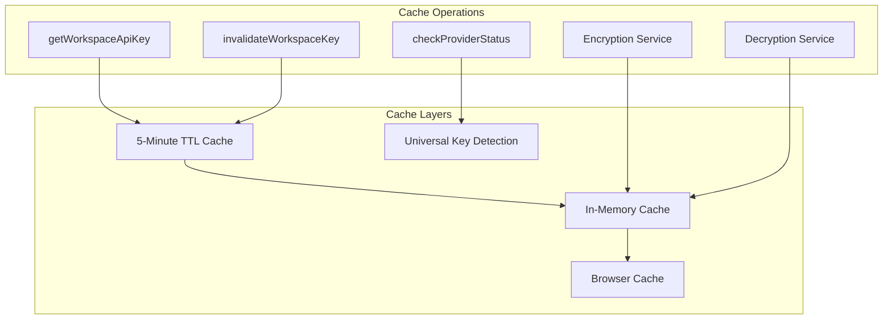

# Workspace Settings Panel

<cite>
**Referenced Files in This Document**
- [WorkspaceSettingsPanel.tsx](file://components/WorkspaceSettingsPanel.tsx)
- [route.ts](file://app/api/workspace/settings/route.ts)
- [route.ts](file://app/api/providers/status/route.ts)
- [encryption.ts](file://lib/security/encryption.ts)
- [workspaceKeyService.ts](file://lib/security/workspaceKeyService.ts)
- [schema.prisma](file://prisma/schema.prisma)
- [Sidebar.tsx](file://components/ide/Sidebar.tsx)
- [resolveDefaultAdapter.ts](file://lib/ai/resolveDefaultAdapter.ts)
- [index.ts](file://lib/ai/adapters/index.ts)
- [migration.sql](file://prisma/migrations/20260403065359_init_workspace_settings/migration.sql)
</cite>

## Update Summary
**Changes Made**
- Updated Provider Configuration section to reflect database-driven configuration replacing localStorage
- Revised API Integration section to reflect universal LLM_KEY support and enhanced provider selection logic
- Updated Security Implementation section to reflect database-backed credential storage with universal key support
- Modified troubleshooting guidance to reflect database configuration process
- Enhanced user interface documentation to reflect streamlined provider status display with universal key detection

## Table of Contents
1. [Introduction](#introduction)
2. [System Architecture](#system-architecture)
3. [Core Components](#core-components)
4. [Security Implementation](#security-implementation)
5. [API Integration](#api-integration)
6. [User Interface Design](#user-interface-design)
7. [Data Flow Analysis](#data-flow-analysis)
8. [Error Handling](#error-handling)
9. [Performance Considerations](#performance-considerations)
10. [Troubleshooting Guide](#troubleshooting-guide)
11. [Conclusion](#conclusion)

## Introduction

The Workspace Settings Panel is a critical component of the AI-powered accessibility-first UI engine that manages API key configuration for multiple AI providers. This panel provides a secure, user-friendly interface for developers to configure and manage their workspace-specific API credentials for OpenAI, Anthropic, Google Gemini, Groq, and Ollama providers.

The panel operates as a streamlined modal interface that integrates seamlessly with the application's workspace management system, allowing users to securely store their API keys while maintaining strict security protocols to prevent credential exposure. **Updated**: The panel now features database-driven configuration with universal LLM_KEY support, eliminating the need for localStorage and providing simplified provider management.

## System Architecture

The Workspace Settings Panel is part of a larger multi-tenant architecture that separates concerns between frontend presentation, backend API services, and secure credential storage:

```mermaid
graph TB
subgraph "Frontend Layer"
WSPanel[WorkspaceSettingsPanel]
Sidebar[Sidebar Component]
ProviderStatus[Providers Status API]
end
subgraph "API Layer"
SettingsAPI[GET/POST /api/workspace/settings]
ProvidersAPI[GET /api/providers/status]
WorkspacesAPI[/api/workspaces]
end
subgraph "Security Layer"
Encryption[Encryption Service]
KeyService[Workspace Key Service]
Cache[TTL Cache]
UniversalKey[LLM_KEY Support]
end
subgraph "Data Layer"
Prisma[Prisma ORM]
Database[(PostgreSQL)]
end
WSPanel --> ProvidersAPI
WSPanel --> SettingsAPI
Sidebar --> WSPanel
ProvidersAPI --> UniversalKey
SettingsAPI --> Encryption
SettingsAPI --> KeyService
SettingsAPI --> Prisma
Prisma --> Database
KeyService --> Cache
KeyService --> Encryption
```

**Diagram sources**
- [WorkspaceSettingsPanel.tsx:32-210](file://components/WorkspaceSettingsPanel.tsx#L32-L210)
- [route.ts:34-147](file://app/api/workspace/settings/route.ts#L34-L147)
- [route.ts:137-214](file://app/api/providers/status/route.ts#L137-L214)
- [encryption.ts:27-69](file://lib/security/encryption.ts#L27-L69)

## Core Components

### Frontend Component Structure

The Workspace Settings Panel is implemented as a streamlined React component with comprehensive state management and user interaction handling:



**Diagram sources**
- [WorkspaceSettingsPanel.tsx:18-28](file://components/WorkspaceSettingsPanel.tsx#L18-L28)

### Provider Configuration Management

The component supports five major AI providers with streamlined configuration management and universal key support:

| Provider | API Key Environment Variable | Universal Key Support | Default Models |
|----------|------------------------------|----------------------|----------------|
| OpenAI | OPENAI_API_KEY | ✅ Yes | gpt-4o, gpt-4o-mini, gpt-4-turbo |
| Anthropic | ANTHROPIC_API_KEY | ✅ Yes | claude-3-5-sonnet, claude-3-opus |
| Google Gemini | GOOGLE_API_KEY/GEMINI_API_KEY | ✅ Yes | gemini-2.0-flash, gemini-1.5-pro |
| Groq | GROQ_API_KEY | ✅ Yes | llama-3.3-70b-versatile, mixtral-8x7b |
| Ollama | OLLAMA_API_KEY | ✅ Yes | llama3, mistral, codellama |

**Updated**: All providers now support the universal LLM_KEY environment variable, eliminating the need for separate provider-specific keys. The panel now features database-driven configuration with automatic provider status detection.

**Section sources**
- [WorkspaceSettingsPanel.tsx:10-16](file://components/WorkspaceSettingsPanel.tsx#L10-L16)
- [route.ts:142-166](file://app/api/providers/status/route.ts#L142-L166)

## Security Implementation

### Universal Key and Encryption

The system implements robust security measures with universal key support to protect API credentials:



**Diagram sources**
- [WorkspaceSettingsPanel.tsx:124-136](file://components/WorkspaceSettingsPanel.tsx#L124-L136)
- [route.ts:142-166](file://app/api/providers/status/route.ts#L142-L166)
- [route.ts:101-136](file://app/api/workspace/settings/route.ts#L101-L136)
- [encryption.ts:28-44](file://lib/security/encryption.ts#L28-L44)

### Key Validation Process

The system performs comprehensive validation with universal key support before storing any API keys:

1. **Universal Key Detection**: Checks for LLM_KEY environment variable availability
2. **Input Validation**: Ensures the API key is not empty and properly formatted
3. **Provider-Specific Testing**: Makes lightweight API calls to validate credentials for all providers except Ollama
4. **Encryption**: Applies AES-256-GCM encryption before database storage
5. **Cache Invalidation**: Updates in-memory cache to reflect new credentials

**Updated**: Validation now includes universal key support, allowing users to configure a single key for all providers. The system automatically detects LLM_KEY presence and marks all providers as configured.

**Section sources**
- [route.ts:91-119](file://app/api/workspace/settings/route.ts#L91-L119)
- [route.ts:142-166](file://app/api/providers/status/route.ts#L142-L166)
- [encryption.ts:1-95](file://lib/security/encryption.ts#L1-L95)

## API Integration

### Backend Endpoint Design

The `/api/workspace/settings` and `/api/providers/status` endpoints provide streamlined functionality with universal key support:

```mermaid
flowchart TD
Start([API Request]) --> Method{HTTP Method}
Method --> |GET| LoadProviders[Load Provider Status]
LoadProviders --> CheckUniversal{Check LLM_KEY}
CheckUniversal --> MapResponse[Map to Provider Structure]
MapResponse --> ReturnProviders[Return {providers, configuredCount, hasUniversalKey}]
Method --> |POST| ParseBody[Parse Request Body]
ParseBody --> ValidateSchema{Validate Schema}
ValidateSchema --> |clear=true| DeleteKey[Delete Stored Key]
ValidateSchema --> |apiKey provided| TestKey[Test API Key Uniformly]
ValidateSchema --> |no key| ReturnError[Return 400 Error]
TestKey --> EncryptKey[Encrypt Key]
EncryptKey --> UpsertDB[Upsert Database Record]
UpsertDB --> InvalidateCache[Invalidate Cache]
InvalidateCache --> ReturnSuccess[Return Success]
DeleteKey --> InvalidateCache
ReturnError --> End([End])
ReturnSuccess --> End
DeleteKey --> End
```

**Diagram sources**
- [route.ts:34-147](file://app/api/workspace/settings/route.ts#L34-L147)
- [route.ts:137-214](file://app/api/providers/status/route.ts#L137-L214)

### Database Schema

The WorkspaceSettings model provides secure credential storage with universal key support:

| Column | Type | Description |
|--------|------|-------------|
| id | String | Unique identifier |
| workspaceId | String | Workspace association |
| provider | String | AI provider identifier |
| model | String? | Preferred model selection |
| encryptedApiKey | String | AES-256-GCM encrypted key |
| updatedAt | DateTime | Last modification timestamp |

**Updated**: The database schema now supports workspace-specific API key storage with unique constraints on (workspaceId, provider) pairs, enabling multi-tenant configuration management.

**Section sources**
- [schema.prisma:99-110](file://prisma/schema.prisma#L99-L110)
- [migration.sql:1-32](file://prisma/migrations/20260403065359_init_workspace_settings/migration.sql#L1-L32)

## User Interface Design

### Streamlined Modal Interface

The panel follows a clean, accessible design pattern optimized for developer workflows with universal key support:



**Diagram sources**
- [WorkspaceSettingsPanel.tsx:71-210](file://components/WorkspaceSettingsPanel.tsx#L71-L210)

### Interactive Features

The panel includes several user-friendly features with universal key support:

- **Universal Key Detection**: Automatic detection and display of LLM_KEY configuration
- **Real-time Provider Status**: Immediate feedback on provider configuration status
- **Toggle Visibility**: Secure password masking with show/hide functionality
- **Keyboard Shortcuts**: Escape key closes panel, Enter key triggers save
- **Loading States**: Visual indicators for processing operations
- **Error Handling**: Comprehensive error messaging and recovery options
- **Environment Variable Fallback**: Consistent behavior across all providers with universal support

**Updated**: The panel now features a universal key notice that displays when LLM_KEY is configured, simplifying the user experience and eliminating the need for separate provider-specific key entries.

**Section sources**
- [WorkspaceSettingsPanel.tsx:124-136](file://components/WorkspaceSettingsPanel.tsx#L124-L136)
- [WorkspaceSettingsPanel.tsx:142-190](file://components/WorkspaceSettingsPanel.tsx#L142-L190)

## Data Flow Analysis

### Credential Lifecycle with Universal Key Support

The system manages API key lifecycle through a streamlined data flow with universal key support:



**Diagram sources**
- [workspaceKeyService.ts:32-95](file://lib/security/workspaceKeyService.ts#L32-L95)
- [route.ts:101-136](file://app/api/workspace/settings/route.ts#L101-L136)
- [route.ts:142-166](file://app/api/providers/status/route.ts#L142-L166)

### State Management

The component maintains streamlined state for optimal user experience:

| State Variable | Purpose | Scope | Persistence |
|----------------|---------|-------|-------------|
| `providers` | Provider configuration status | Component | Session |
| `loading` | Loading state indicator | Component | Session |
| `hasUniversalKey` | Universal key availability | Component | Session |

**Updated**: The panel now uses database-driven state management, eliminating the need for localStorage and providing persistent configuration across browser sessions.

**Section sources**
- [WorkspaceSettingsPanel.tsx:32-36](file://components/WorkspaceSettingsPanel.tsx#L32-L36)

## Error Handling

### Comprehensive Error Management

The system implements layered error handling across all components with universal provider support:



**Diagram sources**
- [WorkspaceSettingsPanel.tsx:38-52](file://components/WorkspaceSettingsPanel.tsx#L38-L52)
- [route.ts:142-146](file://app/api/workspace/settings/route.ts#L142-L146)
- [route.ts:208-213](file://app/api/providers/status/route.ts#L208-L213)

### Error Categories and Responses

| Error Type | Trigger Condition | User Impact | Recovery Path |
|------------|-------------------|-------------|---------------|
| Input Validation | Empty or malformed key | Immediate feedback | Correct input and retry |
| Providers API Error | Status endpoint failure | Unable to load provider status | Retry after delay |
| Settings API Error | Provider configuration failure | Unable to save settings | Check key format and provider |
| Encryption Failure | Crypto service unavailable | Generic error | Retry operation |
| Database Error | Storage failure | Temporary unavailability | Retry after delay |
| Network Error | Request timeout | Loading state | Manual refresh |

**Updated**: Error handling now includes database-specific error responses and improved provider status detection with universal key support.

**Section sources**
- [WorkspaceSettingsPanel.tsx:47-51](file://components/WorkspaceSettingsPanel.tsx#L47-L51)
- [route.ts:110-118](file://app/api/workspace/settings/route.ts#L110-L118)
- [route.ts:208-213](file://app/api/providers/status/route.ts#L208-L213)

## Performance Considerations

### Caching Strategy

The system implements intelligent caching to minimize database queries and improve response times:



**Diagram sources**
- [workspaceKeyService.ts:100-106](file://lib/security/workspaceKeyService.ts#L100-L106)
- [encryption.ts:27-69](file://lib/security/encryption.ts#L27-L69)
- [route.ts:142-166](file://app/api/providers/status/route.ts#L142-L166)

### Optimization Techniques

The implementation includes several performance optimizations:

- **Lazy Loading**: Settings only loaded when panel opens
- **Universal Key Detection**: Single API call to check all provider configurations
- **Efficient State Updates**: Minimal re-renders through proper state management
- **TTL Caching**: Reduces database load for repeated requests
- **Conditional Rendering**: Only renders relevant provider sections
- **Debounced Requests**: Prevents excessive API calls

**Updated**: The panel now features universal key detection that reduces the number of API calls needed to check provider status, and database-driven caching eliminates the need for localStorage persistence.

**Section sources**
- [workspaceKeyService.ts:12-24](file://lib/security/workspaceKeyService.ts#L12-L24)
- [WorkspaceSettingsPanel.tsx:38-57](file://components/WorkspaceSettingsPanel.tsx#L38-L57)

## Troubleshooting Guide

### Common Issues and Solutions

#### API Key Validation Failures

**Symptoms**: Key validation fails with "Invalid API key" message
**Causes**: 
- Incorrect API key format
- Provider rate limiting
- Network connectivity issues
- Expired or revoked keys

**Solutions**:
1. Verify API key format matches provider documentation
2. Check provider account status and billing
3. Ensure network connectivity to provider services
4. Regenerate API key if compromised

#### Universal Key Issues

**Symptoms**: Universal LLM_KEY not detected despite being configured
**Causes**:
- LLM_KEY not properly set in deployment environment
- Environment variable not accessible to the application
- Vercel environment variable configuration issues

**Solutions**:
1. Verify LLM_KEY is set in Vercel environment variables
2. Check that the variable is available to the application
3. Restart the application to reload environment variables
4. Test the key format and ensure it meets provider requirements

#### Database Connection Problems

**Symptoms**: Cannot save or retrieve workspace settings
**Causes**:
- Database connection timeout
- Schema migration issues
- Permission denied errors

**Solutions**:
1. Verify DATABASE_URL environment variable
2. Run database migrations
3. Check user permissions for workspace settings table

#### Encryption Service Issues

**Symptoms**: Application throws encryption-related errors
**Causes**:
- Missing ENCRYPTION_SECRET environment variable
- Invalid key length or format
- Corrupted encryption data

**Solutions**:
1. Generate proper 32-byte base64-encoded key
2. Set ENCRYPTION_SECRET in deployment environment
3. Restart application to reload encryption service

**Updated**: Removed Ollama-specific troubleshooting steps as the panel now treats all providers uniformly with universal key support. All providers follow the same validation and configuration process through the universal LLM_KEY mechanism.

**Section sources**
- [encryption.ts:81-94](file://lib/security/encryption.ts#L81-L94)
- [route.ts:51-54](file://app/api/workspace/settings/route.ts#L51-L54)

### Debugging Tools

The system provides several debugging capabilities:

- **Console Logging**: Comprehensive error logging with stack traces
- **Network Inspection**: API request/response inspection
- **State Monitoring**: Real-time state variable monitoring
- **Cache Inspection**: Cache hit/miss ratio tracking
- **Universal Key Detection**: Debug information for LLM_KEY configuration

**Updated**: The providers status endpoint now includes debug information for universal key detection and provider configuration status, helping developers troubleshoot configuration issues.

## Conclusion

The Workspace Settings Panel represents a streamlined implementation of secure credential management for AI-powered applications. Through its comprehensive security model, intuitive user interface, and robust error handling, it provides developers with a reliable foundation for managing workspace-specific API credentials.

**Updated**: The panel's architecture now demonstrates database-driven configuration with universal LLM_KEY support, eliminating the need for separate provider-specific keys and localStorage persistence. This streamlining improves maintainability while ensuring consistent user experience across all supported AI providers.

Key strengths of the implementation include:
- **Universal Key Support**: Single LLM_KEY configuration for all providers
- **Database-Driven Configuration**: Persistent storage with workspace-specific isolation
- **Security-First Design**: End-to-end encryption with secure storage
- **Developer Experience**: Intuitive interface with comprehensive feedback
- **Reliability**: Robust error handling and recovery mechanisms
- **Performance**: Intelligent caching and efficient resource management
- **Simplicity**: Streamlined architecture without unnecessary complexity
- **Extensibility**: Modular design supporting future provider additions

This component serves as a critical foundation for the AI-powered accessibility-first UI engine, enabling secure and scalable AI integration while maintaining the highest standards of security and user experience.